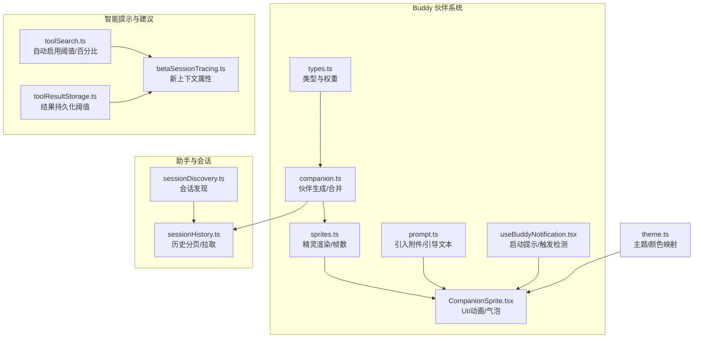
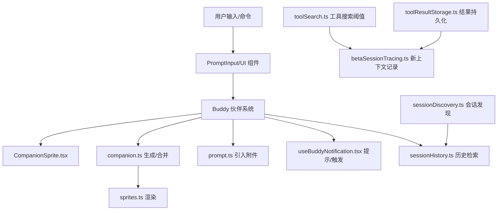
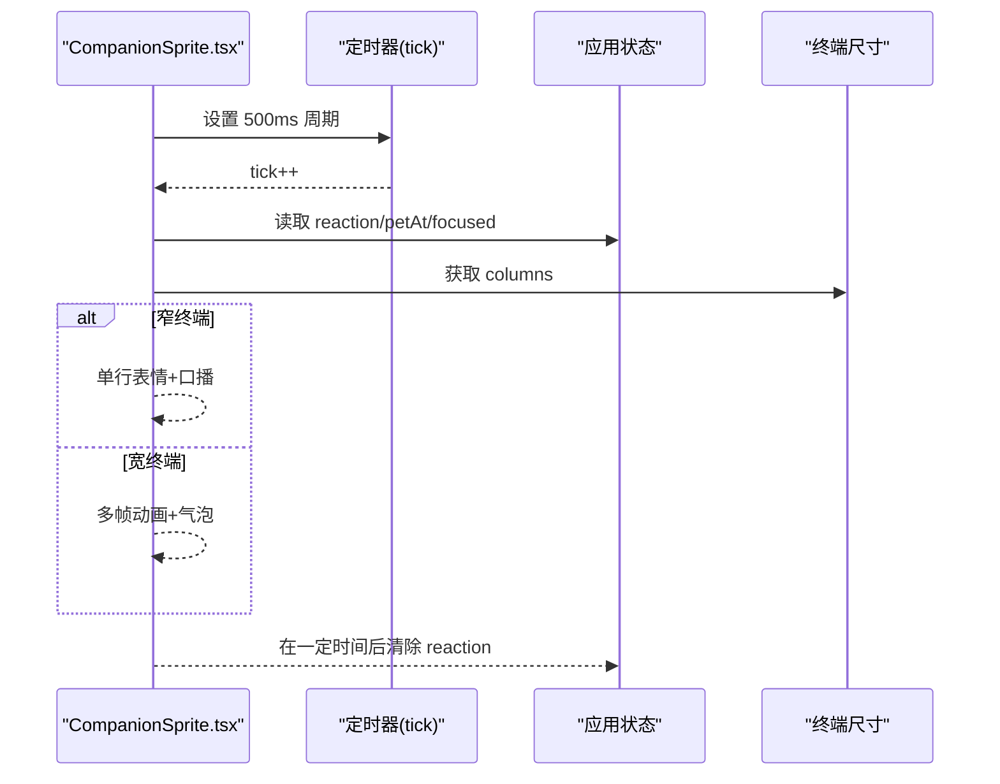
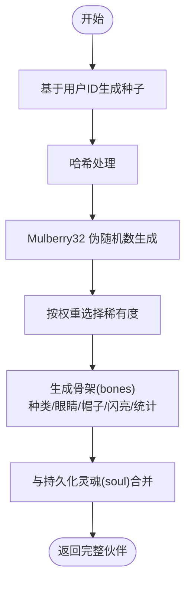
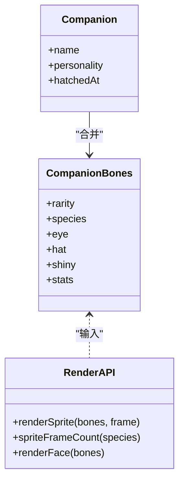
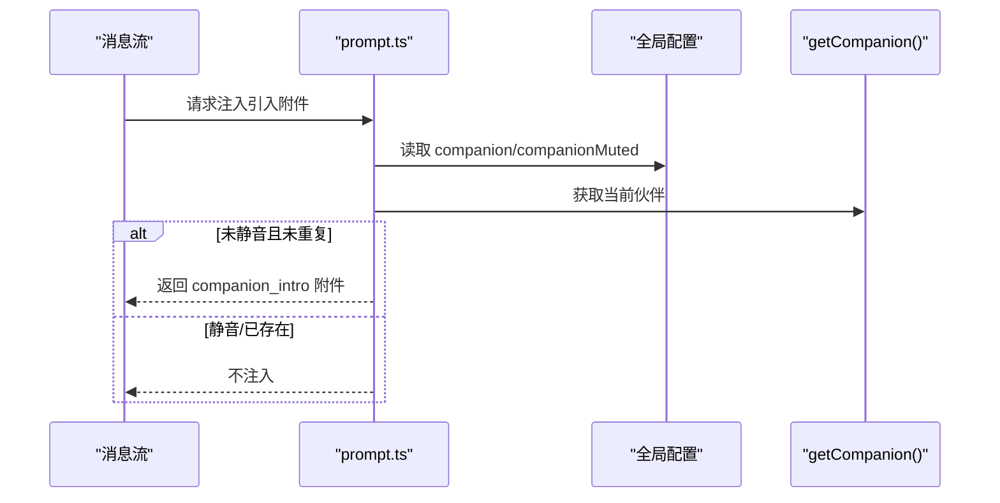
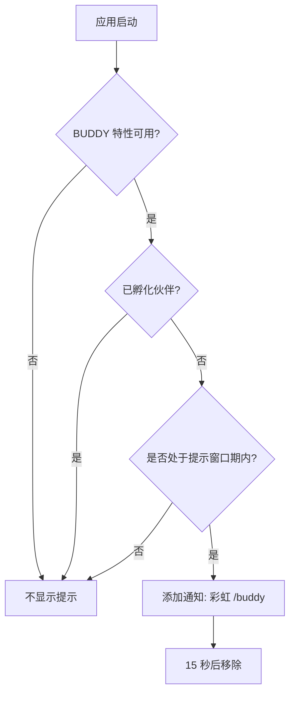
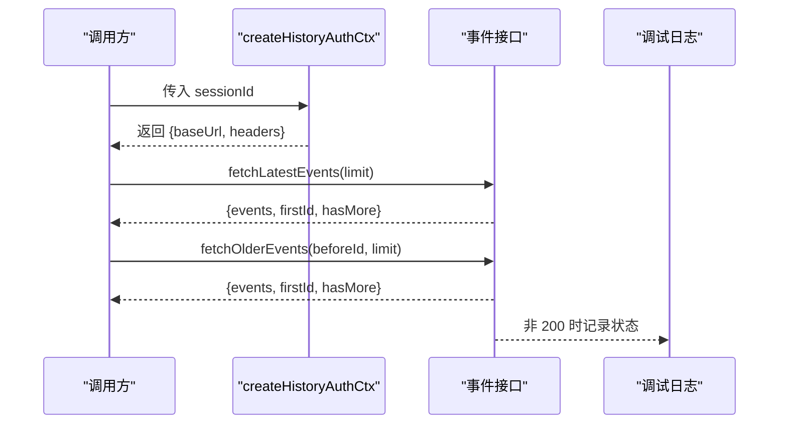
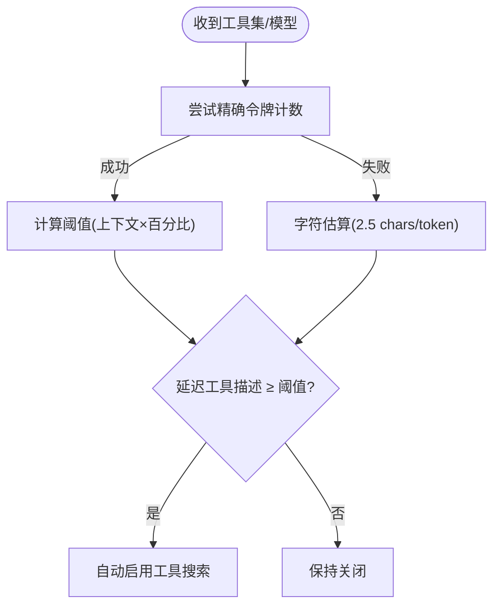
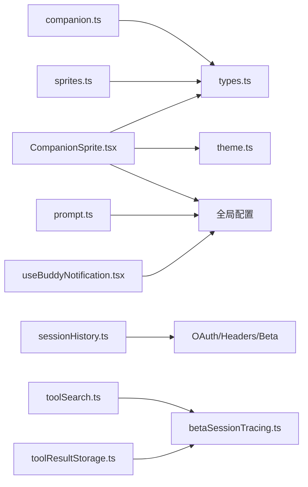

# AI 助手功能

<cite>
**本文引用的文件**
- [CompanionSprite.tsx](file://src/buddy/CompanionSprite.tsx)
- [companion.ts](file://src/buddy/companion.ts)
- [prompt.ts](file://src/buddy/prompt.ts)
- [sprites.ts](file://src/buddy/sprites.ts)
- [types.ts](file://src/buddy/types.ts)
- [useBuddyNotification.tsx](file://src/buddy/useBuddyNotification.tsx)
- [sessionHistory.ts](file://src/assistant/sessionHistory.ts)
- [sessionDiscovery.ts](file://src/assistant/sessionDiscovery.ts)
- [theme.ts](file://src/utils/theme.ts)
- [toolSearch.ts](file://src/utils/toolSearch.ts)
- [toolResultStorage.ts](file://src/utils/toolResultStorage.ts)
- [betaSessionTracing.ts](file://src/utils/telemetry/betaSessionTracing.ts)
</cite>

## 目录
1. [简介](#简介)
2. [项目结构](#项目结构)
3. [核心组件](#核心组件)
4. [架构总览](#架构总览)
5. [详细组件分析](#详细组件分析)
6. [依赖关系分析](#依赖关系分析)
7. [性能考量](#性能考量)
8. [故障排查指南](#故障排查指南)
9. [结论](#结论)
10. [附录](#附录)

## 简介
本文件系统性阐述 Claude Code 中的 AI 助手功能，重点围绕 Buddy 伙伴系统展开：从助手精灵（CompanionSprite）的渲染与交互，到对话历史的发现与检索，再到智能提示与建议系统的设计与实现。文档同时覆盖个性化设定、上下文感知建议、提示优化策略、以及如何基于用户偏好定制助手行为与外观。

## 项目结构
Buddy 伙伴系统位于 src/buddy 下，核心文件包括：
- 类型与数据模型：types.ts
- 伙伴生成与持久化：companion.ts
- 精灵渲染与动画：sprites.ts、CompanionSprite.tsx
- 对话引导与引入附件：prompt.ts
- 启动提示与触发检测：useBuddyNotification.tsx
- 会话历史检索：sessionHistory.ts、sessionDiscovery.ts
- 主题与颜色映射：theme.ts
- 智能提示与建议系统：工具搜索阈值与持久化策略（toolSearch.ts、toolResultStorage.ts）
- 会话追踪与上下文记录：betaSessionTracing.ts

**图表来源**
- [types.ts:1-149](file://src/buddy/types.ts#L1-L149)
- [companion.ts:1-134](file://src/buddy/companion.ts#L1-L134)
- [sprites.ts:1-515](file://src/buddy/sprites.ts#L1-L515)
- [CompanionSprite.tsx:1-371](file://src/buddy/CompanionSprite.tsx#L1-L371)
- [prompt.ts:1-37](file://src/buddy/prompt.ts#L1-L37)
- [useBuddyNotification.tsx:1-98](file://src/buddy/useBuddyNotification.tsx#L1-L98)
- [sessionHistory.ts:1-88](file://src/assistant/sessionHistory.ts#L1-L88)
- [sessionDiscovery.ts:1-4](file://src/assistant/sessionDiscovery.ts#L1-L4)
- [toolSearch.ts:44-117](file://src/utils/toolSearch.ts#L44-L117)
- [toolResultStorage.ts:36-78](file://src/utils/toolResultStorage.ts#L36-L78)
- [betaSessionTracing.ts:207-259](file://src/utils/telemetry/betaSessionTracing.ts#L207-L259)
- [theme.ts:66-109](file://src/utils/theme.ts#L66-L109)

**章节来源**
- [types.ts:1-149](file://src/buddy/types.ts#L1-L149)
- [companion.ts:1-134](file://src/buddy/companion.ts#L1-L134)
- [sprites.ts:1-515](file://src/buddy/sprites.ts#L1-L515)
- [CompanionSprite.tsx:1-371](file://src/buddy/CompanionSprite.tsx#L1-L371)
- [prompt.ts:1-37](file://src/buddy/prompt.ts#L1-L37)
- [useBuddyNotification.tsx:1-98](file://src/buddy/useBuddyNotification.tsx#L1-L98)
- [sessionHistory.ts:1-88](file://src/assistant/sessionHistory.ts#L1-L88)
- [sessionDiscovery.ts:1-4](file://src/assistant/sessionDiscovery.ts#L1-L4)
- [toolSearch.ts:44-117](file://src/utils/toolSearch.ts#L44-L117)
- [toolResultStorage.ts:36-78](file://src/utils/toolResultStorage.ts#L36-L78)
- [betaSessionTracing.ts:207-259](file://src/utils/telemetry/betaSessionTracing.ts#L207-L259)
- [theme.ts:66-109](file://src/utils/theme.ts#L66-L109)

## 核心组件
- 伙伴类型与权重：定义稀有度、种类、眼睛、帽子、统计项等，提供稀有度权重与颜色映射。
- 伙伴生成器：基于用户 ID 的确定性哈希，生成可再生的“骨架”（bones），与持久化的“灵魂”（soul）合并得到最终伙伴。
- 精灵渲染器：按种类提供多帧动画，支持帽子与眼睛替换，并在无帽子且首行为空时去除空帽槽以节省空间。
- 伙伴精灵 UI：负责定时器驱动的帧切换、眨眼、说话气泡、宠物互动的心形特效、窄终端适配与全屏模式下的浮动气泡。
- 对话引导：当首次出现且未静音时，向消息流注入“伙伴引入”附件，避免重复提示。
- 启动提示与触发检测：在特定窗口期内显示彩虹色“/buddy”提示；提供触发位置检测用于输入高亮与响应。
- 会话历史：提供最新事件与更旧事件的分页拉取，支持锚定到最新与游标前翻页。
- 智能提示与建议：通过工具搜索阈值与字符/令牌估算，自动启用工具搜索；通过结果持久化阈值控制工具输出的持久化策略；通过会话追踪记录新上下文与系统提示信息。

**章节来源**
- [types.ts:1-149](file://src/buddy/types.ts#L1-L149)
- [companion.ts:104-134](file://src/buddy/companion.ts#L104-L134)
- [sprites.ts:454-515](file://src/buddy/sprites.ts#L454-L515)
- [CompanionSprite.tsx:162-290](file://src/buddy/CompanionSprite.tsx#L162-L290)
- [prompt.ts:15-37](file://src/buddy/prompt.ts#L15-L37)
- [useBuddyNotification.tsx:43-98](file://src/buddy/useBuddyNotification.tsx#L43-L98)
- [sessionHistory.ts:30-88](file://src/assistant/sessionHistory.ts#L30-L88)
- [toolSearch.ts:44-117](file://src/utils/toolSearch.ts#L44-L117)
- [toolResultStorage.ts:36-78](file://src/utils/toolResultStorage.ts#L36-L78)
- [betaSessionTracing.ts:207-259](file://src/utils/telemetry/betaSessionTracing.ts#L207-L259)

## 架构总览
下图展示了 Buddy 伙伴系统与助手交互、历史检索、智能提示之间的整体关系：

**图表来源**
- [CompanionSprite.tsx:176-290](file://src/buddy/CompanionSprite.tsx#L176-L290)
- [companion.ts:107-134](file://src/buddy/companion.ts#L107-L134)
- [sprites.ts:454-515](file://src/buddy/sprites.ts#L454-L515)
- [prompt.ts:15-37](file://src/buddy/prompt.ts#L15-L37)
- [useBuddyNotification.tsx:43-98](file://src/buddy/useBuddyNotification.tsx#L43-L98)
- [sessionHistory.ts:30-88](file://src/assistant/sessionHistory.ts#L30-L88)
- [sessionDiscovery.ts:1-4](file://src/assistant/sessionDiscovery.ts#L1-L4)
- [toolSearch.ts:44-117](file://src/utils/toolSearch.ts#L44-L117)
- [toolResultStorage.ts:36-78](file://src/utils/toolResultStorage.ts#L36-L78)
- [betaSessionTracing.ts:207-259](file://src/utils/telemetry/betaSessionTracing.ts#L207-L259)

## 详细组件分析

### 伙伴精灵（CompanionSprite）与 UI 动画
- 定时器与帧循环：每 500ms 增量 tick，依据序列或随机帧进行精灵动画；眨眼通过替换眼部字符实现。
- 说话气泡：根据剩余时间计算淡出阶段，窄终端仅显示一行“口播”，全屏模式通过独立浮动层渲染气泡。
- 宠物互动：短时的心形特效随 tick 上移，增强交互反馈。
- 终端宽度适配：在列数不足时折叠为单行表情与名称，避免布局拥挤；保留输入区域预留宽度。

**图表来源**
- [CompanionSprite.tsx:162-290](file://src/buddy/CompanionSprite.tsx#L162-L290)

**章节来源**
- [CompanionSprite.tsx:162-290](file://src/buddy/CompanionSprite.tsx#L162-L290)

### 伙伴生成与个性化（Bones 与 Soul 合并）
- 确定性生成：以用户 ID 为种子，经哈希与乘法布里（Mulberry32）伪随机生成器，产出稀有度、种类、眼睛、帽子、闪亮与统计。
- 可再生骨架：每次读取时根据用户 ID 再次生成骨架，确保编辑配置不会伪造稀有度；持久化只保存“灵魂”（名称、个性）与孵化时间戳。
- 稀有度权重：common/uncommon/rare/epic/legendary 权重不同，统计项分布遵循峰值与低谷设定并受稀有度加成。

**图表来源**
- [companion.ts:107-134](file://src/buddy/companion.ts#L107-L134)
- [types.ts:126-149](file://src/buddy/types.ts#L126-L149)

**章节来源**
- [companion.ts:104-134](file://src/buddy/companion.ts#L104-L134)
- [types.ts:126-149](file://src/buddy/types.ts#L126-L149)

### 精灵渲染与外观（帧数、帽子、颜色）
- 帧数与动画：每种物种提供 2–3 帧，idle 序列包含偶发摆动与罕见眨眼。
- 帽子与眼睛：支持多种帽子与眼睛样式，帽子仅在首行为空时绘制，避免帽槽浪费；眼睛替换统一于渲染阶段。
- 颜色映射：稀有度映射到主题颜色键，用于名称与表情的高亮。

**图表来源**
- [types.ts:100-125](file://src/buddy/types.ts#L100-L125)
- [sprites.ts:454-515](file://src/buddy/sprites.ts#L454-L515)

**章节来源**
- [sprites.ts:454-515](file://src/buddy/sprites.ts#L454-L515)
- [types.ts:142-149](file://src/buddy/types.ts#L142-L149)

### 对话引导与引入附件（Companion Intro）
- 避免重复：若消息中已存在同名伙伴的引入附件，则不再注入。
- 静音检查：全局静音开关开启时不注入。
- 附件内容：包含伙伴名称与种类，作为系统提示的一部分。

**图表来源**
- [prompt.ts:15-37](file://src/buddy/prompt.ts#L15-L37)

**章节来源**
- [prompt.ts:15-37](file://src/buddy/prompt.ts#L15-L37)

### 启动提示与触发检测
- 时间窗口：限定在特定日期窗口内展示“/buddy”提示，避免 UTC 脊柱式峰值。
- 彩虹字：逐字符彩虹色渲染，提升视觉吸引力。
- 触发检测：正则扫描输入中的“/buddy”触发词，返回位置集合以便高亮与响应。

**图表来源**
- [useBuddyNotification.tsx:43-78](file://src/buddy/useBuddyNotification.tsx#L43-L78)

**章节来源**
- [useBuddyNotification.tsx:12-98](file://src/buddy/useBuddyNotification.tsx#L12-L98)

### 会话历史检索与发现
- 分页与锚定：支持“锚定到最新”的最新页与“游标前翻页”的更旧页。
- 认证上下文：一次性准备访问令牌、组织 UUID、Beta 头部，跨页复用。
- 错误处理：HTTP 非 200 时记录调试日志并返回空结果。

**图表来源**
- [sessionHistory.ts:30-88](file://src/assistant/sessionHistory.ts#L30-L88)

**章节来源**
- [sessionHistory.ts:1-88](file://src/assistant/sessionHistory.ts#L1-L88)
- [sessionDiscovery.ts:1-4](file://src/assistant/sessionDiscovery.ts#L1-L4)

### 智能提示与建议系统
- 自动启用工具搜索：基于模型上下文窗口与百分比阈值（默认 10%），优先使用精确令牌计数，不可用时回退字符估算。
- 结果持久化阈值：支持按工具名覆盖持久化上限，否则采用全局默认上限，避免过大的工具输出写入缓存。
- 新上下文记录：在会话追踪中记录用户提示的新上下文，便于观测与分析。

**图表来源**
- [toolSearch.ts:44-117](file://src/utils/toolSearch.ts#L44-L117)
- [toolResultStorage.ts:36-78](file://src/utils/toolResultStorage.ts#L36-L78)
- [betaSessionTracing.ts:207-259](file://src/utils/telemetry/betaSessionTracing.ts#L207-L259)

**章节来源**
- [toolSearch.ts:44-117](file://src/utils/toolSearch.ts#L44-L117)
- [toolResultStorage.ts:36-78](file://src/utils/toolResultStorage.ts#L36-L78)
- [betaSessionTracing.ts:207-259](file://src/utils/telemetry/betaSessionTracing.ts#L207-L259)

## 依赖关系分析
- 组件耦合
  - CompanionSprite 依赖应用状态（反应、宠物时间）、终端尺寸、全局配置与主题颜色。
  - companion 与 sprites 之间为纯函数依赖，前者生成骨架，后者渲染帧与表情。
  - prompt 与 useBuddyNotification 依赖全局配置与特性开关，避免在禁用状态下产生副作用。
- 外部集成
  - 会话历史依赖 OAuth 与 API 基础路径，统一头部与 Beta 标识。
  - 智能提示系统依赖工具计数与持久化策略，间接影响上下文预算与缓存命中。

**图表来源**
- [CompanionSprite.tsx:1-371](file://src/buddy/CompanionSprite.tsx#L1-L371)
- [types.ts:1-149](file://src/buddy/types.ts#L1-L149)
- [theme.ts:66-109](file://src/utils/theme.ts#L66-L109)
- [companion.ts:1-134](file://src/buddy/companion.ts#L1-L134)
- [sprites.ts:1-515](file://src/buddy/sprites.ts#L1-L515)
- [prompt.ts:1-37](file://src/buddy/prompt.ts#L1-L37)
- [useBuddyNotification.tsx:1-98](file://src/buddy/useBuddyNotification.tsx#L1-L98)
- [sessionHistory.ts:1-88](file://src/assistant/sessionHistory.ts#L1-L88)
- [toolSearch.ts:44-117](file://src/utils/toolSearch.ts#L44-L117)
- [toolResultStorage.ts:36-78](file://src/utils/toolResultStorage.ts#L36-L78)
- [betaSessionTracing.ts:207-259](file://src/utils/telemetry/betaSessionTracing.ts#L207-L259)

**章节来源**
- [CompanionSprite.tsx:1-371](file://src/buddy/CompanionSprite.tsx#L1-L371)
- [companion.ts:1-134](file://src/buddy/companion.ts#L1-L134)
- [sprites.ts:1-515](file://src/buddy/sprites.ts#L1-L515)
- [prompt.ts:1-37](file://src/buddy/prompt.ts#L1-L37)
- [useBuddyNotification.tsx:1-98](file://src/buddy/useBuddyNotification.tsx#L1-L98)
- [sessionHistory.ts:1-88](file://src/assistant/sessionHistory.ts#L1-L88)
- [toolSearch.ts:44-117](file://src/utils/toolSearch.ts#L44-L117)
- [toolResultStorage.ts:36-78](file://src/utils/toolResultStorage.ts#L36-L78)
- [betaSessionTracing.ts:207-259](file://src/utils/telemetry/betaSessionTracing.ts#L207-L259)

## 性能考量
- 精灵渲染
  - 多帧动画与字符串替换开销可控，但应避免在高频输入场景中重复创建大字符串；当前实现通过帧缓存与条件渲染降低重绘。
- 伙伴生成
  - 使用确定性哈希与缓存（按用户 ID + 盐）避免重复计算；骨骼每次读取时再生，确保配置变更不影响稳定性。
- 历史检索
  - 分页大小固定，避免一次性加载过多事件；错误时快速失败并记录日志，减少阻塞。
- 工具搜索与持久化
  - 优先使用令牌计数，回退字符估算；持久化阈值可按工具覆盖，防止超大输出导致缓存膨胀。

[本节为通用指导，无需具体文件引用]

## 故障排查指南
- 伙伴未显示
  - 检查 BUDDY 特性开关与全局静音设置；确认终端宽度足够显示完整精灵与气泡。
  - 参考：[CompanionSprite.tsx:162-175](file://src/buddy/CompanionSprite.tsx#L162-L175)
- 重复提示“伙伴引入”
  - 确认消息流中是否已存在同名伙伴的引入附件；检查静音开关。
  - 参考：[prompt.ts:15-37](file://src/buddy/prompt.ts#L15-L37)
- 历史无法拉取
  - 查看调试日志中的 HTTP 状态码；确认认证上下文与 Beta 头部正确。
  - 参考：[sessionHistory.ts:45-67](file://src/assistant/sessionHistory.ts#L45-L67)
- 工具搜索未自动启用
  - 检查 ENABLE_TOOL_SEARCH 环境变量与模型上下文窗口；确认令牌计数 API 是否可用。
  - 参考：[toolSearch.ts:44-117](file://src/utils/toolSearch.ts#L44-L117)

**章节来源**
- [CompanionSprite.tsx:162-175](file://src/buddy/CompanionSprite.tsx#L162-L175)
- [prompt.ts:15-37](file://src/buddy/prompt.ts#L15-L37)
- [sessionHistory.ts:45-67](file://src/assistant/sessionHistory.ts#L45-L67)
- [toolSearch.ts:44-117](file://src/utils/toolSearch.ts#L44-L117)

## 结论
Buddy 伙伴系统通过确定性生成与可再生骨架、多帧动画与主题色彩映射、以及窄终端适配与全屏浮动气泡，实现了稳定而富表现力的助手体验。配合会话历史检索、智能提示与建议系统，以及会话追踪的新上下文记录，整体形成从外观到交互、从上下文到性能的闭环设计。用户可通过全局配置与环境变量微调行为与外观，获得更贴合自身偏好的 AI 助手。

[本节为总结，无需具体文件引用]

## 附录
- 实际使用案例
  - 在窄终端中输入“/buddy”触发词，观察单行表情与口播；在宽终端中等待精灵动画与气泡。
  - 切换主题以查看稀有度对应的颜色变化。
  - 在会话中提交问题，观察“伙伴引入”附件是否被注入。
- 配置选项
  - 全局静音：companionMuted 控制是否显示伙伴与气泡。
  - 伙伴外观：由骨骼（稀有度、种类、眼睛、帽子）决定，可通过重新孵化改变。
  - 工具搜索：ENABLE_TOOL_SEARCH=auto 或 auto:N 控制自动启用阈值百分比。
  - 结果持久化：通过工具名覆盖持久化阈值，避免过大输出写入缓存。

[本节为概览，无需具体文件引用]