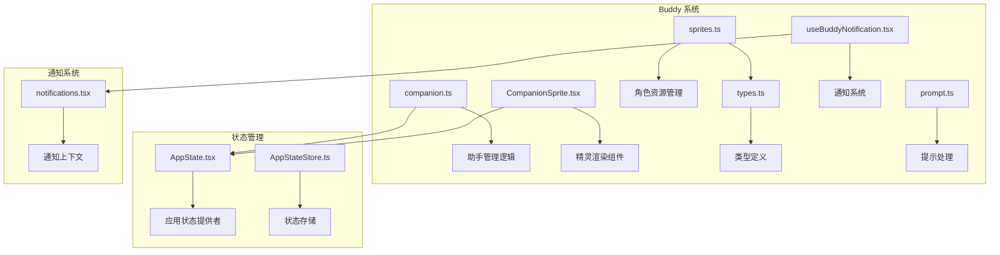
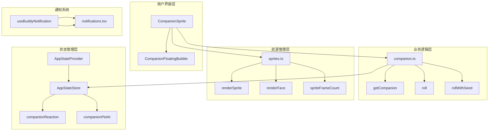
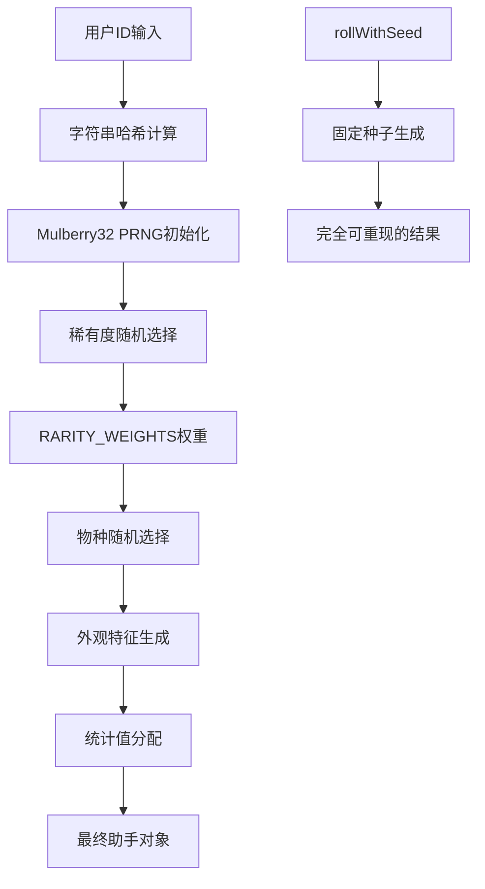
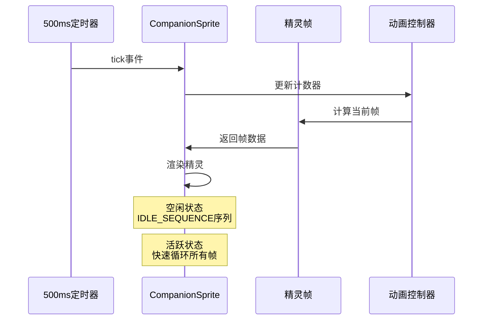
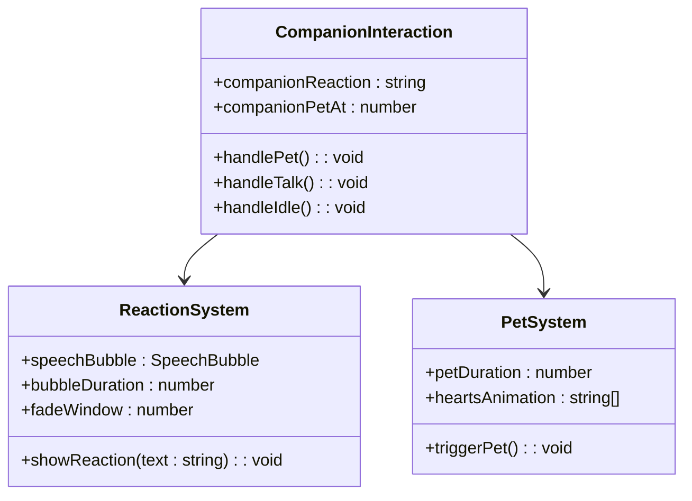
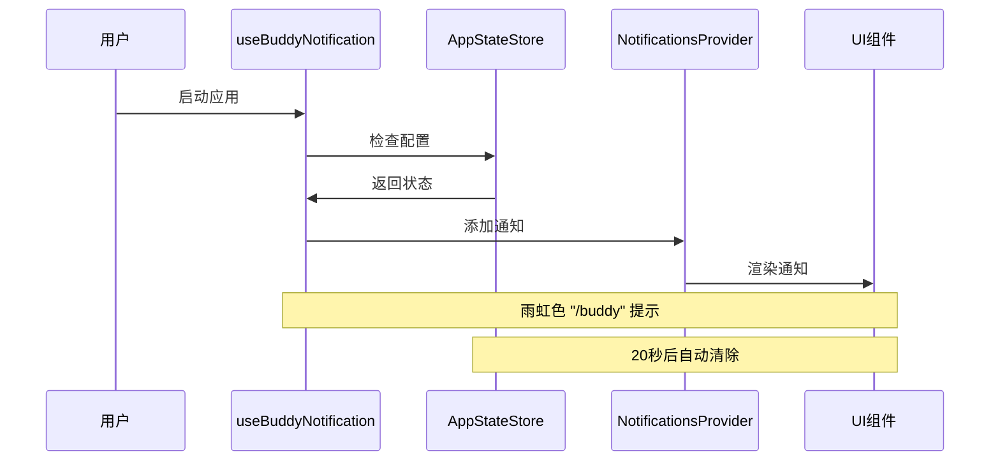
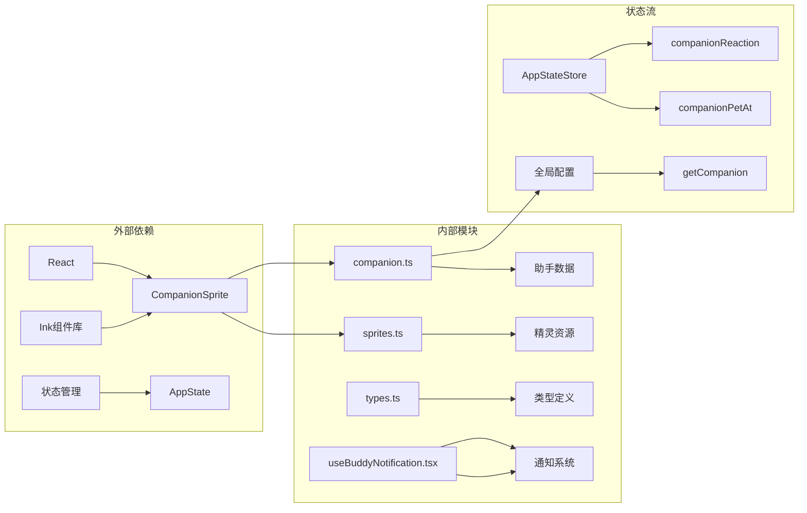
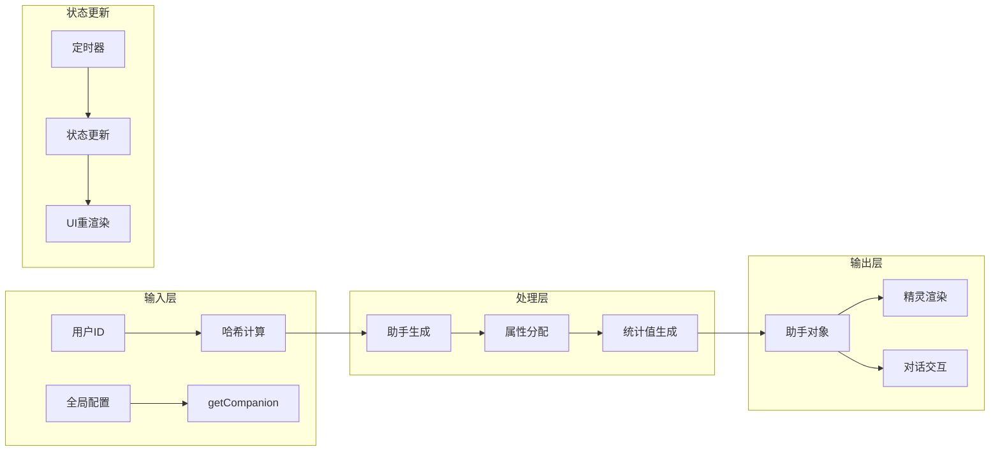

# Buddy 伙伴系统

<cite>
**本文档引用的文件**
- [companion.ts](file://src/buddy/companion.ts)
- [CompanionSprite.tsx](file://src/buddy/CompanionSprite.tsx)
- [sprites.ts](file://src/buddy/sprites.ts)
- [types.ts](file://src/buddy/types.ts)
- [useBuddyNotification.tsx](file://src/buddy/useBuddyNotification.tsx)
- [prompt.ts](file://src/buddy/prompt.ts)
- [notifications.tsx](file://src/context/notifications.tsx)
- [AppState.tsx](file://src/state/AppState.tsx)
- [AppStateStore.ts](file://src/state/AppStateStore.ts)
</cite>

## 目录
1. [简介](#简介)
2. [项目结构](#项目结构)
3. [核心组件](#核心组件)
4. [架构概览](#架构概览)
5. [详细组件分析](#详细组件分析)
6. [依赖关系分析](#依赖关系分析)
7. [性能考虑](#性能考虑)
8. [故障排除指南](#故障排除指南)
9. [结论](#结论)

## 简介

Buddy 伙伴系统是 Claude Code 中的一个智能助手功能，为用户提供了一个可定制的虚拟伙伴。该系统包含完整的助手管理逻辑、精灵渲染组件和资源管理系统，支持多种交互模式和通知机制。

系统的核心特性包括：
- 基于用户身份的随机生成助手（基于种子的确定性算法）
- 多种精灵类型和外观变体
- 实时对话交互和反应机制
- 完整的通知系统集成
- 可配置的行为模式和响应策略

## 项目结构

Buddy 系统位于 `src/buddy/` 目录下，包含以下关键文件：

**图表来源**
- [companion.ts:1-134](file://src/buddy/companion.ts#L1-L134)
- [CompanionSprite.tsx:1-371](file://src/buddy/CompanionSprite.tsx#L1-L371)
- [sprites.ts:1-515](file://src/buddy/sprites.ts#L1-L515)

**章节来源**
- [companion.ts:1-134](file://src/buddy/companion.ts#L1-L134)
- [CompanionSprite.tsx:1-371](file://src/buddy/CompanionSprite.tsx#L1-L371)
- [sprites.ts:1-515](file://src/buddy/sprites.ts#L1-L515)
- [types.ts:1-149](file://src/buddy/types.ts#L1-L149)

## 核心组件

### 助手管理器 (companion.ts)

助手管理器负责生成和管理用户的虚拟伙伴，采用基于用户 ID 的确定性算法确保每个用户获得独特的助手体验。

主要功能：
- **随机生成算法**：使用 Mulberry32 PRNG 和字符串哈希确保可重现性
- **属性分配**：随机选择物种、眼睛、帽子等外观特征
- **稀有度系统**：基于权重的概率分布控制稀有度
- **统计值生成**：为助手分配能力统计数据

### 精灵渲染组件 (CompanionSprite.tsx)

这是一个 React 组件，负责在终端界面中显示和动画化助手精灵。

核心特性：
- **帧动画系统**：500ms 周期的精灵帧循环
- **表情变化**：眨眼、兴奋等动态表情
- **响应式布局**：根据终端宽度调整显示方式
- **全屏支持**：支持全屏模式下的独立气泡显示

### 角色资源管理 (sprites.ts)

管理所有可用的精灵类型和外观资源。

功能包括：
- **精灵数据结构**：每种精灵的多帧动画数据
- **外观替换**：动态替换眼睛字符以匹配用户选择
- **帽子系统**：支持多种帽子装饰
- **渲染优化**：高效的精灵渲染和缓存机制

**章节来源**
- [companion.ts:15-134](file://src/buddy/companion.ts#L15-L134)
- [CompanionSprite.tsx:16-371](file://src/buddy/CompanionSprite.tsx#L16-L371)
- [sprites.ts:26-515](file://src/buddy/sprites.ts#L26-L515)

## 架构概览

Buddy 系统采用分层架构设计，各组件职责明确且松耦合：

**图表来源**
- [CompanionSprite.tsx:176-371](file://src/buddy/CompanionSprite.tsx#L176-L371)
- [companion.ts:107-134](file://src/buddy/companion.ts#L107-L134)
- [AppStateStore.ts:168-172](file://src/state/AppStateStore.ts#L168-L172)
- [notifications.tsx:38-240](file://src/context/notifications.tsx#L38-L240)

## 详细组件分析

### 助手生成算法

助手生成系统采用复杂的概率算法确保每个用户的独特体验：

**图表来源**
- [companion.ts:16-117](file://src/buddy/companion.ts#L16-L117)

### 精灵动画系统

精灵动画系统实现了流畅的 5 帧循环动画：

**图表来源**
- [CompanionSprite.tsx:201-214](file://src/buddy/CompanionSprite.tsx#L201-L214)
- [CompanionSprite.tsx:242-257](file://src/buddy/CompanionSprite.tsx#L242-L257)

### 对话交互机制

系统支持多种交互模式：

**图表来源**
- [CompanionSprite.tsx:176-371](file://src/buddy/CompanionSprite.tsx#L176-L371)
- [AppStateStore.ts:168-172](file://src/state/AppStateStore.ts#L168-L172)

**章节来源**
- [companion.ts:43-102](file://src/buddy/companion.ts#L43-L102)
- [CompanionSprite.tsx:43-371](file://src/buddy/CompanionSprite.tsx#L43-L371)
- [AppStateStore.ts:168-172](file://src/state/AppStateStore.ts#L168-L172)

### 通知系统集成

Buddy 系统与全局通知系统深度集成：

**图表来源**
- [useBuddyNotification.tsx:43-98](file://src/buddy/useBuddyNotification.tsx#L43-L98)
- [notifications.tsx:38-240](file://src/context/notifications.tsx#L38-L240)

**章节来源**
- [useBuddyNotification.tsx:1-98](file://src/buddy/useBuddyNotification.tsx#L1-L98)
- [notifications.tsx:38-240](file://src/context/notifications.tsx#L38-L240)

## 依赖关系分析

### 组件间依赖

**图表来源**
- [CompanionSprite.tsx:1-16](file://src/buddy/CompanionSprite.tsx#L1-L16)
- [AppState.tsx:1-26](file://src/state/AppState.tsx#L1-L26)
- [AppStateStore.ts:89-172](file://src/state/AppStateStore.ts#L89-L172)

### 数据流图

**图表来源**
- [companion.ts:107-134](file://src/buddy/companion.ts#L107-L134)
- [AppStateStore.ts:168-172](file://src/state/AppStateStore.ts#L168-L172)

**章节来源**
- [companion.ts:1-134](file://src/buddy/companion.ts#L1-L134)
- [AppState.tsx:117-179](file://src/state/AppState.tsx#L117-L179)
- [AppStateStore.ts:89-452](file://src/state/AppStateStore.ts#L89-L452)

## 性能考虑

### 渲染优化

系统采用了多项性能优化措施：

1. **缓存机制**：助手生成结果缓存，避免重复计算
2. **增量更新**：只在必要时重新渲染精灵
3. **帧率控制**：精确的 500ms 帧间隔控制
4. **内存管理**：及时清理定时器和事件监听器

### 内存使用

- **精灵数据**：静态存储在内存中，按需访问
- **状态管理**：最小化的状态更新，避免不必要的重渲染
- **定时器管理**：组件卸载时自动清理定时器

## 故障排除指南

### 常见问题

1. **助手不显示**
   - 检查 BUDDY 功能开关
   - 确认全局配置中的 companion 字段
   - 验证终端宽度是否足够

2. **动画卡顿**
   - 检查系统负载情况
   - 确认定时器正常工作
   - 验证帧率设置

3. **通知不显示**
   - 检查通知系统状态
   - 验证优先级设置
   - 确认超时配置

**章节来源**
- [useBuddyNotification.tsx:43-78](file://src/buddy/useBuddyNotification.tsx#L43-L78)
- [CompanionSprite.tsx:201-214](file://src/buddy/CompanionSprite.tsx#L201-L214)

## 结论

Buddy 伙伴系统展现了现代前端架构的最佳实践，通过清晰的分层设计、高效的算法实现和完善的错误处理机制，为用户提供了流畅而有趣的交互体验。系统的模块化设计使得扩展新功能变得相对简单，同时保持了良好的性能表现和用户体验。

该系统的核心优势在于其确定性的随机生成算法、优雅的动画渲染和深度的状态集成，这些特性共同创造了一个既有趣又实用的虚拟助手体验。