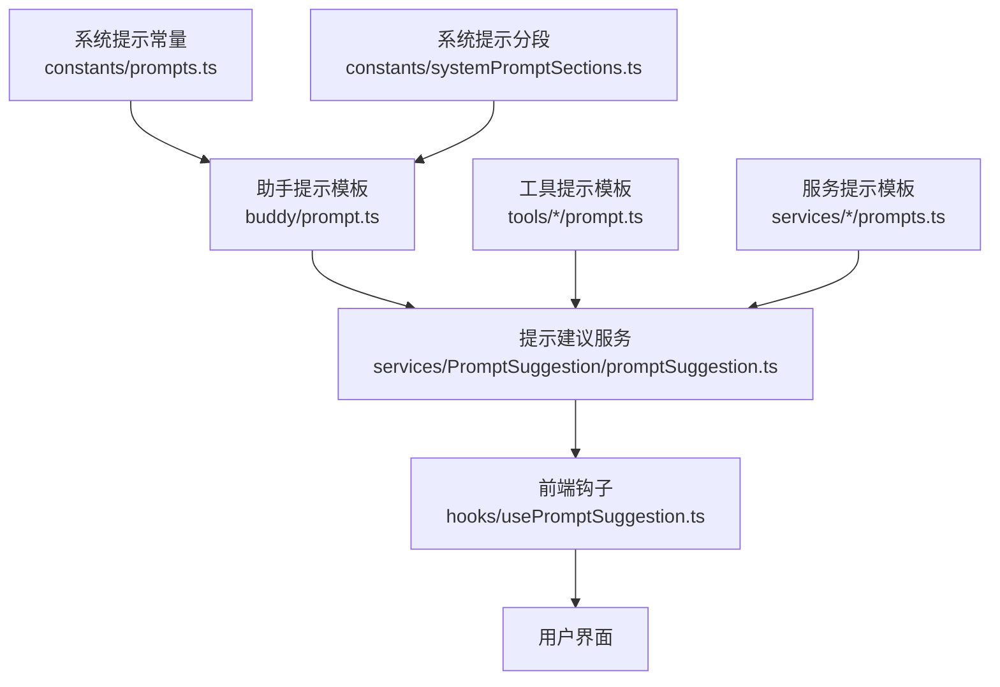
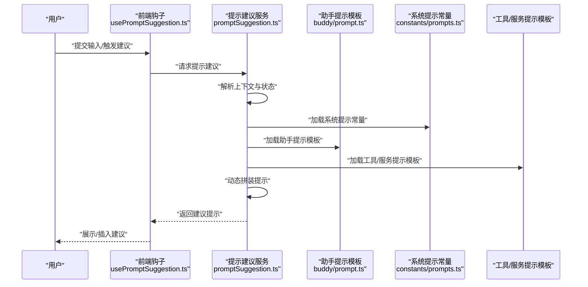
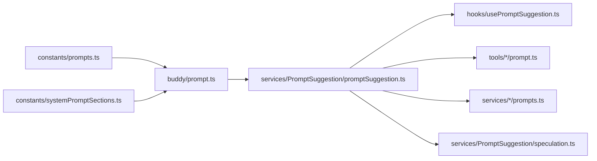

# 助手提示与引导

<cite>
**本文引用的文件**
- [src/buddy/prompt.ts](file://src/buddy/prompt.ts)
- [src/constants/prompts.ts](file://src/constants/prompts.ts)
- [src/constants/systemPromptSections.ts](file://src/constants/systemPromptSections.ts)
- [src/services/PromptSuggestion/promptSuggestion.ts](file://src/services/PromptSuggestion/promptSuggestion.ts)
- [src/services/PromptSuggestion/speculation.ts](file://src/services/PromptSuggestion/speculation.ts)
- [src/hooks/usePromptSuggestion.ts](file://src/hooks/usePromptSuggestion.ts)
- [src/tools/BashTool/prompt.ts](file://src/tools/BashTool/prompt.ts)
- [src/tools/FileEditTool/prompt.ts](file://src/tools/FileEditTool/prompt.ts)
- [src/tools/FileReadTool/prompt.ts](file://src/tools/FileReadTool/prompt.ts)
- [src/tools/FileWriteTool/prompt.ts](file://src/tools/FileWriteTool/prompt.ts)
- [src/tools/GrepTool/prompt.ts](file://src/tools/GrepTool/prompt.ts)
- [src/tools/LSPTool/prompt.ts](file://src/tools/LSPTool/prompt.ts)
- [src/tools/MCPTool/prompt.ts](file://src/tools/MCPTool/prompt.ts)
- [src/tools/AgentTool/prompt.ts](file://src/tools/AgentTool/prompt.ts)
- [src/tools/AskUserQuestionTool/prompt.ts](file://src/tools/AskUserQuestionTool/prompt.ts)
- [src/tools/BriefTool/prompt.ts](file://src/tools/BriefTool/prompt.ts)
- [src/tools/ConfigTool/prompt.ts](file://src/tools/ConfigTool/prompt.ts)
- [src/tools/DiscoverSkillsTool/prompt.ts](file://src/tools/DiscoverSkillsTool/prompt.ts)
- [src/tools/EnterPlanModeTool/prompt.ts](file://src/tools/EnterPlanModeTool/prompt.ts)
- [src/tools/EnterWorktreeTool/prompt.ts](file://src/tools/EnterWorktreeTool/prompt.ts)
- [src/tools/ExitPlanModeTool/prompt.ts](file://src/tools/ExitPlanModeTool/prompt.ts)
- [src/tools/ExitWorktreeTool/prompt.ts](file://src/tools/ExitWorktreeTool/prompt.ts)
- [src/tools/GlobTool/prompt.ts](file://src/tools/GlobTool/prompt.ts)
- [src/tools/ListMcpResourcesTool/prompt.ts](file://src/tools/ListMcpResourcesTool/prompt.ts)
- [src/services/compact/prompt.ts](file://src/services/compact/prompt.ts)
- [src/services/MagicDocs/prompts.ts](file://src/services/MagicDocs/prompts.ts)
- [src/services/SessionMemory/prompts.ts](file://src/services/SessionMemory/prompts.ts)
- [src/services/extractMemories/prompts.ts](file://src/services/extractMemories/prompts.ts)
</cite>

## 目录
1. [简介](#简介)
2. [项目结构](#项目结构)
3. [核心组件](#核心组件)
4. [架构总览](#架构总览)
5. [详细组件分析](#详细组件分析)
6. [依赖关系分析](#依赖关系分析)
7. [性能考量](#性能考量)
8. [故障排查指南](#故障排查指南)
9. [结论](#结论)
10. [附录](#附录)

## 简介
本文件面向“助手提示与引导”系统，围绕提示工程设计原理与实现进行系统化说明。重点覆盖以下方面：
- 助手指令模板与系统提示常量的组织方式
- 自定义提示的实现路径与参数化机制
- 面向不同场景（如代码解释、错误修复、性能优化）的提示策略
- 上下文适配与动态内容生成能力
- 提示风格定制、语言偏好与领域专业化配置

该系统通过集中化的提示常量、模块化的工具提示模板以及可扩展的建议生成服务，形成从“通用系统提示”到“具体任务提示”的分层提示体系。

## 项目结构
提示与引导相关的核心位置如下：
- buddy：助手交互入口与提示模板
- constants：系统提示常量与分段配置
- services/PromptSuggestion：提示建议生成与推测逻辑
- hooks：前端侧提示建议钩子
- tools：各类工具的专用提示模板
- services：部分服务的提示模板集合

```mermaid
graph TB
subgraph "助手与提示"
Buddy["buddy/prompt.ts"]
SysConst["constants/prompts.ts"]
SysSec["constants/systemPromptSections.ts"]
end
subgraph "提示建议"
PSvc["services/PromptSuggestion/promptSuggestion.ts"]
Spec["services/PromptSuggestion/speculation.ts"]
Hook["hooks/usePromptSuggestion.ts"]
end
subgraph "工具提示模板"
ToolBash["tools/BashTool/prompt.ts"]
ToolFileEdit["tools/FileEditTool/prompt.ts"]
ToolFileRead["tools/FileReadTool/prompt.ts"]
ToolFileWrite["tools/FileWriteTool/prompt.ts"]
ToolGrep["tools/GrepTool/prompt.ts"]
ToolLSP["tools/LSPTool/prompt.ts"]
ToolMCP["tools/MCPTool/prompt.ts"]
ToolAgent["tools/AgentTool/prompt.ts"]
ToolAsk["tools/AskUserQuestionTool/prompt.ts"]
ToolBrief["tools/BriefTool/prompt.ts"]
ToolCfg["tools/ConfigTool/prompt.ts"]
ToolDisc["tools/DiscoverSkillsTool/prompt.ts"]
ToolPlanIn["tools/EnterPlanModeTool/prompt.ts"]
ToolWTIn["tools/EnterWorktreeTool/prompt.ts"]
ToolPlanOut["tools/ExitPlanModeTool/prompt.ts"]
ToolWtout["tools/ExitWorktreeTool/prompt.ts"]
ToolGlob["tools/GlobTool/prompt.ts"]
ToolList["tools/ListMcpResourcesTool/prompt.ts"]
end
subgraph "服务提示模板"
SrvCompact["services/compact/prompt.ts"]
SrvMagic["services/MagicDocs/prompts.ts"]
SrvMem["services/SessionMemory/prompts.ts"]
SrvExt["services/extractMemories/prompts.ts"]
end
Buddy --> SysConst
Buddy --> SysSec
PSvc --> Hook
PSvc --> Buddy
PSvc --> SysConst
PSvc --> ToolBash
PSvc --> ToolFileEdit
PSvc --> ToolFileRead
PSvc --> ToolFileWrite
PSvc --> ToolGrep
PSvc --> ToolLSP
PSvc --> ToolMCP
PSvc --> ToolAgent
PSvc --> ToolAsk
PSvc --> ToolBrief
PSvc --> ToolCfg
PSvc --> ToolDisc
PSvc --> ToolPlanIn
PSvc --> ToolWTIn
PSvc --> ToolPlanOut
PSvc --> ToolWtout
PSvc --> ToolGlob
PSvc --> ToolList
PSvc --> SrvCompact
PSvc --> SrvMagic
PSvc --> SrvMem
PSvc --> SrvExt
```

图表来源
- [src/buddy/prompt.ts](file://src/buddy/prompt.ts)
- [src/constants/prompts.ts](file://src/constants/prompts.ts)
- [src/constants/systemPromptSections.ts](file://src/constants/systemPromptSections.ts)
- [src/services/PromptSuggestion/promptSuggestion.ts](file://src/services/PromptSuggestion/promptSuggestion.ts)
- [src/services/PromptSuggestion/speculation.ts](file://src/services/PromptSuggestion/speculation.ts)
- [src/hooks/usePromptSuggestion.ts](file://src/hooks/usePromptSuggestion.ts)
- [src/tools/BashTool/prompt.ts](file://src/tools/BashTool/prompt.ts)
- [src/tools/FileEditTool/prompt.ts](file://src/tools/FileEditTool/prompt.ts)
- [src/tools/FileReadTool/prompt.ts](file://src/tools/FileReadTool/prompt.ts)
- [src/tools/FileWriteTool/prompt.ts](file://src/tools/FileWriteTool/prompt.ts)
- [src/tools/GrepTool/prompt.ts](file://src/tools/GrepTool/prompt.ts)
- [src/tools/LSPTool/prompt.ts](file://src/tools/LSPTool/prompt.ts)
- [src/tools/MCPTool/prompt.ts](file://src/tools/MCPTool/prompt.ts)
- [src/tools/AgentTool/prompt.ts](file://src/tools/AgentTool/prompt.ts)
- [src/tools/AskUserQuestionTool/prompt.ts](file://src/tools/AskUserQuestionTool/prompt.ts)
- [src/tools/BriefTool/prompt.ts](file://src/tools/BriefTool/prompt.ts)
- [src/tools/ConfigTool/prompt.ts](file://src/tools/ConfigTool/prompt.ts)
- [src/tools/DiscoverSkillsTool/prompt.ts](file://src/tools/DiscoverSkillsTool/prompt.ts)
- [src/tools/EnterPlanModeTool/prompt.ts](file://src/tools/EnterPlanModeTool/prompt.ts)
- [src/tools/EnterWorktreeTool/prompt.ts](file://src/tools/EnterWorktreeTool/prompt.ts)
- [src/tools/ExitPlanModeTool/prompt.ts](file://src/tools/ExitPlanModeTool/prompt.ts)
- [src/tools/ExitWorktreeTool/prompt.ts](file://src/tools/ExitWorktreeTool/prompt.ts)
- [src/tools/GlobTool/prompt.ts](file://src/tools/GlobTool/prompt.ts)
- [src/tools/ListMcpResourcesTool/prompt.ts](file://src/tools/ListMcpResourcesTool/prompt.ts)
- [src/services/compact/prompt.ts](file://src/services/compact/prompt.ts)
- [src/services/MagicDocs/prompts.ts](file://src/services/MagicDocs/prompts.ts)
- [src/services/SessionMemory/prompts.ts](file://src/services/SessionMemory/prompts.ts)
- [src/services/extractMemories/prompts.ts](file://src/services/extractMemories/prompts.ts)

章节来源
- [src/buddy/prompt.ts](file://src/buddy/prompt.ts)
- [src/constants/prompts.ts](file://src/constants/prompts.ts)
- [src/constants/systemPromptSections.ts](file://src/constants/systemPromptSections.ts)
- [src/services/PromptSuggestion/promptSuggestion.ts](file://src/services/PromptSuggestion/promptSuggestion.ts)
- [src/services/PromptSuggestion/speculation.ts](file://src/services/PromptSuggestion/speculation.ts)
- [src/hooks/usePromptSuggestion.ts](file://src/hooks/usePromptSuggestion.ts)

## 核心组件
- 助手指令模板与系统提示常量
  - 助手提示模板位于 buddy/prompt.ts，用于统一管理助手角色、行为与输出风格的提示指令。
  - 系统提示常量位于 constants/prompts.ts，提供跨模块复用的系统级提示片段。
  - 系统提示分段配置位于 constants/systemPromptSections.ts，支持按主题拆分与组合系统提示。
- 工具提示模板
  - 各工具在对应目录下的 prompt.ts 文件中定义专用提示模板，确保工具调用时具备明确的上下文与约束。
- 提示建议服务
  - services/PromptSuggestion/promptSuggestion.ts 负责根据当前会话状态与用户意图生成或选择合适的提示。
  - services/PromptSuggestion/speculation.ts 提供推测性提示生成逻辑，辅助提升交互效率。
- 前端钩子
  - hooks/usePromptSuggestion.ts 将提示建议能力注入到界面交互流程中，便于在输入框或消息面板中触发与展示。

章节来源
- [src/buddy/prompt.ts](file://src/buddy/prompt.ts)
- [src/constants/prompts.ts](file://src/constants/prompts.ts)
- [src/constants/systemPromptSections.ts](file://src/constants/systemPromptSections.ts)
- [src/services/PromptSuggestion/promptSuggestion.ts](file://src/services/PromptSuggestion/promptSuggestion.ts)
- [src/services/PromptSuggestion/speculation.ts](file://src/services/PromptSuggestion/speculation.ts)
- [src/hooks/usePromptSuggestion.ts](file://src/hooks/usePromptSuggestion.ts)

## 架构总览
提示系统采用“分层+模块化”的架构：
- 分层结构
  - 系统提示层：由 constants 中的常量与分段组成，提供基础系统设定与行为约束。
  - 助手提示层：由 buddy/prompt.ts 组织，负责角色扮演、语气风格与输出格式的统一。
  - 工具提示层：由各工具的 prompt.ts 定义，聚焦具体任务的上下文与约束。
  - 服务提示层：由 services 下的 prompts.ts 定义，面向记忆、文档、紧凑模式等场景。
- 模块化结构
  - 提示建议服务通过聚合上述层次，结合当前上下文动态拼装提示。
  - 前端钩子将建议结果与用户输入流对接，实现“所见即所得”的提示引导体验。

图表来源
- [src/constants/prompts.ts](file://src/constants/prompts.ts)
- [src/constants/systemPromptSections.ts](file://src/constants/systemPromptSections.ts)
- [src/buddy/prompt.ts](file://src/buddy/prompt.ts)
- [src/services/PromptSuggestion/promptSuggestion.ts](file://src/services/PromptSuggestion/promptSuggestion.ts)
- [src/hooks/usePromptSuggestion.ts](file://src/hooks/usePromptSuggestion.ts)

## 详细组件分析

### 助手提示模板与系统提示常量
- 设计原则
  - 角色一致性：助手提示模板统一角色定位、知识边界与输出风格，避免多处散落的风格差异。
  - 可组合性：系统提示常量与分段允许按需拼接，满足不同对话阶段与场景的切换。
  - 易维护性：集中式常量与分段便于版本演进与批量调整。
- 参数化与动态内容
  - 通过占位符与上下文注入机制，将用户输入、历史消息、工具输出等动态内容嵌入提示。
  - 支持条件分支与开关控制，依据会话状态决定是否启用特定提示片段。
- 上下文适配
  - 结合当前工作区、文件上下文与任务目标，自动裁剪与扩展提示内容，减少无关信息干扰。

章节来源
- [src/buddy/prompt.ts](file://src/buddy/prompt.ts)
- [src/constants/prompts.ts](file://src/constants/prompts.ts)
- [src/constants/systemPromptSections.ts](file://src/constants/systemPromptSections.ts)

### 提示建议服务与推测逻辑
- 作用
  - 在用户输入或系统事件触发时，综合当前上下文与历史会话，生成或选择最合适的提示序列。
  - speculaion.ts 提供推测性提示生成，降低用户思考成本，提升交互效率。
- 关键流程
  - 输入收集：接收用户输入、工具调用结果、会话状态等。
  - 上下文解析：提取关键上下文（如文件、命令、错误信息）。
  - 模板匹配：在系统提示、助手提示、工具提示与服务提示中选择合适片段。
  - 动态拼装：将常量、分段与动态内容合并为最终提示。
  - 输出决策：返回建议提示或直接驱动后续动作。

图表来源
- [src/hooks/usePromptSuggestion.ts](file://src/hooks/usePromptSuggestion.ts)
- [src/services/PromptSuggestion/promptSuggestion.ts](file://src/services/PromptSuggestion/promptSuggestion.ts)
- [src/buddy/prompt.ts](file://src/buddy/prompt.ts)
- [src/constants/prompts.ts](file://src/constants/prompts.ts)

章节来源
- [src/services/PromptSuggestion/promptSuggestion.ts](file://src/services/PromptSuggestion/promptSuggestion.ts)
- [src/services/PromptSuggestion/speculation.ts](file://src/services/PromptSuggestion/speculation.ts)
- [src/hooks/usePromptSuggestion.ts](file://src/hooks/usePromptSuggestion.ts)

### 工具提示模板与场景化策略
- 典型场景与策略
  - 代码解释：强调分步骤讲解、术语对照与示例补充，帮助用户理解复杂逻辑。
  - 错误修复：优先定位根因、给出最小可复现步骤、提供修复方案与验证建议。
  - 性能优化：区分瓶颈类型（CPU/IO/内存）、提出可量化指标与对比方案。
  - 多语言与多框架：通过系统提示分段与工具模板的组合，适配不同技术栈。
- 参数化与上下文注入
  - 将源码片段、错误日志、测试结果、变更记录等作为动态参数注入模板。
  - 使用条件分支控制是否包含调试建议、安全注意事项或兼容性说明。
- 上下文适配
  - 根据当前文件类型、项目结构与工具链特性，自动选择更贴切的提示模板与风格。

章节来源
- [src/tools/BashTool/prompt.ts](file://src/tools/BashTool/prompt.ts)
- [src/tools/FileEditTool/prompt.ts](file://src/tools/FileEditTool/prompt.ts)
- [src/tools/FileReadTool/prompt.ts](file://src/tools/FileReadTool/prompt.ts)
- [src/tools/FileWriteTool/prompt.ts](file://src/tools/FileWriteTool/prompt.ts)
- [src/tools/GrepTool/prompt.ts](file://src/tools/GrepTool/prompt.ts)
- [src/tools/LSPTool/prompt.ts](file://src/tools/LSPTool/prompt.ts)
- [src/tools/MCPTool/prompt.ts](file://src/tools/MCPTool/prompt.ts)
- [src/tools/AgentTool/prompt.ts](file://src/tools/AgentTool/prompt.ts)
- [src/tools/AskUserQuestionTool/prompt.ts](file://src/tools/AskUserQuestionTool/prompt.ts)
- [src/tools/BriefTool/prompt.ts](file://src/tools/BriefTool/prompt.ts)
- [src/tools/ConfigTool/prompt.ts](file://src/tools/ConfigTool/prompt.ts)
- [src/tools/DiscoverSkillsTool/prompt.ts](file://src/tools/DiscoverSkillsTool/prompt.ts)
- [src/tools/EnterPlanModeTool/prompt.ts](file://src/tools/EnterPlanModeTool/prompt.ts)
- [src/tools/EnterWorktreeTool/prompt.ts](file://src/tools/EnterWorktreeTool/prompt.ts)
- [src/tools/ExitPlanModeTool/prompt.ts](file://src/tools/ExitPlanModeTool/prompt.ts)
- [src/tools/ExitWorktreeTool/prompt.ts](file://src/tools/ExitWorktreeTool/prompt.ts)
- [src/tools/GlobTool/prompt.ts](file://src/tools/GlobTool/prompt.ts)
- [src/tools/ListMcpResourcesTool/prompt.ts](file://src/tools/ListMcpResourcesTool/prompt.ts)

### 服务提示模板与领域专业化
- 领域场景
  - 紧凑模式：在有限上下文中最大化信息密度，适合快速摘要与要点提炼。
  - 文档生成：面向 MagicDocs 的提示模板，强调结构化与可读性。
  - 会话记忆：在 SessionMemory 与 extractMemories 中，提示模板负责引导记忆抽取与归档。
- 专业化配置
  - 通过 constants/systemPromptSections.ts 的分段化组织，实现“通用-专业-领域”的渐进式提示构建。
  - 服务提示模板与工具模板协同，形成从“任务执行”到“知识沉淀”的闭环。

章节来源
- [src/services/compact/prompt.ts](file://src/services/compact/prompt.ts)
- [src/services/MagicDocs/prompts.ts](file://src/services/MagicDocs/prompts.ts)
- [src/services/SessionMemory/prompts.ts](file://src/services/SessionMemory/prompts.ts)
- [src/services/extractMemories/prompts.ts](file://src/services/extractMemories/prompts.ts)
- [src/constants/systemPromptSections.ts](file://src/constants/systemPromptSections.ts)

## 依赖关系分析
提示系统内部依赖呈现“上层服务聚合底层模板”的特征，同时存在跨模块的横向依赖以实现上下文共享与动态拼装。

图表来源
- [src/constants/prompts.ts](file://src/constants/prompts.ts)
- [src/constants/systemPromptSections.ts](file://src/constants/systemPromptSections.ts)
- [src/buddy/prompt.ts](file://src/buddy/prompt.ts)
- [src/services/PromptSuggestion/promptSuggestion.ts](file://src/services/PromptSuggestion/promptSuggestion.ts)
- [src/services/PromptSuggestion/speculation.ts](file://src/services/PromptSuggestion/speculation.ts)
- [src/hooks/usePromptSuggestion.ts](file://src/hooks/usePromptSuggestion.ts)

章节来源
- [src/constants/prompts.ts](file://src/constants/prompts.ts)
- [src/constants/systemPromptSections.ts](file://src/constants/systemPromptSections.ts)
- [src/buddy/prompt.ts](file://src/buddy/prompt.ts)
- [src/services/PromptSuggestion/promptSuggestion.ts](file://src/services/PromptSuggestion/promptSuggestion.ts)
- [src/services/PromptSuggestion/speculation.ts](file://src/services/PromptSuggestion/speculation.ts)
- [src/hooks/usePromptSuggestion.ts](file://src/hooks/usePromptSuggestion.ts)

## 性能考量
- 模板拼装的成本控制
  - 优先使用分段化常量与轻量级占位符，避免在高频路径中进行复杂字符串处理。
  - 对重复使用的提示片段进行缓存，减少重复计算与拼装开销。
- 上下文裁剪
  - 在长对话或多文件场景中，对上下文进行智能截断与摘要，避免超出模型上下文限制。
- 异步与批处理
  - 建议将提示建议的生成过程异步化，避免阻塞主线程；对多个工具提示的拼装进行批处理优化。
- 编译期优化
  - 对静态提示模板进行编译期检查与校验，提前发现潜在问题，降低运行时开销。

## 故障排查指南
- 提示不生效或风格不符
  - 检查 constants/prompts.ts 与 constants/systemPromptSections.ts 是否正确加载与拼接。
  - 确认 buddy/prompt.ts 中的角色与风格设定未被后续模板覆盖。
- 工具提示缺失或上下文不完整
  - 核对对应工具的 prompt.ts 是否存在且已纳入提示建议服务的聚合范围。
  - 检查上下文解析逻辑是否正确提取了所需信息（如文件路径、错误日志等）。
- 建议生成异常
  - 查看 services/PromptSuggestion/promptSuggestion.ts 的日志与错误分支，确认动态拼装流程无误。
  - 若使用推测逻辑，检查 services/PromptSuggestion/speculation.ts 的触发条件与输出格式。
- 前端集成问题
  - 确认 hooks/usePromptSuggestion.ts 的调用时机与返回值处理符合预期。
  - 检查 UI 层对建议提示的展示与插入逻辑，避免覆盖用户输入或产生冲突。

章节来源
- [src/constants/prompts.ts](file://src/constants/prompts.ts)
- [src/constants/systemPromptSections.ts](file://src/constants/systemPromptSections.ts)
- [src/buddy/prompt.ts](file://src/buddy/prompt.ts)
- [src/services/PromptSuggestion/promptSuggestion.ts](file://src/services/PromptSuggestion/promptSuggestion.ts)
- [src/services/PromptSuggestion/speculation.ts](file://src/services/PromptSuggestion/speculation.ts)
- [src/hooks/usePromptSuggestion.ts](file://src/hooks/usePromptSuggestion.ts)

## 结论
本提示与引导系统通过“系统提示常量 + 助手模板 + 工具/服务模板 + 提示建议服务 + 前端钩子”的分层架构，实现了高可维护性与强适配性的提示工程体系。其参数化与动态拼装机制能够针对不同场景与用户需求生成高质量提示，配合推测逻辑与上下文适配，显著提升了交互效率与用户体验。建议在后续迭代中持续完善模板分段、增强上下文裁剪策略，并引入更多领域专业化提示模板，以覆盖更广泛的使用场景。

## 附录
- 场景化提示策略速览
  - 代码解释：强调分步讲解与示例对照
  - 错误修复：根因定位、最小复现与修复验证
  - 性能优化：瓶颈识别、量化指标与对比方案
- 配置项建议
  - 提示风格：正式/简洁/口语化等风格开关
  - 语言偏好：中文/英文及术语表切换
  - 领域专业化：按技术栈或业务域启用专属提示分段
- 扩展建议
  - 引入提示模板版本管理与灰度发布
  - 增加用户反馈回路，基于效果数据优化模板权重
  - 加强多模态提示（如图片/表格）的支持与适配