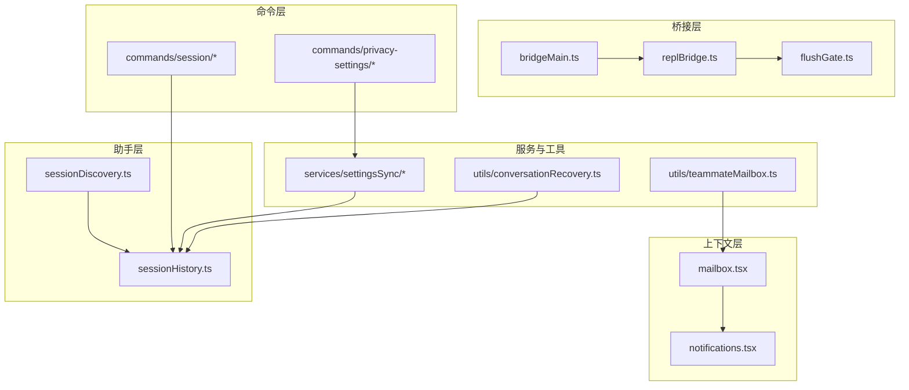
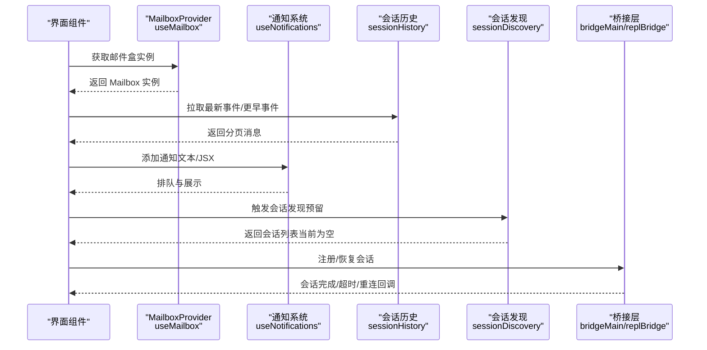
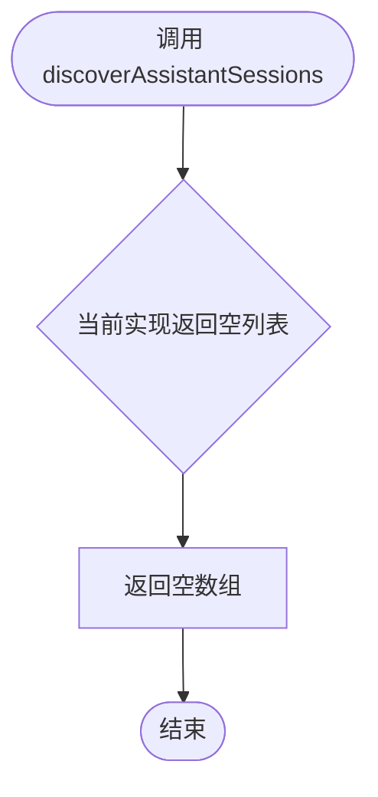
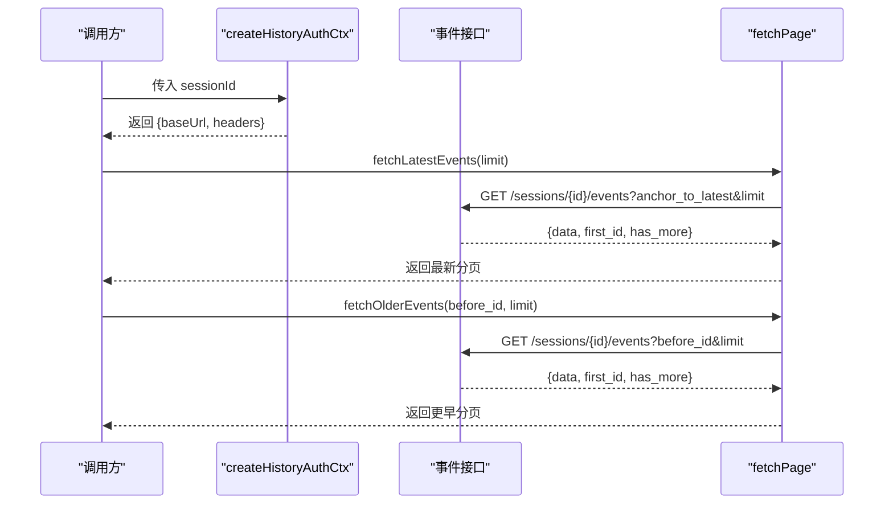
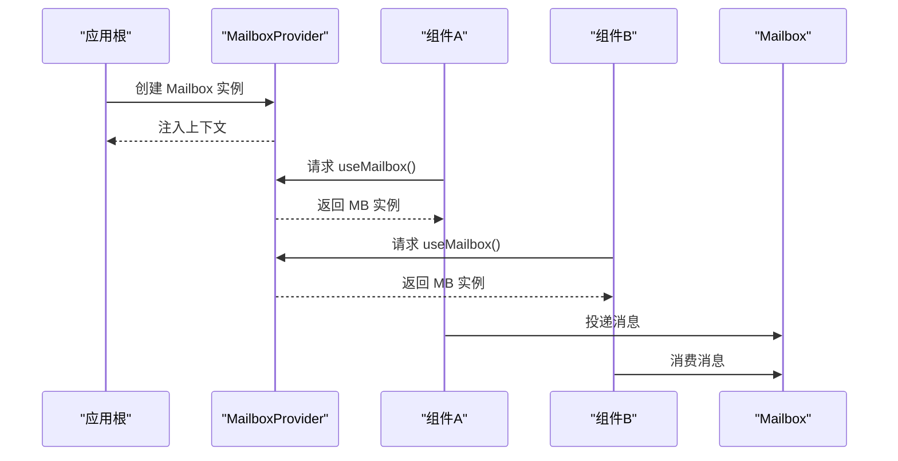
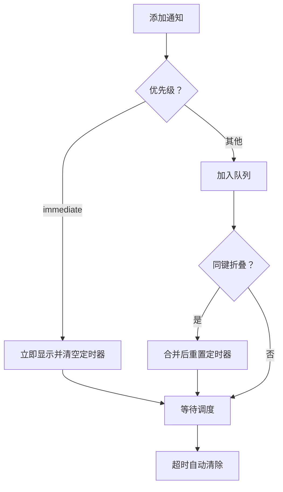
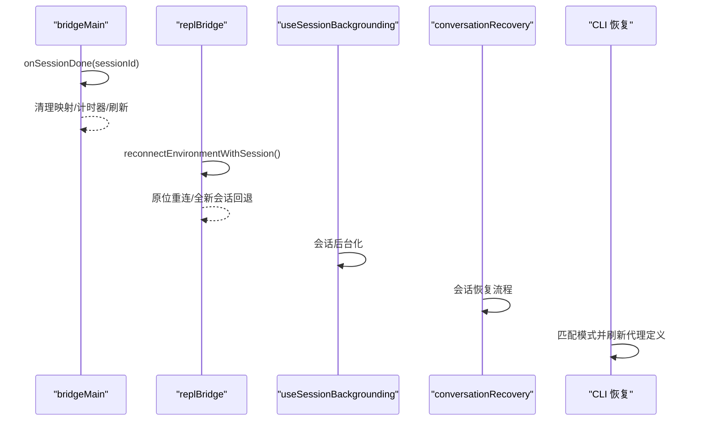
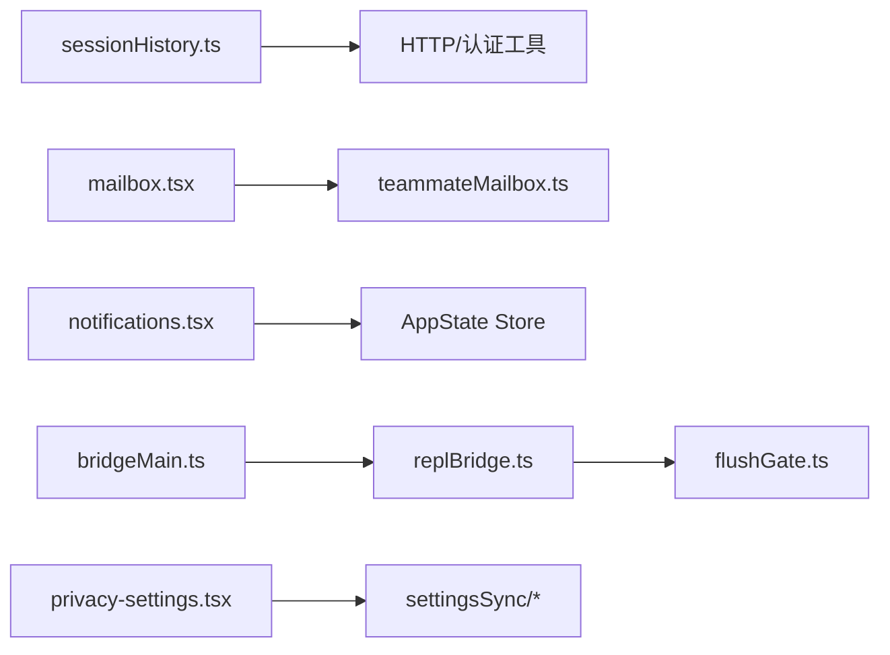

# 对话管理

<cite>
**本文引用的文件**
- [sessionDiscovery.ts](file://src/assistant/sessionDiscovery.ts)
- [sessionHistory.ts](file://src/assistant/sessionHistory.ts)
- [mailbox.tsx](file://src/context/mailbox.tsx)
- [notifications.tsx](file://src/context/notifications.tsx)
- [useSessionBackgrounding.ts](file://src/hooks/useSessionBackgrounding.ts)
- [bridgeMain.ts](file://src/bridge/bridgeMain.ts)
- [replBridge.ts](file://src/bridge/replBridge.ts)
- [print.ts](file://src/cli/print.ts)
- [teammateMailbox.ts](file://src/utils/teammateMailbox.ts)
- [privacy-settings.tsx](file://src/commands/privacy-settings/privacy-settings.tsx)
- [index.ts](file://src/commands/privacy-settings/index.ts)
- [conversationRecovery.ts](file://src/utils/conversationRecovery.ts)
- [flushGate.ts](file://src/bridge/flushGate.ts)
- [session.tsx](file://src/commands/session/session.tsx)
- [index.ts](file://src/commands/session/index.ts)
- [settingsSync/index.ts](file://src/services/settingsSync/index.ts)
- [settingsSync/types.ts](file://src/services/settingsSync/types.ts)
</cite>

## 目录
1. [简介](#简介)
2. [项目结构](#项目结构)
3. [核心组件](#核心组件)
4. [架构总览](#架构总览)
5. [详细组件分析](#详细组件分析)
6. [依赖关系分析](#依赖关系分析)
7. [性能考量](#性能考量)
8. [故障排查指南](#故障排查指南)
9. [结论](#结论)
10. [附录](#附录)

## 简介
本文件面向对话管理系统，围绕以下主题进行系统化说明：
- 会话发现机制：如何识别与恢复现有会话（基于当前实现，会话发现接口返回空列表，后续可扩展为从远端或本地索引加载）。
- 会话历史管理：消息分页拉取、历史检索与会话状态持久化（通过事件流接口与本地状态结合）。
- 邮件盒系统与通知系统：消息路由与通知队列调度的集成方式。
- 会话配置与策略：隐私设置、会话背景化与恢复、会话生命周期管理。
- 导入导出与跨设备同步：基于现有会话与设置同步能力的实践建议。

## 项目结构
对话管理涉及多个层面：
- 会话发现与历史：assistant 层的 discovery 与 history 模块。
- 上下文与通知：context 层的 mailbox 与 notifications 提供器。
- 会话生命周期与桥接：bridge 层的主控与 REPL 桥接逻辑。
- 用户交互与命令：commands 层的会话与隐私设置命令。
- 设置同步与恢复：services 与 utils 中的相关模块。

图示来源
- [sessionDiscovery.ts:1-4](file://src/assistant/sessionDiscovery.ts#L1-L4)
- [sessionHistory.ts:1-88](file://src/assistant/sessionHistory.ts#L1-L88)
- [mailbox.tsx:1-38](file://src/context/mailbox.tsx#L1-L38)
- [notifications.tsx:1-240](file://src/context/notifications.tsx#L1-L240)
- [bridgeMain.ts:442-475](file://src/bridge/bridgeMain.ts#L442-L475)
- [replBridge.ts:576-615](file://src/bridge/replBridge.ts#L576-L615)
- [flushGate.ts:1-50](file://src/bridge/flushGate.ts#L1-L50)
- [session.tsx](file://src/commands/session/session.tsx)
- [privacy-settings.tsx:25-57](file://src/commands/privacy-settings/privacy-settings.tsx#L25-L57)
- [settingsSync/index.ts](file://src/services/settingsSync/index.ts)
- [settingsSync/types.ts](file://src/services/settingsSync/types.ts)
- [conversationRecovery.ts](file://src/utils/conversationRecovery.ts)
- [teammateMailbox.ts:110-142](file://src/utils/teammateMailbox.ts#L110-L142)

章节来源
- [sessionDiscovery.ts:1-4](file://src/assistant/sessionDiscovery.ts#L1-L4)
- [sessionHistory.ts:1-88](file://src/assistant/sessionHistory.ts#L1-L88)
- [mailbox.tsx:1-38](file://src/context/mailbox.tsx#L1-L38)
- [notifications.tsx:1-240](file://src/context/notifications.tsx#L1-L240)
- [bridgeMain.ts:442-475](file://src/bridge/bridgeMain.ts#L442-L475)
- [replBridge.ts:576-615](file://src/bridge/replBridge.ts#L576-L615)
- [flushGate.ts:1-50](file://src/bridge/flushGate.ts#L1-L50)
- [session.tsx](file://src/commands/session/session.tsx)
- [privacy-settings.tsx:25-57](file://src/commands/privacy-settings/privacy-settings.tsx#L25-L57)
- [settingsSync/index.ts](file://src/services/settingsSync/index.ts)
- [settingsSync/types.ts](file://src/services/settingsSync/types.ts)
- [conversationRecovery.ts](file://src/utils/conversationRecovery.ts)
- [teammateMailbox.ts:110-142](file://src/utils/teammateMailbox.ts#L110-L142)

## 核心组件
- 会话发现（sessionDiscovery.ts）
  - 当前实现：返回空列表，预留扩展点以支持从远端或本地索引加载会话。
- 会话历史（sessionHistory.ts）
  - 定义历史分页数据结构与认证上下文。
  - 提供最新事件与更早事件的分页拉取方法，支持锚定到最新与游标翻页。
- 邮件盒（mailbox.tsx）
  - 提供 Mailbox 上下文与 Hook，用于在组件树中注入与消费消息收发容器。
- 通知系统（notifications.tsx）
  - 实现通知队列、优先级调度、折叠合并、超时与失效处理，以及即时通知的中断机制。
- 会话生命周期（bridgeMain.ts、replBridge.ts）
  - 管理会话完成回调、超时处理、环境重连与会话归档。
- 背景化与恢复（useSessionBackgrounding.ts、conversationRecovery.ts）
  - 支持会话后台化与恢复流程，配合 CLI 的会话恢复逻辑。
- 邮件盒工具（teammateMailbox.ts）
  - 提供多代理间 Inbox 的读写、标记已读、清理等操作，采用文件锁保证并发安全。
- 隐私设置与会话命令（privacy-settings.tsx、commands/session/*）
  - 提供隐私设置界面与会话相关命令入口。

章节来源
- [sessionDiscovery.ts:1-4](file://src/assistant/sessionDiscovery.ts#L1-L4)
- [sessionHistory.ts:1-88](file://src/assistant/sessionHistory.ts#L1-L88)
- [mailbox.tsx:1-38](file://src/context/mailbox.tsx#L1-L38)
- [notifications.tsx:1-240](file://src/context/notifications.tsx#L1-L240)
- [bridgeMain.ts:442-475](file://src/bridge/bridgeMain.ts#L442-L475)
- [replBridge.ts:576-615](file://src/bridge/replBridge.ts#L576-L615)
- [useSessionBackgrounding.ts](file://src/hooks/useSessionBackgrounding.ts)
- [conversationRecovery.ts](file://src/utils/conversationRecovery.ts)
- [teammateMailbox.ts:110-142](file://src/utils/teammateMailbox.ts#L110-L142)
- [privacy-settings.tsx:25-57](file://src/commands/privacy-settings/privacy-settings.tsx#L25-L57)
- [session.tsx](file://src/commands/session/session.tsx)

## 架构总览
对话管理由“发现—历史—路由—通知—生命周期—配置”构成闭环：
- 发现：从远端或本地索引加载会话元信息（当前为空实现，预留接口）。
- 历史：通过事件接口分页拉取消息，构建会话上下文。
- 路由：邮件盒作为消息容器，承载跨组件与跨进程通信。
- 通知：统一调度用户可见提示，支持优先级与折叠。
- 生命周期：桥接层负责会话注册、超时、重连与归档。
- 配置：隐私设置与会话命令影响行为与可见性；设置同步保障跨设备一致性。

图示来源
- [mailbox.tsx:1-38](file://src/context/mailbox.tsx#L1-L38)
- [notifications.tsx:1-240](file://src/context/notifications.tsx#L1-L240)
- [sessionHistory.ts:1-88](file://src/assistant/sessionHistory.ts#L1-L88)
- [sessionDiscovery.ts:1-4](file://src/assistant/sessionDiscovery.ts#L1-L4)
- [bridgeMain.ts:442-475](file://src/bridge/bridgeMain.ts#L442-L475)
- [replBridge.ts:576-615](file://src/bridge/replBridge.ts#L576-L615)

## 详细组件分析

### 会话发现机制（sessionDiscovery.ts）
- 设计要点
  - 当前返回空列表，便于后续接入远端会话索引或本地缓存。
  - 可扩展为按组织、时间范围、标签等条件筛选会话。
- 使用场景
  - 启动时扫描最近会话，或在会话选择面板中呈现候选列表。
- 扩展建议
  - 引入会话元数据模型（标题、最后活跃时间、模式等），并支持增量刷新。

图示来源
- [sessionDiscovery.ts:1-4](file://src/assistant/sessionDiscovery.ts#L1-L4)

章节来源
- [sessionDiscovery.ts:1-4](file://src/assistant/sessionDiscovery.ts#L1-L4)

### 会话历史管理（sessionHistory.ts）
- 数据结构
  - 分页对象包含事件数组、首条 ID 与是否还有更旧事件标志。
  - 认证上下文封装基础 URL 与请求头，避免重复计算。
- 关键流程
  - 创建认证上下文：准备访问令牌、组织 UUID 与特定 Beta 头。
  - 拉取最新事件：锚定到最新，限制数量。
  - 拉取更早事件：使用 before_id 游标继续翻页。
- 错误处理
  - 统一捕获网络异常与非 200 响应，并记录调试日志。
- 性能与复杂度
  - 单次分页为 O(n)（n 为事件数），翻页通过游标复用上下文，降低重复开销。

图示来源
- [sessionHistory.ts:1-88](file://src/assistant/sessionHistory.ts#L1-L88)

章节来源
- [sessionHistory.ts:1-88](file://src/assistant/sessionHistory.ts#L1-L88)

### 邮件盒系统（mailbox.tsx）与消息路由
- 组件职责
  - MailboxProvider 在组件树根部创建并注入 Mailbox 实例。
  - useMailbox Hook 仅在 Provider 内使用，否则抛出错误。
- 集成方式
  - 任意子组件通过 useMailbox 获取容器，进行消息投递与消费。
- 并发与一致性
  - 与 teammates 的 Inbox 交互通过文件锁保证并发安全，适合跨进程通信。

图示来源
- [mailbox.tsx:1-38](file://src/context/mailbox.tsx#L1-L38)
- [teammateMailbox.ts:110-142](file://src/utils/teammateMailbox.ts#L110-L142)

章节来源
- [mailbox.tsx:1-38](file://src/context/mailbox.tsx#L1-L38)
- [teammateMailbox.ts:110-142](file://src/utils/teammateMailbox.ts#L110-L142)

### 通知系统（notifications.tsx）与集成
- 机制概览
  - 通知队列按优先级调度，支持折叠合并、超时自动移除、即时通知打断。
  - 通过 AppState Store 更新当前显示与队列状态，确保全局一致性。
- 关键特性
  - invalidates：失效键用于移除冲突通知。
  - fold：同键通知合并策略，延长显示时间。
  - immediate：立即显示并打断当前定时器。
- 使用建议
  - 将高频提示设为低优先级，重要状态使用 high/immediate。
  - 合理设置 timeoutMs，避免遮挡用户操作。

图示来源
- [notifications.tsx:1-240](file://src/context/notifications.tsx#L1-L240)

章节来源
- [notifications.tsx:1-240](file://src/context/notifications.tsx#L1-L240)

### 会话生命周期与恢复（bridgeMain.ts、replBridge.ts、useSessionBackgrounding.ts、conversationRecovery.ts）
- 会话完成回调
  - 清理会话相关映射、计时器与刷新任务，唤醒容量等待，必要时标记失败。
- 环境重连与会话恢复
  - 支持“原位重连”与“全新会话回退”，避免重复历史发送。
- 背景化与恢复
  - 通过后台化钩子与恢复工具，实现长时间无活动后的会话续接。
- CLI 恢复
  - 恢复会话时匹配协调者模式并刷新代理定义，确保状态一致。

图示来源
- [bridgeMain.ts:442-475](file://src/bridge/bridgeMain.ts#L442-L475)
- [replBridge.ts:576-615](file://src/bridge/replBridge.ts#L576-L615)
- [useSessionBackgrounding.ts](file://src/hooks/useSessionBackgrounding.ts)
- [conversationRecovery.ts](file://src/utils/conversationRecovery.ts)
- [print.ts:5119-5145](file://src/cli/print.ts#L5119-L5145)

章节来源
- [bridgeMain.ts:442-475](file://src/bridge/bridgeMain.ts#L442-L475)
- [replBridge.ts:576-615](file://src/bridge/replBridge.ts#L576-L615)
- [useSessionBackgrounding.ts](file://src/hooks/useSessionBackgrounding.ts)
- [conversationRecovery.ts](file://src/utils/conversationRecovery.ts)
- [print.ts:5119-5145](file://src/cli/print.ts#L5119-L5145)

### 会话配置与隐私设置
- 隐私设置命令
  - 条件启用：仅订阅用户可见。
  - 展示与更新：根据远程设置决定是否展示对话改进计划开关，并记录切换事件。
- 会话命令
  - 提供会话相关命令入口，结合历史与发现模块实现会话管理。

章节来源
- [privacy-settings.tsx:25-57](file://src/commands/privacy-settings/privacy-settings.tsx#L25-L57)
- [index.ts:1-14](file://src/commands/privacy-settings/index.ts#L1-L14)
- [session.tsx](file://src/commands/session/session.tsx)
- [index.ts](file://src/commands/session/index.ts)

### 导入导出、备份恢复与跨设备同步
- 会话导入导出与备份恢复
  - 建议利用会话历史接口分页拉取完整事件序列，结合本地存储实现导入导出。
  - 结合 conversationRecovery 工具，在新环境中重建会话上下文。
- 跨设备同步
  - 利用设置同步服务（settingsSync）同步隐私与会话相关配置。
  - 会话事件层面需结合远端事件接口与本地持久化策略，确保一致性与离线可用性。

章节来源
- [sessionHistory.ts:1-88](file://src/assistant/sessionHistory.ts#L1-L88)
- [conversationRecovery.ts](file://src/utils/conversationRecovery.ts)
- [settingsSync/index.ts](file://src/services/settingsSync/index.ts)
- [settingsSync/types.ts](file://src/services/settingsSync/types.ts)

## 依赖关系分析
- 组件耦合
  - 会话历史模块独立于 UI，仅依赖通用工具与 OAuth 配置。
  - 邮件盒与通知系统通过上下文解耦，便于在不同组件树中复用。
  - 桥接层与会话生命周期紧密耦合，负责最终状态收敛。
- 外部依赖
  - HTTP 请求与认证头生成来自通用工具集。
  - 文件系统用于 teammates Inbox 的安全读写。

图示来源
- [sessionHistory.ts:1-8](file://src/assistant/sessionHistory.ts#L1-L8)
- [mailbox.tsx:1-38](file://src/context/mailbox.tsx#L1-L38)
- [teammateMailbox.ts:110-142](file://src/utils/teammateMailbox.ts#L110-L142)
- [notifications.tsx:1-240](file://src/context/notifications.tsx#L1-L240)
- [bridgeMain.ts:442-475](file://src/bridge/bridgeMain.ts#L442-L475)
- [replBridge.ts:576-615](file://src/bridge/replBridge.ts#L576-L615)
- [flushGate.ts:1-50](file://src/bridge/flushGate.ts#L1-L50)
- [privacy-settings.tsx:25-57](file://src/commands/privacy-settings/privacy-settings.tsx#L25-L57)
- [settingsSync/index.ts](file://src/services/settingsSync/index.ts)

章节来源
- [sessionHistory.ts:1-8](file://src/assistant/sessionHistory.ts#L1-L8)
- [mailbox.tsx:1-38](file://src/context/mailbox.tsx#L1-L38)
- [teammateMailbox.ts:110-142](file://src/utils/teammateMailbox.ts#L110-L142)
- [notifications.tsx:1-240](file://src/context/notifications.tsx#L1-L240)
- [bridgeMain.ts:442-475](file://src/bridge/bridgeMain.ts#L442-L475)
- [replBridge.ts:576-615](file://src/bridge/replBridge.ts#L576-L615)
- [flushGate.ts:1-50](file://src/bridge/flushGate.ts#L1-L50)
- [privacy-settings.tsx:25-57](file://src/commands/privacy-settings/privacy-settings.tsx#L25-L57)
- [settingsSync/index.ts](file://src/services/settingsSync/index.ts)

## 性能考量
- 历史分页
  - 使用锚定与游标翻页减少重复数据传输，建议合理设置分页大小与超时。
- 通知调度
  - 优先级与折叠可显著降低 UI 抖动与渲染压力，建议为高频通知设置 fold 策略。
- 桥接重连
  - 原位重连优先于全新会话，避免重复历史发送，提升恢复速度。
- 文件锁
  - teammates Inbox 的并发写入通过文件锁保护，注意锁路径与释放时机，避免死锁。

## 故障排查指南
- 会话历史拉取失败
  - 检查认证上下文是否正确生成，确认响应状态码与日志输出。
  - 若多次失败，考虑增加重试与降级策略。
- 通知未显示或提前消失
  - 核对优先级与超时设置，检查是否存在 invalidates 键导致被移除。
  - immediate 通知会打断当前定时器，确认是否预期。
- 会话恢复异常
  - 查看桥接层的环境重连策略与会话完成回调清理逻辑。
  - 确认 CLI 恢复时的模式匹配与代理定义刷新是否成功。
- 邮件盒并发问题
  - 确认文件锁路径与权限，检查锁释放逻辑，避免长时间占用。

章节来源
- [sessionHistory.ts:45-87](file://src/assistant/sessionHistory.ts#L45-L87)
- [notifications.tsx:78-192](file://src/context/notifications.tsx#L78-L192)
- [bridgeMain.ts:442-475](file://src/bridge/bridgeMain.ts#L442-L475)
- [replBridge.ts:576-615](file://src/bridge/replBridge.ts#L576-L615)
- [teammateMailbox.ts:134-142](file://src/utils/teammateMailbox.ts#L134-L142)

## 结论
对话管理系统以“发现—历史—路由—通知—生命周期—配置”为主线，当前实现提供了清晰的扩展点与可复用组件。会话发现接口预留了接入远端索引的空间；会话历史模块通过分页与认证上下文实现了稳健的历史检索；邮件盒与通知系统分别承担消息路由与用户反馈；桥接层与恢复工具保障了会话的健壮性与连续性。结合隐私设置与设置同步，可在保证用户体验的同时满足跨设备一致性需求。

## 附录
- 术语
  - 会话：一次用户与系统之间的交互过程，包含消息事件与状态。
  - 分页：按固定大小与游标滚动获取历史事件的方式。
  - 邮件盒：组件间消息传递的容器，支持并发安全写入。
  - 通知：统一的用户提示机制，支持优先级、折叠与失效。
- 最佳实践
  - 为高频事件配置 fold 与合理的 timeout。
  - 在恢复流程中优先尝试原位重连，避免重复历史发送。
  - 使用文件锁保护共享 Inbox，确保并发安全与一致性。