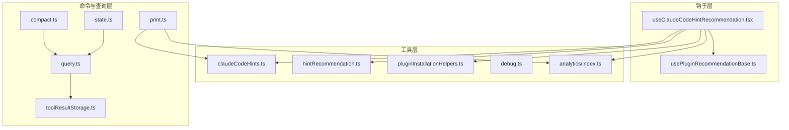
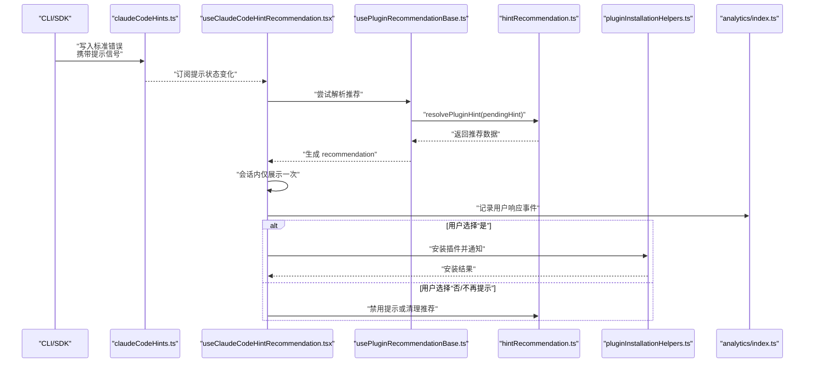
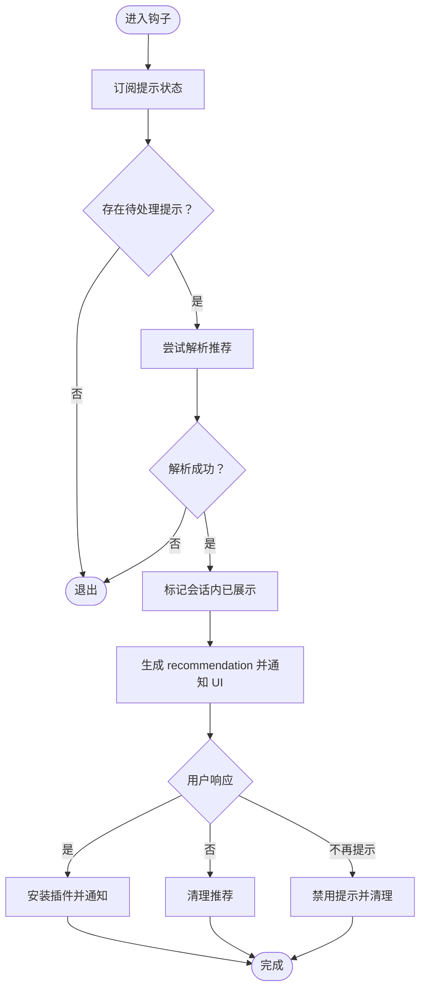
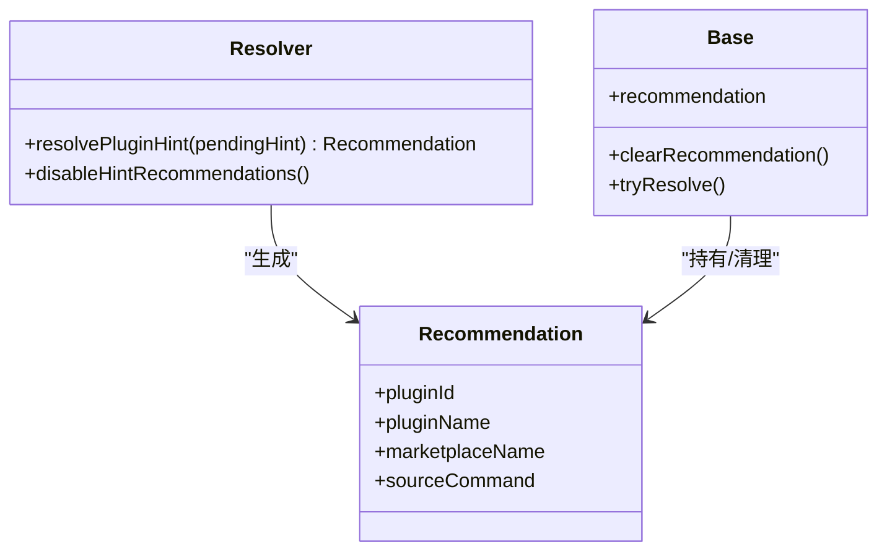
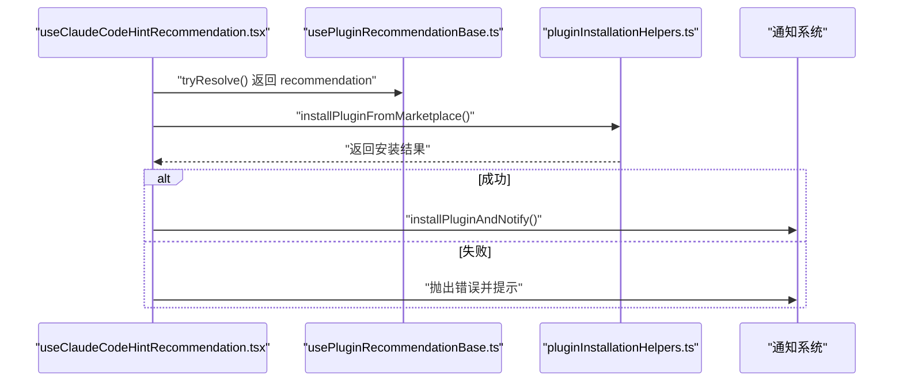
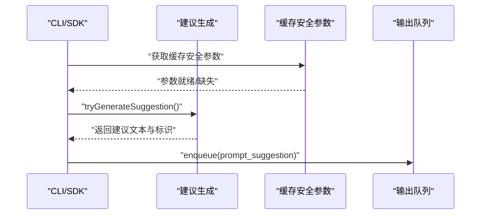
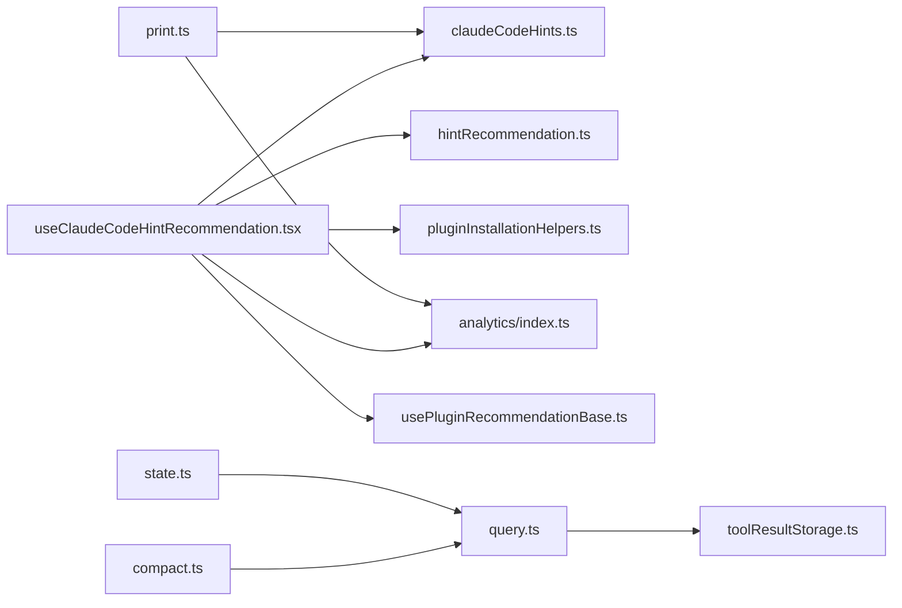
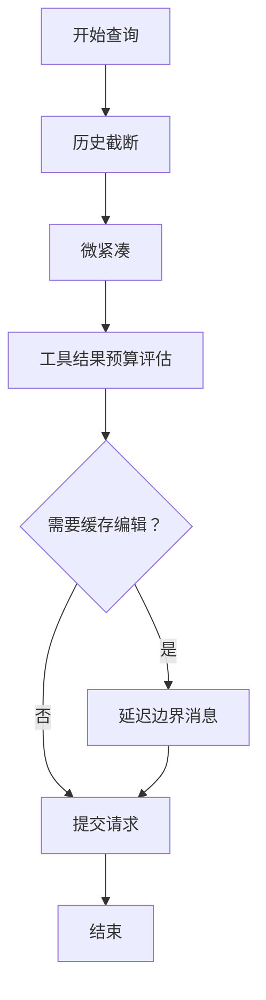

# 智能提示与建议

<cite>
**本文引用的文件**
- [useClaudeCodeHintRecommendation.tsx](file://src/hooks/useClaudeCodeHintRecommendation.tsx)
- [claudeCodeHints.ts](file://src/utils/claudeCodeHints.ts)
- [hintRecommendation.ts](file://src/utils/plugins/hintRecommendation.ts)
- [pluginInstallationHelpers.ts](file://src/utils/plugins/pluginInstallationHelpers.ts)
- [usePluginRecommendationBase.ts](file://src/hooks/usePluginRecommendationBase.ts)
- [analytics/index.ts](file://src/services/analytics/index.ts)
- [debug.ts](file://src/utils/debug.ts)
- [print.ts](file://src/cli/print.ts)
- [query.ts](file://src/query.ts)
- [compact.ts](file://src/commands/compact/compact.ts)
- [toolResultStorage.ts](file://src/utils/toolResultStorage.ts)
- [state.ts](file://src/bootstrap/state.ts)
</cite>

## 目录
1. [简介](#简介)
2. [项目结构](#项目结构)
3. [核心组件](#核心组件)
4. [架构总览](#架构总览)
5. [详细组件分析](#详细组件分析)
6. [依赖关系分析](#依赖关系分析)
7. [性能考量](#性能考量)
8. [故障排查指南](#故障排查指南)
9. [结论](#结论)
10. [附录](#附录)

## 简介
本文件面向“智能提示与建议”系统，聚焦于代码补全与插件安装建议的实现机制。重点解析以下方面：
- 推荐算法与上下文感知建议生成流程
- 提示优化策略（如去抖、会话内展示控制）
- 个性化建议的来源与落地（语法补全、函数签名提示、导入建议等）
- 性能优化、缓存与实时更新策略
- 配置项说明：提示延迟、建议数量限制、过滤规则等

该系统通过 CLI/SDK 在标准错误中发出带有特定标签的提示信号，前端 Hook 将其转化为用户可交互的建议，并在用户确认后完成插件安装与通知。

## 项目结构
围绕“智能提示与建议”的关键文件组织如下：
- 钩子层：负责监听并处理来自 CLI/SDK 的提示信号，协调通知与安装流程
- 工具层：提供提示状态管理、推荐解析、插件安装辅助与分析事件上报
- 命令与查询层：提供紧凑化与缓存相关的机制，支撑提示系统的性能与稳定性

**图表来源**
- [useClaudeCodeHintRecommendation.tsx:1-129](file://src/hooks/useClaudeCodeHintRecommendation.tsx#L1-L129)
- [claudeCodeHints.ts](file://src/utils/claudeCodeHints.ts)
- [hintRecommendation.ts](file://src/utils/plugins/hintRecommendation.ts)
- [pluginInstallationHelpers.ts](file://src/utils/plugins/pluginInstallationHelpers.ts)
- [usePluginRecommendationBase.ts](file://src/hooks/usePluginRecommendationBase.ts)
- [analytics/index.ts](file://src/services/analytics/index.ts)
- [debug.ts](file://src/utils/debug.ts)
- [print.ts:2286-2342](file://src/cli/print.ts#L2286-L2342)
- [query.ts:396-897](file://src/query.ts#L396-L897)
- [compact.ts:48-212](file://src/commands/compact/compact.ts#L48-L212)
- [toolResultStorage.ts:395-851](file://src/utils/toolResultStorage.ts#L395-L851)
- [state.ts:236-257](file://src/bootstrap/state.ts#L236-L257)

**章节来源**
- [useClaudeCodeHintRecommendation.tsx:1-129](file://src/hooks/useClaudeCodeHintRecommendation.tsx#L1-L129)
- [print.ts:2286-2342](file://src/cli/print.ts#L2286-L2342)

## 核心组件
- useClaudeCodeHintRecommendation：监听并解析来自 CLI/SDK 的提示信号，生成一次性展示的插件安装建议，支持“是/否/不再提示”三种响应，并记录分析事件与安装流程
- claudeCodeHints：提供提示状态订阅、一次性展示标记、会话内已展示标记等能力
- hintRecommendation：解析提示信号，生成推荐数据结构（包含插件元信息），并支持禁用提示
- pluginInstallationHelpers：封装从市场安装插件的流程，返回安装结果
- usePluginRecommendationBase：通用推荐流程基座，负责推荐对象的创建、清理与解析
- analytics：事件上报接口，用于记录用户对提示的响应行为
- debug：调试日志输出
- print：CLI/SDK 侧生成建议消息的入口，包含缓存安全参数与建议发射逻辑
- query/compact/toolResultStorage/state：支撑提示系统稳定性的查询压缩、缓存编辑与状态维护

**章节来源**
- [useClaudeCodeHintRecommendation.tsx:24-128](file://src/hooks/useClaudeCodeHintRecommendation.tsx#L24-L128)
- [claudeCodeHints.ts](file://src/utils/claudeCodeHints.ts)
- [hintRecommendation.ts](file://src/utils/plugins/hintRecommendation.ts)
- [pluginInstallationHelpers.ts](file://src/utils/plugins/pluginInstallationHelpers.ts)
- [usePluginRecommendationBase.ts](file://src/hooks/usePluginRecommendationBase.ts)
- [analytics/index.ts](file://src/services/analytics/index.ts)
- [debug.ts](file://src/utils/debug.ts)
- [print.ts:2286-2342](file://src/cli/print.ts#L2286-L2342)
- [query.ts:396-897](file://src/query.ts#L396-L897)
- [compact.ts:48-212](file://src/commands/compact/compact.ts#L48-L212)
- [toolResultStorage.ts:395-851](file://src/utils/toolResultStorage.ts#L395-L851)
- [state.ts:236-257](file://src/bootstrap/state.ts#L236-L257)

## 架构总览
下图展示了从 CLI/SDK 发出提示信号到前端呈现与安装的端到端流程：

**图表来源**
- [useClaudeCodeHintRecommendation.tsx:24-128](file://src/hooks/useClaudeCodeHintRecommendation.tsx#L24-L128)
- [claudeCodeHints.ts](file://src/utils/claudeCodeHints.ts)
- [usePluginRecommendationBase.ts](file://src/hooks/usePluginRecommendationBase.ts)
- [hintRecommendation.ts](file://src/utils/plugins/hintRecommendation.ts)
- [pluginInstallationHelpers.ts](file://src/utils/plugins/pluginInstallationHelpers.ts)
- [analytics/index.ts](file://src/services/analytics/index.ts)
- [print.ts:2286-2342](file://src/cli/print.ts#L2286-L2342)

## 详细组件分析

### 组件一：useClaudeCodeHintRecommendation
职责与流程要点：
- 订阅提示状态，确保仅在有新提示时触发解析
- 解析推荐：调用解析器生成 recommendation；若成功则记录会话内已展示
- 响应处理：记录分析事件；“是”进入安装流程；“否/不再提示”进行清理或禁用
- 清理与幂等：清除已处理的提示，避免重复展示

**图表来源**
- [useClaudeCodeHintRecommendation.tsx:24-128](file://src/hooks/useClaudeCodeHintRecommendation.tsx#L24-L128)

**章节来源**
- [useClaudeCodeHintRecommendation.tsx:24-128](file://src/hooks/useClaudeCodeHintRecommendation.tsx#L24-L128)

### 组件二：提示解析与推荐生成
- 解析器负责将提示信号转换为推荐对象，包含插件标识、名称、来源命令等
- 支持禁用提示，避免重复打扰
- 与通用推荐基座协作，统一推荐生命周期管理

**图表来源**
- [hintRecommendation.ts](file://src/utils/plugins/hintRecommendation.ts)
- [usePluginRecommendationBase.ts](file://src/hooks/usePluginRecommendationBase.ts)

**章节来源**
- [hintRecommendation.ts](file://src/utils/plugins/hintRecommendation.ts)
- [usePluginRecommendationBase.ts](file://src/hooks/usePluginRecommendationBase.ts)

### 组件三：插件安装与通知
- 安装流程封装了从市场拉取插件条目、执行安装、失败抛错等步骤
- 成功后通过通知渠道告知用户
- 与推荐流程解耦，便于复用与测试

**图表来源**
- [useClaudeCodeHintRecommendation.tsx:76-105](file://src/hooks/useClaudeCodeHintRecommendation.tsx#L76-L105)
- [pluginInstallationHelpers.ts](file://src/utils/plugins/pluginInstallationHelpers.ts)

**章节来源**
- [useClaudeCodeHintRecommendation.tsx:76-105](file://src/hooks/useClaudeCodeHintRecommendation.tsx#L76-L105)
- [pluginInstallationHelpers.ts](file://src/utils/plugins/pluginInstallationHelpers.ts)

### 组件四：CLI/SDK 建议生成与发射
- 当缓存安全参数可用时，尝试生成建议
- 建议以消息形式发射，包含唯一标识、会话标识与生成时间戳
- 若被更高优先级对话框阻塞，建议可能延后至后续交付

**图表来源**
- [print.ts:2286-2342](file://src/cli/print.ts#L2286-L2342)

**章节来源**
- [print.ts:2286-2342](file://src/cli/print.ts#L2286-L2342)

## 依赖关系分析
- 钩子层依赖工具层的状态与解析能力，同时与分析与调试模块集成
- 建议生成链路依赖 CLI/SDK 的缓存安全参数与状态管理
- 查询与紧凑化模块为提示系统的稳定性提供支撑（历史压缩、缓存编辑、预算控制）

**图表来源**
- [useClaudeCodeHintRecommendation.tsx:1-129](file://src/hooks/useClaudeCodeHintRecommendation.tsx#L1-L129)
- [claudeCodeHints.ts](file://src/utils/claudeCodeHints.ts)
- [hintRecommendation.ts](file://src/utils/plugins/hintRecommendation.ts)
- [pluginInstallationHelpers.ts](file://src/utils/plugins/pluginInstallationHelpers.ts)
- [usePluginRecommendationBase.ts](file://src/hooks/usePluginRecommendationBase.ts)
- [analytics/index.ts](file://src/services/analytics/index.ts)
- [print.ts:2286-2342](file://src/cli/print.ts#L2286-L2342)
- [query.ts:396-897](file://src/query.ts#L396-L897)
- [compact.ts:48-212](file://src/commands/compact/compact.ts#L48-L212)
- [toolResultStorage.ts:395-851](file://src/utils/toolResultStorage.ts#L395-L851)
- [state.ts:236-257](file://src/bootstrap/state.ts#L236-L257)

**章节来源**
- [useClaudeCodeHintRecommendation.tsx:1-129](file://src/hooks/useClaudeCodeHintRecommendation.tsx#L1-L129)
- [print.ts:2286-2342](file://src/cli/print.ts#L2286-L2342)
- [query.ts:396-897](file://src/query.ts#L396-L897)
- [compact.ts:48-212](file://src/commands/compact/compact.ts#L48-L212)
- [toolResultStorage.ts:395-851](file://src/utils/toolResultStorage.ts#L395-L851)
- [state.ts:236-257](file://src/bootstrap/state.ts#L236-L257)

## 性能考量
- 历史压缩与微紧凑：在查询前执行历史截断与微紧凑，减少输入长度，提高缓存命中率与响应速度
- 缓存编辑与边界消息：在缓存编辑场景下，延迟产出边界消息以使用真实删除令牌数，避免估计误差导致的额外开销
- 工具结果预算控制：按消息聚合预算限制工具结果大小，必要时替换新鲜内容，保证整体消息体积可控
- 会话内展示控制：提示采用“会话内仅一次”策略，避免重复打扰，降低无效渲染与通知成本
- 建议发射与阻塞：当存在更高优先级对话框时，建议可能延后发射，确保用户体验优先

**图表来源**
- [query.ts:396-897](file://src/query.ts#L396-L897)
- [toolResultStorage.ts:421-434](file://src/utils/toolResultStorage.ts#L421-L434)
- [compact.ts:48-212](file://src/commands/compact/compact.ts#L48-L212)

**章节来源**
- [query.ts:396-897](file://src/query.ts#L396-L897)
- [toolResultStorage.ts:421-434](file://src/utils/toolResultStorage.ts#L421-L434)
- [compact.ts:48-212](file://src/commands/compact/compact.ts#L48-L212)

## 故障排查指南
- 建议未出现
  - 检查 CLI/SDK 是否正确写出缓存安全参数；若缺失，建议会被抑制
  - 确认钩子是否订阅到提示状态变化
- 安装失败
  - 查看安装流程返回的错误信息，确认插件条目与市场名称有效
  - 检查网络与权限
- 重复打扰
  - 确认会话内已展示标记是否生效
  - 如需重置，可通过禁用提示功能并重新启用

**章节来源**
- [print.ts:2286-2342](file://src/cli/print.ts#L2286-L2342)
- [useClaudeCodeHintRecommendation.tsx:42-52](file://src/hooks/useClaudeCodeHintRecommendation.tsx#L42-L52)
- [pluginInstallationHelpers.ts](file://src/utils/plugins/pluginInstallationHelpers.ts)

## 结论
本系统通过“CLI/SDK 提示信号 + 前端钩子解析 + 插件安装基座”的分层设计，实现了稳定、可扩展且可配置的智能提示与建议能力。结合历史压缩、缓存编辑与预算控制等机制，系统在性能与体验之间取得平衡。未来可在以下方向持续优化：
- 更细粒度的个性化权重与上下文建模
- 建议数量与延迟的动态自适应调节
- 更丰富的建议类型（如导入建议、函数签名提示）与过滤规则

## 附录

### 配置选项说明
- 提示延迟
  - 由前端钩子内部的去抖与会话内展示策略共同决定，避免频繁弹窗
- 建议数量限制
  - 通过工具结果预算控制与微紧凑策略间接限制建议带来的输入膨胀
- 过滤规则
  - 可通过禁用提示功能全局关闭；单次安装建议支持“不再提示”以避免重复打扰
- 缓存与紧凑化
  - 历史截断与微紧凑自动执行，提升缓存命中率与响应速度
- 分析事件
  - 对用户响应进行事件上报，便于后续优化与效果评估

**章节来源**
- [useClaudeCodeHintRecommendation.tsx:71-75](file://src/hooks/useClaudeCodeHintRecommendation.tsx#L71-L75)
- [toolResultStorage.ts:421-434](file://src/utils/toolResultStorage.ts#L421-L434)
- [query.ts:396-897](file://src/query.ts#L396-L897)
- [compact.ts:48-212](file://src/commands/compact/compact.ts#L48-L212)