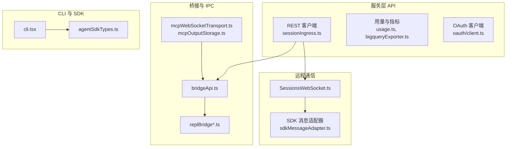
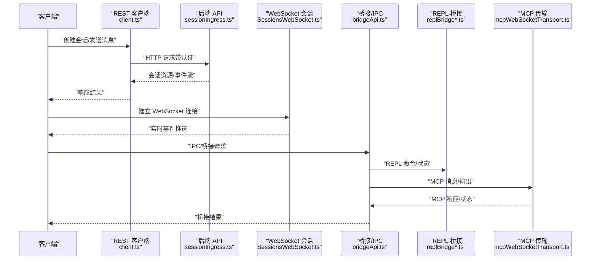
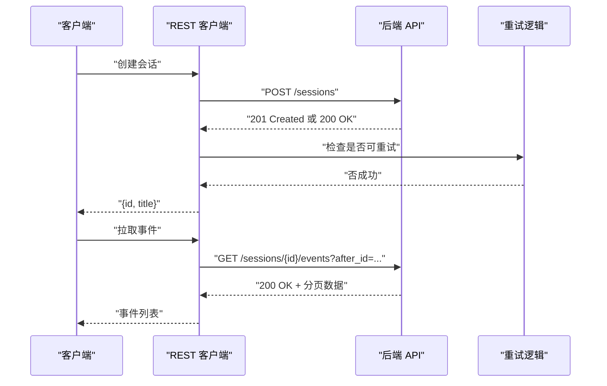
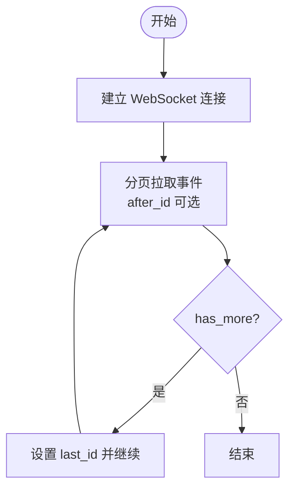
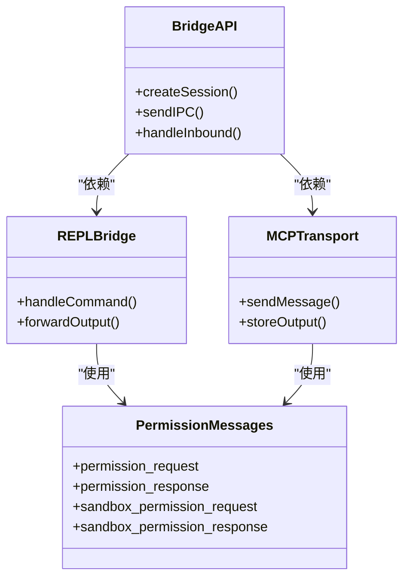
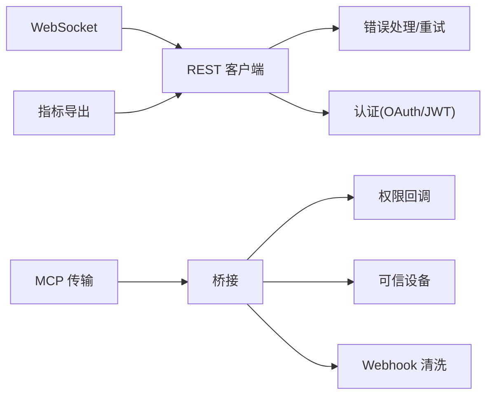

# API 参考文档

<cite>
**本文档引用的文件**
- [bridgeApi.ts](file://src/bridge/bridgeApi.ts)
- [SessionsWebSocket.ts](file://src/remote/SessionsWebSocket.ts)
- [client.ts](file://src/services/api/client.ts)
- [sessionIngress.ts](file://src/services/api/sessionIngress.ts)
- [bigqueryExporter.ts](file://src/utils/telemetry/bigqueryExporter.ts)
- [perfettoTracing.ts](file://src/utils/telemetry/perfettoTracing.ts)
- [teleport/api.ts](file://src/utils/teleport/api.ts)
- [teleport.tsx](file://src/utils/teleport.tsx)
- [mcpWebSocketTransport.ts](file://src/utils/mcpWebSocketTransport.ts)
- [mcpOutputStorage.ts](file://src/utils/mcpOutputStorage.ts)
- [mcpValidation.ts](file://src/utils/mcpValidation.ts)
- [mcpServerApproval.tsx](file://src/services/mcpServerApproval.tsx)
- [oauth/client.ts](file://src/services/oauth/client.ts)
- [auth.ts](file://src/utils/auth.ts)
- [userAgent.ts](file://src/utils/userAgent.ts)
- [telemetryAttributes.ts](file://src/utils/telemetryAttributes.ts)
- [apiLimits.ts](file://src/constants/apiLimits.ts)
- [rateLimitMessages.ts](file://src/services/rateLimitMessages.ts)
- [mockRateLimits.ts](file://src/services/mockRateLimits.ts)
- [errorUtils.ts](file://src/services/api/errorUtils.ts)
- [errors.ts](file://src/services/api/errors.ts)
- [withRetry.ts](file://src/services/api/withRetry.ts)
- [filesApi.ts](file://src/services/api/filesApi.ts)
- [usage.ts](file://src/services/api/usage.ts)
- [metricsOptOut.ts](file://src/services/api/metricsOptOut.ts)
- [logging.ts](file://src/services/api/logging.ts)
- [dumpPrompts.ts](file://src/services/api/dumpPrompts.ts)
- [bootstrap.ts](file://src/services/api/bootstrap.ts)
- [claude.ts](file://src/services/api/claude.ts)
- [adminRequests.ts](file://src/services/api/adminRequests.ts)
- [ultrareviewQuota.ts](file://src/services/api/ultrareviewQuota.ts)
- [firstTokenDate.ts](file://src/services/api/firstTokenDate.ts)
- [emptyUsage.ts](file://src/services/api/emptyUsage.ts)
- [promptCacheBreakDetection.ts](file://src/services/api/promptCacheBreakDetection.ts)
- [referral.ts](file://src/services/api/referral.ts)
- [overageCreditGrant.ts](file://src/services/api/overageCreditGrant.ts)
- [metricsOptOut.ts](file://src/services/api/metricsOptOut.ts)
- [replBridge.ts](file://src/bridge/replBridge.ts)
- [replBridgeTransport.ts](file://src/bridge/replBridgeTransport.ts)
- [replBridgeHandle.ts](file://src/bridge/replBridgeHandle.ts)
- [initReplBridge.ts](file://src/bridge/initReplBridge.ts)
- [remoteBridgeCore.ts](file://src/bridge/remoteBridgeCore.ts)
- [bridgeMessaging.ts](file://src/bridge/bridgeMessaging.ts)
- [trustedDevice.ts](file://src/bridge/trustedDevice.ts)
- [webhookSanitizer.ts](file://src/bridge/webhookSanitizer.ts)
- [flushGate.ts](file://src/bridge/flushGate.ts)
- [pollConfig.ts](file://src/bridge/pollConfig.ts)
- [pollConfigDefaults.ts](file://src/bridge/pollConfigDefaults.ts)
- [capacityWake.ts](file://src/bridge/capacityWake.ts)
- [envLessBridgeConfig.ts](file://src/bridge/envLessBridgeConfig.ts)
- [bridgeStatusUtil.ts](file://src/bridge/bridgeStatusUtil.ts)
- [bridgePermissionCallbacks.ts](file://src/bridge/bridgePermissionCallbacks.ts)
- [inboundMessages.ts](file://src/bridge/inboundMessages.ts)
- [inboundAttachments.ts](file://src/bridge/inboundAttachments.ts)
- [peerSessions.ts](file://src/bridge/peerSessions.ts)
- [sessionIdCompat.ts](file://src/bridge/sessionIdCompat.ts)
- [createSession.ts](file://src/bridge/createSession.ts)
- [sessionRunner.ts](file://src/bridge/sessionRunner.ts)
- [codeSessionApi.ts](file://src/bridge/codeSessionApi.ts)
- [bridgeConfig.ts](file://src/bridge/bridgeConfig.ts)
- [bridgeUI.ts](file://src/bridge/bridgeUI.ts)
- [bridgeDebug.ts](file://src/bridge/bridgeDebug.ts)
- [bridgeEnabled.ts](file://src/bridge/bridgeEnabled.ts)
- [bridgeMain.ts](file://src/bridge/bridgeMain.ts)
- [bridgePointer.ts](file://src/bridge/bridgePointer.ts)
- [jwtUtils.ts](file://src/bridge/jwtUtils.ts)
- [workSecret.ts](file://src/bridge/workSecret.ts)
- [types.ts](file://src/bridge/types.ts)
- [sdkMessageAdapter.ts](file://src/remote/sdkMessageAdapter.ts)
- [createDirectConnectSession.ts](file://src/server/createDirectConnectSession.ts)
- [directConnectManager.ts](file://src/server/directConnectManager.ts)
- [types.ts](file://src/server/types.ts)
- [ndjsonSafeStringify.ts](file://src/cli/ndjsonSafeStringify.ts)
- [structuredIO.ts](file://src/cli/structuredIO.ts)
- [remoteIO.ts](file://src/cli/remoteIO.ts)
- [print.ts](file://src/cli/print.ts)
- [exit.ts](file://src/cli/exit.ts)
- [update.ts](file://src/cli/update.ts)
- [handlers/](file://src/cli/handlers/)
- [transports/](file://src/cli/transports/)
- [agentSdkTypes.ts](file://src/entrypoints/sdk/agentSdkTypes.ts)
- [cli.tsx](file://src/entrypoints/cli.tsx)
- [mcp.ts](file://src/entrypoints/mcp.ts)
- [sandboxTypes.ts](file://src/entrypoints/sandboxTypes.ts)
- [teammateMailbox.ts](file://src/utils/telemetry/teammateMailbox.ts)
</cite>

## 目录
1. [简介](#简介)
2. [项目结构](#项目结构)
3. [核心组件](#核心组件)
4. [架构总览](#架构总览)
5. [详细组件分析](#详细组件分析)
6. [依赖关系分析](#依赖关系分析)
7. [性能考量](#性能考量)
8. [故障排查指南](#故障排查指南)
9. [结论](#结论)
10. [附录](#附录)

## 简介
本参考文档面向开发者与集成方，系统性梳理 Claude Code 的公开 API 生态，覆盖以下通信面：
- REST API：会话、文件、用量、指标等后端接口
- WebSocket 接口：远程会话实时消息通道
- IPC/桥接接口：本地与远端桥接、REPL 桥接、MCP 传输
- CLI 与 SDK 入口：命令行与 SDK 类型定义
- 安全与认证：OAuth/JWT、可信设备、权限回调
- 错误处理与重试：统一错误模型与指数退避
- 性能与遥测：指标导出、追踪、速率限制与版本信息

## 项目结构
围绕 API 与通信的关键目录与文件：
- 服务层 API：会话入口、REST 客户端、用量与指标、OAuth 集成等
- 远程通信：WebSocket 会话、SDK 消息适配器
- 桥接与 IPC：桥接 API、REPL 桥接、MCP 传输与存储
- CLI 与 SDK：CLI 入口、SDK 类型、NDJSON/结构化 IO
- 工具与通用：用户代理、遥测属性、速率限制、重试与错误工具

图表来源
- [client.ts](file://src/services/api/client.ts)
- [sessionIngress.ts](file://src/services/api/sessionIngress.ts)
- [SessionsWebSocket.ts](file://src/remote/SessionsWebSocket.ts)
- [bridgeApi.ts](file://src/bridge/bridgeApi.ts)
- [replBridge.ts](file://src/bridge/replBridge.ts)
- [mcpWebSocketTransport.ts](file://src/utils/mcpWebSocketTransport.ts)
- [mcpOutputStorage.ts](file://src/utils/mcpOutputStorage.ts)
- [sdkMessageAdapter.ts](file://src/remote/sdkMessageAdapter.ts)
- [cli.tsx](file://src/entrypoints/cli.tsx)
- [agentSdkTypes.ts](file://src/entrypoints/sdk/agentSdkTypes.ts)

章节来源
- [client.ts](file://src/services/api/client.ts)
- [sessionIngress.ts](file://src/services/api/sessionIngress.ts)
- [SessionsWebSocket.ts](file://src/remote/SessionsWebSocket.ts)
- [bridgeApi.ts](file://src/bridge/bridgeApi.ts)
- [replBridge.ts](file://src/bridge/replBridge.ts)
- [mcpWebSocketTransport.ts](file://src/utils/mcpWebSocketTransport.ts)
- [mcpOutputStorage.ts](file://src/utils/mcpOutputStorage.ts)
- [sdkMessageAdapter.ts](file://src/remote/sdkMessageAdapter.ts)
- [cli.tsx](file://src/entrypoints/cli.tsx)
- [agentSdkTypes.ts](file://src/entrypoints/sdk/agentSdkTypes.ts)

## 核心组件
- REST 客户端与会话入口：封装 Anthropic 后端接口调用、会话创建与事件拉取、错误处理与重试
- WebSocket 会话：基于浏览器 WebSocket 的实时消息通道，支持断线重连与事件分页
- 桥接与 IPC：本地与远端桥接、REPL 桥接、MCP 传输与输出存储
- CLI 与 SDK：命令行入口、SDK 类型定义、NDJSON/结构化 IO
- 遥测与指标：BigQuery 指标导出、Perfetto 追踪、遥测属性注入
- 安全与认证：OAuth/JWT、可信设备、权限回调与 Webhook 清洗

章节来源
- [client.ts](file://src/services/api/client.ts)
- [sessionIngress.ts](file://src/services/api/sessionIngress.ts)
- [SessionsWebSocket.ts](file://src/remote/SessionsWebSocket.ts)
- [bridgeApi.ts](file://src/bridge/bridgeApi.ts)
- [replBridge.ts](file://src/bridge/replBridge.ts)
- [mcpWebSocketTransport.ts](file://src/utils/mcpWebSocketTransport.ts)
- [mcpOutputStorage.ts](file://src/utils/mcpOutputStorage.ts)
- [bigqueryExporter.ts](file://src/utils/telemetry/bigqueryExporter.ts)
- [perfettoTracing.ts](file://src/utils/telemetry/perfettoTracing.ts)
- [oauth/client.ts](file://src/services/oauth/client.ts)
- [auth.ts](file://src/utils/auth.ts)
- [trustedDevice.ts](file://src/bridge/trustedDevice.ts)
- [bridgePermissionCallbacks.ts](file://src/bridge/bridgePermissionCallbacks.ts)
- [webhookSanitizer.ts](file://src/bridge/webhookSanitizer.ts)

## 架构总览
下图展示从客户端到后端、再到桥接与 MCP 的整体交互路径。

图表来源
- [client.ts](file://src/services/api/client.ts)
- [sessionIngress.ts](file://src/services/api/sessionIngress.ts)
- [SessionsWebSocket.ts](file://src/remote/SessionsWebSocket.ts)
- [bridgeApi.ts](file://src/bridge/bridgeApi.ts)
- [replBridge.ts](file://src/bridge/replBridge.ts)
- [mcpWebSocketTransport.ts](file://src/utils/mcpWebSocketTransport.ts)

## 详细组件分析

### REST API：会话与事件
- 组件职责
  - 会话创建、更新、事件拉取
  - 与后端 API 的统一客户端封装
  - 错误处理与指数退避重试
- 关键流程
  - 会话创建：POST 会话资源，返回会话 ID 与标题
  - 事件拉取：分页查询事件，过滤元数据事件
  - 认证：通过 OAuth/JWT 注入请求头
- 协议与认证
  - HTTP 方法：GET/POST/PUT/DELETE（依据具体端点）
  - URL 模式：以会话为中心的资源路径
  - 认证：OAuth 令牌或 JWT
- 错误处理
  - 统一错误模型与可重试判定
  - 5xx 与网络错误自动重试
- 版本信息
  - 用户代理包含版本号

图表来源
- [client.ts](file://src/services/api/client.ts)
- [sessionIngress.ts](file://src/services/api/sessionIngress.ts)
- [teleport.tsx](file://src/utils/teleport.tsx)
- [withRetry.ts](file://src/services/api/withRetry.ts)
- [errorUtils.ts](file://src/services/api/errorUtils.ts)
- [errors.ts](file://src/services/api/errors.ts)
- [userAgent.ts](file://src/utils/userAgent.ts)

章节来源
- [client.ts](file://src/services/api/client.ts)
- [sessionIngress.ts](file://src/services/api/sessionIngress.ts)
- [teleport.tsx](file://src/utils/teleport.tsx)
- [withRetry.ts](file://src/services/api/withRetry.ts)
- [errorUtils.ts](file://src/services/api/errorUtils.ts)
- [errors.ts](file://src/services/api/errors.ts)
- [userAgent.ts](file://src/utils/userAgent.ts)

### WebSocket 接口：远程会话
- 组件职责
  - 建立与后端的 WebSocket 连接
  - 事件分页与增量拉取
  - 断线重连与错误恢复
- 连接处理
  - 使用浏览器原生 WebSocket
  - 支持分页参数 after_id 实现增量事件获取
- 消息格式
  - 事件对象包含 type、session_id 等字段
  - 忽略 env_manager_log 与 control_response 等元数据事件
- 实时交互模式
  - 服务器推送事件，客户端按 last_id 继续拉取
  - 支持超时控制与最大页数保护

图表来源
- [SessionsWebSocket.ts](file://src/remote/SessionsWebSocket.ts)
- [teleport.tsx](file://src/utils/teleport.tsx)

章节来源
- [SessionsWebSocket.ts](file://src/remote/SessionsWebSocket.ts)
- [teleport.tsx](file://src/utils/teleport.tsx)

### IPC/桥接接口：本地与远端通信
- 组件职责
  - 本地与远端桥接、REPL 桥接、MCP 传输与输出存储
  - 权限回调、可信设备、Webhook 清洗
- 数据帧格式
  - 消息类型：如 permission_request、permission_response、mode_set_request
  - 字段：type、requestId、workerId、host、allow 等
- 状态管理
  - 会话 ID 兼容、会话运行器、入站消息与附件处理
- 安全考虑
  - 可信设备校验、权限回调、Webhook 清洗

图表来源
- [bridgeApi.ts](file://src/bridge/bridgeApi.ts)
- [replBridge.ts](file://src/bridge/replBridge.ts)
- [replBridgeTransport.ts](file://src/bridge/replBridgeTransport.ts)
- [replBridgeHandle.ts](file://src/bridge/replBridgeHandle.ts)
- [initReplBridge.ts](file://src/bridge/initReplBridge.ts)
- [remoteBridgeCore.ts](file://src/bridge/remoteBridgeCore.ts)
- [bridgeMessaging.ts](file://src/bridge/bridgeMessaging.ts)
- [trustedDevice.ts](file://src/bridge/trustedDevice.ts)
- [bridgePermissionCallbacks.ts](file://src/bridge/bridgePermissionCallbacks.ts)
- [inboundMessages.ts](file://src/bridge/inboundMessages.ts)
- [inboundAttachments.ts](file://src/bridge/inboundAttachments.ts)
- [peerSessions.ts](file://src/bridge/peerSessions.ts)
- [sessionIdCompat.ts](file://src/bridge/sessionIdCompat.ts)
- [createSession.ts](file://src/bridge/createSession.ts)
- [sessionRunner.ts](file://src/bridge/sessionRunner.ts)
- [codeSessionApi.ts](file://src/bridge/codeSessionApi.ts)
- [mcpWebSocketTransport.ts](file://src/utils/mcpWebSocketTransport.ts)
- [mcpOutputStorage.ts](file://src/utils/mcpOutputStorage.ts)
- [teammateMailbox.ts](file://src/utils/telemetry/teammateMailbox.ts)

章节来源
- [bridgeApi.ts](file://src/bridge/bridgeApi.ts)
- [replBridge.ts](file://src/bridge/replBridge.ts)
- [replBridgeTransport.ts](file://src/bridge/replBridgeTransport.ts)
- [replBridgeHandle.ts](file://src/bridge/replBridgeHandle.ts)
- [initReplBridge.ts](file://src/bridge/initReplBridge.ts)
- [remoteBridgeCore.ts](file://src/bridge/remoteBridgeCore.ts)
- [bridgeMessaging.ts](file://src/bridge/bridgeMessaging.ts)
- [trustedDevice.ts](file://src/bridge/trustedDevice.ts)
- [bridgePermissionCallbacks.ts](file://src/bridge/bridgePermissionCallbacks.ts)
- [inboundMessages.ts](file://src/bridge/inboundMessages.ts)
- [inboundAttachments.ts](file://src/bridge/inboundAttachments.ts)
- [peerSessions.ts](file://src/bridge/peerSessions.ts)
- [sessionIdCompat.ts](file://src/bridge/sessionIdCompat.ts)
- [createSession.ts](file://src/bridge/createSession.ts)
- [sessionRunner.ts](file://src/bridge/sessionRunner.ts)
- [codeSessionApi.ts](file://src/bridge/codeSessionApi.ts)
- [mcpWebSocketTransport.ts](file://src/utils/mcpWebSocketTransport.ts)
- [mcpOutputStorage.ts](file://src/utils/mcpOutputStorage.ts)
- [teammateMailbox.ts](file://src/utils/telemetry/teammateMailbox.ts)

### CLI 与 SDK 入口
- CLI
  - 命令行入口、结构化 IO、NDJSON 安全序列化、退出与更新
- SDK
  - Agent SDK 类型定义、CLI 与 SDK 的统一类型体系

章节来源
- [cli.tsx](file://src/entrypoints/cli.tsx)
- [agentSdkTypes.ts](file://src/entrypoints/sdk/agentSdkTypes.ts)
- [ndjsonSafeStringify.ts](file://src/cli/ndjsonSafeStringify.ts)
- [structuredIO.ts](file://src/cli/structuredIO.ts)
- [remoteIO.ts](file://src/cli/remoteIO.ts)
- [print.ts](file://src/cli/print.ts)
- [exit.ts](file://src/cli/exit.ts)
- [update.ts](file://src/cli/update.ts)

### MCP 服务与验证
- 组件职责
  - MCP 服务批准对话框、WebSocket 传输、输出存储与验证
- 协议与数据帧
  - 通过 WebSocket 发送 MCP 消息，存储输出并进行验证
- 安全与权限
  - 与桥接权限回调联动，确保受控访问

章节来源
- [mcpServerApproval.tsx](file://src/services/mcpServerApproval.tsx)
- [mcpWebSocketTransport.ts](file://src/utils/mcpWebSocketTransport.ts)
- [mcpOutputStorage.ts](file://src/utils/mcpOutputStorage.ts)
- [mcpValidation.ts](file://src/utils/mcpValidation.ts)

### 服务端点与功能模块
- 会话入口与会话资源：会话创建、事件拉取、资源描述
- 文件 API：文件上传、下载与管理
- 用量与指标：用量统计、指标导出、遥测开关
- OAuth 集成：OAuth 客户端配置与令牌管理
- 管理与运营：管理员请求、配额与信用额度、首次 Token 时间、提示缓存检测、推荐与返利等

章节来源
- [sessionIngress.ts](file://src/services/api/sessionIngress.ts)
- [filesApi.ts](file://src/services/api/filesApi.ts)
- [usage.ts](file://src/services/api/usage.ts)
- [metricsOptOut.ts](file://src/services/api/metricsOptOut.ts)
- [oauth/client.ts](file://src/services/oauth/client.ts)
- [adminRequests.ts](file://src/services/api/adminRequests.ts)
- [ultrareviewQuota.ts](file://src/services/api/ultrareviewQuota.ts)
- [firstTokenDate.ts](file://src/services/api/firstTokenDate.ts)
- [promptCacheBreakDetection.ts](file://src/services/api/promptCacheBreakDetection.ts)
- [referral.ts](file://src/services/api/referral.ts)
- [overageCreditGrant.ts](file://src/services/api/overageCreditGrant.ts)

## 依赖关系分析
- 组件耦合
  - REST 客户端依赖 OAuth/JWT 与错误处理模块
  - WebSocket 会话依赖 Teleport 事件拉取与分页
  - 桥接与 IPC 依赖权限回调、可信设备与 Webhook 清洗
  - MCP 传输依赖桥接与输出存储
- 外部依赖
  - HTTP 客户端（Axios）、OpenTelemetry 指标导出、浏览器 WebSocket
- 循环依赖
  - 通过模块拆分避免循环导入；桥接与 MCP 通过抽象接口解耦

图表来源
- [client.ts](file://src/services/api/client.ts)
- [errorUtils.ts](file://src/services/api/errorUtils.ts)
- [withRetry.ts](file://src/services/api/withRetry.ts)
- [oauth/client.ts](file://src/services/oauth/client.ts)
- [SessionsWebSocket.ts](file://src/remote/SessionsWebSocket.ts)
- [bridgeApi.ts](file://src/bridge/bridgeApi.ts)
- [bridgePermissionCallbacks.ts](file://src/bridge/bridgePermissionCallbacks.ts)
- [trustedDevice.ts](file://src/bridge/trustedDevice.ts)
- [webhookSanitizer.ts](file://src/bridge/webhookSanitizer.ts)
- [mcpWebSocketTransport.ts](file://src/utils/mcpWebSocketTransport.ts)
- [bigqueryExporter.ts](file://src/utils/telemetry/bigqueryExporter.ts)

章节来源
- [client.ts](file://src/services/api/client.ts)
- [errorUtils.ts](file://src/services/api/errorUtils.ts)
- [withRetry.ts](file://src/services/api/withRetry.ts)
- [oauth/client.ts](file://src/services/oauth/client.ts)
- [SessionsWebSocket.ts](file://src/remote/SessionsWebSocket.ts)
- [bridgeApi.ts](file://src/bridge/bridgeApi.ts)
- [bridgePermissionCallbacks.ts](file://src/bridge/bridgePermissionCallbacks.ts)
- [trustedDevice.ts](file://src/bridge/trustedDevice.ts)
- [webhookSanitizer.ts](file://src/bridge/webhookSanitizer.ts)
- [mcpWebSocketTransport.ts](file://src/utils/mcpWebSocketTransport.ts)
- [bigqueryExporter.ts](file://src/utils/telemetry/bigqueryExporter.ts)

## 性能考量
- 指标导出
  - BigQuery 指标导出器支持可配置超时与并发导出队列
- 追踪
  - Perfetto 追踪记录 API 调用、重试、首 Token 等阶段，计算 ITPS 等衍生指标
- 重试与退避
  - 指数退避策略，区分瞬时网络错误与客户端错误
- 速率限制
  - 速率限制层级与消息提示，支持模拟与关闭
- 版本与 UA
  - 用户代理包含版本号，便于后端区分版本行为

章节来源
- [bigqueryExporter.ts](file://src/utils/telemetry/bigqueryExporter.ts)
- [perfettoTracing.ts](file://src/utils/telemetry/perfettoTracing.ts)
- [teleport/api.ts](file://src/utils/teleport/api.ts)
- [rateLimitMessages.ts](file://src/services/rateLimitMessages.ts)
- [mockRateLimits.ts](file://src/services/mockRateLimits.ts)
- [userAgent.ts](file://src/utils/userAgent.ts)

## 故障排查指南
- 常见问题
  - 会话创建失败：检查认证头、请求体与后端响应状态
  - 事件拉取异常：确认 after_id 参数、has_more 标志与 last_id 更新
  - WebSocket 连接中断：启用断线重连与超时控制
  - 桥接权限拒绝：检查权限回调与可信设备配置
- 错误处理
  - 使用统一错误工具与可重试判定，记录详细日志
- 诊断建议
  - 开启调试日志、检查遥测属性与指标导出状态

章节来源
- [errorUtils.ts](file://src/services/api/errorUtils.ts)
- [errors.ts](file://src/services/api/errors.ts)
- [withRetry.ts](file://src/services/api/withRetry.ts)
- [teleport.tsx](file://src/utils/teleport.tsx)
- [bridgePermissionCallbacks.ts](file://src/bridge/bridgePermissionCallbacks.ts)
- [trustedDevice.ts](file://src/bridge/trustedDevice.ts)

## 结论
本参考文档系统梳理了 Claude Code 的 REST API、WebSocket 接口与 IPC/桥接生态，并提供了安全、错误处理、性能与版本相关的实践建议。建议在生产集成中优先采用统一的认证与重试策略，结合指标与追踪完善可观测性，并严格遵循速率限制与权限控制。

## 附录
- 安全与合规
  - OAuth/JWT 认证、可信设备、权限回调与 Webhook 清洗
- 速率限制与版本
  - 速率限制层级、消息提示、版本号注入
- 常见用例
  - 会话创建与事件拉取、WebSocket 实时交互、桥接与 MCP 通信、CLI 与 SDK 使用

章节来源
- [oauth/client.ts](file://src/services/oauth/client.ts)
- [auth.ts](file://src/utils/auth.ts)
- [trustedDevice.ts](file://src/bridge/trustedDevice.ts)
- [bridgePermissionCallbacks.ts](file://src/bridge/bridgePermissionCallbacks.ts)
- [webhookSanitizer.ts](file://src/bridge/webhookSanitizer.ts)
- [apiLimits.ts](file://src/constants/apiLimits.ts)
- [rateLimitMessages.ts](file://src/services/rateLimitMessages.ts)
- [mockRateLimits.ts](file://src/services/mockRateLimits.ts)
- [userAgent.ts](file://src/utils/userAgent.ts)
- [telemetryAttributes.ts](file://src/utils/telemetryAttributes.ts)