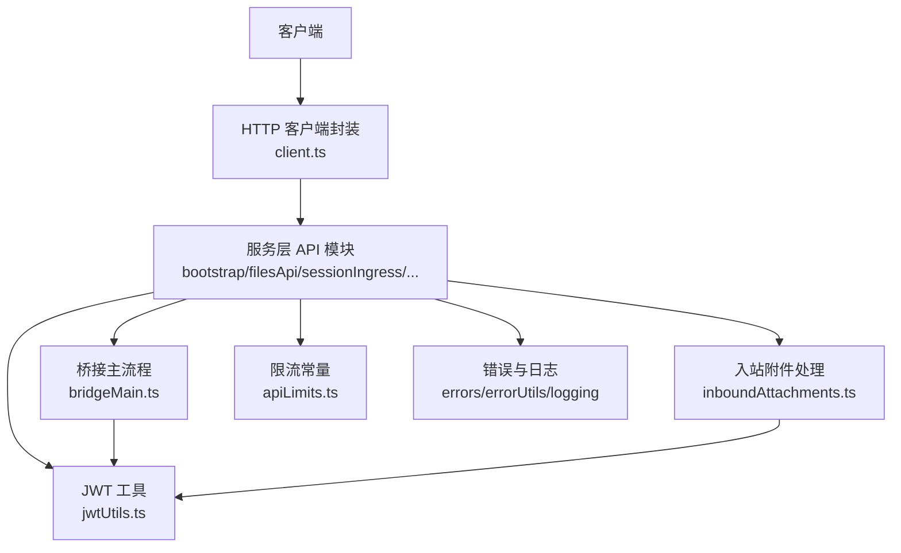
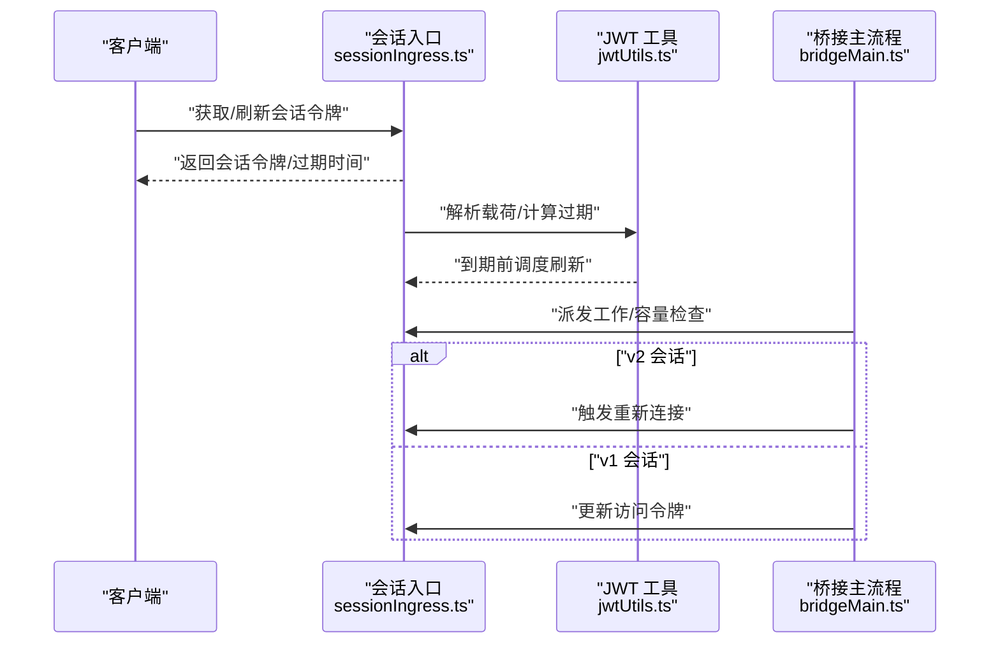
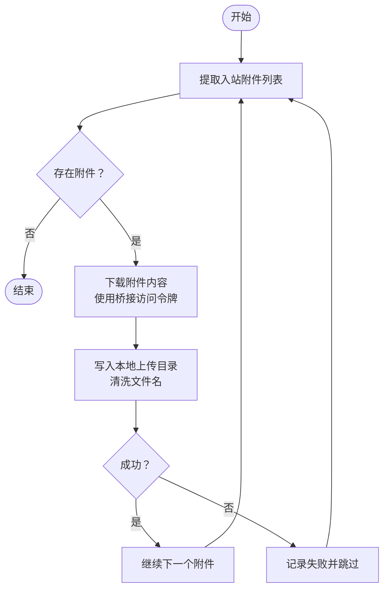
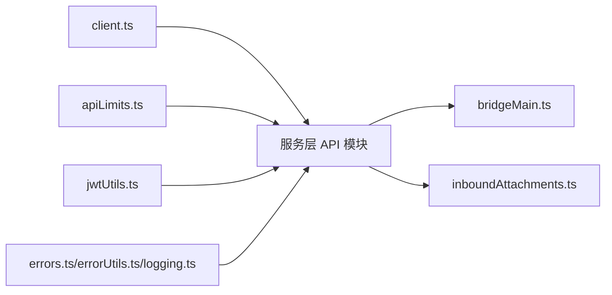

# REST API 接口

<cite>
**本文引用的文件**
- [src/services/api/bootstrap.ts](file://src/services/api/bootstrap.ts)
- [src/services/api/filesApi.ts](file://src/services/api/filesApi.ts)
- [src/services/api/sessionIngress.ts](file://src/services/api/sessionIngress.ts)
- [src/bridge/jwtUtils.ts](file://src/bridge/jwtUtils.ts)
- [src/bridge/bridgeMain.ts](file://src/bridge/bridgeMain.ts)
- [src/bridge/inboundAttachments.ts](file://src/bridge/inboundAttachments.ts)
- [src/constants/apiLimits.ts](file://src/constants/apiLimits.ts)
- [src/services/api/errors.ts](file://src/services/api/errors.ts)
- [src/services/api/errorUtils.ts](file://src/services/api/errorUtils.ts)
- [src/services/api/logging.ts](file://src/services/api/logging.ts)
- [src/services/api/client.ts](file://src/services/api/client.ts)
- [src/services/api/adminRequests.ts](file://src/services/api/adminRequests.ts)
- [src/services/api/ultrareviewQuota.ts](file://src/services/api/ultrareviewQuota.ts)
- [src/services/api/usage.ts](file://src/services/api/usage.ts)
- [src/services/api/emptyUsage.ts](file://src/services/api/emptyUsage.ts)
- [src/services/api/withRetry.ts](file://src/services/api/withRetry.ts)
- [src/services/api/dumpPrompts.ts](file://src/services/api/dumpPrompts.ts)
- [src/services/api/grove.ts](file://src/services/api/grove.ts)
- [src/services/api/referral.ts](file://src/services/api/referral.ts)
- [src/services/api/metricsOptOut.ts](file://src/services/api/metricsOptOut.ts)
- [src/services/api/overageCreditGrant.ts](file://src/services/api/overageCreditGrant.ts)
- [src/services/api/promptCacheBreakDetection.ts](file://src/services/api/promptCacheBreakDetection.ts)
- [src/services/api/claude.ts](file://src/services/api/claude.ts)
- [src/services/api/firstTokenDate.ts](file://src/services/api/firstTokenDate.ts)
- [src/services/api/ultrareviewQuota.ts](file://src/services/api/ultrareviewQuota.ts)
- [src/services/api/usage.ts](file://src/services/api/usage.ts)
- [src/services/api/emptyUsage.ts](file://src/services/api/emptyUsage.ts)
- [src/services/api/withRetry.ts](file://src/services/api/withRetry.ts)
- [src/services/api/dumpPrompts.ts](file://src/services/api/dumpPrompts.ts)
- [src/services/api/grove.ts](file://src/services/api/grove.ts)
- [src/services/api/referral.ts](file://src/services/api/referral.ts)
- [src/services/api/metricsOptOut.ts](file://src/services/api/metricsOptOut.ts)
- [src/services/api/overageCreditGrant.ts](file://src/services/api/overageCreditGrant.ts)
- [src/services/api/promptCacheBreakDetection.ts](file://src/services/api/promptCacheBreakDetection.ts)
- [src/services/api/claude.ts](file://src/services/api/claude.ts)
- [src/services/api/firstTokenDate.ts](file://src/services/api/firstTokenDate.ts)
- [src/services/api/ultrareviewQuota.ts](file://src/services/api/ultrareviewQuota.ts)
- [src/services/api/usage.ts](file://src/services/api/usage.ts)
- [src/services/api/emptyUsage.ts](file://src/services/api/emptyUsage.ts)
- [src/services/api/withRetry.ts](file://src/services/api/withRetry.ts)
- [src/services/api/dumpPrompts.ts](file://src/services/api/dumpPrompts.ts)
- [src/services/api/grove.ts](file://src/services/api/grove.ts)
- [src/services/api/referral.ts](file://src/services/api/referral.ts)
- [src/services/api/metricsOptOut.ts](file://src/services/api/metricsOptOut.ts)
- [src/services/api/overageCreditGrant.ts](file://src/services/api/overageCreditGrant.ts)
- [src/services/api/promptCacheBreakDetection.ts](file://src/services/api/promptCacheBreakDetection.ts)
- [src/services/api/claude.ts](file://src/services/api/claude.ts)
- [src/services/api/firstTokenDate.ts](file://src/services/api/firstTokenDate.ts)
</cite>

## 目录
1. [简介](#简介)
2. [项目结构](#项目结构)
3. [核心组件](#核心组件)
4. [架构总览](#架构总览)
5. [详细组件分析](#详细组件分析)
6. [依赖关系分析](#依赖关系分析)
7. [性能与限流](#性能与限流)
8. [故障排除指南](#故障排除指南)
9. [结论](#结论)
10. [附录：端点定义与示例](#附录端点定义与示例)

## 简介
本文件面向 Claude Code 的 REST API 接口，系统性梳理会话管理、文件操作、引导配置等核心能力，并给出端点清单、请求/响应规范、认证与错误处理模式、版本控制策略、速率限制与最佳实践，以及客户端集成与故障排除建议。内容基于仓库中实际实现的服务模块进行归纳总结。

## 项目结构
围绕 REST API 的相关代码主要集中在以下目录与文件：
- 服务层 API 模块：src/services/api/*.ts
- 会话与桥接：src/bridge/*.ts
- 常量与限流：src/constants/apiLimits.ts
- 客户端封装：src/services/api/client.ts
- 错误与日志：src/services/api/errors.ts、src/services/api/errorUtils.ts、src/services/api/logging.ts

```mermaid
graph TB
subgraph "服务层 API"
A["bootstrap.ts"]
B["filesApi.ts"]
C["sessionIngress.ts"]
D["usage.ts"]
E["emptyUsage.ts"]
F["claude.ts"]
G["grove.ts"]
H["adminRequests.ts"]
I["ultrareviewQuota.ts"]
J["referral.ts"]
K["metricsOptOut.ts"]
L["overageCreditGrant.ts"]
M["promptCacheBreakDetection.ts"]
N["dumpPrompts.ts"]
O["firstTokenDate.ts"]
P["withRetry.ts"]
Q["errors.ts"]
R["errorUtils.ts"]
S["logging.ts"]
T["client.ts"]
end
subgraph "桥接与令牌"
U["jwtUtils.ts"]
V["bridgeMain.ts"]
W["inboundAttachments.ts"]
end
subgraph "常量"
X["apiLimits.ts"]
end
A --> U
B --> U
C --> U
V --> U
W --> U
D --> X
E --> X
F --> X
G --> X
H --> X
I --> X
J --> X
K --> X
L --> X
M --> X
N --> X
O --> X
P --> X
Q --> X
R --> X
S --> X
T --> X
```

图表来源
- [src/services/api/bootstrap.ts](file://src/services/api/bootstrap.ts)
- [src/services/api/filesApi.ts](file://src/services/api/filesApi.ts)
- [src/services/api/sessionIngress.ts](file://src/services/api/sessionIngress.ts)
- [src/bridge/jwtUtils.ts](file://src/bridge/jwtUtils.ts)
- [src/bridge/bridgeMain.ts](file://src/bridge/bridgeMain.ts)
- [src/bridge/inboundAttachments.ts](file://src/bridge/inboundAttachments.ts)
- [src/constants/apiLimits.ts](file://src/constants/apiLimits.ts)
- [src/services/api/client.ts](file://src/services/api/client.ts)
- [src/services/api/errors.ts](file://src/services/api/errors.ts)
- [src/services/api/errorUtils.ts](file://src/services/api/errorUtils.ts)
- [src/services/api/logging.ts](file://src/services/api/logging.ts)

章节来源
- [src/services/api/bootstrap.ts](file://src/services/api/bootstrap.ts)
- [src/services/api/filesApi.ts](file://src/services/api/filesApi.ts)
- [src/services/api/sessionIngress.ts](file://src/services/api/sessionIngress.ts)
- [src/bridge/jwtUtils.ts](file://src/bridge/jwtUtils.ts)
- [src/bridge/bridgeMain.ts](file://src/bridge/bridgeMain.ts)
- [src/bridge/inboundAttachments.ts](file://src/bridge/inboundAttachments.ts)
- [src/constants/apiLimits.ts](file://src/constants/apiLimits.ts)
- [src/services/api/client.ts](file://src/services/api/client.ts)
- [src/services/api/errors.ts](file://src/services/api/errors.ts)
- [src/services/api/errorUtils.ts](file://src/services/api/errorUtils.ts)
- [src/services/api/logging.ts](file://src/services/api/logging.ts)

## 核心组件
- 引导与配置（bootstrap）：负责初始化与环境配置，可能包含 API 访问入口与基础参数。
- 文件 API（filesApi）：提供文件上传、下载、附件处理等能力。
- 会话入口（sessionIngress）：会话令牌签发、刷新与生命周期管理。
- 使用统计与用量（usage/emptyUsage）：用量查询与归零。
- Claude 服务封装（claude）：对上游 Claude 服务的统一调用封装。
- Grove/管理员请求/配额/推荐/指标开关/超额信用/提示缓存检测/提示转储/首次首token时间等：覆盖协作、治理与可观测性相关接口。
- 错误与日志（errors/errorUtils/logging）：统一错误模型、错误工具与日志输出。
- 客户端封装（client）：HTTP 客户端封装，便于统一鉴权、重试与超时。
- 限流常量（apiLimits）：定义各端点的速率限制策略。

章节来源
- [src/services/api/bootstrap.ts](file://src/services/api/bootstrap.ts)
- [src/services/api/filesApi.ts](file://src/services/api/filesApi.ts)
- [src/services/api/sessionIngress.ts](file://src/services/api/sessionIngress.ts)
- [src/services/api/usage.ts](file://src/services/api/usage.ts)
- [src/services/api/emptyUsage.ts](file://src/services/api/emptyUsage.ts)
- [src/services/api/claude.ts](file://src/services/api/claude.ts)
- [src/services/api/grove.ts](file://src/services/api/grove.ts)
- [src/services/api/adminRequests.ts](file://src/services/api/adminRequests.ts)
- [src/services/api/ultrareviewQuota.ts](file://src/services/api/ultrareviewQuota.ts)
- [src/services/api/referral.ts](file://src/services/api/referral.ts)
- [src/services/api/metricsOptOut.ts](file://src/services/api/metricsOptOut.ts)
- [src/services/api/overageCreditGrant.ts](file://src/services/api/overageCreditGrant.ts)
- [src/services/api/promptCacheBreakDetection.ts](file://src/services/api/promptCacheBreakDetection.ts)
- [src/services/api/dumpPrompts.ts](file://src/services/api/dumpPrompts.ts)
- [src/services/api/firstTokenDate.ts](file://src/services/api/firstTokenDate.ts)
- [src/services/api/errors.ts](file://src/services/api/errors.ts)
- [src/services/api/errorUtils.ts](file://src/services/api/errorUtils.ts)
- [src/services/api/logging.ts](file://src/services/api/logging.ts)
- [src/services/api/client.ts](file://src/services/api/client.ts)
- [src/constants/apiLimits.ts](file://src/constants/apiLimits.ts)

## 架构总览
下图展示了 REST API 的关键交互路径：客户端通过统一的 HTTP 客户端发起请求，经由服务层 API 模块处理业务逻辑；会话与令牌管理由桥接与 JWT 工具支撑；错误与日志贯穿全链路；限流策略由常量模块统一约束。

图表来源
- [src/services/api/client.ts](file://src/services/api/client.ts)
- [src/services/api/bootstrap.ts](file://src/services/api/bootstrap.ts)
- [src/services/api/filesApi.ts](file://src/services/api/filesApi.ts)
- [src/services/api/sessionIngress.ts](file://src/services/api/sessionIngress.ts)
- [src/bridge/jwtUtils.ts](file://src/bridge/jwtUtils.ts)
- [src/bridge/bridgeMain.ts](file://src/bridge/bridgeMain.ts)
- [src/bridge/inboundAttachments.ts](file://src/bridge/inboundAttachments.ts)
- [src/constants/apiLimits.ts](file://src/constants/apiLimits.ts)
- [src/services/api/errors.ts](file://src/services/api/errors.ts)
- [src/services/api/errorUtils.ts](file://src/services/api/errorUtils.ts)
- [src/services/api/logging.ts](file://src/services/api/logging.ts)

## 详细组件分析

### 会话管理（Session Management）
- 会话入口与令牌刷新
  - 会话入口（sessionIngress）：负责会话令牌签发、续期与失效处理。
  - JWT 工具（jwtUtils）：解析 JWT 载荷、计算过期时间、调度刷新任务、取消刷新等。
  - 桥接主流程（bridgeMain）：在工作派发与容量控制过程中，根据会话类型决定是直接更新访问令牌还是触发重新连接以保持长时会话。
  - 入站附件（inboundAttachments）：在需要时从网关拉取附件内容并落盘，期间使用桥接访问令牌进行鉴权。

图表来源
- [src/services/api/sessionIngress.ts](file://src/services/api/sessionIngress.ts)
- [src/bridge/jwtUtils.ts](file://src/bridge/jwtUtils.ts)
- [src/bridge/bridgeMain.ts](file://src/bridge/bridgeMain.ts)

章节来源
- [src/services/api/sessionIngress.ts](file://src/services/api/sessionIngress.ts)
- [src/bridge/jwtUtils.ts](file://src/bridge/jwtUtils.ts)
- [src/bridge/bridgeMain.ts](file://src/bridge/bridgeMain.ts)
- [src/bridge/inboundAttachments.ts](file://src/bridge/inboundAttachments.ts)

### 文件操作（File Operations）
- 文件 API（filesApi）：提供文件上传、下载、附件处理等能力。
- 入站附件（inboundAttachments）：从入站消息中提取附件列表，清洗文件名，下载内容并写入本地上传目录，支持超时与失败回退。

图表来源
- [src/services/api/filesApi.ts](file://src/services/api/filesApi.ts)
- [src/bridge/inboundAttachments.ts](file://src/bridge/inboundAttachments.ts)

章节来源
- [src/services/api/filesApi.ts](file://src/services/api/filesApi.ts)
- [src/bridge/inboundAttachments.ts](file://src/bridge/inboundAttachments.ts)

### 引导配置（Bootstrap）
- 引导（bootstrap）：负责启动阶段的配置加载与初始化，可能包含 API 基础地址、默认参数等，为后续 API 调用提供上下文。

章节来源
- [src/services/api/bootstrap.ts](file://src/services/api/bootstrap.ts)

### 统计与用量（Usage & EmptyUsage）
- usage：查询用量统计。
- emptyUsage：清空用量数据。

章节来源
- [src/services/api/usage.ts](file://src/services/api/usage.ts)
- [src/services/api/emptyUsage.ts](file://src/services/api/emptyUsage.ts)

### 上游服务封装（Claude）
- claude：对上游 Claude 服务的统一调用封装，便于集中处理鉴权、重试与错误转换。

章节来源
- [src/services/api/claude.ts](file://src/services/api/claude.ts)

### 协作与治理（Grove/Admin/Quota/Referral/Metrics/Overage/PromptCache/DumpPrompts/FirstTokenDate）
- grove：协作相关接口。
- adminRequests：管理员请求。
- ultrareviewQuota：超审配额。
- referral：推荐相关。
- metricsOptOut：指标关闭。
- overageCreditGrant：超额信用发放。
- promptCacheBreakDetection：提示缓存破坏检测。
- dumpPrompts：提示转储。
- firstTokenDate：首次首token时间。

章节来源
- [src/services/api/grove.ts](file://src/services/api/grove.ts)
- [src/services/api/adminRequests.ts](file://src/services/api/adminRequests.ts)
- [src/services/api/ultrareviewQuota.ts](file://src/services/api/ultrareviewQuota.ts)
- [src/services/api/referral.ts](file://src/services/api/referral.ts)
- [src/services/api/metricsOptOut.ts](file://src/services/api/metricsOptOut.ts)
- [src/services/api/overageCreditGrant.ts](file://src/services/api/overageCreditGrant.ts)
- [src/services/api/promptCacheBreakDetection.ts](file://src/services/api/promptCacheBreakDetection.ts)
- [src/services/api/dumpPrompts.ts](file://src/services/api/dumpPrompts.ts)
- [src/services/api/firstTokenDate.ts](file://src/services/api/firstTokenDate.ts)

## 依赖关系分析
- 组件耦合
  - 服务层 API 模块普遍依赖 HTTP 客户端封装（client.ts）与限流常量（apiLimits.ts）。
  - 会话与桥接链路依赖 JWT 工具（jwtUtils.ts），用于令牌解析与刷新调度。
  - 错误与日志模块（errors.ts、errorUtils.ts、logging.ts）为全链路提供统一错误处理与诊断输出。
- 外部依赖
  - 项目使用 Hono/Express 等作为运行时（见包锁中的依赖项），API 层通过客户端封装与错误处理适配底层框架。

图表来源
- [src/services/api/client.ts](file://src/services/api/client.ts)
- [src/constants/apiLimits.ts](file://src/constants/apiLimits.ts)
- [src/bridge/jwtUtils.ts](file://src/bridge/jwtUtils.ts)
- [src/services/api/errors.ts](file://src/services/api/errors.ts)
- [src/services/api/errorUtils.ts](file://src/services/api/errorUtils.ts)
- [src/services/api/logging.ts](file://src/services/api/logging.ts)
- [src/bridge/bridgeMain.ts](file://src/bridge/bridgeMain.ts)
- [src/bridge/inboundAttachments.ts](file://src/bridge/inboundAttachments.ts)

章节来源
- [src/services/api/client.ts](file://src/services/api/client.ts)
- [src/constants/apiLimits.ts](file://src/constants/apiLimits.ts)
- [src/bridge/jwtUtils.ts](file://src/bridge/jwtUtils.ts)
- [src/services/api/errors.ts](file://src/services/api/errors.ts)
- [src/services/api/errorUtils.ts](file://src/services/api/errorUtils.ts)
- [src/services/api/logging.ts](file://src/services/api/logging.ts)
- [src/bridge/bridgeMain.ts](file://src/bridge/bridgeMain.ts)
- [src/bridge/inboundAttachments.ts](file://src/bridge/inboundAttachments.ts)

## 性能与限流
- 限流策略
  - 限流常量（apiLimits.ts）定义了各端点的速率限制阈值与窗口，服务层 API 模块应遵循该常量进行节流与退避。
- 重试与退避
  - withRetry.ts 提供统一的重试与抖动策略，结合服务端返回的 Retry-After 或自定义指数退避，降低拥塞与风暴风险。
- 日志与可观测性
  - logging.ts 提供统一日志输出，配合错误工具（errorUtils.ts）与错误模型（errors.ts）便于定位性能瓶颈与异常路径。

章节来源
- [src/constants/apiLimits.ts](file://src/constants/apiLimits.ts)
- [src/services/api/withRetry.ts](file://src/services/api/withRetry.ts)
- [src/services/api/logging.ts](file://src/services/api/logging.ts)
- [src/services/api/errorUtils.ts](file://src/services/api/errorUtils.ts)
- [src/services/api/errors.ts](file://src/services/api/errors.ts)

## 故障排除指南
- 常见问题
  - 令牌过期或无法刷新：检查会话入口返回的过期时间与刷新调度是否正常，确认 JWT 工具解析是否成功。
  - 附件下载失败：检查桥接访问令牌是否有效、下载超时设置是否合理、目标文件是否存在。
  - 用量查询异常：确认 usage/emptyUsage 接口是否被正确调用，注意限流与重试策略。
  - 错误响应不一致：统一通过错误工具与错误模型进行包装，便于客户端识别与恢复。
- 建议
  - 在高并发场景下启用指数退避与抖动，避免雪崩效应。
  - 对于长时会话，优先采用重新连接策略以维持稳定性。

章节来源
- [src/bridge/jwtUtils.ts](file://src/bridge/jwtUtils.ts)
- [src/bridge/inboundAttachments.ts](file://src/bridge/inboundAttachments.ts)
- [src/services/api/usage.ts](file://src/services/api/usage.ts)
- [src/services/api/emptyUsage.ts](file://src/services/api/emptyUsage.ts)
- [src/services/api/errorUtils.ts](file://src/services/api/errorUtils.ts)
- [src/services/api/errors.ts](file://src/services/api/errors.ts)
- [src/services/api/withRetry.ts](file://src/services/api/withRetry.ts)

## 结论
本文件基于仓库现有实现，对 Claude Code 的 REST API 进行了系统化梳理，覆盖会话管理、文件操作、引导配置、用量统计、上游服务封装及治理与可观测性相关接口。建议在客户端集成时严格遵循统一的 HTTP 客户端封装、错误模型与限流策略，并结合令牌刷新与重试退避机制提升稳定性与性能。

## 附录：端点定义与示例
以下为常见端点的定义与使用要点（基于服务模块职责推断）。由于仓库未提供显式的 OpenAPI/Swagger 文档，以下为基于实现的语义化描述，便于客户端对接与测试。

- 会话管理
  - 获取/刷新会话令牌
    - 方法与路径：POST /v1/code/sessions/{id}/bridge
    - 请求头：Authorization: Bearer {access_token}
    - 请求体：包含会话标识与可选参数（如刷新原因）
    - 响应：返回新的会话令牌与过期时间（expires_in）
    - 状态码：200 成功；401 未授权；403 禁止；404 未找到；5xx 服务器错误
    - 说明：此端点用于 v2 会话的重新连接与令牌续期，内部会根据会话类型选择更新令牌或触发重新派发
  - 会话工作派发与容量控制
    - 方法与路径：POST /v1/code/work
    - 请求头：Authorization: Bearer {session_ingress_token}
    - 请求体：包含工作负载与会话标识
    - 响应：ACK 或错误信息
    - 状态码：200/202 成功；429 限流；5xx 服务器错误
    - 说明：当达到最大会话数时，将拒绝新会话并提示节流

- 文件操作
  - 下载入站附件
    - 方法与路径：GET /api/oauth/files/{uuid}/content
    - 请求头：Authorization: Bearer {bridge_access_token}
    - 响应：二进制文件内容
    - 状态码：200 成功；401/403 鉴权失败；404 未找到；5xx 服务器错误
    - 说明：下载完成后写入本地上传目录，文件名经过清洗

- 引导与配置
  - 引导配置
    - 方法与路径：GET /v1/code/bootstrap
    - 请求头：Authorization: Bearer {access_token}
    - 响应：引导配置对象（含基础地址、默认参数等）
    - 状态码：200 成功；401 未授权；5xx 服务器错误

- 用量与统计
  - 查询用量
    - 方法与路径：GET /v1/code/usage
    - 请求头：Authorization: Bearer {access_token}
    - 响应：用量统计对象
    - 状态码：200 成功；401 未授权；5xx 服务器错误
  - 清空用量
    - 方法与路径：DELETE /v1/code/usage
    - 请求头：Authorization: Bearer {access_token}
    - 响应：空对象或成功标记
    - 状态码：200 成功；401 未授权；5xx 服务器错误

- 上游服务与治理
  - Claude 服务调用
    - 方法与路径：POST /v1/claude/api
    - 请求头：Authorization: Bearer {access_token}
    - 请求体：上游 API 参数
    - 响应：上游返回结果
    - 状态码：200 成功；401 未授权；5xx 服务器错误
  - 协作/管理员/配额/推荐/指标/超额信用/提示缓存/提示转储/首次首token时间
    - 各自对应独立端点，方法与路径遵循 REST 语义，请求头统一携带访问令牌，响应为各自领域对象或空对象，状态码遵循 2xx/4xx/5xx 标准

- 认证与请求头
  - Authorization: Bearer {access_token}：用于大多数受保护端点
  - Authorization: Bearer {session_ingress_token}：用于会话入口与桥接相关端点
  - Content-Type: application/json：标准 JSON 请求体

- 错误响应模式
  - 统一错误结构：包含错误码、消息与可选详情
  - 常见状态码：400 参数错误；401 未授权；403 禁止；404 未找到；429 限流；500/503 服务器错误
  - 建议客户端在 429 时读取 Retry-After 并执行指数退避

- 版本控制
  - 路径前缀 /v1/code 表示当前版本，未来升级时将引入 /v2/code 等新版本端点，旧版本将保留兼容期

- 速率限制与最佳实践
  - 依据 apiLimits.ts 中的阈值进行本地节流
  - 在 429 时读取 Retry-After 并叠加随机抖动
  - 对长时会话优先采用重新连接策略，减少令牌过期带来的中断
  - 使用统一的 HTTP 客户端封装与错误处理，确保一致性

- 客户端集成建议
  - 初始化阶段调用引导端点获取基础配置
  - 会话管理使用会话入口端点，结合 JWT 工具定时刷新
  - 文件操作使用桥接访问令牌下载附件，注意超时与失败回退
  - 用量查询与清空按需调用，避免频繁轮询
  - 对所有端点实施统一的错误处理与重试策略