# SDK 类型定义

<cite>
**本文档引用的文件**
- [src/entrypoints/sdk/coreTypes.ts](file://src/entrypoints/sdk/coreTypes.ts)
- [src/entrypoints/sdk/coreTypes.generated.ts](file://src/entrypoints/sdk/coreTypes.generated.ts)
- [src/entrypoints/sdk/controlTypes.ts](file://src/entrypoints/sdk/controlTypes.ts)
- [src/entrypoints/sdk/toolTypes.ts](file://src/entrypoints/sdk/toolTypes.ts)
- [src/entrypoints/sdk/runtimeTypes.ts](file://src/entrypoints/sdk/runtimeTypes.ts)
- [src/entrypoints/sdk/sdkUtilityTypes.ts](file://src/entrypoints/sdk/sdkUtilityTypes.ts)
- [src/entrypoints/sdk/settingsTypes.generated.ts](file://src/entrypoints/sdk/settingsTypes.generated.ts)
- [src/bridge/bridgeMessaging.ts](file://src/bridge/bridgeMessaging.ts)
- [src/bridge/types.ts](file://src/bridge/types.ts)
- [src/remote/sdkMessageAdapter.ts](file://src/remote/sdkMessageAdapter.ts)
- [src/types/tools.ts](file://src/types/tools.ts)
- [src/types/message.ts](file://src/types/message.ts)
- [src/types/permissions.ts](file://src/types/permissions.ts)
- [src/constants/tools.ts](file://src/constants/tools.ts)
- [src/constants/system.ts](file://src/constants/system.ts)
</cite>

## 目录
1. [简介](#简介)
2. [项目结构](#项目结构)
3. [核心组件](#核心组件)
4. [架构概览](#架构概览)
5. [详细组件分析](#详细组件分析)
6. [依赖分析](#依赖分析)
7. [性能考虑](#性能考虑)
8. [故障排除指南](#故障排除指南)
9. [结论](#结论)
10. [附录](#附录)

## 简介

本文档为 Claude Code 的 SDK 类型定义提供了全面的参考文档。该 SDK 提供了与 Claude Code 平台进行交互的完整类型安全接口，包括核心通信协议、控制消息、工具调用、运行时状态和设置管理等各个方面。

SDK 类型系统采用 TypeScript 编写，通过严格的类型约束确保开发者的代码质量和运行时安全性。系统主要分为五个核心类别：核心类型、控制类型、工具类型、运行时类型和实用类型。

## 项目结构

SDK 类型定义位于 `src/entrypoints/sdk/` 目录下，采用模块化设计，每个文件负责特定功能领域的类型定义：

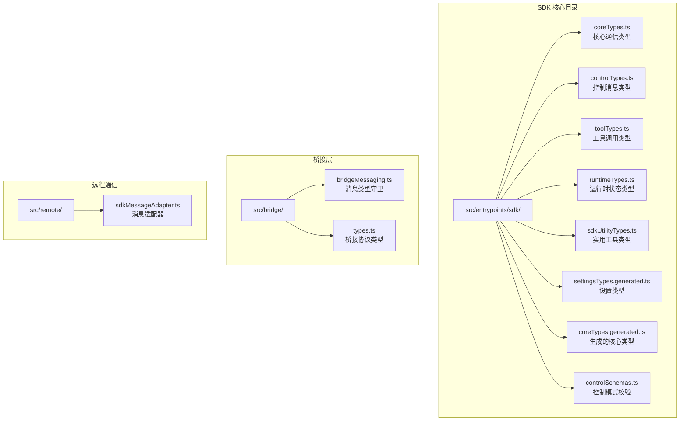

**图表来源**
- [src/entrypoints/sdk/coreTypes.ts](file://src/entrypoints/sdk/coreTypes.ts)
- [src/bridge/bridgeMessaging.ts](file://src/bridge/bridgeMessaging.ts)
- [src/remote/sdkMessageAdapter.ts](file://src/remote/sdkMessageAdapter.ts)

**章节来源**
- [src/entrypoints/sdk/coreTypes.ts](file://src/entrypoints/sdk/coreTypes.ts)
- [src/entrypoints/sdk/controlTypes.ts](file://src/entrypoints/sdk/controlTypes.ts)
- [src/entrypoints/sdk/toolTypes.ts](file://src/entrypoints/sdk/toolTypes.ts)
- [src/entrypoints/sdk/runtimeTypes.ts](file://src/entrypoints/sdk/runtimeTypes.ts)
- [src/entrypoints/sdk/sdkUtilityTypes.ts](file://src/entrypoints/sdk/sdkUtilityTypes.ts)
- [src/entrypoints/sdk/settingsTypes.generated.ts](file://src/entrypoints/sdk/settingsTypes.generated.ts)

## 核心组件

### 核心通信类型

核心通信类型定义了 SDK 与 Claude Code 平台之间的基础通信协议。这些类型构成了整个 SDK 类型系统的基石，提供了类型安全的消息传递机制。

主要类型包括：
- **SDKMessage**: 所有 SDK 消息的基础类型，采用判别联合类型确保类型安全
- **ControlRequest**: 控制请求消息，用于向服务器发送控制指令
- **ControlResponse**: 控制响应消息，用于接收服务器的控制结果
- **ToolUseRequest**: 工具调用请求，用于触发各种工具操作
- **ToolUseResponse**: 工具调用响应，用于接收工具执行结果

### 控制类型

控制类型专门处理权限管理和用户交互流程。这些类型确保了对敏感操作的适当控制和用户同意。

关键类型：
- **PermissionRequest**: 权限请求类型，定义了各种权限申请的结构
- **PermissionResponse**: 权限响应类型，包含了权限决策的结果
- **UserInteractionRequest**: 用户交互请求，用于触发用户确认流程
- **SystemNotification**: 系统通知类型，用于向用户显示重要信息

### 工具类型

工具类型涵盖了所有可用工具的操作接口和参数定义。每个工具都有其特定的输入输出类型，确保工具调用的类型安全。

主要工具类型：
- **FileEditTool**: 文件编辑工具，支持文件内容修改和保存
- **BashTool**: 命令行工具，提供安全的终端命令执行能力
- **WebSearchTool**: 网络搜索工具，支持网页内容检索和分析
- **LSPTool**: 语言服务器协议工具，提供智能代码补全和诊断
- **MCPTool**: 多模型连接协议工具，支持与其他 AI 服务集成

### 运行时类型

运行时类型描述了 SDK 在运行过程中的状态和配置信息。这些类型帮助开发者理解和控制 SDK 的行为。

核心运行时类型：
- **SessionState**: 会话状态类型，跟踪当前对话的状态
- **ToolExecutionState**: 工具执行状态，记录工具调用的进度和结果
- **ErrorState**: 错误状态类型，定义了各种错误情况的表示方法
- **ProgressState**: 进度状态类型，用于显示长时间操作的进度

### 实用类型

实用类型提供了通用的类型工具和辅助类型，简化了常见类型的定义和使用。

包括：
- **AsyncResult**: 异步操作结果类型，封装了成功和失败的情况
- **Maybe**: 可选值类型，处理可能为空的值
- **Either**: 二选一类型，表示两种可能的结果之一
- **RecordOf**: 记录类型，用于键值对数据的类型约束

**章节来源**
- [src/entrypoints/sdk/coreTypes.ts](file://src/entrypoints/sdk/coreTypes.ts)
- [src/entrypoints/sdk/controlTypes.ts](file://src/entrypoints/sdk/controlTypes.ts)
- [src/entrypoints/sdk/toolTypes.ts](file://src/entrypoints/sdk/toolTypes.ts)
- [src/entrypoints/sdk/runtimeTypes.ts](file://src/entrypoints/sdk/runtimeTypes.ts)
- [src/entrypoints/sdk/sdkUtilityTypes.ts](file://src/entrypoints/sdk/sdkUtilityTypes.ts)

## 架构概览

SDK 类型系统采用分层架构设计，确保了良好的模块化和可维护性：

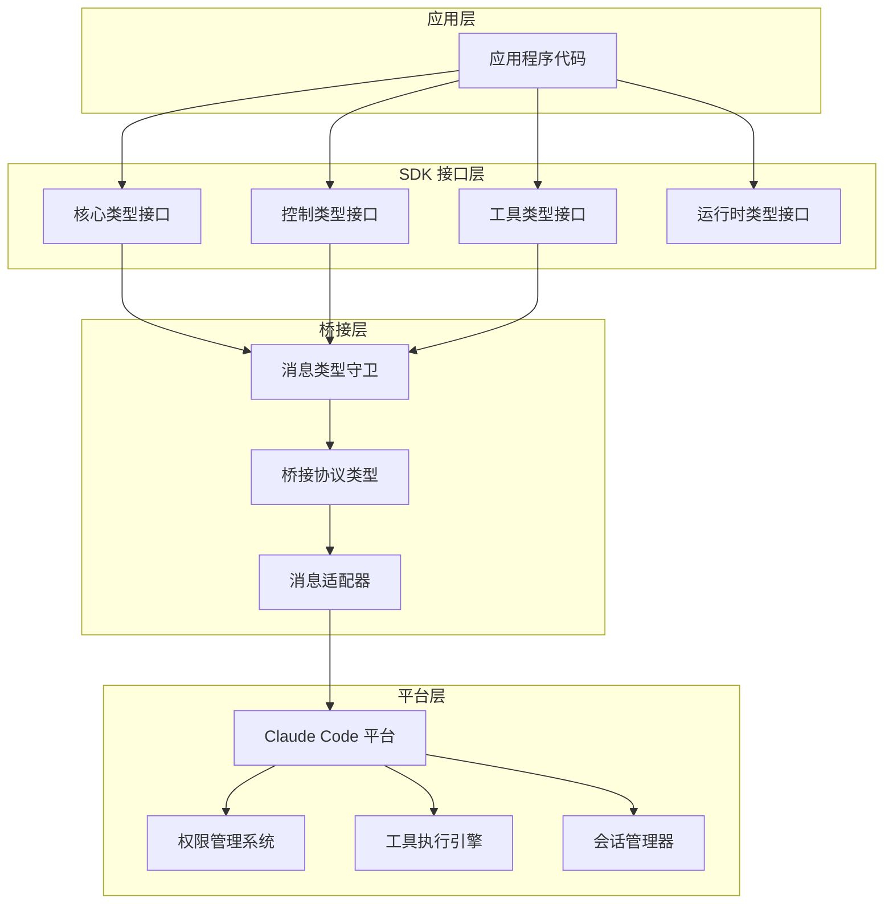

**图表来源**
- [src/bridge/bridgeMessaging.ts](file://src/bridge/bridgeMessaging.ts)
- [src/bridge/types.ts](file://src/bridge/types.ts)
- [src/remote/sdkMessageAdapter.ts](file://src/remote/sdkMessageAdapter.ts)

### 类型层次结构

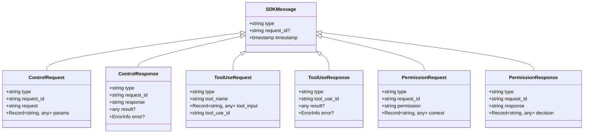

**图表来源**
- [src/entrypoints/sdk/coreTypes.ts](file://src/entrypoints/sdk/coreTypes.ts)
- [src/entrypoints/sdk/controlTypes.ts](file://src/entrypoints/sdk/controlTypes.ts)
- [src/entrypoints/sdk/toolTypes.ts](file://src/entrypoints/sdk/toolTypes.ts)

## 详细组件分析

### 核心通信协议

核心通信协议是 SDK 的基础，定义了所有消息的标准格式和传输机制。

#### 消息类型系统

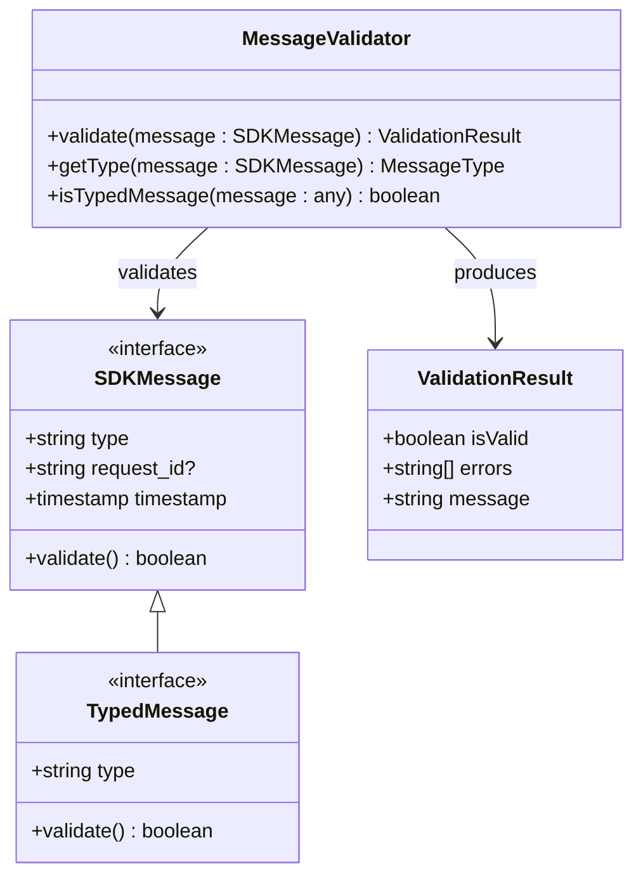

**图表来源**
- [src/bridge/bridgeMessaging.ts](file://src/bridge/bridgeMessaging.ts)

#### 类型守卫实现

SDK 提供了强大的类型守卫函数，确保运行时类型检查的准确性：

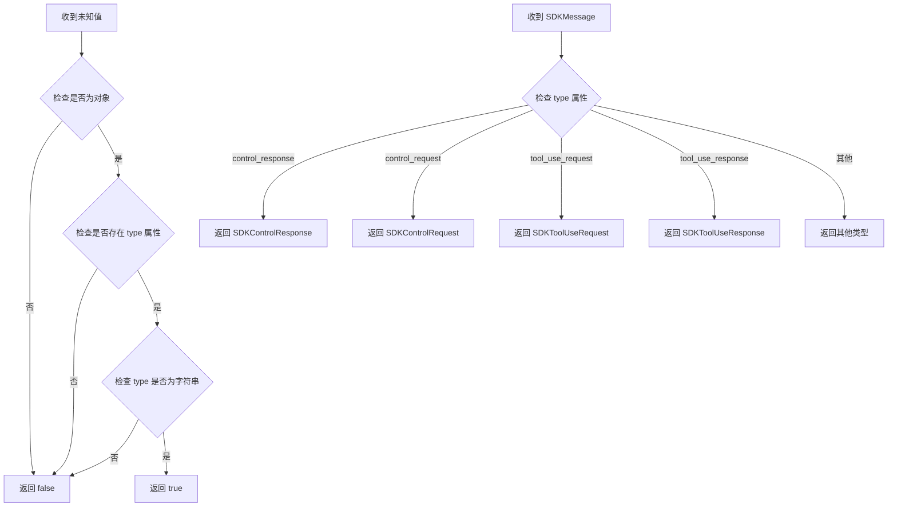

**图表来源**
- [src/bridge/bridgeMessaging.ts](file://src/bridge/bridgeMessaging.ts)

**章节来源**
- [src/bridge/bridgeMessaging.ts](file://src/bridge/bridgeMessaging.ts)
- [src/bridge/types.ts](file://src/bridge/types.ts)

### 控制消息系统

控制消息系统专门处理权限管理和用户交互流程，确保对敏感操作的适当控制。

#### 权限管理类型

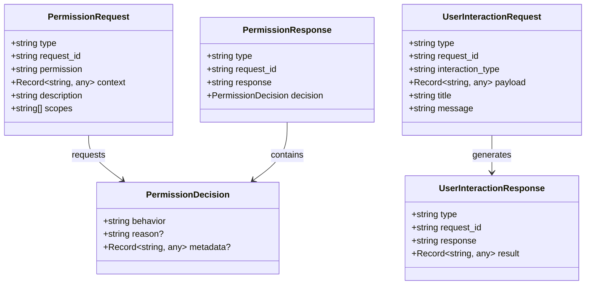

**图表来源**
- [src/entrypoints/sdk/controlTypes.ts](file://src/entrypoints/sdk/controlTypes.ts)
- [src/entrypoints/sdk/coreTypes.ts](file://src/entrypoints/sdk/coreTypes.ts)

#### 控制流程序列

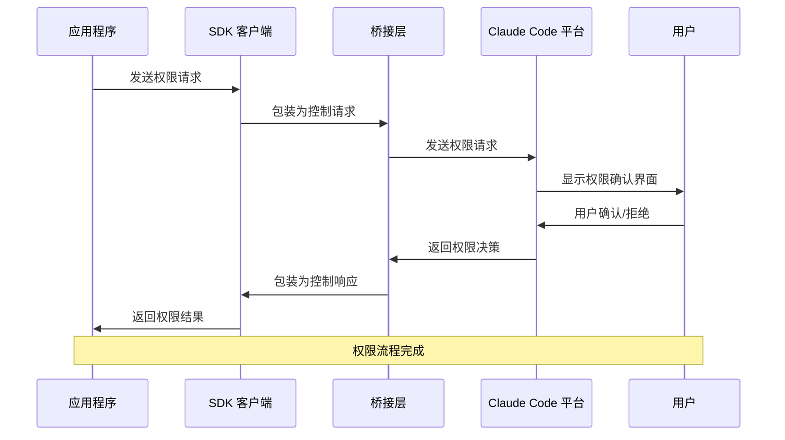

**图表来源**
- [src/bridge/bridgeMessaging.ts](file://src/bridge/bridgeMessaging.ts)
- [src/remote/sdkMessageAdapter.ts](file://src/remote/sdkMessageAdapter.ts)

**章节来源**
- [src/entrypoints/sdk/controlTypes.ts](file://src/entrypoints/sdk/controlTypes.ts)
- [src/entrypoints/sdk/coreTypes.ts](file://src/entrypoints/sdk/coreTypes.ts)

### 工具调用系统

工具调用系统提供了丰富的工具集，每个工具都有其特定的功能和类型定义。

#### 工具类型层次结构

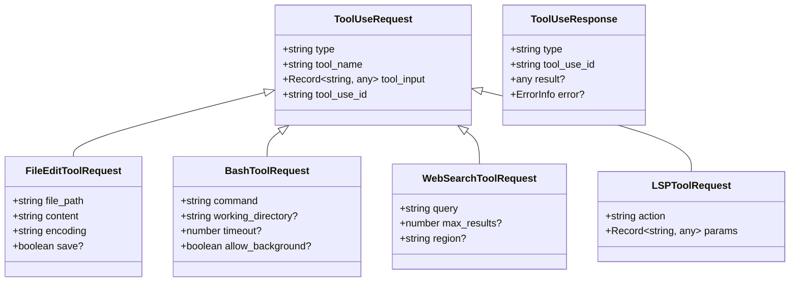

**图表来源**
- [src/entrypoints/sdk/toolTypes.ts](file://src/entrypoints/sdk/toolTypes.ts)
- [src/entrypoints/sdk/coreTypes.ts](file://src/entrypoints/sdk/coreTypes.ts)

#### 工具执行流程

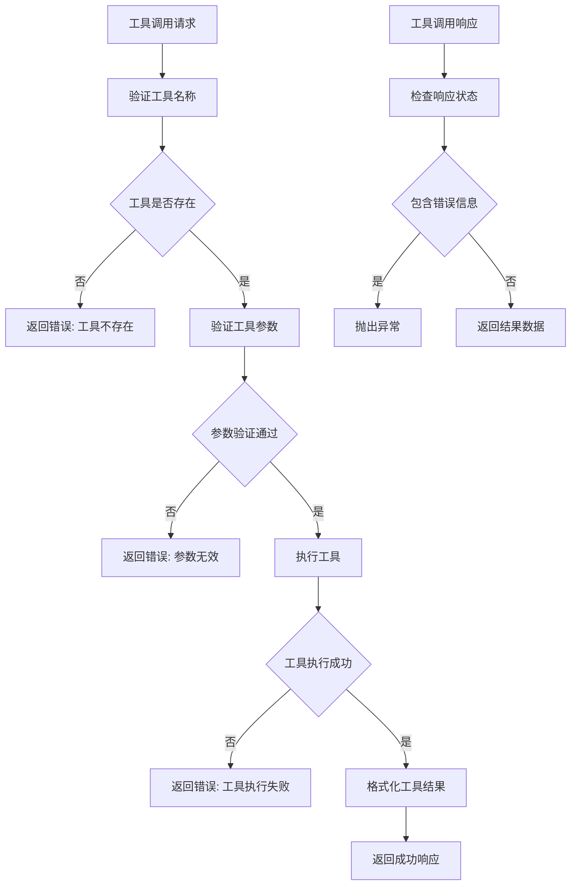

**图表来源**
- [src/entrypoints/sdk/toolTypes.ts](file://src/entrypoints/sdk/toolTypes.ts)
- [src/entrypoints/sdk/coreTypes.ts](file://src/entrypoints/sdk/coreTypes.ts)

**章节来源**
- [src/entrypoints/sdk/toolTypes.ts](file://src/entrypoints/sdk/toolTypes.ts)
- [src/entrypoints/sdk/coreTypes.ts](file://src/entrypoints/sdk/coreTypes.ts)

### 运行时状态管理

运行时状态管理系统跟踪 SDK 的当前状态和配置，确保应用程序能够正确响应状态变化。

#### 状态类型定义

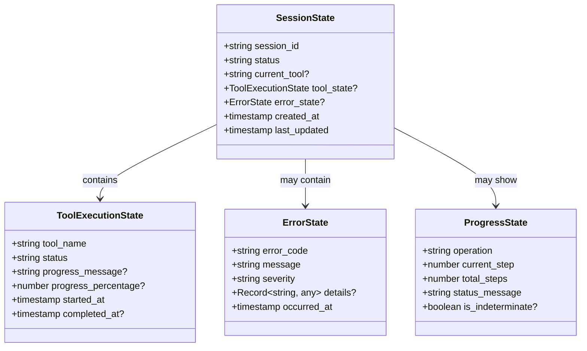

**图表来源**
- [src/entrypoints/sdk/runtimeTypes.ts](file://src/entrypoints/sdk/runtimeTypes.ts)

#### 状态转换流程

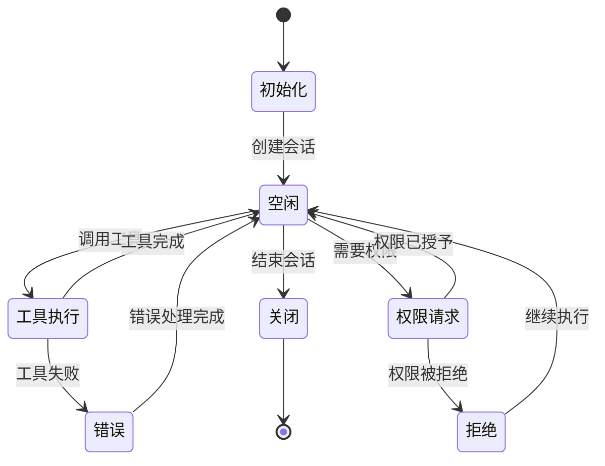

**图表来源**
- [src/entrypoints/sdk/runtimeTypes.ts](file://src/entrypoints/sdk/runtimeTypes.ts)

**章节来源**
- [src/entrypoints/sdk/runtimeTypes.ts](file://src/entrypoints/sdk/runtimeTypes.ts)

### 设置类型系统

设置类型系统提供了对 SDK 配置的完整类型安全访问，包括用户偏好设置和系统配置。

#### 设置类型层次

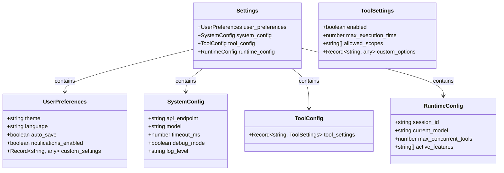

**图表来源**
- [src/entrypoints/sdk/settingsTypes.generated.ts](file://src/entrypoints/sdk/settingsTypes.generated.ts)

**章节来源**
- [src/entrypoints/sdk/settingsTypes.generated.ts](file://src/entrypoints/sdk/settingsTypes.generated.ts)

## 依赖分析

SDK 类型系统具有清晰的依赖关系，确保了模块间的松耦合和高内聚。

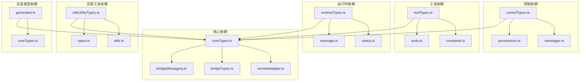

**图表来源**
- [src/entrypoints/sdk/coreTypes.ts](file://src/entrypoints/sdk/coreTypes.ts)
- [src/entrypoints/sdk/controlTypes.ts](file://src/entrypoints/sdk/controlTypes.ts)
- [src/entrypoints/sdk/toolTypes.ts](file://src/entrypoints/sdk/toolTypes.ts)
- [src/entrypoints/sdk/runtimeTypes.ts](file://src/entrypoints/sdk/runtimeTypes.ts)
- [src/entrypoints/sdk/sdkUtilityTypes.ts](file://src/entrypoints/sdk/sdkUtilityTypes.ts)
- [src/entrypoints/sdk/settingsTypes.generated.ts](file://src/entrypoints/sdk/settingsTypes.generated.ts)

### 类型转换规则

SDK 定义了严格的类型转换规则，确保不同类型之间的安全转换：

1. **消息类型转换**: 所有消息必须通过类型守卫验证后才能转换为目标类型
2. **工具参数转换**: 工具调用参数必须符合预定义的接口约束
3. **权限决策转换**: 权限决策必须包含必要的元数据和验证信息
4. **错误类型转换**: 错误信息必须包含适当的错误码和描述

### 验证逻辑

SDK 实现了多层次的验证逻辑：

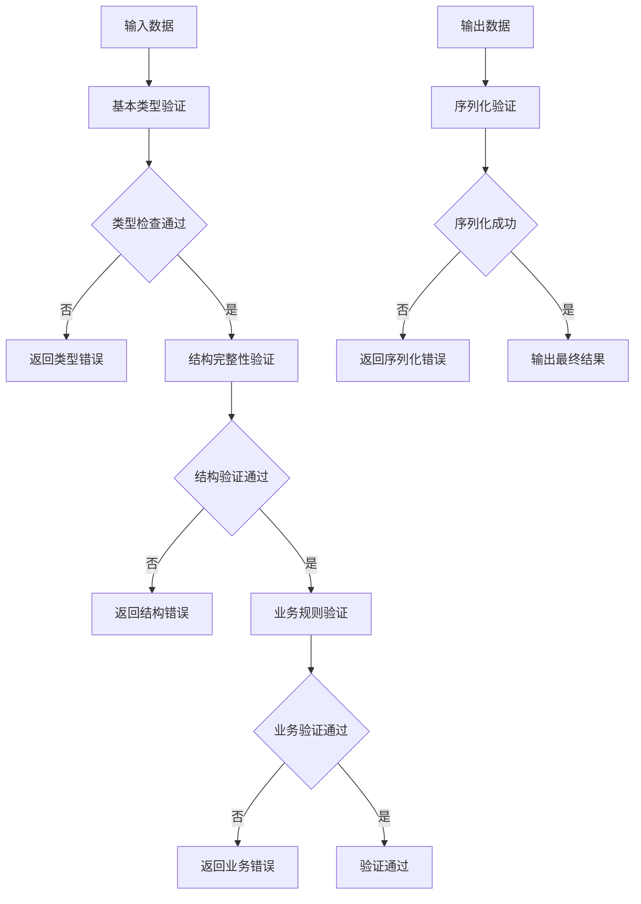

**图表来源**
- [src/bridge/bridgeMessaging.ts](file://src/bridge/bridgeMessaging.ts)

**章节来源**
- [src/bridge/bridgeMessaging.ts](file://src/bridge/bridgeMessaging.ts)
- [src/bridge/types.ts](file://src/bridge/types.ts)

## 性能考虑

SDK 类型系统在设计时充分考虑了性能优化：

### 内存管理
- 使用只读类型定义减少内存分配
- 实现类型缓存机制避免重复验证
- 采用惰性加载策略延迟初始化大型类型

### 类型检查优化
- 实现增量类型检查避免全量验证
- 使用编译时类型推导减少运行时开销
- 优化类型守卫函数的执行效率

### 并发处理
- 支持异步类型验证操作
- 实现类型验证的并发执行
- 提供类型验证的超时机制

## 故障排除指南

### 常见类型错误

1. **类型不匹配错误**: 确保传入的参数类型与期望类型完全一致
2. **缺少必需字段**: 检查所有必需字段是否都已提供
3. **枚举值错误**: 确保枚举值在允许的范围内
4. **时间戳格式错误**: 验证时间戳的格式和有效性

### 调试技巧

1. **启用调试模式**: 在开发环境中启用详细的类型检查日志
2. **使用类型断言**: 在必要时使用类型断言进行调试
3. **检查类型守卫**: 验证类型守卫函数的正确性
4. **单元测试覆盖**: 编写针对类型定义的单元测试

**章节来源**
- [src/entrypoints/sdk/coreTypes.ts](file://src/entrypoints/sdk/coreTypes.ts)
- [src/entrypoints/sdk/controlTypes.ts](file://src/entrypoints/sdk/controlTypes.ts)

## 结论

Claude Code 的 SDK 类型定义系统提供了完整、类型安全的接口，支持复杂的 AI 助手交互场景。通过精心设计的类型层次结构和严格的验证机制，SDK 确保了开发者的代码质量和运行时安全性。

该类型系统的主要优势包括：
- 完整的类型安全保障
- 清晰的模块化设计
- 强大的扩展性
- 优秀的性能表现
- 详细的错误处理机制

随着 Claude Code 平台的发展，SDK 类型系统将继续演进，为开发者提供更好的类型安全体验。

## 附录

### 版本兼容性

SDK 类型系统遵循语义化版本控制，主要版本变更包括：
- **主要版本更新**: 可能包含破坏性变更，需要重新编写代码
- **次要版本更新**: 添加新功能但保持向后兼容
- **修订版本更新**: 修复 bug 和小的改进

### 废弃类型和迁移指南

当某些类型被标记为废弃时，开发者应该：
1. 查看废弃通知和替代方案
2. 更新代码以使用新的类型定义
3. 测试代码以确保功能正常
4. 移除废弃类型的使用

### 最佳实践

1. **类型优先**: 始终优先使用类型安全的 API
2. **错误处理**: 实现完善的错误处理机制
3. **性能优化**: 利用 SDK 提供的性能优化特性
4. **测试覆盖**: 编写全面的单元测试和集成测试
5. **文档维护**: 保持代码注释和文档的最新状态