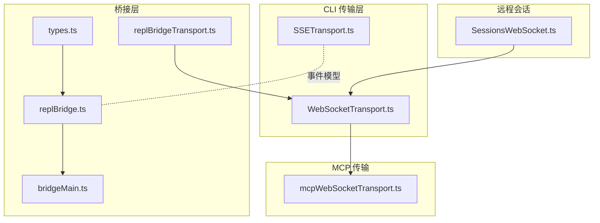
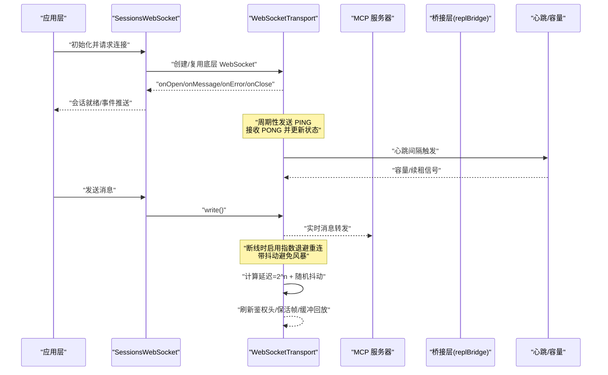
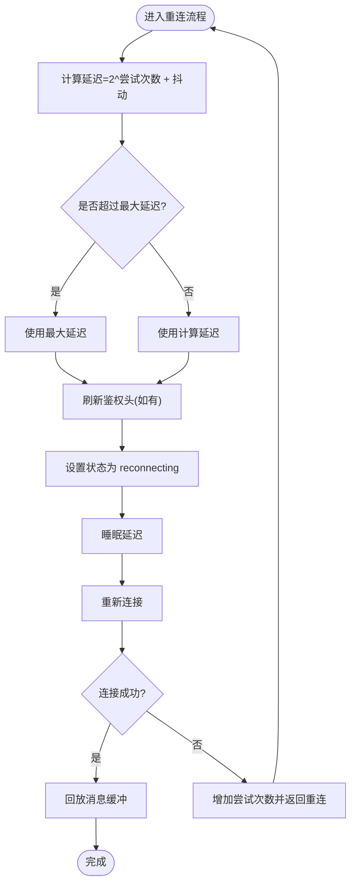
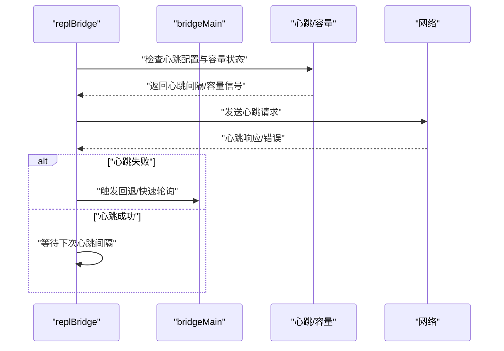
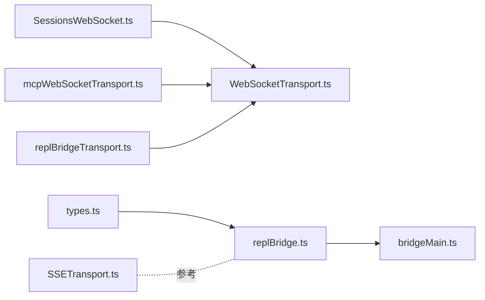

# WebSocket 实时接口

<cite>
**本文引用的文件**
- [src/remote/SessionsWebSocket.ts](file://src/remote/SessionsWebSocket.ts)
- [src/cli/transports/WebSocketTransport.ts](file://src/cli/transports/WebSocketTransport.ts)
- [src/utils/mcpWebSocketTransport.ts](file://src/utils/mcpWebSocketTransport.ts)
- [src/bridge/replBridgeTransport.ts](file://src/bridge/replBridgeTransport.ts)
- [src/bridge/bridgeMain.ts](file://src/bridge/bridgeMain.ts)
- [src/bridge/replBridge.ts](file://src/bridge/replBridge.ts)
- [src/cli/transports/SSETransport.ts](file://src/cli/transports/SSETransport.ts)
- [src/bridge/types.ts](file://src/bridge/types.ts)
</cite>

## 目录
1. [简介](#简介)
2. [项目结构](#项目结构)
3. [核心组件](#核心组件)
4. [架构总览](#架构总览)
5. [详细组件分析](#详细组件分析)
6. [依赖关系分析](#依赖关系分析)
7. [性能考虑](#性能考虑)
8. [故障排查指南](#故障排查指南)
9. [结论](#结论)
10. [附录](#附录)

## 简介
本文件系统性梳理 Claude Code 的 WebSocket 实时通信接口，覆盖连接建立、消息格式与事件类型、会话同步、权限变更通知、消息传递、心跳与重连策略、错误处理、序列化与订阅方式、状态同步机制，并提供客户端实现要点、性能优化建议与调试工具使用指南。目标是帮助开发者在不同运行环境（浏览器、Node/Bun、CLI）中正确接入并稳定使用 WebSocket 实时通道。

## 项目结构
与 WebSocket 实时通信相关的核心代码分布在以下模块：
- 远程会话 WebSocket：负责与后端会话通道建立与维护
- CLI 传输层 WebSocket：封装跨运行时的 WebSocket 行为、心跳、保活与重连
- MCP WebSocket 传输：面向 MCP 场景的 WebSocket 适配
- 桥接传输与主循环：桥接层的传输适配、心跳与容量控制
- 事件与消息模型：SSE 事件模型与桥接控制响应事件类型

图表来源
- [src/remote/SessionsWebSocket.ts](file://src/remote/SessionsWebSocket.ts)
- [src/cli/transports/WebSocketTransport.ts](file://src/cli/transports/WebSocketTransport.ts)
- [src/utils/mcpWebSocketTransport.ts](file://src/utils/mcpWebSocketTransport.ts)
- [src/bridge/replBridgeTransport.ts](file://src/bridge/replBridgeTransport.ts)
- [src/bridge/bridgeMain.ts](file://src/bridge/bridgeMain.ts)
- [src/bridge/replBridge.ts](file://src/bridge/replBridge.ts)
- [src/cli/transports/SSETransport.ts](file://src/cli/transports/SSETransport.ts)
- [src/bridge/types.ts](file://src/bridge/types.ts)

章节来源
- [src/remote/SessionsWebSocket.ts](file://src/remote/SessionsWebSocket.ts)
- [src/cli/transports/WebSocketTransport.ts](file://src/cli/transports/WebSocketTransport.ts)
- [src/utils/mcpWebSocketTransport.ts](file://src/utils/mcpWebSocketTransport.ts)
- [src/bridge/replBridgeTransport.ts](file://src/bridge/replBridgeTransport.ts)
- [src/bridge/bridgeMain.ts](file://src/bridge/bridgeMain.ts)
- [src/bridge/replBridge.ts](file://src/bridge/replBridge.ts)
- [src/cli/transports/SSETransport.ts](file://src/cli/transports/SSETransport.ts)
- [src/bridge/types.ts](file://src/bridge/types.ts)

## 核心组件
- SessionsWebSocket：远程会话通道的 WebSocket 客户端，负责与后端会话服务建立连接、发送/接收消息、处理连接状态与错误。
- WebSocketTransport：跨运行时（Node 与 Bun）的 WebSocket 传输抽象，内置心跳、保活帧、消息缓冲与指数退避重连。
- mcpWebSocketTransport：MCP（Model Context Protocol）场景下的 WebSocket 传输适配器，用于与 MCP 服务器进行双向实时通信。
- replBridgeTransport：桥接层对 WebSocketTransport 的 v1 适配包装，统一传输接口以兼容旧版会话入口。
- bridgeMain / replBridge：桥接主循环与心跳管理，结合容量信号与心跳间隔，维持长连接健康与工作项续租。
- SSETransport：SSE 事件模型定义，作为事件流的参考数据结构（尽管实时通道主要通过 WebSocket，但事件模型可类比理解）。
- bridge 控制事件类型：桥接层的控制响应事件（如权限决策）的消息结构。

章节来源
- [src/remote/SessionsWebSocket.ts](file://src/remote/SessionsWebSocket.ts)
- [src/cli/transports/WebSocketTransport.ts](file://src/cli/transports/WebSocketTransport.ts)
- [src/utils/mcpWebSocketTransport.ts](file://src/utils/mcpWebSocketTransport.ts)
- [src/bridge/replBridgeTransport.ts](file://src/bridge/replBridgeTransport.ts)
- [src/bridge/bridgeMain.ts](file://src/bridge/bridgeMain.ts)
- [src/bridge/replBridge.ts](file://src/bridge/replBridge.ts)
- [src/cli/transports/SSETransport.ts](file://src/cli/transports/SSETransport.ts)
- [src/bridge/types.ts](file://src/bridge/types.ts)

## 架构总览
下图展示从应用到后端的实时通信路径，包括连接建立、心跳与保活、消息缓冲与重连、以及桥接层的心跳续租逻辑。

图表来源
- [src/remote/SessionsWebSocket.ts](file://src/remote/SessionsWebSocket.ts)
- [src/cli/transports/WebSocketTransport.ts](file://src/cli/transports/WebSocketTransport.ts)
- [src/bridge/replBridge.ts](file://src/bridge/replBridge.ts)
- [src/bridge/bridgeMain.ts](file://src/bridge/bridgeMain.ts)

## 详细组件分析

### SessionsWebSocket 组件分析
- 职责：封装与后端会话服务的 WebSocket 连接生命周期管理；负责消息编解码、事件分发与错误上报。
- 关键点：
  - 连接建立：根据配置构造 URL 与头部，发起握手。
  - 事件分发：将收到的消息按事件类型路由至订阅者。
  - 错误处理：区分网络错误、协议错误与业务错误，触发重连或降级。
- 适用场景：远程会话入口、消息同步、权限变更通知等。

章节来源
- [src/remote/SessionsWebSocket.ts](file://src/remote/SessionsWebSocket.ts)

### WebSocketTransport 组件分析
- 职责：跨运行时的 WebSocket 抽象，统一事件回调、心跳、保活与重连策略。
- 心跳与保活：
  - 周期性发送 PING，等待 PONG；若超时则判定连接异常。
  - 发送 keep-alive 数据帧以重置代理空闲计时器。
- 消息缓冲与回放：
  - 断线期间缓存输出消息，重连后按序回放，保证消息可达性。
- 重连策略：
  - 指数退避 + 随机抖动，上限保护，避免雪崩。
  - 支持在重连前刷新鉴权头（如令牌轮换）。
- 运行时差异：
  - 区分 Node 与 Bun 的事件 API，分别移除监听器，防止内存泄漏。
- 适用场景：CLI、REPL、桥接传输等需要稳健 WebSocket 的场景。

图表来源
- [src/cli/transports/WebSocketTransport.ts](file://src/cli/transports/WebSocketTransport.ts)

章节来源
- [src/cli/transports/WebSocketTransport.ts](file://src/cli/transports/WebSocketTransport.ts)

### mcpWebSocketTransport 组件分析
- 职责：为 MCP 场景提供 WebSocket 传输适配，确保与 MCP 服务器的双向实时通信。
- 关键点：
  - 与通用 WebSocketTransport 对齐的接口契约，便于替换与测试。
  - 在 MCP 上下文中处理消息序列化、事件订阅与状态同步。
- 适用场景：与 MCP 服务器进行工具调用、资源读取与上下文交互。

章节来源
- [src/utils/mcpWebSocketTransport.ts](file://src/utils/mcpWebSocketTransport.ts)

### replBridgeTransport 组件分析
- 职责：v1 适配器，将 HybridTransport 的能力映射为 REPL 桥接所需的传输接口。
- 关键点：
  - 写入、关闭、连接状态查询、回调注册等方法透传。
  - v1 会话入口不使用 SSE 序列号，回放语义不同，返回固定序列号以避免 seq 数值影响。
- 适用场景：兼容旧版会话入口，平滑过渡到新协议。

章节来源
- [src/bridge/replBridgeTransport.ts](file://src/bridge/replBridgeTransport.ts)

### 桥接层心跳与容量控制
- 职责：在高负载或容量受限时，通过心跳与容量信号维持连接健康，必要时快速轮询以获取重新派发的工作项。
- 关键点：
  - 心跳间隔由配置决定；当处于容量上限且未禁用心跳时，持续发送心跳。
  - 若心跳失败，可能触发快速轮询或回退策略，避免长时间无响应。
  - 结合桥接主循环，动态调整重连与退避策略。
- 适用场景：远程桥接、REPL 通道、长任务续租。

图表来源
- [src/bridge/replBridge.ts](file://src/bridge/replBridge.ts)
- [src/bridge/bridgeMain.ts](file://src/bridge/bridgeMain.ts)

章节来源
- [src/bridge/replBridge.ts](file://src/bridge/replBridge.ts)
- [src/bridge/bridgeMain.ts](file://src/bridge/bridgeMain.ts)

### 事件与消息模型
- SSE 事件模型（参考）：用于理解事件字段与顺序编号，便于映射到 WebSocket 事件。
  - 字段：事件 ID、序列号、事件类型、来源、载荷、时间戳。
- 桥接控制响应事件：用于权限决策等控制面事件。
  - 类型：控制响应事件
  - 子类型：成功/失败
  - 载荷：包含请求 ID 与响应体

章节来源
- [src/cli/transports/SSETransport.ts](file://src/cli/transports/SSETransport.ts)
- [src/bridge/types.ts](file://src/bridge/types.ts)

## 依赖关系分析
- SessionsWebSocket 依赖 WebSocketTransport 提供的底层连接与重连能力。
- mcpWebSocketTransport 与 WebSocketTransport 共享一致的接口契约，便于替换与扩展。
- replBridgeTransport 将 HybridTransport（内部基于 WebSocketTransport）暴露为统一的传输接口。
- 桥接层（replBridge/bridgeMain）通过心跳与容量信号驱动重连与退避策略。

图表来源
- [src/remote/SessionsWebSocket.ts](file://src/remote/SessionsWebSocket.ts)
- [src/cli/transports/WebSocketTransport.ts](file://src/cli/transports/WebSocketTransport.ts)
- [src/utils/mcpWebSocketTransport.ts](file://src/utils/mcpWebSocketTransport.ts)
- [src/bridge/replBridgeTransport.ts](file://src/bridge/replBridgeTransport.ts)
- [src/bridge/replBridge.ts](file://src/bridge/replBridge.ts)
- [src/bridge/bridgeMain.ts](file://src/bridge/bridgeMain.ts)
- [src/cli/transports/SSETransport.ts](file://src/cli/transports/SSETransport.ts)
- [src/bridge/types.ts](file://src/bridge/types.ts)

章节来源
- [src/remote/SessionsWebSocket.ts](file://src/remote/SessionsWebSocket.ts)
- [src/cli/transports/WebSocketTransport.ts](file://src/cli/transports/WebSocketTransport.ts)
- [src/utils/mcpWebSocketTransport.ts](file://src/utils/mcpWebSocketTransport.ts)
- [src/bridge/replBridgeTransport.ts](file://src/bridge/replBridgeTransport.ts)
- [src/bridge/replBridge.ts](file://src/bridge/replBridge.ts)
- [src/bridge/bridgeMain.ts](file://src/bridge/bridgeMain.ts)
- [src/cli/transports/SSETransport.ts](file://src/cli/transports/SSETransport.ts)
- [src/bridge/types.ts](file://src/bridge/types.ts)

## 性能考虑
- 心跳与保活
  - 合理设置心跳间隔，避免过于频繁导致额外开销；确保在代理空闲超时前发送保活帧。
- 指数退避与抖动
  - 使用指数退避并加入随机抖动，降低重连风暴概率；设置最大延迟上限，避免无限增长。
- 消息缓冲与回放
  - 限制缓冲大小，避免内存占用过高；在重连后按序回放，减少丢包感知。
- 运行时监听器清理
  - 在断开时移除对应运行时的事件监听器，防止闭包与 WS 对象被长期持有。
- 头部刷新
  - 在重连前刷新鉴权头（如令牌），减少因过期导致的连续失败。
- 调试与可观测性
  - 记录连接耗时、重连次数、心跳周期与容量状态，辅助定位问题。

## 故障排查指南
- 连接失败
  - 检查 URL 与头部配置；确认网络可达与代理设置；验证鉴权头是否有效。
- 心跳超时
  - 观察 PING/PONG 是否匹配；检查中间代理是否过滤了 PING/PONG；调整心跳间隔。
- 重连风暴
  - 检查退避参数与抖动是否启用；确认最大延迟是否合理；避免频繁刷新头部导致反复失败。
- 消息丢失
  - 确认消息缓冲是否启用与大小是否足够；检查重连后的回放逻辑是否执行。
- 运行时差异
  - 确认使用正确的事件 API（Node vs Bun）；断开时务必移除监听器。
- 权限与控制事件
  - 检查控制响应事件的 subtype 与 response 字段；确保请求 ID 与响应体匹配。

章节来源
- [src/cli/transports/WebSocketTransport.ts](file://src/cli/transports/WebSocketTransport.ts)
- [src/bridge/replBridge.ts](file://src/bridge/replBridge.ts)
- [src/bridge/bridgeMain.ts](file://src/bridge/bridgeMain.ts)
- [src/bridge/types.ts](file://src/bridge/types.ts)

## 结论
Claude Code 的 WebSocket 实时接口通过 SessionsWebSocket 与 WebSocketTransport 提供了稳健的连接、心跳、保活与重连能力；在桥接层进一步引入心跳与容量控制，保障在高负载场景下的稳定性。配合消息缓冲与头部刷新机制，可在复杂网络环境中保持可靠通信。建议在客户端实现中遵循本文的连接握手、心跳与重连策略、错误处理与性能优化建议，并结合调试工具进行观测与排障。

## 附录

### 消息格式与事件类型
- 事件字段（参考 SSE 模型，便于映射到 WebSocket）：
  - 事件 ID、序列号、事件类型、来源、载荷、时间戳
- 控制响应事件（桥接层）：
  - 类型：控制响应事件
  - 子类型：成功/失败
  - 载荷：包含请求 ID 与响应体

章节来源
- [src/cli/transports/SSETransport.ts](file://src/cli/transports/SSETransport.ts)
- [src/bridge/types.ts](file://src/bridge/types.ts)

### 客户端实现要点
- 连接握手
  - 构造 URL 与头部；在打开回调中记录连接耗时；注册消息与错误回调。
- 心跳机制
  - 设置心跳间隔；发送 PING 并等待 PONG；超时则标记连接异常。
- 保活帧
  - 在代理空闲超时前发送保活帧，避免连接被中断。
- 重连策略
  - 指数退避 + 抖动；达到上限后退避；重连前刷新鉴权头。
- 错误处理
  - 分类错误类型（网络/协议/业务）；根据错误采取重连或降级。
- 订阅与状态同步
  - 订阅事件类型并按序列号处理；在重连后同步状态。

章节来源
- [src/remote/SessionsWebSocket.ts](file://src/remote/SessionsWebSocket.ts)
- [src/cli/transports/WebSocketTransport.ts](file://src/cli/transports/WebSocketTransport.ts)
- [src/bridge/replBridge.ts](file://src/bridge/replBridge.ts)
- [src/bridge/bridgeMain.ts](file://src/bridge/bridgeMain.ts)