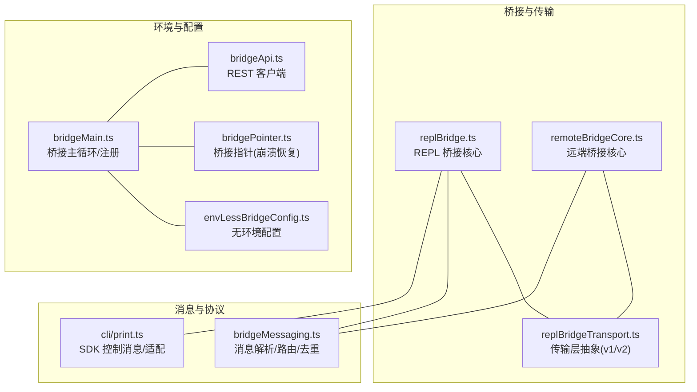
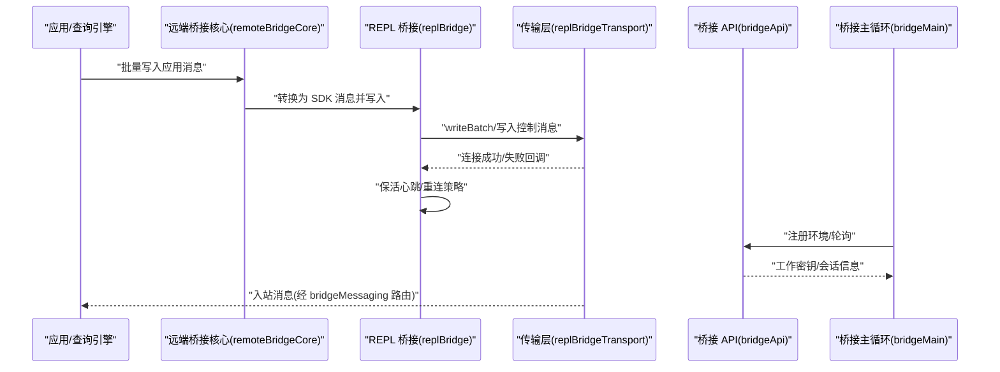
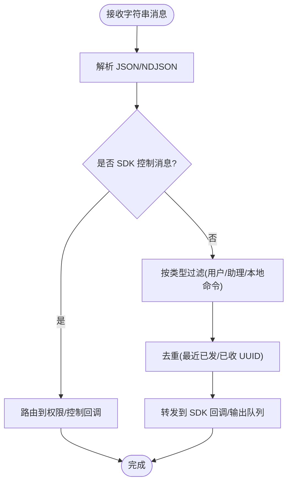
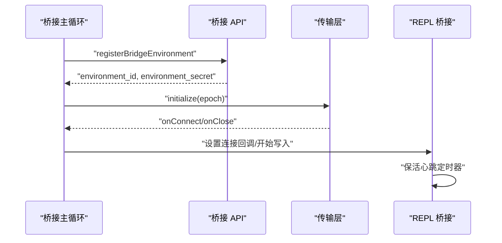
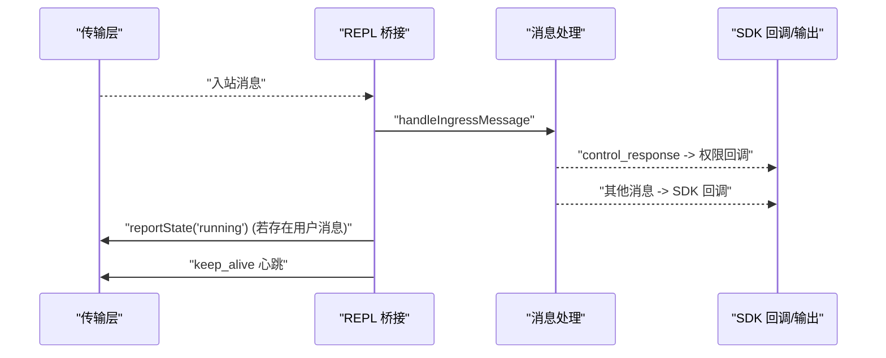
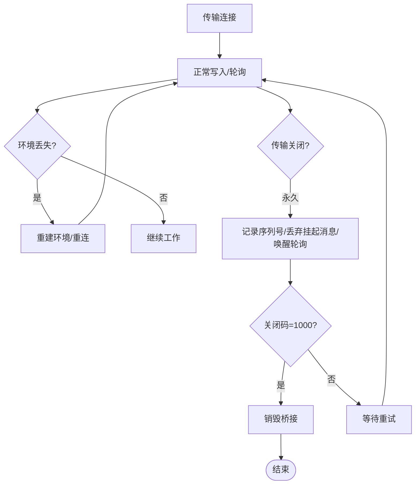
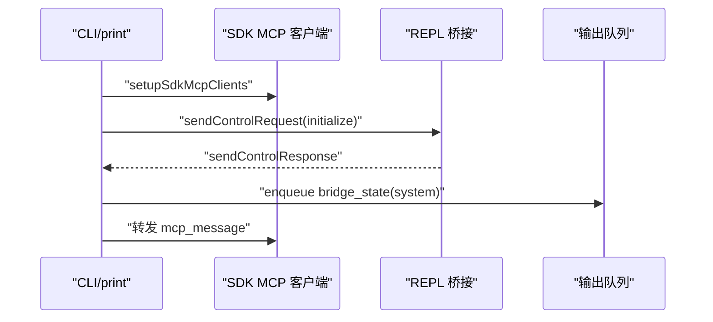
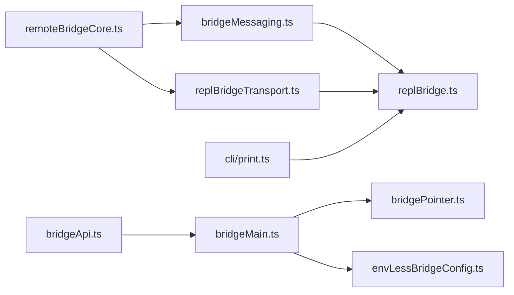

# 进程间通信接口

<cite>
**本文引用的文件**
- [src/bridge/replBridge.ts](file://src/bridge/replBridge.ts)
- [src/bridge/replBridgeTransport.ts](file://src/bridge/replBridgeTransport.ts)
- [src/bridge/bridgeMessaging.ts](file://src/bridge/bridgeMessaging.ts)
- [src/bridge/remoteBridgeCore.ts](file://src/bridge/remoteBridgeCore.ts)
- [src/bridge/bridgeApi.ts](file://src/bridge/bridgeApi.ts)
- [src/bridge/bridgeMain.ts](file://src/bridge/bridgeMain.ts)
- [src/bridge/bridgePointer.ts](file://src/bridge/bridgePointer.ts)
- [src/bridge/envLessBridgeConfig.ts](file://src/bridge/envLessBridgeConfig.ts)
- [src/cli/print.ts](file://src/cli/print.ts)
- [docs/06-bridge.md](file://docs/06-bridge.md)
</cite>

## 目录
1. [引言](#引言)
2. [项目结构](#项目结构)
3. [核心组件](#核心组件)
4. [架构总览](#架构总览)
5. [详细组件分析](#详细组件分析)
6. [依赖关系分析](#依赖关系分析)
7. [性能考量](#性能考量)
8. [故障排查指南](#故障排查指南)
9. [结论](#结论)
10. [附录](#附录)

## 引言
本文件面向 Claude Code 的进程间通信（IPC）接口，系统性阐述本地进程间的消息传递机制，覆盖以下主题：
- 本地传输：基于 Unix 域套接字的 REPL 桥接传输
- 消息格式与协议：SDK 控制消息、消息去重与路由
- 数据序列化：NDJSON 与 JSON 的混合使用
- 桥接建立流程：环境注册、握手、会话初始化与状态上报
- 消息路由与状态同步：入站消息处理、权限请求/响应、控制请求/响应
- 生命周期管理：连接、重连、保活、关闭与销毁
- 错误恢复：认证失败、环境重建、传输初始化失败
- 性能监控：心跳保活、轮询配置、事件埋点
- 客户端实现要点：SDK MCP 适配、CLI 输出桥接、远程控制初始化
- 调试与诊断：日志、埋点、桥接指针与配置

## 项目结构
与 IPC 相关的关键目录与文件如下：
- 桥接核心与传输
  - REPL 桥接核心：src/bridge/replBridge.ts
  - 传输层抽象：src/bridge/replBridgeTransport.ts
  - 远端桥接核心：src/bridge/remoteBridgeCore.ts
- 消息处理与类型
  - 消息解析与路由：src/bridge/bridgeMessaging.ts
  - SDK 控制消息类型定义：src/cli/print.ts（用于 CLI/SDK 适配）
- 环境与配置
  - 桥接 API 客户端：src/bridge/bridgeApi.ts
  - 桥接主入口：src/bridge/bridgeMain.ts
  - 桥接指针（崩溃恢复）：src/bridge/bridgePointer.ts
  - 无环境桥接配置：src/bridge/envLessBridgeConfig.ts
- 文档索引
  - 桥接文档：docs/06-bridge.md

**图表来源**
- [src/bridge/replBridge.ts:617-1839](file://src/bridge/replBridge.ts#L617-L1839)
- [src/bridge/replBridgeTransport.ts:343-370](file://src/bridge/replBridgeTransport.ts#L343-L370)
- [src/bridge/remoteBridgeCore.ts:379-389](file://src/bridge/remoteBridgeCore.ts#L379-L389)
- [src/bridge/bridgeMessaging.ts:31-148](file://src/bridge/bridgeMessaging.ts#L31-L148)
- [src/cli/print.ts:1425-3985](file://src/cli/print.ts#L1425-L3985)
- [src/bridge/bridgeApi.ts:38-74](file://src/bridge/bridgeApi.ts#L38-L74)
- [src/bridge/bridgeMain.ts:2447-2467](file://src/bridge/bridgeMain.ts#L2447-L2467)
- [src/bridge/bridgePointer.ts:52-74](file://src/bridge/bridgePointer.ts#L52-L74)
- [src/bridge/envLessBridgeConfig.ts:119-137](file://src/bridge/envLessBridgeConfig.ts#L119-L137)

**章节来源**
- [docs/06-bridge.md:207-224](file://docs/06-bridge.md#L207-L224)

## 核心组件
- REPL 桥接核心（replBridge.ts）
  - 负责桥接生命周期、消息写入/批处理、权限与控制消息发送、保活心跳、重连与销毁
  - 提供 sendControlRequest/sendControlResponse/sendControlCancelRequest/sendResult 等 API
- 传输层抽象（replBridgeTransport.ts）
  - 统一 v1/v2 协议的连接、初始化、写入与回调
  - 处理初始化失败与连接状态变更
- 远端桥接核心（remoteBridgeCore.ts）
  - 将应用消息转换为 SDK 消息并批量写入传输
  - 上报 worker 状态（如 running），支持控制请求转发
- 消息处理与路由（bridgeMessaging.ts）
  - 类型守卫与消息过滤（仅转发用户/助理对话与特定系统命令）
  - 入站消息解析、去重（基于最近已发/已收 UUID 集合）、路由到 SDK 回调
- SDK 控制消息与适配（cli/print.ts）
  - 定义 SDK 控制消息结构，处理 initialize/mcp_message/rewind_files 等子类型
  - 作为 CLI 与 SDK MCP 服务器之间的适配层
- 桥接 API 客户端（bridgeApi.ts）
  - 提供环境注册、轮询与错误分类（致命错误）
- 桥接主入口（bridgeMain.ts）
  - 注册桥接环境、进入轮询循环、处理致命错误
- 桥接指针（bridgePointer.ts）
  - 写入/刷新桥接指针文件，用于崩溃恢复与会话存活标记
- 无环境桥接配置（envLessBridgeConfig.ts）
  - 从特性开关读取桥接配置，支持在无环境场景下的行为控制

**章节来源**
- [src/bridge/replBridge.ts:617-1839](file://src/bridge/replBridge.ts#L617-L1839)
- [src/bridge/replBridgeTransport.ts:343-370](file://src/bridge/replBridgeTransport.ts#L343-L370)
- [src/bridge/remoteBridgeCore.ts:797-830](file://src/bridge/remoteBridgeCore.ts#L797-L830)
- [src/bridge/bridgeMessaging.ts:31-148](file://src/bridge/bridgeMessaging.ts#L31-L148)
- [src/cli/print.ts:1425-3985](file://src/cli/print.ts#L1425-L3985)
- [src/bridge/bridgeApi.ts:38-74](file://src/bridge/bridgeApi.ts#L38-L74)
- [src/bridge/bridgeMain.ts:2447-2467](file://src/bridge/bridgeMain.ts#L2447-L2467)
- [src/bridge/bridgePointer.ts:52-74](file://src/bridge/bridgePointer.ts#L52-L74)
- [src/bridge/envLessBridgeConfig.ts:119-137](file://src/bridge/envLessBridgeConfig.ts#L119-L137)

## 架构总览
下图展示 IPC 从应用到远端桥接、再到传输层的整体交互。

**图表来源**
- [src/bridge/remoteBridgeCore.ts:797-830](file://src/bridge/remoteBridgeCore.ts#L797-L830)
- [src/bridge/replBridge.ts:845-1548](file://src/bridge/replBridge.ts#L845-L1548)
- [src/bridge/replBridgeTransport.ts:343-370](file://src/bridge/replBridgeTransport.ts#L343-L370)
- [src/bridge/bridgeApi.ts:38-74](file://src/bridge/bridgeApi.ts#L38-L74)
- [src/bridge/bridgeMain.ts:2447-2467](file://src/bridge/bridgeMain.ts#L2447-L2467)

## 详细组件分析

### 消息格式与传输协议
- 消息类型与过滤
  - 仅转发用户/助理对话与特定系统命令；虚拟消息（REPL 内部调用）不转发给桥接/SDK 消费者
  - 入站消息解析后进行类型校验与去重，避免重复处理或回环
- 序列化与承载
  - 传输层以 NDJSON/JSON 形式承载消息；SDK 控制消息通过 CLI 适配层进行序列化
- 控制消息
  - 支持 control_request/control_response/control_cancel_request 等类型
  - SDK 层还支持 initialize/mcp_message/rewind_files 等子类型

**图表来源**
- [src/bridge/bridgeMessaging.ts:31-148](file://src/bridge/bridgeMessaging.ts#L31-L148)
- [src/cli/print.ts:2861-3005](file://src/cli/print.ts#L2861-L3005)

**章节来源**
- [src/bridge/bridgeMessaging.ts:31-148](file://src/bridge/bridgeMessaging.ts#L31-L148)
- [src/cli/print.ts:2861-3005](file://src/cli/print.ts#L2861-L3005)

### 传输层与桥接建立
- 传输层职责
  - 统一 v1/v2 协议的连接与初始化
  - 在初始化失败时触发关闭并上报错误码，驱动上层重试
- 桥接建立流程
  - 主循环注册环境，获取环境 ID/密钥
  - 初始化传输，等待连接回调
  - 连接成功后进入轮询/写入阶段，并启动保活心跳

**图表来源**
- [src/bridge/bridgeMain.ts:2447-2467](file://src/bridge/bridgeMain.ts#L2447-L2467)
- [src/bridge/replBridgeTransport.ts:343-370](file://src/bridge/replBridgeTransport.ts#L343-L370)
- [src/bridge/replBridge.ts:1528-1548](file://src/bridge/replBridge.ts#L1528-L1548)

**章节来源**
- [src/bridge/bridgeMain.ts:2447-2467](file://src/bridge/bridgeMain.ts#L2447-L2467)
- [src/bridge/replBridgeTransport.ts:343-370](file://src/bridge/replBridgeTransport.ts#L343-L370)
- [src/bridge/replBridge.ts:1528-1548](file://src/bridge/replBridge.ts#L1528-L1548)

### 消息路由与状态同步
- 入站消息路由
  - 解析后区分 control_response 与其他 SDK 消息
  - 权限响应与控制请求分别回调到相应处理器
- 状态同步
  - 批量写入时根据是否存在用户消息上报运行状态
  - 保活帧定期发送，防止代理/网关回收空闲会话

**图表来源**
- [src/bridge/replBridge.ts:845-1548](file://src/bridge/replBridge.ts#L845-L1548)
- [src/bridge/remoteBridgeCore.ts:797-830](file://src/bridge/remoteBridgeCore.ts#L797-L830)
- [src/bridge/bridgeMessaging.ts:124-148](file://src/bridge/bridgeMessaging.ts#L124-L148)

**章节来源**
- [src/bridge/replBridge.ts:845-1548](file://src/bridge/replBridge.ts#L845-L1548)
- [src/bridge/remoteBridgeCore.ts:797-830](file://src/bridge/remoteBridgeCore.ts#L797-L830)
- [src/bridge/bridgeMessaging.ts:124-148](file://src/bridge/bridgeMessaging.ts#L124-L148)

### 生命周期管理与错误恢复
- 连接与关闭
  - 传输永久关闭时捕获序列号高水位，唤醒轮询并清理挂起消息
  - 清洁关闭（1000）触发桥接销毁
- 重连与环境重建
  - 环境丢失时递增版本号并重连，保留序列号以便续传
  - 保活定时器在空闲时维持会话活性
- 认证与致命错误
  - 桥接 API 定义致命错误类型，注册失败直接退出

**图表来源**
- [src/bridge/replBridge.ts:617-920](file://src/bridge/replBridge.ts#L617-L920)
- [src/bridge/bridgeApi.ts:55-66](file://src/bridge/bridgeApi.ts#L55-L66)

**章节来源**
- [src/bridge/replBridge.ts:617-920](file://src/bridge/replBridge.ts#L617-L920)
- [src/bridge/bridgeApi.ts:55-66](file://src/bridge/bridgeApi.ts#L55-L66)

### SDK 消息适配与客户端实现
- CLI 适配
  - 处理 initialize/mcp_message/rewind_files 等子类型
  - 将 SDK MCP 服务器动态加入工具池，并维护内部 VSCode 服务器
- 客户端要点
  - 使用 structuredIO 发送 MCP 消息
  - 通过 SDK 控制消息与桥接交互，实现远程控制初始化与状态上报

**图表来源**
- [src/cli/print.ts:1425-1460](file://src/cli/print.ts#L1425-L1460)
- [src/cli/print.ts:2861-3005](file://src/cli/print.ts#L2861-L3005)
- [src/cli/print.ts:3951-3985](file://src/cli/print.ts#L3951-L3985)

**章节来源**
- [src/cli/print.ts:1425-1460](file://src/cli/print.ts#L1425-L1460)
- [src/cli/print.ts:2861-3005](file://src/cli/print.ts#L2861-L3005)
- [src/cli/print.ts:3951-3985](file://src/cli/print.ts#L3951-L3985)

## 依赖关系分析
- 组件耦合
  - replBridge 依赖 replBridgeTransport 与 bridgeMessaging
  - remoteBridgeCore 同时依赖 transport 与 bridgeMessaging
  - bridgeMain 依赖 bridgeApi 与 bridgePointer/envLessBridgeConfig
- 外部集成
  - 通过 CLI 与 SDK MCP 服务器交互
  - 通过 NDJSON/JSON 与远端桥接通信

**图表来源**
- [src/bridge/bridgeMessaging.ts:31-148](file://src/bridge/bridgeMessaging.ts#L31-L148)
- [src/bridge/replBridge.ts:617-1839](file://src/bridge/replBridge.ts#L617-L1839)
- [src/bridge/replBridgeTransport.ts:343-370](file://src/bridge/replBridgeTransport.ts#L343-L370)
- [src/bridge/remoteBridgeCore.ts:797-830](file://src/bridge/remoteBridgeCore.ts#L797-L830)
- [src/bridge/bridgeApi.ts:38-74](file://src/bridge/bridgeApi.ts#L38-L74)
- [src/bridge/bridgeMain.ts:2447-2467](file://src/bridge/bridgeMain.ts#L2447-L2467)
- [src/bridge/bridgePointer.ts:52-74](file://src/bridge/bridgePointer.ts#L52-L74)
- [src/bridge/envLessBridgeConfig.ts:119-137](file://src/bridge/envLessBridgeConfig.ts#L119-L137)
- [src/cli/print.ts:1425-3985](file://src/cli/print.ts#L1425-L3985)

**章节来源**
- [src/bridge/bridgeMessaging.ts:31-148](file://src/bridge/bridgeMessaging.ts#L31-L148)
- [src/bridge/replBridge.ts:617-1839](file://src/bridge/replBridge.ts#L617-L1839)
- [src/bridge/replBridgeTransport.ts:343-370](file://src/bridge/replBridgeTransport.ts#L343-L370)
- [src/bridge/remoteBridgeCore.ts:797-830](file://src/bridge/remoteBridgeCore.ts#L797-L830)
- [src/bridge/bridgeApi.ts:38-74](file://src/bridge/bridgeApi.ts#L38-L74)
- [src/bridge/bridgeMain.ts:2447-2467](file://src/bridge/bridgeMain.ts#L2447-L2467)
- [src/bridge/bridgePointer.ts:52-74](file://src/bridge/bridgePointer.ts#L52-L74)
- [src/bridge/envLessBridgeConfig.ts:119-137](file://src/bridge/envLessBridgeConfig.ts#L119-L137)
- [src/cli/print.ts:1425-3985](file://src/cli/print.ts#L1425-L3985)

## 性能考量
- 心跳保活
  - 固定周期发送 keep_alive，避免代理/网关回收空闲会话
- 轮询与批处理
  - 批量写入减少网络开销；入站消息去重避免重复处理
- 配置化参数
  - 通过特性开关读取轮询间隔与保活间隔，支持灰度调整

**章节来源**
- [src/bridge/replBridge.ts:1528-1548](file://src/bridge/replBridge.ts#L1528-L1548)
- [src/bridge/remoteBridgeCore.ts:797-830](file://src/bridge/remoteBridgeCore.ts#L797-L830)
- [src/bridge/envLessBridgeConfig.ts:119-137](file://src/bridge/envLessBridgeConfig.ts#L119-L137)

## 故障排查指南
- 常见问题定位
  - 传输初始化失败：查看初始化回调中的错误码与日志
  - 连接频繁中断：检查保活心跳是否生效、轮询配置是否合理
  - 权限/控制消息未达：确认入站消息解析与路由逻辑
- 日志与埋点
  - 使用调试日志与事件埋点定位桥接生命周期关键节点
- 恢复手段
  - 环境重建与重连；桥接指针用于崩溃恢复与会话存活标记
  - 清洁关闭触发销毁，异常关闭丢弃挂起消息并快速重试

**章节来源**
- [src/bridge/replBridgeTransport.ts:343-370](file://src/bridge/replBridgeTransport.ts#L343-L370)
- [src/bridge/replBridge.ts:887-920](file://src/bridge/replBridge.ts#L887-L920)
- [src/bridge/bridgePointer.ts:52-74](file://src/bridge/bridgePointer.ts#L52-L74)

## 结论
该 IPC 接口通过统一的传输层抽象与消息路由机制，实现了本地 REPL 桥接与远端桥接的稳定通信。其设计重点在于：
- 明确的消息过滤与去重策略
- 可靠的连接与重连机制
- 可观测的保活与埋点
- 与 SDK 的无缝适配与 CLI 集成

这些特性共同确保了在复杂网络环境下，IPC 能够保持高可用与可诊断性。

## 附录
- 关键源码文件索引
  - [src/bridge/replBridge.ts](file://src/bridge/replBridge.ts)
  - [src/bridge/replBridgeTransport.ts](file://src/bridge/replBridgeTransport.ts)
  - [src/bridge/bridgeMessaging.ts](file://src/bridge/bridgeMessaging.ts)
  - [src/bridge/remoteBridgeCore.ts](file://src/bridge/remoteBridgeCore.ts)
  - [src/bridge/bridgeApi.ts](file://src/bridge/bridgeApi.ts)
  - [src/bridge/bridgeMain.ts](file://src/bridge/bridgeMain.ts)
  - [src/bridge/bridgePointer.ts](file://src/bridge/bridgePointer.ts)
  - [src/bridge/envLessBridgeConfig.ts](file://src/bridge/envLessBridgeConfig.ts)
  - [src/cli/print.ts](file://src/cli/print.ts)
  - [docs/06-bridge.md](file://docs/06-bridge.md)