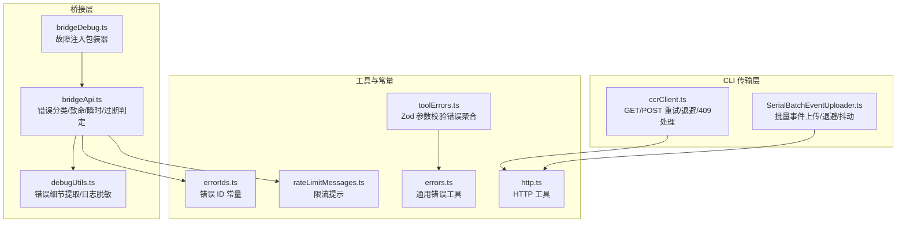
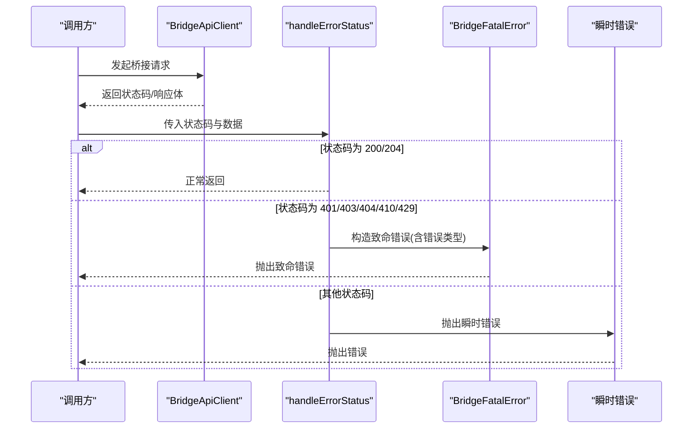
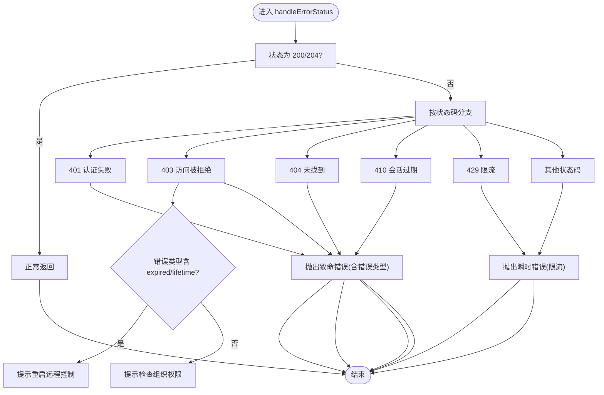
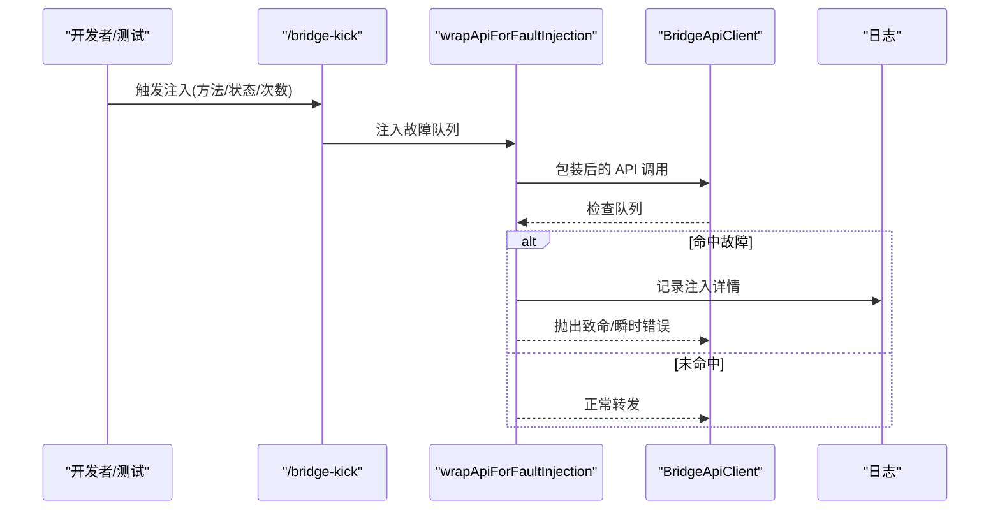
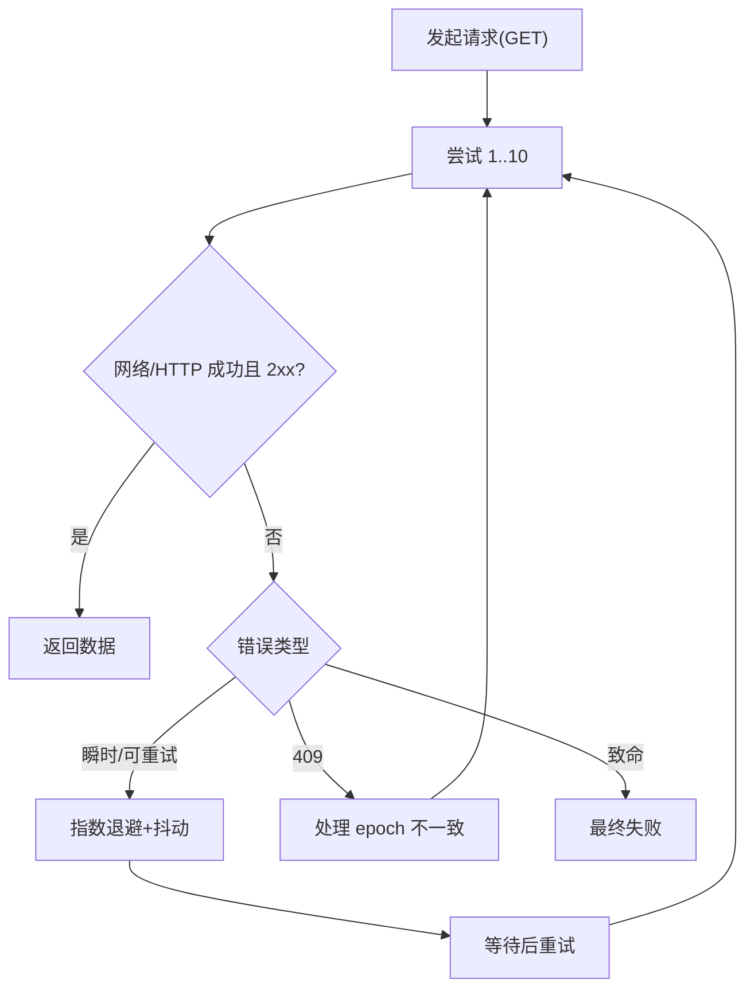
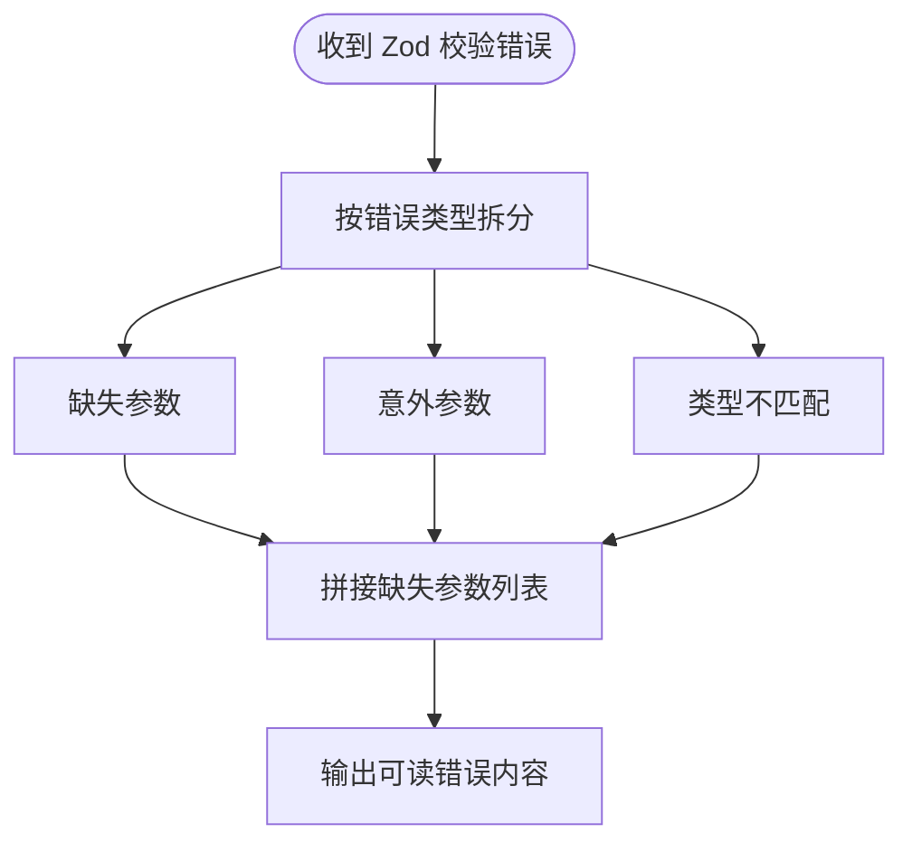
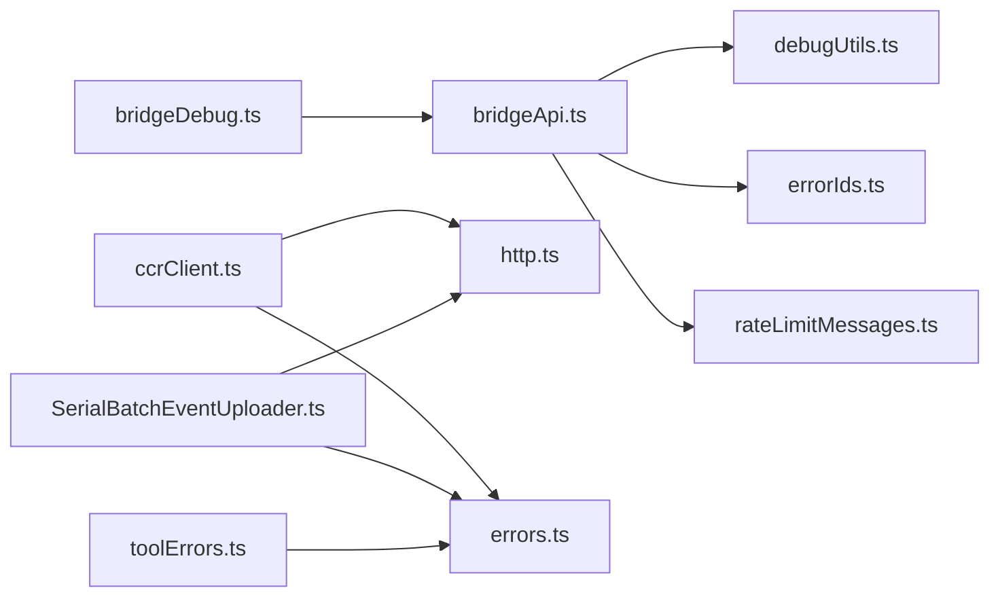

# 错误处理与状态码

<cite>
**本文引用的文件**
- [src/bridge/bridgeApi.ts](file://src/bridge/bridgeApi.ts)
- [src/bridge/bridgeDebug.ts](file://src/bridge/bridgeDebug.ts)
- [src/bridge/debugUtils.ts](file://src/bridge/debugUtils.ts)
- [src/cli/transports/ccrClient.ts](file://src/cli/transports/ccrClient.ts)
- [src/cli/transports/SerialBatchEventUploader.ts](file://src/cli/transports/SerialBatchEventUploader.ts)
- [src/utils/toolErrors.ts](file://src/utils/toolErrors.ts)
- [src/commands/bridge-kick.ts](file://src/commands/bridge-kick.ts)
- [src/constants/errorIds.ts](file://src/constants/errorIds.ts)
- [src/services/rateLimitMessages.ts](file://src/services/rateLimitMessages.ts)
- [src/utils/errors.ts](file://src/utils/errors.ts)
- [src/utils/http.ts](file://src/utils/http.ts)
</cite>

## 目录
1. [引言](#引言)
2. [项目结构](#项目结构)
3. [核心组件](#核心组件)
4. [架构总览](#架构总览)
5. [详细组件分析](#详细组件分析)
6. [依赖关系分析](#依赖关系分析)
7. [性能考量](#性能考量)
8. [故障排除指南](#故障排除指南)
9. [结论](#结论)
10. [附录](#附录)

## 引言
本文件系统性梳理 Claude Code 在桥接远程控制（Bridge）与 CLI 传输层中的错误处理机制，覆盖错误类型、错误 ID、状态码语义、客户端错误与服务器错误区分、服务不可用场景、错误消息格式、重试与退避策略、降级处理、监控与告警建议以及用户体验优化策略。目标是帮助开发者与运维人员快速定位问题、制定恢复策略并提升系统韧性。

## 项目结构
围绕错误处理的关键模块包括：
- 桥接 API 层：负责桥接调用、错误分类与致命/瞬时错误区分、会话过期判定、可抑制 403 判定、错误详情提取等。
- 故障注入与调试工具：用于模拟瞬时失败与致命错误，验证恢复路径。
- CLI 传输层：统一的 HTTP 客户端与事件上传器，实现指数退避、抖动、重试与 409 冲突处理。
- 工具参数校验错误：对工具输入进行 Zod 校验并生成可读错误信息。
- 常量与通用工具：错误 ID、错误消息、HTTP 工具函数等。

图表来源
- [src/bridge/bridgeApi.ts:454-539](file://src/bridge/bridgeApi.ts#L454-L539)
- [src/bridge/bridgeDebug.ts:77-110](file://src/bridge/bridgeDebug.ts#L77-L110)
- [src/bridge/debugUtils.ts:84-141](file://src/bridge/debugUtils.ts#L84-L141)
- [src/cli/transports/ccrClient.ts:901-944](file://src/cli/transports/ccrClient.ts#L901-L944)
- [src/cli/transports/SerialBatchEventUploader.ts:235-275](file://src/cli/transports/SerialBatchEventUploader.ts#L235-L275)
- [src/utils/toolErrors.ts:78-132](file://src/utils/toolErrors.ts#L78-L132)
- [src/constants/errorIds.ts](file://src/constants/errorIds.ts)
- [src/services/rateLimitMessages.ts](file://src/services/rateLimitMessages.ts)
- [src/utils/errors.ts](file://src/utils/errors.ts)
- [src/utils/http.ts](file://src/utils/http.ts)

章节来源
- [src/bridge/bridgeApi.ts:454-539](file://src/bridge/bridgeApi.ts#L454-L539)
- [src/bridge/bridgeDebug.ts:77-110](file://src/bridge/bridgeDebug.ts#L77-L110)
- [src/bridge/debugUtils.ts:84-141](file://src/bridge/debugUtils.ts#L84-L141)
- [src/cli/transports/ccrClient.ts:901-944](file://src/cli/transports/ccrClient.ts#L901-L944)
- [src/cli/transports/SerialBatchEventUploader.ts:235-275](file://src/cli/transports/SerialBatchEventUploader.ts#L235-L275)
- [src/utils/toolErrors.ts:78-132](file://src/utils/toolErrors.ts#L78-L132)
- [src/constants/errorIds.ts](file://src/constants/errorIds.ts)
- [src/services/rateLimitMessages.ts](file://src/services/rateLimitMessages.ts)
- [src/utils/errors.ts](file://src/utils/errors.ts)
- [src/utils/http.ts](file://src/utils/http.ts)

## 核心组件
- 桥接 API 错误处理：根据 HTTP 状态码与响应体中的错误类型进行分类，区分致命错误与瞬时错误；支持会话/环境过期检测与可抑制 403 过滤。
- 故障注入与调试：在开发/测试环境下注入特定方法的致命或瞬时错误，验证恢复路径。
- CLI 传输层重试与退避：统一的指数退避+抖动策略，支持 409 冲突处理与最大延迟限制。
- 工具参数校验错误：将 Zod 校验问题聚合为用户可读的错误消息，包含缺失参数、意外参数、类型不匹配等。
- 错误 ID 与消息：集中管理错误 ID 与限流提示，便于统一展示与追踪。

章节来源
- [src/bridge/bridgeApi.ts:454-539](file://src/bridge/bridgeApi.ts#L454-L539)
- [src/bridge/bridgeDebug.ts:77-110](file://src/bridge/bridgeDebug.ts#L77-L110)
- [src/cli/transports/ccrClient.ts:901-944](file://src/cli/transports/ccrClient.ts#L901-L944)
- [src/utils/toolErrors.ts:78-132](file://src/utils/toolErrors.ts#L78-L132)
- [src/constants/errorIds.ts](file://src/constants/errorIds.ts)
- [src/services/rateLimitMessages.ts](file://src/services/rateLimitMessages.ts)

## 架构总览
下图展示了桥接 API 调用到错误分类、致命/瞬时错误区分、以及后续恢复策略的整体流程。

图表来源
- [src/bridge/bridgeApi.ts:454-539](file://src/bridge/bridgeApi.ts#L454-L539)

章节来源
- [src/bridge/bridgeApi.ts:454-539](file://src/bridge/bridgeApi.ts#L454-L539)

## 详细组件分析

### 组件一：桥接 API 错误处理（状态码与错误类型）
- 致命错误（需要终止并提示用户）：
  - 401 认证失败：包含上下文与登录指引。
  - 403 访问被拒绝：若错误类型指示会话/环境过期，则提示重启远程控制；否则提示组织权限问题。
  - 404 未找到：提示远程控制可能对该组织不可用。
  - 410 会话已过期：提示重启远程控制。
  - 默认：抛出包含状态码与详情的致命错误。
- 瞬时错误（可重试/退避）：
  - 429 频繁轮询导致限流：提示轮询过于频繁。
  - 其他非 2xx 非上述致命状态：抛出瞬时错误。
- 会话/环境过期判定：
  - 通过错误类型字符串是否包含“expired”或“lifetime”判断。
- 可抑制 403：
  - 对于某些范围或操作（如外部轮询会话、缺少“environments:manage”）产生的 403，不向用户展示，避免干扰核心功能。

图表来源
- [src/bridge/bridgeApi.ts:454-539](file://src/bridge/bridgeApi.ts#L454-L539)

章节来源
- [src/bridge/bridgeApi.ts:454-539](file://src/bridge/bridgeApi.ts#L454-L539)

### 组件二：故障注入与调试（开发/测试）
- 故障注入包装器：
  - 在每次 API 调用前检查队列中是否有匹配的故障项；命中则抛出指定错误，否则委托真实客户端。
  - 支持致命错误与瞬时错误两类，瞬时错误以普通错误形式抛出，便于区分恢复策略。
- 可用性命令：
  - 提供 /bridge-kick 子命令，可注入 poll/register/reconnect-session 等场景的致命/瞬时故障，并唤醒轮询循环以便复现。

图表来源
- [src/bridge/bridgeDebug.ts:77-110](file://src/bridge/bridgeDebug.ts#L77-L110)
- [src/commands/bridge-kick.ts:76-157](file://src/commands/bridge-kick.ts#L76-L157)

章节来源
- [src/bridge/bridgeDebug.ts:77-110](file://src/bridge/bridgeDebug.ts#L77-L110)
- [src/commands/bridge-kick.ts:76-157](file://src/commands/bridge-kick.ts#L76-L157)

### 组件三：CLI 传输层重试与退避
- GET 请求重试：
  - 最多重试 10 次；每次指数退避并叠加随机抖动，上限 30 秒；记录每次尝试的日志。
  - 若返回 409 冲突，触发 epoch 不一致处理逻辑。
- 批量事件上传退避：
  - 支持基于服务器 Retry-After 的退避，若无则使用指数退避；在最大延迟与抖动之间平衡，防止“惊群效应”。

图表来源
- [src/cli/transports/ccrClient.ts:901-944](file://src/cli/transports/ccrClient.ts#L901-L944)
- [src/cli/transports/SerialBatchEventUploader.ts:235-275](file://src/cli/transports/SerialBatchEventUploader.ts#L235-L275)

章节来源
- [src/cli/transports/ccrClient.ts:901-944](file://src/cli/transports/ccrClient.ts#L901-L944)
- [src/cli/transports/SerialBatchEventUploader.ts:235-275](file://src/cli/transports/SerialBatchEventUploader.ts#L235-L275)

### 组件四：工具参数校验错误（Zod）
- 将 Zod 校验问题拆解为三类：
  - 缺失必要参数
  - 提供了未识别的参数
  - 类型不匹配（含期望类型与实际类型）
- 生成人类可读的错误内容，便于前端展示与用户修复。

图表来源
- [src/utils/toolErrors.ts:78-132](file://src/utils/toolErrors.ts#L78-L132)

章节来源
- [src/utils/toolErrors.ts:78-132](file://src/utils/toolErrors.ts#L78-L132)

### 组件五：错误消息格式与细节提取
- 错误详情提取：
  - 优先从 data.message 获取，其次从 data.error.message 获取。
- HTTP 状态提取：
  - 从 axios 错误对象中提取状态码，用于区分网络错误与 HTTP 错误。
- 日志脱敏：
  - 对包含敏感字段的 JSON 文本进行脱敏，避免泄露令牌等信息。

章节来源
- [src/bridge/debugUtils.ts:84-141](file://src/bridge/debugUtils.ts#L84-L141)

### 组件六：错误 ID 与状态码映射
- 错误 ID：
  - 位于常量文件中，用于统一标识错误类型，便于日志检索与告警规则匹配。
- 状态码含义：
  - 401/403/404/410：致命错误，需提示用户或引导重启远程控制。
  - 429：瞬时错误，提示限流并降低轮询频率。
  - 其他非 2xx：瞬时错误，采用退避重试策略。

章节来源
- [src/constants/errorIds.ts](file://src/constants/errorIds.ts)
- [src/bridge/bridgeApi.ts:454-539](file://src/bridge/bridgeApi.ts#L454-L539)

## 依赖关系分析
- 桥接 API 层依赖：
  - 错误详情提取与日志脱敏工具，确保错误消息可读且安全。
  - 错误 ID 常量与限流提示，统一错误展示与用户引导。
- CLI 传输层依赖：
  - HTTP 工具与通用错误工具，保证请求头、超时与错误描述的一致性。
  - 指数退避与抖动策略，减少重试风暴风险。

图表来源
- [src/bridge/bridgeApi.ts:454-539](file://src/bridge/bridgeApi.ts#L454-L539)
- [src/bridge/debugUtils.ts:84-141](file://src/bridge/debugUtils.ts#L84-L141)
- [src/bridge/bridgeDebug.ts:77-110](file://src/bridge/bridgeDebug.ts#L77-L110)
- [src/cli/transports/ccrClient.ts:901-944](file://src/cli/transports/ccrClient.ts#L901-L944)
- [src/cli/transports/SerialBatchEventUploader.ts:235-275](file://src/cli/transports/SerialBatchEventUploader.ts#L235-L275)
- [src/utils/toolErrors.ts:78-132](file://src/utils/toolErrors.ts#L78-L132)
- [src/constants/errorIds.ts](file://src/constants/errorIds.ts)
- [src/services/rateLimitMessages.ts](file://src/services/rateLimitMessages.ts)
- [src/utils/errors.ts](file://src/utils/errors.ts)
- [src/utils/http.ts](file://src/utils/http.ts)

章节来源
- [src/bridge/bridgeApi.ts:454-539](file://src/bridge/bridgeApi.ts#L454-L539)
- [src/bridge/debugUtils.ts:84-141](file://src/bridge/debugUtils.ts#L84-L141)
- [src/bridge/bridgeDebug.ts:77-110](file://src/bridge/bridgeDebug.ts#L77-L110)
- [src/cli/transports/ccrClient.ts:901-944](file://src/cli/transports/ccrClient.ts#L901-L944)
- [src/cli/transports/SerialBatchEventUploader.ts:235-275](file://src/cli/transports/SerialBatchEventUploader.ts#L235-L275)
- [src/utils/toolErrors.ts:78-132](file://src/utils/toolErrors.ts#L78-L132)
- [src/constants/errorIds.ts](file://src/constants/errorIds.ts)
- [src/services/rateLimitMessages.ts](file://src/services/rateLimitMessages.ts)
- [src/utils/errors.ts](file://src/utils/errors.ts)
- [src/utils/http.ts](file://src/utils/http.ts)

## 性能考量
- 指数退避与抖动：
  - 有效缓解“惊群效应”，在服务器限流或网络波动时保持系统稳定。
- 最大延迟与抖动上限：
  - 控制重试时间分布，避免长时间占用资源。
- 409 冲突处理：
  - 在批量上传场景中，优先尊重服务器 Retry-After 并结合抖动，提升整体吞吐。

章节来源
- [src/cli/transports/SerialBatchEventUploader.ts:235-275](file://src/cli/transports/SerialBatchEventUploader.ts#L235-L275)
- [src/cli/transports/ccrClient.ts:901-944](file://src/cli/transports/ccrClient.ts#L901-L944)

## 故障排除指南
- 快速定位
  - 使用 /bridge-kick 注入特定状态码或“transient”来复现问题，观察桥接层的致命/瞬时错误分支。
  - 查看调试日志中的注入记录与错误详情提取结果。
- 常见场景
  - 401/403：确认认证与组织权限；若为过期错误类型，引导用户重启远程控制。
  - 404：确认远程控制在该组织可用性；必要时切换组织或版本。
  - 429：降低轮询频率或延长退避间隔。
  - 瞬时错误（5xx/网络）：启用指数退避与抖动，避免“惊群效应”。
- 日志分析
  - 关注 ccrClient 的重试日志与 SerialBatchEventUploader 的退避日志，定位异常峰值与抖动情况。
  - 使用错误详情提取工具，获取 data.message 或 data.error.message 作为辅助线索。
- 降级处理
  - 对于可抑制的 403（如外部轮询会话或权限不足），可在 UI 中隐藏，避免干扰用户主流程。
- 用户体验优化
  - 限流提示与重试策略应明确告知用户当前状态与建议操作。
  - 工具参数校验错误应给出具体缺失/多余/类型不匹配的参数名，便于快速修复。

章节来源
- [src/commands/bridge-kick.ts:76-157](file://src/commands/bridge-kick.ts#L76-L157)
- [src/bridge/bridgeApi.ts:454-539](file://src/bridge/bridgeApi.ts#L454-L539)
- [src/bridge/debugUtils.ts:84-141](file://src/bridge/debugUtils.ts#L84-L141)
- [src/cli/transports/ccrClient.ts:901-944](file://src/cli/transports/ccrClient.ts#L901-L944)
- [src/cli/transports/SerialBatchEventUploader.ts:235-275](file://src/cli/transports/SerialBatchEventUploader.ts#L235-L275)
- [src/utils/toolErrors.ts:78-132](file://src/utils/toolErrors.ts#L78-L132)

## 结论
本文件总结了 Claude Code 在桥接与 CLI 传输层的错误处理策略：通过明确的状态码分类、致命/瞬时错误区分、会话过期与可抑制 403 的判定、统一的重试与退避策略、以及可读的错误消息与日志脱敏，构建了稳健的错误处理与用户体验保障体系。配合故障注入与调试工具，能够高效验证恢复路径并持续优化系统韧性。

## 附录
- 错误 ID 与状态码对照（示例）
  - 401：认证失败（致命）
  - 403：访问被拒（致命；可抑制）
  - 404：未找到（致命）
  - 410：会话过期（致命）
  - 429：限流（瞬时）
  - 其他非 2xx：瞬时错误（可重试）

章节来源
- [src/bridge/bridgeApi.ts:454-539](file://src/bridge/bridgeApi.ts#L454-L539)
- [src/constants/errorIds.ts](file://src/constants/errorIds.ts)