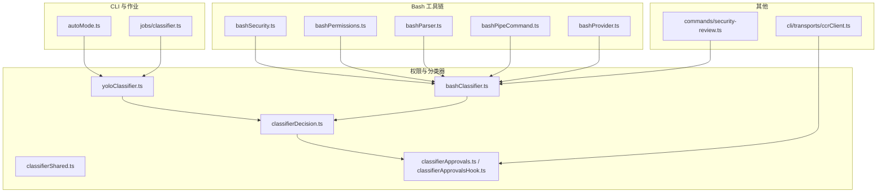
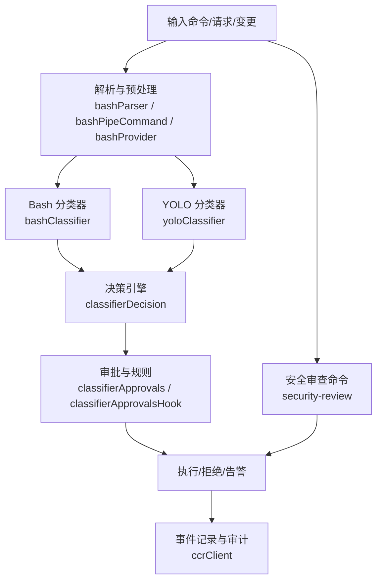
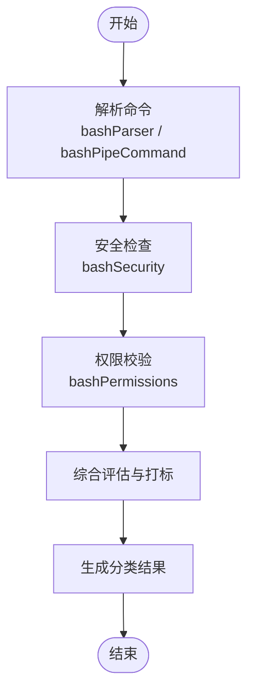
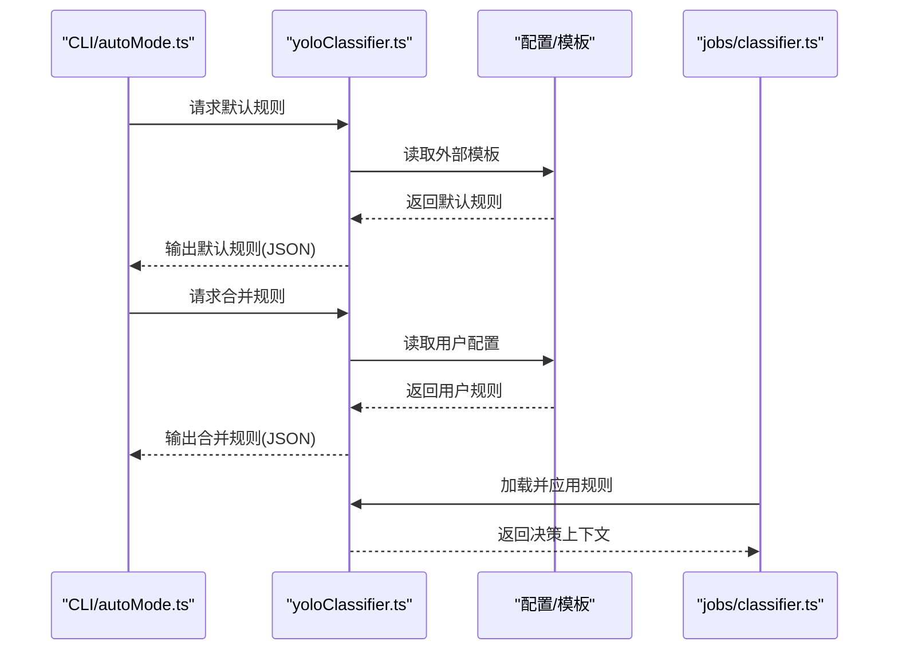
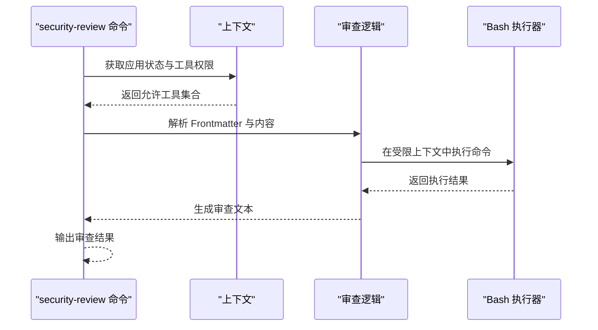
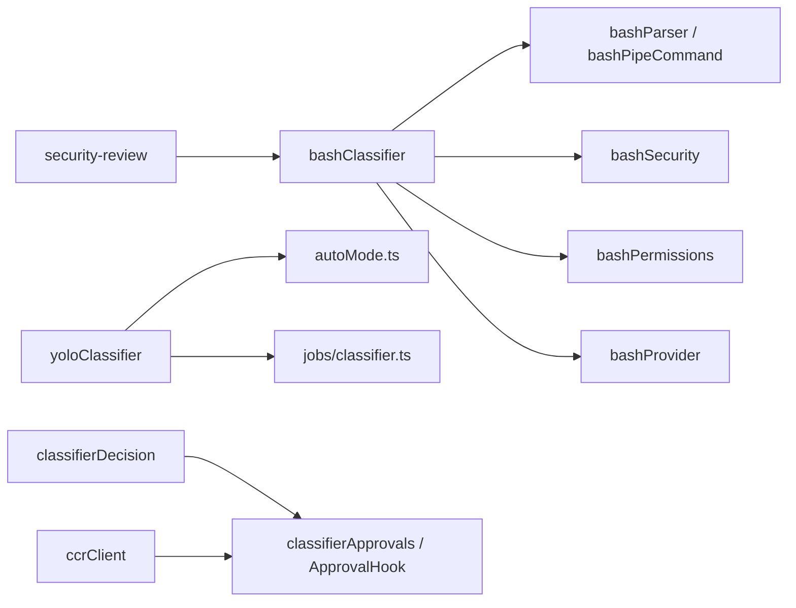

# 安全分类器与威胁检测

<cite>
**本文引用的文件**
- [src/utils/permissions/yoloClassifier.ts](file://src/utils/permissions/yoloClassifier.ts)
- [src/utils/permissions/bashClassifier.ts](file://src/utils/permissions/bashClassifier.ts)
- [src/utils/permissions/classifierShared.ts](file://src/utils/permissions/classifierShared.ts)
- [src/utils/permissions/classifierDecision.ts](file://src/utils/permissions/classifierDecision.ts)
- [src/utils/classifierApprovals.ts](file://src/utils/classifierApprovals.ts)
- [src/utils/classifierApprovalsHook.ts](file://src/utils/classifierApprovalsHook.ts)
- [src/jobs/classifier.ts](file://src/jobs/classifier.ts)
- [src/cli/handlers/autoMode.ts](file://src/cli/handlers/autoMode.ts)
- [src/commands/security-review.ts](file://src/commands/security-review.ts)
- [src/tools/BashTool/bashSecurity.ts](file://src/tools/BashTool/bashSecurity.ts)
- [src/tools/BashTool/bashPermissions.ts](file://src/tools/BashTool/bashPermissions.ts)
- [src/utils/bash/bashParser.ts](file://src/utils/bash/bashParser.ts)
- [src/utils/bash/bashPipeCommand.ts](file://src/utils/bash/bashPipeCommand.ts)
- [src/utils/shell/bashProvider.ts](file://src/utils/shell/bashProvider.ts)
- [src/cli/transports/ccrClient.ts](file://src/cli/transports/ccrClient.ts)
</cite>

## 目录
1. [引言](#引言)
2. [项目结构](#项目结构)
3. [核心组件](#核心组件)
4. [架构总览](#架构总览)
5. [详细组件分析](#详细组件分析)
6. [依赖关系分析](#依赖关系分析)
7. [性能考虑](#性能考虑)
8. [故障排除指南](#故障排除指南)
9. [结论](#结论)
10. [附录](#附录)

## 引言
本文件面向 Claude Code 的安全分类器与威胁检测系统，系统性阐述其设计架构与实现细节，覆盖共享分类器组件、Bash 命令分类器与 YOLO 分类器的工作原理；解释威胁检测算法、异常行为识别与风险评估机制；梳理拒绝跟踪系统、威胁情报收集与安全事件响应流程；并提供分类器训练数据准备、模型优化策略与误报率控制方法，以及安全威胁分类标准、检测精度评估与防护效果分析。

## 项目结构
安全相关能力主要分布在以下模块：
- 权限与分类器：utils/permissions 下的 yoloClassifier、bashClassifier、classifierShared、classifierDecision 及 classifierApprovals 系列
- Bash 工具链安全：tools/BashTool 下的 bashSecurity、bashPermissions 与 utils/bash、utils/shell 中的解析与执行辅助
- 自动模式规则：cli/handlers/autoMode.ts 与 jobs/classifier.ts
- 安全审查命令：commands/security-review.ts
- 内部事件采集：cli/transports/ccrClient.ts

图表来源
- [src/utils/permissions/yoloClassifier.ts](file://src/utils/permissions/yoloClassifier.ts)
- [src/utils/permissions/bashClassifier.ts](file://src/utils/permissions/bashClassifier.ts)
- [src/utils/permissions/classifierShared.ts](file://src/utils/permissions/classifierShared.ts)
- [src/utils/permissions/classifierDecision.ts](file://src/utils/permissions/classifierDecision.ts)
- [src/utils/classifierApprovals.ts](file://src/utils/classifierApprovals.ts)
- [src/utils/classifierApprovalsHook.ts](file://src/utils/classifierApprovalsHook.ts)
- [src/tools/BashTool/bashSecurity.ts](file://src/tools/BashTool/bashSecurity.ts)
- [src/tools/BashTool/bashPermissions.ts](file://src/tools/BashTool/bashPermissions.ts)
- [src/utils/bash/bashParser.ts](file://src/utils/bash/bashParser.ts)
- [src/utils/bash/bashPipeCommand.ts](file://src/utils/bash/bashPipeCommand.ts)
- [src/utils/shell/bashProvider.ts](file://src/utils/shell/bashProvider.ts)
- [src/cli/handlers/autoMode.ts](file://src/cli/handlers/autoMode.ts)
- [src/jobs/classifier.ts](file://src/jobs/classifier.ts)
- [src/commands/security-review.ts](file://src/commands/security-review.ts)
- [src/cli/transports/ccrClient.ts](file://src/cli/transports/ccrClient.ts)

章节来源
- [src/utils/permissions/yoloClassifier.ts](file://src/utils/permissions/yoloClassifier.ts)
- [src/utils/permissions/bashClassifier.ts](file://src/utils/permissions/bashClassifier.ts)
- [src/utils/permissions/classifierShared.ts](file://src/utils/permissions/classifierShared.ts)
- [src/utils/permissions/classifierDecision.ts](file://src/utils/permissions/classifierDecision.ts)
- [src/utils/classifierApprovals.ts](file://src/utils/classifierApprovals.ts)
- [src/utils/classifierApprovalsHook.ts](file://src/utils/classifierApprovalsHook.ts)
- [src/tools/BashTool/bashSecurity.ts](file://src/tools/BashTool/bashSecurity.ts)
- [src/tools/BashTool/bashPermissions.ts](file://src/tools/BashTool/bashPermissions.ts)
- [src/utils/bash/bashParser.ts](file://src/utils/bash/bashParser.ts)
- [src/utils/bash/bashPipeCommand.ts](file://src/utils/bash/bashPipeCommand.ts)
- [src/utils/shell/bashProvider.ts](file://src/utils/shell/bashProvider.ts)
- [src/cli/handlers/autoMode.ts](file://src/cli/handlers/autoMode.ts)
- [src/jobs/classifier.ts](file://src/jobs/classifier.ts)
- [src/commands/security-review.ts](file://src/commands/security-review.ts)
- [src/cli/transports/ccrClient.ts](file://src/cli/transports/ccrClient.ts)

## 核心组件
- 共享分类器组件（classifierShared）：定义通用的分类器接口、输入输出规范、决策抽象与上下文结构，确保 Bash 与 YOLO 分类器在统一契约下协同工作。
- Bash 命令分类器（bashClassifier）：对 Bash 命令进行细粒度语义解析与风险判定，结合 bashSecurity、bashPermissions、bashParser、bashPipeCommand、bashProvider 等工具完成安全检查与权限约束。
- YOLO 分类器（yoloClassifier）：基于外部模板与用户配置生成自动模式规则，支持 allow、soft_deny、environment 等维度的快速决策，并通过 CLI 暴露默认与合并规则查询。
- 分类器决策与审批（classifierDecision、classifierApprovals、classifierApprovalsHook）：封装决策逻辑与审批钩子，协调分类器结果与人工审批流，形成“自动+半自动”的安全控制闭环。
- 安全审查命令（security-review）：对当前分支变更进行安全审查，动态注入允许的工具集，结合 Bash 执行与日志输出形成可审计的审查报告。
- 内部事件采集（ccrClient）：提供分页拉取内部事件的能力，用于威胁情报收集与安全事件溯源。

章节来源
- [src/utils/permissions/classifierShared.ts](file://src/utils/permissions/classifierShared.ts)
- [src/utils/permissions/bashClassifier.ts](file://src/utils/permissions/bashClassifier.ts)
- [src/utils/permissions/yoloClassifier.ts](file://src/utils/permissions/yoloClassifier.ts)
- [src/utils/permissions/classifierDecision.ts](file://src/utils/permissions/classifierDecision.ts)
- [src/utils/classifierApprovals.ts](file://src/utils/classifierApprovals.ts)
- [src/utils/classifierApprovalsHook.ts](file://src/utils/classifierApprovalsHook.ts)
- [src/commands/security-review.ts](file://src/commands/security-review.ts)
- [src/cli/transports/ccrClient.ts](file://src/cli/transports/ccrClient.ts)

## 架构总览
整体架构围绕“输入解析—分类器—决策—审批—执行”展开，Bash 与 YOLO 分类器分别负责细粒度命令与高层策略的判定，共享组件提供一致的契约与上下文，审批与事件采集贯穿全流程以实现可观测与可追溯。

图表来源
- [src/utils/permissions/bashClassifier.ts](file://src/utils/permissions/bashClassifier.ts)
- [src/utils/permissions/yoloClassifier.ts](file://src/utils/permissions/yoloClassifier.ts)
- [src/utils/permissions/classifierDecision.ts](file://src/utils/permissions/classifierDecision.ts)
- [src/utils/classifierApprovals.ts](file://src/utils/classifierApprovals.ts)
- [src/utils/classifierApprovalsHook.ts](file://src/utils/classifierApprovalsHook.ts)
- [src/utils/bash/bashParser.ts](file://src/utils/bash/bashParser.ts)
- [src/utils/bash/bashPipeCommand.ts](file://src/utils/bash/bashPipeCommand.ts)
- [src/utils/shell/bashProvider.ts](file://src/utils/shell/bashProvider.ts)
- [src/commands/security-review.ts](file://src/commands/security-review.ts)
- [src/cli/transports/ccrClient.ts](file://src/cli/transports/ccrClient.ts)

## 详细组件分析

### 共享分类器组件（classifierShared）
- 职责：定义分类器通用接口、上下文结构、决策抽象与错误处理规范，确保 Bash 与 YOLO 分类器在统一契约下协作。
- 关键点：输入标准化、输出标签体系、上下文扩展点、错误传播与降级策略。
- 复杂度：O(1) 接口调用，耦合度低，内聚度高。

章节来源
- [src/utils/permissions/classifierShared.ts](file://src/utils/permissions/classifierShared.ts)

### Bash 命令分类器（bashClassifier）
- 职责：对 Bash 命令进行细粒度语义解析与风险判定，结合安全策略与权限规则生成分类结果。
- 实现要点：
  - 解析与管道处理：bashParser、bashPipeCommand 将命令拆解为可分析的片段，识别重定向、管道、子命令等结构。
  - 安全检查：bashSecurity 提供敏感操作识别与阻断建议。
  - 权限约束：bashPermissions 定义命令级别的权限边界与白名单。
  - 执行提供：bashProvider 统一命令执行入口，便于注入沙箱或代理。
- 复杂度：解析 O(n)（按命令长度），判定 O(m)（m 为规则条目数），整体线性可扩展。

图表来源
- [src/utils/permissions/bashClassifier.ts](file://src/utils/permissions/bashClassifier.ts)
- [src/tools/BashTool/bashSecurity.ts](file://src/tools/BashTool/bashSecurity.ts)
- [src/tools/BashTool/bashPermissions.ts](file://src/tools/BashTool/bashPermissions.ts)
- [src/utils/bash/bashParser.ts](file://src/utils/bash/bashParser.ts)
- [src/utils/bash/bashPipeCommand.ts](file://src/utils/bash/bashPipeCommand.ts)
- [src/utils/shell/bashProvider.ts](file://src/utils/shell/bashProvider.ts)

章节来源
- [src/utils/permissions/bashClassifier.ts](file://src/utils/permissions/bashClassifier.ts)
- [src/tools/BashTool/bashSecurity.ts](file://src/tools/BashTool/bashSecurity.ts)
- [src/tools/BashTool/bashPermissions.ts](file://src/tools/BashTool/bashPermissions.ts)
- [src/utils/bash/bashParser.ts](file://src/utils/bash/bashParser.ts)
- [src/utils/bash/bashPipeCommand.ts](file://src/utils/bash/bashPipeCommand.ts)
- [src/utils/shell/bashProvider.ts](file://src/utils/shell/bashProvider.ts)

### YOLO 分类器（yoloClassifier）
- 职责：基于外部模板与用户配置生成自动模式规则，支持 allow、soft_deny、environment 等维度的快速决策。
- 关键点：
  - 默认规则构建：buildDefaultExternalSystemPrompt、getDefaultExternalAutoModeRules。
  - 合并策略：autoMode.ts 提供默认与合并规则导出，遵循“用户设置优先、否则回退默认”的替换语义。
  - 作业集成：jobs/classifier.ts 作为调度入口，驱动 YOLO 规则的加载与应用。
- 复杂度：规则加载与合并 O(k)（k 为规则项数），决策 O(1) 查询。

图表来源
- [src/cli/handlers/autoMode.ts](file://src/cli/handlers/autoMode.ts)
- [src/utils/permissions/yoloClassifier.ts](file://src/utils/permissions/yoloClassifier.ts)
- [src/jobs/classifier.ts](file://src/jobs/classifier.ts)

章节来源
- [src/utils/permissions/yoloClassifier.ts](file://src/utils/permissions/yoloClassifier.ts)
- [src/cli/handlers/autoMode.ts](file://src/cli/handlers/autoMode.ts)
- [src/jobs/classifier.ts](file://src/jobs/classifier.ts)

### 分类器决策与审批（classifierDecision、classifierApprovals、classifierApprovalsHook）
- 职责：将 Bash 与 YOLO 的分类结果汇总，结合审批规则与人工干预，形成最终决策。
- 关键点：
  - 决策聚合：classifierDecision 统一评分与阈值策略。
  - 审批钩子：classifierApprovalsHook 注入审批流程，支持软拒绝与硬拒绝。
  - 规则来源：classifierApprovals 管理审批白名单、灰名单与黑名单。
- 复杂度：聚合 O(p)（p 为分类器数量），审批 O(1) 查询。

章节来源
- [src/utils/permissions/classifierDecision.ts](file://src/utils/permissions/classifierDecision.ts)
- [src/utils/classifierApprovals.ts](file://src/utils/classifierApprovals.ts)
- [src/utils/classifierApprovalsHook.ts](file://src/utils/classifierApprovalsHook.ts)

### 安全审查命令（security-review）
- 职责：对当前分支变更进行安全审查，动态注入允许的工具集，生成可审计的审查报告。
- 关键点：
  - 前置条件：从 Markdown Frontmatter 解析 allowed-tools，注入到工具权限上下文。
  - 动态执行：executeShellCommandsInPrompt 支持在提示词中执行受控命令，仅在允许范围内生效。
  - 结果输出：返回文本型审查结果，便于后续处理与归档。
- 复杂度：审查范围取决于变更规模，执行受工具权限限制。

图表来源
- [src/commands/security-review.ts](file://src/commands/security-review.ts)

章节来源
- [src/commands/security-review.ts](file://src/commands/security-review.ts)

### 内部事件采集（ccrClient）
- 职责：提供分页 GET 与重试机制，拉取内部事件列表，支撑威胁情报与事件溯源。
- 关键点：
  - 认证头管理：getAuthHeaders 返回鉴权信息，为空时直接返回。
  - 分页与重试：指数退避+抖动，保证网络波动下的稳定性。
  - 日志记录：调试日志记录读取事件总数与来源。
- 复杂度：单页 O(n)，全量 O(n×p)（p 为页数）。

章节来源
- [src/cli/transports/ccrClient.ts](file://src/cli/transports/ccrClient.ts)

## 依赖关系分析
- 组件耦合：
  - bashClassifier 依赖 bashParser、bashPipeCommand、bashSecurity、bashPermissions、bashProvider，形成“解析—安全—权限—执行”的强内聚链路。
  - yoloClassifier 依赖外部模板与用户配置，通过 CLI 与作业模块解耦。
  - classifierDecision 与 classifierApprovals/ApprovalHook 协同，形成“自动+人工”的双层控制。
- 外部依赖：
  - CLI 与作业模块负责规则加载与调度。
  - ccrClient 提供事件采集能力，服务于威胁情报与审计。

图表来源
- [src/utils/permissions/bashClassifier.ts](file://src/utils/permissions/bashClassifier.ts)
- [src/utils/permissions/yoloClassifier.ts](file://src/utils/permissions/yoloClassifier.ts)
- [src/utils/permissions/classifierDecision.ts](file://src/utils/permissions/classifierDecision.ts)
- [src/utils/classifierApprovals.ts](file://src/utils/classifierApprovals.ts)
- [src/utils/classifierApprovalsHook.ts](file://src/utils/classifierApprovalsHook.ts)
- [src/cli/handlers/autoMode.ts](file://src/cli/handlers/autoMode.ts)
- [src/jobs/classifier.ts](file://src/jobs/classifier.ts)
- [src/commands/security-review.ts](file://src/commands/security-review.ts)
- [src/cli/transports/ccrClient.ts](file://src/cli/transports/ccrClient.ts)

章节来源
- [src/utils/permissions/bashClassifier.ts](file://src/utils/permissions/bashClassifier.ts)
- [src/utils/permissions/yoloClassifier.ts](file://src/utils/permissions/yoloClassifier.ts)
- [src/utils/permissions/classifierDecision.ts](file://src/utils/permissions/classifierDecision.ts)
- [src/utils/classifierApprovals.ts](file://src/utils/classifierApprovals.ts)
- [src/utils/classifierApprovalsHook.ts](file://src/utils/classifierApprovalsHook.ts)
- [src/cli/handlers/autoMode.ts](file://src/cli/handlers/autoMode.ts)
- [src/jobs/classifier.ts](file://src/jobs/classifier.ts)
- [src/commands/security-review.ts](file://src/commands/security-review.ts)
- [src/cli/transports/ccrClient.ts](file://src/cli/transports/ccrClient.ts)

## 性能考虑
- 解析与判定复杂度：
  - Bash 分类器：O(n+m)，n 为命令长度，m 为规则条目数；建议缓存热点规则与常用命令片段。
  - YOLO 分类器：O(k)，k 为规则项数；建议按需懒加载与增量更新。
- I/O 与网络：
  - ccrClient 使用指数退避+抖动，避免雪崩效应；建议限制最大并发与超时时间。
- 内存与吞吐：
  - 分页拉取内部事件时，注意内存占用与批量大小；建议采用流式处理与分块写入。

## 故障排除指南
- Bash 命令被误判：
  - 检查 bashParser 与 bashPipeCommand 的解析是否正确，确认管道与重定向未被误拆。
  - 核对 bashPermissions 的白名单是否覆盖该命令，必要时调整规则。
  - 若存在 bashSecurity 的误报，可通过分类器阈值或规则降级缓解。
- YOLO 规则不生效：
  - 确认 autoMode.ts 的合并策略是否被用户配置覆盖。
  - 检查 yoloClassifier 的外部模板加载是否成功，是否存在语法错误。
- 审批流程卡住：
  - 查看 classifierApprovalsHook 的审批队列与超时设置，确认审批人与审批时限。
- 事件采集失败：
  - 检查 ccrClient 的认证头是否有效，网络连通性与重试次数是否合理。

章节来源
- [src/tools/BashTool/bashSecurity.ts](file://src/tools/BashTool/bashSecurity.ts)
- [src/tools/BashTool/bashPermissions.ts](file://src/tools/BashTool/bashPermissions.ts)
- [src/utils/bash/bashParser.ts](file://src/utils/bash/bashParser.ts)
- [src/utils/bash/bashPipeCommand.ts](file://src/utils/bash/bashPipeCommand.ts)
- [src/utils/permissions/yoloClassifier.ts](file://src/utils/permissions/yoloClassifier.ts)
- [src/cli/handlers/autoMode.ts](file://src/cli/handlers/autoMode.ts)
- [src/utils/classifierApprovalsHook.ts](file://src/utils/classifierApprovalsHook.ts)
- [src/cli/transports/ccrClient.ts](file://src/cli/transports/ccrClient.ts)

## 结论
本系统通过“共享分类器组件 + Bash 命令分类器 + YOLO 分类器”的多层架构，实现了从细粒度命令到高层策略的全面覆盖；配合审批与事件采集，形成“自动+人工+可观测”的闭环。建议持续优化规则缓存与增量加载、完善误报抑制与阈值自适应、加强事件溯源与威胁情报联动，以提升检测精度与防护效果。

## 附录

### 安全威胁分类标准
- 输入验证与注入：SQL 注入、命令注入、XXE、模板注入、NoSQL 注入、路径遍历。
- 认证与授权：认证绕过、权限提升、会话管理缺陷、JWT 漏洞、授权绕过。
- 密钥与加密：硬编码密钥、弱算法、密钥存储不当、随机性问题、证书校验绕过。
- 代码执行与注入：反序列化执行、Python pickle、YAML 反序列化、动态代码执行、XSS（反射/存储/DOM）。
- 数据暴露：敏感日志、PII 泄露、API 泄漏、调试信息暴露。

章节来源
- [src/commands/security-review.ts](file://src/commands/security-review.ts)

### 检测精度评估与误报率控制
- 评估指标：准确率、召回率、F1 分数、误报率、漏报率、假阳性/假阴性分布。
- 控制方法：
  - 规则去噪：定期清理无效规则与冲突规则，减少误报。
  - 阈值自适应：根据历史误报统计动态调整阈值。
  - 上下文增强：引入更多上下文特征（用户角色、环境变量、历史行为）降低误报。
  - 人工复核：对高风险误报进行人工复核与规则微调。
- 训练数据准备：
  - 构建正负样本集：涵盖常见命令、可疑命令与正常命令。
  - 多源标注：结合静态扫描、动态分析与专家经验。
  - 数据平衡：确保各类别样本均衡，避免偏向。
- 模型优化策略：
  - 特征工程：提取命令结构、参数类型、敏感关键字等特征。
  - 集成学习：组合多个分类器的结果，提升鲁棒性。
  - 在线学习：基于新事件与反馈持续更新模型。

### 风险评估机制
- 风险等级：低/中/高/严重，依据攻击面、影响范围与发生概率综合判定。
- 评估流程：
  - 威胁建模：识别潜在攻击路径与利用场景。
  - 影响分析：量化对数据、系统与业务的影响。
  - 概率估算：结合历史事件与趋势分析攻击发生的可能性。
  - 控制措施：提出技术与管理层面的缓解与加固建议。

### 拒绝跟踪与响应流程
- 拒绝跟踪：
  - 记录被拒绝的命令、触发规则、上下文与审批意见。
  - 提供可追溯的日志与审计线索，支持合规与取证。
- 威胁情报收集：
  - 通过 ccrClient 拉取内部事件，识别异常模式与关联攻击。
  - 与外部情报源对接，补充已知威胁签名与行为特征。
- 安全事件响应：
  - 快速定位：基于日志与事件定位受影响范围。
  - 隔离与修复：临时阻断相关规则，修复漏洞与策略缺陷。
  - 回归验证：验证修复有效性与规则稳定性。
  - 报告与改进：输出事件报告，沉淀最佳实践与规则优化。

章节来源
- [src/cli/transports/ccrClient.ts](file://src/cli/transports/ccrClient.ts)
- [src/utils/classifierApprovals.ts](file://src/utils/classifierApprovals.ts)
- [src/utils/classifierApprovalsHook.ts](file://src/utils/classifierApprovalsHook.ts)