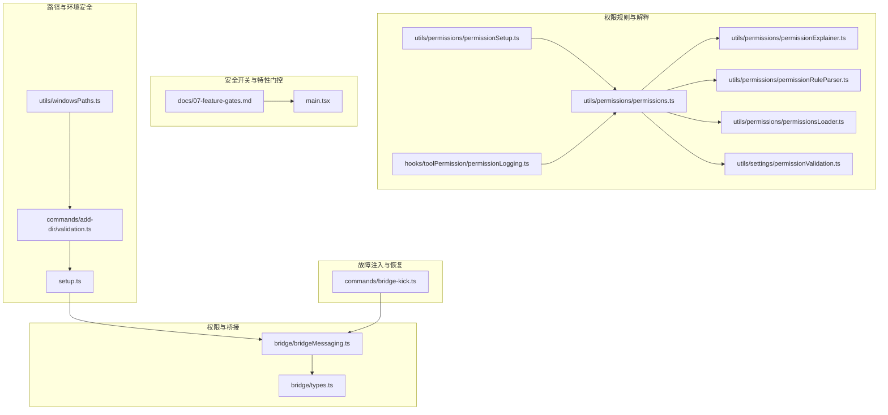
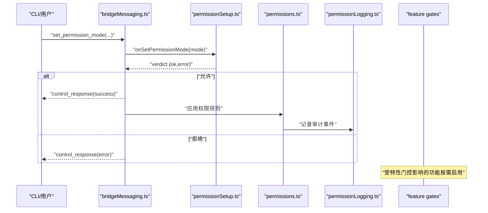
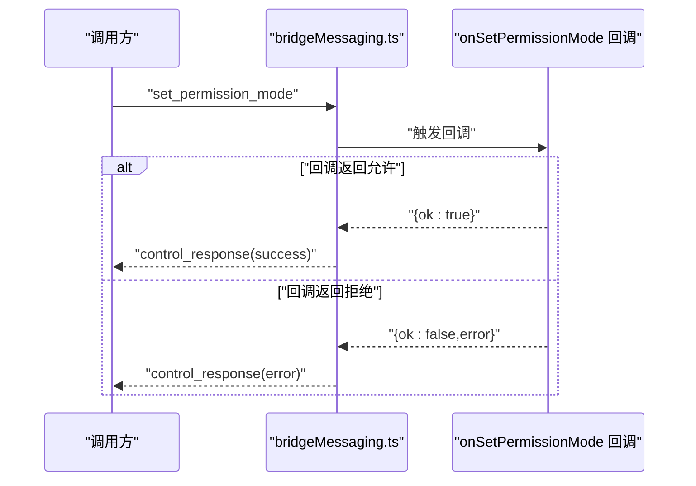
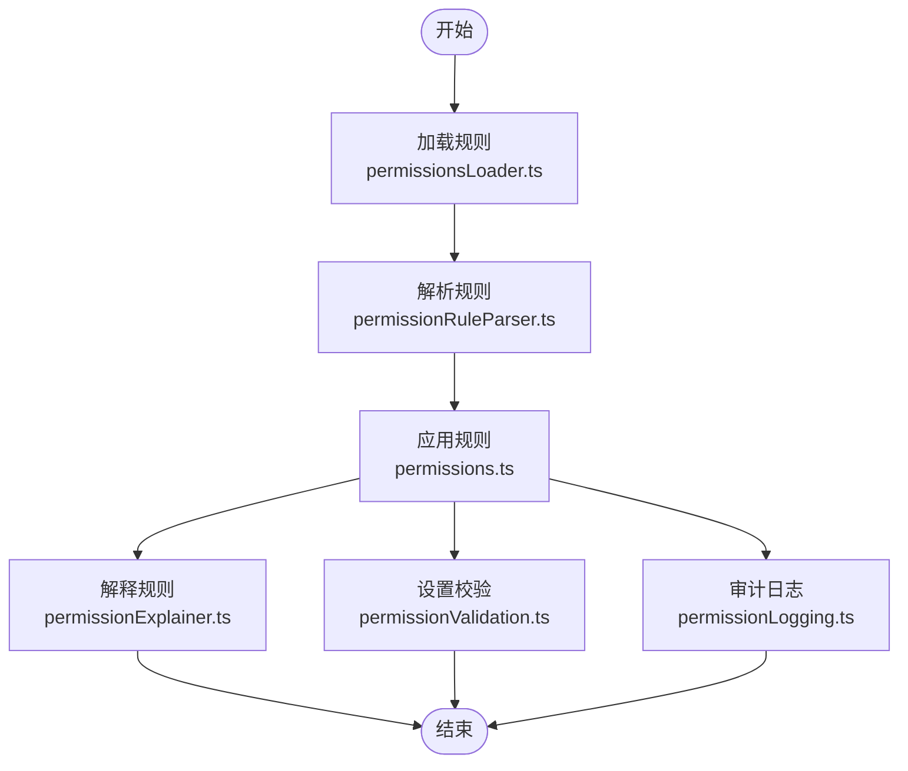
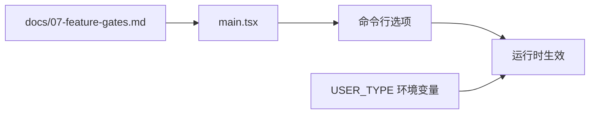
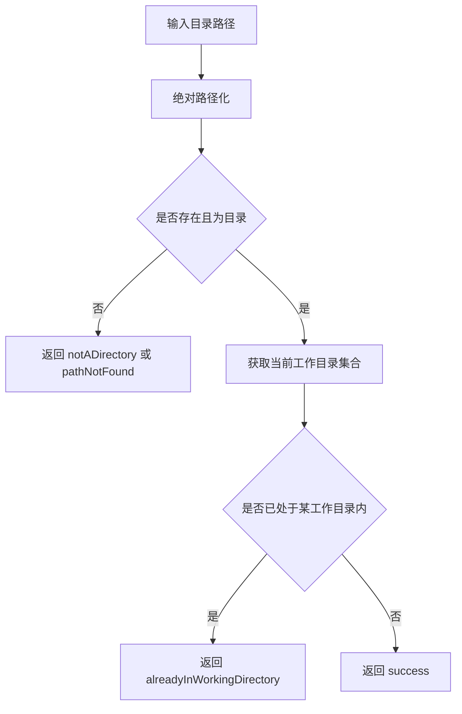
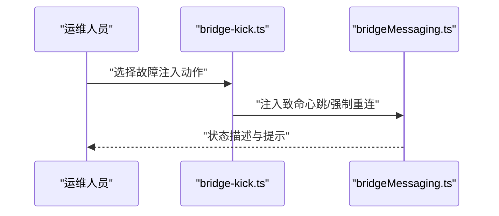
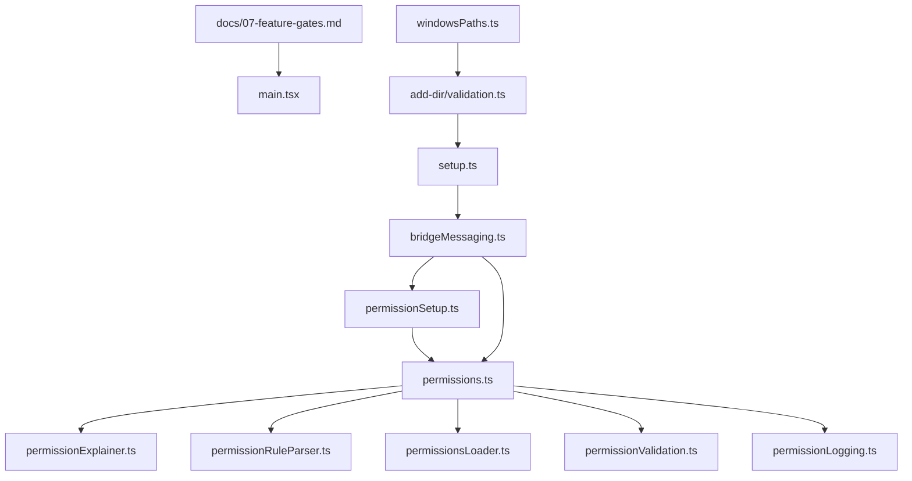

# 安全策略与防护

<cite>
**本文引用的文件**
- [src/commands/security-review.ts](file://src/commands/security-review.ts)
- [src/bridge/bridgeMessaging.ts](file://src/bridge/bridgeMessaging.ts)
- [src/bridge/types.ts](file://src/bridge/types.ts)
- [src/setup.ts](file://src/setup.ts)
- [src/commands/bridge-kick.ts](file://src/commands/bridge-kick.ts)
- [docs/07-feature-gates.md](file://docs/07-feature-gates.md)
- [src/utils/permissions/bypassPermissionsKillswitch.ts](file://src/utils/permissions/bypassPermissionsKillswitch.ts)
- [src/utils/permissions/permissionSetup.ts](file://src/utils/permissions/permissionSetup.ts)
- [src/utils/permissions/permissions.ts](file://src/utils/permissions/permissions.ts)
- [src/utils/permissions/permissionExplainer.ts](file://src/utils/permissions/permissionExplainer.ts)
- [src/utils/permissions/permissionRuleParser.ts](file://src/utils/permissions/permissionRuleParser.ts)
- [src/utils/permissions/permissionsLoader.ts](file://src/utils/permissions/permissionsLoader.ts)
- [src/utils/settings/permissionValidation.ts](file://src/utils/settings/permissionValidation.ts)
- [src/hooks/toolPermission/permissionLogging.ts](file://src/hooks/toolPermission/permissionLogging.ts)
- [src/commands/add-dir/validation.ts](file://src/commands/add-dir/validation.ts)
- [src/utils/windowsPaths.ts](file://src/utils/windowsPaths.ts)
- [src/main.tsx](file://src/main.tsx)
</cite>

## 目录
1. 引言
2. 项目结构
3. 核心组件
4. 架构总览
5. 组件详解
6. 依赖关系分析
7. 性能考量
8. 故障排查指南
9. 结论
10. 附录

## 引言
本文件面向 Claude Code 的安全策略与防护体系，系统阐述权限绕过保护机制、路径验证规则与安全边界控制；解释安全开关（含紧急停用与恢复）的工作原理及审计日志；详述路径规范化与恶意路径检测；并给出权限解释中的敏感信息保护、隐私控制与合规建议。同时提供配置指南、威胁建模与安全评估方法，帮助读者在不同部署形态下正确启用与维护安全能力。

## 项目结构
围绕安全主题的关键目录与文件分布如下：
- 权限与桥接控制：bridge 目录下的消息协议与类型定义，以及命令入口对权限模式切换的处理。
- 权限规则与解释：utils/permissions 下的解析、加载、解释与设置工具，配合 hooks 中的日志钩子。
- 安全开关与特性门控：docs/07-feature-gates.md 描述开关清单；main.tsx 展示 CLI 对开关的暴露。
- 路径与环境安全：setup.ts 中对沙箱与网络隔离的限制；add-dir 的路径校验；windowsPaths 的路径转换。
- 故障注入与恢复：commands/bridge-kick 提供手动故障注入以测试恢复链路。

**图表来源**
- [src/bridge/bridgeMessaging.ts](file://src/bridge/bridgeMessaging.ts)
- [src/bridge/types.ts](file://src/bridge/types.ts)
- [src/utils/permissions/permissionSetup.ts](file://src/utils/permissions/permissionSetup.ts)
- [src/utils/permissions/permissions.ts](file://src/utils/permissions/permissions.ts)
- [src/utils/permissions/permissionExplainer.ts](file://src/utils/permissions/permissionExplainer.ts)
- [src/utils/permissions/permissionRuleParser.ts](file://src/utils/permissions/permissionRuleParser.ts)
- [src/utils/permissions/permissionsLoader.ts](file://src/utils/permissions/permissionsLoader.ts)
- [src/utils/settings/permissionValidation.ts](file://src/utils/settings/permissionValidation.ts)
- [src/hooks/toolPermission/permissionLogging.ts](file://src/hooks/toolPermission/permissionLogging.ts)
- [docs/07-feature-gates.md](file://docs/07-feature-gates.md)
- [src/main.tsx](file://src/main.tsx)
- [src/setup.ts](file://src/setup.ts)
- [src/commands/add-dir/validation.ts](file://src/commands/add-dir/validation.ts)
- [src/utils/windowsPaths.ts](file://src/utils/windowsPaths.ts)
- [src/commands/bridge-kick.ts](file://src/commands/bridge-kick.ts)

**章节来源**
- [src/bridge/bridgeMessaging.ts](file://src/bridge/bridgeMessaging.ts)
- [src/bridge/types.ts](file://src/bridge/types.ts)
- [src/utils/permissions/permissionSetup.ts](file://src/utils/permissions/permissionSetup.ts)
- [src/utils/permissions/permissions.ts](file://src/utils/permissions/permissions.ts)
- [src/utils/permissions/permissionExplainer.ts](file://src/utils/permissions/permissionExplainer.ts)
- [src/utils/permissions/permissionRuleParser.ts](file://src/utils/permissions/permissionRuleParser.ts)
- [src/utils/permissions/permissionsLoader.ts](file://src/utils/permissions/permissionsLoader.ts)
- [src/utils/settings/permissionValidation.ts](file://src/utils/settings/permissionValidation.ts)
- [src/hooks/toolPermission/permissionLogging.ts](file://src/hooks/toolPermission/permissionLogging.ts)
- [docs/07-feature-gates.md](file://docs/07-feature-gates.md)
- [src/main.tsx](file://src/main.tsx)
- [src/setup.ts](file://src/setup.ts)
- [src/commands/add-dir/validation.ts](file://src/commands/add-dir/validation.ts)
- [src/utils/windowsPaths.ts](file://src/utils/windowsPaths.ts)
- [src/commands/bridge-kick.ts](file://src/commands/bridge-kick.ts)

## 核心组件
- 权限模式与桥接控制：通过桥接消息协议支持“设置权限模式”等控制请求，返回成功或错误响应，确保在不支持的上下文中不会静默失败。
- 权限规则引擎：包含规则解析、加载、解释与设置流程，结合设置校验与日志钩子，形成可审计的权限决策闭环。
- 安全开关与特性门控：通过文档化的开关清单与 CLI 选项，统一管理安全与合规功能的启停。
- 路径验证与规范化：对工作目录进行存在性、类型与包含关系检查；在多平台路径间进行规范化转换。
- 紧急停用与恢复：通过 killswitch 与故障注入命令，提供可控的紧急停用与恢复演练能力。

**章节来源**
- [src/bridge/bridgeMessaging.ts](file://src/bridge/bridgeMessaging.ts)
- [src/utils/permissions/permissions.ts](file://src/utils/permissions/permissions.ts)
- [src/utils/permissions/permissionRuleParser.ts](file://src/utils/permissions/permissionRuleParser.ts)
- [src/utils/permissions/permissionsLoader.ts](file://src/utils/permissions/permissionsLoader.ts)
- [src/utils/permissions/permissionExplainer.ts](file://src/utils/permissions/permissionExplainer.ts)
- [src/utils/settings/permissionValidation.ts](file://src/utils/settings/permissionValidation.ts)
- [src/hooks/toolPermission/permissionLogging.ts](file://src/hooks/toolPermission/permissionLogging.ts)
- [docs/07-feature-gates.md](file://docs/07-feature-gates.md)
- [src/main.tsx](file://src/main.tsx)
- [src/commands/add-dir/validation.ts](file://src/commands/add-dir/validation.ts)
- [src/utils/windowsPaths.ts](file://src/utils/windowsPaths.ts)
- [src/utils/permissions/bypassPermissionsKillswitch.ts](file://src/utils/permissions/bypassPermissionsKillswitch.ts)
- [src/commands/bridge-kick.ts](file://src/commands/bridge-kick.ts)

## 架构总览
下图展示安全策略在运行时的关键交互：桥接控制负责权限模式变更；权限规则引擎负责解析与执行；日志钩子记录审计；特性门控决定功能可用性；路径与环境安全在启动阶段进行约束。

**图表来源**
- [src/bridge/bridgeMessaging.ts](file://src/bridge/bridgeMessaging.ts)
- [src/utils/permissions/permissionSetup.ts](file://src/utils/permissions/permissionSetup.ts)
- [src/utils/permissions/permissions.ts](file://src/utils/permissions/permissions.ts)
- [src/hooks/toolPermission/permissionLogging.ts](file://src/hooks/toolPermission/permissionLogging.ts)
- [docs/07-feature-gates.md](file://docs/07-feature-gates.md)

## 组件详解

### 权限模式与桥接控制
- 桥接消息协议支持“设置权限模式”，并在回调未注册的上下文（如守护态）中返回明确错误，避免静默失败。
- 控制响应事件包含成功/错误子类型与请求 ID，便于端到端追踪。

**图表来源**
- [src/bridge/bridgeMessaging.ts](file://src/bridge/bridgeMessaging.ts)
- [src/bridge/types.ts](file://src/bridge/types.ts)

**章节来源**
- [src/bridge/bridgeMessaging.ts](file://src/bridge/bridgeMessaging.ts)
- [src/bridge/types.ts](file://src/bridge/types.ts)

### 权限规则引擎与解释
- 规则解析与加载：从配置加载规则并解析为内部表示，支持增量更新与缓存。
- 权限设置：根据当前上下文与规则生成最终权限集合，并进行设置校验。
- 权限解释：对规则进行自然语言解释，辅助用户理解授权逻辑。
- 日志审计：在权限变更与决策处插入审计事件，便于追溯。

**图表来源**
- [src/utils/permissions/permissionsLoader.ts](file://src/utils/permissions/permissionsLoader.ts)
- [src/utils/permissions/permissionRuleParser.ts](file://src/utils/permissions/permissionRuleParser.ts)
- [src/utils/permissions/permissions.ts](file://src/utils/permissions/permissions.ts)
- [src/utils/permissions/permissionExplainer.ts](file://src/utils/permissions/permissionExplainer.ts)
- [src/utils/settings/permissionValidation.ts](file://src/utils/settings/permissionValidation.ts)
- [src/hooks/toolPermission/permissionLogging.ts](file://src/hooks/toolPermission/permissionLogging.ts)

**章节来源**
- [src/utils/permissions/permissionsLoader.ts](file://src/utils/permissions/permissionsLoader.ts)
- [src/utils/permissions/permissionRuleParser.ts](file://src/utils/permissions/permissionRuleParser.ts)
- [src/utils/permissions/permissions.ts](file://src/utils/permissions/permissions.ts)
- [src/utils/permissions/permissionExplainer.ts](file://src/utils/permissions/permissionExplainer.ts)
- [src/utils/settings/permissionValidation.ts](file://src/utils/settings/permissionValidation.ts)
- [src/hooks/toolPermission/permissionLogging.ts](file://src/hooks/toolPermission/permissionLogging.ts)

### 安全开关与特性门控
- 文档化开关：列出安全与合规相关开关及其作用，便于运维与审计。
- CLI 暴露：部分开关通过命令行选项对外可见，用于快速启用/禁用特定能力。
- 用户类型：通过环境变量区分用户类型，影响某些安全行为的默认策略。

**图表来源**
- [docs/07-feature-gates.md](file://docs/07-feature-gates.md)
- [src/main.tsx](file://src/main.tsx)

**章节来源**
- [docs/07-feature-gates.md](file://docs/07-feature-gates.md)
- [src/main.tsx](file://src/main.tsx)

### 路径验证与规范化
- 工作目录校验：对目标路径进行存在性、类型与包含关系检查，避免越权访问与重复添加。
- 路径规范化：在 POSIX 与 Windows 路径之间进行转换，处理 UNC、cygdrive、MSYS2 等格式。
- 启动阶段约束：在非沙箱且具备网络访问的环境中禁止危险跳过权限的标志，防止误用。

**图表来源**
- [src/commands/add-dir/validation.ts](file://src/commands/add-dir/validation.ts)

**章节来源**
- [src/commands/add-dir/validation.ts](file://src/commands/add-dir/validation.ts)
- [src/utils/windowsPaths.ts](file://src/utils/windowsPaths.ts)
- [src/setup.ts](file://src/setup.ts)

### 紧急停用与恢复
- killswitch：提供权限绕过的紧急停用机制，确保在异常情况下可快速回退。
- 故障注入：通过桥接故障注入命令模拟心跳失败、强制重连等场景，验证恢复链路。

**图表来源**
- [src/commands/bridge-kick.ts](file://src/commands/bridge-kick.ts)
- [src/bridge/bridgeMessaging.ts](file://src/bridge/bridgeMessaging.ts)

**章节来源**
- [src/utils/permissions/bypassPermissionsKillswitch.ts](file://src/utils/permissions/bypassPermissionsKillswitch.ts)
- [src/commands/bridge-kick.ts](file://src/commands/bridge-kick.ts)
- [src/bridge/bridgeMessaging.ts](file://src/bridge/bridgeMessaging.ts)

## 依赖关系分析
- 权限模块内部高内聚：解析、加载、解释、设置与校验环环相扣，日志贯穿始终。
- 桥接控制作为外部接口：对上提供统一的控制响应，对下驱动权限引擎。
- 特性门控与 CLI：通过文档与命令行选项将安全能力显式化，降低隐性风险。
- 路径与环境：启动阶段的沙箱与网络约束与权限模式共同构成安全边界。

**图表来源**
- [src/utils/permissions/permissionSetup.ts](file://src/utils/permissions/permissionSetup.ts)
- [src/utils/permissions/permissions.ts](file://src/utils/permissions/permissions.ts)
- [src/utils/permissions/permissionExplainer.ts](file://src/utils/permissions/permissionExplainer.ts)
- [src/utils/permissions/permissionRuleParser.ts](file://src/utils/permissions/permissionRuleParser.ts)
- [src/utils/permissions/permissionsLoader.ts](file://src/utils/permissions/permissionsLoader.ts)
- [src/utils/settings/permissionValidation.ts](file://src/utils/settings/permissionValidation.ts)
- [src/hooks/toolPermission/permissionLogging.ts](file://src/hooks/toolPermission/permissionLogging.ts)
- [src/bridge/bridgeMessaging.ts](file://src/bridge/bridgeMessaging.ts)
- [docs/07-feature-gates.md](file://docs/07-feature-gates.md)
- [src/main.tsx](file://src/main.tsx)
- [src/setup.ts](file://src/setup.ts)
- [src/commands/add-dir/validation.ts](file://src/commands/add-dir/validation.ts)
- [src/utils/windowsPaths.ts](file://src/utils/windowsPaths.ts)

**章节来源**
- [src/utils/permissions/permissionSetup.ts](file://src/utils/permissions/permissionSetup.ts)
- [src/utils/permissions/permissions.ts](file://src/utils/permissions/permissions.ts)
- [src/utils/permissions/permissionExplainer.ts](file://src/utils/permissions/permissionExplainer.ts)
- [src/utils/permissions/permissionRuleParser.ts](file://src/utils/permissions/permissionRuleParser.ts)
- [src/utils/permissions/permissionsLoader.ts](file://src/utils/permissions/permissionsLoader.ts)
- [src/utils/settings/permissionValidation.ts](file://src/utils/settings/permissionValidation.ts)
- [src/hooks/toolPermission/permissionLogging.ts](file://src/hooks/toolPermission/permissionLogging.ts)
- [src/bridge/bridgeMessaging.ts](file://src/bridge/bridgeMessaging.ts)
- [docs/07-feature-gates.md](file://docs/07-feature-gates.md)
- [src/main.tsx](file://src/main.tsx)
- [src/setup.ts](file://src/setup.ts)
- [src/commands/add-dir/validation.ts](file://src/commands/add-dir/validation.ts)
- [src/utils/windowsPaths.ts](file://src/utils/windowsPaths.ts)

## 性能考量
- 权限规则解析与加载：采用缓存与增量更新策略，减少热路径开销。
- 路径规范化：对常见格式进行 LRU 缓存，避免重复计算。
- 审计日志：异步写入与批量聚合，降低对主流程的影响。
- 特性门控：仅在必要时进行开关判断，避免无谓分支。

## 故障排查指南
- 权限模式设置失败：确认回调是否注册、上下文是否支持该操作；查看控制响应错误信息。
- 权限绕过被紧急停用：检查 killswitch 配置与环境变量；核对 USER_TYPE 与部署形态。
- 路径校验异常：关注 notADirectory、pathNotFound、alreadyInWorkingDirectory 等返回码；检查权限与符号链接。
- 桥接故障注入：通过 bridge-kick 观察心跳与重连行为，定位通信链路问题。

**章节来源**
- [src/bridge/bridgeMessaging.ts](file://src/bridge/bridgeMessaging.ts)
- [src/utils/permissions/bypassPermissionsKillswitch.ts](file://src/utils/permissions/bypassPermissionsKillswitch.ts)
- [src/commands/add-dir/validation.ts](file://src/commands/add-dir/validation.ts)
- [src/commands/bridge-kick.ts](file://src/commands/bridge-kick.ts)

## 结论
Claude Code 的安全策略以“最小权限、可观测、可恢复”为核心，通过桥接控制、规则引擎、特性门控与路径/环境约束形成闭环。建议在生产环境严格启用权限模式与审计日志，合理使用安全开关与 killswitch，并定期进行故障注入演练以验证恢复链路。

## 附录

### 安全策略配置指南
- 启用权限模式：通过桥接控制设置权限模式，确保回调正确注册。
- 配置权限规则：使用规则解析与加载模块，结合解释与校验流程。
- 设置特性门控：依据文档开关清单启用/禁用安全相关功能。
- 路径与环境约束：在非沙箱且具备网络访问的环境中避免危险标志；对工作目录进行严格校验。

**章节来源**
- [src/bridge/bridgeMessaging.ts](file://src/bridge/bridgeMessaging.ts)
- [src/utils/permissions/permissionsLoader.ts](file://src/utils/permissions/permissionsLoader.ts)
- [src/utils/permissions/permissionRuleParser.ts](file://src/utils/permissions/permissionRuleParser.ts)
- [src/utils/permissions/permissionExplainer.ts](file://src/utils/permissions/permissionExplainer.ts)
- [src/utils/settings/permissionValidation.ts](file://src/utils/settings/permissionValidation.ts)
- [docs/07-feature-gates.md](file://docs/07-feature-gates.md)
- [src/setup.ts](file://src/setup.ts)
- [src/commands/add-dir/validation.ts](file://src/commands/add-dir/validation.ts)

### 威胁建模与安全评估
- 输入验证：重点防范路径遍历、命令注入与模板注入；对所有外部输入进行白名单与规范化处理。
- 认证与授权：避免权限绕过与提升；对关键操作进行二次确认与审计。
- 加密与密钥：避免硬编码密钥；使用受信存储与轮换机制。
- 安全评估：基于安全审查命令清单进行扫描；结合 killswitch 与故障注入验证恢复能力。

**章节来源**
- [src/commands/security-review.ts](file://src/commands/security-review.ts)
- [src/utils/permissions/bypassPermissionsKillswitch.ts](file://src/utils/permissions/bypassPermissionsKillswitch.ts)
- [src/commands/bridge-kick.ts](file://src/commands/bridge-kick.ts)