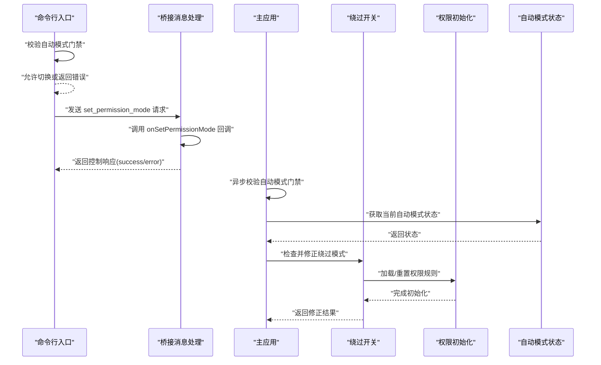
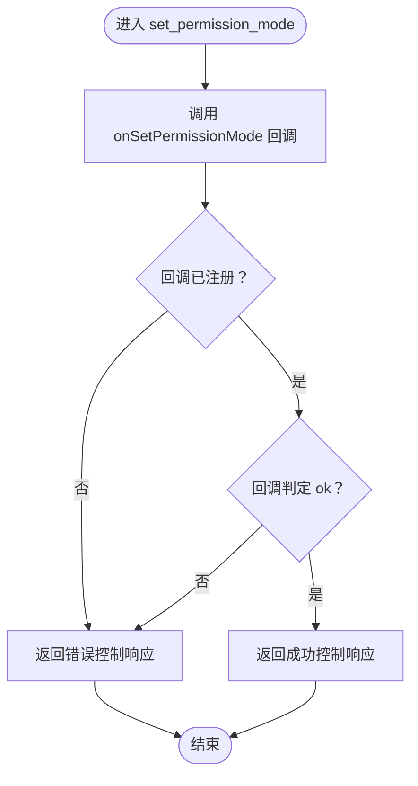
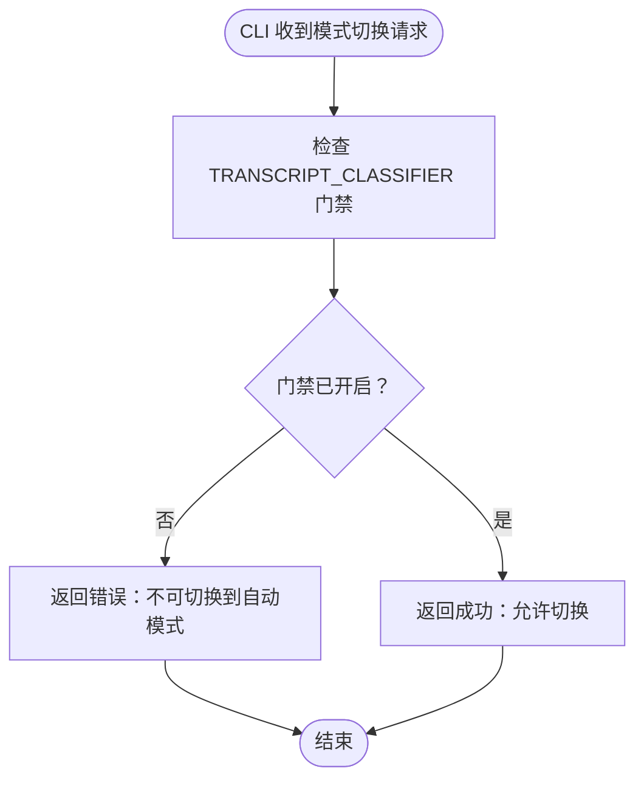
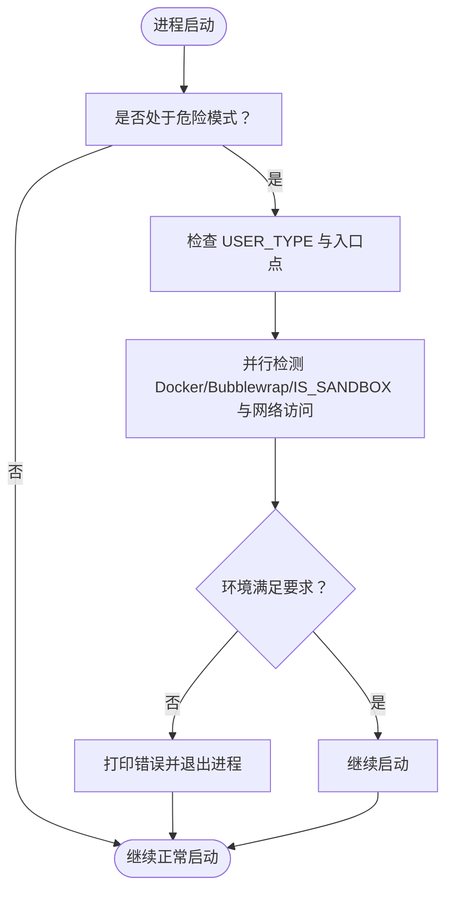
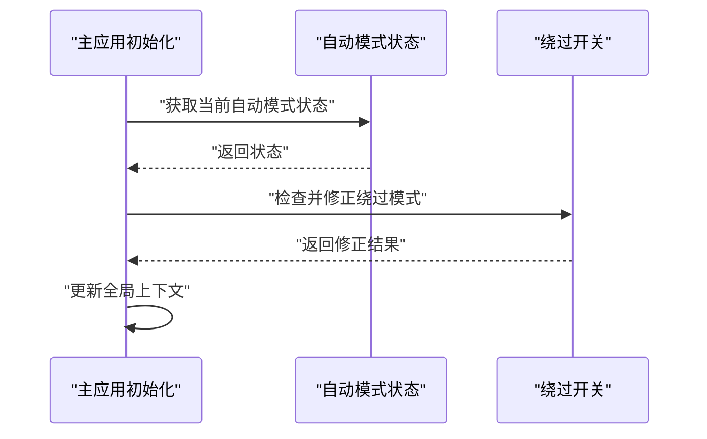
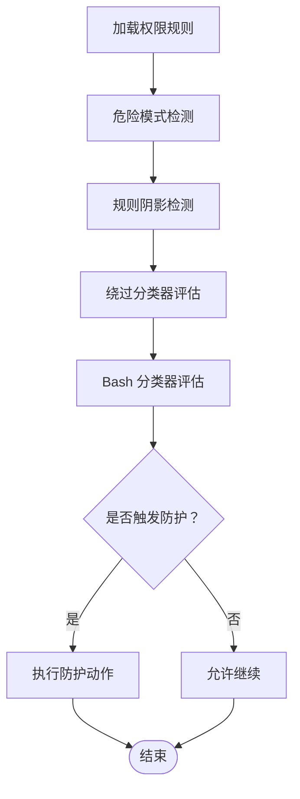
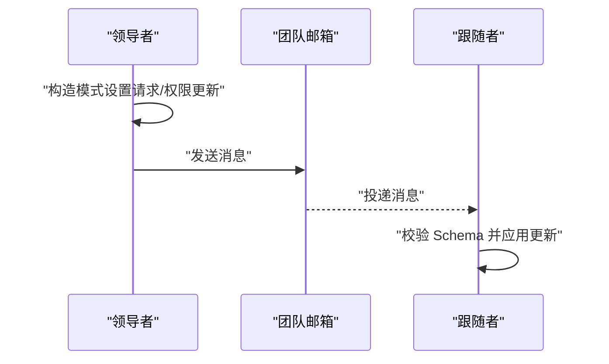
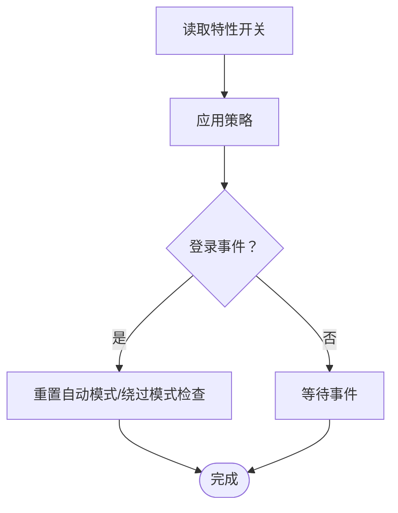
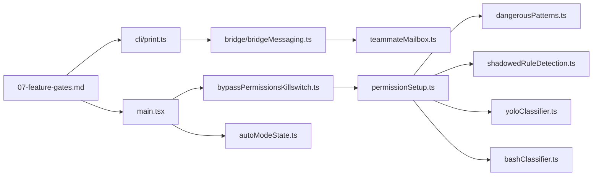

# 权限绕过保护机制

<cite>
**本文引用的文件**
- [src/bridge/bridgeMessaging.ts](file://src/bridge/bridgeMessaging.ts)
- [src/cli/print.ts](file://src/cli/print.ts)
- [src/setup.ts](file://src/setup.ts)
- [src/main.tsx](file://src/main.tsx)
- [src/utils/permissions/bypassPermissionsKillswitch.ts](file://src/utils/permissions/bypassPermissionsKillswitch.ts)
- [src/utils/permissions/permissionSetup.ts](file://src/utils/permissions/permissionSetup.ts)
- [src/utils/permissions/autoModeState.ts](file://src/utils/permissions/autoModeState.ts)
- [src/utils/permissions/dangerousPatterns.ts](file://src/utils/permissions/dangerousPatterns.ts)
- [src/utils/permissions/shadowedRuleDetection.ts](file://src/utils/permissions/shadowedRuleDetection.ts)
- [src/utils/permissions/yoloClassifier.ts](file://src/utils/permissions/yoloClassifier.ts)
- [src/utils/permissions/bashClassifier.ts](file://src/utils/permissions/bashClassifier.ts)
- [src/utils/teammateMailbox.ts](file://src/utils/teammateMailbox.ts)
- [docs/07-feature-gates.md](file://docs/07-feature-gates.md)
</cite>

## 目录
1. [引言](#引言)
2. [项目结构](#项目结构)
3. [核心组件](#核心组件)
4. [架构总览](#架构总览)
5. [详细组件分析](#详细组件分析)
6. [依赖关系分析](#依赖关系分析)
7. [性能考量](#性能考量)
8. [故障排查指南](#故障排查指南)
9. [结论](#结论)
10. [附录](#附录)

## 引言
本文件面向 Claude Code 的“权限绕过保护机制”，系统性阐述其设计原理、实现细节与运行流程，重点覆盖以下方面：
- 紧急停用机制与自动模式状态管理
- 安全恢复流程与审计日志
- 权限绕过检测算法、异常行为识别与自动防护触发条件
- 安全开关的状态管理、重置机制
- 防护策略配置与应急响应流程
- 具体代码示例路径与最佳实践

该机制通过“权限模式”切换控制工具使用范围，结合环境约束、特征门控与实时校验，确保在高风险场景下可被强制降级或阻断。

## 项目结构
围绕权限绕过保护的关键目录与文件如下：
- 桥接层消息处理：负责接收并验证“设置权限模式”的请求，返回成功或错误响应
- CLI 控制流：在命令行入口处对模式切换进行前置校验（如自动模式门禁）
- 启动阶段安全检查：在进程启动时对危险模式（如跳过权限）进行环境与信任模型校验
- 主应用初始化：在主进程中异步校验并修正自动模式与绕过模式状态
- 权限工具集：包含绕过开关、自动模式状态、危险模式检测、规则阴影检测、分类器等
- 团队内通信：用于跨节点广播模式变更与权限更新
- 文档：特性开关清单，明确与安全相关的门控项

```mermaid
graph TB
subgraph "桥接层"
BM["bridgeMessaging.ts<br/>处理 set_permission_mode 请求"]
end
subgraph "CLI"
CLI["print.ts<br/>命令行模式切换校验"]
end
subgraph "启动阶段"
SETUP["setup.ts<br/>危险模式环境校验"]
end
subgraph "主应用"
MAIN["main.tsx<br/>异步校验与状态修正"]
end
subgraph "权限工具集"
KSW["bypassPermissionsKillswitch.ts<br/>绕过开关/重置"]
PS["permissionSetup.ts<br/>权限初始化/加载"]
AMS["autoModeState.ts<br/>自动模式状态"]
DP["dangerousPatterns.ts<br/>危险模式检测"]
SRD["shadowedRuleDetection.ts<br/>规则阴影检测"]
YC["yoloClassifier.ts<br/>绕过分类器"]
BC["bashClassifier.ts<br/>Bash 分类器"]
end
subgraph "团队通信"
TM["teammateMailbox.ts<br/>模式/权限消息"]
end
subgraph "文档"
FG["07-feature-gates.md<br/>特性开关"]
end
CLI --> BM
SETUP --> MAIN
MAIN --> KSW
MAIN --> AMS
KSW --> PS
PS --> DP
PS --> SRD
PS --> YC
PS --> BC
BM --> TM
FG --> CLI
FG --> MAIN
```

**图表来源**
- [src/bridge/bridgeMessaging.ts:328-371](file://src/bridge/bridgeMessaging.ts#L328-L371)
- [src/cli/print.ts:4602-4642](file://src/cli/print.ts#L4602-L4642)
- [src/setup.ts:395-446](file://src/setup.ts#L395-L446)
- [src/main.tsx:2658-2691](file://src/main.tsx#L2658-L2691)
- [src/utils/permissions/bypassPermissionsKillswitch.ts](file://src/utils/permissions/bypassPermissionsKillswitch.ts)
- [src/utils/permissions/permissionSetup.ts](file://src/utils/permissions/permissionSetup.ts)
- [src/utils/permissions/autoModeState.ts](file://src/utils/permissions/autoModeState.ts)
- [src/utils/permissions/dangerousPatterns.ts](file://src/utils/permissions/dangerousPatterns.ts)
- [src/utils/permissions/shadowedRuleDetection.ts](file://src/utils/permissions/shadowedRuleDetection.ts)
- [src/utils/permissions/yoloClassifier.ts](file://src/utils/permissions/yoloClassifier.ts)
- [src/utils/permissions/bashClassifier.ts](file://src/utils/permissions/bashClassifier.ts)
- [src/utils/teammateMailbox.ts:979-1029](file://src/utils/teammateMailbox.ts#L979-L1029)
- [docs/07-feature-gates.md:75-124](file://docs/07-feature-gates.md#L75-L124)

**章节来源**
- [src/bridge/bridgeMessaging.ts:328-371](file://src/bridge/bridgeMessaging.ts#L328-L371)
- [src/cli/print.ts:4602-4642](file://src/cli/print.ts#L4602-L4642)
- [src/setup.ts:395-446](file://src/setup.ts#L395-L446)
- [src/main.tsx:2658-2691](file://src/main.tsx#L2658-L2691)
- [src/utils/permissions/bypassPermissionsKillswitch.ts](file://src/utils/permissions/bypassPermissionsKillswitch.ts)
- [src/utils/permissions/permissionSetup.ts](file://src/utils/permissions/permissionSetup.ts)
- [src/utils/permissions/autoModeState.ts](file://src/utils/permissions/autoModeState.ts)
- [src/utils/permissions/dangerousPatterns.ts](file://src/utils/permissions/dangerousPatterns.ts)
- [src/utils/permissions/shadowedRuleDetection.ts](file://src/utils/permissions/shadowedRuleDetection.ts)
- [src/utils/permissions/yoloClassifier.ts](file://src/utils/permissions/yoloClassifier.ts)
- [src/utils/permissions/bashClassifier.ts](file://src/utils/permissions/bashClassifier.ts)
- [src/utils/teammateMailbox.ts:979-1029](file://src/utils/teammateMailbox.ts#L979-L1029)
- [docs/07-feature-gates.md:75-124](file://docs/07-feature-gates.md#L75-L124)

## 核心组件
- 权限模式切换控制：通过桥接层统一入口处理“设置权限模式”请求，返回控制响应；若回调未注册则拒绝并说明原因
- 自动模式门禁：在 CLI 层对切换到自动模式进行前置校验，若未满足门禁条件则直接返回错误
- 启动阶段安全检查：对“危险地跳过权限”模式进行严格环境约束（容器沙箱、无外网访问、非 root 等），不满足则终止进程
- 主应用异步校验：在主进程中并行检查自动模式与绕过模式状态，必要时修正上下文
- 绕过开关与重置：提供绕过模式的动态开关与重置逻辑，支持登录后清理状态
- 权限初始化与加载：负责规则解析、危险模式检测、规则阴影检测、绕过分类器与 Bash 分类器
- 团队内广播：通过邮箱协议广播模式变更与权限更新，保证多实例一致性
- 特性开关：通过文档列出与安全相关的门控项，便于集中治理

**章节来源**
- [src/bridge/bridgeMessaging.ts:328-371](file://src/bridge/bridgeMessaging.ts#L328-L371)
- [src/cli/print.ts:4602-4642](file://src/cli/print.ts#L4602-L4642)
- [src/setup.ts:395-446](file://src/setup.ts#L395-L446)
- [src/main.tsx:2658-2691](file://src/main.tsx#L2658-L2691)
- [src/utils/permissions/bypassPermissionsKillswitch.ts](file://src/utils/permissions/bypassPermissionsKillswitch.ts)
- [src/utils/permissions/permissionSetup.ts](file://src/utils/permissions/permissionSetup.ts)
- [src/utils/permissions/autoModeState.ts](file://src/utils/permissions/autoModeState.ts)
- [src/utils/permissions/dangerousPatterns.ts](file://src/utils/permissions/dangerousPatterns.ts)
- [src/utils/permissions/shadowedRuleDetection.ts](file://src/utils/permissions/shadowedRuleDetection.ts)
- [src/utils/permissions/yoloClassifier.ts](file://src/utils/permissions/yoloClassifier.ts)
- [src/utils/permissions/bashClassifier.ts](file://src/utils/permissions/bashClassifier.ts)
- [src/utils/teammateMailbox.ts:979-1029](file://src/utils/teammateMailbox.ts#L979-L1029)
- [docs/07-feature-gates.md:75-124](file://docs/07-feature-gates.md#L75-L124)

## 架构总览
下图展示从 CLI 到桥接层再到主应用与权限工具集的整体调用链路，以及关键的校验点与防护动作。



**图表来源**
- [src/cli/print.ts:4602-4642](file://src/cli/print.ts#L4602-L4642)
- [src/bridge/bridgeMessaging.ts:328-371](file://src/bridge/bridgeMessaging.ts#L328-L371)
- [src/main.tsx:2658-2691](file://src/main.tsx#L2658-L2691)
- [src/utils/permissions/bypassPermissionsKillswitch.ts](file://src/utils/permissions/bypassPermissionsKillswitch.ts)
- [src/utils/permissions/autoModeState.ts](file://src/utils/permissions/autoModeState.ts)
- [src/utils/permissions/permissionSetup.ts](file://src/utils/permissions/permissionSetup.ts)

## 详细组件分析

### 组件A：权限模式切换与桥接层控制
- 设计要点
  - 统一入口处理“设置权限模式”请求，避免直接暴露底层策略
  - 若回调未注册（例如守护态上下文），直接返回错误，防止静默失败
  - 成功时返回“success”，失败时携带具体错误信息
- 关键流程
  - 接收请求 -> 调用回调 -> 生成控制响应 -> 返回给调用方
- 安全影响
  - 阻止在不受信任上下文中应用高风险模式
  - 为后续自动模式门禁与绕过开关提供一致的控制面



**图表来源**
- [src/bridge/bridgeMessaging.ts:328-371](file://src/bridge/bridgeMessaging.ts#L328-L371)

**章节来源**
- [src/bridge/bridgeMessaging.ts:328-371](file://src/bridge/bridgeMessaging.ts#L328-L371)

### 组件B：自动模式门禁与 CLI 校验
- 设计要点
  - 在 CLI 层对切换到自动模式进行前置校验
  - 若未启用相关特性门（如转录分类器）或门禁未开启，则拒绝切换并给出原因
- 关键流程
  - 解析请求 -> 检查门禁 -> 允许切换或返回错误 -> 更新上下文



**图表来源**
- [src/cli/print.ts:4602-4642](file://src/cli/print.ts#L4602-L4642)

**章节来源**
- [src/cli/print.ts:4602-4642](file://src/cli/print.ts#L4602-L4642)

### 组件C：启动阶段安全检查（危险模式）
- 设计要点
  - 对“危险地跳过权限”模式进行严格环境约束
  - 非 Windows 平台禁止以 root 运行（沙箱除外）
  - Anthropic 内部用户仅允许在容器/沙箱且无外网访问的环境中使用
- 关键流程
  - 检查用户类型与入口点 -> 并行检测容器/沙箱/网络 -> 不满足则退出进程



**图表来源**
- [src/setup.ts:395-446](file://src/setup.ts#L395-L446)

**章节来源**
- [src/setup.ts:395-446](file://src/setup.ts#L395-L446)

### 组件D：主应用异步校验与状态修正
- 设计要点
  - 在主应用初始化时并行执行两类校验：
    - 自动模式门禁校验：根据特性开关与状态修正上下文
    - 绕过模式校验：根据门控与策略关闭或修正状态
- 关键流程
  - 初始化存储 -> 并行校验 -> 更新上下文 -> 设置全局状态



**图表来源**
- [src/main.tsx:2658-2691](file://src/main.tsx#L2658-L2691)
- [src/utils/permissions/autoModeState.ts](file://src/utils/permissions/autoModeState.ts)
- [src/utils/permissions/bypassPermissionsKillswitch.ts](file://src/utils/permissions/bypassPermissionsKillswitch.ts)

**章节来源**
- [src/main.tsx:2658-2691](file://src/main.tsx#L2658-L2691)
- [src/utils/permissions/autoModeState.ts](file://src/utils/permissions/autoModeState.ts)
- [src/utils/permissions/bypassPermissionsKillswitch.ts](file://src/utils/permissions/bypassPermissionsKillswitch.ts)

### 组件E：权限初始化与规则管理
- 设计要点
  - 权限初始化负责规则解析、危险模式检测、规则阴影检测、绕过分类器与 Bash 分类器
  - 通过工具集协同实现“异常行为识别”与“自动防护触发”
- 关键流程
  - 加载规则 -> 危险模式检测 -> 规则阴影检测 -> 分类器评估 -> 触发防护



**图表来源**
- [src/utils/permissions/permissionSetup.ts](file://src/utils/permissions/permissionSetup.ts)
- [src/utils/permissions/dangerousPatterns.ts](file://src/utils/permissions/dangerousPatterns.ts)
- [src/utils/permissions/shadowedRuleDetection.ts](file://src/utils/permissions/shadowedRuleDetection.ts)
- [src/utils/permissions/yoloClassifier.ts](file://src/utils/permissions/yoloClassifier.ts)
- [src/utils/permissions/bashClassifier.ts](file://src/utils/permissions/bashClassifier.ts)

**章节来源**
- [src/utils/permissions/permissionSetup.ts](file://src/utils/permissions/permissionSetup.ts)
- [src/utils/permissions/dangerousPatterns.ts](file://src/utils/permissions/dangerousPatterns.ts)
- [src/utils/permissions/shadowedRuleDetection.ts](file://src/utils/permissions/shadowedRuleDetection.ts)
- [src/utils/permissions/yoloClassifier.ts](file://src/utils/permissions/yoloClassifier.ts)
- [src/utils/permissions/bashClassifier.ts](file://src/utils/permissions/bashClassifier.ts)

### 组件F：团队内广播与一致性
- 设计要点
  - 通过邮箱协议广播“模式设置请求”与“团队权限更新”，确保多实例一致性
  - 使用模式校验 Schema 保证消息格式正确
- 关键流程
  - 生成请求/更新消息 -> 校验格式 -> 发送到目标节点



**图表来源**
- [src/utils/teammateMailbox.ts:979-1029](file://src/utils/teammateMailbox.ts#L979-L1029)

**章节来源**
- [src/utils/teammateMailbox.ts:979-1029](file://src/utils/teammateMailbox.ts#L979-L1029)

### 组件G：安全开关与重置机制
- 设计要点
  - 特性开关清单涵盖与安全相关的门控项（如反蒸馏、转录分类器、原生客户端证明等）
  - 登录后可重置自动模式与绕过模式检查，清理缓存状态
- 关键流程
  - 读取开关 -> 应用策略 -> 登录后重置



**图表来源**
- [docs/07-feature-gates.md:75-124](file://docs/07-feature-gates.md#L75-L124)
- [src/commands/login/login.tsx:17-19](file://src/commands/login/login.tsx#L17-L19)

**章节来源**
- [docs/07-feature-gates.md:75-124](file://docs/07-feature-gates.md#L75-L124)
- [src/commands/login/login.tsx:17-19](file://src/commands/login/login.tsx#L17-L19)

## 依赖关系分析
- 组件耦合
  - 桥接层与 CLI 之间通过统一的消息协议耦合，确保控制面一致
  - 主应用与权限工具集之间存在松耦合的查询/更新接口，便于扩展
  - 团队内广播模块独立于权限工具集，仅依赖消息格式校验
- 外部依赖
  - 特性开关来自文档与环境变量，作为策略输入
  - 环境检测（容器/沙箱/网络）依赖平台能力



**图表来源**
- [src/cli/print.ts:4602-4642](file://src/cli/print.ts#L4602-L4642)
- [src/bridge/bridgeMessaging.ts:328-371](file://src/bridge/bridgeMessaging.ts#L328-L371)
- [src/main.tsx:2658-2691](file://src/main.tsx#L2658-L2691)
- [src/utils/permissions/bypassPermissionsKillswitch.ts](file://src/utils/permissions/bypassPermissionsKillswitch.ts)
- [src/utils/permissions/autoModeState.ts](file://src/utils/permissions/autoModeState.ts)
- [src/utils/permissions/permissionSetup.ts](file://src/utils/permissions/permissionSetup.ts)
- [src/utils/permissions/dangerousPatterns.ts](file://src/utils/permissions/dangerousPatterns.ts)
- [src/utils/permissions/shadowedRuleDetection.ts](file://src/utils/permissions/shadowedRuleDetection.ts)
- [src/utils/permissions/yoloClassifier.ts](file://src/utils/permissions/yoloClassifier.ts)
- [src/utils/permissions/bashClassifier.ts](file://src/utils/permissions/bashClassifier.ts)
- [src/utils/teammateMailbox.ts:979-1029](file://src/utils/teammateMailbox.ts#L979-L1029)
- [docs/07-feature-gates.md:75-124](file://docs/07-feature-gates.md#L75-L124)

**章节来源**
- [src/cli/print.ts:4602-4642](file://src/cli/print.ts#L4602-L4642)
- [src/bridge/bridgeMessaging.ts:328-371](file://src/bridge/bridgeMessaging.ts#L328-L371)
- [src/main.tsx:2658-2691](file://src/main.tsx#L2658-L2691)
- [src/utils/permissions/bypassPermissionsKillswitch.ts](file://src/utils/permissions/bypassPermissionsKillswitch.ts)
- [src/utils/permissions/autoModeState.ts](file://src/utils/permissions/autoModeState.ts)
- [src/utils/permissions/permissionSetup.ts](file://src/utils/permissions/permissionSetup.ts)
- [src/utils/permissions/dangerousPatterns.ts](file://src/utils/permissions/dangerousPatterns.ts)
- [src/utils/permissions/shadowedRuleDetection.ts](file://src/utils/permissions/shadowedRuleDetection.ts)
- [src/utils/permissions/yoloClassifier.ts](file://src/utils/permissions/yoloClassifier.ts)
- [src/utils/permissions/bashClassifier.ts](file://src/utils/permissions/bashClassifier.ts)
- [src/utils/teammateMailbox.ts:979-1029](file://src/utils/teammateMailbox.ts#L979-L1029)
- [docs/07-feature-gates.md:75-124](file://docs/07-feature-gates.md#L75-L124)

## 性能考量
- 并行校验：主应用初始化时对自动模式与绕过模式进行并行校验，避免阻塞主循环
- 序列化变更：CLI 中对 MCP 服务器变更采用串行化，防止并发竞态导致状态不一致
- 缓存与阈值：自动工具检索阈值计算采用缓存与回退策略，减少重复计算

[本节为通用指导，无需特定文件来源]

## 故障排查指南
- 模式切换失败
  - 检查是否在不受支持的上下文（如守护态）尝试设置权限模式
  - 查看桥接层返回的错误信息，确认回调是否注册
  - 参考路径：[src/bridge/bridgeMessaging.ts:328-371](file://src/bridge/bridgeMessaging.ts#L328-L371)
- 无法切换到自动模式
  - 确认特性门（如转录分类器）已启用且门禁可用
  - 参考路径：[src/cli/print.ts:4602-4642](file://src/cli/print.ts#L4602-L4642)
- 启动被阻止
  - 检查是否以 root 运行且不在沙箱中，或是否具有外网访问
  - 参考路径：[src/setup.ts:395-446](file://src/setup.ts#L395-L446)
- 绕过模式异常
  - 登录后重置自动模式与绕过模式检查，清理缓存状态
  - 参考路径：[src/commands/login/login.tsx:17-19](file://src/commands/login/login.tsx#L17-L19)
- 团队内不一致
  - 检查邮箱消息格式与 Schema 校验，确保消息正确投递与应用
  - 参考路径：[src/utils/teammateMailbox.ts:979-1029](file://src/utils/teammateMailbox.ts#L979-L1029)

**章节来源**
- [src/bridge/bridgeMessaging.ts:328-371](file://src/bridge/bridgeMessaging.ts#L328-L371)
- [src/cli/print.ts:4602-4642](file://src/cli/print.ts#L4602-L4642)
- [src/setup.ts:395-446](file://src/setup.ts#L395-L446)
- [src/commands/login/login.tsx:17-19](file://src/commands/login/login.tsx#L17-L19)
- [src/utils/teammateMailbox.ts:979-1029](file://src/utils/teammateMailbox.ts#L979-L1029)

## 结论
该权限绕过保护机制通过“控制面统一、启动前校验、主进程异步修正、工具集协同检测”形成闭环。其核心价值在于：
- 将高风险操作限制在受控环境与受信上下文中
- 以特性开关与门禁为手段，实现灵活的策略治理
- 通过团队内广播与状态重置，保障分布式一致性与可恢复性

建议在生产环境中：
- 明确各门禁与开关的作用域与优先级
- 对危险模式实施严格的环境约束
- 建立自动化巡检与告警，及时发现异常行为
- 定期复核权限规则与分类器阈值，降低误报与漏报

[本节为总结，无需特定文件来源]

## 附录
- 最佳实践
  - 在 CI/CD 中默认启用自动模式门禁与绕过开关
  - 对内部用户与外部用户分别制定不同的信任模型与约束
  - 将危险模式的使用限定在沙箱与离线环境
  - 建立审计日志与回溯机制，记录所有模式切换与防护触发事件
- 相关实现路径
  - 权限模式切换：[src/bridge/bridgeMessaging.ts:328-371](file://src/bridge/bridgeMessaging.ts#L328-L371)
  - 自动模式门禁：[src/cli/print.ts:4602-4642](file://src/cli/print.ts#L4602-L4642)
  - 启动安全检查：[src/setup.ts:395-446](file://src/setup.ts#L395-L446)
  - 主应用校验：[src/main.tsx:2658-2691](file://src/main.tsx#L2658-L2691)
  - 绕过开关与重置：[src/utils/permissions/bypassPermissionsKillswitch.ts](file://src/utils/permissions/bypassPermissionsKillswitch.ts)
  - 权限初始化与检测：[src/utils/permissions/permissionSetup.ts](file://src/utils/permissions/permissionSetup.ts)、[src/utils/permissions/dangerousPatterns.ts](file://src/utils/permissions/dangerousPatterns.ts)、[src/utils/permissions/shadowedRuleDetection.ts](file://src/utils/permissions/shadowedRuleDetection.ts)、[src/utils/permissions/yoloClassifier.ts](file://src/utils/permissions/yoloClassifier.ts)、[src/utils/permissions/bashClassifier.ts](file://src/utils/permissions/bashClassifier.ts)
  - 团队内广播：[src/utils/teammateMailbox.ts:979-1029](file://src/utils/teammateMailbox.ts#L979-L1029)
  - 特性开关：[docs/07-feature-gates.md:75-124](file://docs/07-feature-gates.md#L75-L124)