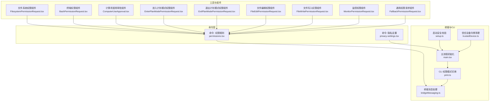
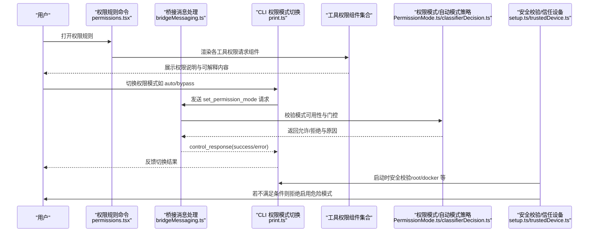
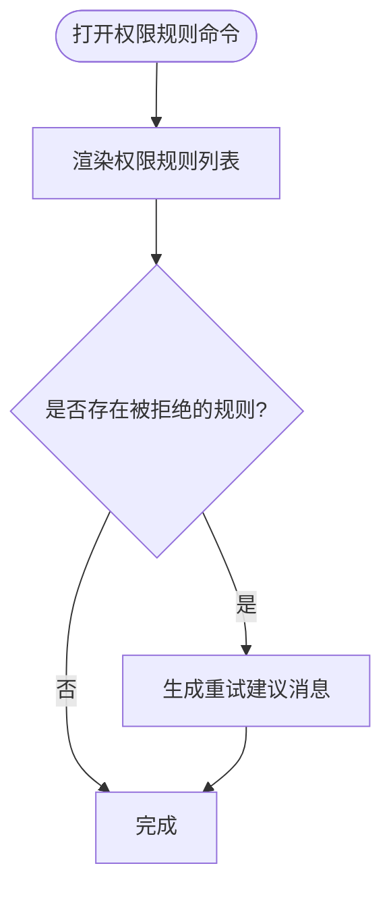
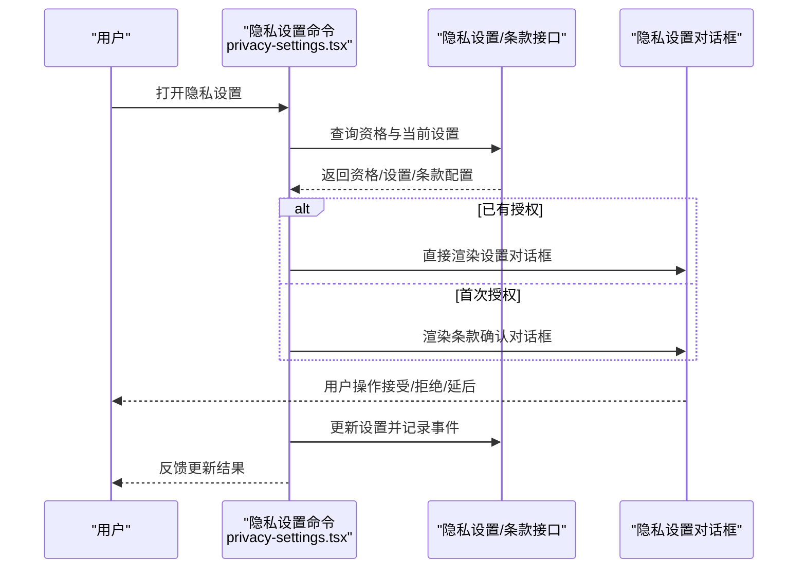
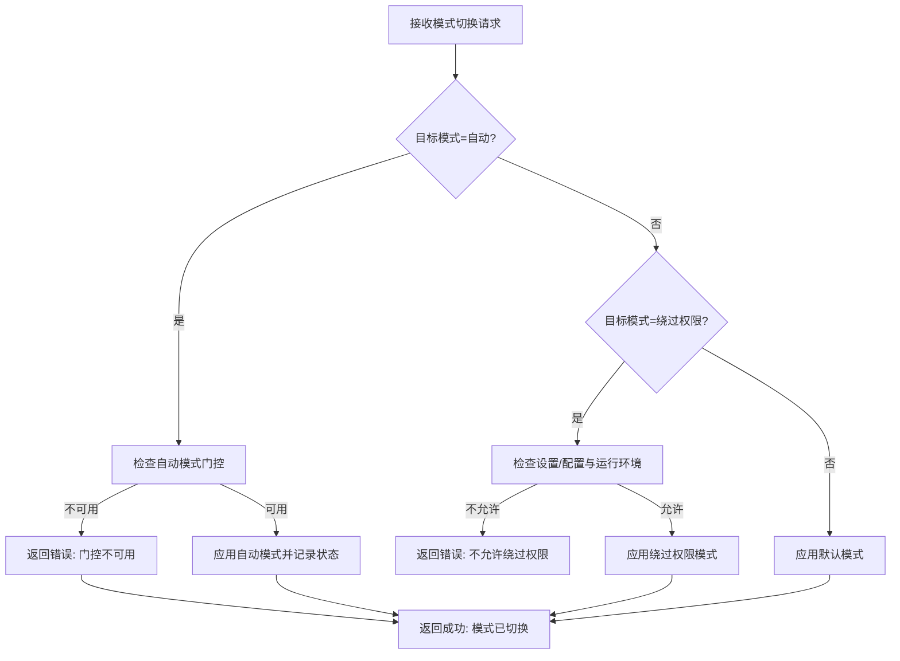
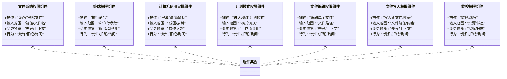
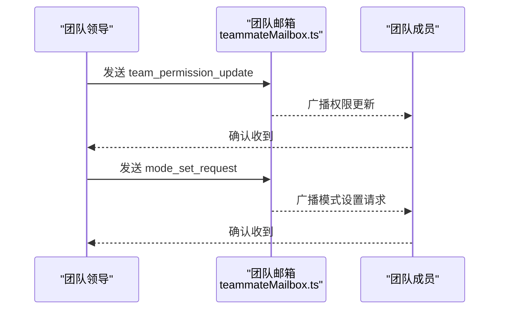
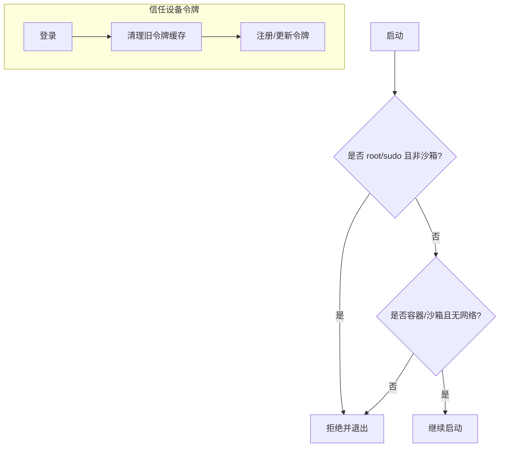
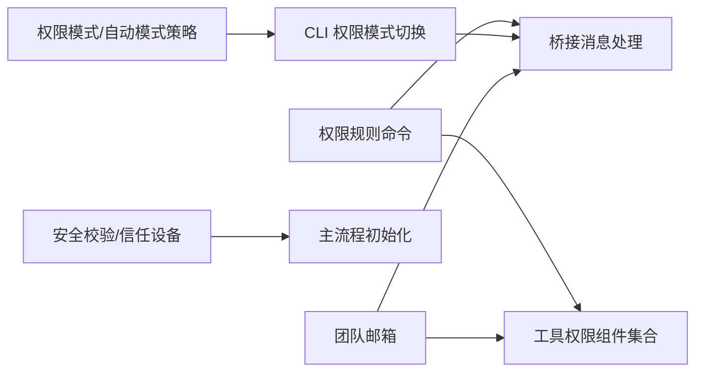

# 权限解释与隐私保护

<cite>
**本文引用的文件**
- [src/commands/permissions/permissions.tsx](file://src/commands/permissions/permissions.tsx)
- [src/commands/privacy-settings/privacy-settings.tsx](file://src/commands/privacy-settings/privacy-settings.tsx)
- [src/commands/privacy-settings/index.ts](file://src/commands/privacy-settings/index.ts)
- [src/bridge/bridgeMessaging.ts](file://src/bridge/bridgeMessaging.ts)
- [src/cli/print.ts](file://src/cli/print.ts)
- [src/main.tsx](file://src/main.tsx)
- [src/setup.ts](file://src/setup.ts)
- [src/utils/teammateMailbox.ts](file://src/utils/teammateMailbox.ts)
- [src/bridge/types.ts](file://src/bridge/types.ts)
- [src/bridge/trustedDevice.ts](file://src/bridge/trustedDevice.ts)
- [src/utils/permissions/PermissionMode.ts](file://src/utils/permissions/PermissionMode.ts)
- [src/utils/permissions/bypassPermissionsKillswitch.ts](file://src/utils/permissions/bypassPermissionsKillswitch.ts)
- [src/utils/permissions/classifierDecision.ts](file://src/utils/permissions/classifierDecision.ts)
- [src/utils/permissions/autoModeState.ts](file://src/utils/permissions/autoModeState.ts)
- [src/components/permissions/FallbackPermissionRequest.tsx](file://src/components/permissions/FallbackPermissionRequest.tsx)
- [src/components/permissions/FilesystemPermissionRequest/FilesystemPermissionRequest.tsx](file://src/components/permissions/FilesystemPermissionRequest/FilesystemPermissionRequest.tsx)
- [src/components/permissions/BashPermissionRequest/BashPermissionRequest.tsx](file://src/components/permissions/BashPermissionRequest/BashPermissionRequest.tsx)
- [src/components/permissions/ComputerUseApproval/ComputerUseApproval.tsx](file://src/components/permissions/ComputerUseApproval/ComputerUseApproval.tsx)
- [src/components/permissions/AskUserQuestionPermissionRequest/AskUserQuestionPermissionRequest.tsx](file://src/components/permissions/AskUserQuestionPermissionRequest/AskUserQuestionPermissionRequest.tsx)
- [src/components/permissions/FileEditPermissionRequest/FileEditPermissionRequest.tsx](file://src/components/permissions/FileEditPermissionRequest/FileEditPermissionRequest.tsx)
- [src/components/permissions/FileWritePermissionRequest/FileWritePermissionRequest.tsx](file://src/components/permissions/FileWritePermissionRequest/FileWritePermissionRequest.tsx)
- [src/components/permissions/MonitorPermissionRequest/MonitorPermissionRequest.tsx](file://src/components/permissions/MonitorPermissionRequest/MonitorPermissionRequest.tsx)
- [src/components/permissions/EnterPlanModePermissionRequest/EnterPlanModePermissionRequest.tsx](file://src/components/permissions/EnterPlanModePermissionRequest/EnterPlanModePermissionRequest.tsx)
- [src/components/permissions/ExitPlanModePermissionRequest/ExitPlanModePermissionRequest.tsx](file://src/components/permissions/ExitPlanModePermissionRequest/ExitPlanModePermissionRequest.tsx)
</cite>

## 目录
1. [引言](#引言)
2. [项目结构](#项目结构)
3. [核心组件](#核心组件)
4. [架构总览](#架构总览)
5. [详细组件分析](#详细组件分析)
6. [依赖关系分析](#依赖关系分析)
7. [性能考量](#性能考量)
8. [故障排查指南](#故障排查指南)
9. [结论](#结论)
10. [附录](#附录)

## 引言
本文件面向 Claude Code 的权限解释与隐私保护系统，系统性阐述权限解释机制的设计理念、敏感信息保护策略、隐私控制实现与合规性要求；详解权限决策的解释生成流程、用户可见的权限说明与透明度机制；解释自动模式系统的安全提示、Anthropic 权限规范与外部权限标准；并提供隐私保护配置指南、数据最小化原则与用户同意机制，最后给出最佳实践与合规性检查清单。

## 项目结构
围绕“权限解释与隐私保护”的关键目录与文件分布如下：
- 命令入口：权限规则查看命令与隐私设置命令
- 桥接层与 CLI：权限模式切换、信任设备令牌清理、跨进程通信协议
- 工具与组件：各类工具（文件系统、终端、计算机使用、计划模式等）的权限请求 UI 组件
- 工具函数与策略：权限模式定义、自动模式状态、分类器决策与豁免开关

图表来源
- [src/commands/permissions/permissions.tsx:1-9](file://src/commands/permissions/permissions.tsx#L1-L9)
- [src/commands/privacy-settings/privacy-settings.tsx:1-57](file://src/commands/privacy-settings/privacy-settings.tsx#L1-L57)
- [src/bridge/bridgeMessaging.ts:328-371](file://src/bridge/bridgeMessaging.ts#L328-L371)
- [src/cli/print.ts:4568-4642](file://src/cli/print.ts#L4568-L4642)
- [src/main.tsx:1390-1417](file://src/main.tsx#L1390-L1417)
- [src/setup.ts:395-446](file://src/setup.ts#L395-L446)
- [src/bridge/trustedDevice.ts:61-87](file://src/bridge/trustedDevice.ts#L61-L87)
- [src/components/permissions/FilesystemPermissionRequest/FilesystemPermissionRequest.tsx](file://src/components/permissions/FilesystemPermissionRequest/FilesystemPermissionRequest.tsx)
- [src/components/permissions/BashPermissionRequest/BashPermissionRequest.tsx](file://src/components/permissions/BashPermissionRequest/BashPermissionRequest.tsx)
- [src/components/permissions/ComputerUseApproval/ComputerUseApproval.tsx](file://src/components/permissions/ComputerUseApproval/ComputerUseApproval.tsx)
- [src/components/permissions/EnterPlanModePermissionRequest/EnterPlanModePermissionRequest.tsx](file://src/components/permissions/EnterPlanModePermissionRequest/EnterPlanModePermissionRequest.tsx)
- [src/components/permissions/ExitPlanModePermissionRequest/ExitPlanModePermissionRequest.tsx](file://src/components/permissions/ExitPlanModePermissionRequest/ExitPlanModePermissionRequest.tsx)
- [src/components/permissions/FileEditPermissionRequest/FileEditPermissionRequest.tsx](file://src/components/permissions/FileEditPermissionRequest/FileEditPermissionRequest.tsx)
- [src/components/permissions/FileWritePermissionRequest/FileWritePermissionRequest.tsx](file://src/components/permissions/FileWritePermissionRequest/FileWritePermissionRequest.tsx)
- [src/components/permissions/MonitorPermissionRequest/MonitorPermissionRequest.tsx](file://src/components/permissions/MonitorPermissionRequest/MonitorPermissionRequest.tsx)
- [src/components/permissions/FallbackPermissionRequest.tsx](file://src/components/permissions/FallbackPermissionRequest.tsx)

章节来源
- [src/commands/permissions/permissions.tsx:1-9](file://src/commands/permissions/permissions.tsx#L1-L9)
- [src/commands/privacy-settings/privacy-settings.tsx:1-57](file://src/commands/privacy-settings/privacy-settings.tsx#L1-L57)
- [src/bridge/bridgeMessaging.ts:328-371](file://src/bridge/bridgeMessaging.ts#L328-L371)
- [src/cli/print.ts:4568-4642](file://src/cli/print.ts#L4568-L4642)
- [src/main.tsx:1390-1417](file://src/main.tsx#L1390-L1417)
- [src/setup.ts:395-446](file://src/setup.ts#L395-L446)
- [src/bridge/trustedDevice.ts:61-87](file://src/bridge/trustedDevice.ts#L61-L87)

## 核心组件
- 权限规则查看命令：用于展示当前会话的权限规则列表，并在拒绝时支持重试建议。
- 隐私设置命令：面向订阅用户的隐私设置对话框或条款确认流程，支持“帮助改进 Claude”策略切换与事件上报。
- 权限模式与自动模式：定义权限模式（如自动、绕过权限、默认），并结合分类器决策与可用性门控进行切换。
- 工具权限请求组件：针对不同工具（文件系统、终端、计算机使用、计划模式、文件编辑/写入、监控）提供可解释的权限请求 UI。
- 桥接与 CLI：负责权限模式切换的控制响应、错误处理与跨进程通信协议。
- 安全与信任：启动时对危险环境进行限制，清理信任设备令牌以避免旧令牌泄露。

章节来源
- [src/commands/permissions/permissions.tsx:1-9](file://src/commands/permissions/permissions.tsx#L1-L9)
- [src/commands/privacy-settings/privacy-settings.tsx:1-57](file://src/commands/privacy-settings/privacy-settings.tsx#L1-L57)
- [src/utils/permissions/PermissionMode.ts](file://src/utils/permissions/PermissionMode.ts)
- [src/utils/permissions/classifierDecision.ts](file://src/utils/permissions/classifierDecision.ts)
- [src/utils/permissions/autoModeState.ts](file://src/utils/permissions/autoModeState.ts)
- [src/bridge/bridgeMessaging.ts:328-371](file://src/bridge/bridgeMessaging.ts#L328-L371)
- [src/cli/print.ts:4568-4642](file://src/cli/print.ts#L4568-L4642)
- [src/setup.ts:395-446](file://src/setup.ts#L395-L446)
- [src/bridge/trustedDevice.ts:61-87](file://src/bridge/trustedDevice.ts#L61-L87)

## 架构总览
权限解释与隐私保护系统由“命令层—桥接/CLI—工具组件—策略与安全”四层构成，形成闭环的权限解释、决策与执行路径。

图表来源
- [src/commands/permissions/permissions.tsx:1-9](file://src/commands/permissions/permissions.tsx#L1-L9)
- [src/bridge/bridgeMessaging.ts:328-371](file://src/bridge/bridgeMessaging.ts#L328-L371)
- [src/cli/print.ts:4568-4642](file://src/cli/print.ts#L4568-L4642)
- [src/utils/permissions/PermissionMode.ts](file://src/utils/permissions/PermissionMode.ts)
- [src/utils/permissions/classifierDecision.ts](file://src/utils/permissions/classifierDecision.ts)
- [src/setup.ts:395-446](file://src/setup.ts#L395-L446)
- [src/bridge/trustedDevice.ts:61-87](file://src/bridge/trustedDevice.ts#L61-L87)

## 详细组件分析

### 权限规则查看命令
- 职责：渲染权限规则列表，支持在某些工具被拒绝后提供重试建议消息。
- 用户可见性：通过 UI 列表呈现规则与行为（允许/拒绝/询问），便于用户理解每次工具调用的权限依据。
- 透明度：当出现拒绝时，命令会构造重试消息，引导用户调整权限或选择替代方案。

图表来源
- [src/commands/permissions/permissions.tsx:1-9](file://src/commands/permissions/permissions.tsx#L1-L9)

章节来源
- [src/commands/permissions/permissions.tsx:1-9](file://src/commands/permissions/permissions.tsx#L1-L9)

### 隐私设置命令
- 职责：面向订阅用户展示隐私设置对话框或条款确认流程；支持“帮助改进 Claude”策略切换，并记录事件。
- 用户同意机制：首次访问可能触发条款确认对话框；更新后记录切换事件以便审计与统计。
- 数据最小化：仅在用户授权范围内读取与更新隐私设置，失败时回退到网页端设置页面。

图表来源
- [src/commands/privacy-settings/privacy-settings.tsx:1-57](file://src/commands/privacy-settings/privacy-settings.tsx#L1-L57)

章节来源
- [src/commands/privacy-settings/privacy-settings.tsx:1-57](file://src/commands/privacy-settings/privacy-settings.tsx#L1-L57)
- [src/commands/privacy-settings/index.ts:1-14](file://src/commands/privacy-settings/index.ts#L1-L14)

### 权限模式与自动模式
- 权限模式：支持自动、绕过权限、默认等模式；自动模式受分类器门控影响；绕过权限模式受设置/配置与运行环境限制。
- 自动模式状态：根据 CLI 选项、默认模式与门控状态决定是否标记“意图开启自动模式”，用于后续通知与引导。
- 模式切换流程：CLI 接收 set_permission_mode 请求，桥接层进行可用性校验，返回成功或错误响应。

图表来源
- [src/cli/print.ts:4568-4642](file://src/cli/print.ts#L4568-L4642)
- [src/bridge/bridgeMessaging.ts:328-371](file://src/bridge/bridgeMessaging.ts#L328-L371)
- [src/main.tsx:1390-1417](file://src/main.tsx#L1390-L1417)
- [src/utils/permissions/PermissionMode.ts](file://src/utils/permissions/PermissionMode.ts)
- [src/utils/permissions/classifierDecision.ts](file://src/utils/permissions/classifierDecision.ts)
- [src/utils/permissions/autoModeState.ts](file://src/utils/permissions/autoModeState.ts)

章节来源
- [src/cli/print.ts:4568-4642](file://src/cli/print.ts#L4568-L4642)
- [src/bridge/bridgeMessaging.ts:328-371](file://src/bridge/bridgeMessaging.ts#L328-L371)
- [src/main.tsx:1390-1417](file://src/main.tsx#L1390-L1417)
- [src/utils/permissions/PermissionMode.ts](file://src/utils/permissions/PermissionMode.ts)
- [src/utils/permissions/classifierDecision.ts](file://src/utils/permissions/classifierDecision.ts)
- [src/utils/permissions/autoModeState.ts](file://src/utils/permissions/autoModeState.ts)

### 工具权限请求组件（文件系统/终端/计算机使用/计划模式/文件编辑/文件写入/监控）
- 设计理念：每个工具均配套专用权限请求组件，明确展示工具用途、输入/输出范围与潜在风险，确保用户知情同意。
- 解释生成：组件内包含工具描述、参数说明、变更预览（如文件差异）、以及“询问/允许/拒绝”的交互路径。
- 透明度：组件在用户做出决策后，向会话广播权限决策，必要时通过团队邮箱（teammateMailbox）广播团队级权限更新。

图表来源
- [src/components/permissions/FilesystemPermissionRequest/FilesystemPermissionRequest.tsx](file://src/components/permissions/FilesystemPermissionRequest/FilesystemPermissionRequest.tsx)
- [src/components/permissions/BashPermissionRequest/BashPermissionRequest.tsx](file://src/components/permissions/BashPermissionRequest/BashPermissionRequest.tsx)
- [src/components/permissions/ComputerUseApproval/ComputerUseApproval.tsx](file://src/components/permissions/ComputerUseApproval/ComputerUseApproval.tsx)
- [src/components/permissions/EnterPlanModePermissionRequest/EnterPlanModePermissionRequest.tsx](file://src/components/permissions/EnterPlanModePermissionRequest/EnterPlanModePermissionRequest.tsx)
- [src/components/permissions/ExitPlanModePermissionRequest/ExitPlanModePermissionRequest.tsx](file://src/components/permissions/ExitPlanModePermissionRequest/ExitPlanModePermissionRequest.tsx)
- [src/components/permissions/FileEditPermissionRequest/FileEditPermissionRequest.tsx](file://src/components/permissions/FileEditPermissionRequest/FileEditPermissionRequest.tsx)
- [src/components/permissions/FileWritePermissionRequest/FileWritePermissionRequest.tsx](file://src/components/permissions/FileWritePermissionRequest/FileWritePermissionRequest.tsx)
- [src/components/permissions/MonitorPermissionRequest/MonitorPermissionRequest.tsx](file://src/components/permissions/MonitorPermissionRequest/MonitorPermissionRequest.tsx)
- [src/components/permissions/FallbackPermissionRequest.tsx](file://src/components/permissions/FallbackPermissionRequest.tsx)

章节来源
- [src/components/permissions/FilesystemPermissionRequest/FilesystemPermissionRequest.tsx](file://src/components/permissions/FilesystemPermissionRequest/FilesystemPermissionRequest.tsx)
- [src/components/permissions/BashPermissionRequest/BashPermissionRequest.tsx](file://src/components/permissions/BashPermissionRequest/BashPermissionRequest.tsx)
- [src/components/permissions/ComputerUseApproval/ComputerUseApproval.tsx](file://src/components/permissions/ComputerUseApproval/ComputerUseApproval.tsx)
- [src/components/permissions/EnterPlanModePermissionRequest/EnterPlanModePermissionRequest.tsx](file://src/components/permissions/EnterPlanModePermissionRequest/EnterPlanModePermissionRequest.tsx)
- [src/components/permissions/ExitPlanModePermissionRequest/ExitPlanModePermissionRequest.tsx](file://src/components/permissions/ExitPlanModePermissionRequest/ExitPlanModePermissionRequest.tsx)
- [src/components/permissions/FileEditPermissionRequest/FileEditPermissionRequest.tsx](file://src/components/permissions/FileEditPermissionRequest/FileEditPermissionRequest.tsx)
- [src/components/permissions/FileWritePermissionRequest/FileWritePermissionRequest.tsx](file://src/components/permissions/FileWritePermissionRequest/FileWritePermissionRequest.tsx)
- [src/components/permissions/MonitorPermissionRequest/MonitorPermissionRequest.tsx](file://src/components/permissions/MonitorPermissionRequest/MonitorPermissionRequest.tsx)
- [src/components/permissions/FallbackPermissionRequest.tsx](file://src/components/permissions/FallbackPermissionRequest.tsx)

### 团队权限更新与模式广播
- 团队权限更新：通过“团队权限更新”消息广播新的规则（允许/拒绝/询问），并指定适用工具与目录路径。
- 模式广播：通过“模式设置请求”消息在团队成员间同步权限模式变更，确保一致性。

图表来源
- [src/utils/teammateMailbox.ts:979-1029](file://src/utils/teammateMailbox.ts#L979-L1029)
- [src/utils/teammateMailbox.ts:1027-1062](file://src/utils/teammateMailbox.ts#L1027-L1062)

章节来源
- [src/utils/teammateMailbox.ts:979-1029](file://src/utils/teammateMailbox.ts#L979-L1029)
- [src/utils/teammateMailbox.ts:1027-1062](file://src/utils/teammateMailbox.ts#L1027-L1062)

### 安全提示与信任设备令牌
- 启动安全校验：禁止在 root/sudo 或非沙箱环境下启用危险的“绕过权限”模式；对容器环境进行严格约束。
- 信任设备令牌清理：登录前清除旧的可信设备令牌缓存，防止旧令牌在注册流程中被误用。

图表来源
- [src/setup.ts:395-446](file://src/setup.ts#L395-L446)
- [src/bridge/trustedDevice.ts:61-87](file://src/bridge/trustedDevice.ts#L61-L87)

章节来源
- [src/setup.ts:395-446](file://src/setup.ts#L395-L446)
- [src/bridge/trustedDevice.ts:61-87](file://src/bridge/trustedDevice.ts#L61-L87)

## 依赖关系分析
- 命令层依赖桥接与 CLI 进行权限模式切换与控制响应。
- 工具组件依赖权限模式与分类器决策，以确定是否需要用户确认。
- 安全模块贯穿启动阶段，确保危险模式仅在受控环境中启用。
- 团队邮箱用于跨进程/跨会话广播权限更新与模式变更。

图表来源
- [src/commands/permissions/permissions.tsx:1-9](file://src/commands/permissions/permissions.tsx#L1-L9)
- [src/bridge/bridgeMessaging.ts:328-371](file://src/bridge/bridgeMessaging.ts#L328-L371)
- [src/cli/print.ts:4568-4642](file://src/cli/print.ts#L4568-L4642)
- [src/main.tsx:1390-1417](file://src/main.tsx#L1390-L1417)
- [src/utils/permissions/PermissionMode.ts](file://src/utils/permissions/PermissionMode.ts)
- [src/utils/permissions/classifierDecision.ts](file://src/utils/permissions/classifierDecision.ts)
- [src/setup.ts:395-446](file://src/setup.ts#L395-L446)
- [src/bridge/trustedDevice.ts:61-87](file://src/bridge/trustedDevice.ts#L61-L87)
- [src/utils/teammateMailbox.ts:979-1029](file://src/utils/teammateMailbox.ts#L979-L1029)

章节来源
- [src/commands/permissions/permissions.tsx:1-9](file://src/commands/permissions/permissions.tsx#L1-L9)
- [src/bridge/bridgeMessaging.ts:328-371](file://src/bridge/bridgeMessaging.ts#L328-L371)
- [src/cli/print.ts:4568-4642](file://src/cli/print.ts#L4568-L4642)
- [src/main.tsx:1390-1417](file://src/main.tsx#L1390-L1417)
- [src/utils/permissions/PermissionMode.ts](file://src/utils/permissions/PermissionMode.ts)
- [src/utils/permissions/classifierDecision.ts](file://src/utils/permissions/classifierDecision.ts)
- [src/setup.ts:395-446](file://src/setup.ts#L395-L446)
- [src/bridge/trustedDevice.ts:61-87](file://src/bridge/trustedDevice.ts#L61-L87)
- [src/utils/teammateMailbox.ts:979-1029](file://src/utils/teammateMailbox.ts#L979-L1029)

## 性能考量
- 权限请求 UI 渲染：组件按需加载与懒渲染，减少不必要的重绘与计算。
- 模式切换与控制响应：桥接层采用轻量协议与快速校验，避免阻塞主线程。
- 团队广播：批量权限更新与模式广播通过序列化消息传递，降低内存占用。
- 启动安全校验：在启动早期进行环境判断，避免后续昂贵的权限检查。

## 故障排查指南
- 权限模式切换失败
  - 检查自动模式门控是否开启；若关闭，无法切换至自动模式。
  - 检查是否允许绕过权限模式；若禁用或未以危险方式启动，无法切换至绕过权限。
  - 查看桥接层返回的错误信息，定位具体原因。
- 绕过权限模式不可用
  - 确认运行环境满足安全要求（容器/沙箱且无外网）。
  - 确认未以 root/sudo 运行。
- 信任设备令牌问题
  - 登录前确保旧令牌缓存已被清理。
  - 若存储不可访问，系统会尽力回退而不阻断登录流程。
- 团队权限更新未生效
  - 确认团队邮箱消息格式正确且解析通过。
  - 检查目标工具名称与目录路径匹配情况。

章节来源
- [src/cli/print.ts:4568-4642](file://src/cli/print.ts#L4568-L4642)
- [src/bridge/bridgeMessaging.ts:328-371](file://src/bridge/bridgeMessaging.ts#L328-L371)
- [src/setup.ts:395-446](file://src/setup.ts#L395-L446)
- [src/bridge/trustedDevice.ts:61-87](file://src/bridge/trustedDevice.ts#L61-L87)
- [src/utils/teammateMailbox.ts:979-1029](file://src/utils/teammateMailbox.ts#L979-L1029)

## 结论
该系统通过“命令层—桥接/CLI—工具组件—策略与安全”的分层设计，实现了高透明度的权限解释与可控的隐私保护。权限决策的解释生成、用户可见的权限说明与团队广播机制共同构成了完整的透明度体系；自动模式的安全提示、Anthropic 权限规范与外部权限标准的对接，确保了合规性与安全性。配合数据最小化与用户同意机制，系统在功能开放与隐私保护之间取得平衡。

## 附录
- 最佳实践
  - 在工具权限请求中提供清晰的用途说明与变更预览。
  - 对自动模式的切换进行门控与用户确认。
  - 严格限制危险模式的启用环境，避免 root/sudo 与外网访问。
  - 使用团队邮箱广播权限更新，保持一致性。
- 合规性检查清单
  - 是否存在明确的用户同意机制（条款确认/设置切换）？
  - 是否对自动/绕过权限模式设置了门控与环境限制？
  - 是否提供可解释的权限说明与重试建议？
  - 是否记录关键事件（如隐私策略切换）以便审计？
  - 是否在启动时进行安全校验并清理信任设备令牌？