# 路径验证与安全检查

<cite>
**本文引用的文件**
- [validation.ts](file://src/commands/add-dir/validation.ts)
- [worktree.ts](file://src/utils/worktree.ts)
- [windowsPaths.ts](file://src/utils/windowsPaths.ts)
- [filesystem.ts](file://src/utils/permissions/filesystem.ts)
- [pathValidation.ts](file://src/utils/permissions/pathValidation.ts)
- [path.ts](file://src/utils/path.ts)
- [bashPermissions.ts](file://src/tools/BashTool/bashPermissions.ts)
- [bashCommandHelpers.ts](file://src/tools/BashTool/bashCommandHelpers.ts)
- [print.ts](file://src/cli/print.ts)
- [sandbox-toggle.tsx](file://src/commands/sandbox-toggle/sandbox-toggle.tsx)
- [security-review.ts](file://src/commands/security-review.ts)
- [claudemd.ts](file://src/utils/claudemd.ts)
- [zip.ts](file://src/utils/dxt/zip.ts)
- [truncate.ts](file://src/utils/truncate.ts)
- [devEntryPaths.ts](file://src/devEntryPaths.ts)
</cite>

## 目录
1. [引言](#引言)
2. [项目结构](#项目结构)
3. [核心组件](#核心组件)
4. [架构总览](#架构总览)
5. [详细组件分析](#详细组件分析)
6. [依赖关系分析](#依赖关系分析)
7. [性能考量](#性能考量)
8. [故障排查指南](#故障排查指南)
9. [结论](#结论)
10. [附录](#附录)

## 引言
本文件系统性梳理 Claude Code 中的“路径验证与安全检查”体系，覆盖路径规范化、工作目录边界校验、跨平台路径转换、恶意路径检测（如路径穿越）、权限上下文下的路径冲突识别与危险模式匹配，并给出配置方法、自定义规则开发建议与性能优化策略。目标是帮助开发者在不直接阅读源码的情况下理解整体设计与实现要点。

## 项目结构
围绕路径验证与安全检查的关键模块分布如下：
- 命令层：新增工作目录的路径验证与错误语义化
- 工具层：工作树名称校验、PowerShell/Bash 等工具的安全路径检查
- 工具集：通用路径工具（规范化、穿越检测、工作目录包含判断）
- 平台适配：Windows 路径转换
- 安全开关：沙箱启用与依赖检查
- 辅助能力：路径截断显示、仓库根定位等

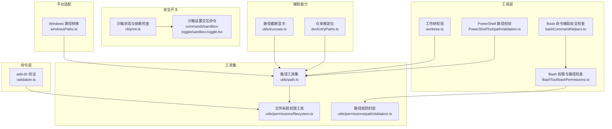

图表来源
- [validation.ts:45-93](file://src/commands/add-dir/validation.ts#L45-L93)
- [worktree.ts:66-87](file://src/utils/worktree.ts#L66-L87)
- [path.ts:132-140](file://src/utils/path.ts#L132-L140)
- [filesystem.ts:703-737](file://src/utils/permissions/filesystem.ts#L703-L737)
- [pathValidation.ts:10-120](file://src/utils/permissions/pathValidation.ts#L10-L120)
- [bashPermissions.ts:76-210](file://src/tools/BashTool/bashPermissions.ts#L76-L210)
- [bashCommandHelpers.ts:48-48](file://src/tools/BashTool/bashCommandHelpers.ts#L48-L48)
- [windowsPaths.ts:147-173](file://src/utils/windowsPaths.ts#L147-L173)
- [print.ts:598-626](file://src/cli/print.ts#L598-L626)
- [sandbox-toggle.tsx:22-58](file://src/commands/sandbox-toggle/sandbox-toggle.tsx#L22-L58)
- [truncate.ts:16-37](file://src/utils/truncate.ts#L16-L37)
- [devEntryPaths.ts:13-15](file://src/devEntryPaths.ts#L13-L15)

章节来源
- [validation.ts:45-93](file://src/commands/add-dir/validation.ts#L45-L93)
- [worktree.ts:66-87](file://src/utils/worktree.ts#L66-L87)
- [path.ts:132-140](file://src/utils/path.ts#L132-L140)
- [filesystem.ts:703-737](file://src/utils/permissions/filesystem.ts#L703-L737)
- [pathValidation.ts:10-120](file://src/utils/permissions/pathValidation.ts#L10-L120)
- [bashPermissions.ts:76-210](file://src/tools/BashTool/bashPermissions.ts#L76-L210)
- [bashCommandHelpers.ts:48-48](file://src/tools/BashTool/bashCommandHelpers.ts#L48-L48)
- [windowsPaths.ts:147-173](file://src/utils/windowsPaths.ts#L147-L173)
- [print.ts:598-626](file://src/cli/print.ts#L598-L626)
- [sandbox-toggle.tsx:22-58](file://src/commands/sandbox-toggle/sandbox-toggle.tsx#L22-L58)
- [truncate.ts:16-37](file://src/utils/truncate.ts#L16-L37)
- [devEntryPaths.ts:13-15](file://src/devEntryPaths.ts#L13-L15)

## 核心组件
- 路径规范化与穿越检测
  - 规范化：使用路径连接与分段处理，拒绝空段、保留点段校验，避免绝对前缀被丢弃导致越界
  - 穿越检测：对任意路径进行遍历扫描，识别“..”段或非法字符段
- 绝对/相对路径处理
  - 绝对路径：统一转为规范形式，结合工作目录边界判断
  - 相对路径：基于当前工作目录解析，再进行边界与穿越检测
- 工作目录边界检查
  - 使用“是否位于工作目录内”的判定函数，支持大小写不敏感比较以防止绕过
- 恶意路径检测与危险模式匹配
  - Bash/PowerShell：限制子命令数量、剥离包装后重检、针对特定安全模式进行严格约束
  - 归档解压：对条目路径执行穿越检测，遇风险跳过并记录告警
- 跨平台路径转换
  - POSIX 到 Windows：UNC、cygdrive、/c/... 等格式转换，统一斜杠方向
- 沙箱与安全开关
  - 启用沙箱时进行网络/文件系统限制；若依赖缺失则提示原因或强制失败
- 错误语义化与用户提示
  - 将底层文件系统错误映射为可读消息，区分不存在、权限不足、只读、句柄上限等场景

章节来源
- [worktree.ts:66-87](file://src/utils/worktree.ts#L66-L87)
- [path.ts:132-140](file://src/utils/path.ts#L132-L140)
- [filesystem.ts:703-737](file://src/utils/permissions/filesystem.ts#L703-L737)
- [bashPermissions.ts:76-210](file://src/tools/BashTool/bashPermissions.ts#L76-L210)
- [bashCommandHelpers.ts:48-48](file://src/tools/BashTool/bashCommandHelpers.ts#L48-L48)
- [zip.ts:4-44](file://src/utils/dxt/zip.ts#L4-L44)
- [windowsPaths.ts:147-173](file://src/utils/windowsPaths.ts#L147-L173)
- [print.ts:598-626](file://src/cli/print.ts#L598-L626)

## 架构总览
下图展示从命令到工具集再到平台适配的整体调用链路与职责分工。

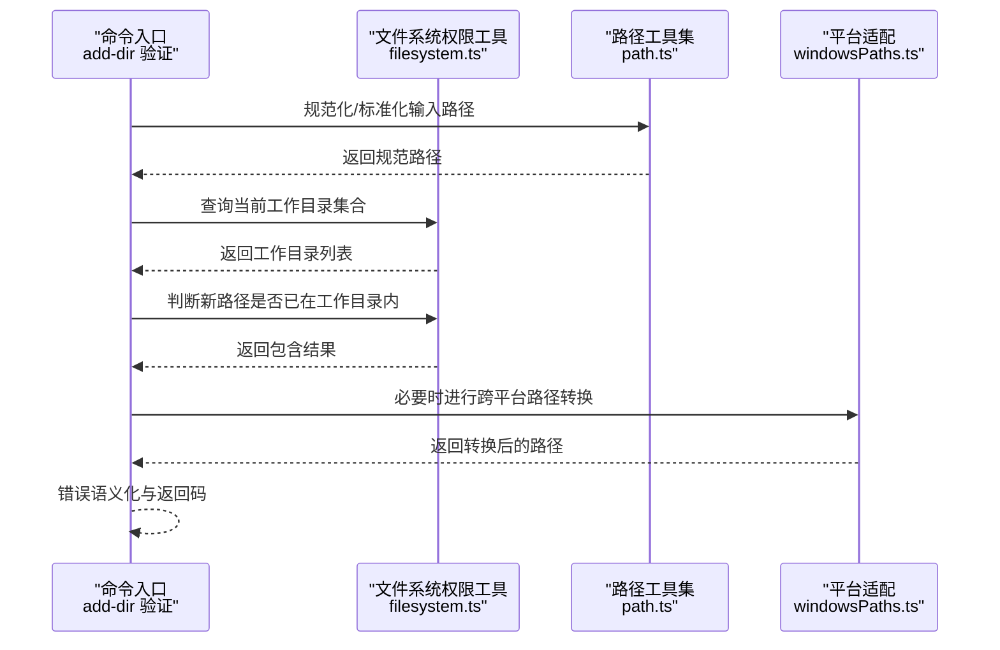

图表来源
- [validation.ts:45-93](file://src/commands/add-dir/validation.ts#L45-L93)
- [filesystem.ts:703-737](file://src/utils/permissions/filesystem.ts#L703-L737)
- [path.ts:132-140](file://src/utils/path.ts#L132-L140)
- [windowsPaths.ts:147-173](file://src/utils/windowsPaths.ts#L147-L173)

## 详细组件分析

### 新增工作目录路径验证（命令层）
- 设计要点
  - 单次系统调用确认目标路径存在且为目录
  - 对常见不可见错误码进行“视为未找到”的语义化处理，避免启动崩溃
  - 在权限上下文中查询当前工作目录集合，逐个比对是否已处于某工作目录内
  - 成功时仅返回规范路径，便于后续流程复用
- 关键流程

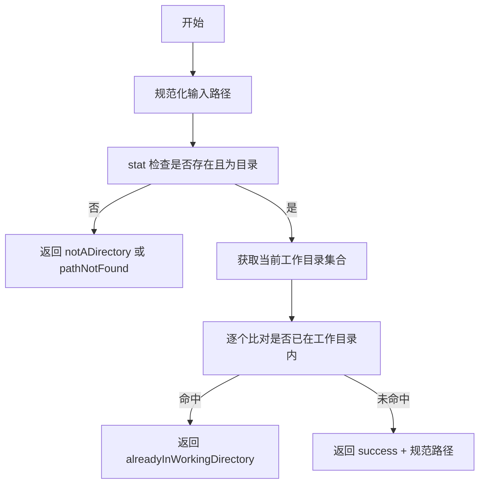

图表来源
- [validation.ts:45-93](file://src/commands/add-dir/validation.ts#L45-L93)

章节来源
- [validation.ts:45-93](file://src/commands/add-dir/validation.ts#L45-L93)

### 工作树名称安全校验（工具层）
- 设计要点
  - 限定最大长度，防止异常输入
  - 分段校验：拒绝“.”、“..”，仅允许字母、数字、点、下划线、短横线
  - 通过 path.join 的特性规避“..”逃逸与绝对路径前缀丢失
- 关键流程

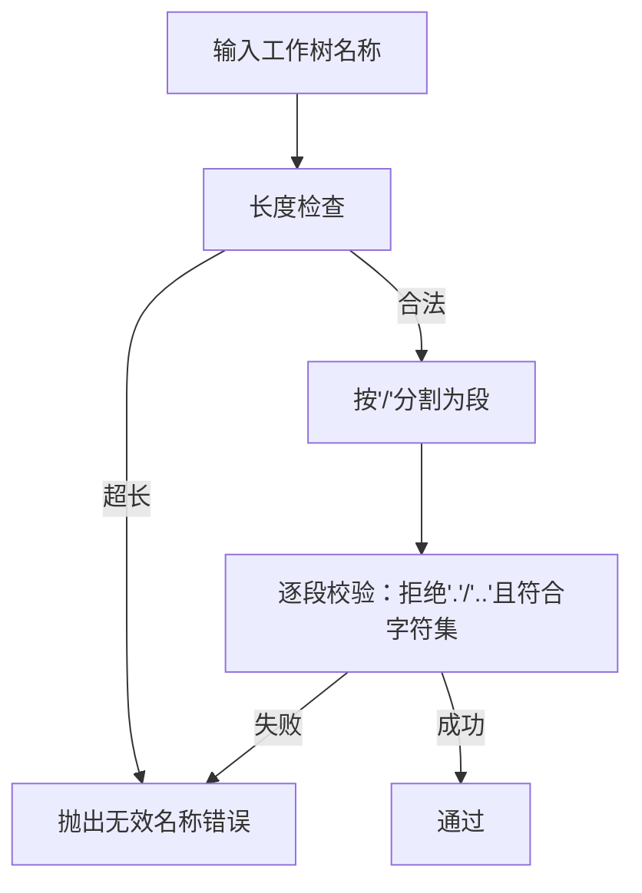

图表来源
- [worktree.ts:66-87](file://src/utils/worktree.ts#L66-L87)

章节来源
- [worktree.ts:66-87](file://src/utils/worktree.ts#L66-L87)

### PowerShell/归档路径穿越检测（工具层）
- 设计要点
  - 归档解压前对每个条目路径执行穿越检测，发现风险即跳过并记录告警
  - PowerShell 路径校验在规范化后进行穿越检测
- 关键流程

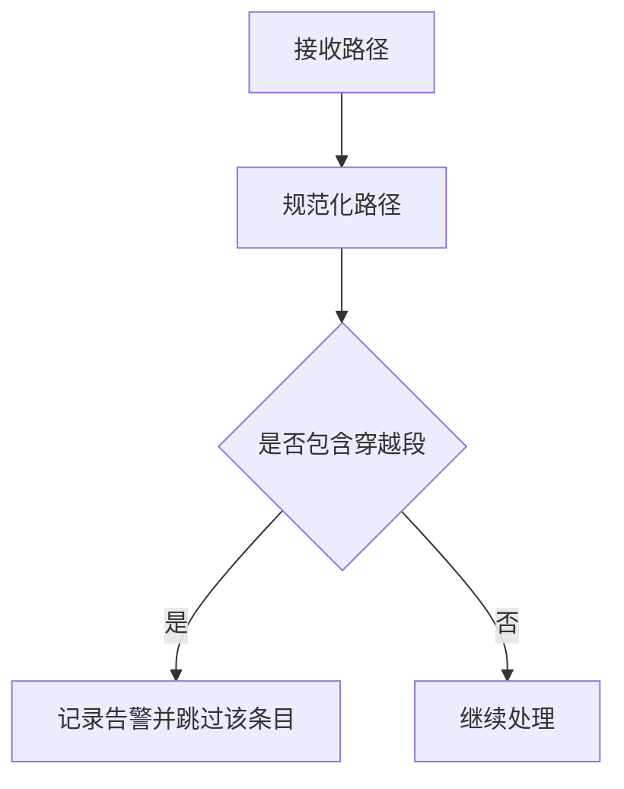

图表来源
- [zip.ts:4-44](file://src/utils/dxt/zip.ts#L4-L44)
- [path.ts:132-140](file://src/utils/path.ts#L132-L140)

章节来源
- [zip.ts:4-44](file://src/utils/dxt/zip.ts#L4-L44)
- [path.ts:132-140](file://src/utils/path.ts#L132-L140)

### Bash 工具安全路径检查（工具层）
- 设计要点
  - 子命令数量上限，防止滥用
  - 包装器剥离后重检基础命令，确保路径验证不被绕过
  - 特定安全模式下严格限制危险组合
- 关键流程

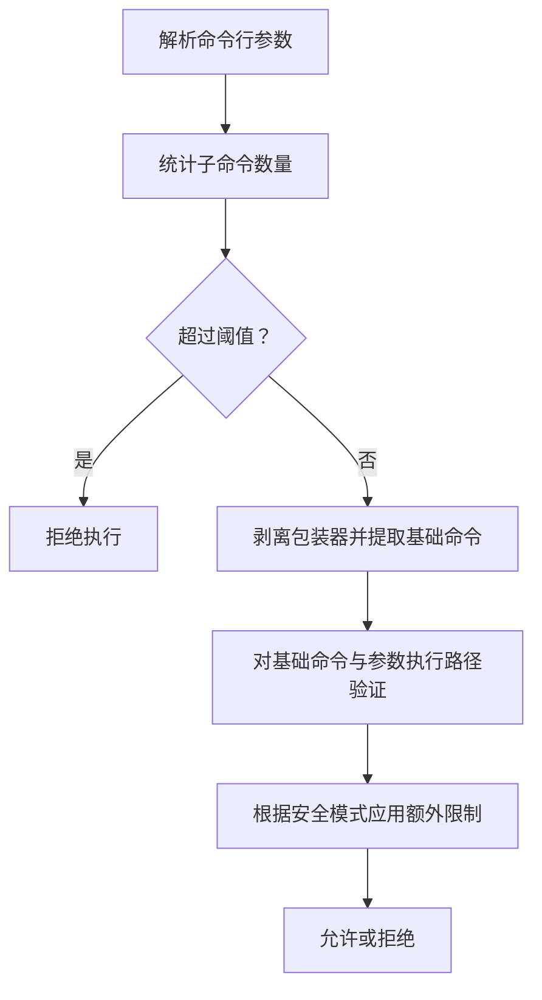

图表来源
- [bashPermissions.ts:76-210](file://src/tools/BashTool/bashPermissions.ts#L76-L210)
- [bashPermissions.ts:530-544](file://src/tools/BashTool/bashPermissions.ts#L530-L544)
- [bashPermissions.ts:680-680](file://src/tools/BashTool/bashPermissions.ts#L680-L680)

章节来源
- [bashPermissions.ts:76-210](file://src/tools/BashTool/bashPermissions.ts#L76-L210)
- [bashPermissions.ts:530-544](file://src/tools/BashTool/bashPermissions.ts#L530-L544)
- [bashPermissions.ts:680-680](file://src/tools/BashTool/bashPermissions.ts#L680-L680)

### Bash 命令辅助安全检查（工具层）
- 设计要点
  - 防止通过管道在 cd+git 组合中绕过裸仓库监控等安全检查
- 关键流程

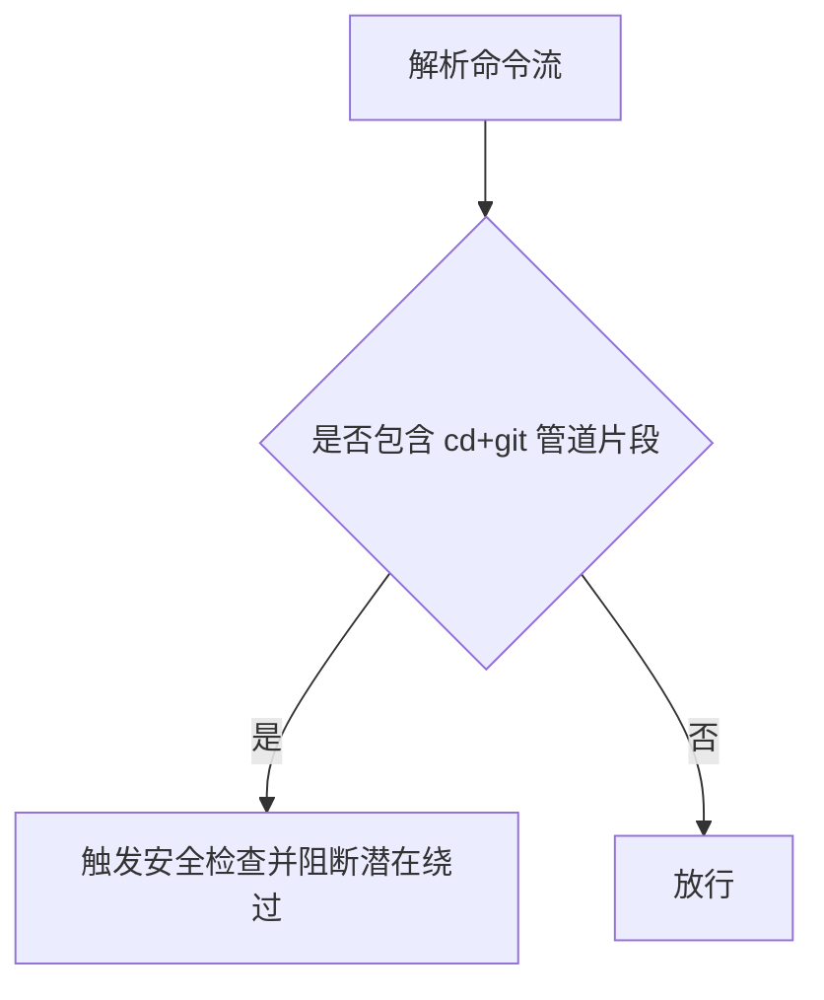

图表来源
- [bashCommandHelpers.ts:48-48](file://src/tools/BashTool/bashCommandHelpers.ts#L48-L48)

章节来源
- [bashCommandHelpers.ts:48-48](file://src/tools/BashTool/bashCommandHelpers.ts#L48-L48)

### 跨平台路径转换（平台适配）
- 设计要点
  - 支持 UNC、cygdrive、/c/... 等多种 POSIX 到 Windows 路径转换
  - 使用纯 JS 实现并带缓存，提升重复转换性能
- 关键流程

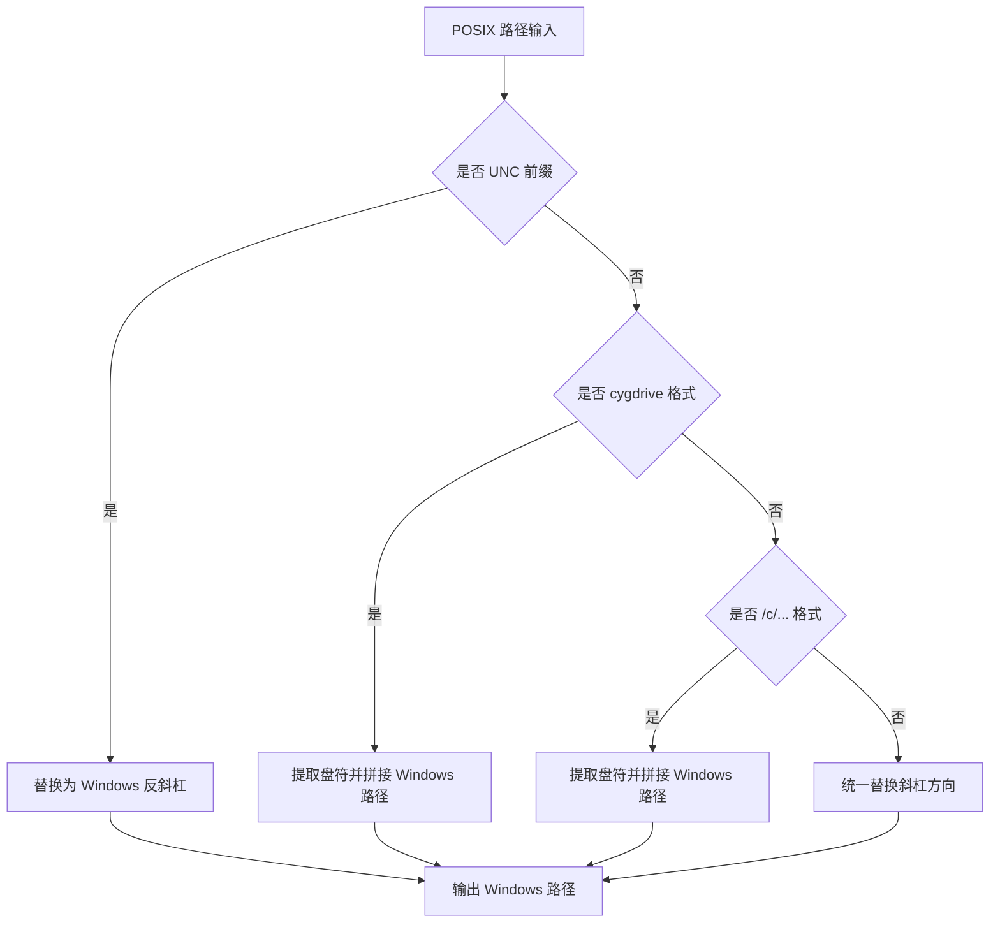

图表来源
- [windowsPaths.ts:147-173](file://src/utils/windowsPaths.ts#L147-L173)

章节来源
- [windowsPaths.ts:147-173](file://src/utils/windowsPaths.ts#L147-L173)

### 沙箱与安全开关（安全控制）
- 设计要点
  - 启动时检查沙箱依赖与平台策略，必要时强制失败或警告降级
  - 提供交互式命令用于查看/修改沙箱设置
- 关键流程

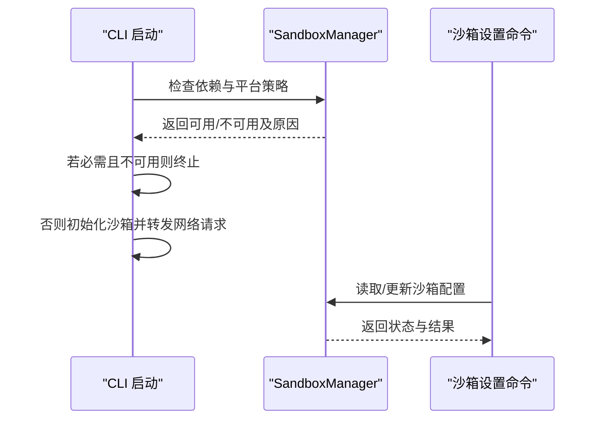

图表来源
- [print.ts:598-626](file://src/cli/print.ts#L598-L626)
- [sandbox-toggle.tsx:22-58](file://src/commands/sandbox-toggle/sandbox-toggle.tsx#L22-L58)

章节来源
- [print.ts:598-626](file://src/cli/print.ts#L598-L626)
- [sandbox-toggle.tsx:22-58](file://src/commands/sandbox-toggle/sandbox-toggle.tsx#L22-L58)

### 路径截断显示与仓库根定位（辅助能力）
- 设计要点
  - 终端宽度感知的路径中间截断，保留目录上下文与文件名
  - 基于入口文件与模块 URL 推导仓库根，限定扫描范围
- 关键流程

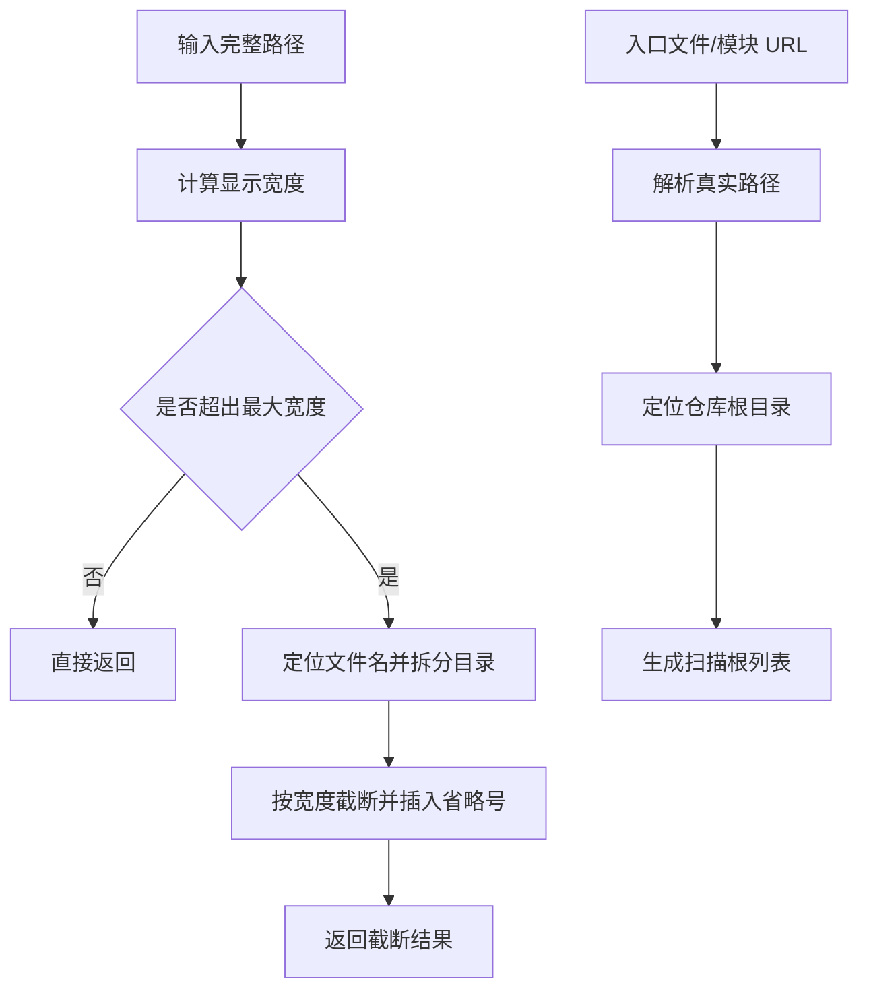

图表来源
- [truncate.ts:16-37](file://src/utils/truncate.ts#L16-L37)
- [devEntryPaths.ts:13-15](file://src/devEntryPaths.ts#L13-L15)

章节来源
- [truncate.ts:16-37](file://src/utils/truncate.ts#L16-L37)
- [devEntryPaths.ts:13-15](file://src/devEntryPaths.ts#L13-L15)

## 依赖关系分析
- 组件耦合
  - 命令层依赖文件系统权限工具与路径工具集，形成“命令—权限—路径”的清晰分层
  - 工具层（Bash/PowerShell）依赖路径规则封装与工作目录判定
  - 平台适配独立于业务逻辑，仅提供转换服务
- 外部依赖
  - Node.js 文件系统 API 与错误码约定
  - 沙箱运行时（外部包）提供安全隔离与权限询问通道

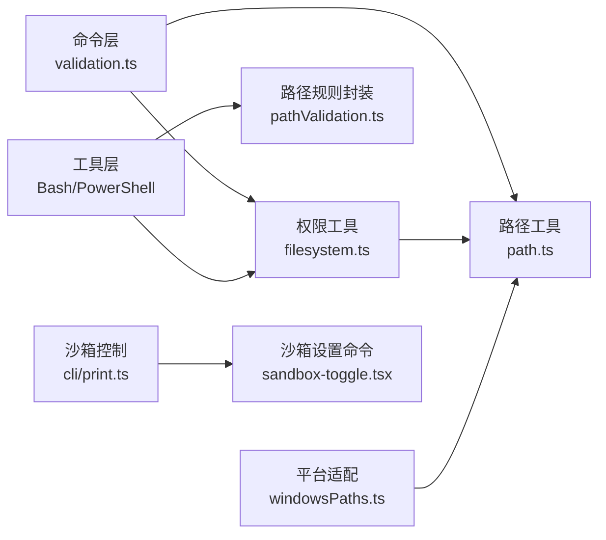

图表来源
- [validation.ts:45-93](file://src/commands/add-dir/validation.ts#L45-L93)
- [filesystem.ts:703-737](file://src/utils/permissions/filesystem.ts#L703-L737)
- [path.ts:132-140](file://src/utils/path.ts#L132-L140)
- [pathValidation.ts:10-120](file://src/utils/permissions/pathValidation.ts#L10-L120)
- [windowsPaths.ts:147-173](file://src/utils/windowsPaths.ts#L147-L173)
- [print.ts:598-626](file://src/cli/print.ts#L598-L626)
- [sandbox-toggle.tsx:22-58](file://src/commands/sandbox-toggle/sandbox-toggle.tsx#L22-L58)

章节来源
- [validation.ts:45-93](file://src/commands/add-dir/validation.ts#L45-L93)
- [filesystem.ts:703-737](file://src/utils/permissions/filesystem.ts#L703-L737)
- [path.ts:132-140](file://src/utils/path.ts#L132-L140)
- [pathValidation.ts:10-120](file://src/utils/permissions/pathValidation.ts#L10-L120)
- [windowsPaths.ts:147-173](file://src/utils/windowsPaths.ts#L147-L173)
- [print.ts:598-626](file://src/cli/print.ts#L598-L626)
- [sandbox-toggle.tsx:22-58](file://src/commands/sandbox-toggle/sandbox-toggle.tsx#L22-L58)

## 性能考量
- I/O 与事件循环
  - 命令层在启动阶段采用异步 I/O 并让出事件循环，避免阻塞
- 缓存与去重
  - 跨平台路径转换使用 LRU 缓存，减少重复转换开销
- 规则预编译与快速失败
  - 路径穿越检测与工作目录包含判断尽量早失败，减少后续处理成本
- 建议
  - 在高频路径场景中优先复用已规范化结果
  - 对大规模批量操作，合并 I/O 请求并延迟非关键检查

章节来源
- [print.ts:1750-1753](file://src/cli/print.ts#L1750-L1753)
- [windowsPaths.ts:147-173](file://src/utils/windowsPaths.ts#L147-L173)

## 故障排查指南
- 常见问题与定位
  - “路径不存在/不是目录”：检查输入是否为绝对路径、权限是否足够、是否存在符号链接陷阱
  - “已在工作目录内”：确认是否重复添加、是否大小写不敏感导致的误判
  - “权限不足/只读/句柄上限”：查看底层错误码映射，调整权限或释放资源
  - “沙箱不可用”：根据原因提示安装依赖或调整策略
- 自检清单
  - 是否对所有输入路径执行了规范化与穿越检测
  - 是否在权限上下文中进行工作目录包含判断
  - 是否在跨平台场景下进行了路径转换
  - 是否对高危工具（Bash/PowerShell）启用了安全模式与数量限制
  - 是否对归档解压等操作执行了条目级穿越检测
- 修复建议
  - 对外部输入进行白名单过滤与长度限制
  - 在边界处增加幂等性检查，避免重复添加
  - 对高危操作引入二次确认与审计日志
  - 在 CI/CD 中加入安全扫描与回归测试

章节来源
- [validation.ts:45-93](file://src/commands/add-dir/validation.ts#L45-L93)
- [filesystem.ts:703-737](file://src/utils/permissions/filesystem.ts#L703-L737)
- [path.ts:132-140](file://src/utils/path.ts#L132-L140)
- [bashPermissions.ts:76-210](file://src/tools/BashTool/bashPermissions.ts#L76-L210)
- [zip.ts:4-44](file://src/utils/dxt/zip.ts#L4-L44)
- [print.ts:598-626](file://src/cli/print.ts#L598-L626)

## 结论
该系统通过“命令层—工具层—工具集—平台适配—安全开关”的分层设计，实现了从输入到执行的全链路路径安全控制。其核心在于：
- 明确的路径规范化与穿越检测
- 基于工作目录的边界控制与大小写不敏感防护
- 针对高危工具的严格规则与包装器剥离重检
- 跨平台路径转换与沙箱依赖的健壮性保障
建议在实际工程中遵循“最小授权、快速失败、可观测”的原则，持续完善规则与监控。

## 附录
- 配置方法
  - 沙箱相关：通过交互命令查看/修改沙箱设置；根据依赖检查结果决定启用策略
  - 工作树命名：遵循字符集与长度限制，避免使用“.”、“..”
  - Bash 安全：合理设置子命令数量上限与安全模式
- 自定义规则开发
  - 在路径规则封装中扩展匹配模式与拦截条件
  - 在工具层增加新的安全检查点（如新增工具类型）
- 安全审查参考
  - 参考安全审查命令中的分类与排除项，确保代码变更符合安全基线

章节来源
- [sandbox-toggle.tsx:22-58](file://src/commands/sandbox-toggle/sandbox-toggle.tsx#L22-L58)
- [worktree.ts:66-87](file://src/utils/worktree.ts#L66-L87)
- [bashPermissions.ts:76-210](file://src/tools/BashTool/bashPermissions.ts#L76-L210)
- [security-review.ts:43-154](file://src/commands/security-review.ts#L43-L154)