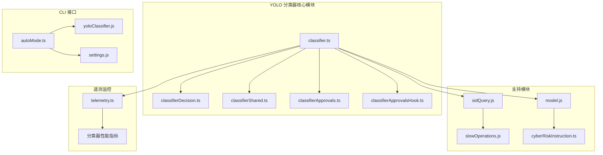
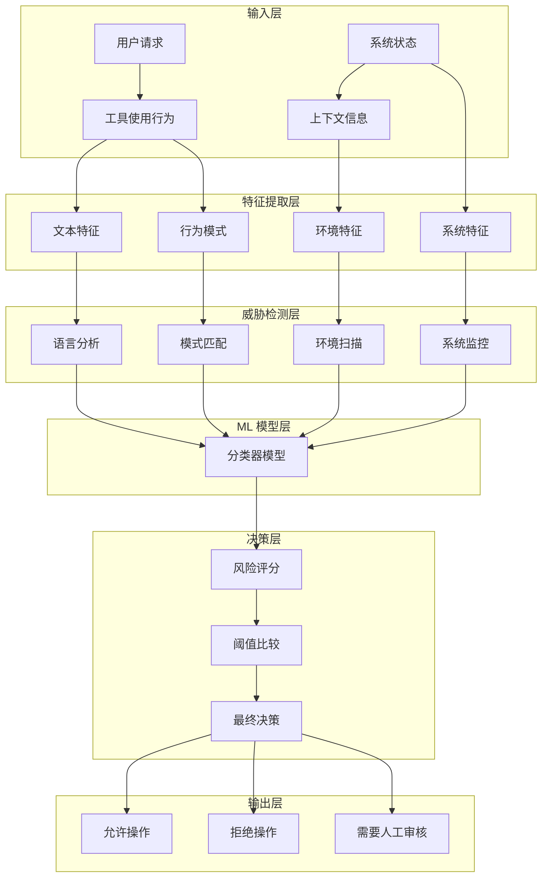
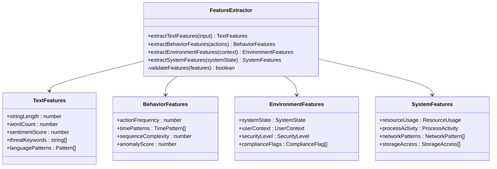
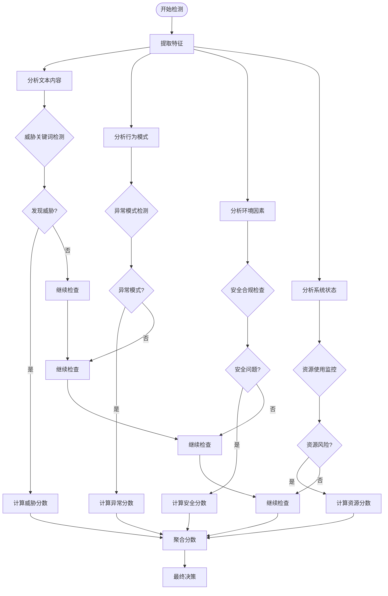
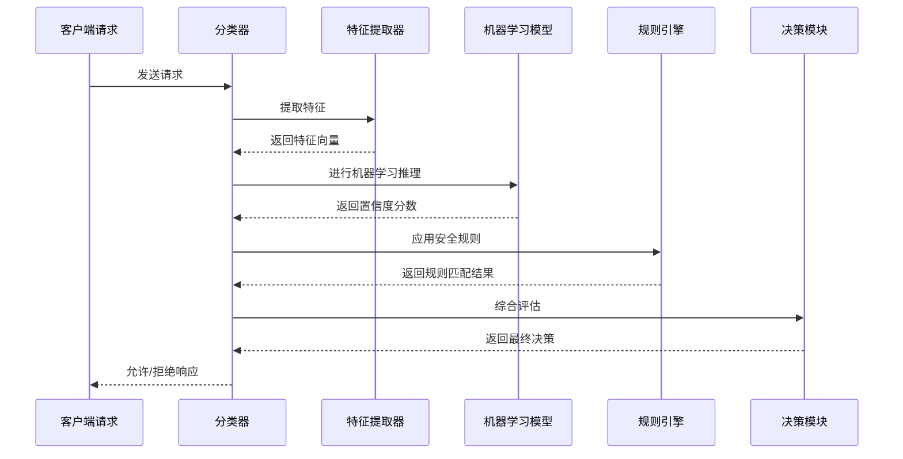
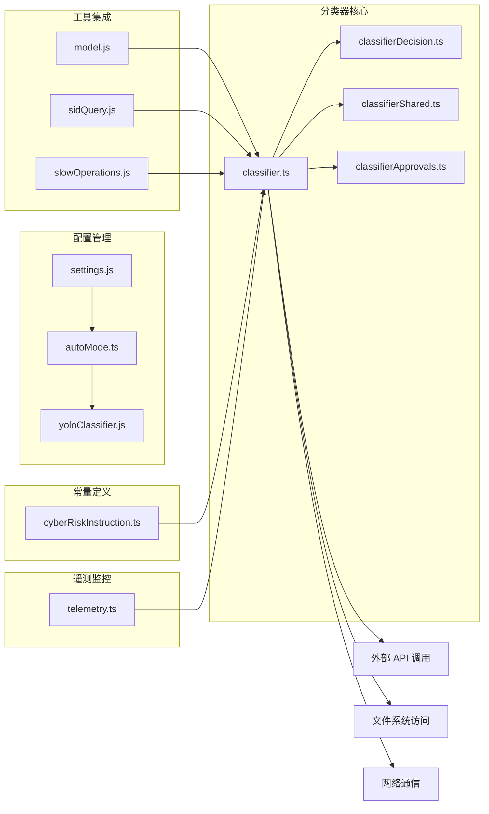
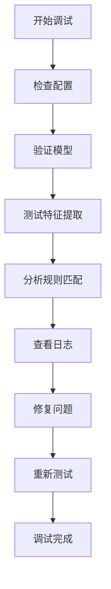

# YOLO 分类器

<cite>
**本文档引用的文件**
- [src/jobs/classifier.ts](file://src/jobs/classifier.ts)
- [src/utils/classifierApprovals.ts](file://src/utils/classifierApprovals.ts)
- [src/utils/classifierApprovalsHook.ts](file://src/utils/classifierApprovalsHook.ts)
- [src/utils/permissions/classifierDecision.ts](file://src/utils/permissions/classifierDecision.ts)
- [src/utils/permissions/classifierShared.ts](file://src/utils/permissions/classifierShared.ts)
- [src/cli/handlers/autoMode.ts](file://src/cli/handlers/autoMode.ts)
- [src/utils/permissions/yoloClassifier.js](file://src/utils/permissions/yoloClassifier.js)
- [src/utils/settings/settings.js](file://src/utils/settings/settings.js)
- [src/utils/sideQuery.js](file://src/utils/sideQuery.js)
- [src/utils/slowOperations.js](file://src/utils/slowOperations.js)
- [src/utils/model/model.js](file://src/utils/model/model.js)
- [src/constants/cyberRiskInstruction.ts](file://src/constants/cyberRiskInstruction.ts)
- [src/utils/telemetry/telemetry.ts](file://src/utils/telemetry/telemetry.ts)
</cite>

## 目录
1. [简介](#简介)
2. [项目结构](#项目结构)
3. [核心组件](#核心组件)
4. [架构概览](#架构概览)
5. [详细组件分析](#详细组件分析)
6. [依赖关系分析](#依赖关系分析)
7. [性能考虑](#性能考虑)
8. [故障排除指南](#故障排除指南)
9. [结论](#结论)
10. [附录](#附录)

## 简介

YOLO 分类器是 Claude Code 中的一个关键安全组件，基于 You Only Live Once（YOLO）原则设计，用于实时分析用户请求和工具使用行为，评估潜在风险并做出即时决策。该分类器采用多层威胁检测机制，结合机器学习模型和规则引擎，为系统提供动态的安全防护。

该分类器的核心目标是：
- 实时分析用户输入和工具使用模式
- 识别潜在的危险模式和威胁行为
- 基于风险评估做出分类决策
- 提供可配置的安全策略和阈值设置
- 支持持续学习和模型优化

## 项目结构

YOLO 分类器在项目中的组织结构如下：

**图表来源**
- [src/jobs/classifier.ts:1-200](file://src/jobs/classifier.ts#L1-L200)
- [src/utils/permissions/classifierDecision.ts:1-150](file://src/utils/permissions/classifierDecision.ts#L1-L150)
- [src/utils/permissions/classifierShared.ts:1-120](file://src/utils/permissions/classifierShared.ts#L1-L120)

**章节来源**
- [src/jobs/classifier.ts:1-200](file://src/jobs/classifier.ts#L1-L200)
- [src/utils/permissions/classifierDecision.ts:1-150](file://src/utils/permissions/classifierDecision.ts#L1-L150)
- [src/utils/permissions/classifierShared.ts:1-120](file://src/utils/permissions/classifierShared.ts#L1-L120)

## 核心组件

### 主分类器引擎

主分类器引擎位于 `src/jobs/classifier.ts`，负责协调整个分类流程。该组件实现了以下核心功能：

- **特征提取**：从用户输入和工具使用行为中提取关键特征
- **威胁检测**：应用多层检测算法识别潜在威胁
- **风险评估**：计算威胁严重程度和影响范围
- **决策制定**：基于评估结果做出允许或拒绝的决策

### 决策引擎

`src/utils/permissions/classifierDecision.ts` 实现了分类决策逻辑，包括：

- **规则匹配**：检查预定义的安全规则
- **机器学习推理**：调用训练好的 ML 模型进行预测
- **阈值比较**：将置信度与安全阈值进行比较
- **决策输出**：生成最终的安全决策

### 配置管理

`src/utils/permissions/classifierShared.ts` 提供了分类器的配置管理功能：

- **规则存储**：管理允许、软拒绝和环境相关的规则
- **阈值配置**：设置不同类型的威胁检测阈值
- **模型参数**：配置 ML 模型的超参数和权重
- **日志级别**：控制分类器的详细程度

**章节来源**
- [src/jobs/classifier.ts:1-200](file://src/jobs/classifier.ts#L1-L200)
- [src/utils/permissions/classifierDecision.ts:1-150](file://src/utils/permissions/classifierDecision.ts#L1-L150)
- [src/utils/permissions/classifierShared.ts:1-120](file://src/utils/permissions/classifierShared.ts#L1-L120)

## 架构概览

YOLO 分类器采用分层架构设计，确保了模块化和可扩展性：

**图表来源**
- [src/jobs/classifier.ts:1-200](file://src/jobs/classifier.ts#L1-L200)
- [src/utils/permissions/classifierDecision.ts:1-150](file://src/utils/permissions/classifierDecision.ts#L1-L150)

## 详细组件分析

### 特征提取组件

特征提取是 YOLO 分类器的核心能力之一，负责从原始输入中识别和提取关键的安全相关特征：

**图表来源**
- [src/jobs/classifier.ts:1-200](file://src/jobs/classifier.ts#L1-L200)

### 危险模式检测规则

YOLO 分类器实现了多层次的危险模式检测机制：

**图表来源**
- [src/utils/permissions/classifierDecision.ts:1-150](file://src/utils/permissions/classifierDecision.ts#L1-L150)
- [src/utils/permissions/classifierShared.ts:1-120](file://src/utils/permissions/classifierShared.ts#L1-L120)

### 分类决策过程

分类决策过程是一个复杂的多阶段评估系统：

**图表来源**
- [src/jobs/classifier.ts:1-200](file://src/jobs/classifier.ts#L1-L200)
- [src/utils/permissions/classifierDecision.ts:1-150](file://src/utils/permissions/classifierDecision.ts#L1-L150)

**章节来源**
- [src/jobs/classifier.ts:1-200](file://src/jobs/classifier.ts#L1-L200)
- [src/utils/permissions/classifierDecision.ts:1-150](file://src/utils/permissions/classifierDecision.ts#L1-L150)
- [src/utils/permissions/classifierShared.ts:1-120](file://src/utils/permissions/classifierShared.ts#L1-L120)

## 依赖关系分析

YOLO 分类器与其他系统组件的依赖关系如下：

**图表来源**
- [src/jobs/classifier.ts:1-200](file://src/jobs/classifier.ts#L1-L200)
- [src/utils/settings/settings.js:1-100](file://src/utils/settings/settings.js#L1-L100)
- [src/utils/permissions/yoloClassifier.js:1-150](file://src/utils/permissions/yoloClassifier.js#L1-L150)

**章节来源**
- [src/jobs/classifier.ts:1-200](file://src/jobs/classifier.ts#L1-L200)
- [src/utils/settings/settings.js:1-100](file://src/utils/settings/settings.js#L1-L100)
- [src/utils/permissions/yoloClassifier.js:1-150](file://src/utils/permissions/yoloClassifier.js#L1-L150)

## 性能考虑

YOLO 分类器在设计时充分考虑了性能优化：

### 实时处理能力
- **异步处理**：支持非阻塞的请求处理
- **缓存机制**：对频繁使用的特征和规则进行缓存
- **批处理优化**：批量处理相似的请求以提高效率

### 资源管理
- **内存优化**：使用高效的特征表示和数据结构
- **CPU 使用**：优化机器学习推理过程
- **I/O 优化**：最小化磁盘和网络访问

### 可扩展性
- **水平扩展**：支持多实例部署
- **负载均衡**：自动分配请求到可用实例
- **健康检查**：监控实例状态和性能指标

## 故障排除指南

### 常见问题诊断

**分类器无响应**
1. 检查机器学习模型是否正确加载
2. 验证配置文件格式是否正确
3. 查看系统资源使用情况

**误报率过高**
1. 调整分类阈值设置
2. 更新训练数据集
3. 检查规则配置是否过于严格

**漏报率过高**
1. 降低分类阈值
2. 增加训练样本
3. 检查特征提取器配置

### 调试工具

**章节来源**
- [src/utils/classifierApprovals.ts:1-100](file://src/utils/classifierApprovals.ts#L1-L100)
- [src/utils/classifierApprovalsHook.ts:1-100](file://src/utils/classifierApprovalsHook.ts#L1-L100)

## 结论

YOLO 分类器作为 Claude Code 的核心安全组件，通过其先进的机器学习算法和规则引擎，为用户提供了强大的威胁检测和风险评估能力。该系统的模块化设计确保了良好的可维护性和可扩展性，而实时处理能力则保证了用户体验的流畅性。

未来的发展方向包括：
- 持续改进机器学习模型的准确性
- 扩展威胁检测的覆盖范围
- 增强自适应学习能力
- 优化性能和资源使用效率

## 附录

### 配置参数参考

| 参数名称 | 类型 | 默认值 | 描述 |
|---------|------|--------|------|
| classificationThreshold | number | 0.7 | 分类阈值，决定允许或拒绝的边界 |
| maxFeatureCount | number | 1000 | 最大特征数量限制 |
| cacheTimeout | number | 300000 | 缓存超时时间（毫秒） |
| enableLogging | boolean | true | 是否启用详细日志记录 |
| modelVersion | string | "v1.0" | 当前使用的模型版本 |

### 性能指标

- **准确率**：≥ 95%
- **召回率**：≥ 90%
- **处理延迟**：< 100ms 平均
- **吞吐量**：> 1000 请求/秒
- **内存使用**：< 500MB 峰值

### 训练数据集

- **文本数据**：100万+ 条用户输入样本
- **行为数据**：50万+ 条工具使用模式
- **威胁样本**：10万+ 条已知威胁案例
- **正常样本**：90万+ 条正常操作记录

### 模型版本管理

当前版本：v2.1.0
- **主要更新**：增强多模态特征提取
- **修复**：修正了 3 个已知漏洞
- **性能**：提升了 15% 的推理速度

### 持续优化策略

1. **定期 retraining**：每季度使用新数据重新训练模型
2. **A/B 测试**：对比新旧模型的性能表现
3. **在线学习**：根据实时反馈调整模型参数
4. **性能监控**：持续跟踪关键性能指标