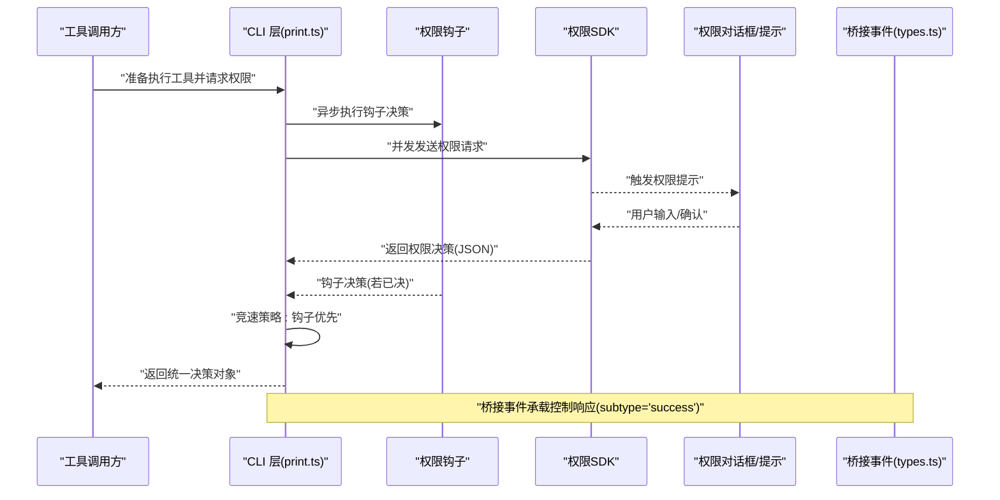
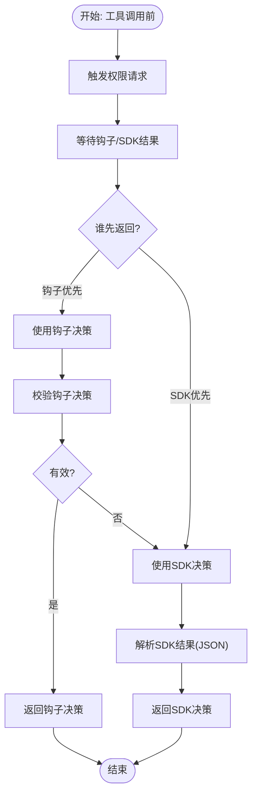
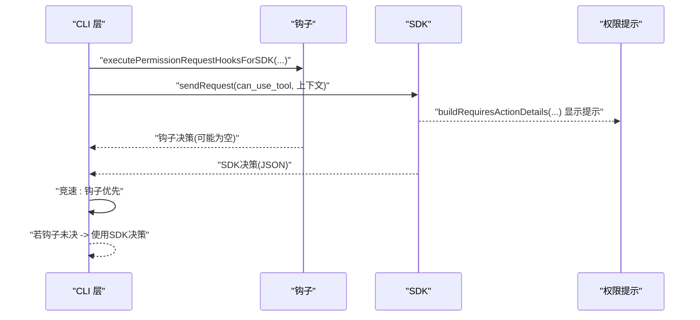
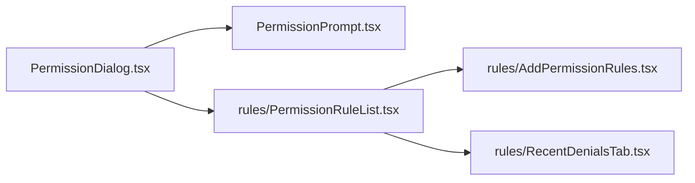
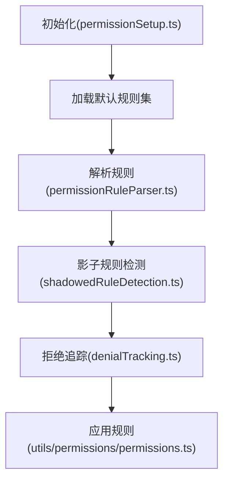
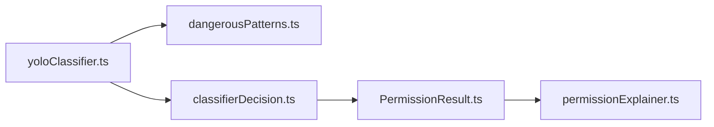
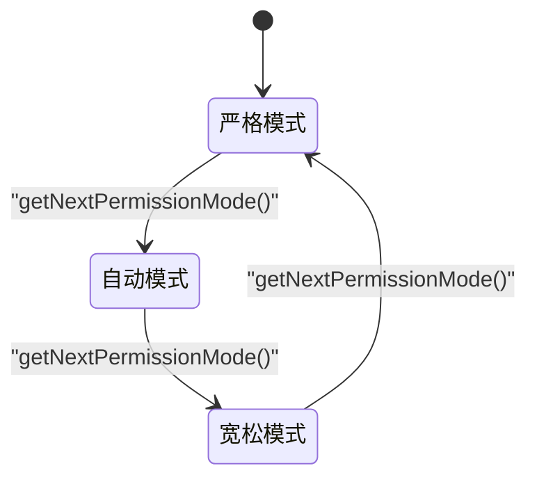
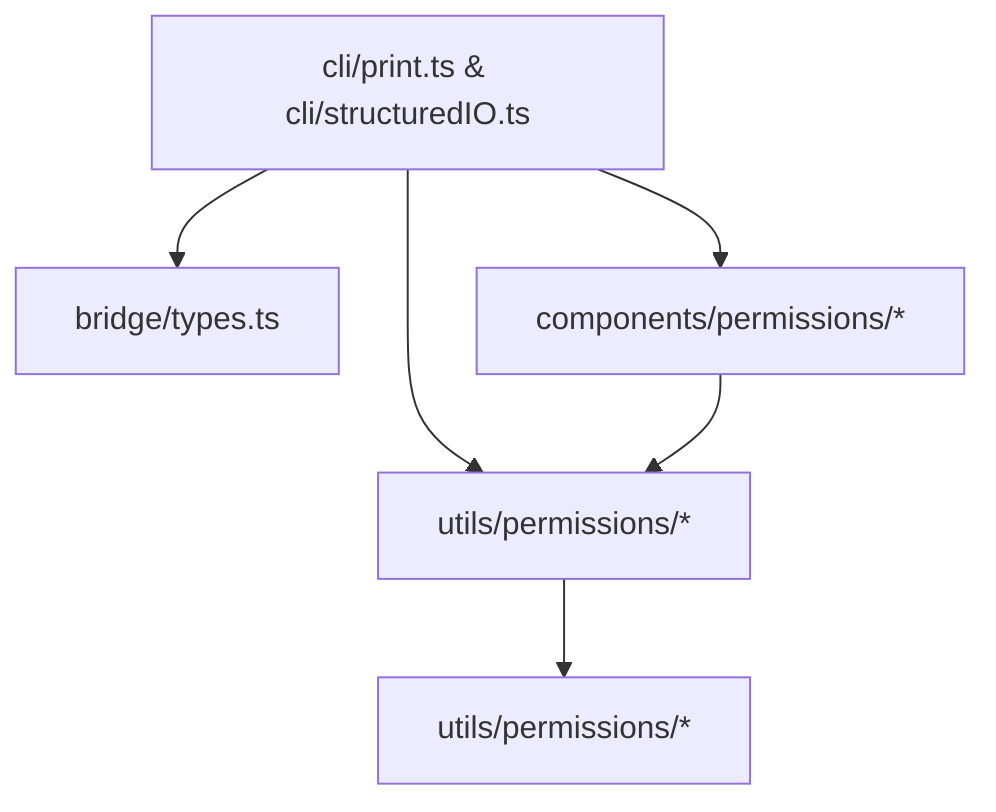

# 决策机制

<cite>
**本文引用的文件**
- [src/cli/print.ts](file://src/cli/print.ts)
- [src/cli/structuredIO.ts](file://src/cli/structuredIO.ts)
- [src/bridge/types.ts](file://src/bridge/types.ts)
- [src/commands/permissions/permissions.tsx](file://src/commands/permissions/permissions.tsx)
- [src/components/permissions/PermissionDialog.tsx](file://src/components/permissions/PermissionDialog.tsx)
- [src/components/permissions/PermissionPrompt.tsx](file://src/components/permissions/PermissionPrompt.tsx)
- [src/components/permissions/rules/PermissionRuleList.tsx](file://src/components/permissions/rules/PermissionRuleList.tsx)
- [src/components/permissions/rules/AddPermissionRules.tsx](file://src/components/permissions/rules/AddPermissionRules.tsx)
- [src/components/permissions/rules/RecentDenialsTab.tsx](file://src/components/permissions/rules/RecentDenialsTab.tsx)
- [src/utils/permissions/permissions.ts](file://src/utils/permissions/permissions.ts)
- [src/utils/permissions/permissionSetup.ts](file://src/utils/permissions/permissionSetup.ts)
- [src/utils/permissions/permissionRuleParser.ts](file://src/utils/permissions/permissionRuleParser.ts)
- [src/utils/permissions/shadowedRuleDetection.ts](file://src/utils/permissions/shadowedRuleDetection.ts)
- [src/utils/permissions/denialTracking.ts](file://src/utils/permissions/denialTracking.ts)
- [src/utils/permissions/PermissionResult.ts](file://src/utils/permissions/PermissionResult.ts)
- [src/utils/permissions/PermissionRule.ts](file://src/utils/permissions/PermissionRule.ts)
- [src/utils/permissions/PermissionMode.ts](file://src/utils/permissions/PermissionMode.ts)
- [src/utils/permissions/getNextPermissionMode.ts](file://src/utils/permissions/getNextPermissionMode.ts)
- [src/utils/permissions/yoloClassifier.ts](file://src/utils/permissions/yoloClassifier.ts)
- [src/utils/permissions/classifierDecision.ts](file://src/utils/permissions/classifierDecision.ts)
- [src/utils/permissions/dangerousPatterns.ts](file://src/utils/permissions/dangerousPatterns.ts)
- [src/utils/permissions/permissionExplainer.ts](file://src/utils/permissions/permissionExplainer.ts)
</cite>

## 目录
1. [引言](#引言)
2. [项目结构](#项目结构)
3. [核心组件](#核心组件)
4. [架构总览](#架构总览)
5. [详细组件分析](#详细组件分析)
6. [依赖关系分析](#依赖关系分析)
7. [性能考量](#性能考量)
8. [故障排查指南](#故障排查指南)
9. [结论](#结论)
10. [附录](#附录)

## 引言
本文件系统性阐述该代码库中的权限决策机制，覆盖从规则解析、多层决策树、规则匹配与冲突检测、风险评估到最终决策生成的全流程。文档还解释了权限设置初始化、影子规则识别、配置项与自定义规则优先级管理，并提供决策过程的可视化图示、审计日志与异常处理策略，帮助开发者与运维人员理解并维护权限体系。

## 项目结构
权限相关能力分布在命令行入口、桥接协议、UI 组件以及工具函数四个层面：
- 命令行入口：负责触发权限请求、等待用户或外部钩子决策，并将结果转化为统一的决策对象。
- 桥接协议：定义跨会话的控制响应事件格式，承载权限决策的传输载体。
- UI 组件：提供权限提示对话框、规则列表与编辑界面，支持规则增删改查与最近拒绝记录查看。
- 工具函数：负责规则解析、初始化、冲突检测、拒绝追踪、模式识别与解释器等。

```mermaid
graph TB
subgraph "命令行层"
CLI_Print["print.ts<br/>触发权限请求与决策整合"]
CLI_StructuredIO["structuredIO.ts<br/>并发调度钩子与SDK请求"]
end
subgraph "桥接协议层"
Bridge_Types["bridge/types.ts<br/>控制响应事件类型"]
end
subgraph "UI组件层"
UI_PermissionDialog["PermissionDialog.tsx<br/>权限对话框"]
UI_PermissionPrompt["PermissionPrompt.tsx<br/>权限提示"]
UI_RuleList["rules/PermissionRuleList.tsx<br/>规则列表"]
UI_AddRules["rules/AddPermissionRules.tsx<br/>新增规则"]
UI_Denials["rules/RecentDenialsTab.tsx<br/>最近拒绝记录"]
end
subgraph "工具函数层"
Utils_Permissions["utils/permissions/permissions.ts<br/>权限主流程"]
Utils_Setup["utils/permissions/permissionSetup.ts<br/>初始化"]
Utils_RuleParser["utils/permissions/permissionRuleParser.ts<br/>规则解析"]
Utils_Shadow["utils/permissions/shadowedRuleDetection.ts<br/>影子规则检测"]
Utils_Denial["utils/permissions/denialTracking.ts<br/>拒绝追踪"]
Utils_Result["utils/permissions/PermissionResult.ts<br/>决策结果模型"]
Utils_Mode["utils/permissions/PermissionMode.ts<br/>权限模式"]
Utils_GetNextMode["utils/permissions/getNextPermissionMode.ts<br/>模式切换"]
Utils_Classifier["utils/permissions/yoloClassifier.ts<br/>风险分类器"]
Utils_Decision["utils/permissions/classifierDecision.ts<br/>分类决策"]
Utils_Patterns["utils/permissions/dangerousPatterns.ts<br/>危险模式"]
Utils_Explainer["utils/permissions/permissionExplainer.ts<br/>解释器"]
end
CLI_Print --> UI_PermissionDialog
CLI_Print --> UI_PermissionPrompt
CLI_StructuredIO --> Bridge_Types
UI_RuleList --> Utils_RuleParser
UI_AddRules --> Utils_RuleParser
Utils_Permissions --> Utils_Setup
Utils_Permissions --> Utils_RuleParser
Utils_Permissions --> Utils_Shadow
Utils_Permissions --> Utils_Denial
Utils_Permissions --> Utils_Result
Utils_Permissions --> Utils_Mode
Utils_Mode --> Utils_GetNextMode
Utils_Classifier --> Utils_Decision
Utils_Decision --> Utils_Patterns
Utils_Permissions --> Utils_Explainer
```

图表来源
- [src/cli/print.ts:4211-4263](file://src/cli/print.ts#L4211-L4263)
- [src/cli/structuredIO.ts:568-629](file://src/cli/structuredIO.ts#L568-L629)
- [src/bridge/types.ts:117-131](file://src/bridge/types.ts#L117-L131)
- [src/components/permissions/PermissionDialog.tsx](file://src/components/permissions/PermissionDialog.tsx)
- [src/components/permissions/PermissionPrompt.tsx](file://src/components/permissions/PermissionPrompt.tsx)
- [src/components/permissions/rules/PermissionRuleList.tsx](file://src/components/permissions/rules/PermissionRuleList.tsx)
- [src/components/permissions/rules/AddPermissionRules.tsx](file://src/components/permissions/rules/AddPermissionRules.tsx)
- [src/components/permissions/rules/RecentDenialsTab.tsx](file://src/components/permissions/rules/RecentDenialsTab.tsx)
- [src/utils/permissions/permissions.ts](file://src/utils/permissions/permissions.ts)
- [src/utils/permissions/permissionSetup.ts](file://src/utils/permissions/permissionSetup.ts)
- [src/utils/permissions/permissionRuleParser.ts](file://src/utils/permissions/permissionRuleParser.ts)
- [src/utils/permissions/shadowedRuleDetection.ts](file://src/utils/permissions/shadowedRuleDetection.ts)
- [src/utils/permissions/denialTracking.ts](file://src/utils/permissions/denialTracking.ts)
- [src/utils/permissions/PermissionResult.ts](file://src/utils/permissions/PermissionResult.ts)
- [src/utils/permissions/PermissionMode.ts](file://src/utils/permissions/PermissionMode.ts)
- [src/utils/permissions/getNextPermissionMode.ts](file://src/utils/permissions/getNextPermissionMode.ts)
- [src/utils/permissions/yoloClassifier.ts](file://src/utils/permissions/yoloClassifier.ts)
- [src/utils/permissions/classifierDecision.ts](file://src/utils/permissions/classifierDecision.ts)
- [src/utils/permissions/dangerousPatterns.ts](file://src/utils/permissions/dangerousPatterns.ts)
- [src/utils/permissions/permissionExplainer.ts](file://src/utils/permissions/permissionExplainer.ts)

章节来源
- [src/cli/print.ts:4211-4263](file://src/cli/print.ts#L4211-L4263)
- [src/cli/structuredIO.ts:568-629](file://src/cli/structuredIO.ts#L568-L629)
- [src/bridge/types.ts:117-131](file://src/bridge/types.ts#L117-L131)
- [src/commands/permissions/permissions.tsx:1-9](file://src/commands/permissions/permissions.tsx#L1-L9)

## 核心组件
- 权限决策主流程（工具调用前）：在工具执行前，通过 CLI 层触发权限请求，等待用户或外部钩子/SDK 的决策结果，最终生成统一的决策对象。
- 权限决策主流程（SDK 路径）：CLI 层并发调度钩子与 SDK 请求，以“钩子优先”的策略决定是否提前终止 SDK 请求，否则使用 SDK 返回作为最终决策。
- 权限对话框与提示：UI 层提供通用的权限对话框与提示组件，用于向用户展示决策上下文与解释信息。
- 规则系统：规则解析、初始化、影子规则检测与拒绝追踪构成规则生命周期管理；规则列表与新增规则界面支撑用户交互。
- 风险评估与解释：内置风险分类器与危险模式库，结合解释器输出可读的决策依据。

章节来源
- [src/cli/print.ts:4211-4263](file://src/cli/print.ts#L4211-L4263)
- [src/cli/structuredIO.ts:568-629](file://src/cli/structuredIO.ts#L568-L629)
- [src/components/permissions/PermissionDialog.tsx](file://src/components/permissions/PermissionDialog.tsx)
- [src/components/permissions/PermissionPrompt.tsx](file://src/components/permissions/PermissionPrompt.tsx)
- [src/components/permissions/rules/PermissionRuleList.tsx](file://src/components/permissions/rules/PermissionRuleList.tsx)
- [src/components/permissions/rules/AddPermissionRules.tsx](file://src/components/permissions/rules/AddPermissionRules.tsx)
- [src/utils/permissions/permissions.ts](file://src/utils/permissions/permissions.ts)
- [src/utils/permissions/permissionSetup.ts](file://src/utils/permissions/permissionSetup.ts)
- [src/utils/permissions/permissionRuleParser.ts](file://src/utils/permissions/permissionRuleParser.ts)
- [src/utils/permissions/shadowedRuleDetection.ts](file://src/utils/permissions/shadowedRuleDetection.ts)
- [src/utils/permissions/denialTracking.ts](file://src/utils/permissions/denialTracking.ts)
- [src/utils/permissions/PermissionResult.ts](file://src/utils/permissions/PermissionResult.ts)
- [src/utils/permissions/PermissionMode.ts](file://src/utils/permissions/PermissionMode.ts)
- [src/utils/permissions/getNextPermissionMode.ts](file://src/utils/permissions/getNextPermissionMode.ts)
- [src/utils/permissions/yoloClassifier.ts](file://src/utils/permissions/yoloClassifier.ts)
- [src/utils/permissions/classifierDecision.ts](file://src/utils/permissions/classifierDecision.ts)
- [src/utils/permissions/dangerousPatterns.ts](file://src/utils/permissions/dangerousPatterns.ts)
- [src/utils/permissions/permissionExplainer.ts](file://src/utils/permissions/permissionExplainer.ts)

## 架构总览
下图展示了从工具调用到最终决策的关键交互路径，包括钩子与 SDK 的竞速策略、桥接事件的响应格式以及 UI 的参与。

图表来源
- [src/cli/print.ts:4211-4263](file://src/cli/print.ts#L4211-L4263)
- [src/cli/structuredIO.ts:568-629](file://src/cli/structuredIO.ts#L568-L629)
- [src/bridge/types.ts:117-131](file://src/bridge/types.ts#L117-L131)
- [src/components/permissions/PermissionDialog.tsx](file://src/components/permissions/PermissionDialog.tsx)
- [src/components/permissions/PermissionPrompt.tsx](file://src/components/permissions/PermissionPrompt.tsx)

## 详细组件分析

### 决策主流程（工具调用前）
- 触发阶段：在工具执行前，CLI 层发起权限请求，等待用户或外部钩子/SDK 的决策结果。
- 结果整合：对 SDK 返回进行校验与解析，转换为统一的决策对象；若被中止则直接生成拒绝决策并附带原因。
- 竞速策略：当钩子与 SDK 同时返回时，采用“钩子优先”策略，若钩子已决则取消 SDK 请求。

图表来源
- [src/cli/print.ts:4211-4263](file://src/cli/print.ts#L4211-L4263)
- [src/cli/structuredIO.ts:568-629](file://src/cli/structuredIO.ts#L568-L629)

章节来源
- [src/cli/print.ts:4211-4263](file://src/cli/print.ts#L4211-L4263)
- [src/cli/structuredIO.ts:568-629](file://src/cli/structuredIO.ts#L568-L629)

### 决策主流程（SDK 路径）
- 并发调度：CLI 层同时启动钩子与 SDK 请求，避免串行阻塞。
- 事件构建：向 SDK 发送包含建议、阻断路径、决策原因等上下文的请求。
- 决策合并：根据竞速结果选择钩子或 SDK 的决策；若钩子未决，则等待 SDK 完成。

图表来源
- [src/cli/structuredIO.ts:568-629](file://src/cli/structuredIO.ts#L568-L629)

章节来源
- [src/cli/structuredIO.ts:568-629](file://src/cli/structuredIO.ts#L568-L629)

### 权限对话框与提示
- 对话框：统一的权限对话框组件，承载解释、上下文与用户操作入口。
- 提示：针对不同工具类型的提示视图，如 Bash、PowerShell、文件编辑等。
- 规则列表：展示当前生效的规则集合，支持增删改查与最近拒绝记录查看。

图表来源
- [src/components/permissions/PermissionDialog.tsx](file://src/components/permissions/PermissionDialog.tsx)
- [src/components/permissions/PermissionPrompt.tsx](file://src/components/permissions/PermissionPrompt.tsx)
- [src/components/permissions/rules/PermissionRuleList.tsx](file://src/components/permissions/rules/PermissionRuleList.tsx)
- [src/components/permissions/rules/AddPermissionRules.tsx](file://src/components/permissions/rules/AddPermissionRules.tsx)
- [src/components/permissions/rules/RecentDenialsTab.tsx](file://src/components/permissions/rules/RecentDenialsTab.tsx)

章节来源
- [src/components/permissions/PermissionDialog.tsx](file://src/components/permissions/PermissionDialog.tsx)
- [src/components/permissions/PermissionPrompt.tsx](file://src/components/permissions/PermissionPrompt.tsx)
- [src/components/permissions/rules/PermissionRuleList.tsx](file://src/components/permissions/rules/PermissionRuleList.tsx)
- [src/components/permissions/rules/AddPermissionRules.tsx](file://src/components/permissions/rules/AddPermissionRules.tsx)
- [src/components/permissions/rules/RecentDenialsTab.tsx](file://src/components/permissions/rules/RecentDenialsTab.tsx)

### 规则系统与初始化
- 初始化：加载并应用默认规则集，确保系统具备基础权限边界。
- 解析：将用户输入的规则字符串解析为内部规则对象，支持路径、工具名、环境变量等匹配条件。
- 冲突检测：识别“影子规则”，即被更具体规则覆盖但仍然存在的冗余规则，便于清理与优化。
- 拒绝追踪：记录每次拒绝的原因、时间与上下文，支持回溯与审计。

图表来源
- [src/utils/permissions/permissionSetup.ts](file://src/utils/permissions/permissionSetup.ts)
- [src/utils/permissions/permissionRuleParser.ts](file://src/utils/permissions/permissionRuleParser.ts)
- [src/utils/permissions/shadowedRuleDetection.ts](file://src/utils/permissions/shadowedRuleDetection.ts)
- [src/utils/permissions/denialTracking.ts](file://src/utils/permissions/denialTracking.ts)
- [src/utils/permissions/permissions.ts](file://src/utils/permissions/permissions.ts)

章节来源
- [src/utils/permissions/permissionSetup.ts](file://src/utils/permissions/permissionSetup.ts)
- [src/utils/permissions/permissionRuleParser.ts](file://src/utils/permissions/permissionRuleParser.ts)
- [src/utils/permissions/shadowedRuleDetection.ts](file://src/utils/permissions/shadowedRuleDetection.ts)
- [src/utils/permissions/denialTracking.ts](file://src/utils/permissions/denialTracking.ts)
- [src/utils/permissions/permissions.ts](file://src/utils/permissions/permissions.ts)

### 风险评估与解释
- 风险分类器：基于预设提示与模式库，对工具使用场景进行快速风险评估。
- 危险模式：内置常见高危模式，辅助分类器做出一致化判断。
- 分类决策：将风险评估结果映射为允许/拒绝/需审批等行为。
- 解释器：为最终决策生成可读解释，帮助用户理解决策依据。

图表来源
- [src/utils/permissions/yoloClassifier.ts](file://src/utils/permissions/yoloClassifier.ts)
- [src/utils/permissions/dangerousPatterns.ts](file://src/utils/permissions/dangerousPatterns.ts)
- [src/utils/permissions/classifierDecision.ts](file://src/utils/permissions/classifierDecision.ts)
- [src/utils/permissions/PermissionResult.ts](file://src/utils/permissions/PermissionResult.ts)
- [src/utils/permissions/permissionExplainer.ts](file://src/utils/permissions/permissionExplainer.ts)

章节来源
- [src/utils/permissions/yoloClassifier.ts](file://src/utils/permissions/yoloClassifier.ts)
- [src/utils/permissions/dangerousPatterns.ts](file://src/utils/permissions/dangerousPatterns.ts)
- [src/utils/permissions/classifierDecision.ts](file://src/utils/permissions/classifierDecision.ts)
- [src/utils/permissions/PermissionResult.ts](file://src/utils/permissions/PermissionResult.ts)
- [src/utils/permissions/permissionExplainer.ts](file://src/utils/permissions/permissionExplainer.ts)

### 权限模式与优先级管理
- 权限模式：定义系统在不同场景下的权限策略（如严格、宽松、自动模式），并提供模式切换逻辑。
- 模式切换：根据历史决策与系统状态动态调整模式，平衡安全与可用性。
- 优先级：规则与钩子的优先级由“钩子优先”策略体现；规则层面通过更具体的匹配条件覆盖更泛化的规则。

图表来源
- [src/utils/permissions/PermissionMode.ts](file://src/utils/permissions/PermissionMode.ts)
- [src/utils/permissions/getNextPermissionMode.ts](file://src/utils/permissions/getNextPermissionMode.ts)

章节来源
- [src/utils/permissions/PermissionMode.ts](file://src/utils/permissions/PermissionMode.ts)
- [src/utils/permissions/getNextPermissionMode.ts](file://src/utils/permissions/getNextPermissionMode.ts)

## 依赖关系分析
- 组件耦合：CLI 层与 UI 层通过桥接事件类型解耦；SDK 与钩子并行运行，降低延迟。
- 外部依赖：权限对话框依赖于通用 UI 组件库；规则系统依赖解析器与检测器模块。
- 接口契约：桥接事件类型定义了控制响应的结构，保证跨会话的一致性。

图表来源
- [src/cli/print.ts:4211-4263](file://src/cli/print.ts#L4211-L4263)
- [src/cli/structuredIO.ts:568-629](file://src/cli/structuredIO.ts#L568-L629)
- [src/bridge/types.ts:117-131](file://src/bridge/types.ts#L117-L131)
- [src/components/permissions/PermissionDialog.tsx](file://src/components/permissions/PermissionDialog.tsx)
- [src/utils/permissions/permissions.ts](file://src/utils/permissions/permissions.ts)

章节来源
- [src/cli/print.ts:4211-4263](file://src/cli/print.ts#L4211-L4263)
- [src/cli/structuredIO.ts:568-629](file://src/cli/structuredIO.ts#L568-L629)
- [src/bridge/types.ts:117-131](file://src/bridge/types.ts#L117-L131)
- [src/components/permissions/PermissionDialog.tsx](file://src/components/permissions/PermissionDialog.tsx)
- [src/utils/permissions/permissions.ts](file://src/utils/permissions/permissions.ts)

## 性能考量
- 并发策略：钩子与 SDK 并行执行，减少等待时间；钩子优先策略在有明确决策时立即短路。
- 结果缓存：规则解析与影子规则检测可复用中间结果，避免重复计算。
- UI 渲染：权限对话框按需渲染，仅在需要时显示提示，降低不必要的重绘。
- 日志与追踪：拒绝追踪与解释器输出有助于定位热点问题，指导优化。

## 故障排查指南
- 输入校验失败：SDK 返回结果必须包含有效的文本块参数；若格式不符，抛出错误并提示修正。
- 中止处理：若用户中止或父信号中止，直接生成拒绝决策并附带原因，避免继续等待。
- 钩子未决：当钩子未产生决策时，等待 SDK 完成；若 SDK 也未返回，需检查网络与 SDK 配置。
- 影子规则：定期清理冗余规则，避免规则链过长导致匹配开销增大。
- 模式异常：若模式切换异常，检查模式状态机与切换逻辑，确保边界条件正确。

章节来源
- [src/cli/print.ts:4211-4263](file://src/cli/print.ts#L4211-L4263)
- [src/cli/structuredIO.ts:568-629](file://src/cli/structuredIO.ts#L568-L629)
- [src/utils/permissions/shadowedRuleDetection.ts](file://src/utils/permissions/shadowedRuleDetection.ts)
- [src/utils/permissions/permissionExplainer.ts](file://src/utils/permissions/permissionExplainer.ts)

## 结论
该权限决策机制通过“钩子优先”的并发策略、规则解析与冲突检测、风险评估与解释器，形成了一套可配置、可观测且可扩展的权限控制体系。配合权限对话框与规则管理界面，既满足安全需求，又兼顾用户体验。建议在生产环境中启用拒绝追踪与影子规则检测，持续优化规则集与模式策略。

## 附录
- 命令入口：权限规则管理命令入口，支持进入规则列表与重试拒绝。
- 配置选项：可通过规则解析器与初始化模块扩展更多匹配条件与默认规则集。
- 自定义规则：通过规则列表与新增规则界面添加自定义规则，注意避免与现有规则冲突。
- 审计日志：拒绝追踪模块记录每次决策的上下文与原因，支持导出与查询。
- 异常处理：对 SDK 返回格式与中止信号进行严格校验，确保决策流程稳定可靠。

章节来源
- [src/commands/permissions/permissions.tsx:1-9](file://src/commands/permissions/permissions.tsx#L1-L9)
- [src/components/permissions/rules/PermissionRuleList.tsx](file://src/components/permissions/rules/PermissionRuleList.tsx)
- [src/components/permissions/rules/AddPermissionRules.tsx](file://src/components/permissions/rules/AddPermissionRules.tsx)
- [src/utils/permissions/denialTracking.ts](file://src/utils/permissions/denialTracking.ts)
- [src/utils/permissions/permissionRuleParser.ts](file://src/utils/permissions/permissionRuleParser.ts)
- [src/utils/permissions/permissionSetup.ts](file://src/utils/permissions/permissionSetup.ts)