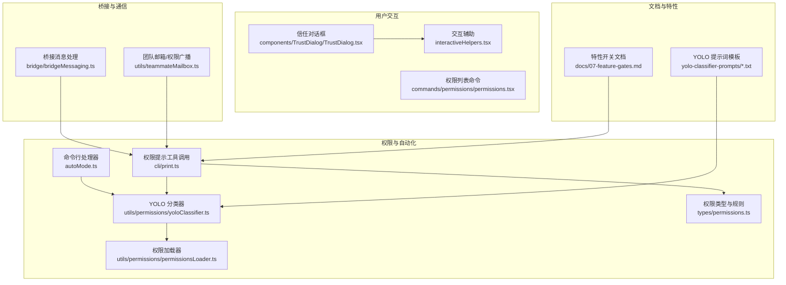
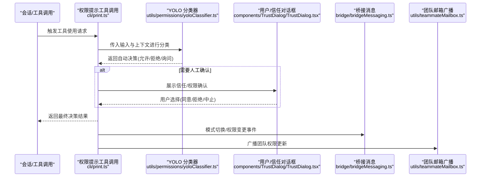
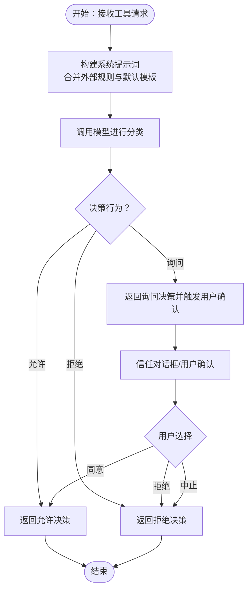
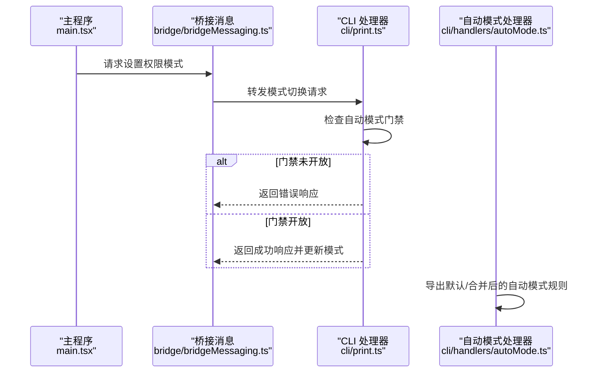
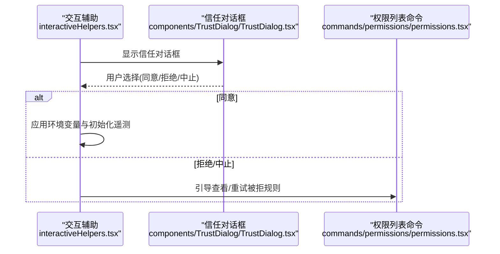
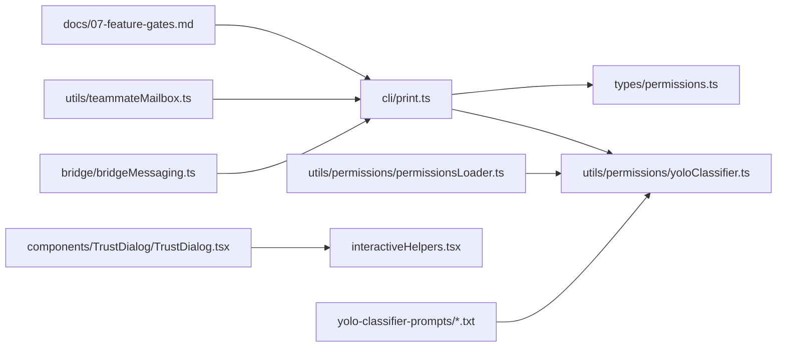

# 权限决策与自动化

<cite>
**本文引用的文件**
- [yoloClassifier.ts](file://src/utils/permissions/yoloClassifier.ts)
- [print.ts](file://src/cli/print.ts)
- [main.tsx](file://src/main.tsx)
- [permissions.tsx](file://src/commands/permissions/permissions.tsx)
- [TrustDialog.tsx](file://src/components/TrustDialog/TrustDialog.tsx)
- [interactiveHelpers.tsx](file://src/interactiveHelpers.tsx)
- [bridgeMessaging.ts](file://src/bridge/bridgeMessaging.ts)
- [teammateMailbox.ts](file://src/utils/teammateMailbox.ts)
- [permissions.ts](file://src/types/permissions.ts)
- [permissionsLoader.ts](file://src/utils/permissions/permissionsLoader.ts)
- [permissions_anthropic.txt](file://src/utils/permissions/yolo-classifier-prompts/permissions_anthropic.txt)
- [permissions_external.txt](file://src/utils/permissions/yolo-classifier-prompts/permissions_external.txt)
- [autoMode.ts](file://src/cli/handlers/autoMode.ts)
- [07-feature-gates.md](file://docs/07-feature-gates.md)
</cite>

## 目录
1. [简介](#简介)
2. [项目结构](#项目结构)
3. [核心组件](#核心组件)
4. [架构总览](#架构总览)
5. [组件详解](#组件详解)
6. [依赖关系分析](#依赖关系分析)
7. [性能考量](#性能考量)
8. [故障排查指南](#故障排查指南)
9. [结论](#结论)
10. [附录](#附录)

## 简介
本文件面向 Claude Code 的“权限决策与自动化”系统，系统性阐述权限自动决策机制（以 YOLO 分类器为核心）、自动模式状态管理、权限提升流程、用户确认机制、权限解释器的可视化与透明度、配置项与阈值、以及准确性评估与持续改进策略。目标是帮助开发者与安全运营人员理解并正确配置该系统，确保在自动化与安全性之间取得平衡。

## 项目结构
围绕权限决策与自动化的代码主要分布在以下模块：
- 权限规则与自动模式：命令行工具、类型与加载器
- 权限决策引擎：YOLO 分类器、权限提示工具、桥接消息
- 用户交互与信任：信任对话框、交互辅助、权限列表
- 团队协作与广播：团队权限更新消息
- 文档与特性开关：特性门控与远程配置

图表来源
- [autoMode.ts](file://src/cli/handlers/autoMode.ts)
- [print.ts](file://src/cli/print.ts)
- [yoloClassifier.ts](file://src/utils/permissions/yoloClassifier.ts)
- [permissions.ts](file://src/types/permissions.ts)
- [permissionsLoader.ts](file://src/utils/permissions/permissionsLoader.ts)
- [TrustDialog.tsx](file://src/components/TrustDialog/TrustDialog.tsx)
- [permissions.tsx](file://src/commands/permissions/permissions.tsx)
- [interactiveHelpers.tsx](file://src/interactiveHelpers.tsx)
- [bridgeMessaging.ts](file://src/bridge/bridgeMessaging.ts)
- [teammateMailbox.ts](file://src/utils/teammateMailbox.ts)
- [07-feature-gates.md](file://docs/07-feature-gates.md)
- [permissions_anthropic.txt](file://src/utils/permissions/yolo-classifier-prompts/permissions_anthropic.txt)
- [permissions_external.txt](file://src/utils/permissions/yolo-classifier-prompts/permissions_external.txt)

章节来源
- [autoMode.ts](file://src/cli/handlers/autoMode.ts)
- [print.ts](file://src/cli/print.ts)
- [yoloClassifier.ts](file://src/utils/permissions/yoloClassifier.ts)
- [permissions.ts](file://src/types/permissions.ts)
- [permissionsLoader.ts](file://src/utils/permissions/permissionsLoader.ts)
- [TrustDialog.tsx](file://src/components/TrustDialog/TrustDialog.tsx)
- [permissions.tsx](file://src/commands/permissions/permissions.tsx)
- [interactiveHelpers.tsx](file://src/interactiveHelpers.tsx)
- [bridgeMessaging.ts](file://src/bridge/bridgeMessaging.ts)
- [teammateMailbox.ts](file://src/utils/teammateMailbox.ts)
- [07-feature-gates.md](file://docs/07-feature-gates.md)
- [permissions_anthropic.txt](file://src/utils/permissions/yolo-classifier-prompts/permissions_anthropic.txt)
- [permissions_external.txt](file://src/utils/permissions/yolo-classifier-prompts/permissions_external.txt)

## 核心组件
- YOLO 分类器：基于提示词模板与外部规则，对工具使用请求进行自动分类（允许/拒绝/询问），并生成可解释的决策依据。
- 权限提示工具：在需要人工介入时，通过标准化输出结构驱动决策，支持超时/中断/中止等控制流。
- 自动模式与规则：提供默认与合并后的自动模式规则导出、配置覆盖与门禁检查。
- 信任与用户确认：信任对话框在环境变量应用与遥测初始化前触发；权限列表命令用于查看与重试被拒的规则。
- 桥接与团队广播：桥接消息处理权限模式切换；团队邮箱广播权限更新，确保多代理一致性。
- 特性开关与远程配置：通过 GrowthBook 控制功能开关与阈值覆盖，影响权限决策行为。

章节来源
- [yoloClassifier.ts](file://src/utils/permissions/yoloClassifier.ts)
- [print.ts](file://src/cli/print.ts)
- [autoMode.ts](file://src/cli/handlers/autoMode.ts)
- [TrustDialog.tsx](file://src/components/TrustDialog/TrustDialog.tsx)
- [permissions.tsx](file://src/commands/permissions/permissions.tsx)
- [bridgeMessaging.ts](file://src/bridge/bridgeMessaging.ts)
- [teammateMailbox.ts](file://src/utils/teammateMailbox.ts)
- [07-feature-gates.md](file://docs/07-feature-gates.md)

## 架构总览
下图展示从会话到权限决策、再到用户确认与团队同步的关键路径。

图表来源
- [print.ts](file://src/cli/print.ts)
- [yoloClassifier.ts](file://src/utils/permissions/yoloClassifier.ts)
- [TrustDialog.tsx](file://src/components/TrustDialog/TrustDialog.tsx)
- [bridgeMessaging.ts](file://src/bridge/bridgeMessaging.ts)
- [teammateMailbox.ts](file://src/utils/teammateMailbox.ts)

## 组件详解

### YOLO 分类器与自动决策
- 工作原理
  - 输入：工具名称、输入参数、历史对话片段、当前会话上下文。
  - 处理：结合内置提示词模板与外部规则，构造系统提示词，调用模型进行分类。
  - 输出：标准化的决策结构，包含行为（允许/拒绝/询问）与决策原因（可解释性）。
- 决策算法
  - 规则优先级：外部规则覆盖默认规则；空缺部分回退至默认模板。
  - 合并与门禁：自动模式配置采用“替换语义”，用户提供的段落完全替换对应默认段落；若未启用自动模式门禁，则禁止切换到自动模式。
- 信任评估
  - 通过提示词模板与外部规则共同决定信任阈值与风险等级，从而影响是否进入“询问”或直接“拒绝”。

图表来源
- [yoloClassifier.ts](file://src/utils/permissions/yoloClassifier.ts)
- [permissions_anthropic.txt](file://src/utils/permissions/yolo-classifier-prompts/permissions_anthropic.txt)
- [permissions_external.txt](file://src/utils/permissions/yolo-classifier-prompts/permissions_external.txt)

章节来源
- [yoloClassifier.ts](file://src/utils/permissions/yoloClassifier.ts)
- [permissions_anthropic.txt](file://src/utils/permissions/yolo-classifier-prompts/permissions_anthropic.txt)
- [permissions_external.txt](file://src/utils/permissions/yolo-classifier-prompts/permissions_external.txt)

### 自动模式状态管理与权限提升
- 状态管理
  - 在启动阶段解析初始权限模式，记录是否处于“绕过权限模式”，并在满足条件时设置自动模式标志位。
  - 模式切换通过桥接消息处理，返回成功或错误响应，错误信息来自门禁检查与不可用原因。
- 权限提升流程
  - 当用户意图开启自动模式但门禁未开放时，直接返回错误；当门禁开放时，允许切换并更新上下文模式。
  - 切换后，后续权限决策将优先采用自动模式规则与 YOLO 分类器输出。

图表来源
- [main.tsx](file://src/main.tsx)
- [bridgeMessaging.ts](file://src/bridge/bridgeMessaging.ts)
- [print.ts](file://src/cli/print.ts)
- [autoMode.ts](file://src/cli/handlers/autoMode.ts)

章节来源
- [main.tsx](file://src/main.tsx)
- [bridgeMessaging.ts](file://src/bridge/bridgeMessaging.ts)
- [print.ts](file://src/cli/print.ts)
- [autoMode.ts](file://src/cli/handlers/autoMode.ts)

### 用户确认机制与信任对话框
- 触发时机
  - 在应用配置环境变量与初始化遥测之前，显示信任对话框，确保用户明确授权潜在危险的环境变量与遥测配置。
- 行为影响
  - 同意后继续执行；拒绝或中止将导致相关操作被拒绝或终止。
- 与权限列表联动
  - 权限列表命令允许查看被拒规则并重试，形成闭环的用户反馈与修正机制。

图表来源
- [interactiveHelpers.tsx](file://src/interactiveHelpers.tsx)
- [TrustDialog.tsx](file://src/components/TrustDialog/TrustDialog.tsx)
- [permissions.tsx](file://src/commands/permissions/permissions.tsx)

章节来源
- [interactiveHelpers.tsx](file://src/interactiveHelpers.tsx)
- [TrustDialog.tsx](file://src/components/TrustDialog/TrustDialog.tsx)
- [permissions.tsx](file://src/commands/permissions/permissions.tsx)

### 权限解释器与可视化
- 可解释性输出
  - 权限提示工具返回的决策结果包含行为与决策原因，便于在 UI 中呈现“为什么允许/拒绝/询问”。
- 透明度机制
  - 结合提示词模板与外部规则，向用户展示决策依据；在自动模式下，规则的来源与覆盖关系清晰可见。
- 可视化建议
  - 在权限列表中以分组形式展示规则来源（用户/项目/默认），并高亮“询问”类规则以便用户关注。

章节来源
- [print.ts](file://src/cli/print.ts)
- [yoloClassifier.ts](file://src/utils/permissions/yoloClassifier.ts)

### 配置选项、阈值与自定义策略
- 自动模式规则
  - 默认规则与用户规则合并，采用“替换语义”：用户提供的段落完全替换默认段落；未提供的段落回退到默认模板。
- 门禁与特性开关
  - 通过特性开关控制自动模式可用性；远程配置（GrowthBook）可动态调整阈值与覆盖策略。
- 策略定制
  - 通过外部规则文件与提示词模板扩展策略边界；在团队场景中，通过团队邮箱广播统一权限更新。

章节来源
- [autoMode.ts](file://src/cli/handlers/autoMode.ts)
- [07-feature-gates.md](file://docs/07-feature-gates.md)
- [permissionsLoader.ts](file://src/utils/permissions/permissionsLoader.ts)
- [permissions.ts](file://src/types/permissions.ts)

## 依赖关系分析
- 组件耦合
  - 权限提示工具与 YOLO 分类器强耦合：前者负责调用与结果解析，后者负责决策生成。
  - 信任对话框与交互辅助弱耦合：仅在特定阶段触发，不影响核心决策链路。
  - 桥接消息与团队邮箱广播为外部集成点，确保跨进程/多代理一致性。
- 外部依赖
  - 特性开关（GrowthBook）影响自动模式可用性与阈值覆盖；提示词模板与外部规则作为策略输入。

图表来源
- [print.ts](file://src/cli/print.ts)
- [yoloClassifier.ts](file://src/utils/permissions/yoloClassifier.ts)
- [permissions.ts](file://src/types/permissions.ts)
- [permissionsLoader.ts](file://src/utils/permissions/permissionsLoader.ts)
- [TrustDialog.tsx](file://src/components/TrustDialog/TrustDialog.tsx)
- [interactiveHelpers.tsx](file://src/interactiveHelpers.tsx)
- [bridgeMessaging.ts](file://src/bridge/bridgeMessaging.ts)
- [teammateMailbox.ts](file://src/utils/teammateMailbox.ts)
- [07-feature-gates.md](file://docs/07-feature-gates.md)
- [permissions_anthropic.txt](file://src/utils/permissions/yolo-classifier-prompts/permissions_anthropic.txt)
- [permissions_external.txt](file://src/utils/permissions/yolo-classifier-prompts/permissions_external.txt)

章节来源
- [print.ts](file://src/cli/print.ts)
- [yoloClassifier.ts](file://src/utils/permissions/yoloClassifier.ts)
- [permissions.ts](file://src/types/permissions.ts)
- [permissionsLoader.ts](file://src/utils/permissions/permissionsLoader.ts)
- [TrustDialog.tsx](file://src/components/TrustDialog/TrustDialog.tsx)
- [interactiveHelpers.tsx](file://src/interactiveHelpers.tsx)
- [bridgeMessaging.ts](file://src/bridge/bridgeMessaging.ts)
- [teammateMailbox.ts](file://src/utils/teammateMailbox.ts)
- [07-feature-gates.md](file://docs/07-feature-gates.md)
- [permissions_anthropic.txt](file://src/utils/permissions/yolo-classifier-prompts/permissions_anthropic.txt)
- [permissions_external.txt](file://src/utils/permissions/yolo-classifier-prompts/permissions_external.txt)

## 性能考量
- 模型调用成本
  - YOLO 分类器每次决策都会触发一次模型推理，应尽量减少不必要的请求；对高频工具可考虑缓存最近结果。
- I/O 与网络
  - 特性开关与远程配置需在网络稳定时生效；在离线或网络抖动环境下，建议降级到本地默认策略。
- UI 响应
  - 信任对话框与权限列表应避免阻塞主线程；异步加载与懒渲染可提升交互流畅度。

## 故障排查指南
- 自动模式不可用
  - 检查门禁状态与不可用原因；若门禁关闭，直接返回错误响应，需先开启门禁或切换到其他模式。
- 权限提示工具异常
  - 若返回结果格式不符合预期（缺少文本块或非字符串内容），将抛出错误；请检查工具输出映射与解析逻辑。
- 孤立权限响应
  - 对于未关联到当前会话的权限响应，系统会尝试查找转录中的工具调用并排队执行；如无匹配，需手动重试或检查工具使用 ID。
- 模式切换失败
  - 桥接消息处理会返回错误响应并携带具体原因；根据错误信息定位配置问题或上下文限制。

章节来源
- [print.ts](file://src/cli/print.ts)
- [bridgeMessaging.ts](file://src/bridge/bridgeMessaging.ts)
- [teammateMailbox.ts](file://src/utils/teammateMailbox.ts)

## 结论
该权限决策与自动化系统通过 YOLO 分类器实现对工具使用的自动判断，并以信任对话框与权限列表保障用户知情与可控。自动模式下的规则合并与门禁控制确保策略可配置且安全可控；团队广播机制保证多代理一致性。建议在生产环境中结合特性开关与远程配置动态优化阈值与策略，并持续收集用户反馈与误判案例以迭代提示词模板与外部规则。

## 附录
- 关键文件索引
  - YOLO 分类器与提示词模板：[yoloClassifier.ts](file://src/utils/permissions/yoloClassifier.ts)、[permissions_anthropic.txt](file://src/utils/permissions/yolo-classifier-prompts/permissions_anthropic.txt)、[permissions_external.txt](file://src/utils/permissions/yolo-classifier-prompts/permissions_external.txt)
  - 权限提示工具与决策：[print.ts](file://src/cli/print.ts)
  - 自动模式与规则导出：[autoMode.ts](file://src/cli/handlers/autoMode.ts)
  - 用户交互与信任：[TrustDialog.tsx](file://src/components/TrustDialog/TrustDialog.tsx)、[interactiveHelpers.tsx](file://src/interactiveHelpers.tsx)、[permissions.tsx](file://src/commands/permissions/permissions.tsx)
  - 桥接与团队广播：[bridgeMessaging.ts](file://src/bridge/bridgeMessaging.ts)、[teammateMailbox.ts](file://src/utils/teammateMailbox.ts)
  - 特性开关与远程配置：[07-feature-gates.md](file://docs/07-feature-gates.md)