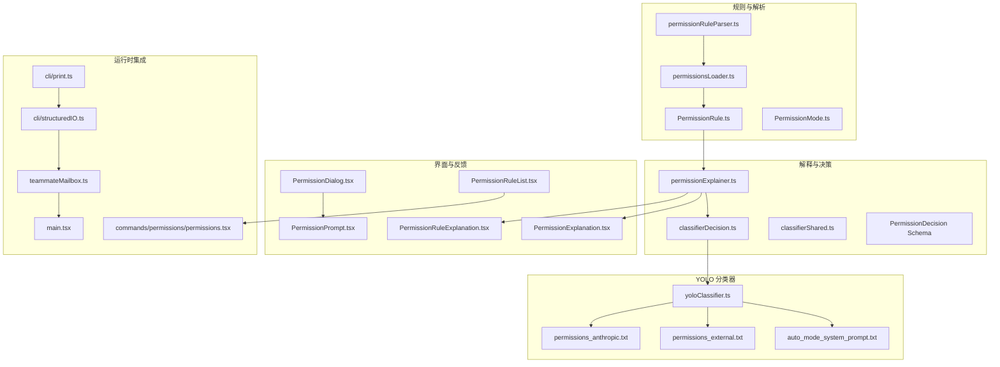
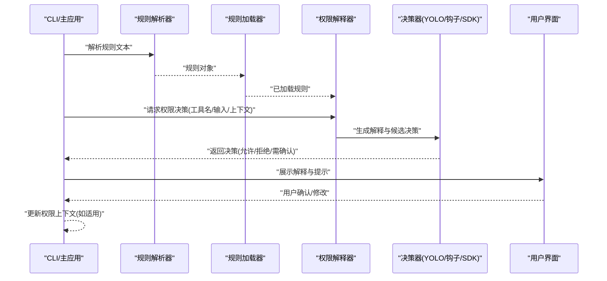
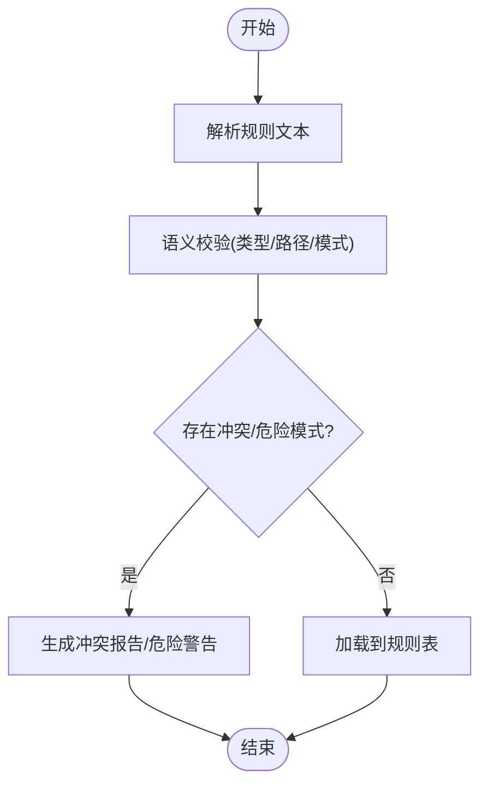
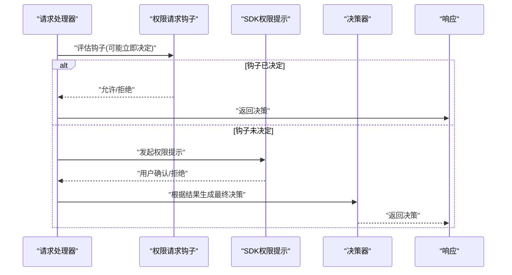
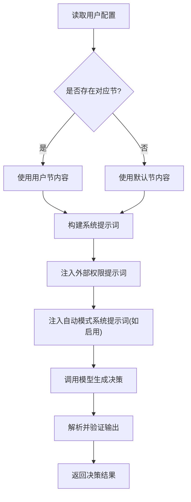
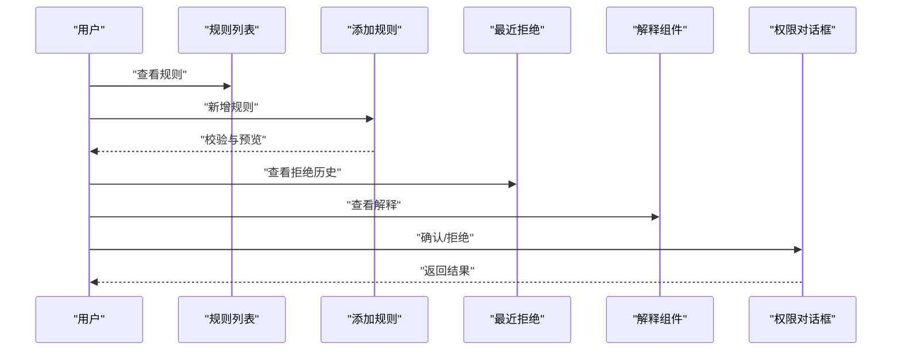
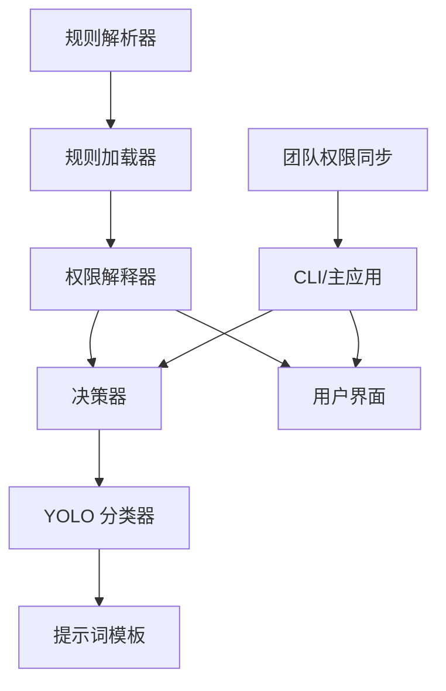

# 权限解释器

<cite>
**本文引用的文件**
- [src/utils/permissions/yoloClassifier.ts](file://src/utils/permissions/yoloClassifier.ts)
- [src/utils/permissions/permissionExplainer.ts](file://src/utils/permissions/permissionExplainer.ts)
- [src/utils/permissions/permissionRuleParser.ts](file://src/utils/permissions/permissionRuleParser.ts)
- [src/utils/permissions/permissions.ts](file://src/utils/permissions/permissions.ts)
- [src/utils/permissions/permissionsLoader.ts](file://src/utils/permissions/permissionsLoader.ts)
- [src/utils/permissions/shadowedRuleDetection.ts](file://src/utils/permissions/shadowedRuleDetection.ts)
- [src/utils/permissions/dangerousPatterns.ts](file://src/utils/permissions/dangerousPatterns.ts)
- [src/utils/permissions/classifierDecision.ts](file://src/utils/permissions/classifierDecision.ts)
- [src/utils/permissions/classifierShared.ts](file://src/utils/permissions/classifierShared.ts)
- [src/utils/permissions/bashClassifier.ts](file://src/utils/permissions/bashClassifier.ts)
- [src/utils/permissions/autoModeState.ts](file://src/utils/permissions/autoModeState.ts)
- [src/utils/permissions/pathValidation.ts](file://src/utils/permissions/pathValidation.ts)
- [src/utils/permissions/shellRuleMatching.ts](file://src/utils/permissions/shellRuleMatching.ts)
- [src/utils/permissions/PermissionMode.ts](file://src/utils/permissions/PermissionMode.ts)
- [src/utils/permissions/PermissionPromptToolResultSchema.ts](file://src/utils/permissions/PermissionPromptToolResultSchema.ts)
- [src/utils/permissions/PermissionResult.ts](file://src/utils/permissions/PermissionResult.ts)
- [src/utils/permissions/PermissionRule.ts](file://src/utils/permissions/PermissionRule.ts)
- [src/utils/permissions/PermissionUpdate.ts](file://src/utils/permissions/PermissionUpdate.ts)
- [src/utils/permissions/PermissionUpdateSchema.ts](file://src/utils/permissions/PermissionUpdateSchema.ts)
- [src/utils/permissions/yolo-classifier-prompts/permissions_anthropic.txt](file://src/utils/permissions/yolo-classifier-prompts/permissions_anthropic.txt)
- [src/utils/permissions/yolo-classifier-prompts/permissions_external.txt](file://src/utils/permissions/yolo-classifier-prompts/permissions_external.txt)
- [src/utils/permissions/yolo-classifier-prompts/auto_mode_system_prompt.txt](file://src/utils/permissions/yolo-classifier-prompts/auto_mode_system_prompt.txt)
- [src/cli/print.ts](file://src/cli/print.ts)
- [src/cli/structuredIO.ts](file://src/cli/structuredIO.ts)
- [src/utils/teammateMailbox.ts](file://src/utils/teammateMailbox.ts)
- [src/commands/permissions/permissions.tsx](file://src/commands/permissions/permissions.tsx)
- [src/main.tsx](file://src/main.tsx)
- [src/cli/handlers/autoMode.ts](file://src/cli/handlers/autoMode.ts)
- [src/components/permissions/PermissionExplanation.tsx](file://src/components/permissions/PermissionExplanation.tsx)
- [src/components/permissions/PermissionRuleExplanation.tsx](file://src/components/permissions/PermissionRuleExplanation.tsx)
- [src/components/permissions/PermissionDialog.tsx](file://src/components/permissions/PermissionDialog.tsx)
- [src/components/permissions/PermissionPrompt.tsx](file://src/components/permissions/PermissionPrompt.tsx)
- [src/components/permissions/rules/PermissionRuleList.tsx](file://src/components/permissions/rules/PermissionRuleList.tsx)
- [src/components/permissions/rules/AddPermissionRules.tsx](file://src/components/permissions/rules/AddPermissionRules.tsx)
- [src/components/permissions/rules/RecentDenialsTab.tsx](file://src/components/permissions/rules/RecentDenialsTab.tsx)
- [src/hooks/toolPermission/permissionLogging.ts](file://src/hooks/toolPermission/permissionLogging.ts)
- [src/utils/settings/permissionValidation.ts](file://src/utils/settings/permissionValidation.ts)
- [src/utils/swarm/permissionSync.ts](file://src/utils/swarm/permissionSync.ts)
</cite>

## 目录
1. [引言](#引言)
2. [项目结构](#项目结构)
3. [核心组件](#核心组件)
4. [架构总览](#架构总览)
5. [详细组件分析](#详细组件分析)
6. [依赖关系分析](#依赖关系分析)
7. [性能考量](#性能考量)
8. [故障排查指南](#故障排查指南)
9. [结论](#结论)
10. [附录](#附录)

## 引言
本文件面向“权限解释器”的全面技术文档，聚焦以下目标：
- 解释权限解释器的架构设计与工作原理，包括决策过程的可视化、用户反馈生成与透明度机制
- 说明权限规则解析器的功能：规则格式化、语义分析与错误处理
- 解释 YOLO 分类器提示词的设计思路：系统提示词、外部权限提示词与自动模式系统提示词
- 提供解释器的配置选项、自定义模板与本地化支持
- 包含用户界面设计、交互流程与可访问性考虑

## 项目结构
权限解释器由“规则解析与加载”“解释与决策”“YOLO 分类器”“用户界面与反馈”“配置与设置”等模块协同构成。下图展示与权限解释器相关的关键目录与文件：

图表来源
- [src/utils/permissions/permissionRuleParser.ts](file://src/utils/permissions/permissionRuleParser.ts)
- [src/utils/permissions/permissionsLoader.ts](file://src/utils/permissions/permissionsLoader.ts)
- [src/utils/permissions/PermissionRule.ts](file://src/utils/permissions/PermissionRule.ts)
- [src/utils/permissions/PermissionMode.ts](file://src/utils/permissions/PermissionMode.ts)
- [src/utils/permissions/permissionExplainer.ts](file://src/utils/permissions/permissionExplainer.ts)
- [src/utils/permissions/classifierDecision.ts](file://src/utils/permissions/classifierDecision.ts)
- [src/utils/permissions/classifierShared.ts](file://src/utils/permissions/classifierShared.ts)
- [src/utils/permissions/yoloClassifier.ts](file://src/utils/permissions/yoloClassifier.ts)
- [src/utils/permissions/yolo-classifier-prompts/auto_mode_system_prompt.txt](file://src/utils/permissions/yolo-classifier-prompts/auto_mode_system_prompt.txt)
- [src/utils/permissions/yolo-classifier-prompts/permissions_external.txt](file://src/utils/permissions/yolo-classifier-prompts/permissions_external.txt)
- [src/utils/permissions/yolo-classifier-prompts/permissions_anthropic.txt](file://src/utils/permissions/yolo-classifier-prompts/permissions_anthropic.txt)
- [src/components/permissions/PermissionExplanation.tsx](file://src/components/permissions/PermissionExplanation.tsx)
- [src/components/permissions/PermissionRuleExplanation.tsx](file://src/components/permissions/PermissionRuleExplanation.tsx)
- [src/components/permissions/PermissionDialog.tsx](file://src/components/permissions/PermissionDialog.tsx)
- [src/components/permissions/PermissionPrompt.tsx](file://src/components/permissions/PermissionPrompt.tsx)
- [src/components/permissions/rules/PermissionRuleList.tsx](file://src/components/permissions/rules/PermissionRuleList.tsx)
- [src/cli/print.ts](file://src/cli/print.ts)
- [src/cli/structuredIO.ts](file://src/cli/structuredIO.ts)
- [src/utils/teammateMailbox.ts](file://src/utils/teammateMailbox.ts)
- [src/commands/permissions/permissions.tsx](file://src/commands/permissions/permissions.tsx)
- [src/main.tsx](file://src/main.tsx)

章节来源
- [src/utils/permissions/permissionRuleParser.ts](file://src/utils/permissions/permissionRuleParser.ts)
- [src/utils/permissions/permissionsLoader.ts](file://src/utils/permissions/permissionsLoader.ts)
- [src/utils/permissions/permissionExplainer.ts](file://src/utils/permissions/permissionExplainer.ts)
- [src/utils/permissions/yoloClassifier.ts](file://src/utils/permissions/yoloClassifier.ts)
- [src/components/permissions/PermissionExplanation.tsx](file://src/components/permissions/PermissionExplanation.tsx)
- [src/cli/print.ts](file://src/cli/print.ts)
- [src/cli/structuredIO.ts](file://src/cli/structuredIO.ts)
- [src/utils/teammateMailbox.ts](file://src/utils/teammateMailbox.ts)
- [src/commands/permissions/permissions.tsx](file://src/commands/permissions/permissions.tsx)
- [src/main.tsx](file://src/main.tsx)

## 核心组件
- 规则解析与加载：负责将用户或系统提供的规则文本解析为内部数据结构，并进行语义校验与冲突检测。
- 权限解释器：对工具调用请求进行解释，结合规则与上下文生成可解释的决策结果。
- YOLO 分类器：基于提示词模板与模型推理，输出自动模式下的快速决策与建议。
- 用户界面与反馈：提供规则列表、解释说明、权限对话框与提示，增强透明度与可操作性。
- 运行时集成：在 CLI 与主应用中接入权限检查、提示与决策回传。

章节来源
- [src/utils/permissions/permissionRuleParser.ts](file://src/utils/permissions/permissionRuleParser.ts)
- [src/utils/permissions/permissionsLoader.ts](file://src/utils/permissions/permissionsLoader.ts)
- [src/utils/permissions/permissionExplainer.ts](file://src/utils/permissions/permissionExplainer.ts)
- [src/utils/permissions/yoloClassifier.ts](file://src/utils/permissions/yoloClassifier.ts)
- [src/components/permissions/PermissionExplanation.tsx](file://src/components/permissions/PermissionExplanation.tsx)
- [src/cli/print.ts](file://src/cli/print.ts)
- [src/cli/structuredIO.ts](file://src/cli/structuredIO.ts)

## 架构总览
权限解释器的整体流程如下：
- 输入阶段：接收工具调用请求（名称、输入、上下文）与当前权限模式
- 规则阶段：加载并解析规则，执行冲突检测与危险模式识别
- 解释阶段：生成可解释的决策依据与反馈信息
- 决策阶段：通过钩子、SDK 提示或 YOLO 分类器生成最终决策
- 反馈阶段：向用户展示解释与提示，必要时更新权限上下文

图表来源
- [src/utils/permissions/permissionRuleParser.ts](file://src/utils/permissions/permissionRuleParser.ts)
- [src/utils/permissions/permissionsLoader.ts](file://src/utils/permissions/permissionsLoader.ts)
- [src/utils/permissions/permissionExplainer.ts](file://src/utils/permissions/permissionExplainer.ts)
- [src/utils/permissions/classifierDecision.ts](file://src/utils/permissions/classifierDecision.ts)
- [src/utils/permissions/yoloClassifier.ts](file://src/utils/permissions/yoloClassifier.ts)
- [src/components/permissions/PermissionExplanation.tsx](file://src/components/permissions/PermissionExplanation.tsx)

## 详细组件分析

### 规则解析器与加载器
- 功能职责
  - 将规则文本解析为统一的数据结构，支持多字段、条件表达式与注释
  - 执行语义分析：类型校验、路径合法性、模式冲突检测
  - 加载与合并：从用户配置、工作区与系统默认加载规则
- 关键点
  - 规则对象模型：包含匹配字段、动作、优先级、来源等
  - 危险模式识别：对潜在高风险规则进行标记与告警
  - 冲突检测：重叠规则、优先级冲突与屏蔽规则的判定
- 错误处理
  - 解析失败：抛出明确的错误信息，包含位置与原因
  - 语义错误：提供修复建议与可选的自动修正策略

图表来源
- [src/utils/permissions/permissionRuleParser.ts](file://src/utils/permissions/permissionRuleParser.ts)
- [src/utils/permissions/permissionsLoader.ts](file://src/utils/permissions/permissionsLoader.ts)
- [src/utils/permissions/shadowedRuleDetection.ts](file://src/utils/permissions/shadowedRuleDetection.ts)
- [src/utils/permissions/dangerousPatterns.ts](file://src/utils/permissions/dangerousPatterns.ts)
- [src/utils/permissions/pathValidation.ts](file://src/utils/permissions/pathValidation.ts)

章节来源
- [src/utils/permissions/permissionRuleParser.ts](file://src/utils/permissions/permissionRuleParser.ts)
- [src/utils/permissions/permissionsLoader.ts](file://src/utils/permissions/permissionsLoader.ts)
- [src/utils/permissions/shadowedRuleDetection.ts](file://src/utils/permissions/shadowedRuleDetection.ts)
- [src/utils/permissions/dangerousPatterns.ts](file://src/utils/permissions/dangerousPatterns.ts)
- [src/utils/permissions/pathValidation.ts](file://src/utils/permissions/pathValidation.ts)

### 权限解释器与决策
- 功能职责
  - 对工具调用请求生成解释：规则来源、匹配项、决策依据
  - 与钩子、SDK 提示与 YOLO 分类器协作，形成最终决策
  - 支持“总是允许/拒绝”“更新输入/权限”等动态决策扩展
- 决策流程
  - 钩子优先：若钩子立即给出允许/拒绝，则终止等待 SDK 提示
  - SDK 提示：在钩子未决时触发用户确认流程
  - YOLO 分类器：在自动模式下快速生成决策与建议
- 结果建模
  - 决策结果包含行为、消息、决策原因与可选的更新项

图表来源
- [src/cli/print.ts](file://src/cli/print.ts)
- [src/cli/structuredIO.ts](file://src/cli/structuredIO.ts)
- [src/utils/permissions/classifierDecision.ts](file://src/utils/permissions/classifierDecision.ts)
- [src/utils/permissions/PermissionPromptToolResultSchema.ts](file://src/utils/permissions/PermissionPromptToolResultSchema.ts)

章节来源
- [src/cli/print.ts](file://src/cli/print.ts)
- [src/cli/structuredIO.ts](file://src/cli/structuredIO.ts)
- [src/utils/permissions/classifierDecision.ts](file://src/utils/permissions/classifierDecision.ts)
- [src/utils/permissions/PermissionPromptToolResultSchema.ts](file://src/utils/permissions/PermissionPromptToolResultSchema.ts)

### YOLO 分类器与提示词
- 设计思路
  - 系统提示词：定义分类器的角色、约束与输出格式
  - 外部权限提示词：描述外部系统权限边界与例外规则
  - 自动模式系统提示词：在自动模式下替换/补充系统提示词，强调快速与一致
- 模板选择与合并
  - 用户配置与默认模板按节覆盖（非空用户节替换默认节）
  - 在 CLI 中提供导出默认/生效配置的能力
- 分类器实现要点
  - 输入标准化：将工具名、输入、上下文与规则摘要整合为提示
  - 输出解析：严格解析 JSON 结构，确保字段完整性与类型正确性
  - 错误处理：对异常输出进行降级与重试策略

图表来源
- [src/cli/handlers/autoMode.ts](file://src/cli/handlers/autoMode.ts)
- [src/utils/permissions/yoloClassifier.ts](file://src/utils/permissions/yoloClassifier.ts)
- [src/utils/permissions/yolo-classifier-prompts/auto_mode_system_prompt.txt](file://src/utils/permissions/yolo-classifier-prompts/auto_mode_system_prompt.txt)
- [src/utils/permissions/yolo-classifier-prompts/permissions_external.txt](file://src/utils/permissions/yolo-classifier-prompts/permissions_external.txt)
- [src/utils/permissions/yolo-classifier-prompts/permissions_anthropic.txt](file://src/utils/permissions/yolo-classifier-prompts/permissions_anthropic.txt)

章节来源
- [src/cli/handlers/autoMode.ts](file://src/cli/handlers/autoMode.ts)
- [src/utils/permissions/yoloClassifier.ts](file://src/utils/permissions/yoloClassifier.ts)
- [src/utils/permissions/yolo-classifier-prompts/auto_mode_system_prompt.txt](file://src/utils/permissions/yolo-classifier-prompts/auto_mode_system_prompt.txt)
- [src/utils/permissions/yolo-classifier-prompts/permissions_external.txt](file://src/utils/permissions/yolo-classifier-prompts/permissions_external.txt)
- [src/utils/permissions/yolo-classifier-prompts/permissions_anthropic.txt](file://src/utils/permissions/yolo-classifier-prompts/permissions_anthropic.txt)

### 用户界面与交互
- 规则管理
  - 规则列表：展示已加载规则、来源与状态
  - 添加规则：提供输入校验与预览
  - 最近拒绝：记录并展示被拒绝的请求，便于复核
- 权限解释与提示
  - 解释组件：以自然语言说明决策依据与规则来源
  - 规则解释：针对单条规则的含义与影响进行说明
  - 对话框与提示：在需要用户确认时弹出，支持多步骤与预览
- 交互流程
  - 请求 -> 解释 -> 用户确认/修改 -> 更新上下文 -> 继续执行

图表来源
- [src/components/permissions/rules/PermissionRuleList.tsx](file://src/components/permissions/rules/PermissionRuleList.tsx)
- [src/components/permissions/rules/AddPermissionRules.tsx](file://src/components/permissions/rules/AddPermissionRules.tsx)
- [src/components/permissions/rules/RecentDenialsTab.tsx](file://src/components/permissions/rules/RecentDenialsTab.tsx)
- [src/components/permissions/PermissionExplanation.tsx](file://src/components/permissions/PermissionExplanation.tsx)
- [src/components/permissions/PermissionRuleExplanation.tsx](file://src/components/permissions/PermissionRuleExplanation.tsx)
- [src/components/permissions/PermissionDialog.tsx](file://src/components/permissions/PermissionDialog.tsx)
- [src/components/permissions/PermissionPrompt.tsx](file://src/components/permissions/PermissionPrompt.tsx)

章节来源
- [src/components/permissions/rules/PermissionRuleList.tsx](file://src/components/permissions/rules/PermissionRuleList.tsx)
- [src/components/permissions/rules/AddPermissionRules.tsx](file://src/components/permissions/rules/AddPermissionRules.tsx)
- [src/components/permissions/rules/RecentDenialsTab.tsx](file://src/components/permissions/rules/RecentDenialsTab.tsx)
- [src/components/permissions/PermissionExplanation.tsx](file://src/components/permissions/PermissionExplanation.tsx)
- [src/components/permissions/PermissionRuleExplanation.tsx](file://src/components/permissions/PermissionRuleExplanation.tsx)
- [src/components/permissions/PermissionDialog.tsx](file://src/components/permissions/PermissionDialog.tsx)
- [src/components/permissions/PermissionPrompt.tsx](file://src/components/permissions/PermissionPrompt.tsx)

### 配置选项、自定义模板与本地化
- 配置选项
  - 自动模式开关与可用性检查
  - 规则来源与覆盖策略（节级替换）
  - 权限模式切换与通知
- 自定义模板
  - 系统提示词、外部权限提示词与自动模式系统提示词可由用户覆盖
  - CLI 提供导出默认与生效配置的能力
- 本地化支持
  - 文案与提示词可按语言环境调整
  - 建议在 UI 层与提示词层分别维护本地化资源

章节来源
- [src/cli/handlers/autoMode.ts](file://src/cli/handlers/autoMode.ts)
- [src/main.tsx](file://src/main.tsx)
- [src/utils/permissions/yoloClassifier.ts](file://src/utils/permissions/yoloClassifier.ts)

## 依赖关系分析
- 组件耦合
  - 规则解析器与加载器高度内聚，共同保证规则质量
  - 权限解释器依赖规则与决策器，同时向 UI 输出解释
  - YOLO 分类器与提示词模板松耦合，便于独立演进
- 外部依赖
  - CLI 与主应用通过消息队列与控制响应进行集成
  - 团队协作场景通过邮箱盒机制传递权限请求与响应

图表来源
- [src/utils/permissions/permissionRuleParser.ts](file://src/utils/permissions/permissionRuleParser.ts)
- [src/utils/permissions/permissionsLoader.ts](file://src/utils/permissions/permissionsLoader.ts)
- [src/utils/permissions/permissionExplainer.ts](file://src/utils/permissions/permissionExplainer.ts)
- [src/utils/permissions/classifierDecision.ts](file://src/utils/permissions/classifierDecision.ts)
- [src/utils/permissions/yoloClassifier.ts](file://src/utils/permissions/yoloClassifier.ts)
- [src/cli/print.ts](file://src/cli/print.ts)
- [src/utils/swarm/permissionSync.ts](file://src/utils/swarm/permissionSync.ts)

章节来源
- [src/utils/permissions/permissionRuleParser.ts](file://src/utils/permissions/permissionRuleParser.ts)
- [src/utils/permissions/permissionsLoader.ts](file://src/utils/permissions/permissionsLoader.ts)
- [src/utils/permissions/permissionExplainer.ts](file://src/utils/permissions/permissionExplainer.ts)
- [src/utils/permissions/classifierDecision.ts](file://src/utils/permissions/classifierDecision.ts)
- [src/utils/permissions/yoloClassifier.ts](file://src/utils/permissions/yoloClassifier.ts)
- [src/cli/print.ts](file://src/cli/print.ts)
- [src/utils/swarm/permissionSync.ts](file://src/utils/swarm/permissionSync.ts)

## 性能考量
- 规则解析与加载
  - 使用增量加载与缓存，避免重复解析
  - 对大型规则集采用分页或懒加载策略
- 决策与提示
  - 钩子优先策略减少等待时间
  - YOLO 分类器在自动模式下提供低延迟决策
- UI 渲染
  - 解释与规则列表采用虚拟滚动与按需渲染
  - 预览组件仅在需要时生成，降低计算开销

## 故障排查指南
- 规则解析失败
  - 检查规则语法与字段类型，参考错误信息定位问题
  - 使用规则校验工具获取修复建议
- 决策异常
  - 检查钩子是否提前中断 SDK 提示
  - 验证 SDK 返回的 JSON 结构是否符合规范
- YOLO 分类器错误
  - 确认提示词模板完整且未被错误覆盖
  - 检查模型输出是否包含必需字段
- UI 不显示解释
  - 确认解释组件已正确挂载并接收到决策结果
  - 检查权限模式与自动模式配置

章节来源
- [src/utils/permissions/permissionRuleParser.ts](file://src/utils/permissions/permissionRuleParser.ts)
- [src/cli/print.ts](file://src/cli/print.ts)
- [src/cli/structuredIO.ts](file://src/cli/structuredIO.ts)
- [src/utils/permissions/yoloClassifier.ts](file://src/utils/permissions/yoloClassifier.ts)
- [src/components/permissions/PermissionExplanation.tsx](file://src/components/permissions/PermissionExplanation.tsx)

## 结论
权限解释器通过“规则解析—解释—决策—反馈”的闭环，实现了高透明度与可操作性的权限治理。其与 YOLO 分类器、用户界面与运行时系统的深度集成，既保证了安全性，也兼顾了效率与用户体验。建议持续完善规则模板与本地化资源，优化大规模规则集的性能表现，并加强错误诊断与自动化修复能力。

## 附录
- 相关命令与入口
  - 权限规则列表命令入口：[src/commands/permissions/permissions.tsx](file://src/commands/permissions/permissions.tsx)
  - 自动模式配置导出：[src/cli/handlers/autoMode.ts](file://src/cli/handlers/autoMode.ts)
- 数据模型与类型
  - 权限规则模型：[src/utils/permissions/PermissionRule.ts](file://src/utils/permissions/PermissionRule.ts)
  - 权限模式：[src/utils/permissions/PermissionMode.ts](file://src/utils/permissions/PermissionMode.ts)
  - 权限更新模型：[src/utils/permissions/PermissionUpdate.ts](file://src/utils/permissions/PermissionUpdate.ts)
  - 权限结果模型：[src/utils/permissions/PermissionResult.ts](file://src/utils/permissions/PermissionResult.ts)
- 设置与验证
  - 权限设置验证：[src/utils/settings/permissionValidation.ts](file://src/utils/settings/permissionValidation.ts)
  - 权限日志钩子：[src/hooks/toolPermission/permissionLogging.ts](file://src/hooks/toolPermission/permissionLogging.ts)
- 团队协作
  - 权限消息传递：[src/utils/teammateMailbox.ts](file://src/utils/teammateMailbox.ts)
  - 权限同步：[src/utils/swarm/permissionSync.ts](file://src/utils/swarm/permissionSync.ts)