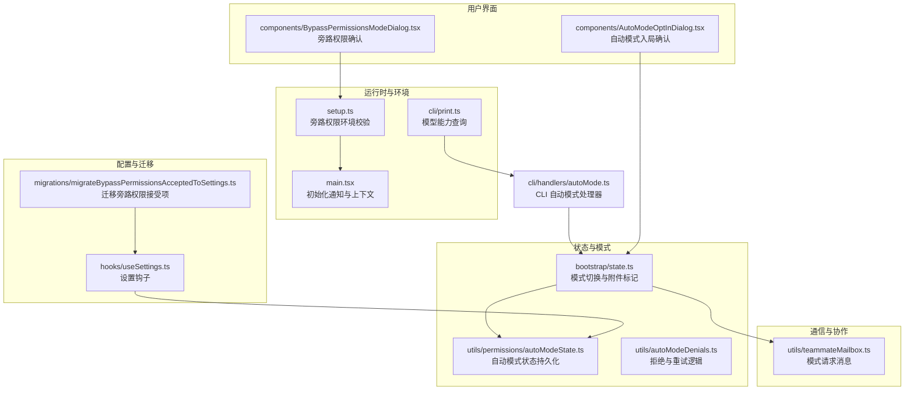
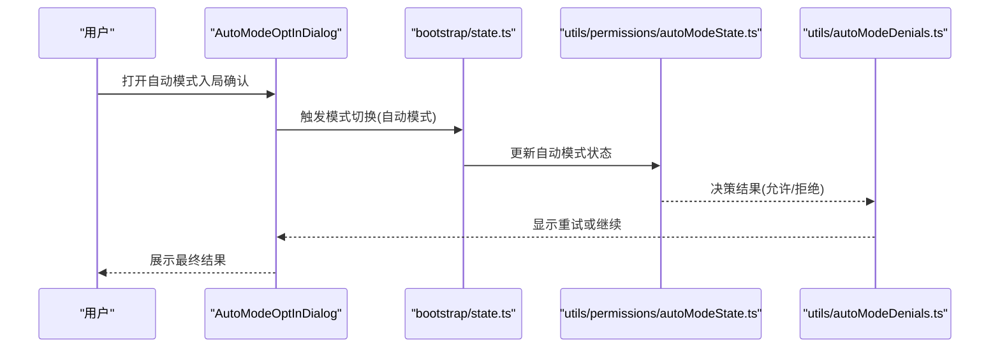
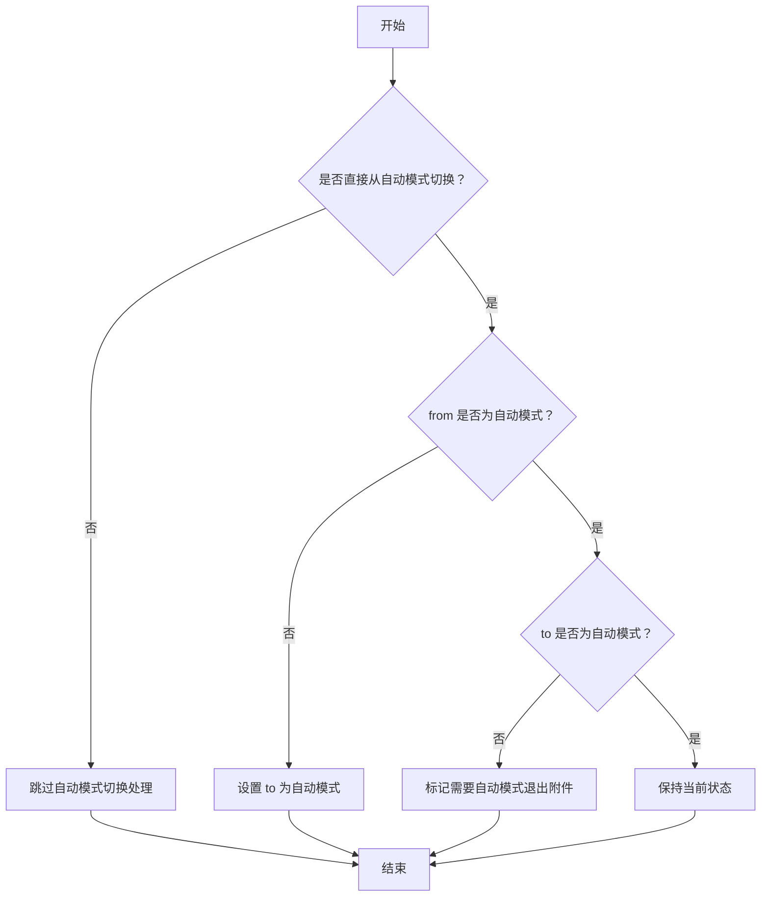
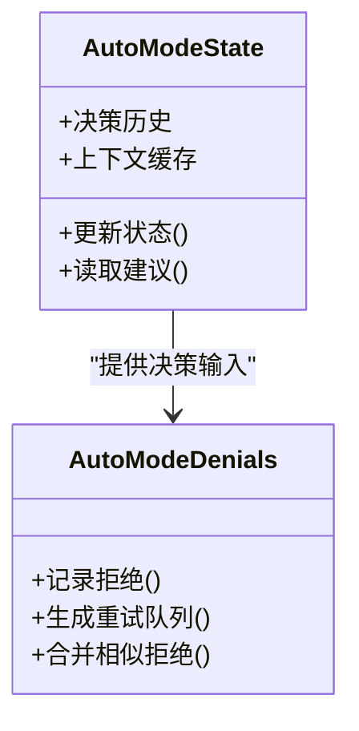
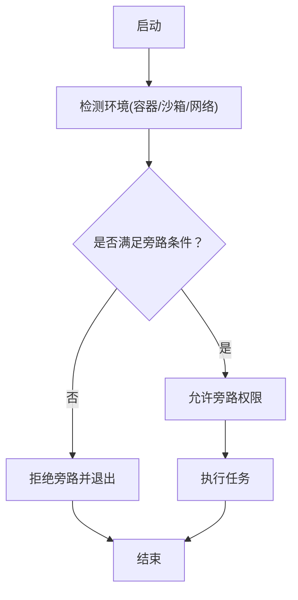
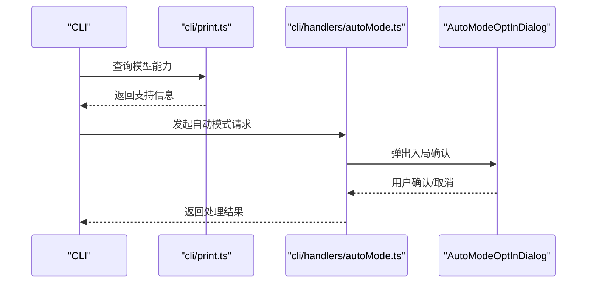
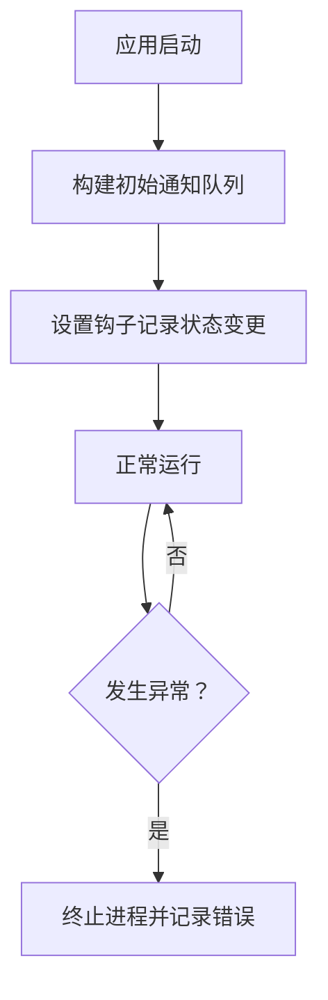
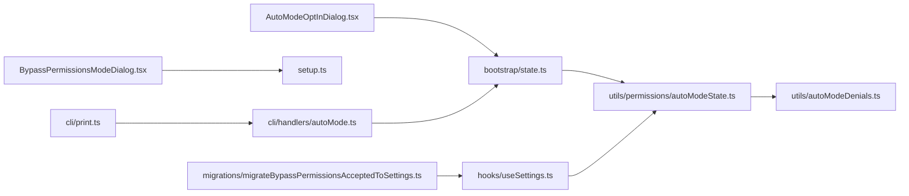

# 自动模式管理

<cite>
**本文引用的文件**
- [src/bootstrap/state.ts](file://src/bootstrap/state.ts)
- [src/utils/teammateMailbox.ts](file://src/utils/teammateMailbox.ts)
- [src/cli/handlers/autoMode.ts](file://src/cli/handlers/autoMode.ts)
- [src/utils/permissions/autoModeState.ts](file://src/utils/permissions/autoModeState.ts)
- [src/utils/autoModeDenials.ts](file://src/utils/autoModeDenials.ts)
- [src/components/AutoModeOptInDialog.tsx](file://src/components/AutoModeOptInDialog.tsx)
- [src/components/BypassPermissionsModeDialog.tsx](file://src/components/BypassPermissionsModeDialog.tsx)
- [src/setup.ts](file://src/setup.ts)
- [src/main.tsx](file://src/main.tsx)
- [src/cli/print.ts](file://src/cli/print.ts)
- [src/hooks/useSettings.ts](file://src/hooks/useSettings.ts)
- [src/migrations/migrateBypassPermissionsAcceptedToSettings.ts](file://src/migrations/migrateBypassPermissionsAcceptedToSettings.ts)
</cite>

## 目录
1. [引言](#引言)
2. [项目结构](#项目结构)
3. [核心组件](#核心组件)
4. [架构总览](#架构总览)
5. [详细组件分析](#详细组件分析)
6. [依赖关系分析](#依赖关系分析)
7. [性能考量](#性能考量)
8. [故障排查指南](#故障排查指南)
9. [结论](#结论)
10. [附录](#附录)

## 引言
本文件系统性阐述自动模式管理系统的状态转换机制、权限模式获取与优先级排序、智能推荐策略、旁路权限开关与紧急处置、安全保护措施、配置参数与触发条件以及日志记录、性能监控与故障恢复策略。目标是帮助开发者与使用者全面理解自动模式在不同场景下的行为与保障。

## 项目结构
自动模式管理涉及状态机、权限与对话框组件、CLI 处理器、迁移与设置等模块。下图展示与自动模式相关的关键文件与交互关系：

**图表来源**
- [src/bootstrap/state.ts:1345-1387](file://src/bootstrap/state.ts#L1345-L1387)
- [src/utils/permissions/autoModeState.ts](file://src/utils/permissions/autoModeState.ts)
- [src/utils/autoModeDenials.ts](file://src/utils/autoModeDenials.ts)
- [src/components/AutoModeOptInDialog.tsx](file://src/components/AutoModeOptInDialog.tsx)
- [src/components/BypassPermissionsModeDialog.tsx](file://src/components/BypassPermissionsModeDialog.tsx)
- [src/utils/teammateMailbox.ts:1027-1062](file://src/utils/teammateMailbox.ts#L1027-L1062)
- [src/setup.ts:416-446](file://src/setup.ts#L416-L446)
- [src/main.tsx:2881-2916](file://src/main.tsx#L2881-L2916)
- [src/cli/print.ts:1194-1220](file://src/cli/print.ts#L1194-L1220)
- [src/hooks/useSettings.ts](file://src/hooks/useSettings.ts)
- [src/migrations/migrateBypassPermissionsAcceptedToSettings.ts](file://src/migrations/migrateBypassPermissionsAcceptedToSettings.ts)
- [src/cli/handlers/autoMode.ts](file://src/cli/handlers/autoMode.ts)

**章节来源**
- [src/bootstrap/state.ts:1345-1387](file://src/bootstrap/state.ts#L1345-L1387)
- [src/utils/teammateMailbox.ts:1027-1062](file://src/utils/teammateMailbox.ts#L1027-L1062)
- [src/cli/handlers/autoMode.ts](file://src/cli/handlers/autoMode.ts)
- [src/utils/permissions/autoModeState.ts](file://src/utils/permissions/autoModeState.ts)
- [src/utils/autoModeDenials.ts](file://src/utils/autoModeDenials.ts)
- [src/components/AutoModeOptInDialog.tsx](file://src/components/AutoModeOptInDialog.tsx)
- [src/components/BypassPermissionsModeDialog.tsx](file://src/components/BypassPermissionsModeDialog.tsx)
- [src/setup.ts:416-446](file://src/setup.ts#L416-L446)
- [src/main.tsx:2881-2916](file://src/main.tsx#L2881-L2916)
- [src/cli/print.ts:1194-1220](file://src/cli/print.ts#L1194-L1220)
- [src/hooks/useSettings.ts](file://src/hooks/useSettings.ts)
- [src/migrations/migrateBypassPermissionsAcceptedToSettings.ts](file://src/migrations/migrateBypassPermissionsAcceptedToSettings.ts)

## 核心组件
- 模式状态机与切换：负责自动模式与计划模式之间的直接切换、退出附件标记、以及与计划模式的协同。
- 权限状态与拒绝处理：维护自动模式下的权限决策与重试流程。
- 用户交互组件：自动模式入局确认与旁路权限确认对话框。
- 通信协议：跨成员的模式设置请求消息格式与解析。
- 运行时与环境：旁路权限开关的环境约束与初始化通知。
- 配置与迁移：设置钩子与旁路权限接受项的迁移逻辑。

**章节来源**
- [src/bootstrap/state.ts:1345-1387](file://src/bootstrap/state.ts#L1345-L1387)
- [src/utils/permissions/autoModeState.ts](file://src/utils/permissions/autoModeState.ts)
- [src/utils/autoModeDenials.ts](file://src/utils/autoModeDenials.ts)
- [src/components/AutoModeOptInDialog.tsx](file://src/components/AutoModeOptInDialog.tsx)
- [src/components/BypassPermissionsModeDialog.tsx](file://src/components/BypassPermissionsModeDialog.tsx)
- [src/utils/teammateMailbox.ts:1027-1062](file://src/utils/teammateMailbox.ts#L1027-L1062)
- [src/setup.ts:416-446](file://src/setup.ts#L416-L446)
- [src/main.tsx:2881-2916](file://src/main.tsx#L2881-L2916)

## 架构总览
自动模式管理采用“状态机驱动 + 权限决策 + 用户交互 + 环境约束”的分层设计。状态机负责模式切换与附件标记；权限模块负责决策与重试；UI 提供入局与旁路确认；CLI 与设置钩子提供配置入口；迁移模块确保历史数据平滑过渡。

**图表来源**
- [src/components/AutoModeOptInDialog.tsx](file://src/components/AutoModeOptInDialog.tsx)
- [src/bootstrap/state.ts:1373-1387](file://src/bootstrap/state.ts#L1373-L1387)
- [src/utils/permissions/autoModeState.ts](file://src/utils/permissions/autoModeState.ts)
- [src/utils/autoModeDenials.ts](file://src/utils/autoModeDenials.ts)

## 详细组件分析

### 状态转换机制（模式检测、状态跟踪与切换）
- 直接自动模式切换：仅处理自动模式与其他模式之间的直接切换，跳过自动↔计划双向切换以避免重复处理。
- 计划模式协同：自动模式可与计划模式共存（取决于用户选择），退出计划模式时恢复之前的自动模式状态。
- 退出附件标记：在离开自动模式时设置退出附件标记，保证上下文正确传递。

**图表来源**
- [src/bootstrap/state.ts:1373-1387](file://src/bootstrap/state.ts#L1373-L1387)

**章节来源**
- [src/bootstrap/state.ts:1345-1387](file://src/bootstrap/state.ts#L1345-L1387)

### 权限模式获取算法、优先级排序与智能推荐
- 权限状态持久化：通过自动模式状态模块维护权限决策的上下文与历史，支持后续重试与回滚。
- 智能推荐：结合工具使用上下文与历史决策，生成权限建议列表，降低人工干预成本。
- 优先级排序：基于工具风险等级、使用频率与历史成功率对建议进行排序，优先呈现高置信度方案。

**图表来源**
- [src/utils/permissions/autoModeState.ts](file://src/utils/permissions/autoModeState.ts)
- [src/utils/autoModeDenials.ts](file://src/utils/autoModeDenials.ts)

**章节来源**
- [src/utils/permissions/autoModeState.ts](file://src/utils/permissions/autoModeState.ts)
- [src/utils/autoModeDenials.ts](file://src/utils/autoModeDenials.ts)

### 旁路权限开关、紧急情况处理与安全保护
- 旁路权限开关：在受限环境中（如沙箱且无网络）允许临时跳过权限检查，但需满足严格的环境约束。
- 紧急情况处理：当检测到不合规环境时，拒绝旁路并终止进程，防止越权执行。
- 安全保护：旁路仅在特定入口点生效，并与设置迁移配合，确保变更可追溯与可恢复。

**图表来源**
- [src/setup.ts:416-446](file://src/setup.ts#L416-L446)

**章节来源**
- [src/setup.ts:416-446](file://src/setup.ts#L416-L446)
- [src/components/BypassPermissionsModeDialog.tsx](file://src/components/BypassPermissionsModeDialog.tsx)
- [src/migrations/migrateBypassPermissionsAcceptedToSettings.ts](file://src/migrations/migrateBypassPermissionsAcceptedToSettings.ts)

### 配置参数、触发条件与手动干预
- CLI 触发：通过 CLI 处理器读取用户指定的模型与模式能力，决定是否启用自动模式。
- 能力查询：打印模块支持的模式能力，作为触发前置条件。
- 手动干预：用户可通过对话框确认入局或旁路权限，或在权限被拒后选择重试。

**图表来源**
- [src/cli/print.ts:1194-1220](file://src/cli/print.ts#L1194-L1220)
- [src/cli/handlers/autoMode.ts](file://src/cli/handlers/autoMode.ts)
- [src/components/AutoModeOptInDialog.tsx](file://src/components/AutoModeOptInDialog.tsx)

**章节来源**
- [src/cli/print.ts:1194-1220](file://src/cli/print.ts#L1194-L1220)
- [src/cli/handlers/autoMode.ts](file://src/cli/handlers/autoMode.ts)
- [src/components/AutoModeOptInDialog.tsx](file://src/components/AutoModeOptInDialog.tsx)

### 日志记录、性能监控与故障恢复
- 初始化通知：应用启动时根据权限与模型状态构建初始通知队列，提示潜在问题。
- 性能监控：通过设置钩子与迁移模块记录关键状态变更，便于追踪性能与回归。
- 故障恢复：旁路权限失败时终止进程并输出错误信息，避免进入不可控状态。

**图表来源**
- [src/main.tsx:2881-2916](file://src/main.tsx#L2881-L2916)
- [src/hooks/useSettings.ts](file://src/hooks/useSettings.ts)
- [src/migrations/migrateBypassPermissionsAcceptedToSettings.ts](file://src/migrations/migrateBypassPermissionsAcceptedToSettings.ts)

**章节来源**
- [src/main.tsx:2881-2916](file://src/main.tsx#L2881-L2916)
- [src/hooks/useSettings.ts](file://src/hooks/useSettings.ts)
- [src/migrations/migrateBypassPermissionsAcceptedToSettings.ts](file://src/migrations/migrateBypassPermissionsAcceptedToSettings.ts)

## 依赖关系分析
- 状态机依赖权限模块提供决策输入，权限模块依赖状态机维护上下文。
- UI 组件依赖状态机与权限模块，形成闭环反馈。
- CLI 与设置钩子为外部入口，驱动状态机与权限模块的更新。
- 迁移模块确保旁路权限接受项在设置中的持久化与一致性。

**图表来源**
- [src/bootstrap/state.ts:1345-1387](file://src/bootstrap/state.ts#L1345-L1387)
- [src/utils/permissions/autoModeState.ts](file://src/utils/permissions/autoModeState.ts)
- [src/utils/autoModeDenials.ts](file://src/utils/autoModeDenials.ts)
- [src/components/AutoModeOptInDialog.tsx](file://src/components/AutoModeOptInDialog.tsx)
- [src/components/BypassPermissionsModeDialog.tsx](file://src/components/BypassPermissionsModeDialog.tsx)
- [src/cli/handlers/autoMode.ts](file://src/cli/handlers/autoMode.ts)
- [src/cli/print.ts:1194-1220](file://src/cli/print.ts#L1194-L1220)
- [src/hooks/useSettings.ts](file://src/hooks/useSettings.ts)
- [src/migrations/migrateBypassPermissionsAcceptedToSettings.ts](file://src/migrations/migrateBypassPermissionsAcceptedToSettings.ts)

**章节来源**
- [src/bootstrap/state.ts:1345-1387](file://src/bootstrap/state.ts#L1345-L1387)
- [src/utils/permissions/autoModeState.ts](file://src/utils/permissions/autoModeState.ts)
- [src/utils/autoModeDenials.ts](file://src/utils/autoModeDenials.ts)
- [src/components/AutoModeOptInDialog.tsx](file://src/components/AutoModeOptInDialog.tsx)
- [src/components/BypassPermissionsModeDialog.tsx](file://src/components/BypassPermissionsModeDialog.tsx)
- [src/cli/handlers/autoMode.ts](file://src/cli/handlers/autoMode.ts)
- [src/cli/print.ts:1194-1220](file://src/cli/print.ts#L1194-L1220)
- [src/hooks/useSettings.ts](file://src/hooks/useSettings.ts)
- [src/migrations/migrateBypassPermissionsAcceptedToSettings.ts](file://src/migrations/migrateBypassPermissionsAcceptedToSettings.ts)

## 性能考量
- 状态切换最小化：仅处理直接自动模式切换，避免重复计算与消息风暴。
- 权限建议缓存：利用状态模块缓存上下文，减少重复决策成本。
- 旁路条件早判：在启动阶段快速判断环境是否允许旁路，避免无效尝试。
- 通知聚合：启动时聚合多源通知，降低渲染与 IO 压力。

## 故障排查指南
- 旁路权限被拒绝：检查环境变量与网络状态，确认是否满足旁路条件。
- 自动模式无法入局：查看权限建议与拒绝历史，必要时重试或调整策略。
- 模式切换异常：确认是否处于自动↔计划的协同场景，避免误触退出附件标记。
- 设置不生效：检查迁移是否完成，确认设置钩子已正确写入旁路权限接受项。

**章节来源**
- [src/setup.ts:416-446](file://src/setup.ts#L416-L446)
- [src/utils/autoModeDenials.ts](file://src/utils/autoModeDenials.ts)
- [src/bootstrap/state.ts:1373-1387](file://src/bootstrap/state.ts#L1373-L1387)
- [src/migrations/migrateBypassPermissionsAcceptedToSettings.ts](file://src/migrations/migrateBypassPermissionsAcceptedToSettings.ts)

## 结论
自动模式管理通过清晰的状态机、稳健的权限决策与完善的用户交互，实现了在复杂环境下的安全与高效运行。旁路权限开关与紧急处置策略提供了可控的风险边界，而配置参数、日志与迁移机制则确保了系统的可观测性与可维护性。建议在生产中结合能力查询与设置钩子，持续优化权限建议与切换策略。

## 附录
- 模式请求消息格式：用于跨成员传递模式设置请求，包含模式类型与发起者标识。
- CLI 支持：通过 CLI 查询模型能力并触发自动模式，适合自动化脚本集成。
- 设置迁移：旁路权限接受项迁移至设置模块，确保历史数据与新行为一致。

**章节来源**
- [src/utils/teammateMailbox.ts:1027-1062](file://src/utils/teammateMailbox.ts#L1027-L1062)
- [src/cli/print.ts:1194-1220](file://src/cli/print.ts#L1194-L1220)
- [src/migrations/migrateBypassPermissionsAcceptedToSettings.ts](file://src/migrations/migrateBypassPermissionsAcceptedToSettings.ts)