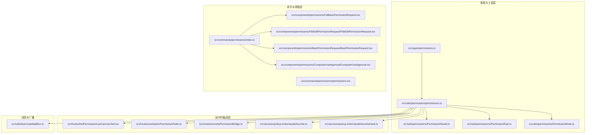
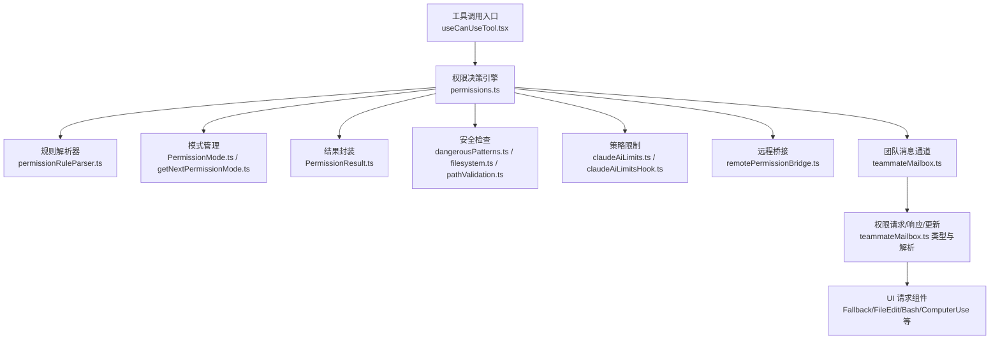
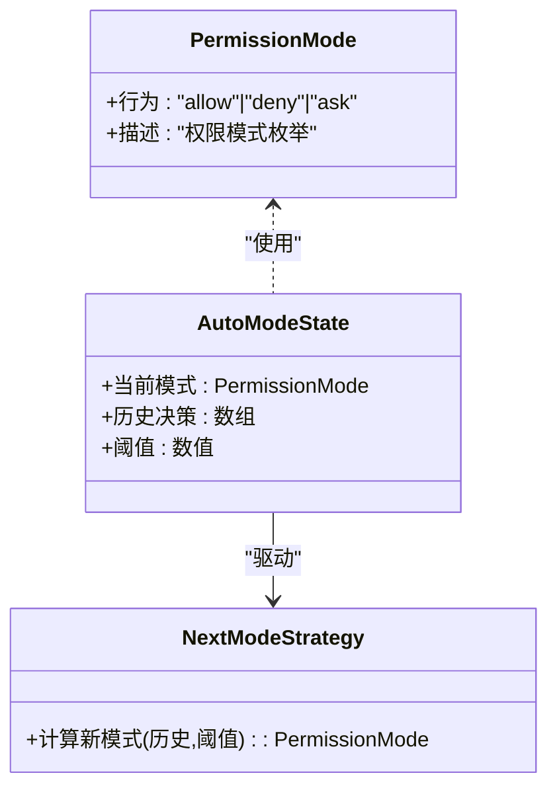
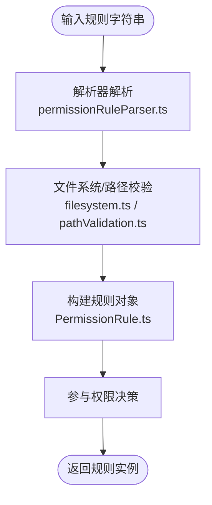
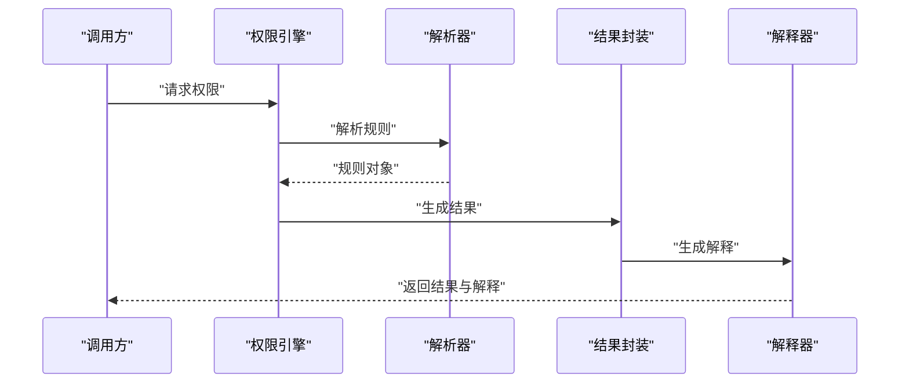
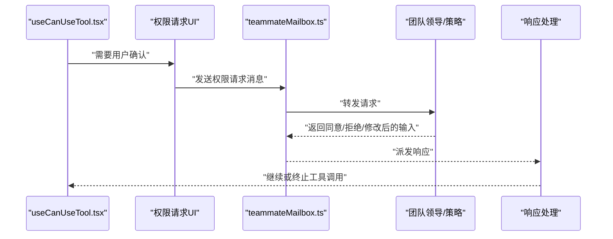
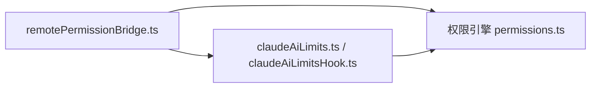
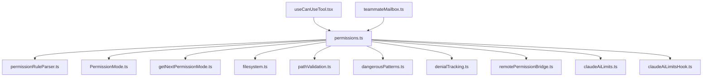

# 权限模型与架构

<cite>
**本文引用的文件**
- [src/types/permissions.ts](file://src/types/permissions.ts)
- [src/utils/permissions/permissions.ts](file://src/utils/permissions/permissions.ts)
- [src/utils/permissions/PermissionResult.ts](file://src/utils/permissions/PermissionResult.ts)
- [src/utils/permissions/PermissionRule.ts](file://src/utils/permissions/PermissionRule.ts)
- [src/utils/permissions/PermissionMode.ts](file://src/utils/permissions/PermissionMode.ts)
- [src/utils/permissions/permissionRuleParser.ts](file://src/utils/permissions/permissionRuleParser.ts)
- [src/utils/permissions/permissionSetup.ts](file://src/utils/permissions/permissionSetup.ts)
- [src/utils/permissions/autoModeState.ts](file://src/utils/permissions/autoModeState.ts)
- [src/utils/permissions/getNextPermissionMode.ts](file://src/utils/permissions/getNextPermissionMode.ts)
- [src/utils/permissions/bypassPermissionsKillswitch.ts](file://src/utils/permissions/bypassPermissionsKillswitch.ts)
- [src/utils/permissions/dangerousPatterns.ts](file://src/utils/permissions/dangerousPatterns.ts)
- [src/utils/permissions/filesystem.ts](file://src/utils/permissions/filesystem.ts)
- [src/utils/permissions/pathValidation.ts](file://src/utils/permissions/pathValidation.ts)
- [src/utils/permissions/permissionExplainer.ts](file://src/utils/permissions/permissionExplainer.ts)
- [src/utils/permissions/bashClassifier.ts](file://src/utils/permissions/bashClassifier.ts)
- [src/utils/permissions/classifierDecision.ts](file://src/utils/permissions/classifierDecision.ts)
- [src/utils/permissions/classifierShared.ts](file://src/utils/permissions/classifierShared.ts)
- [src/utils/permissions/denialTracking.ts](file://src/utils/permissions/denialTracking.ts)
- [src/utils/teammateMailbox.ts](file://src/utils/teammateMailbox.ts)
- [src/commands/permissions/index.ts](file://src/commands/permissions/index.ts)
- [src/commands/permissions/permissions.tsx](file://src/commands/permissions/permissions.tsx)
- [src/components/permissions/FallbackPermissionRequest.tsx](file://src/components/permissions/FallbackPermissionRequest.tsx)
- [src/components/permissions/FileEditPermissionRequest/FileEditPermissionRequest.tsx](file://src/components/permissions/FileEditPermissionRequest/FileEditPermissionRequest.tsx)
- [src/components/permissions/BashPermissionRequest/BashPermissionRequest.tsx](file://src/components/permissions/BashPermissionRequest/BashPermissionRequest.tsx)
- [src/components/permissions/ComputerUseApproval/ComputerUseApproval.tsx](file://src/components/permissions/ComputerUseApproval/ComputerUseApproval.tsx)
- [src/hooks/toolPermission/useCanUseTool.tsx](file://src/hooks/toolPermission/useCanUseTool.tsx)
- [src/hooks/useSwarmPermissionPoller.ts](file://src/hooks/useSwarmPermissionPoller.ts)
- [src/remote/remotePermissionBridge.ts](file://src/remote/remotePermissionBridge.ts)
- [src/services/policyLimits/claudeAiLimits.ts](file://src/services/policyLimits/claudeAiLimits.ts)
- [src/services/policyLimits/claudeAiLimitsHook.ts](file://src/services/policyLimits/claudeAiLimitsHook.ts)
</cite>

## 目录
1. [引言](#引言)
2. [项目结构](#项目结构)
3. [核心组件](#核心组件)
4. [架构总览](#架构总览)
5. [详细组件分析](#详细组件分析)
6. [依赖分析](#依赖分析)
7. [性能考虑](#性能考虑)
8. [故障排查指南](#故障排查指南)
9. [结论](#结论)
10. [附录](#附录)

## 引言
本文件系统性阐述 Claude Code 的权限模型与架构，聚焦于权限模式定义、权限结果处理与权限规则管理；解释权限模型的数据结构（权限类型、权限级别与继承关系）；梳理权限解析器、权限验证器与权限缓存机制；并提供扩展点与自定义权限类型的开发指南及性能优化建议。内容基于仓库中权限相关源码进行归纳总结，确保可追溯至具体实现文件。

## 项目结构
权限体系在代码库中分布于以下区域：
- 类型与工具层：位于 src/types 与 src/utils/permissions，定义权限数据结构、规则、模式与通用处理逻辑
- 命令与界面层：位于 src/commands/permissions 与 src/components/permissions，提供权限配置与交互式请求/审批 UI
- 运行时集成层：位于 hooks、远程桥接、服务策略等模块，负责在工具调用、沙箱、会话与团队协作场景中执行权限决策
- 消息与广播：通过 src/utils/teammateMailbox.ts 提供跨进程/跨组件的消息通道，支持权限请求、响应与团队级权限更新

图表来源
- [src/types/permissions.ts](file://src/types/permissions.ts)
- [src/utils/permissions/permissions.ts](file://src/utils/permissions/permissions.ts)
- [src/utils/permissions/PermissionResult.ts](file://src/utils/permissions/PermissionResult.ts)
- [src/utils/permissions/PermissionRule.ts](file://src/utils/permissions/PermissionRule.ts)
- [src/utils/permissions/PermissionMode.ts](file://src/utils/permissions/PermissionMode.ts)
- [src/commands/permissions/index.ts](file://src/commands/permissions/index.ts)
- [src/commands/permissions/permissions.tsx](file://src/commands/permissions/permissions.tsx)
- [src/components/permissions/FallbackPermissionRequest.tsx](file://src/components/permissions/FallbackPermissionRequest.tsx)
- [src/components/permissions/FileEditPermissionRequest/FileEditPermissionRequest.tsx](file://src/components/permissions/FileEditPermissionRequest/FileEditPermissionRequest.tsx)
- [src/components/permissions/BashPermissionRequest/BashPermissionRequest.tsx](file://src/components/permissions/BashPermissionRequest/BashPermissionRequest.tsx)
- [src/components/permissions/ComputerUseApproval/ComputerUseApproval.tsx](file://src/components/permissions/ComputerUseApproval/ComputerUseApproval.tsx)
- [src/hooks/toolPermission/useCanUseTool.tsx](file://src/hooks/toolPermission/useCanUseTool.tsx)
- [src/hooks/useSwarmPermissionPoller.ts](file://src/hooks/useSwarmPermissionPoller.ts)
- [src/remote/remotePermissionBridge.ts](file://src/remote/remotePermissionBridge.ts)
- [src/services/policyLimits/claudeAiLimits.ts](file://src/services/policyLimits/claudeAiLimits.ts)
- [src/services/policyLimits/claudeAiLimitsHook.ts](file://src/services/policyLimits/claudeAiLimitsHook.ts)
- [src/utils/teammateMailbox.ts](file://src/utils/teammateMailbox.ts)

章节来源
- [src/types/permissions.ts](file://src/types/permissions.ts)
- [src/utils/permissions/permissions.ts](file://src/utils/permissions/permissions.ts)
- [src/utils/permissions/PermissionResult.ts](file://src/utils/permissions/PermissionResult.ts)
- [src/utils/permissions/PermissionRule.ts](file://src/utils/permissions/PermissionRule.ts)
- [src/utils/permissions/PermissionMode.ts](file://src/utils/permissions/PermissionMode.ts)
- [src/commands/permissions/index.ts](file://src/commands/permissions/index.ts)
- [src/commands/permissions/permissions.tsx](file://src/commands/permissions/permissions.tsx)
- [src/components/permissions/FallbackPermissionRequest.tsx](file://src/components/permissions/FallbackPermissionRequest.tsx)
- [src/components/permissions/FileEditPermissionRequest/FileEditPermissionRequest.tsx](file://src/components/permissions/FileEditPermissionRequest/FileEditPermissionRequest.tsx)
- [src/components/permissions/BashPermissionRequest/BashPermissionRequest.tsx](file://src/components/permissions/BashPermissionRequest/BashPermissionRequest.tsx)
- [src/components/permissions/ComputerUseApproval/ComputerUseApproval.tsx](file://src/components/permissions/ComputerUseApproval/ComputerUseApproval.tsx)
- [src/hooks/toolPermission/useCanUseTool.tsx](file://src/hooks/toolPermission/useCanUseTool.tsx)
- [src/hooks/useSwarmPermissionPoller.ts](file://src/hooks/useSwarmPermissionPoller.ts)
- [src/remote/remotePermissionBridge.ts](file://src/remote/remotePermissionBridge.ts)
- [src/services/policyLimits/claudeAiLimits.ts](file://src/services/policyLimits/claudeAiLimits.ts)
- [src/services/policyLimits/claudeAiLimitsHook.ts](file://src/services/policyLimits/claudeAiLimitsHook.ts)
- [src/utils/teammateMailbox.ts](file://src/utils/teammateMailbox.ts)

## 核心组件
- 权限类型与模式
  - 权限模式（PermissionMode）用于控制权限行为（如允许、拒绝、询问），由模式解析与切换逻辑驱动
  - 权限类型与级别在类型定义中统一建模，支撑不同工具与资源的授权判定
- 权限规则与解析
  - 规则对象（PermissionRule）描述针对特定工具或资源的授权条件
  - 解析器（permissionRuleParser）将规则字符串解析为可执行的规则对象
- 权限结果与处理
  - 结果对象（PermissionResult）封装一次权限决策的最终状态与上下文信息
  - 处理流程包含决策、解释、记录与传播
- 权限设置与自动模式
  - 初始化与设置（permissionSetup）负责加载默认策略与用户配置
  - 自动模式状态（autoModeState）与模式切换（getNextPermissionMode）用于动态调整权限策略
- 安全与合规
  - 危险模式识别（dangerousPatterns）、文件系统限制（filesystem）、路径校验（pathValidation）
  - 拒绝追踪（denialTracking）与绕过开关（bypassPermissionsKillswitch）

章节来源
- [src/utils/permissions/PermissionMode.ts](file://src/utils/permissions/PermissionMode.ts)
- [src/utils/permissions/PermissionRule.ts](file://src/utils/permissions/PermissionRule.ts)
- [src/utils/permissions/permissionRuleParser.ts](file://src/utils/permissions/permissionRuleParser.ts)
- [src/utils/permissions/PermissionResult.ts](file://src/utils/permissions/PermissionResult.ts)
- [src/utils/permissions/permissionSetup.ts](file://src/utils/permissions/permissionSetup.ts)
- [src/utils/permissions/autoModeState.ts](file://src/utils/permissions/autoModeState.ts)
- [src/utils/permissions/getNextPermissionMode.ts](file://src/utils/permissions/getNextPermissionMode.ts)
- [src/utils/permissions/dangerousPatterns.ts](file://src/utils/permissions/dangerousPatterns.ts)
- [src/utils/permissions/filesystem.ts](file://src/utils/permissions/filesystem.ts)
- [src/utils/permissions/pathValidation.ts](file://src/utils/permissions/pathValidation.ts)
- [src/utils/permissions/denialTracking.ts](file://src/utils/permissions/denialTracking.ts)
- [src/utils/permissions/bypassPermissionsKillswitch.ts](file://src/utils/permissions/bypassPermissionsKillswitch.ts)

## 架构总览
权限系统围绕“模式-规则-结果”三元组构建，贯穿工具调用前的预检、运行时的沙箱拦截、团队协作中的广播与同步，以及策略限制与远程桥接。

图表来源
- [src/hooks/toolPermission/useCanUseTool.tsx](file://src/hooks/toolPermission/useCanUseTool.tsx)
- [src/utils/permissions/permissions.ts](file://src/utils/permissions/permissions.ts)
- [src/utils/permissions/permissionRuleParser.ts](file://src/utils/permissions/permissionRuleParser.ts)
- [src/utils/permissions/PermissionMode.ts](file://src/utils/permissions/PermissionMode.ts)
- [src/utils/permissions/getNextPermissionMode.ts](file://src/utils/permissions/getNextPermissionMode.ts)
- [src/utils/permissions/PermissionResult.ts](file://src/utils/permissions/PermissionResult.ts)
- [src/utils/permissions/dangerousPatterns.ts](file://src/utils/permissions/dangerousPatterns.ts)
- [src/utils/permissions/filesystem.ts](file://src/utils/permissions/filesystem.ts)
- [src/utils/permissions/pathValidation.ts](file://src/utils/permissions/pathValidation.ts)
- [src/services/policyLimits/claudeAiLimits.ts](file://src/services/policyLimits/claudeAiLimits.ts)
- [src/services/policyLimits/claudeAiLimitsHook.ts](file://src/services/policyLimits/claudeAiLimitsHook.ts)
- [src/remote/remotePermissionBridge.ts](file://src/remote/remotePermissionBridge.ts)
- [src/utils/teammateMailbox.ts](file://src/utils/teammateMailbox.ts)
- [src/components/permissions/FallbackPermissionRequest.tsx](file://src/components/permissions/FallbackPermissionRequest.tsx)
- [src/components/permissions/FileEditPermissionRequest/FileEditPermissionRequest.tsx](file://src/components/permissions/FileEditPermissionRequest/FileEditPermissionRequest.tsx)
- [src/components/permissions/BashPermissionRequest/BashPermissionRequest.tsx](file://src/components/permissions/BashPermissionRequest/BashPermissionRequest.tsx)
- [src/components/permissions/ComputerUseApproval/ComputerUseApproval.tsx](file://src/components/permissions/ComputerUseApproval/ComputerUseApproval.tsx)

## 详细组件分析

### 权限模式与自动模式
- 权限模式（PermissionMode）定义了系统对某类权限请求的总体策略：允许、拒绝或询问
- 自动模式状态（autoModeState）与模式切换（getNextPermissionMode）根据历史决策与环境变化动态调整模式
- 模式切换逻辑结合拒绝追踪（denialTracking）与策略限制（policyLimits）以平衡安全与可用性

图表来源
- [src/utils/permissions/PermissionMode.ts](file://src/utils/permissions/PermissionMode.ts)
- [src/utils/permissions/autoModeState.ts](file://src/utils/permissions/autoModeState.ts)
- [src/utils/permissions/getNextPermissionMode.ts](file://src/utils/permissions/getNextPermissionMode.ts)
- [src/utils/permissions/denialTracking.ts](file://src/utils/permissions/denialTracking.ts)

章节来源
- [src/utils/permissions/PermissionMode.ts](file://src/utils/permissions/PermissionMode.ts)
- [src/utils/permissions/autoModeState.ts](file://src/utils/permissions/autoModeState.ts)
- [src/utils/permissions/getNextPermissionMode.ts](file://src/utils/permissions/getNextPermissionMode.ts)
- [src/utils/permissions/denialTracking.ts](file://src/utils/permissions/denialTracking.ts)

### 权限规则与解析器
- 规则对象（PermissionRule）承载针对工具/资源的授权条件，支持按工具名、路径、网络主机等维度匹配
- 解析器（permissionRuleParser）将规则字符串转换为可执行的规则对象，便于后续决策
- 文件系统与路径校验（filesystem、pathValidation）在规则生效前进行安全约束

图表来源
- [src/utils/permissions/permissionRuleParser.ts](file://src/utils/permissions/permissionRuleParser.ts)
- [src/utils/permissions/PermissionRule.ts](file://src/utils/permissions/PermissionRule.ts)
- [src/utils/permissions/filesystem.ts](file://src/utils/permissions/filesystem.ts)
- [src/utils/permissions/pathValidation.ts](file://src/utils/permissions/pathValidation.ts)

章节来源
- [src/utils/permissions/PermissionRule.ts](file://src/utils/permissions/PermissionRule.ts)
- [src/utils/permissions/permissionRuleParser.ts](file://src/utils/permissions/permissionRuleParser.ts)
- [src/utils/permissions/filesystem.ts](file://src/utils/permissions/filesystem.ts)
- [src/utils/permissions/pathValidation.ts](file://src/utils/permissions/pathValidation.ts)

### 权限结果与处理
- 结果对象（PermissionResult）封装一次权限决策的最终状态、原因与上下文，便于日志、解释与回溯
- 权限解释器（permissionExplainer）将结果转化为可读提示，辅助用户理解决策依据
- 拒绝追踪（denialTracking）记录被拒绝的请求，为自动模式切换与策略优化提供数据

图表来源
- [src/utils/permissions/permissions.ts](file://src/utils/permissions/permissions.ts)
- [src/utils/permissions/PermissionResult.ts](file://src/utils/permissions/PermissionResult.ts)
- [src/utils/permissions/permissionExplainer.ts](file://src/utils/permissions/permissionExplainer.ts)

章节来源
- [src/utils/permissions/PermissionResult.ts](file://src/utils/permissions/PermissionResult.ts)
- [src/utils/permissions/permissionExplainer.ts](file://src/utils/permissions/permissionExplainer.ts)
- [src/utils/permissions/denialTracking.ts](file://src/utils/permissions/denialTracking.ts)

### 工具权限钩子与 UI 请求
- 工具权限钩子（useCanUseTool.tsx）在工具调用前进行权限预检，决定是否放行或触发请求
- UI 请求组件（FallbackPermissionRequest、FileEditPermissionRequest、BashPermissionRequest、ComputerUseApproval）提供交互式确认与输入预览
- 团队消息通道（teammateMailbox.ts）支持跨组件的权限请求/响应与团队级权限更新广播

图表来源
- [src/hooks/toolPermission/useCanUseTool.tsx](file://src/hooks/toolPermission/useCanUseTool.tsx)
- [src/components/permissions/FallbackPermissionRequest.tsx](file://src/components/permissions/FallbackPermissionRequest.tsx)
- [src/components/permissions/FileEditPermissionRequest/FileEditPermissionRequest.tsx](file://src/components/permissions/FileEditPermissionRequest/FileEditPermissionRequest.tsx)
- [src/components/permissions/BashPermissionRequest/BashPermissionRequest.tsx](file://src/components/permissions/BashPermissionRequest/BashPermissionRequest.tsx)
- [src/components/permissions/ComputerUseApproval/ComputerUseApproval.tsx](file://src/components/permissions/ComputerUseApproval/ComputerUseApproval.tsx)
- [src/utils/teammateMailbox.ts](file://src/utils/teammateMailbox.ts)

章节来源
- [src/hooks/toolPermission/useCanUseTool.tsx](file://src/hooks/toolPermission/useCanUseTool.tsx)
- [src/utils/teammateMailbox.ts](file://src/utils/teammateMailbox.ts)
- [src/components/permissions/FallbackPermissionRequest.tsx](file://src/components/permissions/FallbackPermissionRequest.tsx)
- [src/components/permissions/FileEditPermissionRequest/FileEditPermissionRequest.tsx](file://src/components/permissions/FileEditPermissionRequest/FileEditPermissionRequest.tsx)
- [src/components/permissions/BashPermissionRequest/BashPermissionRequest.tsx](file://src/components/permissions/BashPermissionRequest/BashPermissionRequest.tsx)
- [src/components/permissions/ComputerUseApproval/ComputerUseApproval.tsx](file://src/components/permissions/ComputerUseApproval/ComputerUseApproval.tsx)

### 远程桥接与策略限制
- 远程桥接（remotePermissionBridge.ts）在远端会话中传递权限策略与决策，保证本地与远端一致
- 策略限制（claudeAiLimits.ts / claudeAiLimitsHook.ts）对工具使用频率、并发数等进行硬性约束，作为权限决策的前置条件

图表来源
- [src/remote/remotePermissionBridge.ts](file://src/remote/remotePermissionBridge.ts)
- [src/services/policyLimits/claudeAiLimits.ts](file://src/services/policyLimits/claudeAiLimits.ts)
- [src/services/policyLimits/claudeAiLimitsHook.ts](file://src/services/policyLimits/claudeAiLimitsHook.ts)
- [src/utils/permissions/permissions.ts](file://src/utils/permissions/permissions.ts)

章节来源
- [src/remote/remotePermissionBridge.ts](file://src/remote/remotePermissionBridge.ts)
- [src/services/policyLimits/claudeAiLimits.ts](file://src/services/policyLimits/claudeAiLimits.ts)
- [src/services/policyLimits/claudeAiLimitsHook.ts](file://src/services/policyLimits/claudeAiLimitsHook.ts)

## 依赖分析
- 组件耦合
  - 权限引擎（permissions.ts）是核心枢纽，依赖解析器、模式管理、安全检查与策略限制
  - 钩子与 UI 仅依赖引擎输出，保持低耦合
  - 团队消息通道为广播式依赖，不形成强耦合环
- 外部依赖
  - 远程桥接与策略限制作为外部集成点，通过接口契约与引擎解耦
- 循环依赖
  - 当前结构未见循环导入；若新增规则解析与解释器互引，需重构为单向依赖

图表来源
- [src/utils/permissions/permissions.ts](file://src/utils/permissions/permissions.ts)
- [src/utils/permissions/permissionRuleParser.ts](file://src/utils/permissions/permissionRuleParser.ts)
- [src/utils/permissions/PermissionMode.ts](file://src/utils/permissions/PermissionMode.ts)
- [src/utils/permissions/getNextPermissionMode.ts](file://src/utils/permissions/getNextPermissionMode.ts)
- [src/utils/permissions/filesystem.ts](file://src/utils/permissions/filesystem.ts)
- [src/utils/permissions/pathValidation.ts](file://src/utils/permissions/pathValidation.ts)
- [src/utils/permissions/dangerousPatterns.ts](file://src/utils/permissions/dangerousPatterns.ts)
- [src/utils/permissions/denialTracking.ts](file://src/utils/permissions/denialTracking.ts)
- [src/remote/remotePermissionBridge.ts](file://src/remote/remotePermissionBridge.ts)
- [src/services/policyLimits/claudeAiLimits.ts](file://src/services/policyLimits/claudeAiLimits.ts)
- [src/services/policyLimits/claudeAiLimitsHook.ts](file://src/services/policyLimits/claudeAiLimitsHook.ts)
- [src/hooks/toolPermission/useCanUseTool.tsx](file://src/hooks/toolPermission/useCanUseTool.tsx)
- [src/utils/teammateMailbox.ts](file://src/utils/teammateMailbox.ts)

章节来源
- [src/utils/permissions/permissions.ts](file://src/utils/permissions/permissions.ts)
- [src/hooks/toolPermission/useCanUseTool.tsx](file://src/hooks/toolPermission/useCanUseTool.tsx)
- [src/utils/teammateMailbox.ts](file://src/utils/teammateMailbox.ts)

## 性能考虑
- 规则解析与缓存
  - 将解析后的规则对象缓存，避免重复解析带来的 CPU 开销
  - 对常用规则（如文件读写、网络访问）建立索引，加速匹配
- 决策路径优化
  - 在工具调用前快速失败（如策略限制直接拒绝），减少后续开销
  - 使用短路逻辑优先判断高概率拒绝的规则
- UI 与消息
  - 将权限请求 UI 的渲染与网络请求分离，避免阻塞主线程
  - 团队消息通道采用批量/去抖策略，降低广播风暴
- 自动模式与拒绝追踪
  - 合理设置拒绝阈值与时间窗口，避免频繁模式切换导致的抖动
- 跨进程/远程
  - 远程桥接采用增量同步与版本化消息，减少带宽与处理压力

## 故障排查指南
- 常见问题定位
  - 规则解析失败：检查规则字符串格式与解析器兼容性
  - 权限结果异常：核对 PermissionResult 的上下文字段与解释器映射
  - 模式切换异常：检查 autoModeState 与 getNextPermissionMode 的阈值配置
  - 团队权限未生效：确认 teammateMailbox 的消息类型与接收端处理逻辑
- 日志与追踪
  - 启用 denialTracking 与危险模式检测日志，定位高频拒绝与潜在风险
  - 使用 permissionExplainer 输出人类可读的解释，辅助用户与运维排障
- 临时绕过
  - 在测试环境可启用 bypassPermissionsKillswitch，但需谨慎评估安全风险

章节来源
- [src/utils/permissions/denialTracking.ts](file://src/utils/permissions/denialTracking.ts)
- [src/utils/permissions/permissionExplainer.ts](file://src/utils/permissions/permissionExplainer.ts)
- [src/utils/permissions/bypassPermissionsKillswitch.ts](file://src/utils/permissions/bypassPermissionsKillswitch.ts)
- [src/utils/teammateMailbox.ts](file://src/utils/teammateMailbox.ts)

## 结论
Claude Code 的权限模型以“模式-规则-结果”为核心，结合安全检查、策略限制与团队广播，实现了从工具调用到远程会话的全链路权限治理。通过模块化的工具与清晰的扩展点，系统既保证了安全性，又兼顾了可用性与可维护性。建议在生产环境中强化规则缓存、优化决策路径，并完善自动化与可观测性能力。

## 附录

### 数据结构速览
- 权限类型与级别
  - 权限类型：工具类、文件类、网络类、系统类等
  - 权限级别：允许、拒绝、询问、严格限制
- 权限继承关系
  - 会话级规则可继承至团队成员
  - 团队级规则可广播至所有会话
  - 远程会话遵循远程桥接的策略覆盖

章节来源
- [src/types/permissions.ts](file://src/types/permissions.ts)
- [src/utils/permissions/PermissionRule.ts](file://src/utils/permissions/PermissionRule.ts)
- [src/utils/permissions/PermissionMode.ts](file://src/utils/permissions/PermissionMode.ts)
- [src/utils/teammateMailbox.ts](file://src/utils/teammateMailbox.ts)

### 扩展点与自定义权限类型开发指南
- 新增权限类型
  - 在类型定义中扩展权限类别与级别
  - 在权限引擎中增加对应决策分支
- 新增规则类型
  - 定义规则字段与匹配逻辑
  - 实现解析器与安全校验
- 新增 UI 请求组件
  - 参考现有组件（如 FileEditPermissionRequest、BashPermissionRequest）的结构与交互
  - 通过 teammateMailbox 发送/接收消息，保持一致性
- 新增自动模式策略
  - 在 autoModeState 中维护状态，在 getNextPermissionMode 中实现切换逻辑
- 最佳实践
  - 保持规则最小化与可解释性
  - 为每类权限提供清晰的解释文案
  - 通过策略限制与危险模式检测提升鲁棒性

章节来源
- [src/types/permissions.ts](file://src/types/permissions.ts)
- [src/utils/permissions/permissions.ts](file://src/utils/permissions/permissions.ts)
- [src/utils/permissions/permissionRuleParser.ts](file://src/utils/permissions/permissionRuleParser.ts)
- [src/utils/permissions/PermissionResult.ts](file://src/utils/permissions/PermissionResult.ts)
- [src/utils/permissions/autoModeState.ts](file://src/utils/permissions/autoModeState.ts)
- [src/utils/permissions/getNextPermissionMode.ts](file://src/utils/permissions/getNextPermissionMode.ts)
- [src/components/permissions/FileEditPermissionRequest/FileEditPermissionRequest.tsx](file://src/components/permissions/FileEditPermissionRequest/FileEditPermissionRequest.tsx)
- [src/components/permissions/BashPermissionRequest/BashPermissionRequest.tsx](file://src/components/permissions/BashPermissionRequest/BashPermissionRequest.tsx)
- [src/utils/teammateMailbox.ts](file://src/utils/teammateMailbox.ts)