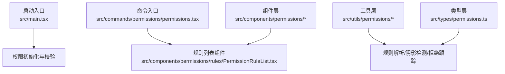
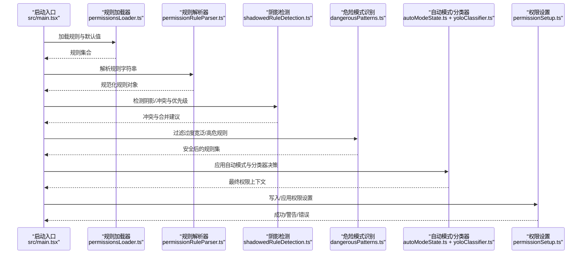
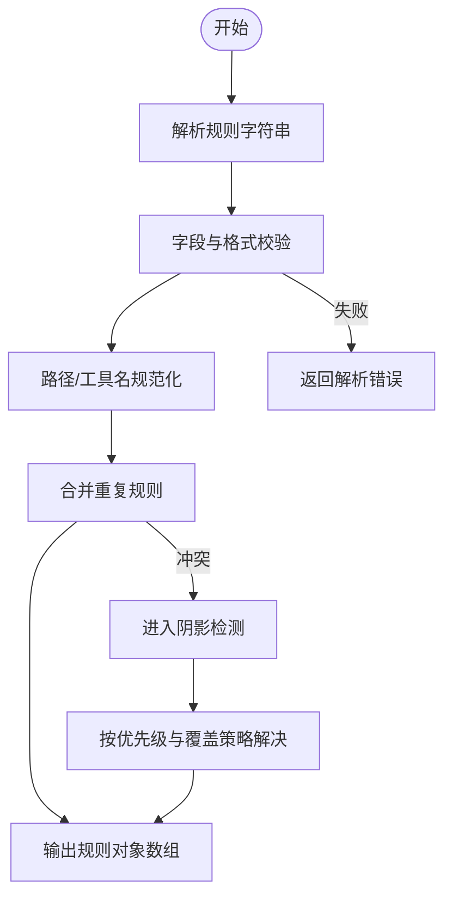
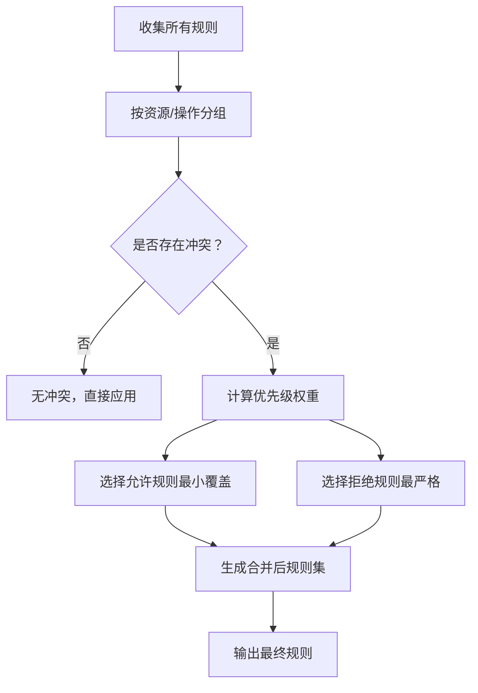
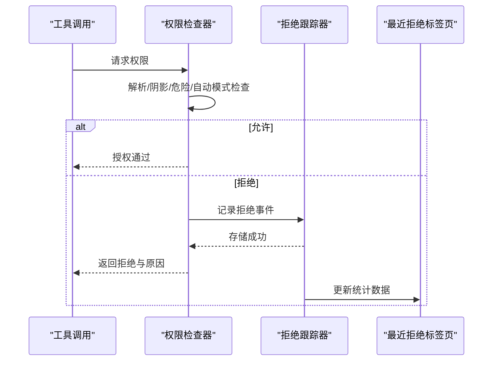
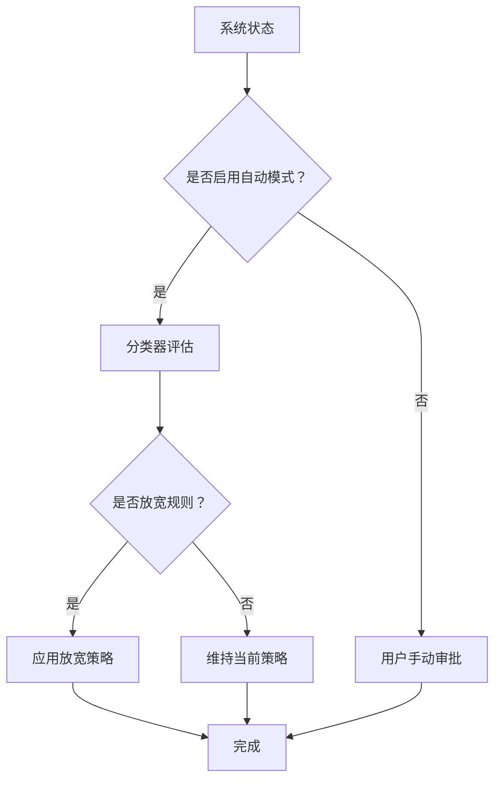
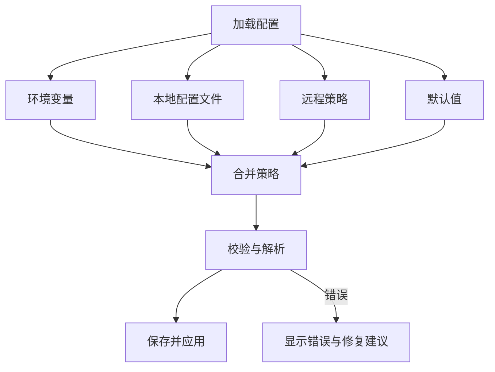
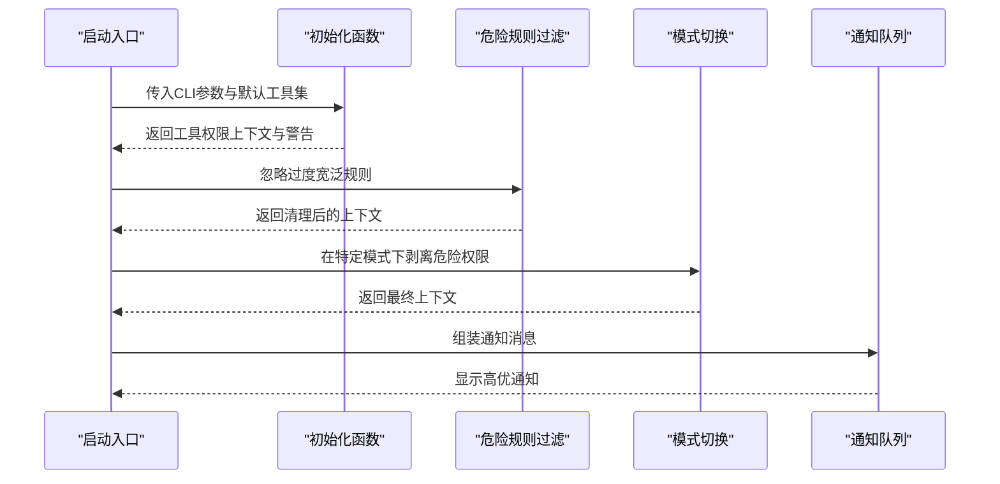
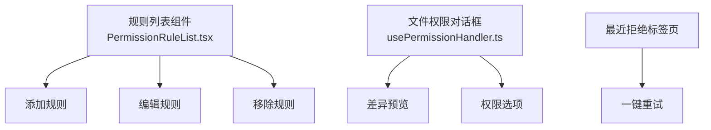
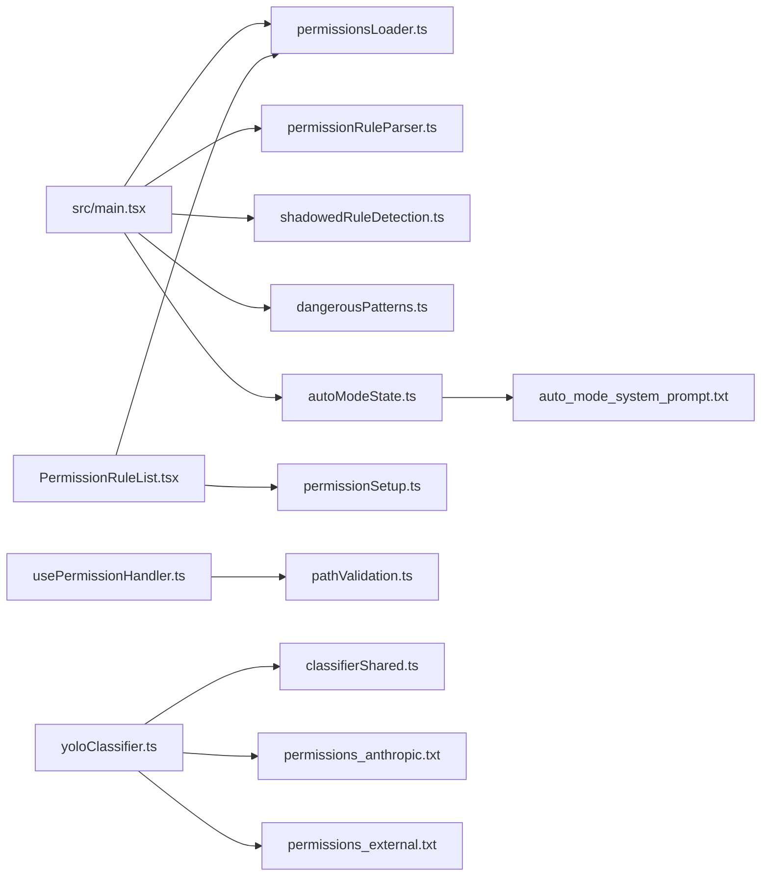

# 权限管理与配置

<cite>
**本文引用的文件**
- [src/main.tsx](file://src/main.tsx)
- [src/commands/permissions/permissions.tsx](file://src/commands/permissions/permissions.tsx)
- [src/components/permissions/rules/PermissionRuleList.tsx](file://src/components/permissions/rules/PermissionRuleList.tsx)
- [src/components/permissions/FilePermissionDialog/usePermissionHandler.ts](file://src/components/permissions/FilePermissionDialog/usePermissionHandler.ts)
- [src/utils/permissions/permissions.ts](file://src/utils/permissions/permissions.ts)
- [src/utils/permissions/permissionRuleParser.ts](file://src/utils/permissions/permissionRuleParser.ts)
- [src/utils/permissions/shadowedRuleDetection.ts](file://src/utils/permissions/shadowedRuleDetection.ts)
- [src/utils/permissions/denialTracking.ts](file://src/utils/permissions/denialTracking.ts)
- [src/utils/permissions/permissionSetup.ts](file://src/utils/permissions/permissionSetup.ts)
- [src/utils/permissions/permissionsLoader.ts](file://src/utils/permissions/permissionsLoader.ts)
- [src/utils/permissions/autoModeState.ts](file://src/utils/permissions/autoModeState.ts)
- [src/utils/permissions/getNextPermissionMode.ts](file://src/utils/permissions/getNextPermissionMode.ts)
- [src/utils/permissions/bypassPermissionsKillswitch.ts](file://src/utils/permissions/bypassPermissionsKillswitch.ts)
- [src/utils/permissions/dangerousPatterns.ts](file://src/utils/permissions/dangerousPatterns.ts)
- [src/utils/permissions/yoloClassifier.ts](file://src/utils/permissions/yoloClassifier.ts)
- [src/utils/permissions/bashClassifier.ts](file://src/utils/permissions/bashClassifier.ts)
- [src/utils/permissions/classifierDecision.ts](file://src/utils/permissions/classifierDecision.ts)
- [src/utils/permissions/classifierShared.ts](file://src/utils/permissions/classifierShared.ts)
- [src/utils/permissions/PermissionMode.ts](file://src/utils/permissions/PermissionMode.ts)
- [src/utils/permissions/PermissionResult.ts](file://src/utils/permissions/PermissionResult.ts)
- [src/utils/permissions/PermissionRule.ts](file://src/utils/permissions/PermissionRule.ts)
- [src/utils/permissions/PermissionUpdate.ts](file://src/utils/permissions/PermissionUpdate.ts)
- [src/utils/permissions/PermissionUpdateSchema.ts](file://src/utils/permissions/PermissionUpdateSchema.ts)
- [src/utils/permissions/PermissionPromptToolResultSchema.ts](file://src/utils/permissions/PermissionPromptToolResultSchema.ts)
- [src/utils/permissions/pathValidation.ts](file://src/utils/permissions/pathValidation.ts)
- [src/utils/permissions/shellPermissionHelpers.tsx](file://src/utils/permissions/shellPermissionHelpers.tsx)
- [src/utils/permissions/shellRuleMatching.ts](file://src/utils/permissions/shellRuleMatching.ts)
- [src/utils/permissions/permissionExplainer.ts](file://src/utils/permissions/permissionExplainer.ts)
- [src/utils/permissions/yolo-classifier-prompts/permissions_anthropic.txt](file://src/utils/permissions/yolo-classifier-prompts/permissions_anthropic.txt)
- [src/utils/permissions/yolo-classifier-prompts/permissions_external.txt](file://src/utils/permissions/yolo-classifier-prompts/permissions_external.txt)
- [src/utils/permissions/yolo-classifier-prompts/auto_mode_system_prompt.txt](file://src/utils/permissions/yolo-classifier-prompts/auto_mode_system_prompt.txt)
- [src/types/permissions.ts](file://src/types/permissions.ts)
</cite>

## 目录
1. [简介](#简介)
2. [项目结构](#项目结构)
3. [核心组件](#核心组件)
4. [架构总览](#架构总览)
5. [详细组件分析](#详细组件分析)
6. [依赖关系分析](#依赖关系分析)
7. [性能考量](#性能考量)
8. [故障排除指南](#故障排除指南)
9. [结论](#结论)
10. [附录](#附录)

## 简介
本文件系统性梳理 Claude Code 的权限管理与配置体系，覆盖权限规则的定义、解析、应用与执行；阴影规则检测（冲突识别、优先级与合并策略）；权限拒绝跟踪（拒绝原因记录、统计与报告）；以及最佳实践、配置模板与排障建议。目标是帮助开发者与运维人员在不深入源码的前提下，理解并正确配置权限系统。

## 项目结构
权限相关代码主要分布在以下区域：
- 启动与初始化：应用启动时加载与校验权限上下文，处理过度宽泛的规则与危险模式。
- 命令入口：权限规则列表命令入口，驱动 UI 展示与重试流程。
- 组件层：权限请求对话框、规则编辑与工作区管理等 UI 组件。
- 工具层：权限规则解析器、阴影规则检测、拒绝跟踪、自动模式状态机、分类器与危险模式识别等。
- 类型层：权限规则、结果、更新、模式等类型定义。

图表来源
- [src/main.tsx:1750-2916](file://src/main.tsx#L1750-L2916)
- [src/commands/permissions/permissions.tsx:1-9](file://src/commands/permissions/permissions.tsx#L1-L9)
- [src/components/permissions/rules/PermissionRuleList.tsx](file://src/components/permissions/rules/PermissionRuleList.tsx)
- [src/utils/permissions/permissions.ts](file://src/utils/permissions/permissions.ts)
- [src/types/permissions.ts](file://src/types/permissions.ts)

章节来源
- [src/main.tsx:1750-2916](file://src/main.tsx#L1750-L2916)
- [src/commands/permissions/permissions.tsx:1-9](file://src/commands/permissions/permissions.tsx#L1-L9)

## 核心组件
- 权限规则解析器：负责将用户输入或配置文件中的规则字符串解析为内部规则对象，进行语法与语义校验，并输出标准化的规则集合。
- 阴影规则检测：在多条规则存在时，识别冲突与覆盖关系，确定优先级与合并策略，避免意外授权。
- 拒绝跟踪：记录每次权限决策的拒绝原因、触发条件与上下文，支持统计与报告生成。
- 自动模式与分类器：根据系统策略与历史数据，动态调整权限模式与风险判定，降低人工干预。
- 危险模式识别：识别过度宽泛或高危的规则（如通配符脚本执行），在特定渠道或模式下进行屏蔽或降级。
- 规则加载与设置：从本地配置、环境变量或远程源加载规则，提供默认值与回退策略。

章节来源
- [src/utils/permissions/permissionRuleParser.ts](file://src/utils/permissions/permissionRuleParser.ts)
- [src/utils/permissions/shadowedRuleDetection.ts](file://src/utils/permissions/shadowedRuleDetection.ts)
- [src/utils/permissions/denialTracking.ts](file://src/utils/permissions/denialTracking.ts)
- [src/utils/permissions/permissionsLoader.ts](file://src/utils/permissions/permissionsLoader.ts)
- [src/utils/permissions/permissionSetup.ts](file://src/utils/permissions/permissionSetup.ts)
- [src/utils/permissions/autoModeState.ts](file://src/utils/permissions/autoModeState.ts)
- [src/utils/permissions/yoloClassifier.ts](file://src/utils/permissions/yoloClassifier.ts)
- [src/utils/permissions/bashClassifier.ts](file://src/utils/permissions/bashClassifier.ts)
- [src/utils/permissions/dangerousPatterns.ts](file://src/utils/permissions/dangerousPatterns.ts)

## 架构总览
权限系统的运行链路如下：
- 启动阶段：加载规则、执行解析与阴影检测、应用危险模式过滤与自动模式策略，生成最终的工具权限上下文。
- 运行阶段：当工具调用需要权限时，触发权限请求对话框或自动决策，记录拒绝原因并可生成报告。
- 配置阶段：通过命令界面查看与编辑规则，支持添加/移除工作区目录、最近拒绝项等。

图表来源
- [src/main.tsx:1750-2916](file://src/main.tsx#L1750-L2916)
- [src/utils/permissions/permissionsLoader.ts](file://src/utils/permissions/permissionsLoader.ts)
- [src/utils/permissions/permissionRuleParser.ts](file://src/utils/permissions/permissionRuleParser.ts)
- [src/utils/permissions/shadowedRuleDetection.ts](file://src/utils/permissions/shadowedRuleDetection.ts)
- [src/utils/permissions/dangerousPatterns.ts](file://src/utils/permissions/dangerousPatterns.ts)
- [src/utils/permissions/autoModeState.ts](file://src/utils/permissions/autoModeState.ts)
- [src/utils/permissions/yoloClassifier.ts](file://src/utils/permissions/yoloClassifier.ts)
- [src/utils/permissions/permissionSetup.ts](file://src/utils/permissions/permissionSetup.ts)

## 详细组件分析

### 权限规则解析器
职责与流程：
- 输入：规则字符串（含语法与注释）、上下文信息（如工作区路径、工具名）。
- 处理：词法/语法分析、字段校验、默认值填充、路径规范化。
- 输出：标准化规则对象数组，包含匹配条件、允许/拒绝动作、优先级标记等。

图表来源
- [src/utils/permissions/permissionRuleParser.ts](file://src/utils/permissions/permissionRuleParser.ts)
- [src/utils/permissions/shadowedRuleDetection.ts](file://src/utils/permissions/shadowedRuleDetection.ts)

章节来源
- [src/utils/permissions/permissionRuleParser.ts](file://src/utils/permissions/permissionRuleParser.ts)
- [src/utils/permissions/shadowedRuleDetection.ts](file://src/utils/permissions/shadowedRuleDetection.ts)

### 阴影规则检测与优先级
- 冲突识别：当多条规则对同一资源/操作产生相反动作时，触发冲突检测。
- 优先级策略：基于规则来源（用户/默认/远程）、时间戳、精确度（更具体的路径/工具名优先）等综合排序。
- 合并策略：保留“允许”规则时，尽可能合并为最小覆盖集合；对“拒绝”规则，采用最严格原则。
- 输出：冲突清单、建议的合并方案与最终规则集。

图表来源
- [src/utils/permissions/shadowedRuleDetection.ts](file://src/utils/permissions/shadowedRuleDetection.ts)

章节来源
- [src/utils/permissions/shadowedRuleDetection.ts](file://src/utils/permissions/shadowedRuleDetection.ts)

### 权限拒绝跟踪系统
- 记录内容：触发时间、工具名、资源路径、拒绝原因（语法/阴影/危险/自动模式限制）、决策者（用户/自动）。
- 统计维度：按工具、路径前缀、时间窗口、拒绝原因聚合。
- 报告生成：导出 CSV/PDF，支持筛选与可视化。
- UI 集成：最近拒绝标签页展示高频拒绝与可修复建议。

图表来源
- [src/utils/permissions/denialTracking.ts](file://src/utils/permissions/denialTracking.ts)
- [src/components/permissions/rules/RecentDenialsTab.tsx](file://src/components/permissions/rules/RecentDenialsTab.tsx)

章节来源
- [src/utils/permissions/denialTracking.ts](file://src/utils/permissions/denialTracking.ts)
- [src/components/permissions/rules/RecentDenialsTab.tsx](file://src/components/permissions/rules/RecentDenialsTab.tsx)

### 自动模式与分类器
- 自动模式：根据产品策略与用户行为，自动切换到更安全/更宽松的模式，减少人工干预。
- 分类器：基于提示词与历史数据，判断是否应放宽某些规则或提升拒绝阈值。
- 危险模式：在特定渠道（如 Ant）或模式下，屏蔽过度宽泛的脚本执行规则。

图表来源
- [src/utils/permissions/autoModeState.ts](file://src/utils/permissions/autoModeState.ts)
- [src/utils/permissions/yoloClassifier.ts](file://src/utils/permissions/yoloClassifier.ts)
- [src/utils/permissions/bashClassifier.ts](file://src/utils/permissions/bashClassifier.ts)
- [src/utils/permissions/classifierDecision.ts](file://src/utils/permissions/classifierDecision.ts)
- [src/utils/permissions/classifierShared.ts](file://src/utils/permissions/classifierShared.ts)
- [src/utils/permissions/dangerousPatterns.ts](file://src/utils/permissions/dangerousPatterns.ts)

章节来源
- [src/utils/permissions/autoModeState.ts](file://src/utils/permissions/autoModeState.ts)
- [src/utils/permissions/yoloClassifier.ts](file://src/utils/permissions/yoloClassifier.ts)
- [src/utils/permissions/bashClassifier.ts](file://src/utils/permissions/bashClassifier.ts)
- [src/utils/permissions/classifierDecision.ts](file://src/utils/permissions/classifierDecision.ts)
- [src/utils/permissions/classifierShared.ts](file://src/utils/permissions/classifierShared.ts)
- [src/utils/permissions/dangerousPatterns.ts](file://src/utils/permissions/dangerousPatterns.ts)

### 规则加载与设置
- 加载顺序：环境变量 → 本地配置文件 → 远程策略 → 默认值。
- 设置应用：写入持久化存储，触发重新解析与阴影检测，更新 UI 与通知。
- 错误处理：语法错误、冲突未解、危险规则被忽略等情况均需给出明确反馈。

图表来源
- [src/utils/permissions/permissionsLoader.ts](file://src/utils/permissions/permissionsLoader.ts)
- [src/utils/permissions/permissionSetup.ts](file://src/utils/permissions/permissionSetup.ts)

章节来源
- [src/utils/permissions/permissionsLoader.ts](file://src/utils/permissions/permissionsLoader.ts)
- [src/utils/permissions/permissionSetup.ts](file://src/utils/permissions/permissionSetup.ts)

### 启动期权限初始化与校验
- 初始化：构建工具权限上下文，合并 CLI 传入的允许/禁止/基础工具集。
- 危险规则处理：对过度宽泛的脚本执行规则进行忽略与日志记录；在特定模式下剥离危险权限。
- 通知与提示：向用户展示权限模式通知、弃用警告与过度宽泛规则忽略提示。

图表来源
- [src/main.tsx:1750-2916](file://src/main.tsx#L1750-L2916)

章节来源
- [src/main.tsx:1750-2916](file://src/main.tsx#L1750-L2916)

### 权限规则 UI 与交互
- 规则列表：展示当前规则、来源、状态与操作（编辑/删除/添加）。
- 文件权限对话框：针对文件读写/编辑场景，提供差异预览与权限选项。
- 最近拒绝标签页：汇总拒绝原因与修复建议，支持一键重试。

图表来源
- [src/components/permissions/rules/PermissionRuleList.tsx](file://src/components/permissions/rules/PermissionRuleList.tsx)
- [src/components/permissions/FilePermissionDialog/usePermissionHandler.ts](file://src/components/permissions/FilePermissionDialog/usePermissionHandler.ts)
- [src/components/permissions/rules/RecentDenialsTab.tsx](file://src/components/permissions/rules/RecentDenialsTab.tsx)

章节来源
- [src/components/permissions/rules/PermissionRuleList.tsx](file://src/components/permissions/rules/PermissionRuleList.tsx)
- [src/components/permissions/FilePermissionDialog/usePermissionHandler.ts](file://src/components/permissions/FilePermissionDialog/usePermissionHandler.ts)
- [src/components/permissions/rules/RecentDenialsTab.tsx](file://src/components/permissions/rules/RecentDenialsTab.tsx)

## 依赖关系分析
- 启动入口依赖规则加载器、解析器、阴影检测、危险模式识别与自动模式模块。
- 规则列表组件依赖权限设置与加载器，同时与拒绝跟踪集成。
- 文件权限对话框依赖路径校验与权限处理器。
- 分类器与自动模式依赖共享状态与提示词模板。

图表来源
- [src/main.tsx:1750-2916](file://src/main.tsx#L1750-L2916)
- [src/utils/permissions/permissionsLoader.ts](file://src/utils/permissions/permissionsLoader.ts)
- [src/utils/permissions/permissionRuleParser.ts](file://src/utils/permissions/permissionRuleParser.ts)
- [src/utils/permissions/shadowedRuleDetection.ts](file://src/utils/permissions/shadowedRuleDetection.ts)
- [src/utils/permissions/dangerousPatterns.ts](file://src/utils/permissions/dangerousPatterns.ts)
- [src/utils/permissions/autoModeState.ts](file://src/utils/permissions/autoModeState.ts)
- [src/components/permissions/rules/PermissionRuleList.tsx](file://src/components/permissions/rules/PermissionRuleList.tsx)
- [src/utils/permissions/permissionSetup.ts](file://src/utils/permissions/permissionSetup.ts)
- [src/components/permissions/FilePermissionDialog/usePermissionHandler.ts](file://src/components/permissions/FilePermissionDialog/usePermissionHandler.ts)
- [src/utils/permissions/pathValidation.ts](file://src/utils/permissions/pathValidation.ts)
- [src/utils/permissions/yoloClassifier.ts](file://src/utils/permissions/yoloClassifier.ts)
- [src/utils/permissions/classifierShared.ts](file://src/utils/permissions/classifierShared.ts)
- [src/utils/permissions/yolo-classifier-prompts/permissions_anthropic.txt](file://src/utils/permissions/yolo-classifier-prompts/permissions_anthropic.txt)
- [src/utils/permissions/yolo-classifier-prompts/permissions_external.txt](file://src/utils/permissions/yolo-classifier-prompts/permissions_external.txt)
- [src/utils/permissions/yolo-classifier-prompts/auto_mode_system_prompt.txt](file://src/utils/permissions/yolo-classifier-prompts/auto_mode_system_prompt.txt)

章节来源
- [src/main.tsx:1750-2916](file://src/main.tsx#L1750-L2916)
- [src/components/permissions/rules/PermissionRuleList.tsx](file://src/components/permissions/rules/PermissionRuleList.tsx)
- [src/components/permissions/FilePermissionDialog/usePermissionHandler.ts](file://src/components/permissions/FilePermissionDialog/usePermissionHandler.ts)
- [src/utils/permissions/yolo-classifier-prompts/permissions_anthropic.txt](file://src/utils/permissions/yolo-classifier-prompts/permissions_anthropic.txt)
- [src/utils/permissions/yolo-classifier-prompts/permissions_external.txt](file://src/utils/permissions/yolo-classifier-prompts/permissions_external.txt)
- [src/utils/permissions/yolo-classifier-prompts/auto_mode_system_prompt.txt](file://src/utils/permissions/yolo-classifier-prompts/auto_mode_system_prompt.txt)

## 性能考量
- 解析与阴影检测：规则数量较多时，建议分批处理与缓存中间结果，避免阻塞主线程。
- 拒绝跟踪：批量写入与异步落盘，定期压缩历史数据，控制内存占用。
- 自动模式：分类器推理尽量复用上下文，减少重复 IO；在高延迟网络下增加本地缓存。
- UI 渲染：规则列表与最近拒绝标签页采用虚拟滚动与懒加载，降低大列表渲染压力。

## 故障排除指南
常见问题与处理：
- 规则解析失败
  - 现象：命令报错，提示规则语法错误。
  - 排查：检查规则字符串格式、字段拼写与注释符号；确认路径与工具名规范。
  - 参考：解析器与路径校验模块。
- 阴影冲突未解决
  - 现象：规则看似生效但被其他规则覆盖。
  - 排查：查看阴影检测输出，调整规则优先级或合并策略；精简匹配范围。
  - 参考：阴影检测与合并策略。
- 过度宽泛规则被忽略
  - 现象：脚本执行规则未生效，出现忽略通知。
  - 排查：替换通配符为具体命令或路径；在自动模式下重新评估。
  - 参考：危险模式识别与自动模式。
- 拒绝频繁发生
  - 现象：某工具/路径频繁被拒绝。
  - 排查：查看最近拒绝标签页，按原因优化规则；必要时临时放宽。
  - 参考：拒绝跟踪与规则列表。
- 启动后权限异常
  - 现象：启动时报权限模式或危险权限相关通知。
  - 排查：检查 CLI 参数与环境变量；核对远程策略与本地配置的合并结果。
  - 参考：启动初始化与权限设置。

章节来源
- [src/utils/permissions/permissionRuleParser.ts](file://src/utils/permissions/permissionRuleParser.ts)
- [src/utils/permissions/shadowedRuleDetection.ts](file://src/utils/permissions/shadowedRuleDetection.ts)
- [src/utils/permissions/dangerousPatterns.ts](file://src/utils/permissions/dangerousPatterns.ts)
- [src/utils/permissions/denialTracking.ts](file://src/utils/permissions/denialTracking.ts)
- [src/utils/permissions/permissionSetup.ts](file://src/utils/permissions/permissionSetup.ts)
- [src/main.tsx:1750-2916](file://src/main.tsx#L1750-L2916)

## 结论
该权限系统以“可解析、可检测、可追踪、可自动”为核心设计目标，通过规则解析器、阴影检测与拒绝跟踪形成闭环，结合自动模式与分类器实现智能化治理。建议在生产环境中遵循最小授权原则、定期审计规则与拒绝统计，并利用自动模式与分类器降低维护成本。

## 附录

### 权限规则配置模板
- 基础模板
  - 工具名：必填，精确或通配。
  - 路径前缀：可选，用于限制文件系统访问范围。
  - 动作：允许/拒绝。
  - 优先级：显式声明或由系统推断。
  - 来源：用户/默认/远程。
- 示例（描述性）
  - 允许编辑特定工作区内的 .md 文件，拒绝全局写入。
  - 允许有限的脚本工具在受控路径下运行，拒绝通配符。
  - 在自动模式下，对高风险工具默认拒绝，等待人工二次确认。

### 最佳实践
- 最小授权：优先使用具体路径与工具名，避免通配符。
- 分层治理：将通用规则置于默认层，业务规则置于用户层，紧急策略置于远程层。
- 定期审计：通过拒绝统计与最近拒绝标签页识别高频问题并优化规则。
- 自动与人工结合：在自动模式下保持严格，在需要时提供快速人工审批通道。
- 文档化：为每条规则标注来源、目的与变更历史，便于追溯。