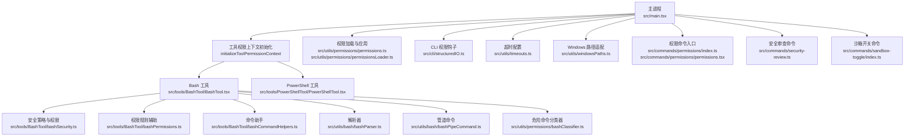
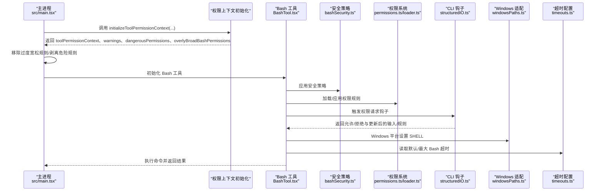
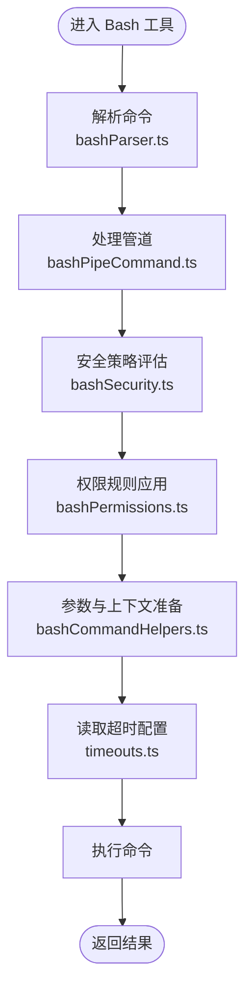
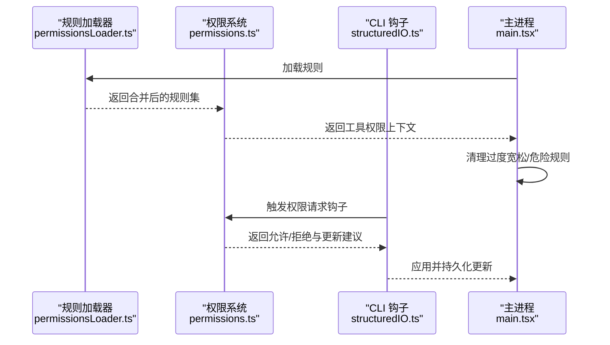
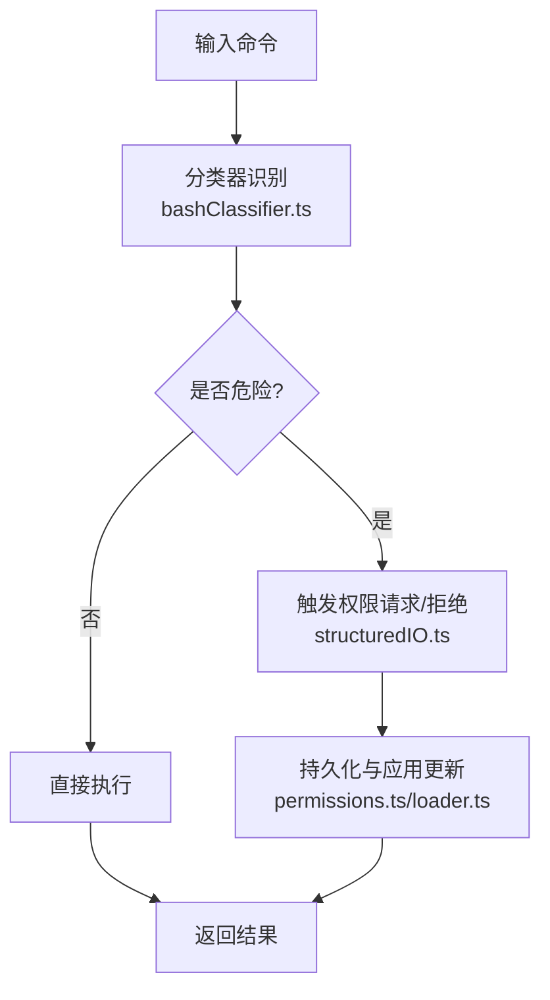
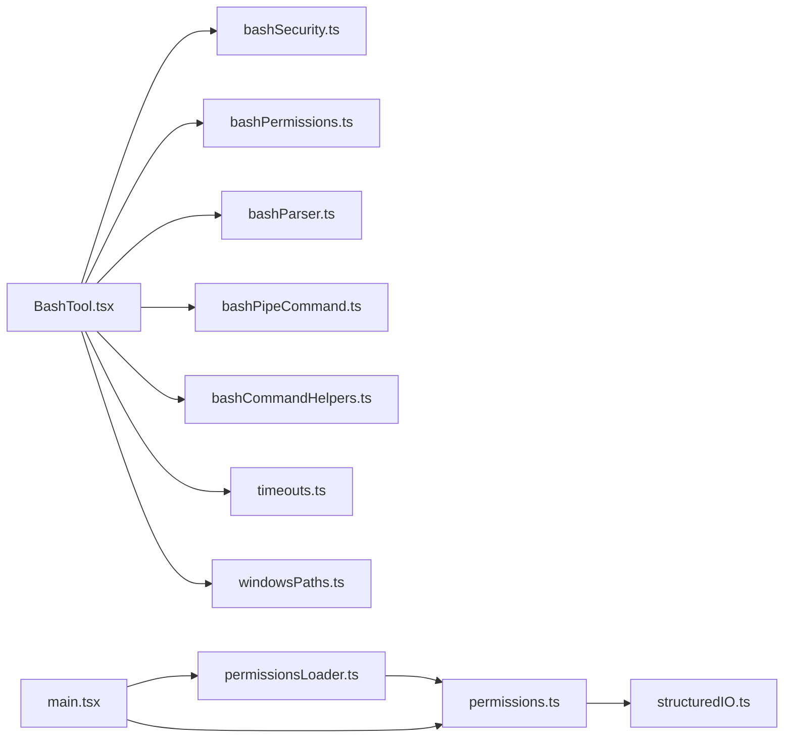

# Shell 命令权限

<cite>
**本文引用的文件**
- [src/main.tsx](file://src/main.tsx)
- [src/setup.ts](file://src/setup.ts)
- [src/tools/BashTool/BashTool.tsx](file://src/tools/BashTool/BashTool.tsx)
- [src/tools/BashTool/bashSecurity.ts](file://src/tools/BashTool/bashSecurity.ts)
- [src/tools/BashTool/bashPermissions.ts](file://src/tools/BashTool/bashPermissions.ts)
- [src/tools/BashTool/bashCommandHelpers.ts](file://src/tools/BashTool/bashCommandHelpers.ts)
- [src/utils/bash/bashParser.ts](file://src/utils/bash/bashParser.ts)
- [src/utils/bash/bashPipeCommand.ts](file://src/utils/bash/bashPipeCommand.ts)
- [src/utils/permissions/bashClassifier.ts](file://src/utils/permissions/bashClassifier.ts)
- [src/utils/permissions/permissions.ts](file://src/utils/permissions/permissions.ts)
- [src/utils/permissions/permissionsLoader.ts](file://src/utils/permissions/permissionsLoader.ts)
- [src/utils/timeouts.ts](file://src/utils/timeouts.ts)
- [src/utils/windowsPaths.ts](file://src/utils/windowsPaths.ts)
- [src/commands/permissions/permissions.tsx](file://src/commands/permissions/permissions.tsx)
- [src/commands/permissions/index.ts](file://src/commands/permissions/index.ts)
- [src/cli/structuredIO.ts](file://src/cli/structuredIO.ts)
- [src/commands/security-review.ts](file://src/commands/security-review.ts)
- [src/commands/sandbox-toggle/index.ts](file://src/commands/sandbox-toggle/index.ts)
- [src/commands.ts](file://src/commands.ts)
</cite>

## 目录
1. [简介](#简介)
2. [项目结构](#项目结构)
3. [核心组件](#核心组件)
4. [架构总览](#架构总览)
5. [详细组件分析](#详细组件分析)
6. [依赖关系分析](#依赖关系分析)
7. [性能考量](#性能考量)
8. [故障排查指南](#故障排查指南)
9. [结论](#结论)
10. [附录](#附录)

## 简介
本文件系统性梳理 Claude Code 中 Shell（Bash 与 PowerShell）命令权限体系，覆盖命令白名单、危险命令检测、权限验证流程、命令解析器安全检查、参数过滤、执行上下文限制、危险命令模式识别、命令历史验证、权限升级控制、配置方法与自定义规则开发、以及安全审计与异常处理机制。目标是帮助开发者与运维人员在理解现有实现的基础上，正确配置与扩展 Shell 权限控制。

## 项目结构
围绕 Shell 权限的关键模块分布如下：
- 启动与初始化：主进程负责加载工具权限上下文、移除过度宽松规则、在特定特性下剥离危险规则。
- 工具层：BashTool 与 PowerShellTool 提供命令执行能力；BashTool 内含安全策略与权限辅助。
- 解析与分类：bashParser、bashPipeCommand 负责命令解析与管道处理；bashClassifier 用于危险命令分类。
- 权限系统：permissions.ts 与 permissionsLoader.ts 负责规则加载与应用；CLI 层通过 structuredIO 协调权限钩子与更新。
- 平台适配：timeouts.ts 提供 Bash 超时配置；windowsPaths.ts 在 Windows 上设置 SHELL 环境变量以使用 Git-Bash。
- 配置与管理：commands/permissions 提供规则列表与重试消息；security-review 支持在提示中执行并注入允许规则；sandbox-toggle 提供沙箱开关与自动放行策略。

图表来源
- [src/main.tsx:1750-1777](file://src/main.tsx#L1750-L1777)
- [src/tools/BashTool/BashTool.tsx](file://src/tools/BashTool/BashTool.tsx)
- [src/tools/BashTool/bashSecurity.ts](file://src/tools/BashTool/bashSecurity.ts)
- [src/tools/BashTool/bashPermissions.ts](file://src/tools/BashTool/bashPermissions.ts)
- [src/tools/BashTool/bashCommandHelpers.ts](file://src/tools/BashTool/bashCommandHelpers.ts)
- [src/utils/bash/bashParser.ts](file://src/utils/bash/bashParser.ts)
- [src/utils/bash/bashPipeCommand.ts](file://src/utils/bash/bashPipeCommand.ts)
- [src/utils/permissions/bashClassifier.ts](file://src/utils/permissions/bashClassifier.ts)
- [src/utils/permissions/permissions.ts](file://src/utils/permissions/permissions.ts)
- [src/utils/permissions/permissionsLoader.ts](file://src/utils/permissions/permissionsLoader.ts)
- [src/utils/timeouts.ts](file://src/utils/timeouts.ts)
- [src/utils/windowsPaths.ts](file://src/utils/windowsPaths.ts)
- [src/commands/permissions/index.ts](file://src/commands/permissions/index.ts)
- [src/commands/permissions/permissions.tsx](file://src/commands/permissions/permissions.tsx)
- [src/cli/structuredIO.ts](file://src/cli/structuredIO.ts)
- [src/commands/security-review.ts](file://src/commands/security-review.ts)
- [src/commands/sandbox-toggle/index.ts](file://src/commands/sandbox-toggle/index.ts)

章节来源
- [src/main.tsx:1750-1777](file://src/main.tsx#L1750-L1777)
- [src/commands.ts:662-698](file://src/commands.ts#L662-L698)

## 核心组件
- 工具权限上下文初始化与清理
  - 主进程在启动时调用 initializeToolPermissionContext 构建初始上下文，并对“过度宽松”的 Bash/PowerShell 规则进行忽略或移除；在特定特性开启时剥离危险规则。
  - 对于“外部”用户（ant），若存在过度宽松的 Bash/PowerShell 允许规则，会记录调试日志并从上下文中移除，确保安全基线。
- Bash 工具
  - 提供命令执行、安全策略评估、权限规则辅助与命令助手等能力，贯穿解析、过滤、执行与结果处理。
- PowerShell 工具
  - 提供与 Bash 类似的权限控制与执行框架，面向 Windows 环境。
- 权限系统
  - permissions.ts 与 permissionsLoader.ts 负责规则加载、合并、应用与持久化；structuredIO 通过钩子协调权限请求与更新。
- 安全分类器
  - bashClassifier 用于识别潜在危险命令模式，作为安全审查与权限决策依据。
- 平台适配
  - timeouts.ts 提供 Bash 默认与最大超时配置；windowsPaths.ts 在 Windows 设置 SHELL 环境变量以使用 Git-Bash。
- 配置与管理
  - commands/permissions 提供规则列表与重试消息；security-review 可在提示中执行命令并临时注入允许规则；sandbox-toggle 提供沙箱开关与自动放行策略。

章节来源
- [src/main.tsx:1750-1777](file://src/main.tsx#L1750-L1777)
- [src/tools/BashTool/BashTool.tsx](file://src/tools/BashTool/BashTool.tsx)
- [src/utils/permissions/permissions.ts](file://src/utils/permissions/permissions.ts)
- [src/utils/permissions/permissionsLoader.ts](file://src/utils/permissions/permissionsLoader.ts)
- [src/utils/permissions/bashClassifier.ts](file://src/utils/permissions/bashClassifier.ts)
- [src/utils/timeouts.ts](file://src/utils/timeouts.ts)
- [src/utils/windowsPaths.ts](file://src/utils/windowsPaths.ts)
- [src/commands/permissions/index.ts](file://src/commands/permissions/index.ts)
- [src/commands/permissions/permissions.tsx](file://src/commands/permissions/permissions.tsx)
- [src/cli/structuredIO.ts](file://src/cli/structuredIO.ts)
- [src/commands/security-review.ts](file://src/commands/security-review.ts)
- [src/commands/sandbox-toggle/index.ts](file://src/commands/sandbox-toggle/index.ts)

## 架构总览
下图展示从启动到命令执行的权限控制路径，包括规则初始化、危险规则清理、权限钩子与更新、以及平台适配。

图表来源
- [src/main.tsx:1750-1777](file://src/main.tsx#L1750-L1777)
- [src/tools/BashTool/BashTool.tsx](file://src/tools/BashTool/BashTool.tsx)
- [src/tools/BashTool/bashSecurity.ts](file://src/tools/BashTool/bashSecurity.ts)
- [src/utils/permissions/permissions.ts](file://src/utils/permissions/permissions.ts)
- [src/utils/permissions/permissionsLoader.ts](file://src/utils/permissions/permissionsLoader.ts)
- [src/cli/structuredIO.ts](file://src/cli/structuredIO.ts)
- [src/utils/windowsPaths.ts](file://src/utils/windowsPaths.ts)
- [src/utils/timeouts.ts](file://src/utils/timeouts.ts)

## 详细组件分析

### Bash 工具与安全策略
- 安全策略与权限
  - bashSecurity.ts 提供危险命令检测与策略评估，结合 bashPermissions.ts 的规则辅助，形成命令执行前的前置校验。
  - bashCommandHelpers.ts 提供命令构建、参数转义与上下文准备，降低注入风险。
- 命令解析与管道
  - bashParser.ts 将原始输入解析为命令树，支持多段管线；bashPipeCommand.ts 处理管道连接与错误传播。
- 执行上下文与超时
  - timeouts.ts 提供默认与最大 Bash 超时配置，避免长时间运行命令造成资源占用。
  - windowsPaths.ts 在 Windows 平台设置 SHELL 环境变量指向 Git-Bash，保证跨平台一致性。

图表来源
- [src/tools/BashTool/BashTool.tsx](file://src/tools/BashTool/BashTool.tsx)
- [src/tools/BashTool/bashSecurity.ts](file://src/tools/BashTool/bashSecurity.ts)
- [src/tools/BashTool/bashPermissions.ts](file://src/tools/BashTool/bashPermissions.ts)
- [src/tools/BashTool/bashCommandHelpers.ts](file://src/tools/BashTool/bashCommandHelpers.ts)
- [src/utils/bash/bashParser.ts](file://src/utils/bash/bashParser.ts)
- [src/utils/bash/bashPipeCommand.ts](file://src/utils/bash/bashPipeCommand.ts)
- [src/utils/timeouts.ts](file://src/utils/timeouts.ts)

章节来源
- [src/tools/BashTool/BashTool.tsx](file://src/tools/BashTool/BashTool.tsx)
- [src/tools/BashTool/bashSecurity.ts](file://src/tools/BashTool/bashSecurity.ts)
- [src/tools/BashTool/bashPermissions.ts](file://src/tools/BashTool/bashPermissions.ts)
- [src/tools/BashTool/bashCommandHelpers.ts](file://src/tools/BashTool/bashCommandHelpers.ts)
- [src/utils/bash/bashParser.ts](file://src/utils/bash/bashParser.ts)
- [src/utils/bash/bashPipeCommand.ts](file://src/utils/bash/bashPipeCommand.ts)
- [src/utils/timeouts.ts](file://src/utils/timeouts.ts)
- [src/utils/windowsPaths.ts](file://src/utils/windowsPaths.ts)

### 权限系统与规则加载
- 规则加载与应用
  - permissionsLoader.ts 负责从配置源加载规则，合并 CLI 传入的允许/禁止规则与基础规则集。
  - permissions.ts 提供规则合并、冲突解决与持久化接口，确保规则在会话间一致生效。
- CLI 钩子与动态更新
  - structuredIO.ts 在权限请求阶段触发钩子，根据钩子返回的更新建议（updatedPermissions）持久化并应用到当前工具权限上下文。
- 启动时清理与安全基线
  - main.tsx 在启动时对“过度宽松”的 Bash/PowerShell 规则进行忽略或移除，并在特定特性开启时剥离危险规则，确保安全基线。

图表来源
- [src/utils/permissions/permissionsLoader.ts](file://src/utils/permissions/permissionsLoader.ts)
- [src/utils/permissions/permissions.ts](file://src/utils/permissions/permissions.ts)
- [src/cli/structuredIO.ts](file://src/cli/structuredIO.ts)
- [src/main.tsx:1750-1777](file://src/main.tsx#L1750-L1777)

章节来源
- [src/utils/permissions/permissionsLoader.ts](file://src/utils/permissions/permissionsLoader.ts)
- [src/utils/permissions/permissions.ts](file://src/utils/permissions/permissions.ts)
- [src/cli/structuredIO.ts](file://src/cli/structuredIO.ts)
- [src/main.tsx:1750-1777](file://src/main.tsx#L1750-L1777)

### 危险命令模式识别与安全审查
- 分类器
  - bashClassifier.ts 用于识别潜在危险命令模式，作为安全审查与权限决策的重要依据。
- 安全审查命令
  - security-review.ts 支持在提示中执行命令，并可临时注入允许规则，便于对命令进行安全审查与输出分析。

图表来源
- [src/utils/permissions/bashClassifier.ts](file://src/utils/permissions/bashClassifier.ts)
- [src/cli/structuredIO.ts](file://src/cli/structuredIO.ts)
- [src/utils/permissions/permissions.ts](file://src/utils/permissions/permissions.ts)
- [src/utils/permissions/permissionsLoader.ts](file://src/utils/permissions/permissionsLoader.ts)
- [src/commands/security-review.ts](file://src/commands/security-review.ts)

章节来源
- [src/utils/permissions/bashClassifier.ts](file://src/utils/permissions/bashClassifier.ts)
- [src/cli/structuredIO.ts](file://src/cli/structuredIO.ts)
- [src/utils/permissions/permissions.ts](file://src/utils/permissions/permissions.ts)
- [src/utils/permissions/permissionsLoader.ts](file://src/utils/permissions/permissionsLoader.ts)
- [src/commands/security-review.ts](file://src/commands/security-review.ts)

### 权限配置与自定义规则开发
- 规则入口与界面
  - commands/permissions/index.ts 与 permissions.tsx 提供规则列表与重试消息，便于用户查看与调整。
- 动态注入允许规则
  - security-review.ts 可在提示上下文中临时注入允许规则，便于在受控场景下进行命令执行与分析。
- 沙箱策略
  - sandbox-toggle/index.ts 提供沙箱开关与自动放行策略，影响 Bash 命令的执行行为与权限判定。

章节来源
- [src/commands/permissions/index.ts](file://src/commands/permissions/index.ts)
- [src/commands/permissions/permissions.tsx](file://src/commands/permissions/permissions.tsx)
- [src/commands/security-review.ts](file://src/commands/security-review.ts)
- [src/commands/sandbox-toggle/index.ts](file://src/commands/sandbox-toggle/index.ts)

### 权限升级与环境安全
- 启动时权限模式校验
  - setup.ts 在权限模式为 bypass 或允许危险跳过时，对 root/sudo 环境进行严格校验，避免高权限环境下的安全风险。
- 远程桥接命令安全
  - commands.ts 提供远程桥接命令的安全判定与预过滤，确保仅本地 JSX 命令渲染 UI，其他类型命令需显式白名单。

章节来源
- [src/setup.ts:395-414](file://src/setup.ts#L395-L414)
- [src/commands.ts:662-698](file://src/commands.ts#L662-L698)

## 依赖关系分析
- 组件耦合
  - Bash 工具强依赖安全策略与权限系统；解析器与管道处理器独立但被 Bash 工具组合使用。
  - 权限系统与 CLI 钩子紧密协作，实现动态权限更新与持久化。
  - 启动流程对权限上下文进行统一初始化与清理，确保全局一致性。
- 外部依赖与集成点
  - Windows 平台通过 windowsPaths.ts 设置 SHELL 环境变量，确保 Bash 执行一致性。
  - 超时配置通过 timeouts.ts 注入，避免长时间阻塞。

图表来源
- [src/tools/BashTool/BashTool.tsx](file://src/tools/BashTool/BashTool.tsx)
- [src/tools/BashTool/bashSecurity.ts](file://src/tools/BashTool/bashSecurity.ts)
- [src/tools/BashTool/bashPermissions.ts](file://src/tools/BashTool/bashPermissions.ts)
- [src/tools/BashTool/bashCommandHelpers.ts](file://src/tools/BashTool/bashCommandHelpers.ts)
- [src/utils/bash/bashParser.ts](file://src/utils/bash/bashParser.ts)
- [src/utils/bash/bashPipeCommand.ts](file://src/utils/bash/bashPipeCommand.ts)
- [src/utils/permissions/permissionsLoader.ts](file://src/utils/permissions/permissionsLoader.ts)
- [src/utils/permissions/permissions.ts](file://src/utils/permissions/permissions.ts)
- [src/utils/timeouts.ts](file://src/utils/timeouts.ts)
- [src/utils/windowsPaths.ts](file://src/utils/windowsPaths.ts)
- [src/cli/structuredIO.ts](file://src/cli/structuredIO.ts)
- [src/main.tsx:1750-1777](file://src/main.tsx#L1750-L1777)

章节来源
- [src/tools/BashTool/BashTool.tsx](file://src/tools/BashTool/BashTool.tsx)
- [src/utils/permissions/permissionsLoader.ts](file://src/utils/permissions/permissionsLoader.ts)
- [src/utils/permissions/permissions.ts](file://src/utils/permissions/permissions.ts)
- [src/cli/structuredIO.ts](file://src/cli/structuredIO.ts)
- [src/main.tsx:1750-1777](file://src/main.tsx#L1750-L1777)

## 性能考量
- 超时控制
  - 使用 timeouts.ts 提供的默认与最大 Bash 超时，避免长时间运行命令导致资源耗尽。
- 启动 I/O 非阻塞
  - main.tsx 中对权限上下文初始化采用非阻塞方式，提升启动效率。
- 平台适配
  - windowsPaths.ts 在 Windows 上设置 SHELL 环境变量，减少跨平台差异带来的额外开销。

章节来源
- [src/utils/timeouts.ts:1-39](file://src/utils/timeouts.ts#L1-L39)
- [src/main.tsx:1750-1777](file://src/main.tsx#L1750-L1777)
- [src/utils/windowsPaths.ts:87-93](file://src/utils/windowsPaths.ts#L87-L93)

## 故障排查指南
- 权限被拒绝
  - 检查 CLI 钩子返回的 decision 与 updatedPermissions，确认是否需要更新规则或调整输入。
  - 使用 commands/permissions 查看当前规则状态，必要时通过重试消息进行调整。
- 过度宽松规则被忽略
  - 关注启动日志中的警告信息，确认是否存在 Bash/PowerShell 的过度宽松规则被忽略。
- Windows 平台命令失败
  - 确认 SHELL 环境变量已设置为 Git-Bash 路径，检查 windowsPaths.ts 的路径解析逻辑。
- 超时问题
  - 调整 BASH_DEFAULT_TIMEOUT_MS 与 BASH_MAX_TIMEOUT_MS 环境变量，确保符合预期。

章节来源
- [src/cli/structuredIO.ts:808-859](file://src/cli/structuredIO.ts#L808-L859)
- [src/commands/permissions/permissions.tsx:1-9](file://src/commands/permissions/permissions.tsx#L1-L9)
- [src/main.tsx:1750-1777](file://src/main.tsx#L1750-L1777)
- [src/utils/windowsPaths.ts:87-93](file://src/utils/windowsPaths.ts#L87-L93)
- [src/utils/timeouts.ts:1-39](file://src/utils/timeouts.ts#L1-L39)

## 结论
Claude Code 的 Shell 命令权限体系通过“启动时初始化与清理 + 工具层安全策略 + 解析与管道处理 + 权限系统与钩子 + 平台适配”的分层设计，实现了对 Bash 与 PowerShell 命令的可控执行。其核心在于：
- 明确的白名单与危险规则剔除机制；
- 命令解析与参数过滤的前置安全检查；
- 动态权限钩子与持久化更新；
- 超时与平台适配保障稳定性与一致性；
- 安全审查与沙箱策略增强可控性与可观测性。

## 附录
- 配置方法
  - 通过 CLI 参数传入允许/禁止规则，启动时由 initializeToolPermissionContext 合并并清理。
  - 在 Windows 环境下，确保 SHELL 指向 Git-Bash，以获得一致的 Bash 行为。
  - 使用 timeouts.ts 的环境变量调整 Bash 超时，平衡安全性与可用性。
- 自定义规则开发
  - 在 permissionsLoader.ts 中扩展规则来源，在 permissions.ts 中完善合并与冲突处理逻辑。
  - 通过 bashClassifier.ts 引入新的危险命令模式识别规则，配合 CLI 钩子实现动态更新。
- 安全审计与异常处理
  - 使用 security-review 命令在受控场景下执行命令并生成审计输出。
  - 对权限拒绝与危险规则忽略进行日志记录与告警，便于追踪与复盘。