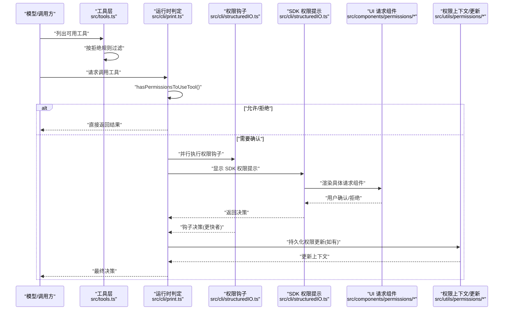
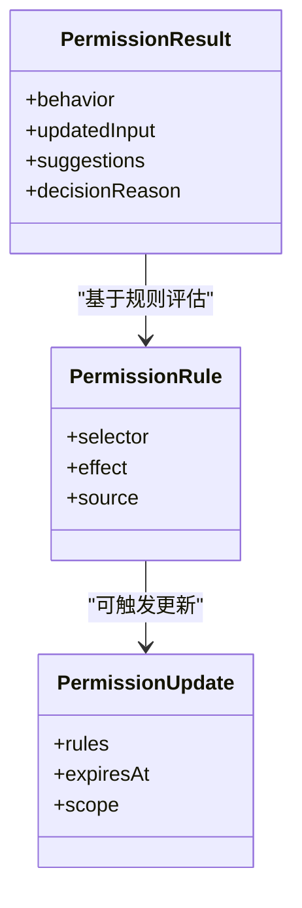
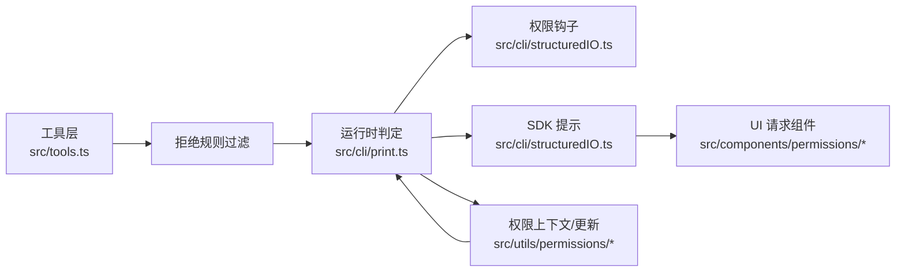

# 工具使用权限

<cite>
**本文引用的文件**
- [src/Tool.ts](file://src/Tool.ts)
- [src/tools.ts](file://src/tools.ts)
- [src/cli/print.ts](file://src/cli/print.ts)
- [src/cli/structuredIO.ts](file://src/cli/structuredIO.ts)
- [src/main.tsx](file://src/main.tsx)
- [src/utils/permissions/PermissionResult.ts](file://src/utils/permissions/PermissionResult.ts)
- [src/utils/permissions/PermissionRule.ts](file://src/utils/permissions/PermissionRule.ts)
- [src/utils/permissions/PermissionUpdate.ts](file://src/utils/permissions/PermissionUpdate.ts)
- [src/utils/permissions/PermissionPromptToolResultSchema.ts](file://src/utils/permissions/PermissionPromptToolResultSchema.ts)
- [src/utils/permissions/PermissionMode.ts](file://src/utils/permissions/PermissionMode.ts)
- [src/utils/permissions/bypassPermissionsKillswitch.ts](file://src/utils/permissions/bypassPermissionsKillswitch.ts)
- [src/utils/permissions/bashClassifier.ts](file://src/utils/permissions/bashClassifier.ts)
- [src/utils/permissions/dangerousPatterns.ts](file://src/utils/permissions/dangerousPatterns.ts)
- [src/components/permissions/BashPermissionRequest/BashPermissionRequest.tsx](file://src/components/permissions/BashPermissionRequest/BashPermissionRequest.tsx)
- [src/components/permissions/FileEditPermissionRequest/FileEditPermissionRequest.tsx](file://src/components/permissions/FileEditPermissionRequest/FileEditPermissionRequest.tsx)
- [src/components/permissions/FileWritePermissionRequest/FileWritePermissionRequest.tsx](file://src/components/permissions/FileWritePermissionRequest/FileWritePermissionRequest.tsx)
- [src/components/permissions/FilesystemPermissionRequest/FilesystemPermissionRequest.tsx](file://src/components/permissions/FilesystemPermissionRequest/FilesystemPermissionRequest.tsx)
- [src/components/permissions/MonitorPermissionRequest/MonitorPermissionRequest.tsx](file://src/components/permissions/MonitorPermissionRequest/MonitorPermissionRequest.tsx)
- [src/components/permissions/AskUserQuestionPermissionRequest/AskUserQuestionPermissionRequest.tsx](file://src/components/permissions/AskUserQuestionPermissionRequest/AskUserQuestionPermissionRequest.tsx)
- [src/components/permissions/FallbackPermissionRequest.tsx](file://src/components/permissions/FallbackPermissionRequest.tsx)
- [src/hooks/toolPermission/useCanUseTool.tsx](file://src/hooks/toolPermission/useCanUseTool.tsx)
</cite>

## 目录
1. [简介](#简介)
2. [项目结构](#项目结构)
3. [核心组件](#核心组件)
4. [架构总览](#架构总览)
5. [详细组件分析](#详细组件分析)
6. [依赖关系分析](#依赖关系分析)
7. [性能考量](#性能考量)
8. [故障排查指南](#故障排查指南)
9. [结论](#结论)
10. [附录](#附录)

## 简介
本文件系统性阐述 Claude Code 的工具使用权限体系：覆盖内置工具与自定义工具（含 MCP）的权限控制机制，包括调用前验证、参数限制、执行环境控制；给出权限分类与级别、使用范围；解释动态授权、临时授权与批量授权管理；提供配置方法与自定义权限规则开发指南；并说明安全监控与异常行为检测。

## 项目结构
权限系统围绕“工具抽象层”“权限上下文”“运行时决策”“交互式确认”“持久化更新”展开，主要分布在以下模块：
- 工具抽象与默认策略：src/Tool.ts、src/tools.ts
- 运行时权限判定与并发控制：src/cli/print.ts、src/cli/structuredIO.ts
- 权限结果与规则模型：src/utils/permissions/*
- UI 请求与反馈：src/components/permissions/*
- 主应用集成与模式切换：src/main.tsx、src/utils/permissions/PermissionMode.ts
- 安全与旁路开关：src/utils/permissions/bypassPermissionsKillswitch.ts、dangerousPatterns.ts

```mermaid
graph TB
subgraph "工具层"
Tool["Tool 抽象<br/>src/Tool.ts"]
ToolsUtil["工具过滤与匹配<br/>src/tools.ts"]
end
subgraph "权限模型"
PR["PermissionResult<br/>src/utils/permissions/PermissionResult.ts"]
PRule["PermissionRule<br/>src/utils/permissions/PermissionRule.ts"]
PUpdate["PermissionUpdate<br/>src/utils/permissions/PermissionUpdate.ts"]
PPromptSchema["PermissionPromptTool 结果模式<br/>src/utils/permissions/PermissionPromptToolResultSchema.ts"]
end
subgraph "运行时"
Print["CLI 打印与权限提示<br/>src/cli/print.ts"]
SIO["Structured IO 权限钩子与SDK请求<br/>src/cli/structuredIO.ts"]
Mode["权限模式与旁路开关<br/>src/utils/permissions/PermissionMode.ts<br/>src/utils/permissions/bypassPermissionsKillswitch.ts"]
end
subgraph "UI 请求"
BashReq["Bash 权限请求<br/>src/components/permissions/BashPermissionRequest/BashPermissionRequest.tsx"]
FileEditReq["文件编辑权限请求<br/>src/components/permissions/FileEditPermissionRequest/FileEditPermissionRequest.tsx"]
FileWriteReq["文件写入权限请求<br/>src/components/permissions/FileWritePermissionRequest/FileWritePermissionRequest.tsx"]
FSReq["文件系统权限请求<br/>src/components/permissions/FilesystemPermissionRequest/FilesystemPermissionRequest.tsx"]
MonReq["监控权限请求<br/>src/components/permissions/MonitorPermissionRequest/MonitorPermissionRequest.tsx"]
QAReq["问答权限请求<br/>src/components/permissions/AskUserQuestionPermissionRequest/AskUserQuestionPermissionRequest.tsx"]
Fallback["回退权限请求<br/>src/components/permissions/FallbackPermissionRequest.tsx"]
end
Tool --> ToolsUtil
ToolsUtil --> Print
ToolsUtil --> SIO
Print --> PR
SIO --> PR
PR --> PRule
PRule --> PUpdate
SIO --> PPromptSchema
Mode --> Print
Mode --> SIO
Print --> BashReq
Print --> FileEditReq
Print --> FileWriteReq
Print --> FSReq
Print --> MonReq
Print --> QAReq
Print --> Fallback
```

图表来源
- [src/Tool.ts:743-774](file://src/Tool.ts#L743-L774)
- [src/tools.ts:253-269](file://src/tools.ts#L253-L269)
- [src/cli/print.ts:4178-4334](file://src/cli/print.ts#L4178-L4334)
- [src/cli/structuredIO.ts:533-859](file://src/cli/structuredIO.ts#L533-L859)
- [src/utils/permissions/PermissionResult.ts](file://src/utils/permissions/PermissionResult.ts)
- [src/utils/permissions/PermissionRule.ts](file://src/utils/permissions/PermissionRule.ts)
- [src/utils/permissions/PermissionUpdate.ts](file://src/utils/permissions/PermissionUpdate.ts)
- [src/utils/permissions/PermissionPromptToolResultSchema.ts](file://src/utils/permissions/PermissionPromptToolResultSchema.ts)
- [src/utils/permissions/PermissionMode.ts](file://src/utils/permissions/PermissionMode.ts)
- [src/utils/permissions/bypassPermissionsKillswitch.ts](file://src/utils/permissions/bypassPermissionsKillswitch.ts)
- [src/components/permissions/BashPermissionRequest/BashPermissionRequest.tsx](file://src/components/permissions/BashPermissionRequest/BashPermissionRequest.tsx)
- [src/components/permissions/FileEditPermissionRequest/FileEditPermissionRequest.tsx](file://src/components/permissions/FileEditPermissionRequest/FileEditPermissionRequest.tsx)
- [src/components/permissions/FileWritePermissionRequest/FileWritePermissionRequest.tsx](file://src/components/permissions/FileWritePermissionRequest/FileWritePermissionRequest.tsx)
- [src/components/permissions/FilesystemPermissionRequest/FilesystemPermissionRequest.tsx](file://src/components/permissions/FilesystemPermissionRequest/FilesystemPermissionRequest.tsx)
- [src/components/permissions/MonitorPermissionRequest/MonitorPermissionRequest.tsx](file://src/components/permissions/MonitorPermissionRequest/MonitorPermissionRequest.tsx)
- [src/components/permissions/AskUserQuestionPermissionRequest/AskUserQuestionPermissionRequest.tsx](file://src/components/permissions/AskUserQuestionPermissionRequest/AskUserQuestionPermissionRequest.tsx)
- [src/components/permissions/FallbackPermissionRequest.tsx](file://src/components/permissions/FallbackPermissionRequest.tsx)

章节来源
- [src/Tool.ts:743-774](file://src/Tool.ts#L743-L774)
- [src/tools.ts:253-269](file://src/tools.ts#L253-L269)
- [src/cli/print.ts:4178-4334](file://src/cli/print.ts#L4178-L4334)
- [src/cli/structuredIO.ts:533-859](file://src/cli/structuredIO.ts#L533-L859)

## 核心组件
- 工具抽象与默认策略
  - 工具默认策略采用“严格闭合”原则，未显式声明的方法均返回保守值（如只读、非并发安全、非破坏性），并默认委托通用权限系统进行检查。
  - 参考路径：[src/Tool.ts:743-774](file://src/Tool.ts#L743-L774)

- 工具过滤与匹配
  - 在展示给模型前，通过“拒绝规则”对工具进行一次性过滤，支持按名称或 MCP 前缀（如 mcp__server）进行整包屏蔽，确保模型不可见被禁用的工具。
  - 参考路径：[src/tools.ts:253-269](file://src/tools.ts#L253-L269)

- 权限结果与规则
  - 权限结果包含行为（允许/拒绝/需要确认）、更新后的输入、建议与原因等。
  - 规则模型用于描述允许/拒绝条件与来源；更新模型用于在会话中动态生效。
  - 参考路径：
    - [src/utils/permissions/PermissionResult.ts](file://src/utils/permissions/PermissionResult.ts)
    - [src/utils/permissions/PermissionRule.ts](file://src/utils/permissions/PermissionRule.ts)
    - [src/utils/permissions/PermissionUpdate.ts](file://src/utils/permissions/PermissionUpdate.ts)

- 运行时权限判定
  - CLI 层在工具调用前进行权限评估，若处于“需要确认”状态，则并行触发权限钩子与 SDK 提示，以最快者为准；同时保证中断信号可被及时感知。
  - 参考路径：
    - [src/cli/print.ts:4178-4334](file://src/cli/print.ts#L4178-L4334)
    - [src/cli/structuredIO.ts:533-859](file://src/cli/structuredIO.ts#L533-L859)

- UI 权限请求
  - 针对不同工具类别提供专用 UI 请求组件（如 Bash、文件编辑、文件写入、文件系统、监控、问答等），统一接入权限流程。
  - 参考路径：
    - [src/components/permissions/BashPermissionRequest/BashPermissionRequest.tsx](file://src/components/permissions/BashPermissionRequest/BashPermissionRequest.tsx)
    - [src/components/permissions/FileEditPermissionRequest/FileEditPermissionRequest.tsx](file://src/components/permissions/FileEditPermissionRequest/FileEditPermissionRequest.tsx)
    - [src/components/permissions/FileWritePermissionRequest/FileWritePermissionRequest.tsx](file://src/components/permissions/FileWritePermissionRequest/FileWritePermissionRequest.tsx)
    - [src/components/permissions/FilesystemPermissionRequest/FilesystemPermissionRequest.tsx](file://src/components/permissions/FilesystemPermissionRequest/FilesystemPermissionRequest.tsx)
    - [src/components/permissions/MonitorPermissionRequest/MonitorPermissionRequest.tsx](file://src/components/permissions/MonitorPermissionRequest/MonitorPermissionRequest.tsx)
    - [src/components/permissions/AskUserQuestionPermissionRequest/AskUserQuestionPermissionRequest.tsx](file://src/components/permissions/AskUserQuestionPermissionRequest/AskUserQuestionPermissionRequest.tsx)
    - [src/components/permissions/FallbackPermissionRequest.tsx](file://src/components/permissions/FallbackPermissionRequest.tsx)

章节来源
- [src/Tool.ts:743-774](file://src/Tool.ts#L743-L774)
- [src/tools.ts:253-269](file://src/tools.ts#L253-L269)
- [src/utils/permissions/PermissionResult.ts](file://src/utils/permissions/PermissionResult.ts)
- [src/utils/permissions/PermissionRule.ts](file://src/utils/permissions/PermissionRule.ts)
- [src/utils/permissions/PermissionUpdate.ts](file://src/utils/permissions/PermissionUpdate.ts)
- [src/cli/print.ts:4178-4334](file://src/cli/print.ts#L4178-L4334)
- [src/cli/structuredIO.ts:533-859](file://src/cli/structuredIO.ts#L533-L859)
- [src/components/permissions/BashPermissionRequest/BashPermissionRequest.tsx](file://src/components/permissions/BashPermissionRequest/BashPermissionRequest.tsx)
- [src/components/permissions/FileEditPermissionRequest/FileEditPermissionRequest.tsx](file://src/components/permissions/FileEditPermissionRequest/FileEditPermissionRequest.tsx)
- [src/components/permissions/FileWritePermissionRequest/FileWritePermissionRequest.tsx](file://src/components/permissions/FileWritePermissionRequest/FileWritePermissionRequest.tsx)
- [src/components/permissions/FilesystemPermissionRequest/FilesystemPermissionRequest.tsx](file://src/components/permissions/FilesystemPermissionRequest/FilesystemPermissionRequest.tsx)
- [src/components/permissions/MonitorPermissionRequest/MonitorPermissionRequest.tsx](file://src/components/permissions/MonitorPermissionRequest/MonitorPermissionRequest.tsx)
- [src/components/permissions/AskUserQuestionPermissionRequest/AskUserQuestionPermissionRequest.tsx](file://src/components/permissions/AskUserQuestionPermissionRequest/AskUserQuestionPermissionRequest.tsx)
- [src/components/permissions/FallbackPermissionRequest.tsx](file://src/components/permissions/FallbackPermissionRequest.tsx)

## 架构总览
下图展示了从“工具调用请求”到“权限决策与执行”的端到端流程，涵盖拒绝规则过滤、运行时评估、并行钩子与 SDK 提示、以及权限更新的持久化与生效。

图表来源
- [src/tools.ts:253-269](file://src/tools.ts#L253-L269)
- [src/cli/print.ts:4178-4334](file://src/cli/print.ts#L4178-L4334)
- [src/cli/structuredIO.ts:533-859](file://src/cli/structuredIO.ts#L533-L859)
- [src/utils/permissions/PermissionResult.ts](file://src/utils/permissions/PermissionResult.ts)
- [src/utils/permissions/PermissionUpdate.ts](file://src/utils/permissions/PermissionUpdate.ts)
- [src/components/permissions/BashPermissionRequest/BashPermissionRequest.tsx](file://src/components/permissions/BashPermissionRequest/BashPermissionRequest.tsx)

章节来源
- [src/tools.ts:253-269](file://src/tools.ts#L253-L269)
- [src/cli/print.ts:4178-4334](file://src/cli/print.ts#L4178-L4334)
- [src/cli/structuredIO.ts:533-859](file://src/cli/structuredIO.ts#L533-L859)

## 详细组件分析

### 权限结果与规则模型
- 权限结果（PermissionResult）
  - 行为：allow/deny/needs_confirm
  - updatedInput：经钩子或用户确认后可能更新的输入
  - suggestions：建议列表（如降级操作、替代方案）
  - decisionReason：决策来源与原因
- 权限规则（PermissionRule）
  - 描述允许/拒绝条件（名称匹配、路径匹配、MCP 前缀等）
  - 来源（如策略文件、管理员设置、自动分类器）
- 权限更新（PermissionUpdate）
  - 支持在会话内临时/永久地调整权限上下文
  - 更新后通过 setAppState 生效

图表来源
- [src/utils/permissions/PermissionResult.ts](file://src/utils/permissions/PermissionResult.ts)
- [src/utils/permissions/PermissionRule.ts](file://src/utils/permissions/PermissionRule.ts)
- [src/utils/permissions/PermissionUpdate.ts](file://src/utils/permissions/PermissionUpdate.ts)

章节来源
- [src/utils/permissions/PermissionResult.ts](file://src/utils/permissions/PermissionResult.ts)
- [src/utils/permissions/PermissionRule.ts](file://src/utils/permissions/PermissionRule.ts)
- [src/utils/permissions/PermissionUpdate.ts](file://src/utils/permissions/PermissionUpdate.ts)

### 工具调用验证与参数限制
- 调用前验证
  - 工具默认策略将 checkPermissions 默认委托通用权限系统，确保所有工具调用均受控。
  - 参考路径：[src/Tool.ts:743-774](file://src/Tool.ts#L743-L774)
- 参数限制
  - 运行时可通过 PermissionUpdate 或 UI 请求对输入进行二次校验与裁剪，例如 Bash 命令白名单、文件路径范围限制等。
  - 参考路径：
    - [src/components/permissions/BashPermissionRequest/BashPermissionRequest.tsx](file://src/components/permissions/BashPermissionRequest/BashPermissionRequest.tsx)
    - [src/components/permissions/FilesystemPermissionRequest/FilesystemPermissionRequest.tsx](file://src/components/permissions/FilesystemPermissionRequest/FilesystemPermissionRequest.tsx)

章节来源
- [src/Tool.ts:743-774](file://src/Tool.ts#L743-L774)
- [src/components/permissions/BashPermissionRequest/BashPermissionRequest.tsx](file://src/components/permissions/BashPermissionRequest/BashPermissionRequest.tsx)
- [src/components/permissions/FilesystemPermissionRequest/FilesystemPermissionRequest.tsx](file://src/components/permissions/FilesystemPermissionRequest/FilesystemPermissionRequest.tsx)

### 执行环境控制
- 并发安全与破坏性标记
  - 工具默认假设非并发安全与非只读，避免高风险并发冲突；破坏性标记用于 UI 与日志警示。
  - 参考路径：[src/Tool.ts:743-774](file://src/Tool.ts#L743-L774)
- 中断与超时
  - 权限提示工具在等待用户输入期间，通过组合中断信号与竞态判断，确保 Ctrl+C 等中断能被即时响应。
  - 参考路径：[src/cli/print.ts:4178-4334](file://src/cli/print.ts#L4178-L4334)

章节来源
- [src/Tool.ts:743-774](file://src/Tool.ts#L743-L774)
- [src/cli/print.ts:4178-4334](file://src/cli/print.ts#L4178-L4334)

### 权限分类体系、级别与使用范围
- 分类
  - 按影响面：只读（文件读取、搜索）、写入（文件编辑/写入）、执行（命令执行、进程控制）、监控（屏幕/键盘监控）、交互（用户问答）
  - 按来源：内置工具、MCP 工具、插件工具
- 级别
  - 允许（allow）、拒绝（deny）、需要确认（needs_confirm）
  - 临时授权（短期有效）、批量授权（多工具/多路径）
- 使用范围
  - 命名空间：工具名、MCP 服务器前缀（如 mcp__server）
  - 路径范围：文件系统路径白名单/黑名单
  - 时间范围：过期时间、会话内有效

章节来源
- [src/tools.ts:253-269](file://src/tools.ts#L253-L269)
- [src/utils/permissions/PermissionRule.ts](file://src/utils/permissions/PermissionRule.ts)

### 动态授权、临时授权与批量权限管理
- 动态授权
  - 权限钩子与 SDK 提示并行竞速，任一先决出结果即生效；钩子可直接“总是允许/拒绝”，并可附带 updatedInput 与 updatedPermissions。
  - 参考路径：[src/cli/structuredIO.ts:533-859](file://src/cli/structuredIO.ts#L533-L859)
- 临时授权
  - 通过 PermissionUpdate 设置 expiresAt，实现限时放行；适用于一次性任务或特定窗口期。
  - 参考路径：[src/utils/permissions/PermissionUpdate.ts](file://src/utils/permissions/PermissionUpdate.ts)
- 批量权限
  - 通过规则选择器批量匹配工具或路径，统一授予/拒绝；结合 UI 批量确认组件提升效率。
  - 参考路径：[src/utils/permissions/PermissionRule.ts](file://src/utils/permissions/PermissionRule.ts)

章节来源
- [src/cli/structuredIO.ts:533-859](file://src/cli/structuredIO.ts#L533-L859)
- [src/utils/permissions/PermissionUpdate.ts](file://src/utils/permissions/PermissionUpdate.ts)
- [src/utils/permissions/PermissionRule.ts](file://src/utils/permissions/PermissionRule.ts)

### 配置方法与自定义开发指南
- 配置入口
  - 权限模式与旁路开关：用于全局启用/禁用权限系统或临时绕过。
  - 参考路径：[src/utils/permissions/PermissionMode.ts](file://src/utils/permissions/PermissionMode.ts)、[src/utils/permissions/bypassPermissionsKillswitch.ts](file://src/utils/permissions/bypassPermissionsKillswitch.ts)
- 自定义权限规则
  - 新增规则类型与匹配逻辑，扩展 selector 与 effect；在 UI 中提供对应请求组件。
  - 参考路径：[src/utils/permissions/PermissionRule.ts](file://src/utils/permissions/PermissionRule.ts)
- 自定义权限提示工具
  - 实现 PermissionPromptTool 接口（具备输入 JSON Schema 与输出解析），并在 CLI 中注册。
  - 参考路径：[src/utils/permissions/PermissionPromptToolResultSchema.ts](file://src/utils/permissions/PermissionPromptToolResultSchema.ts)、[src/cli/print.ts:4304-4334](file://src/cli/print.ts#L4304-L4334)
- 自定义工具权限检查
  - 在工具实现中覆写 checkPermissions，注入业务域参数校验与策略评估。
  - 参考路径：[src/Tool.ts:743-774](file://src/Tool.ts#L743-L774)

章节来源
- [src/utils/permissions/PermissionMode.ts](file://src/utils/permissions/PermissionMode.ts)
- [src/utils/permissions/bypassPermissionsKillswitch.ts](file://src/utils/permissions/bypassPermissionsKillswitch.ts)
- [src/utils/permissions/PermissionRule.ts](file://src/utils/permissions/PermissionRule.ts)
- [src/utils/permissions/PermissionPromptToolResultSchema.ts](file://src/utils/permissions/PermissionPromptToolResultSchema.ts)
- [src/cli/print.ts:4304-4334](file://src/cli/print.ts#L4304-L4334)
- [src/Tool.ts:743-774](file://src/Tool.ts#L743-L774)

### 安全监控与异常行为检测
- 异常行为检测
  - 危险模式识别：针对 Bash 等高危工具，结合危险模式与模式匹配进行拦截或升级确认。
  - 参考路径：[src/utils/permissions/dangerousPatterns.ts](file://src/utils/permissions/dangerousPatterns.ts)、[src/utils/permissions/bashClassifier.ts](file://src/utils/permissions/bashClassifier.ts)
- 回收孤儿权限响应
  - 处理 SDK 控制响应中的“孤儿”权限结果，确保未被消费的请求不会悬挂。
  - 参考路径：[src/cli/print.ts:5235-5265](file://src/cli/print.ts#L5235-L5265)
- 通知与审计
  - 主应用集成中对过度宽松规则与模式变更进行高优通知，便于审计与修复。
  - 参考路径：[src/main.tsx:2881-2916](file://src/main.tsx#L2881-L2916)

章节来源
- [src/utils/permissions/dangerousPatterns.ts](file://src/utils/permissions/dangerousPatterns.ts)
- [src/utils/permissions/bashClassifier.ts](file://src/utils/permissions/bashClassifier.ts)
- [src/cli/print.ts:5235-5265](file://src/cli/print.ts#L5235-L5265)
- [src/main.tsx:2881-2916](file://src/main.tsx#L2881-L2916)

## 依赖关系分析
- 工具层依赖权限上下文进行一次性过滤；运行时再做细粒度评估。
- 运行时判定依赖权限钩子与 SDK 提示双通道，且与 UI 请求组件解耦。
- 权限更新通过状态管理在会话内传播，避免重复确认。

图表来源
- [src/tools.ts:253-269](file://src/tools.ts#L253-L269)
- [src/cli/print.ts:4178-4334](file://src/cli/print.ts#L4178-L4334)
- [src/cli/structuredIO.ts:533-859](file://src/cli/structuredIO.ts#L533-L859)
- [src/utils/permissions/PermissionUpdate.ts](file://src/utils/permissions/PermissionUpdate.ts)
- [src/components/permissions/BashPermissionRequest/BashPermissionRequest.tsx](file://src/components/permissions/BashPermissionRequest/BashPermissionRequest.tsx)

章节来源
- [src/tools.ts:253-269](file://src/tools.ts#L253-L269)
- [src/cli/print.ts:4178-4334](file://src/cli/print.ts#L4178-L4334)
- [src/cli/structuredIO.ts:533-859](file://src/cli/structuredIO.ts#L533-L859)

## 性能考量
- 并行评估：权限钩子与 SDK 提示并行执行，缩短最长等待时间，提高交互体验。
- 早期过滤：在模型可见前完成拒绝规则过滤，减少无效调用。
- 中断感知：通过竞态与组合信号，避免阻塞式等待导致的资源占用。

## 故障排查指南
- 权限提示卡住
  - 现象：等待用户确认时无法中断
  - 排查：确认中断信号是否正确传递至权限提示工具；检查竞态逻辑与清理函数。
  - 参考路径：[src/cli/print.ts:4178-4334](file://src/cli/print.ts#L4178-L4334)
- 孤儿权限响应
  - 现象：SDK 返回但未被消费
  - 排查：调用 handleOrphanedPermissionResponse 进行回收处理。
  - 参考路径：[src/cli/print.ts:5235-5265](file://src/cli/print.ts#L5235-L5265)
- 工具未出现
  - 现象：模型看不到某工具
  - 排查：检查拒绝规则是否误伤；确认工具命名与 MCP 前缀匹配。
  - 参考路径：[src/tools.ts:253-269](file://src/tools.ts#L253-L269)
- 权限更新未生效
  - 现象：临时授权未起作用
  - 排查：确认 PermissionUpdate 是否正确持久化与应用；检查 setAppState 更新链路。
  - 参考路径：[src/cli/structuredIO.ts:808-859](file://src/cli/structuredIO.ts#L808-L859)

章节来源
- [src/cli/print.ts:4178-4334](file://src/cli/print.ts#L4178-L4334)
- [src/cli/print.ts:5235-5265](file://src/cli/print.ts#L5235-L5265)
- [src/tools.ts:253-269](file://src/tools.ts#L253-L269)
- [src/cli/structuredIO.ts:808-859](file://src/cli/structuredIO.ts#L808-L859)

## 结论
该权限系统以“工具默认保守策略+运行时细粒度评估+并行确认通道+规则驱动的动态授权”为核心，既保障安全，又兼顾易用性。通过 UI 组件化与钩子扩展，满足多样化场景下的权限控制需求；通过模式与旁路开关，支持在特殊情况下进行灵活治理。

## 附录
- 关键实现路径索引
  - 工具默认策略与检查：[src/Tool.ts:743-774](file://src/Tool.ts#L743-L774)
  - 工具过滤与匹配：[src/tools.ts:253-269](file://src/tools.ts#L253-L269)
  - 运行时权限判定与并行确认：[src/cli/print.ts:4178-4334](file://src/cli/print.ts#L4178-L4334)、[src/cli/structuredIO.ts:533-859](file://src/cli/structuredIO.ts#L533-L859)
  - 权限结果与规则模型：[src/utils/permissions/PermissionResult.ts](file://src/utils/permissions/PermissionResult.ts)、[src/utils/permissions/PermissionRule.ts](file://src/utils/permissions/PermissionRule.ts)、[src/utils/permissions/PermissionUpdate.ts](file://src/utils/permissions/PermissionUpdate.ts)
  - 权限提示工具模式：[src/utils/permissions/PermissionPromptToolResultSchema.ts](file://src/utils/permissions/PermissionPromptToolResultSchema.ts)
  - 权限模式与旁路开关：[src/utils/permissions/PermissionMode.ts](file://src/utils/permissions/PermissionMode.ts)、[src/utils/permissions/bypassPermissionsKillswitch.ts](file://src/utils/permissions/bypassPermissionsKillswitch.ts)
  - 安全与异常检测：[src/utils/permissions/dangerousPatterns.ts](file://src/utils/permissions/dangerousPatterns.ts)、[src/utils/permissions/bashClassifier.ts](file://src/utils/permissions/bashClassifier.ts)
  - UI 权限请求组件：[src/components/permissions/BashPermissionRequest/BashPermissionRequest.tsx](file://src/components/permissions/BashPermissionRequest/BashPermissionRequest.tsx)、[src/components/permissions/FileEditPermissionRequest/FileEditPermissionRequest.tsx](file://src/components/permissions/FileEditPermissionRequest/FileEditPermissionRequest.tsx)、[src/components/permissions/FileWritePermissionRequest/FileWritePermissionRequest.tsx](file://src/components/permissions/FileWritePermissionRequest/FileWritePermissionRequest.tsx)、[src/components/permissions/FilesystemPermissionRequest/FilesystemPermissionRequest.tsx](file://src/components/permissions/FilesystemPermissionRequest/FilesystemPermissionRequest.tsx)、[src/components/permissions/MonitorPermissionRequest/MonitorPermissionRequest.tsx](file://src/components/permissions/MonitorPermissionRequest/MonitorPermissionRequest.tsx)、[src/components/permissions/AskUserQuestionPermissionRequest/AskUserQuestionPermissionRequest.tsx](file://src/components/permissions/AskUserQuestionPermissionRequest/AskUserQuestionPermissionRequest.tsx)、[src/components/permissions/FallbackPermissionRequest.tsx](file://src/components/permissions/FallbackPermissionRequest.tsx)
  - 主应用集成与通知：[src/main.tsx:2881-2916](file://src/main.tsx#L2881-L2916)