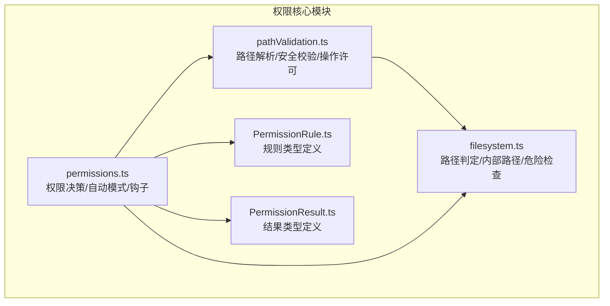
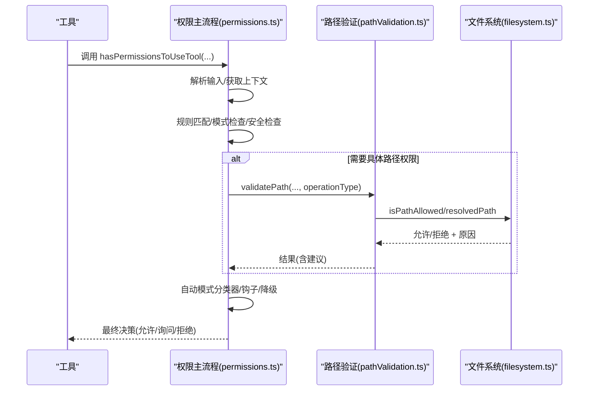
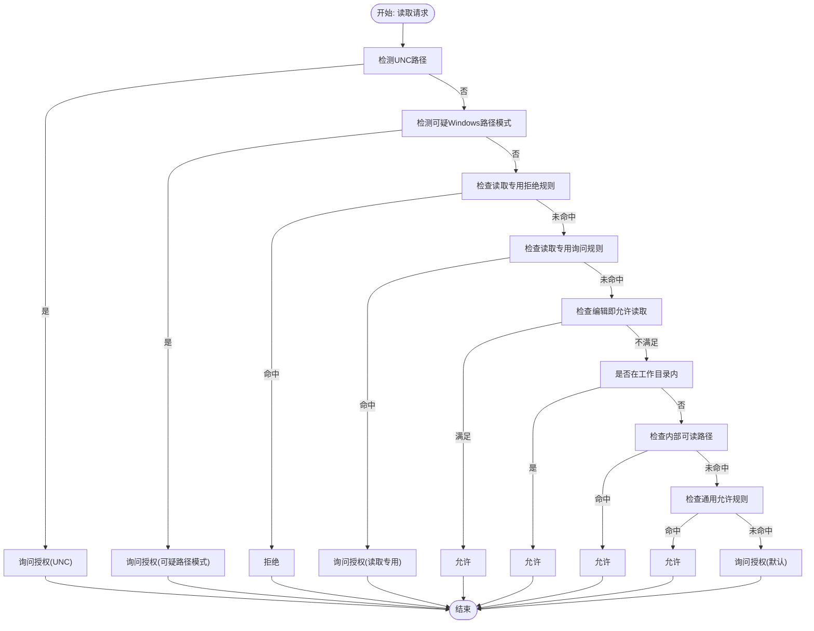
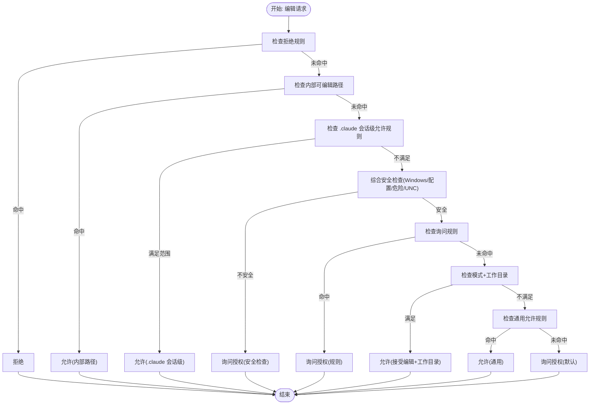
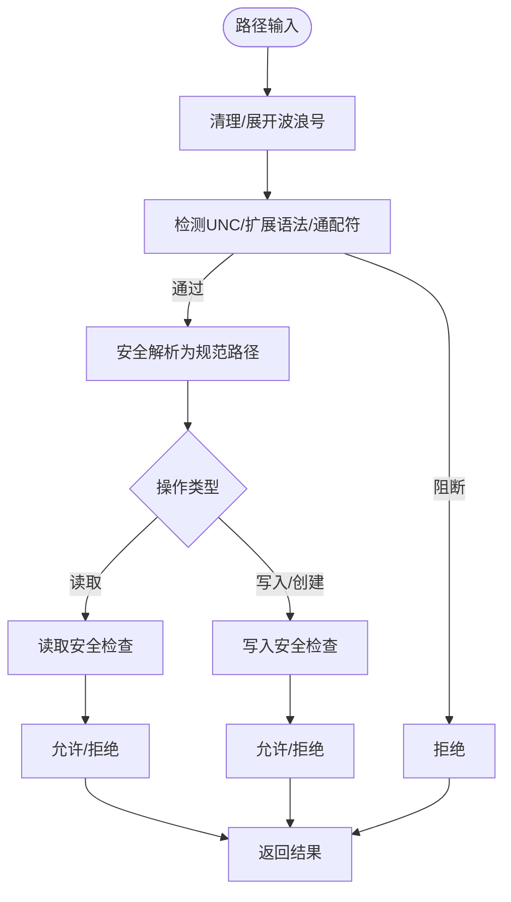
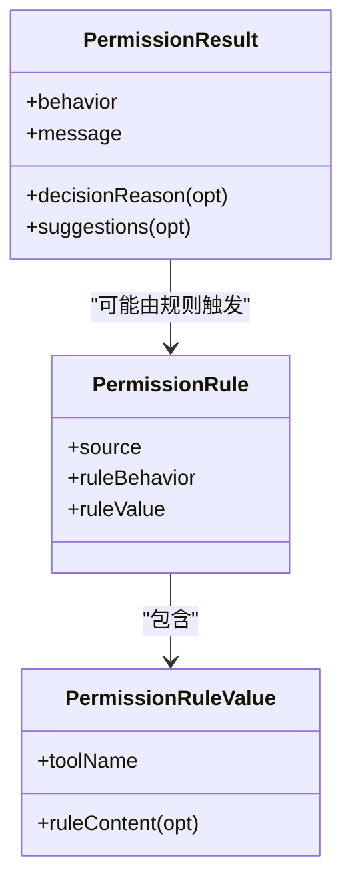
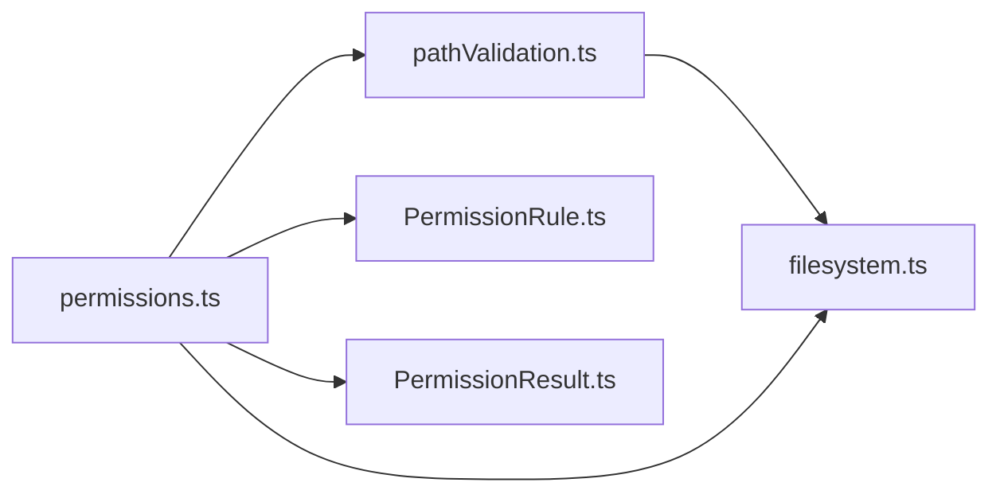

# 文件系统权限

<cite>
**本文档引用的文件**
- [filesystem.ts](file://src/utils/permissions/filesystem.ts)
- [pathValidation.ts](file://src/utils/permissions/pathValidation.ts)
- [permissions.ts](file://src/utils/permissions/permissions.ts)
- [PermissionRule.ts](file://src/utils/permissions/PermissionRule.ts)
- [PermissionResult.ts](file://src/utils/permissions/PermissionResult.ts)
</cite>

## 目录
1. [简介](#简介)
2. [项目结构](#项目结构)
3. [核心组件](#核心组件)
4. [架构总览](#架构总览)
5. [详细组件分析](#详细组件分析)
6. [依赖关系分析](#依赖关系分析)
7. [性能考量](#性能考量)
8. [故障排查指南](#故障排查指南)
9. [结论](#结论)
10. [附录](#附录)

## 简介
本文件系统权限文档面向 Claude Code 的文件读取、文件写入与文件编辑权限体系，系统性阐述权限类型、路径验证机制、操作限制与安全边界，解释权限匹配规则、权限继承与作用域控制，并提供配置选项与自定义规则设置方法，最后总结安全最佳实践与风险防范措施。

## 项目结构
围绕文件系统权限的关键代码位于 src/utils/permissions 目录，主要模块包括：
- 路径与工作目录判定：filesystem.ts
- 路径合法性与操作许可验证：pathValidation.ts
- 权限决策主流程与自动模式分类器：permissions.ts
- 权限规则与结果类型定义：PermissionRule.ts、PermissionResult.ts

图表来源
- [filesystem.ts:1-1778](file://src/utils/permissions/filesystem.ts#L1-L1778)
- [pathValidation.ts:1-486](file://src/utils/permissions/pathValidation.ts#L1-L486)
- [permissions.ts:1-1487](file://src/utils/permissions/permissions.ts#L1-L1487)
- [PermissionRule.ts:1-41](file://src/utils/permissions/PermissionRule.ts#L1-L41)
- [PermissionResult.ts:1-36](file://src/utils/permissions/PermissionResult.ts#L1-L36)

章节来源
- [filesystem.ts:1-1778](file://src/utils/permissions/filesystem.ts#L1-L1778)
- [pathValidation.ts:1-486](file://src/utils/permissions/pathValidation.ts#L1-L486)
- [permissions.ts:1-1487](file://src/utils/permissions/permissions.ts#L1-L1487)

## 核心组件
- 路径与工作目录判定（filesystem.ts）
  - 定义危险文件与目录清单，执行大小写归一化比较，提供相对路径计算与 POSIX 转换。
  - 提供工作目录包含判断、会话内存/计划/临时/草稿等内部路径识别与安全检查。
  - 实现针对读取/编辑的规则匹配与建议生成。
- 路径合法性与操作许可验证（pathValidation.ts）
  - 统一的路径清理、波浪号展开、UNC 检测、通配符与危险模式阻断。
  - 将路径解析为规范形式并进行“允许/拒绝”判定，支持读/写/创建三类操作。
  - 针对删除操作提供危险路径检测。
- 权限决策主流程（permissions.ts）
  - 整合规则、模式、安全检查、自动模式分类器与钩子，输出允许/询问/拒绝决策。
  - 支持“绕过权限”模式、自动模式下的快速通道与降级策略。
- 规则与结果类型（PermissionRule.ts、PermissionResult.ts）
  - 定义规则行为（允许/拒绝/询问）与规则值结构，以及权限结果与原因类型。

章节来源
- [filesystem.ts:1-1778](file://src/utils/permissions/filesystem.ts#L1-L1778)
- [pathValidation.ts:1-486](file://src/utils/permissions/pathValidation.ts#L1-L486)
- [permissions.ts:1-1487](file://src/utils/permissions/permissions.ts#L1-L1487)
- [PermissionRule.ts:1-41](file://src/utils/permissions/PermissionRule.ts#L1-L41)
- [PermissionResult.ts:1-36](file://src/utils/permissions/PermissionResult.ts#L1-L36)

## 架构总览
下图展示从工具调用到最终权限决策的关键流程，涵盖规则匹配、安全检查、自动模式与钩子处理：

图表来源
- [permissions.ts:473-1319](file://src/utils/permissions/permissions.ts#L473-L1319)
- [pathValidation.ts:373-485](file://src/utils/permissions/pathValidation.ts#L373-L485)
- [filesystem.ts:1414-1473](file://src/utils/permissions/filesystem.ts#L1414-L1473)

## 详细组件分析

### 文件读取权限（File Read）
- 决策步骤
  - 防御式早期阻断：UNC 路径与可疑 Windows 路径模式直接要求人工确认。
  - 优先检查“仅读取”专用的拒绝/询问规则，确保显式读取限制优先于默认放行。
  - 若具备“编辑即允许读取”的条件且无读取专属限制，则直接允许。
  - 工作目录内读取默认允许。
  - 允许从内部路径（会话记忆、计划、工具结果等）读取。
  - 最后检查通用允许规则；否则提示用户授权并附带建议。
- 关键函数
  - [checkReadPermissionForTool:1030-1194](file://src/utils/permissions/filesystem.ts#L1030-L1194)
  - [matchingRuleForInput:955-1025](file://src/utils/permissions/filesystem.ts#L955-L1025)
  - [generateSuggestions:1414-1473](file://src/utils/permissions/filesystem.ts#L1414-L1473)

图表来源
- [filesystem.ts:1030-1194](file://src/utils/permissions/filesystem.ts#L1030-L1194)

章节来源
- [filesystem.ts:1030-1194](file://src/utils/permissions/filesystem.ts#L1030-L1194)

### 文件写入/文件编辑权限（File Edit）
- 决策步骤
  - 优先检查拒绝规则。
  - 允许内部可编辑路径（会话计划、草稿、作业目录、代理记忆等）。
  - 对 .claude 目录的特定规则进行范围限定（仅会话级规则且内容以 .claude 开头），避免过度授权。
  - 执行综合安全检查（可疑 Windows 路径、Claude 配置文件、危险目录/文件、UNC 等），敏感路径直接要求人工确认。
  - 检查询问规则。
  - 在接受编辑模式且路径在工作目录内时直接允许。
  - 检查通用允许规则。
  - 默认提示授权并附带建议（可能包含提升模式或添加目录规则）。
- 关键函数
  - [checkWritePermissionForTool:1196-1412](file://src/utils/permissions/filesystem.ts#L1196-L1412)
  - [checkPathSafetyForAutoEdit:620-665](file://src/utils/permissions/filesystem.ts#L620-L665)
  - [getClaudeSkillScope:101-157](file://src/utils/permissions/filesystem.ts#L101-L157)
  - [generateSuggestions:1414-1473](file://src/utils/permissions/filesystem.ts#L1414-L1473)

图表来源
- [filesystem.ts:1196-1412](file://src/utils/permissions/filesystem.ts#L1196-L1412)

章节来源
- [filesystem.ts:1196-1412](file://src/utils/permissions/filesystem.ts#L1196-L1412)

### 路径验证与安全边界（Path Validation）
- 路径清理与解析
  - 清理首尾引号、展开波浪号、阻断 UNC、拒绝特殊扩展语法（$、%、=）。
  - 通配符在写/创建场景中被禁止；读取场景仅验证基目录。
  - 使用安全解析函数获取规范路径，必要时复用已解析结果以减少系统调用。
- 危险路径检测
  - 删除操作：对根目录、家目录、驱动器根、通配符等高危目标进行阻断。
  - 读取/写入：统一的 UNC 与可疑 Windows 路径检测。
- 写入沙箱白名单
  - 当启用沙箱时，将用户配置的可写目录作为额外允许项，避免对沙箱根目录的重复授权提示。

图表来源
- [pathValidation.ts:373-485](file://src/utils/permissions/pathValidation.ts#L373-L485)

章节来源
- [pathValidation.ts:1-486](file://src/utils/permissions/pathValidation.ts#L1-L486)

### 权限匹配规则、继承与作用域
- 规则来源与优先级
  - 规则来源按优先级组合：命令行参数、命令、会话、用户设置、策略设置、项目设置、本地设置、标志设置。
  - 整体工具拒绝优先于单项内容询问，安全检查结果不可绕过。
- 匹配与继承
  - 工具级规则：如 Bash、PowerShell、FileEdit、FileRead 等。
  - 内容级规则：如 Bash(prefix:*)、Agent(Explore) 等，支持通配与限定。
  - 作用域控制：.claude 目录的会话级允许规则仅在会话源中生效，避免跨源扩大授权。
- 忽略模式与根路径
  - 读取/编辑规则基于忽略库的模式匹配，支持多种根前缀（//、~/、/、相对）。
  - 模式规范化与相对路径计算确保跨平台一致性。

图表来源
- [PermissionRule.ts:19-41](file://src/utils/permissions/PermissionRule.ts#L19-L41)
- [PermissionResult.ts:12-36](file://src/utils/permissions/PermissionResult.ts#L12-L36)

章节来源
- [filesystem.ts:837-1025](file://src/utils/permissions/filesystem.ts#L837-L1025)
- [PermissionRule.ts:1-41](file://src/utils/permissions/PermissionRule.ts#L1-L41)
- [PermissionResult.ts:1-36](file://src/utils/permissions/PermissionResult.ts#L1-L36)

### 自动模式与降级策略
- 自动模式（auto）
  - 接受编辑快速通道：在工作目录内的安全编辑直接允许，避免分类器开销。
  - 安全工具白名单：无需分类器即可自动允许。
  - 分类器决策：当无法快速通过时，使用分类器评估，结合连续拒绝计数与上限策略决定是否回退至交互确认。
- 不要再问模式（dontAsk）
  - 将“询问”转换为“拒绝”，适合严格环境。
- 异步/无界面场景
  - 运行权限请求钩子，若钩子未决策则拒绝，避免静默失败。

章节来源
- [permissions.ts:518-956](file://src/utils/permissions/permissions.ts#L518-L956)
- [permissions.ts:1071-1156](file://src/utils/permissions/permissions.ts#L1071-L1156)

## 依赖关系分析
- 模块耦合
  - permissions.ts 依赖 pathValidation.ts 的路径解析与许可判定，同时依赖 filesystem.ts 的规则匹配与内部路径识别。
  - pathValidation.ts 依赖 filesystem.ts 的工作目录与内部路径判定、安全检查与规则匹配。
  - PermissionRule.ts 与 PermissionResult.ts 为类型层依赖，服务于权限主流程的类型安全。
- 外部依赖
  - 忽略库用于规则模式匹配。
  - 沙箱管理器用于写入白名单与自动放行策略。
  - 平台信息与路径工具保证跨平台一致性。

图表来源
- [permissions.ts:1-1487](file://src/utils/permissions/permissions.ts#L1-L1487)
- [pathValidation.ts:1-486](file://src/utils/permissions/pathValidation.ts#L1-L486)
- [filesystem.ts:1-1778](file://src/utils/permissions/filesystem.ts#L1-L1778)
- [PermissionRule.ts:1-41](file://src/utils/permissions/PermissionRule.ts#L1-L41)
- [PermissionResult.ts:1-36](file://src/utils/permissions/PermissionResult.ts#L1-L36)

章节来源
- [permissions.ts:1-1487](file://src/utils/permissions/permissions.ts#L1-L1487)
- [pathValidation.ts:1-486](file://src/utils/permissions/pathValidation.ts#L1-L486)
- [filesystem.ts:1-1778](file://src/utils/permissions/filesystem.ts#L1-L1778)

## 性能考量
- 缓存与去重
  - 工作目录与沙箱配置路径解析采用记忆化，避免重复系统调用。
  - 同一路径的规范解析结果可复用，减少多次 realpath/exists/lstat 的开销。
- 快速通道
  - 接受编辑模式在工作目录内直接放行，避免分类器与规则遍历。
  - 安全工具白名单跳过分类器，显著降低延迟。
- 规则匹配优化
  - 读取/编辑规则按工具类型与行为分组，减少不必要的模式测试。
  - 忽略库的模式预处理与相对路径计算确保高效匹配。

章节来源
- [filesystem.ts:676-707](file://src/utils/permissions/filesystem.ts#L676-L707)
- [pathValidation.ts:125-128](file://src/utils/permissions/pathValidation.ts#L125-L128)
- [permissions.ts:658-686](file://src/utils/permissions/permissions.ts#L658-L686)

## 故障排查指南
- 常见问题与定位
  - UNC 路径导致拒绝：路径包含网络前缀或潜在凭据泄露风险，需手动批准或改用本地路径。
  - 可疑 Windows 路径模式：Alternate Data Stream、短文件名、长路径前缀、末尾空格等，需人工确认。
  - .claude 目录编辑受限：安全策略保护配置与工作树，可通过会话级规则精确授权特定子目录。
  - 删除高危目标：根目录、家目录、驱动器根、通配符等，一律阻断。
  - 通配符在写入场景被拒：请指定具体文件路径。
- 建议操作
  - 使用“接受编辑”模式提升工作目录内编辑效率。
  - 通过“添加目录规则”或“设置模式”生成建议，逐步放宽权限。
  - 在自动模式下观察连续拒绝计数，必要时切换为交互模式审阅。

章节来源
- [pathValidation.ts:331-367](file://src/utils/permissions/pathValidation.ts#L331-L367)
- [filesystem.ts:435-488](file://src/utils/permissions/filesystem.ts#L435-L488)
- [permissions.ts:984-1058](file://src/utils/permissions/permissions.ts#L984-L1058)

## 结论
Claude Code 的文件系统权限体系通过“规则优先、安全前置、模式可控、自动加速”的设计，在保障安全的同时兼顾易用性与性能。路径验证与内部路径豁免共同构成安全边界，而自动模式与钩子机制则适应不同运行环境的需求。遵循本文的最佳实践与配置方法，可在复杂场景中实现细粒度、可审计的文件操作权限控制。

## 附录

### 权限类型与操作映射
- 读取（read）：适用于文件读取工具，遵循“读取专用规则优先、编辑即允许读取、工作目录默认允许、内部路径允许、通用规则放行”的顺序。
- 写入/编辑（edit/create）：适用于文件写入/创建工具，遵循“拒绝规则优先、内部路径允许、.claude 会话级规则、综合安全检查、询问规则、接受编辑+工作目录、通用规则放行”的顺序。

章节来源
- [filesystem.ts:1030-1194](file://src/utils/permissions/filesystem.ts#L1030-L1194)
- [filesystem.ts:1196-1412](file://src/utils/permissions/filesystem.ts#L1196-L1412)

### 配置选项与自定义规则
- 规则来源
  - 命令行参数、命令、会话、用户设置、策略设置、项目设置、本地设置、标志设置。
- 规则行为
  - allow（允许）、deny（拒绝）、ask（询问）。
- 规则内容
  - 工具名称与可选内容（如 Bash(prefix:*)、Agent(Explore)、通配符模式等）。
- 作用域控制
  - .claude 目录的会话级允许规则仅在会话源中生效，避免跨源扩大授权。
- 建议生成
  - 读取：在工作目录外建议添加读取规则或提升模式。
  - 写入/创建：建议提升模式或添加目录规则，必要时附带技能级窄化建议。

章节来源
- [filesystem.ts:837-1025](file://src/utils/permissions/filesystem.ts#L837-L1025)
- [filesystem.ts:1414-1473](file://src/utils/permissions/filesystem.ts#L1414-L1473)
- [PermissionRule.ts:19-41](file://src/utils/permissions/PermissionRule.ts#L19-L41)