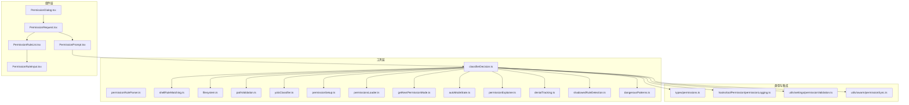
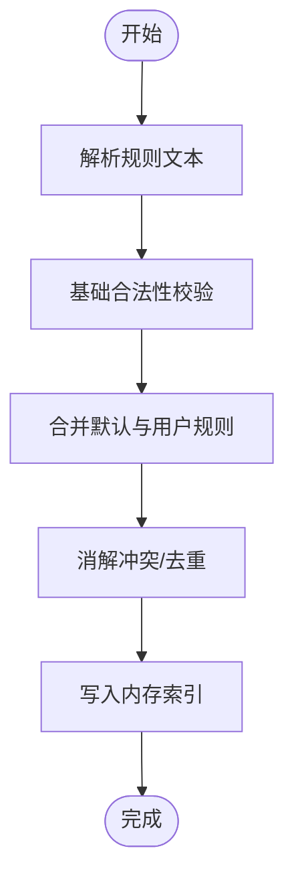
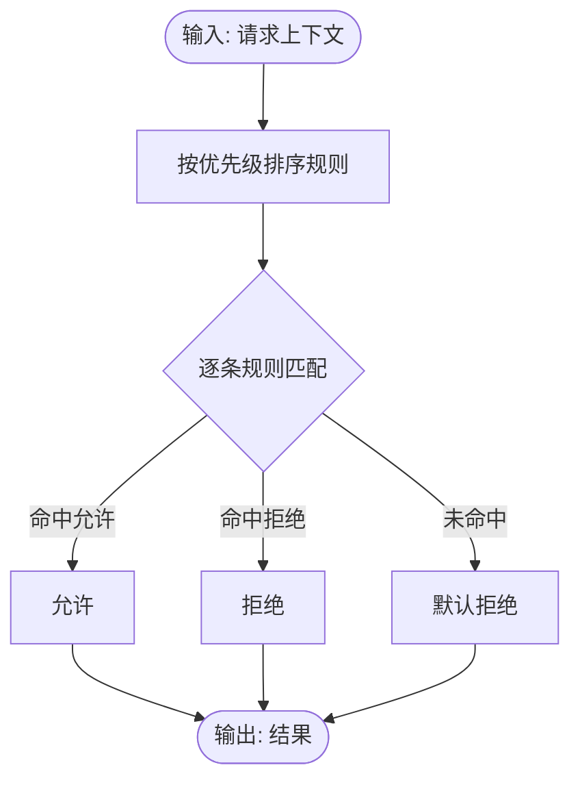
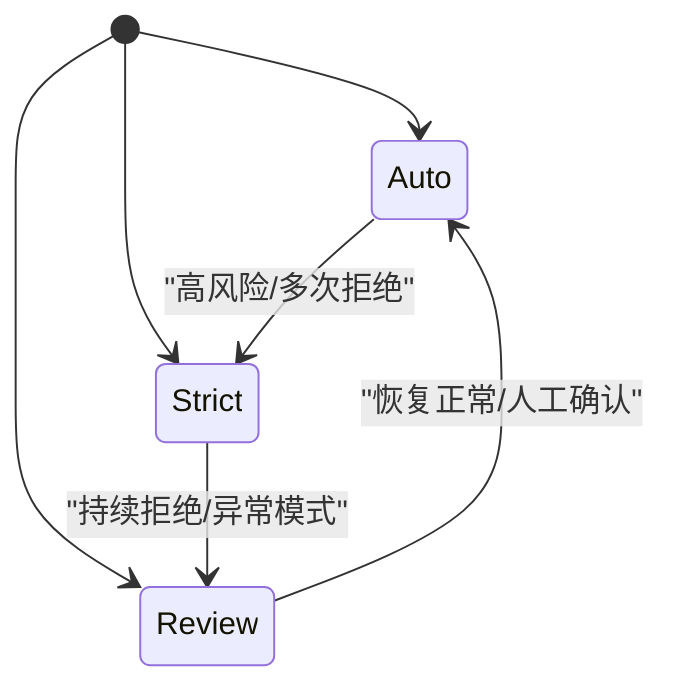
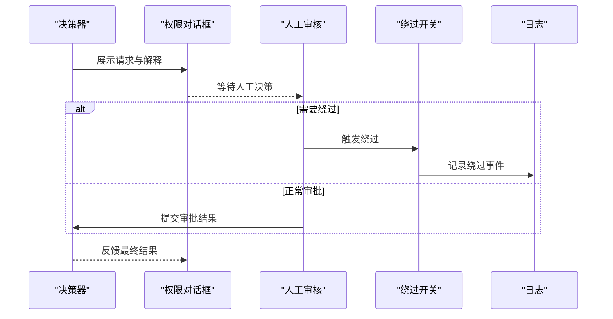
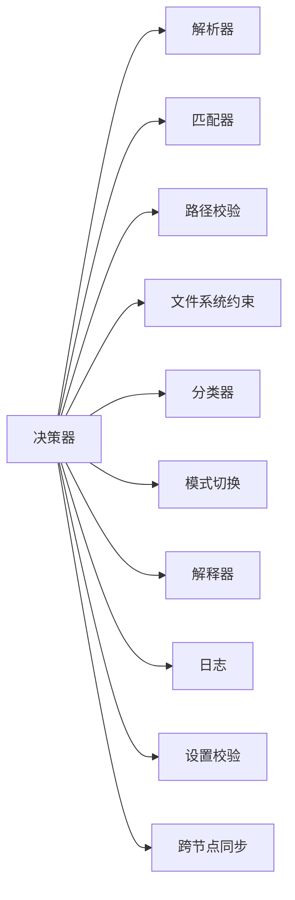

# 权限匹配与验证

<cite>
**本文引用的文件**
- [src/utils/permissions/permissions.ts](file://src/utils/permissions/permissions.ts)
- [src/utils/permissions/permissionRuleParser.ts](file://src/utils/permissions/permissionRuleParser.ts)
- [src/utils/permissions/shadowedRuleDetection.ts](file://src/utils/permissions/shadowedRuleDetection.ts)
- [src/utils/permissions/dangerousPatterns.ts](file://src/utils/permissions/dangerousPatterns.ts)
- [src/utils/permissions/yoloClassifier.ts](file://src/utils/permissions/yoloClassifier.ts)
- [src/utils/permissions/classifierDecision.ts](file://src/utils/permissions/classifierDecision.ts)
- [src/utils/permissions/permissionSetup.ts](file://src/utils/permissions/permissionSetup.ts)
- [src/utils/permissions/permissionsLoader.ts](file://src/utils/permissions/permissionsLoader.ts)
- [src/utils/permissions/getNextPermissionMode.ts](file://src/utils/permissions/getNextPermissionMode.ts)
- [src/utils/permissions/autoModeState.ts](file://src/utils/permissions/autoModeState.ts)
- [src/utils/permissions/bypassPermissionsKillswitch.ts](file://src/utils/permissions/bypassPermissionsKillswitch.ts)
- [src/utils/permissions/denialTracking.ts](file://src/utils/permissions/denialTracking.ts)
- [src/utils/permissions/permissionExplainer.ts](file://src/utils/permissions/permissionExplainer.ts)
- [src/utils/permissions/pathValidation.ts](file://src/utils/permissions/pathValidation.ts)
- [src/utils/permissions/shellRuleMatching.ts](file://src/utils/permissions/shellRuleMatching.ts)
- [src/utils/permissions/filesystem.ts](file://src/utils/permissions/filesystem.ts)
- [src/components/permissions/PermissionDialog.tsx](file://src/components/permissions/PermissionDialog.tsx)
- [src/components/permissions/PermissionPrompt.tsx](file://src/components/permissions/PermissionPrompt.tsx)
- [src/components/permissions/PermissionRequest.tsx](file://src/components/permissions/PermissionRequest.tsx)
- [src/components/permissions/rules/PermissionRuleList.tsx](file://src/components/permissions/rules/PermissionRuleList.tsx)
- [src/components/permissions/rules/PermissionRuleInput.tsx](file://src/components/permissions/rules/PermissionRuleInput.tsx)
- [src/components/permissions/BypassPermissionsModeDialog.tsx](file://src/components/permissions/BypassPermissionsModeDialog.tsx)
- [src/hooks/toolPermission/permissionLogging.ts](file://src/hooks/toolPermission/permissionLogging.ts)
- [src/types/permissions.ts](file://src/types/permissions.ts)
- [src/utils/settings/permissionValidation.ts](file://src/utils/settings/permissionValidation.ts)
- [src/utils/swarm/permissionSync.ts](file://src/utils/swarm/permissionSync.ts)
</cite>

## 目录
1. [引言](#引言)
2. [项目结构](#项目结构)
3. [核心组件](#核心组件)
4. [架构总览](#架构总览)
5. [详细组件分析](#详细组件分析)
6. [依赖关系分析](#依赖关系分析)
7. [性能考虑](#性能考虑)
8. [故障排查指南](#故障排查指南)
9. [结论](#结论)
10. [附录](#附录)

## 引言
本文件系统性阐述 Claude Code 的权限匹配与验证体系：从权限规则的解析与存储，到匹配算法与决策流程；从自动化判定与人工审核，到权限升级与审计日志。文档同时覆盖性能优化与缓存策略，帮助开发者与运维人员在保证安全的前提下提升系统可用性。

## 项目结构
权限系统主要分布在以下模块：
- 工具层（utils/permissions）：规则解析、匹配、分类器、加载与设置、模式检测、解释器等
- 组件层（components/permissions）：权限对话框、请求组件、规则编辑界面
- 类型定义（types/permissions.ts）：权限结果、模式、更新等类型
- 集成点：工具钩子（permissionLogging）、设置校验（permissionValidation）、跨节点同步（permissionSync）



图表来源
- [src/utils/permissions/permissionRuleParser.ts:1-200](file://src/utils/permissions/permissionRuleParser.ts#L1-L200)
- [src/utils/permissions/shellRuleMatching.ts:1-200](file://src/utils/permissions/shellRuleMatching.ts#L1-L200)
- [src/utils/permissions/filesystem.ts:1-200](file://src/utils/permissions/filesystem.ts#L1-L200)
- [src/utils/permissions/pathValidation.ts:1-200](file://src/utils/permissions/pathValidation.ts#L1-L200)
- [src/utils/permissions/classifierDecision.ts:1-200](file://src/utils/permissions/classifierDecision.ts#L1-L200)
- [src/utils/permissions/yoloClassifier.ts:1-200](file://src/utils/permissions/yoloClassifier.ts#L1-L200)
- [src/utils/permissions/permissionSetup.ts:1-200](file://src/utils/permissions/permissionSetup.ts#L1-L200)
- [src/utils/permissions/permissionsLoader.ts:1-200](file://src/utils/permissions/permissionsLoader.ts#L1-L200)
- [src/utils/permissions/getNextPermissionMode.ts:1-200](file://src/utils/permissions/getNextPermissionMode.ts#L1-L200)
- [src/utils/permissions/autoModeState.ts:1-200](file://src/utils/permissions/autoModeState.ts#L1-L200)
- [src/utils/permissions/permissionExplainer.ts:1-200](file://src/utils/permissions/permissionExplainer.ts#L1-L200)
- [src/utils/permissions/denialTracking.ts:1-200](file://src/utils/permissions/denialTracking.ts#L1-L200)
- [src/utils/permissions/shadowedRuleDetection.ts:1-200](file://src/utils/permissions/shadowedRuleDetection.ts#L1-L200)
- [src/utils/permissions/dangerousPatterns.ts:1-200](file://src/utils/permissions/dangerousPatterns.ts#L1-L200)
- [src/components/permissions/PermissionDialog.tsx:1-200](file://src/components/permissions/PermissionDialog.tsx#L1-L200)
- [src/components/permissions/PermissionPrompt.tsx:1-200](file://src/components/permissions/PermissionPrompt.tsx#L1-L200)
- [src/components/permissions/PermissionRequest.tsx:1-200](file://src/components/permissions/PermissionRequest.tsx#L1-L200)
- [src/components/permissions/rules/PermissionRuleList.tsx:1-200](file://src/components/permissions/rules/PermissionRuleList.tsx#L1-L200)
- [src/components/permissions/rules/PermissionRuleInput.tsx:1-200](file://src/components/permissions/rules/PermissionRuleInput.tsx#L1-L200)
- [src/hooks/toolPermission/permissionLogging.ts:1-200](file://src/hooks/toolPermission/permissionLogging.ts#L1-L200)
- [src/types/permissions.ts:1-200](file://src/types/permissions.ts#L1-L200)
- [src/utils/settings/permissionValidation.ts:1-200](file://src/utils/settings/permissionValidation.ts#L1-L200)
- [src/utils/swarm/permissionSync.ts:1-200](file://src/utils/swarm/permissionSync.ts#L1-L200)

章节来源
- [src/utils/permissions/permissions.ts:1-200](file://src/utils/permissions/permissions.ts#L1-L200)
- [src/utils/permissions/permissionRuleParser.ts:1-200](file://src/utils/permissions/permissionRuleParser.ts#L1-L200)
- [src/utils/permissions/permissionSetup.ts:1-200](file://src/utils/permissions/permissionSetup.ts#L1-L200)
- [src/utils/permissions/permissionsLoader.ts:1-200](file://src/utils/permissions/permissionsLoader.ts#L1-L200)
- [src/utils/permissions/getNextPermissionMode.ts:1-200](file://src/utils/permissions/getNextPermissionMode.ts#L1-L200)
- [src/utils/permissions/autoModeState.ts:1-200](file://src/utils/permissions/autoModeState.ts#L1-L200)
- [src/utils/permissions/denialTracking.ts:1-200](file://src/utils/permissions/denialTracking.ts#L1-L200)
- [src/utils/permissions/permissionExplainer.ts:1-200](file://src/utils/permissions/permissionExplainer.ts#L1-L200)
- [src/utils/permissions/shadowedRuleDetection.ts:1-200](file://src/utils/permissions/shadowedRuleDetection.ts#L1-L200)
- [src/utils/permissions/dangerousPatterns.ts:1-200](file://src/utils/permissions/dangerousPatterns.ts#L1-L200)
- [src/utils/permissions/yoloClassifier.ts:1-200](file://src/utils/permissions/yoloClassifier.ts#L1-L200)
- [src/utils/permissions/classifierDecision.ts:1-200](file://src/utils/permissions/classifierDecision.ts#L1-L200)
- [src/utils/permissions/shellRuleMatching.ts:1-200](file://src/utils/permissions/shellRuleMatching.ts#L1-L200)
- [src/utils/permissions/filesystem.ts:1-200](file://src/utils/permissions/filesystem.ts#L1-L200)
- [src/utils/permissions/pathValidation.ts:1-200](file://src/utils/permissions/pathValidation.ts#L1-L200)
- [src/components/permissions/PermissionDialog.tsx:1-200](file://src/components/permissions/PermissionDialog.tsx#L1-L200)
- [src/components/permissions/PermissionPrompt.tsx:1-200](file://src/components/permissions/PermissionPrompt.tsx#L1-L200)
- [src/components/permissions/PermissionRequest.tsx:1-200](file://src/components/permissions/PermissionRequest.tsx#L1-L200)
- [src/components/permissions/rules/PermissionRuleList.tsx:1-200](file://src/components/permissions/rules/PermissionRuleList.tsx#L1-L200)
- [src/components/permissions/rules/PermissionRuleInput.tsx:1-200](file://src/components/permissions/rules/PermissionRuleInput.tsx#L1-L200)
- [src/hooks/toolPermission/permissionLogging.ts:1-200](file://src/hooks/toolPermission/permissionLogging.ts#L1-L200)
- [src/types/permissions.ts:1-200](file://src/types/permissions.ts#L1-L200)
- [src/utils/settings/permissionValidation.ts:1-200](file://src/utils/settings/permissionValidation.ts#L1-L200)
- [src/utils/swarm/permissionSync.ts:1-200](file://src/utils/swarm/permissionSync.ts#L1-L200)

## 核心组件
- 规则解析与存储
  - 解析器负责将用户输入的规则字符串转换为内部规则对象，支持通配符、路径前缀、正则等语法，并进行基本合法性校验。
  - 加载器负责从持久化位置读取规则集合，合并默认规则与用户规则，构建可查询的数据结构。
- 匹配算法
  - 针对文件系统操作与命令行工具，采用“规则优先匹配”策略：按优先级顺序遍历规则，命中即停止；若无显式允许，则拒绝。
  - 对于危险模式检测，结合静态模式库与动态上下文，给出高风险标记。
- 分类器与决策
  - 自动模式状态机根据历史拒绝与当前请求特征，决定是否进入自动放行、严格审核或降级模式。
  - 决策器综合规则匹配、危险模式、路径合法性、文件系统约束与解释器输出，生成最终权限结果。
- 用户交互与审核
  - 权限对话框与提示组件向用户展示请求详情与解释信息，支持快速批准/拒绝与“不再询问”等选项。
  - 审核流程支持人工复核与权限升级，必要时触发更高权限通道。
- 日志与审计
  - 权限钩子记录每次决策的时间戳、请求上下文、匹配规则、危险标记与最终结果，便于审计与回溯。

章节来源
- [src/utils/permissions/permissionRuleParser.ts:1-200](file://src/utils/permissions/permissionRuleParser.ts#L1-L200)
- [src/utils/permissions/permissionsLoader.ts:1-200](file://src/utils/permissions/permissionsLoader.ts#L1-L200)
- [src/utils/permissions/shadowedRuleDetection.ts:1-200](file://src/utils/permissions/shadowedRuleDetection.ts#L1-L200)
- [src/utils/permissions/dangerousPatterns.ts:1-200](file://src/utils/permissions/dangerousPatterns.ts#L1-L200)
- [src/utils/permissions/yoloClassifier.ts:1-200](file://src/utils/permissions/yoloClassifier.ts#L1-L200)
- [src/utils/permissions/classifierDecision.ts:1-200](file://src/utils/permissions/classifierDecision.ts#L1-L200)
- [src/utils/permissions/getNextPermissionMode.ts:1-200](file://src/utils/permissions/getNextPermissionMode.ts#L1-L200)
- [src/utils/permissions/autoModeState.ts:1-200](file://src/utils/permissions/autoModeState.ts#L1-L200)
- [src/utils/permissions/denialTracking.ts:1-200](file://src/utils/permissions/denialTracking.ts#L1-L200)
- [src/utils/permissions/permissionExplainer.ts:1-200](file://src/utils/permissions/permissionExplainer.ts#L1-L200)
- [src/components/permissions/PermissionDialog.tsx:1-200](file://src/components/permissions/PermissionDialog.tsx#L1-L200)
- [src/components/permissions/PermissionPrompt.tsx:1-200](file://src/components/permissions/PermissionPrompt.tsx#L1-L200)
- [src/hooks/toolPermission/permissionLogging.ts:1-200](file://src/hooks/toolPermission/permissionLogging.ts#L1-L200)

## 架构总览
下图展示了从请求发起到权限决策与反馈的端到端流程，包括自动化判定、人工审核与权限升级的关键节点。

```mermaid
sequenceDiagram
participant U as "用户/工具"
participant PR as "权限请求组件"
participant DEC as "决策器"
participant PAR as "解析器"
participant MAT as "匹配器"
participant PAT as "路径校验"
participant FS as "文件系统约束"
participant CLA as "分类器(YOLO)"
participant MODE as "模式切换"
participant LOG as "日志记录"
U->>PR : 发起权限请求
PR->>DEC : 汇总上下文(工具名/参数/路径)
DEC->>PAR : 解析规则
PAR-->>DEC : 规则对象
DEC->>MAT : 执行规则匹配
MAT-->>DEC : 命中规则/未命中
DEC->>PAT : 路径合法性检查
PAT-->>DEC : 合法/非法
DEC->>FS : 文件系统约束评估
FS-->>DEC : 允许/受限
DEC->>CLA : 危险模式识别
CLA-->>DEC : 风险等级
DEC->>MODE : 切换权限模式
MODE-->>DEC : 当前模式(Auto/Strict/Review)
DEC->>LOG : 记录决策日志
DEC-->>PR : 返回权限结果
PR-->>U : 展示结果并引导下一步
```

图表来源
- [src/utils/permissions/classifierDecision.ts:1-200](file://src/utils/permissions/classifierDecision.ts#L1-L200)
- [src/utils/permissions/permissionRuleParser.ts:1-200](file://src/utils/permissions/permissionRuleParser.ts#L1-L200)
- [src/utils/permissions/shellRuleMatching.ts:1-200](file://src/utils/permissions/shellRuleMatching.ts#L1-L200)
- [src/utils/permissions/pathValidation.ts:1-200](file://src/utils/permissions/pathValidation.ts#L1-L200)
- [src/utils/permissions/filesystem.ts:1-200](file://src/utils/permissions/filesystem.ts#L1-L200)
- [src/utils/permissions/yoloClassifier.ts:1-200](file://src/utils/permissions/yoloClassifier.ts#L1-L200)
- [src/utils/permissions/getNextPermissionMode.ts:1-200](file://src/utils/permissions/getNextPermissionMode.ts#L1-L200)
- [src/hooks/toolPermission/permissionLogging.ts:1-200](file://src/hooks/toolPermission/permissionLogging.ts#L1-L200)

## 详细组件分析

### 权限规则解析与存储
- 规则语法
  - 支持工具名精确匹配、通配符与正则表达式；路径支持前缀匹配与通配符；可指定动作（允许/拒绝）与条件（如仅限特定工作区）。
  - 规则优先级通过声明顺序体现，越靠前的规则优先级越高。
- 存储与加载
  - 默认规则与用户规则合并，去重与冲突消解后写入内存索引，供后续匹配阶段快速查询。
- 冲突检测
  - 提供阴影规则检测，识别被更具体规则覆盖的冗余规则，辅助清理与优化。



图表来源
- [src/utils/permissions/permissionRuleParser.ts:1-200](file://src/utils/permissions/permissionRuleParser.ts#L1-L200)
- [src/utils/permissions/permissionsLoader.ts:1-200](file://src/utils/permissions/permissionsLoader.ts#L1-L200)
- [src/utils/permissions/shadowedRuleDetection.ts:1-200](file://src/utils/permissions/shadowedRuleDetection.ts#L1-L200)

章节来源
- [src/utils/permissions/permissionRuleParser.ts:1-200](file://src/utils/permissions/permissionRuleParser.ts#L1-L200)
- [src/utils/permissions/permissionsLoader.ts:1-200](file://src/utils/permissions/permissionsLoader.ts#L1-L200)
- [src/utils/permissions/shadowedRuleDetection.ts:1-200](file://src/utils/permissions/shadowedRuleDetection.ts#L1-L200)

### 权限匹配算法
- 匹配策略
  - 顺序扫描已排序规则集，遇到第一条匹配规则即返回其动作（允许/拒绝），未匹配则视为拒绝。
  - 对于文件系统与命令行场景，分别应用文件路径匹配与命令参数匹配。
- 冲突解决
  - 显式允许优先于隐式拒绝；更具体的规则优先于更宽泛的规则。
- 性能优化
  - 使用前缀树/字典树加速路径匹配；对规则集进行分桶（按工具名、路径前缀）以减少扫描范围。



图表来源
- [src/utils/permissions/shellRuleMatching.ts:1-200](file://src/utils/permissions/shellRuleMatching.ts#L1-L200)
- [src/utils/permissions/filesystem.ts:1-200](file://src/utils/permissions/filesystem.ts#L1-L200)

章节来源
- [src/utils/permissions/shellRuleMatching.ts:1-200](file://src/utils/permissions/shellRuleMatching.ts#L1-L200)
- [src/utils/permissions/filesystem.ts:1-200](file://src/utils/permissions/filesystem.ts#L1-L200)

### 权限决策与自动化机制
- 自动模式状态机
  - 根据近期拒绝次数、重复模式与上下文特征，动态调整为自动放行、严格审核或降级模式。
- 危险模式检测
  - 基于预置模式库与实时参数分析，标记潜在高危行为，影响最终决策权重。
- 决策融合
  - 将规则匹配、路径合法性、文件系统约束、危险模式与解释器输出综合评分，得出最终许可。



图表来源
- [src/utils/permissions/autoModeState.ts:1-200](file://src/utils/permissions/autoModeState.ts#L1-L200)
- [src/utils/permissions/getNextPermissionMode.ts:1-200](file://src/utils/permissions/getNextPermissionMode.ts#L1-L200)
- [src/utils/permissions/dangerousPatterns.ts:1-200](file://src/utils/permissions/dangerousPatterns.ts#L1-L200)
- [src/utils/permissions/classifierDecision.ts:1-200](file://src/utils/permissions/classifierDecision.ts#L1-L200)

章节来源
- [src/utils/permissions/autoModeState.ts:1-200](file://src/utils/permissions/autoModeState.ts#L1-L200)
- [src/utils/permissions/getNextPermissionMode.ts:1-200](file://src/utils/permissions/getNextPermissionMode.ts#L1-L200)
- [src/utils/permissions/dangerousPatterns.ts:1-200](file://src/utils/permissions/dangerousPatterns.ts#L1-L200)
- [src/utils/permissions/classifierDecision.ts:1-200](file://src/utils/permissions/classifierDecision.ts#L1-L200)

### 人工审核与权限升级
- 审核界面
  - 权限对话框与提示组件展示请求详情、规则解释与风险说明，支持一键批准/拒绝与“不再询问”。
- 升级流程
  - 当自动模式无法决断或触发高风险阈值时，转交人工审核；必要时启用“绕过权限”开关以保障关键任务执行，但需额外审批与审计。
- 绕过开关
  - 提供紧急开关用于临时绕过权限限制，需满足特定条件并记录详细原因与审批人。



图表来源
- [src/components/permissions/PermissionDialog.tsx:1-200](file://src/components/permissions/PermissionDialog.tsx#L1-L200)
- [src/components/permissions/PermissionPrompt.tsx:1-200](file://src/components/permissions/PermissionPrompt.tsx#L1-L200)
- [src/components/permissions/BypassPermissionsModeDialog.tsx:1-200](file://src/components/permissions/BypassPermissionsModeDialog.tsx#L1-L200)
- [src/utils/permissions/bypassPermissionsKillswitch.ts:1-200](file://src/utils/permissions/bypassPermissionsKillswitch.ts#L1-L200)
- [src/hooks/toolPermission/permissionLogging.ts:1-200](file://src/hooks/toolPermission/permissionLogging.ts#L1-L200)

章节来源
- [src/components/permissions/PermissionDialog.tsx:1-200](file://src/components/permissions/PermissionDialog.tsx#L1-L200)
- [src/components/permissions/PermissionPrompt.tsx:1-200](file://src/components/permissions/PermissionPrompt.tsx#L1-L200)
- [src/components/permissions/BypassPermissionsModeDialog.tsx:1-200](file://src/components/permissions/BypassPermissionsModeDialog.tsx#L1-L200)
- [src/utils/permissions/bypassPermissionsKillswitch.ts:1-200](file://src/utils/permissions/bypassPermissionsKillswitch.ts#L1-L200)
- [src/hooks/toolPermission/permissionLogging.ts:1-200](file://src/hooks/toolPermission/permissionLogging.ts#L1-L200)

### 日志记录与审计跟踪
- 记录内容
  - 时间戳、请求上下文、匹配规则、危险标记、最终结果、模式状态、绕过原因等。
- 存储与检索
  - 日志写入本地持久化存储，支持按时间、工具、路径、结果维度检索与导出。
- 审计要点
  - 关注高频拒绝、绕过事件、模式切换与异常模式，定期生成审计报告。

章节来源
- [src/hooks/toolPermission/permissionLogging.ts:1-200](file://src/hooks/toolPermission/permissionLogging.ts#L1-L200)
- [src/utils/permissions/denialTracking.ts:1-200](file://src/utils/permissions/denialTracking.ts#L1-L200)

## 依赖关系分析
- 内聚与耦合
  - 决策器聚合多个子模块（解析、匹配、路径、文件系统、分类器、模式切换、解释器、日志），内聚度高；对外通过统一接口暴露，降低外部耦合。
- 外部依赖
  - 设置校验与跨节点同步确保权限配置一致性与合规性。
- 循环依赖
  - 通过模块边界与接口隔离避免循环依赖；日志模块仅作为消费者接入，不反向依赖业务模块。



图表来源
- [src/utils/permissions/classifierDecision.ts:1-200](file://src/utils/permissions/classifierDecision.ts#L1-L200)
- [src/utils/permissions/permissionRuleParser.ts:1-200](file://src/utils/permissions/permissionRuleParser.ts#L1-L200)
- [src/utils/permissions/shellRuleMatching.ts:1-200](file://src/utils/permissions/shellRuleMatching.ts#L1-L200)
- [src/utils/permissions/pathValidation.ts:1-200](file://src/utils/permissions/pathValidation.ts#L1-L200)
- [src/utils/permissions/filesystem.ts:1-200](file://src/utils/permissions/filesystem.ts#L1-L200)
- [src/utils/permissions/yoloClassifier.ts:1-200](file://src/utils/permissions/yoloClassifier.ts#L1-L200)
- [src/utils/permissions/getNextPermissionMode.ts:1-200](file://src/utils/permissions/getNextPermissionMode.ts#L1-L200)
- [src/utils/permissions/permissionExplainer.ts:1-200](file://src/utils/permissions/permissionExplainer.ts#L1-L200)
- [src/hooks/toolPermission/permissionLogging.ts:1-200](file://src/hooks/toolPermission/permissionLogging.ts#L1-L200)
- [src/utils/settings/permissionValidation.ts:1-200](file://src/utils/settings/permissionValidation.ts#L1-L200)
- [src/utils/swarm/permissionSync.ts:1-200](file://src/utils/swarm/permissionSync.ts#L1-L200)

章节来源
- [src/utils/permissions/classifierDecision.ts:1-200](file://src/utils/permissions/classifierDecision.ts#L1-L200)
- [src/utils/permissions/permissionRuleParser.ts:1-200](file://src/utils/permissions/permissionRuleParser.ts#L1-L200)
- [src/utils/permissions/shellRuleMatching.ts:1-200](file://src/utils/permissions/shellRuleMatching.ts#L1-L200)
- [src/utils/permissions/pathValidation.ts:1-200](file://src/utils/permissions/pathValidation.ts#L1-L200)
- [src/utils/permissions/filesystem.ts:1-200](file://src/utils/permissions/filesystem.ts#L1-L200)
- [src/utils/permissions/yoloClassifier.ts:1-200](file://src/utils/permissions/yoloClassifier.ts#L1-L200)
- [src/utils/permissions/getNextPermissionMode.ts:1-200](file://src/utils/permissions/getNextPermissionMode.ts#L1-L200)
- [src/utils/permissions/permissionExplainer.ts:1-200](file://src/utils/permissions/permissionExplainer.ts#L1-L200)
- [src/hooks/toolPermission/permissionLogging.ts:1-200](file://src/hooks/toolPermission/permissionLogging.ts#L1-L200)
- [src/utils/settings/permissionValidation.ts:1-200](file://src/utils/settings/permissionValidation.ts#L1-L200)
- [src/utils/swarm/permissionSync.ts:1-200](file://src/utils/swarm/permissionSync.ts#L1-L200)

## 性能考虑
- 缓存策略
  - 规则索引缓存：将规则按工具名与路径前缀分桶，命中后优先从缓存返回。
  - 路径匹配缓存：对常用路径与规则组合进行LRU缓存，减少重复计算。
  - 模式状态缓存：最近N次请求的模式状态与危险标记缓存，避免重复分类。
- 查询优化
  - 前缀树/字典树：加速路径匹配；对规则集进行排序与分段，支持二分查找。
  - 并行匹配：对多规则分支进行并行评估，缩短关键路径延迟。
- 内存管理
  - 定期清理过期缓存与低频规则；限制规则总数与单条规则长度，防止内存膨胀。
- I/O 优化
  - 批量读取与写入权限数据；异步加载默认规则，避免阻塞主线程。

## 故障排查指南
- 常见问题
  - 规则不生效：检查规则优先级、通配符使用与工作区绑定；确认是否存在更具体规则覆盖。
  - 高误报/漏报：调整危险模式阈值与分类器权重；补充典型场景规则。
  - 模式频繁切换：核查历史拒绝统计与异常模式；必要时冻结模式或人工干预。
- 排查步骤
  - 查看权限日志：定位请求时间、匹配规则与最终结果。
  - 复现请求：使用相同工具与参数复现，确认规则与路径是否正确。
  - 校验设置：检查权限设置与跨节点同步状态，确保一致性。
- 应急处理
  - 启用绕过开关：仅限紧急情况，记录原因与审批人；尽快恢复常规模式。
  - 降级模式：暂时关闭自动放行，退回严格审核，直至问题解决。

章节来源
- [src/hooks/toolPermission/permissionLogging.ts:1-200](file://src/hooks/toolPermission/permissionLogging.ts#L1-L200)
- [src/utils/permissions/denialTracking.ts:1-200](file://src/utils/permissions/denialTracking.ts#L1-L200)
- [src/utils/permissions/bypassPermissionsKillswitch.ts:1-200](file://src/utils/permissions/bypassPermissionsKillswitch.ts#L1-L200)
- [src/utils/settings/permissionValidation.ts:1-200](file://src/utils/settings/permissionValidation.ts#L1-L200)
- [src/utils/swarm/permissionSync.ts:1-200](file://src/utils/swarm/permissionSync.ts#L1-L200)

## 结论
该权限系统通过“规则解析—匹配—决策—审核—审计”的闭环设计，在保障安全的同时兼顾灵活性与可维护性。借助自动化模式与人工审核的协同，系统能够适应多样化的使用场景；通过缓存与索引优化，显著提升响应性能。建议在生产环境中持续监控拒绝率与模式切换频率，定期优化规则与阈值，确保安全与效率的平衡。

## 附录
- 术语表
  - 规则：描述工具、路径与动作的权限声明单元
  - 决策：基于规则、模式与上下文生成的许可结果
  - 模式：自动放行、严格审核、降级模式的状态
  - 绕过：在特定条件下临时解除权限限制的应急措施
- 参考文件
  - [src/types/permissions.ts:1-200](file://src/types/permissions.ts#L1-L200)
  - [src/components/permissions/rules/PermissionRuleList.tsx:1-200](file://src/components/permissions/rules/PermissionRuleList.tsx#L1-L200)
  - [src/components/permissions/rules/PermissionRuleInput.tsx:1-200](file://src/components/permissions/rules/PermissionRuleInput.tsx#L1-L200)
  - [src/utils/permissions/permissionSetup.ts:1-200](file://src/utils/permissions/permissionSetup.ts#L1-L200)