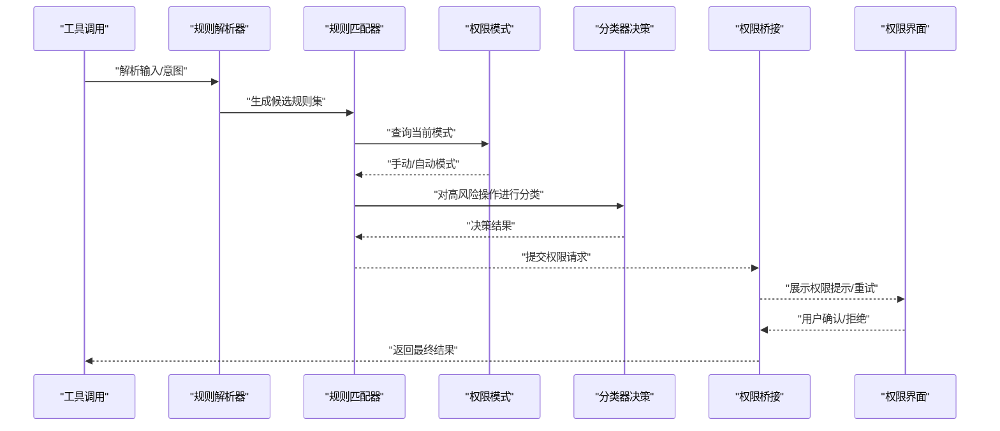
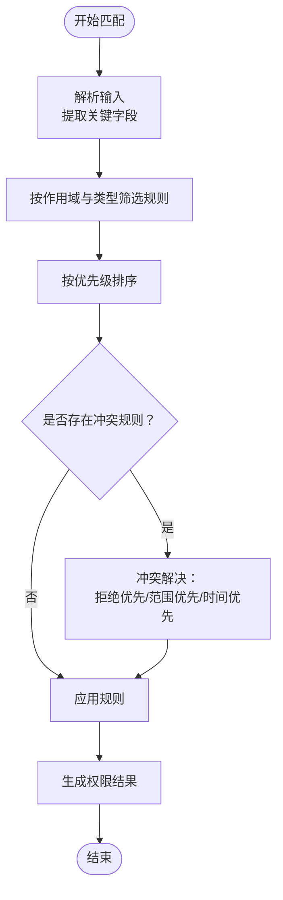
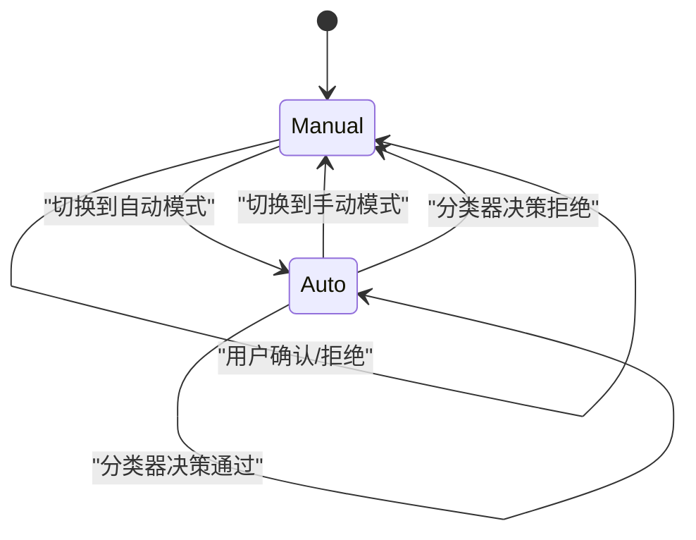
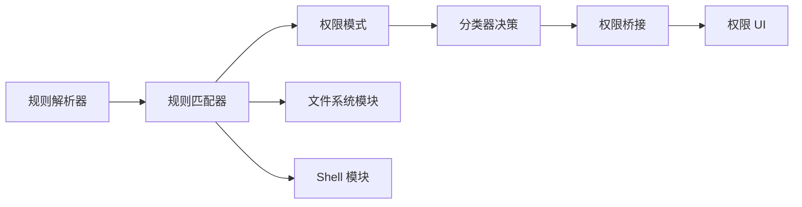

# 权限类型与分类

<cite>
**本文档引用的文件**
- [src/types/permissions.ts](file://src/types/permissions.ts)
- [src/utils/permissions/PermissionMode.ts](file://src/utils/permissions/PermissionMode.ts)
- [src/utils/permissions/PermissionRule.ts](file://src/utils/permissions/PermissionRule.ts)
- [src/utils/permissions/permissions.ts](file://src/utils/permissions/permissions.ts)
- [src/utils/permissions/permissionSetup.ts](file://src/utils/permissions/permissionSetup.ts)
- [src/utils/permissions/shellRuleMatching.ts](file://src/utils/permissions/shellRuleMatching.ts)
- [src/utils/permissions/filesystem.ts](file://src/utils/permissions/filesystem.ts)
- [src/utils/permissions/pathValidation.ts](file://src/utils/permissions/pathValidation.ts)
- [src/utils/permissions/dangerousPatterns.ts](file://src/utils/permissions/dangerousPatterns.ts)
- [src/utils/permissions/bashClassifier.ts](file://src/utils/permissions/bashClassifier.ts)
- [src/utils/permissions/classifierDecision.ts](file://src/utils/permissions/classifierDecision.ts)
- [src/utils/permissions/permissionExplainer.ts](file://src/utils/permissions/permissionExplainer.ts)
- [src/utils/permissions/permissionRuleParser.ts](file://src/utils/permissions/permissionRuleParser.ts)
- [src/utils/permissions/getNextPermissionMode.ts](file://src/utils/permissions/getNextPermissionMode.ts)
- [src/utils/permissions/autoModeState.ts](file://src/utils/permissions/autoModeState.ts)
- [src/utils/permissions/bypassPermissionsKillswitch.ts](file://src/utils/permissions/bypassPermissionsKillswitch.ts)
- [src/utils/permissions/denialTracking.ts](file://src/utils/permissions/denialTracking.ts)
- [src/utils/permissions/PermissionUpdate.ts](file://src/utils/permissions/PermissionUpdate.ts)
- [src/utils/permissions/PermissionUpdateSchema.ts](file://src/utils/permissions/PermissionUpdateSchema.ts)
- [src/utils/permissions/PermissionPromptToolResultSchema.ts](file://src/utils/permissions/PermissionPromptToolResultSchema.ts)
- [src/utils/permissions/PermissionResult.ts](file://src/utils/permissions/PermissionResult.ts)
- [src/utils/permissions/yoloClassifier.ts](file://src/utils/permissions/yoloClassifier.ts)
- [src/utils/permissions/permissionsLoader.ts](file://src/utils/permissions/permissionsLoader.ts)
- [src/utils/permissions/shadowedRuleDetection.ts](file://src/utils/permissions/shadowedRuleDetection.ts)
- [src/commands/permissions/permissions.tsx](file://src/commands/permissions/permissions.tsx)
- [src/hooks/toolPermission/PermissionContext.ts](file://src/hooks/toolPermission/PermissionContext.ts)
- [src/hooks/toolPermission/permissionLogging.ts](file://src/hooks/toolPermission/permissionLogging.ts)
- [src/components/permissions/hooks.ts](file://src/components/permissions/hooks.ts)
- [src/components/permissions/utils.ts](file://src/components/permissions/utils.ts)
- [src/components/permissions/useShellPermissionFeedback.ts](file://src/components/permissions/useShellPermissionFeedback.ts)
- [src/remote/remotePermissionBridge.ts](file://src/remote/remotePermissionBridge.ts)
- [src/bridge/bridgePermissionCallbacks.ts](file://src/bridge/bridgePermissionCallbacks.ts)
- [src/bridge/bridgeApi.ts](file://src/bridge/bridgeApi.ts)
- [src/bridge/bridgeConfig.ts](file://src/bridge/bridgeConfig.ts)
- [src/bridge/bridgeEnabled.ts](file://src/bridge/bridgeEnabled.ts)
- [src/bridge/bridgeMessaging.ts](file://src/bridge/bridgeMessaging.ts)
- [src/bridge/bridgePointer.ts](file://src/bridge/bridgePointer.ts)
- [src/bridge/bridgeStatusUtil.ts](file://src/bridge/bridgeStatusUtil.ts)
- [src/bridge/bridgeUI.ts](file://src/bridge/bridgeUI.ts)
- [src/bridge/capacityWake.ts](file://src/bridge/capacityWake.ts)
- [src/bridge/codeSessionApi.ts](file://src/bridge/codeSessionApi.ts)
- [src/bridge/createSession.ts](file://src/bridge/createSession.ts)
- [src/bridge/debugUtils.ts](file://src/bridge/debugUtils.ts)
- [src/bridge/envLessBridgeConfig.ts](file://src/bridge/envLessBridgeConfig.ts)
- [src/bridge/flushGate.ts](file://src/bridge/flushGate.ts)
- [src/bridge/inboundAttachments.ts](file://src/bridge/inboundAttachments.ts)
- [src/bridge/inboundMessages.ts](file://src/bridge/inboundMessages.ts)
- [src/bridge/initReplBridge.ts](file://src/bridge/initReplBridge.ts)
- [src/bridge/jwtUtils.ts](file://src/bridge/jwtUtils.ts)
- [src/bridge/peerSessions.ts](file://src/bridge/peerSessions.ts)
- [src/bridge/pollConfig.ts](file://src/bridge/pollConfig.ts)
- [src/bridge/pollConfigDefaults.ts](file://src/bridge/pollConfigDefaults.ts)
- [src/bridge/remoteBridgeCore.ts](file://src/bridge/remoteBridgeCore.ts)
- [src/bridge/replBridge.ts](file://src/bridge/replBridge.ts)
- [src/bridge/replBridgeHandle.ts](file://src/bridge/replBridgeHandle.ts)
- [src/bridge/replBridgeTransport.ts](file://src/bridge/replBridgeTransport.ts)
- [src/bridge/sessionIdCompat.ts](file://src/bridge/sessionIdCompat.ts)
- [src/bridge/sessionRunner.ts](file://src/bridge/sessionRunner.ts)
- [src/bridge/trustedDevice.ts](file://src/bridge/trustedDevice.ts)
- [src/bridge/webhookSanitizer.ts](file://src/bridge/webhookSanitizer.ts)
- [src/bridge/workSecret.ts](file://src/bridge/workSecret.ts)
</cite>

## 目录
1. [引言](#引言)
2. [项目结构](#项目结构)
3. [核心组件](#核心组件)
4. [架构总览](#架构总览)
5. [详细组件分析](#详细组件分析)
6. [依赖关系分析](#依赖关系分析)
7. [性能考虑](#性能考虑)
8. [故障排除指南](#故障排除指南)
9. [结论](#结论)
10. [附录](#附录)

## 引言
本文件系统性梳理 Claude Code 的权限类型与分类体系，覆盖文件系统权限、Shell 命令权限、网络访问权限、工具使用权限等关键类别，解释各类权限的触发条件、使用场景与安全影响；阐述权限匹配算法、权限优先级与冲突解决策略；提供权限类型的扩展方法与自定义权限开发指南，并给出安全评估与风险控制建议。

## 项目结构
权限系统由“类型定义”“规则解析与匹配”“模式管理”“远程桥接与回调”“UI 与反馈”等多个子模块协同构成。核心目录与职责如下：
- 类型与规则：在 types 与 utils/permissions 中定义权限类型、规则、结果与更新模型
- 规则解析与匹配：permissionRuleParser、shellRuleMatching、filesystem 等负责规则解析与匹配逻辑
- 模式与决策：PermissionMode、classifierDecision、getNextPermissionMode、autoModeState 等管理权限模式与自动模式
- 远程桥接：bridge 与 remote 模块负责跨进程/远程的权限回调与状态同步
- UI 与反馈：components/permissions 提供权限提示、重试与 Shell 反馈组件
- 工具钩子：hooks/toolPermission 提供权限上下文与日志记录

```mermaid
graph TB
subgraph "类型与规则"
T1["types/permissions.ts"]
U1["utils/permissions/PermissionRule.ts"]
U2["utils/permissions/permissionRuleParser.ts"]
U3["utils/permissions/shellRuleMatching.ts"]
U4["utils/permissions/filesystem.ts"]
end
subgraph "模式与决策"
M1["utils/permissions/PermissionMode.ts"]
M2["utils/permissions/classifierDecision.ts"]
M3["utils/permissions/getNextPermissionMode.ts"]
M4["utils/permissions/autoModeState.ts"]
end
subgraph "远程桥接"
B1["bridge/bridgePermissionCallbacks.ts"]
B2["remote/remotePermissionBridge.ts"]
end
subgraph "UI 与反馈"
C1["components/permissions/hooks.ts"]
C2["components/permissions/utils.ts"]
C3["components/permissions/useShellPermissionFeedback.ts"]
end
T1 --> U1
U1 --> U2
U2 --> U3
U2 --> U4
M1 --> M2
M2 --> M3
M3 --> M4
B1 --> B2
C1 --> C2
C2 --> C3
```

图表来源
- [src/types/permissions.ts](file://src/types/permissions.ts)
- [src/utils/permissions/PermissionRule.ts](file://src/utils/permissions/PermissionRule.ts)
- [src/utils/permissions/permissionRuleParser.ts](file://src/utils/permissions/permissionRuleParser.ts)
- [src/utils/permissions/shellRuleMatching.ts](file://src/utils/permissions/shellRuleMatching.ts)
- [src/utils/permissions/filesystem.ts](file://src/utils/permissions/filesystem.ts)
- [src/utils/permissions/PermissionMode.ts](file://src/utils/permissions/PermissionMode.ts)
- [src/utils/permissions/classifierDecision.ts](file://src/utils/permissions/classifierDecision.ts)
- [src/utils/permissions/getNextPermissionMode.ts](file://src/utils/permissions/getNextPermissionMode.ts)
- [src/utils/permissions/autoModeState.ts](file://src/utils/permissions/autoModeState.ts)
- [src/bridge/bridgePermissionCallbacks.ts](file://src/bridge/bridgePermissionCallbacks.ts)
- [src/remote/remotePermissionBridge.ts](file://src/remote/remotePermissionBridge.ts)
- [src/components/permissions/hooks.ts](file://src/components/permissions/hooks.ts)
- [src/components/permissions/utils.ts](file://src/components/permissions/utils.ts)
- [src/components/permissions/useShellPermissionFeedback.ts](file://src/components/permissions/useShellPermissionFeedback.ts)

章节来源
- [src/types/permissions.ts](file://src/types/permissions.ts)
- [src/utils/permissions/PermissionRule.ts](file://src/utils/permissions/PermissionRule.ts)
- [src/utils/permissions/permissionRuleParser.ts](file://src/utils/permissions/permissionRuleParser.ts)
- [src/utils/permissions/shellRuleMatching.ts](file://src/utils/permissions/shellRuleMatching.ts)
- [src/utils/permissions/filesystem.ts](file://src/utils/permissions/filesystem.ts)
- [src/utils/permissions/PermissionMode.ts](file://src/utils/permissions/PermissionMode.ts)
- [src/utils/permissions/classifierDecision.ts](file://src/utils/permissions/classifierDecision.ts)
- [src/utils/permissions/getNextPermissionMode.ts](file://src/utils/permissions/getNextPermissionMode.ts)
- [src/utils/permissions/autoModeState.ts](file://src/utils/permissions/autoModeState.ts)
- [src/bridge/bridgePermissionCallbacks.ts](file://src/bridge/bridgePermissionCallbacks.ts)
- [src/remote/remotePermissionBridge.ts](file://src/remote/remotePermissionBridge.ts)
- [src/components/permissions/hooks.ts](file://src/components/permissions/hooks.ts)
- [src/components/permissions/utils.ts](file://src/components/permissions/utils.ts)
- [src/components/permissions/useShellPermissionFeedback.ts](file://src/components/permissions/useShellPermissionFeedback.ts)

## 核心组件
- 权限类型与规则
  - 权限类型：在类型定义中明确各类权限的枚举与组合方式
  - 权限规则：规则对象包含匹配条件、允许/拒绝动作、优先级与解释信息
- 权限模式
  - 手动/自动模式切换与状态机，结合分类器决策与模式演进
- 规则解析与匹配
  - 解析用户输入或工具调用，匹配到具体规则并生成结果
- 文件系统与 Shell 安全
  - 路径验证、危险模式检测、Shell 分类器与规则匹配
- 远程桥接与 UI 反馈
  - 跨进程权限回调、权限提示界面与 Shell 使用反馈

章节来源
- [src/types/permissions.ts](file://src/types/permissions.ts)
- [src/utils/permissions/PermissionRule.ts](file://src/utils/permissions/PermissionRule.ts)
- [src/utils/permissions/PermissionMode.ts](file://src/utils/permissions/PermissionMode.ts)
- [src/utils/permissions/permissionRuleParser.ts](file://src/utils/permissions/permissionRuleParser.ts)
- [src/utils/permissions/shellRuleMatching.ts](file://src/utils/permissions/shellRuleMatching.ts)
- [src/utils/permissions/filesystem.ts](file://src/utils/permissions/filesystem.ts)
- [src/utils/permissions/dangerousPatterns.ts](file://src/utils/permissions/dangerousPatterns.ts)
- [src/utils/permissions/bashClassifier.ts](file://src/utils/permissions/bashClassifier.ts)
- [src/bridge/bridgePermissionCallbacks.ts](file://src/bridge/bridgePermissionCallbacks.ts)
- [src/components/permissions/useShellPermissionFeedback.ts](file://src/components/permissions/useShellPermissionFeedback.ts)

## 架构总览
权限系统采用“规则驱动 + 模式决策”的架构，核心流程如下：
- 输入解析：将工具调用、文件操作、Shell 命令等输入解析为规则匹配目标
- 规则匹配：按优先级与冲突策略匹配规则，生成许可/拒绝结果
- 模式决策：根据当前模式（手动/自动）与分类器判断决定是否需要人工确认
- 结果执行：通过桥接回调与 UI 层面反馈最终结果

图表来源
- [src/utils/permissions/permissionRuleParser.ts](file://src/utils/permissions/permissionRuleParser.ts)
- [src/utils/permissions/shellRuleMatching.ts](file://src/utils/permissions/shellRuleMatching.ts)
- [src/utils/permissions/PermissionMode.ts](file://src/utils/permissions/PermissionMode.ts)
- [src/utils/permissions/classifierDecision.ts](file://src/utils/permissions/classifierDecision.ts)
- [src/bridge/bridgePermissionCallbacks.ts](file://src/bridge/bridgePermissionCallbacks.ts)
- [src/components/permissions/hooks.ts](file://src/components/permissions/hooks.ts)

## 详细组件分析

### 权限类型与分类
- 文件系统权限
  - 触发条件：对文件/目录的读写、删除、移动、创建等操作
  - 使用场景：代码编辑、构建产物处理、日志清理
  - 安全影响：可能造成数据丢失、敏感文件泄露或破坏工作树
  - 实现要点：路径白名单/黑名单、相对路径规范化、根目录限制
- Shell 命令权限
  - 触发条件：执行任意 shell 命令（含管道、重定向、环境变量）
  - 使用场景：本地调试、脚本自动化、系统集成
  - 安全影响：高危，可能导致任意代码执行、资源滥用
  - 实现要点：危险模式检测、命令白名单、参数转义与沙箱
- 网络访问权限
  - 触发条件：HTTP 请求、WebSocket、端口扫描、代理连接
  - 使用场景：API 调用、服务发现、远程协作
  - 安全影响：隐私泄露、中间人攻击、被用作跳板
  - 实现要点：域名/IP 白名单、协议限制、超时与速率控制
- 工具使用权限
  - 触发条件：调用特定工具（如 Git、Docker、编译器）
  - 使用场景：版本控制、容器化、构建流程
  - 安全影响：工具滥用、配置注入、供应链风险
  - 实现要点：工具清单校验、参数约束、输出审计

章节来源
- [src/utils/permissions/filesystem.ts](file://src/utils/permissions/filesystem.ts)
- [src/utils/permissions/shellRuleMatching.ts](file://src/utils/permissions/shellRuleMatching.ts)
- [src/utils/permissions/dangerousPatterns.ts](file://src/utils/permissions/dangerousPatterns.ts)
- [src/utils/permissions/bashClassifier.ts](file://src/utils/permissions/bashClassifier.ts)

### 权限匹配算法与优先级
- 匹配流程
  - 规则解析：从输入中提取关键字段（路径、命令、URL、工具名等）
  - 规则筛选：按作用域（全局/项目/会话）与类型过滤
  - 优先级排序：按精确度、范围、时间顺序排序
  - 冲突解决：同源多条规则时，遵循“拒绝优先”“最小授权”原则
- 关键算法
  - Shell 规则匹配：基于通配符与正则表达式的模糊匹配
  - 文件系统匹配：基于路径前缀与权限掩码的集合运算
  - 网络匹配：基于域名/子域/IP/CIDR 的集合匹配
- 冲突策略
  - 显式拒绝优先于允许
  - 更窄范围（更具体的路径/域名）优先于更宽范围
  - 最新规则覆盖旧规则（按时间戳）

图表来源
- [src/utils/permissions/permissionRuleParser.ts](file://src/utils/permissions/permissionRuleParser.ts)
- [src/utils/permissions/shellRuleMatching.ts](file://src/utils/permissions/shellRuleMatching.ts)
- [src/utils/permissions/filesystem.ts](file://src/utils/permissions/filesystem.ts)

章节来源
- [src/utils/permissions/permissionRuleParser.ts](file://src/utils/permissions/permissionRuleParser.ts)
- [src/utils/permissions/shellRuleMatching.ts](file://src/utils/permissions/shellRuleMatching.ts)
- [src/utils/permissions/filesystem.ts](file://src/utils/permissions/filesystem.ts)

### 权限模式与自动模式
- 模式类型
  - 手动模式：所有高风险操作均需人工确认
  - 自动模式：低风险操作自动放行，高风险操作交由分类器决策
- 模式切换
  - 通过工具接口切换模式，同时记录切换历史与原因
  - 自动模式受分类器决策与模式演进策略控制
- 自动模式状态
  - 维护自动模式的启用/禁用状态、阈值与冷却期
  - 支持临时豁免与紧急关闭开关

图表来源
- [src/utils/permissions/PermissionMode.ts](file://src/utils/permissions/PermissionMode.ts)
- [src/utils/permissions/classifierDecision.ts](file://src/utils/permissions/classifierDecision.ts)
- [src/utils/permissions/getNextPermissionMode.ts](file://src/utils/permissions/getNextPermissionMode.ts)
- [src/utils/permissions/autoModeState.ts](file://src/utils/permissions/autoModeState.ts)

章节来源
- [src/utils/permissions/PermissionMode.ts](file://src/utils/permissions/PermissionMode.ts)
- [src/utils/permissions/classifierDecision.ts](file://src/utils/permissions/classifierDecision.ts)
- [src/utils/permissions/getNextPermissionMode.ts](file://src/utils/permissions/getNextPermissionMode.ts)
- [src/utils/permissions/autoModeState.ts](file://src/utils/permissions/autoModeState.ts)

### 文件系统权限实现机制
- 路径规范化与验证
  - 统一路径分隔符、去除多余段、解析相对路径
  - 根目录限制、禁止越权访问（如系统目录）
- 权限掩码与范围
  - 读/写/执行权限分离
  - 作用域：全局、项目、会话、用户
- 冲突与回退
  - 多条规则冲突时，拒绝优先
  - 默认拒绝策略，显式允许才放行

章节来源
- [src/utils/permissions/filesystem.ts](file://src/utils/permissions/filesystem.ts)
- [src/utils/permissions/pathValidation.ts](file://src/utils/permissions/pathValidation.ts)

### Shell 命令权限实现机制
- 危险模式检测
  - 检测管道、重定向、环境变量注入、命令拼接等高危模式
- 规则匹配
  - 基于命令名、参数、工作目录的匹配
- 分类器辅助
  - 对高风险命令进行二次判定，必要时进入自动模式

章节来源
- [src/utils/permissions/dangerousPatterns.ts](file://src/utils/permissions/dangerousPatterns.ts)
- [src/utils/permissions/bashClassifier.ts](file://src/utils/permissions/bashClassifier.ts)
- [src/utils/permissions/shellRuleMatching.ts](file://src/utils/permissions/shellRuleMatching.ts)

### 网络访问权限实现机制
- 白名单与黑名单
  - 允许/阻止特定域名/IP/CIDR
- 协议与端口限制
  - 仅允许 HTTP/HTTPS 或指定端口
- 超时与速率控制
  - 防止资源耗尽与滥用

章节来源
- [src/utils/permissions/permissionRuleParser.ts](file://src/utils/permissions/permissionRuleParser.ts)

### 工具使用权限实现机制
- 工具清单校验
  - 仅允许已注册工具调用
- 参数约束
  - 限定参数类型、长度与取值范围
- 输出审计
  - 记录工具输出，便于后续审查

章节来源
- [src/utils/permissions/permissionRuleParser.ts](file://src/utils/permissions/permissionRuleParser.ts)

### 权限结果与更新模型
- 权限结果
  - 允许/拒绝/待确认，携带原因与解释
- 权限更新
  - 支持批量更新、撤销与重试
- 结果序列化
  - 使用 Schema 校验与序列化，确保跨进程一致性

章节来源
- [src/utils/permissions/PermissionResult.ts](file://src/utils/permissions/PermissionResult.ts)
- [src/utils/permissions/PermissionUpdate.ts](file://src/utils/permissions/PermissionUpdate.ts)
- [src/utils/permissions/PermissionUpdateSchema.ts](file://src/utils/permissions/PermissionUpdateSchema.ts)
- [src/utils/permissions/PermissionPromptToolResultSchema.ts](file://src/utils/permissions/PermissionPromptToolResultSchema.ts)

### 权限解释与可视化
- 权限解释器
  - 将复杂规则转换为可读的自然语言说明
- 规则加载器
  - 动态加载与热更新规则集
- 规则阴影检测
  - 发现被覆盖或不可达的规则，避免静默失效

章节来源
- [src/utils/permissions/permissionExplainer.ts](file://src/utils/permissions/permissionExplainer.ts)
- [src/utils/permissions/permissionsLoader.ts](file://src/utils/permissions/permissionsLoader.ts)
- [src/utils/permissions/shadowedRuleDetection.ts](file://src/utils/permissions/shadowedRuleDetection.ts)

### 远程桥接与 UI 反馈
- 权限桥接回调
  - 在远程/跨进程环境中传递权限请求与结果
- UI 组件
  - 权限列表、重试对话框、Shell 使用反馈
- 日志与追踪
  - 记录权限事件，支持审计与排障

章节来源
- [src/bridge/bridgePermissionCallbacks.ts](file://src/bridge/bridgePermissionCallbacks.ts)
- [src/remote/remotePermissionBridge.ts](file://src/remote/remotePermissionBridge.ts)
- [src/components/permissions/hooks.ts](file://src/components/permissions/hooks.ts)
- [src/components/permissions/utils.ts](file://src/components/permissions/utils.ts)
- [src/components/permissions/useShellPermissionFeedback.ts](file://src/components/permissions/useShellPermissionFeedback.ts)
- [src/hooks/toolPermission/permissionLogging.ts](file://src/hooks/toolPermission/permissionLogging.ts)

## 依赖关系分析
- 组件耦合
  - 规则解析器与匹配器高度内聚，依赖权限模式与分类器
  - 文件系统与 Shell 模块分别依赖各自的安全检查模块
  - UI 与桥接模块独立于核心匹配逻辑，通过结果与回调交互
- 外部依赖
  - JSON Schema 用于结果与更新的序列化校验
  - 分类器模型用于自动模式下的决策

图表来源
- [src/utils/permissions/permissionRuleParser.ts](file://src/utils/permissions/permissionRuleParser.ts)
- [src/utils/permissions/shellRuleMatching.ts](file://src/utils/permissions/shellRuleMatching.ts)
- [src/utils/permissions/filesystem.ts](file://src/utils/permissions/filesystem.ts)
- [src/utils/permissions/PermissionMode.ts](file://src/utils/permissions/PermissionMode.ts)
- [src/utils/permissions/classifierDecision.ts](file://src/utils/permissions/classifierDecision.ts)
- [src/bridge/bridgePermissionCallbacks.ts](file://src/bridge/bridgePermissionCallbacks.ts)
- [src/components/permissions/hooks.ts](file://src/components/permissions/hooks.ts)

章节来源
- [src/utils/permissions/permissionRuleParser.ts](file://src/utils/permissions/permissionRuleParser.ts)
- [src/utils/permissions/shellRuleMatching.ts](file://src/utils/permissions/shellRuleMatching.ts)
- [src/utils/permissions/filesystem.ts](file://src/utils/permissions/filesystem.ts)
- [src/utils/permissions/PermissionMode.ts](file://src/utils/permissions/PermissionMode.ts)
- [src/utils/permissions/classifierDecision.ts](file://src/utils/permissions/classifierDecision.ts)
- [src/bridge/bridgePermissionCallbacks.ts](file://src/bridge/bridgePermissionCallbacks.ts)
- [src/components/permissions/hooks.ts](file://src/components/permissions/hooks.ts)

## 性能考虑
- 规则缓存
  - 对常用规则建立缓存，减少重复解析与匹配开销
- 流水线优化
  - 并行化规则筛选与匹配，缩短响应时间
- 模式预判
  - 在自动模式下提前进行轻量级分类，降低 UI 交互频率
- 序列化优化
  - 使用紧凑的 Schema 序列化，减少跨进程传输体积

## 故障排除指南
- 权限被意外拒绝
  - 检查是否存在更窄范围的拒绝规则
  - 查看权限解释器生成的自然语言说明
  - 使用规则阴影检测定位被覆盖的规则
- 自动模式无法启用
  - 确认分类器可用且未被紧急开关关闭
  - 检查模式演进策略与冷却期设置
- Shell 命令被误判为高危
  - 审核危险模式检测规则，必要时调整白名单
  - 使用 Shell 规则匹配调试工具定位问题
- 远程权限不一致
  - 检查桥接回调链路与 UI 同步状态
  - 查看权限日志，定位异常节点

章节来源
- [src/utils/permissions/shadowedRuleDetection.ts](file://src/utils/permissions/shadowedRuleDetection.ts)
- [src/utils/permissions/permissionExplainer.ts](file://src/utils/permissions/permissionExplainer.ts)
- [src/utils/permissions/bypassPermissionsKillswitch.ts](file://src/utils/permissions/bypassPermissionsKillswitch.ts)
- [src/utils/permissions/denialTracking.ts](file://src/utils/permissions/denialTracking.ts)
- [src/hooks/toolPermission/permissionLogging.ts](file://src/hooks/toolPermission/permissionLogging.ts)

## 结论
该权限系统以规则为中心，结合模式与分类器实现“可控、可观测、可扩展”的权限治理。通过严格的匹配算法、优先级与冲突解决策略，以及完善的文件系统、Shell、网络与工具权限实现，系统在保障安全性的同时兼顾了易用性与可维护性。建议在生产环境中持续完善规则集、强化审计与告警，并定期进行安全评估与演练。

## 附录

### 权限类型扩展方法
- 新增权限类型
  - 在类型定义中新增枚举值
  - 编写对应的规则解析与匹配逻辑
  - 添加路径/命令/网络等安全检查模块
- 自定义权限规则
  - 使用规则加载器动态加载新规则
  - 通过解释器生成可读说明
  - 利用阴影检测避免规则失效

章节来源
- [src/types/permissions.ts](file://src/types/permissions.ts)
- [src/utils/permissions/permissionsLoader.ts](file://src/utils/permissions/permissionsLoader.ts)
- [src/utils/permissions/permissionExplainer.ts](file://src/utils/permissions/permissionExplainer.ts)
- [src/utils/permissions/shadowedRuleDetection.ts](file://src/utils/permissions/shadowedRuleDetection.ts)

### 开发指南：自定义权限类型
- 设计阶段
  - 明确触发条件与使用场景
  - 识别潜在安全风险与缓解措施
- 实现阶段
  - 定义规则结构与匹配字段
  - 编写解析与匹配函数
  - 实现危险模式检测与路径/命令验证
- 集成阶段
  - 注册到权限桥接与 UI
  - 编写测试用例与回归测试
  - 提供权限解释与可视化

章节来源
- [src/utils/permissions/permissionRuleParser.ts](file://src/utils/permissions/permissionRuleParser.ts)
- [src/utils/permissions/shellRuleMatching.ts](file://src/utils/permissions/shellRuleMatching.ts)
- [src/utils/permissions/filesystem.ts](file://src/utils/permissions/filesystem.ts)
- [src/bridge/bridgePermissionCallbacks.ts](file://src/bridge/bridgePermissionCallbacks.ts)
- [src/components/permissions/hooks.ts](file://src/components/permissions/hooks.ts)