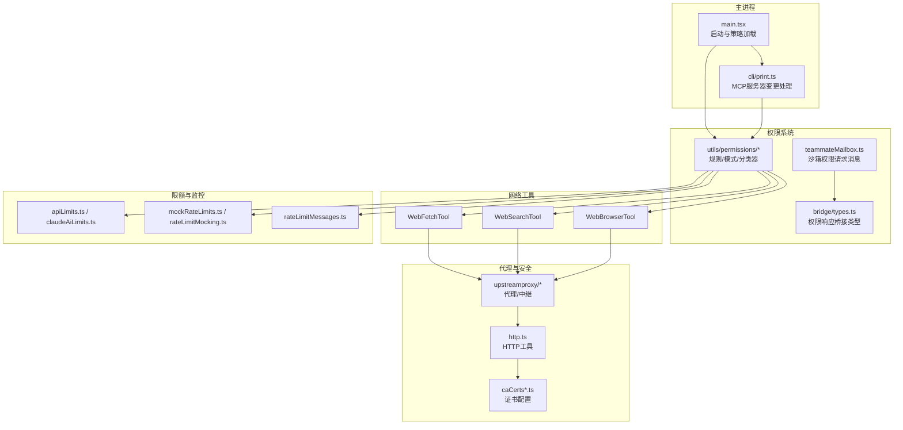
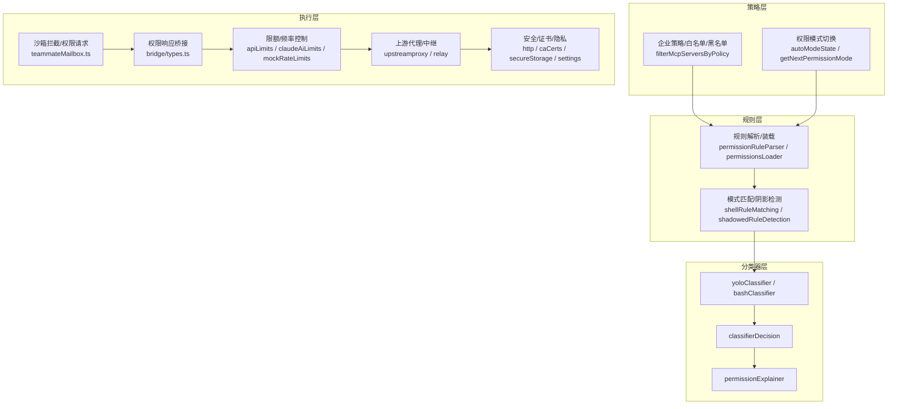
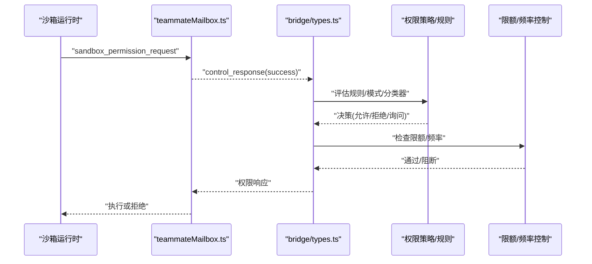
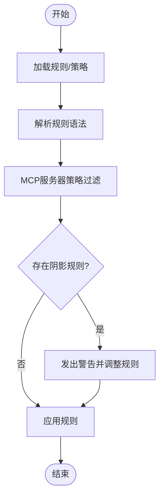
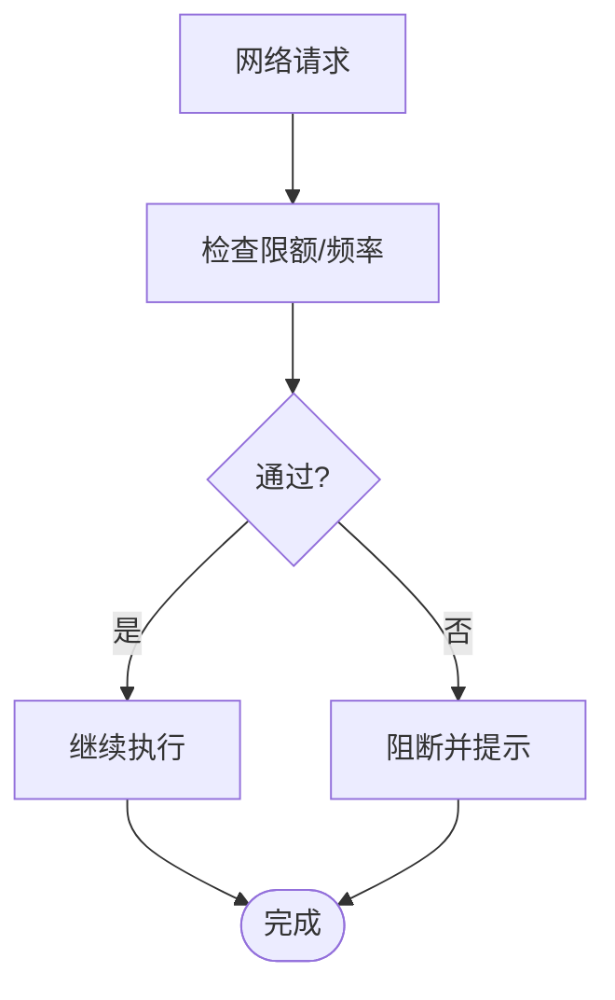
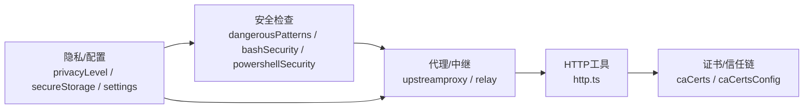
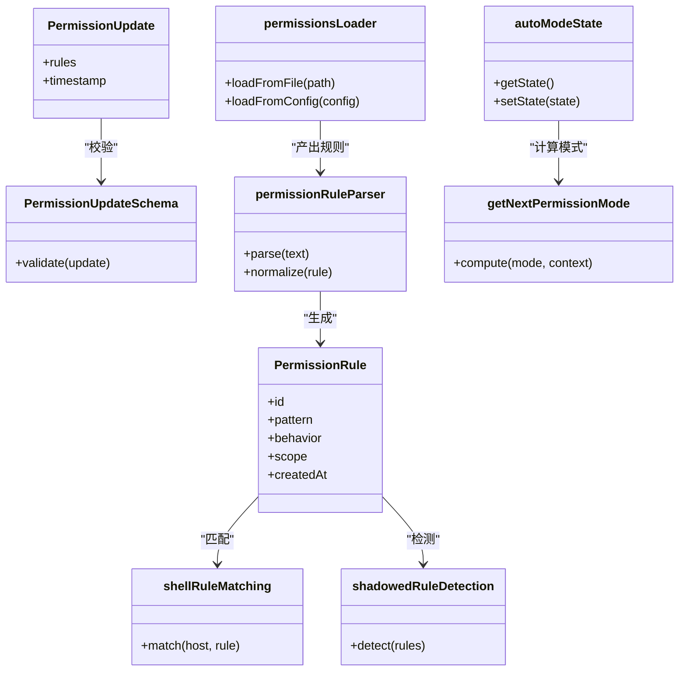
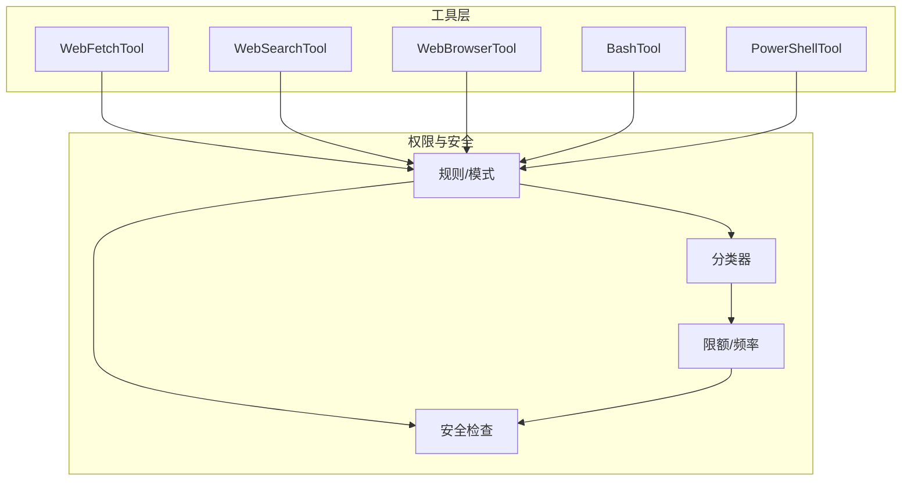
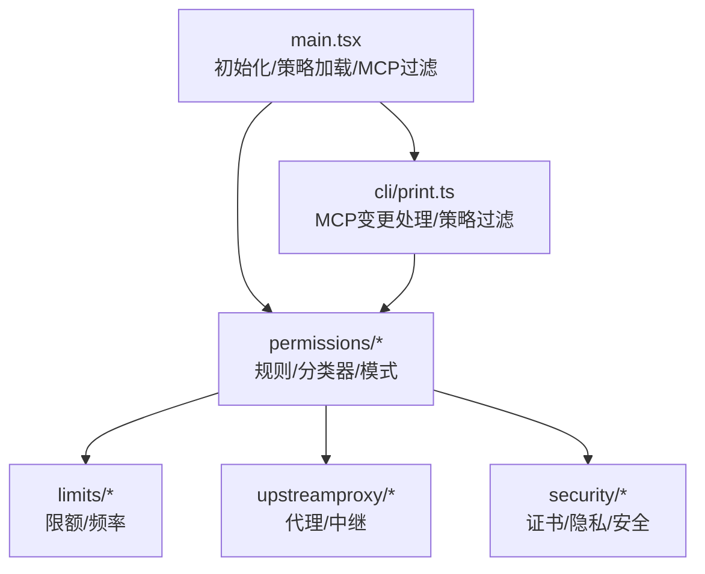

# 网络访问权限

<cite>
**本文引用的文件**
- [src/main.tsx](file://src/main.tsx)
- [src/cli/print.ts](file://src/cli/print.ts)
- [src/utils/teammateMailbox.ts](file://src/utils/teammateMailbox.ts)
- [src/bridge/types.ts](file://src/bridge/types.ts)
- [src/utils/permissions/permissions.ts](file://src/utils/permissions/permissions.ts)
- [src/utils/permissions/permissionRuleParser.ts](file://src/utils/permissions/permissionRuleParser.ts)
- [src/utils/permissions/autoModeState.ts](file://src/utils/permissions/autoModeState.ts)
- [src/utils/permissions/bypassPermissionsKillswitch.ts](file://src/utils/permissions/bypassPermissionsKillswitch.ts)
- [src/utils/permissions/shadowedRuleDetection.ts](file://src/utils/permissions/shadowedRuleDetection.ts)
- [src/utils/permissions/dangerousPatterns.ts](file://src/utils/permissions/dangerousPatterns.ts)
- [src/utils/permissions/classifierDecision.ts](file://src/utils/permissions/classifierDecision.ts)
- [src/utils/permissions/yoloClassifier.ts](file://src/utils/permissions/yoloClassifier.ts)
- [src/utils/permissions/permissionExplainer.ts](file://src/utils/permissions/permissionExplainer.ts)
- [src/utils/permissions/PermissionMode.ts](file://src/utils/permissions/PermissionMode.ts)
- [src/utils/permissions/PermissionResult.ts](file://src/utils/permissions/PermissionResult.ts)
- [src/utils/permissions/PermissionRule.ts](file://src/utils/permissions/PermissionRule.ts)
- [src/utils/permissions/PermissionUpdate.ts](file://src/utils/permissions/PermissionUpdate.ts)
- [src/utils/permissions/PermissionUpdateSchema.ts](file://src/utils/permissions/PermissionUpdateSchema.ts)
- [src/utils/permissions/permissionsLoader.ts](file://src/utils/permissions/permissionsLoader.ts)
- [src/utils/permissions/getNextPermissionMode.ts](file://src/utils/permissions/getNextPermissionMode.ts)
- [src/utils/permissions/bashClassifier.ts](file://src/utils/permissions/bashClassifier.ts)
- [src/utils/permissions/pathValidation.ts](file://src/utils/permissions/pathValidation.ts)
- [src/utils/permissions/shellRuleMatching.ts](file://src/utils/permissions/shellRuleMatching.ts)
- [src/upstreamproxy/upstreamproxy.ts](file://src/upstreamproxy/upstreamproxy.ts)
- [src/upstreamproxy/relay.ts](file://src/upstreamproxy/relay.ts)
- [src/services/analytics/internalLogging.ts](file://src/services/analytics/internalLogging.ts)
- [src/constants/apiLimits.ts](file://src/constants/apiLimits.ts)
- [src/services/claudeAiLimits.ts](file://src/services/claudeAiLimits.ts)
- [src/services/mockRateLimits.ts](file://src/services/mockRateLimits.ts)
- [src/services/rateLimitMessages.ts](file://src/services/rateLimitMessages.ts)
- [src/services/rateLimitMocking.ts](file://src/services/rateLimitMocking.ts)
- [src/tools/WebFetchTool/index.ts](file://src/tools/WebFetchTool/index.ts)
- [src/tools/WebSearchTool/index.ts](file://src/tools/WebSearchTool/index.ts)
- [src/tools/WebBrowserTool/index.ts](file://src/tools/WebBrowserTool/index.ts)
- [src/tools/BashTool/bashPermissions.ts](file://src/tools/BashTool/bashPermissions.ts)
- [src/tools/BashTool/bashSecurity.ts](file://src/tools/BashTool/bashSecurity.ts)
- [src/tools/PowerShellTool/powershellPermissions.ts](file://src/tools/PowerShellTool/powershellPermissions.ts)
- [src/tools/PowerShellTool/powershellSecurity.ts](file://src/tools/PowerShellTool/powershellSecurity.ts)
- [src/utils/http.ts](file://src/utils/http.ts)
- [src/utils/caCerts.ts](file://src/utils/caCerts.ts)
- [src/utils/caCertsConfig.ts](file://src/utils/caCertsConfig.ts)
- [src/utils/secureStorage/secureStorage.ts](file://src/utils/secureStorage/secureStorage.ts)
- [src/utils/secureStorage/secureStorageConfig.ts](file://src/utils/secureStorage/secureStorageConfig.ts)
- [src/utils/settings/settings.ts](file://src/utils/settings/settings.ts)
- [src/utils/settings/privacyLevel.ts](file://src/utils/settings/privacyLevel.ts)
- [src/utils/settings/managedEnv.ts](file://src/utils/settings/managedEnv.ts)
- [src/utils/settings/managedEnvConstants.ts](file://src/utils/settings/managedEnvConstants.ts)
- [src/utils/settings/config.ts](file://src/utils/settings/config.ts)
- [src/utils/settings/configConstants.ts](file://src/utils/settings/configConstants.ts)
</cite>

## 目录
1. [简介](#简介)
2. [项目结构](#项目结构)
3. [核心组件](#核心组件)
4. [架构总览](#架构总览)
5. [详细组件分析](#详细组件分析)
6. [依赖关系分析](#依赖关系分析)
7. [性能考量](#性能考量)
8. [故障排查指南](#故障排查指南)
9. [结论](#结论)
10. [附录](#附录)

## 简介
本文件系统性梳理 Claude Code 的网络访问权限体系，覆盖网页抓取、网络搜索、HTTP 请求等网络操作的权限控制机制。重点包括：
- URL 白名单与域名过滤策略
- 访问频率限制与限额管理
- 网络请求安全检查、代理配置与隐私保护
- 权限配置选项与自定义访问规则
- 网络安全防护与异常流量检测

该体系以“沙箱+策略+分类器”的组合为核心，结合 MCP（Model Context Protocol）服务器接入控制、企业策略过滤、以及运行时权限请求与决策流程，确保在开放能力与安全边界之间取得平衡。

## 项目结构
围绕网络权限的关键目录与文件：
- 权限策略与规则：src/utils/permissions/*
- 运行时权限请求与桥接：src/utils/teammateMailbox.ts、src/bridge/types.ts
- 主进程初始化与 MCP 策略应用：src/main.tsx、src/cli/print.ts
- 上游代理与中继：src/upstreamproxy/*
- 工具层网络能力：src/tools/WebFetchTool、WebSearchTool、WebBrowserTool
- 安全与证书：src/utils/http.ts、src/utils/caCerts.ts、src/utils/caCertsConfig.ts
- 频率限制与限额：src/constants/apiLimits.ts、src/services/claudeAiLimits.ts、src/services/mockRateLimits.ts、src/services/rateLimitMessages.ts、src/services/rateLimitMocking.ts
- 隐私与配置：src/utils/settings/*、src/utils/secureStorage/*

图表来源
- [src/main.tsx](file://src/main.tsx)
- [src/cli/print.ts](file://src/cli/print.ts)
- [src/utils/teammateMailbox.ts](file://src/utils/teammateMailbox.ts)
- [src/bridge/types.ts](file://src/bridge/types.ts)
- [src/utils/permissions/permissions.ts](file://src/utils/permissions/permissions.ts)
- [src/upstreamproxy/upstreamproxy.ts](file://src/upstreamproxy/upstreamproxy.ts)
- [src/upstreamproxy/relay.ts](file://src/upstreamproxy/relay.ts)
- [src/tools/WebFetchTool/index.ts](file://src/tools/WebFetchTool/index.ts)
- [src/tools/WebSearchTool/index.ts](file://src/tools/WebSearchTool/index.ts)
- [src/tools/WebBrowserTool/index.ts](file://src/tools/WebBrowserTool/index.ts)
- [src/utils/http.ts](file://src/utils/http.ts)
- [src/utils/caCerts.ts](file://src/utils/caCerts.ts)
- [src/utils/caCertsConfig.ts](file://src/utils/caCertsConfig.ts)
- [src/constants/apiLimits.ts](file://src/constants/apiLimits.ts)
- [src/services/claudeAiLimits.ts](file://src/services/claudeAiLimits.ts)
- [src/services/mockRateLimits.ts](file://src/services/mockRateLimits.ts)
- [src/services/rateLimitMessages.ts](file://src/services/rateLimitMessages.ts)
- [src/services/rateLimitMocking.ts](file://src/services/rateLimitMocking.ts)

章节来源
- [src/main.tsx](file://src/main.tsx)
- [src/cli/print.ts](file://src/cli/print.ts)

## 核心组件
- 权限规则与模式
  - 规则解析与装载：permissionRuleParser.ts、permissionsLoader.ts
  - 规则模型与更新：PermissionRule.ts、PermissionUpdate.ts、PermissionUpdateSchema.ts
  - 模式匹配与阴影规则检测：shellRuleMatching.ts、shadowedRuleDetection.ts
- 自动模式状态与切换：autoModeState.ts、getNextPermissionMode.ts
- 权限模式与结果：PermissionMode.ts、PermissionResult.ts
- 分类器与解释器：yoloClassifier.ts、bashClassifier.ts、classifierDecision.ts、permissionExplainer.ts
- 危险模式识别：dangerousPatterns.ts
- 运行时权限请求与桥接：teammateMailbox.ts、bridge/types.ts
- MCP 服务器策略：filterMcpServersByPolicy（在 main.tsx 与 cli/print.ts 中使用）
- 限额与频率控制：apiLimits.ts、claudeAiLimits.ts、mockRateLimits.ts、rateLimitMessages.ts、rateLimitMocking.ts
- 代理与安全：upstreamproxy.ts、relay.ts、http.ts、caCerts.ts、caCertsConfig.ts
- 隐私与配置：settings/*、secureStorage/*

章节来源
- [src/utils/permissions/permissions.ts](file://src/utils/permissions/permissions.ts)
- [src/utils/permissions/permissionRuleParser.ts](file://src/utils/permissions/permissionRuleParser.ts)
- [src/utils/permissions/autoModeState.ts](file://src/utils/permissions/autoModeState.ts)
- [src/utils/permissions/getNextPermissionMode.ts](file://src/utils/permissions/getNextPermissionMode.ts)
- [src/utils/permissions/PermissionMode.ts](file://src/utils/permissions/PermissionMode.ts)
- [src/utils/permissions/PermissionResult.ts](file://src/utils/permissions/PermissionResult.ts)
- [src/utils/permissions/yoloClassifier.ts](file://src/utils/permissions/yoloClassifier.ts)
- [src/utils/permissions/bashClassifier.ts](file://src/utils/permissions/bashClassifier.ts)
- [src/utils/permissions/classifierDecision.ts](file://src/utils/permissions/classifierDecision.ts)
- [src/utils/permissions/permissionExplainer.ts](file://src/utils/permissions/permissionExplainer.ts)
- [src/utils/permissions/dangerousPatterns.ts](file://src/utils/permissions/dangerousPatterns.ts)
- [src/utils/permissions/shadowedRuleDetection.ts](file://src/utils/permissions/shadowedRuleDetection.ts)
- [src/utils/permissions/shellRuleMatching.ts](file://src/utils/permissions/shellRuleMatching.ts)
- [src/utils/teammateMailbox.ts](file://src/utils/teammateMailbox.ts)
- [src/bridge/types.ts](file://src/bridge/types.ts)
- [src/constants/apiLimits.ts](file://src/constants/apiLimits.ts)
- [src/services/claudeAiLimits.ts](file://src/services/claudeAiLimits.ts)
- [src/services/mockRateLimits.ts](file://src/services/mockRateLimits.ts)
- [src/services/rateLimitMessages.ts](file://src/services/rateLimitMessages.ts)
- [src/services/rateLimitMocking.ts](file://src/services/rateLimitMocking.ts)
- [src/upstreamproxy/upstreamproxy.ts](file://src/upstreamproxy/upstreamproxy.ts)
- [src/upstreamproxy/relay.ts](file://src/upstreamproxy/relay.ts)
- [src/utils/http.ts](file://src/utils/http.ts)
- [src/utils/caCerts.ts](file://src/utils/caCerts.ts)
- [src/utils/caCertsConfig.ts](file://src/utils/caCertsConfig.ts)
- [src/utils/settings/settings.ts](file://src/utils/settings/settings.ts)
- [src/utils/settings/privacyLevel.ts](file://src/utils/settings/privacyLevel.ts)
- [src/utils/settings/managedEnv.ts](file://src/utils/settings/managedEnv.ts)
- [src/utils/settings/managedEnvConstants.ts](file://src/utils/settings/managedEnvConstants.ts)
- [src/utils/settings/config.ts](file://src/utils/settings/config.ts)
- [src/utils/settings/configConstants.ts](file://src/utils/settings/configConstants.ts)

## 架构总览
网络权限系统由“策略层—规则层—分类器层—执行层”构成，并通过 MCP 服务器接入与代理中继实现对外部网络的统一管控。

图表来源
- [src/main.tsx](file://src/main.tsx)
- [src/cli/print.ts](file://src/cli/print.ts)
- [src/utils/permissions/permissions.ts](file://src/utils/permissions/permissions.ts)
- [src/utils/permissions/permissionRuleParser.ts](file://src/utils/permissions/permissionRuleParser.ts)
- [src/utils/permissions/autoModeState.ts](file://src/utils/permissions/autoModeState.ts)
- [src/utils/permissions/getNextPermissionMode.ts](file://src/utils/permissions/getNextPermissionMode.ts)
- [src/utils/permissions/shellRuleMatching.ts](file://src/utils/permissions/shellRuleMatching.ts)
- [src/utils/permissions/shadowedRuleDetection.ts](file://src/utils/permissions/shadowedRuleDetection.ts)
- [src/utils/permissions/yoloClassifier.ts](file://src/utils/permissions/yoloClassifier.ts)
- [src/utils/permissions/bashClassifier.ts](file://src/utils/permissions/bashClassifier.ts)
- [src/utils/permissions/classifierDecision.ts](file://src/utils/permissions/classifierDecision.ts)
- [src/utils/permissions/permissionExplainer.ts](file://src/utils/permissions/permissionExplainer.ts)
- [src/utils/teammateMailbox.ts](file://src/utils/teammateMailbox.ts)
- [src/bridge/types.ts](file://src/bridge/types.ts)
- [src/constants/apiLimits.ts](file://src/constants/apiLimits.ts)
- [src/services/claudeAiLimits.ts](file://src/services/claudeAiLimits.ts)
- [src/services/mockRateLimits.ts](file://src/services/mockRateLimits.ts)
- [src/upstreamproxy/upstreamproxy.ts](file://src/upstreamproxy/upstreamproxy.ts)
- [src/upstreamproxy/relay.ts](file://src/upstreamproxy/relay.ts)
- [src/utils/http.ts](file://src/utils/http.ts)
- [src/utils/caCerts.ts](file://src/utils/caCerts.ts)
- [src/utils/secureStorage/secureStorage.ts](file://src/utils/secureStorage/secureStorage.ts)
- [src/utils/settings/settings.ts](file://src/utils/settings/settings.ts)

## 详细组件分析

### 权限请求与响应流程
当沙箱运行时检测到对非允许主机的网络访问，会通过邮箱通道向主进程发送权限请求消息；主进程根据策略与规则进行决策，并通过桥接事件返回权限响应。

图表来源
- [src/utils/teammateMailbox.ts](file://src/utils/teammateMailbox.ts)
- [src/bridge/types.ts](file://src/bridge/types.ts)
- [src/utils/permissions/permissions.ts](file://src/utils/permissions/permissions.ts)
- [src/constants/apiLimits.ts](file://src/constants/apiLimits.ts)
- [src/services/claudeAiLimits.ts](file://src/services/claudeAiLimits.ts)

章节来源
- [src/utils/teammateMailbox.ts](file://src/utils/teammateMailbox.ts)
- [src/bridge/types.ts](file://src/bridge/types.ts)

### URL 白名单与域名过滤
- 规则解析与装载：从配置与策略源加载规则，支持插件通道与手动配置的 MCP 服务器。
- 域名过滤：MCP 服务器接入前通过策略过滤，企业策略允许/禁止列表生效。
- 阴影规则检测：避免高宽度过滤规则被更窄规则覆盖导致的意外放行。

图表来源
- [src/utils/permissions/permissionRuleParser.ts](file://src/utils/permissions/permissionRuleParser.ts)
- [src/utils/permissions/permissionsLoader.ts](file://src/utils/permissions/permissionsLoader.ts)
- [src/main.tsx](file://src/main.tsx)
- [src/cli/print.ts](file://src/cli/print.ts)
- [src/utils/permissions/shadowedRuleDetection.ts](file://src/utils/permissions/shadowedRuleDetection.ts)

章节来源
- [src/utils/permissions/permissionRuleParser.ts](file://src/utils/permissions/permissionRuleParser.ts)
- [src/utils/permissions/permissionsLoader.ts](file://src/utils/permissions/permissionsLoader.ts)
- [src/main.tsx](file://src/main.tsx)
- [src/cli/print.ts](file://src/cli/print.ts)
- [src/utils/permissions/shadowedRuleDetection.ts](file://src/utils/permissions/shadowedRuleDetection.ts)

### 访问频率限制与限额
- 全局限额：apiLimits.ts 定义通用限制；claudeAiLimits.ts 提供特定服务限额。
- 模拟与提示：mockRateLimits.ts 与 rateLimitMocking.ts 支持测试场景；rateLimitMessages.ts 提供用户提示。
- 限额检查：在权限决策与网络请求路径中进行实时检查。

图表来源
- [src/constants/apiLimits.ts](file://src/constants/apiLimits.ts)
- [src/services/claudeAiLimits.ts](file://src/services/claudeAiLimits.ts)
- [src/services/mockRateLimits.ts](file://src/services/mockRateLimits.ts)
- [src/services/rateLimitMessages.ts](file://src/services/rateLimitMessages.ts)
- [src/services/rateLimitMocking.ts](file://src/services/rateLimitMocking.ts)

章节来源
- [src/constants/apiLimits.ts](file://src/constants/apiLimits.ts)
- [src/services/claudeAiLimits.ts](file://src/services/claudeAiLimits.ts)
- [src/services/mockRateLimits.ts](file://src/services/mockRateLimits.ts)
- [src/services/rateLimitMessages.ts](file://src/services/rateLimitMessages.ts)
- [src/services/rateLimitMocking.ts](file://src/services/rateLimitMocking.ts)

### 网络请求安全检查、代理配置与隐私保护
- 安全检查：危险模式识别（dangerousPatterns.ts）、命令安全（bashSecurity.ts、powershellSecurity.ts）。
- 代理配置：upstreamproxy.ts 与 relay.ts 提供代理/中继能力，http.ts 封装 HTTP 工具。
- 证书与信任链：caCerts.ts、caCertsConfig.ts 管理 CA 证书与配置。
- 隐私保护：privacyLevel.ts、secureStorage/*、settings/* 控制隐私级别与敏感信息存储。

图表来源
- [src/utils/permissions/dangerousPatterns.ts](file://src/utils/permissions/dangerousPatterns.ts)
- [src/tools/BashTool/bashSecurity.ts](file://src/tools/BashTool/bashSecurity.ts)
- [src/tools/PowerShellTool/powershellSecurity.ts](file://src/tools/PowerShellTool/powershellSecurity.ts)
- [src/upstreamproxy/upstreamproxy.ts](file://src/upstreamproxy/upstreamproxy.ts)
- [src/upstreamproxy/relay.ts](file://src/upstreamproxy/relay.ts)
- [src/utils/http.ts](file://src/utils/http.ts)
- [src/utils/caCerts.ts](file://src/utils/caCerts.ts)
- [src/utils/caCertsConfig.ts](file://src/utils/caCertsConfig.ts)
- [src/utils/settings/privacyLevel.ts](file://src/utils/settings/privacyLevel.ts)
- [src/utils/secureStorage/secureStorage.ts](file://src/utils/secureStorage/secureStorage.ts)
- [src/utils/settings/settings.ts](file://src/utils/settings/settings.ts)

章节来源
- [src/utils/permissions/dangerousPatterns.ts](file://src/utils/permissions/dangerousPatterns.ts)
- [src/tools/BashTool/bashSecurity.ts](file://src/tools/BashTool/bashSecurity.ts)
- [src/tools/PowerShellTool/powershellSecurity.ts](file://src/tools/PowerShellTool/powershellSecurity.ts)
- [src/upstreamproxy/upstreamproxy.ts](file://src/upstreamproxy/upstreamproxy.ts)
- [src/upstreamproxy/relay.ts](file://src/upstreamproxy/relay.ts)
- [src/utils/http.ts](file://src/utils/http.ts)
- [src/utils/caCerts.ts](file://src/utils/caCerts.ts)
- [src/utils/caCertsConfig.ts](file://src/utils/caCertsConfig.ts)
- [src/utils/settings/privacyLevel.ts](file://src/utils/settings/privacyLevel.ts)
- [src/utils/secureStorage/secureStorage.ts](file://src/utils/secureStorage/secureStorage.ts)
- [src/utils/settings/settings.ts](file://src/utils/settings/settings.ts)

### 网络权限配置选项与自定义访问规则
- 规则模型：PermissionRule.ts 描述规则字段；PermissionUpdate.ts/Schema.ts 约束更新格式。
- 规则装载：permissionsLoader.ts 负责从不同来源装载规则。
- 规则解析：permissionRuleParser.ts 解析规则语法并生成可执行规则集。
- 模式匹配：shellRuleMatching.ts 实现主机/路径匹配；shadowedRuleDetection.ts 检测阴影规则。
- 自动模式：autoModeState.ts 与 getNextPermissionMode.ts 管理自动模式切换逻辑。
- 分类器与解释：yoloClassifier.ts、bashClassifier.ts、classifierDecision.ts、permissionExplainer.ts 提供智能决策与解释。

图表来源
- [src/utils/permissions/PermissionRule.ts](file://src/utils/permissions/PermissionRule.ts)
- [src/utils/permissions/PermissionUpdate.ts](file://src/utils/permissions/PermissionUpdate.ts)
- [src/utils/permissions/PermissionUpdateSchema.ts](file://src/utils/permissions/PermissionUpdateSchema.ts)
- [src/utils/permissions/permissionsLoader.ts](file://src/utils/permissions/permissionsLoader.ts)
- [src/utils/permissions/permissionRuleParser.ts](file://src/utils/permissions/permissionRuleParser.ts)
- [src/utils/permissions/shellRuleMatching.ts](file://src/utils/permissions/shellRuleMatching.ts)
- [src/utils/permissions/shadowedRuleDetection.ts](file://src/utils/permissions/shadowedRuleDetection.ts)
- [src/utils/permissions/autoModeState.ts](file://src/utils/permissions/autoModeState.ts)
- [src/utils/permissions/getNextPermissionMode.ts](file://src/utils/permissions/getNextPermissionMode.ts)

章节来源
- [src/utils/permissions/PermissionRule.ts](file://src/utils/permissions/PermissionRule.ts)
- [src/utils/permissions/PermissionUpdate.ts](file://src/utils/permissions/PermissionUpdate.ts)
- [src/utils/permissions/PermissionUpdateSchema.ts](file://src/utils/permissions/PermissionUpdateSchema.ts)
- [src/utils/permissions/permissionsLoader.ts](file://src/utils/permissions/permissionsLoader.ts)
- [src/utils/permissions/permissionRuleParser.ts](file://src/utils/permissions/permissionRuleParser.ts)
- [src/utils/permissions/shellRuleMatching.ts](file://src/utils/permissions/shellRuleMatching.ts)
- [src/utils/permissions/shadowedRuleDetection.ts](file://src/utils/permissions/shadowedRuleDetection.ts)
- [src/utils/permissions/autoModeState.ts](file://src/utils/permissions/autoModeState.ts)
- [src/utils/permissions/getNextPermissionMode.ts](file://src/utils/permissions/getNextPermissionMode.ts)

### 网络工具与权限集成
- WebFetchTool：网页抓取工具，受权限与限额控制。
- WebSearchTool：网络搜索工具，受权限与限额控制。
- WebBrowserTool：浏览器工具，受权限与限额控制。
- BashTool/PowerShellTool：命令执行工具，结合 bashPermissions.ts、powershellPermissions.ts 与安全检查共同保障网络访问安全。

图表来源
- [src/tools/WebFetchTool/index.ts](file://src/tools/WebFetchTool/index.ts)
- [src/tools/WebSearchTool/index.ts](file://src/tools/WebSearchTool/index.ts)
- [src/tools/WebBrowserTool/index.ts](file://src/tools/WebBrowserTool/index.ts)
- [src/tools/BashTool/bashPermissions.ts](file://src/tools/BashTool/bashPermissions.ts)
- [src/tools/PowerShellTool/powershellPermissions.ts](file://src/tools/PowerShellTool/powershellPermissions.ts)
- [src/utils/permissions/permissions.ts](file://src/utils/permissions/permissions.ts)
- [src/constants/apiLimits.ts](file://src/constants/apiLimits.ts)
- [src/services/claudeAiLimits.ts](file://src/services/claudeAiLimits.ts)

章节来源
- [src/tools/WebFetchTool/index.ts](file://src/tools/WebFetchTool/index.ts)
- [src/tools/WebSearchTool/index.ts](file://src/tools/WebSearchTool/index.ts)
- [src/tools/WebBrowserTool/index.ts](file://src/tools/WebBrowserTool/index.ts)
- [src/tools/BashTool/bashPermissions.ts](file://src/tools/BashTool/bashPermissions.ts)
- [src/tools/PowerShellTool/powershellPermissions.ts](file://src/tools/PowerShellTool/powershellPermissions.ts)
- [src/utils/permissions/permissions.ts](file://src/utils/permissions/permissions.ts)
- [src/constants/apiLimits.ts](file://src/constants/apiLimits.ts)
- [src/services/claudeAiLimits.ts](file://src/services/claudeAiLimits.ts)

## 依赖关系分析
- 主进程初始化阶段加载策略与 MCP 服务器配置，并在非企业严格模式下应用策略过滤。
- CLI 层处理 MCP 服务器变更时同样应用企业策略过滤，保证一致性。
- 权限系统依赖于规则/分类器/限额/代理/证书/隐私配置等多模块协作。

图表来源
- [src/main.tsx](file://src/main.tsx)
- [src/cli/print.ts](file://src/cli/print.ts)
- [src/utils/permissions/permissions.ts](file://src/utils/permissions/permissions.ts)
- [src/constants/apiLimits.ts](file://src/constants/apiLimits.ts)
- [src/services/claudeAiLimits.ts](file://src/services/claudeAiLimits.ts)
- [src/upstreamproxy/upstreamproxy.ts](file://src/upstreamproxy/upstreamproxy.ts)
- [src/upstreamproxy/relay.ts](file://src/upstreamproxy/relay.ts)
- [src/utils/caCerts.ts](file://src/utils/caCerts.ts)
- [src/utils/secureStorage/secureStorage.ts](file://src/utils/secureStorage/secureStorage.ts)
- [src/utils/settings/privacyLevel.ts](file://src/utils/settings/privacyLevel.ts)

章节来源
- [src/main.tsx](file://src/main.tsx)
- [src/cli/print.ts](file://src/cli/print.ts)

## 性能考量
- 并发与序列化：applyMcpServerChanges 在处理 MCP 服务器变更时串行化调用，避免竞态。
- 初始化重叠：在非交互会话中预取 claude.ai MCP 配置并与初始化重叠，减少等待时间。
- 代理延迟：上游代理/中继可能引入额外延迟，建议在策略允许的前提下优化连接复用与超时配置。

章节来源
- [src/cli/print.ts](file://src/cli/print.ts)
- [src/main.tsx](file://src/main.tsx)

## 故障排查指南
- 权限请求未响应
  - 检查沙箱是否正确发送 sandbox_permission_request 消息。
  - 确认主进程桥接事件 control_response 是否正常返回。
- MCP 服务器未生效
  - 核对企业策略 allowedMcpServers/deniedMcpServers 是否阻止了目标服务器。
  - 确认 CLI 与主进程均应用了相同的策略过滤。
- 限额触发
  - 查看 rateLimitMessages.ts 的提示信息，确认是否达到 apiLimits 或 claudeAiLimits。
  - 使用 mockRateLimits.ts 进行测试定位问题。
- 代理/证书问题
  - 检查 caCerts.ts/Config.ts 配置是否正确。
  - 确认 http.ts 的代理参数与环境变量一致。
- 隐私与配置
  - 检查 privacyLevel.ts 与 secureStorage/* 是否限制了必要的访问。

章节来源
- [src/utils/teammateMailbox.ts](file://src/utils/teammateMailbox.ts)
- [src/bridge/types.ts](file://src/bridge/types.ts)
- [src/cli/print.ts](file://src/cli/print.ts)
- [src/main.tsx](file://src/main.tsx)
- [src/services/rateLimitMessages.ts](file://src/services/rateLimitMessages.ts)
- [src/services/mockRateLimits.ts](file://src/services/mockRateLimits.ts)
- [src/utils/caCerts.ts](file://src/utils/caCerts.ts)
- [src/utils/caCertsConfig.ts](file://src/utils/caCertsConfig.ts)
- [src/utils/http.ts](file://src/utils/http.ts)
- [src/utils/settings/privacyLevel.ts](file://src/utils/settings/privacyLevel.ts)
- [src/utils/secureStorage/secureStorage.ts](file://src/utils/secureStorage/secureStorage.ts)

## 结论
Claude Code 的网络访问权限体系通过“策略—规则—分类器—执行—代理—安全—隐私”的闭环设计，在开放网络能力的同时，确保企业级合规与运行时安全可控。MCP 服务器接入控制、URL 白名单与域名过滤、访问频率限制、代理与证书管理、以及隐私配置共同构成了完整的网络权限基础设施。建议在实际部署中结合企业策略与业务场景，合理配置规则与限额，并持续监控异常流量与权限请求，以提升整体安全性与稳定性。

## 附录
- 关键配置项参考
  - 限额：apiLimits.ts、claudeAiLimits.ts
  - 限额提示与模拟：rateLimitMessages.ts、mockRateLimits.ts、rateLimitMocking.ts
  - 代理与中继：upstreamproxy.ts、relay.ts
  - 安全与证书：http.ts、caCerts.ts、caCertsConfig.ts
  - 隐私与配置：privacyLevel.ts、secureStorage/*、settings/*
- 常见问题定位清单
  - 权限请求未响应：检查 teammateMailbox.ts 与 bridge/types.ts
  - MCP 服务器未生效：检查企业策略与 filterMcpServersByPolicy 应用
  - 限额触发：核对 apiLimits/claudeAiLimits 与 rateLimitMessages
  - 代理/证书：核对 caCerts 与 http 代理配置
  - 隐私限制：核对 privacyLevel 与 secureStorage 设置