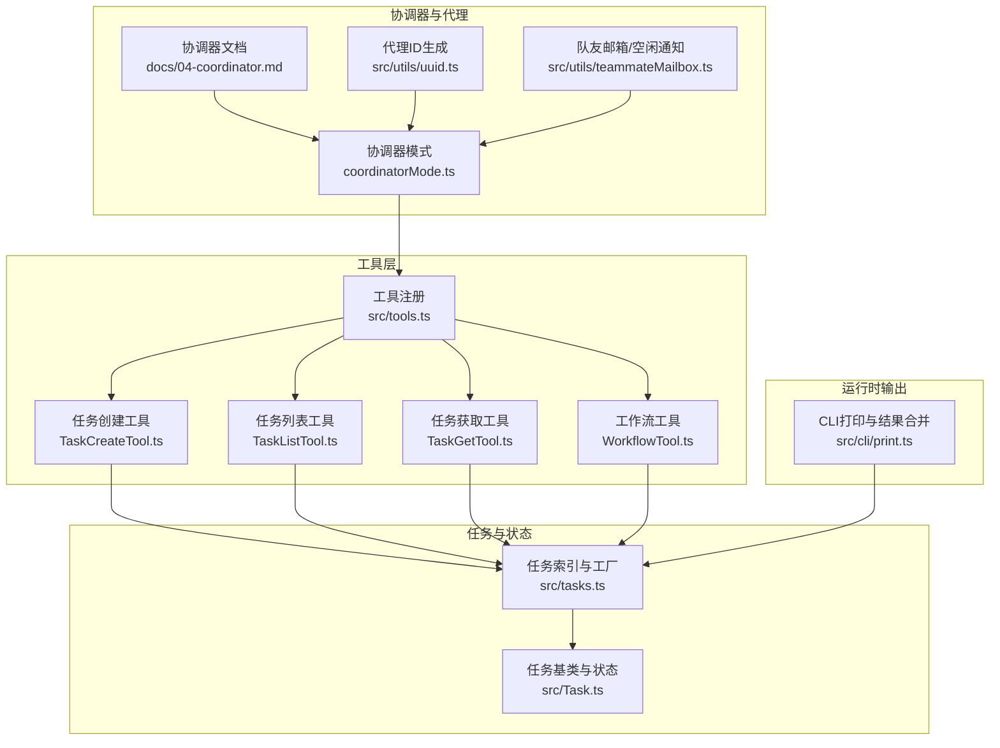
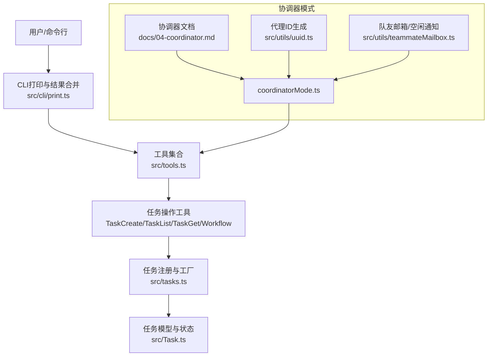
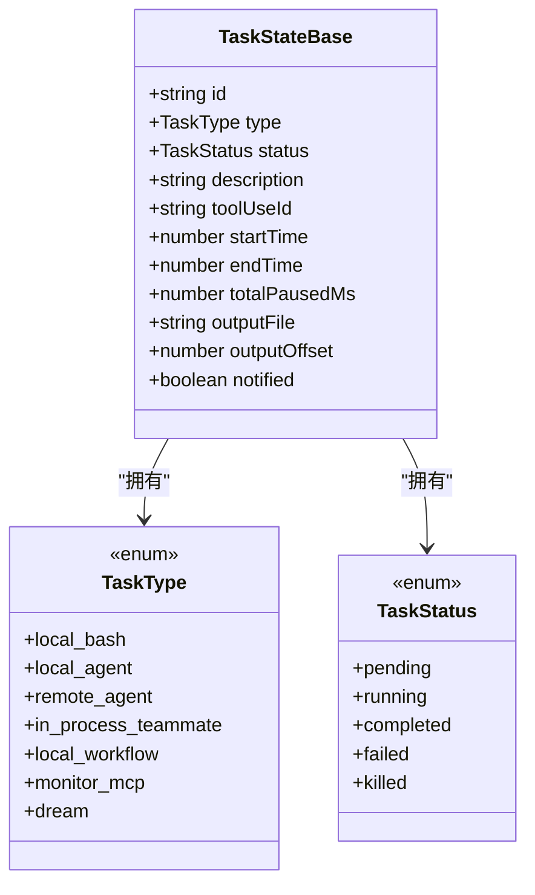
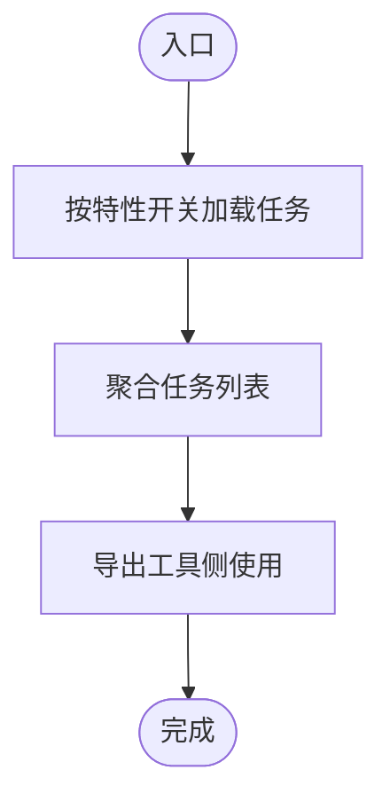
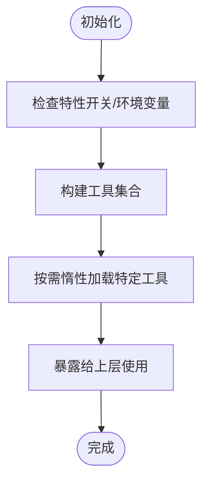
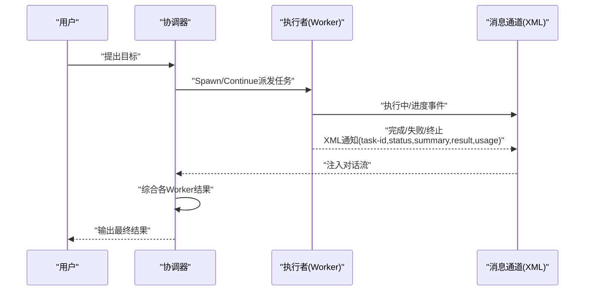
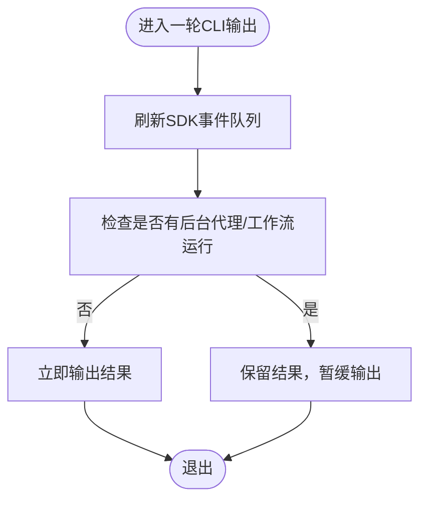
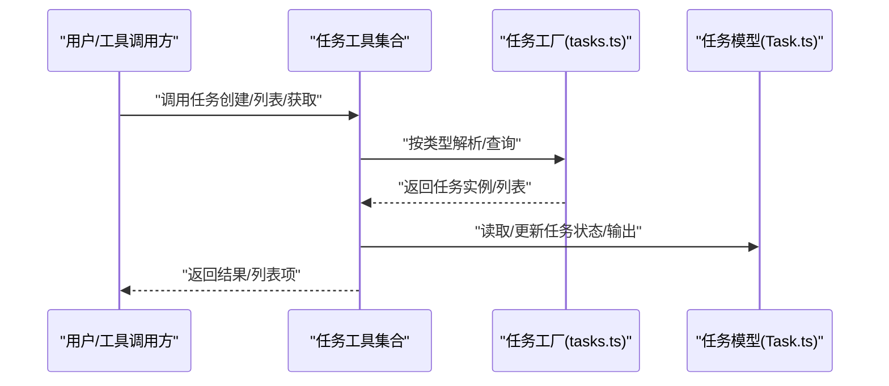
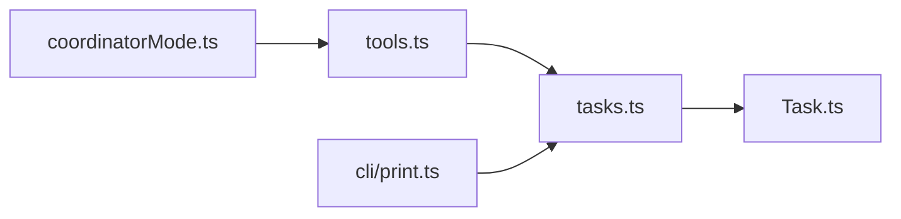

# 代理与工作流工具

<cite>
**本文引用的文件**
- [src/Task.ts](file://src/Task.ts)
- [src/tasks.ts](file://src/tasks.ts)
- [src/tools.ts](file://src/tools.ts)
- [src/cli/print.ts](file://src/cli/print.ts)
- [src/coordinator/coordinatorMode.ts](file://src/coordinator/coordinatorMode.ts)
- [docs/04-coordinator.md](file://docs/04-coordinator.md)
- [src/utils/uuid.ts](file://src/utils/uuid.ts)
- [src/utils/teammateMailbox.ts](file://src/utils/teammateMailbox.ts)
- [src/tools/TaskCreateTool/TaskCreateTool.ts](file://src/tools/TaskCreateTool/TaskCreateTool.ts)
- [src/tools/TaskListTool/TaskListTool.ts](file://src/tools/TaskListTool/TaskListTool.ts)
- [src/tools/TaskGetTool/TaskGetTool.ts](file://src/tools/TaskGetTool/TaskGetTool.ts)
- [src/tools/WorkflowTool/WorkflowTool.ts](file://src/tools/WorkflowTool/WorkflowTool.ts)
</cite>

## 目录
1. [简介](#简介)
2. [项目结构](#项目结构)
3. [核心组件](#核心组件)
4. [架构总览](#架构总览)
5. [详细组件分析](#详细组件分析)
6. [依赖关系分析](#依赖关系分析)
7. [性能考量](#性能考量)
8. [故障排查指南](#故障排查指南)
9. [结论](#结论)
10. [附录](#附录)

## 简介
本文件系统性梳理代理与工作流工具体系，覆盖代理工具、工作流工具、任务创建工具、任务列表工具、任务获取工具的功能特性与实现要点；深入解析代理调度机制、工作流编排、任务状态管理与并发控制；提供可落地的使用示例与代码路径指引，展示代理与工作流在自动化任务中的应用；阐明任务生命周期、依赖关系、优先级调度与错误恢复机制，并给出代理通信协议、状态同步与性能监控策略。

## 项目结构
围绕“代理—工作流—任务”的主线，相关能力分布在以下模块：
- 任务模型与状态：src/Task.ts、src/tasks.ts
- 工具注册与可用工具集合：src/tools.ts
- 协调器模式与多代理编排：src/coordinator/coordinatorMode.ts、docs/04-coordinator.md
- CLI 输出与后台任务结果合并：src/cli/print.ts
- 代理标识与消息通知：src/utils/uuid.ts、src/utils/teammateMailbox.ts
- 任务与工作流工具：src/tools/TaskCreateTool/TaskCreateTool.ts、src/tools/TaskListTool/TaskListTool.ts、src/tools/TaskGetTool/TaskGetTool.ts、src/tools/WorkflowTool/WorkflowTool.ts

**图表来源**
- [src/tools.ts:54-251](file://src/tools.ts#L54-L251)
- [src/tools/TaskCreateTool/TaskCreateTool.ts](file://src/tools/TaskCreateTool/TaskCreateTool.ts)
- [src/tools/TaskListTool/TaskListTool.ts](file://src/tools/TaskListTool/TaskListTool.ts)
- [src/tools/TaskGetTool/TaskGetTool.ts](file://src/tools/TaskGetTool/TaskGetTool.ts)
- [src/tools/WorkflowTool/WorkflowTool.ts](file://src/tools/WorkflowTool/WorkflowTool.ts)
- [src/tasks.ts:17-39](file://src/tasks.ts#L17-L39)
- [src/Task.ts:1-57](file://src/Task.ts#L1-L57)
- [src/coordinator/coordinatorMode.ts](file://src/coordinator/coordinatorMode.ts)
- [docs/04-coordinator.md:1-135](file://docs/04-coordinator.md#L1-L135)
- [src/utils/uuid.ts:1-27](file://src/utils/uuid.ts#L1-L27)
- [src/utils/teammateMailbox.ts:391-430](file://src/utils/teammateMailbox.ts#L391-L430)
- [src/cli/print.ts:2216-2254](file://src/cli/print.ts#L2216-L2254)

**章节来源**
- [src/tools.ts:54-251](file://src/tools.ts#L54-L251)
- [src/tasks.ts:17-39](file://src/tasks.ts#L17-L39)
- [src/Task.ts:1-57](file://src/Task.ts#L1-L57)
- [src/coordinator/coordinatorMode.ts](file://src/coordinator/coordinatorMode.ts)
- [docs/04-coordinator.md:1-135](file://docs/04-coordinator.md#L1-L135)
- [src/utils/uuid.ts:1-27](file://src/utils/uuid.ts#L1-L27)
- [src/utils/teammateMailbox.ts:391-430](file://src/utils/teammateMailbox.ts#L391-L430)
- [src/cli/print.ts:2216-2254](file://src/cli/print.ts#L2216-L2254)

## 核心组件
- 任务模型与状态
  - 定义任务类型、状态、终止态判断、任务句柄与上下文等基础结构，支撑所有任务生命周期管理。
  - 关键点：统一的任务状态机（待定/运行/完成/失败/被终止）、输出落盘路径与偏移、通知标记等。
- 任务注册与工厂
  - 提供任务集合与按类型检索，支持按特性开关动态加载本地工作流与监控任务。
- 工具注册与可用工具集合
  - 动态聚合工具，包括任务创建/更新/查询/列表、工作流工具、发送消息、计划任务等，按环境与特性开关启用。
- 协调器模式与代理调度
  - 将代理分为“指挥官”和“执行者”，通过工具过滤、Spawn/Continue决策、并发规则与XML通知协议实现编排。
- CLI输出与结果合并
  - 在后台代理/工作流运行期间延迟输出结果，确保进度事件先于最终结果到达，提升交互体验。
- 代理标识与消息通知
  - 生成稳定的代理ID，构建队友空闲通知消息，便于状态同步与异常上报。

**章节来源**
- [src/Task.ts:1-57](file://src/Task.ts#L1-L57)
- [src/tasks.ts:17-39](file://src/tasks.ts#L17-L39)
- [src/tools.ts:54-251](file://src/tools.ts#L54-L251)
- [src/coordinator/coordinatorMode.ts](file://src/coordinator/coordinatorMode.ts)
- [docs/04-coordinator.md:58-110](file://docs/04-coordinator.md#L58-L110)
- [src/cli/print.ts:2216-2254](file://src/cli/print.ts#L2216-L2254)
- [src/utils/uuid.ts:1-27](file://src/utils/uuid.ts#L1-L27)
- [src/utils/teammateMailbox.ts:391-430](file://src/utils/teammateMailbox.ts#L391-L430)

## 架构总览
下图展示了从工具到任务再到协调器的整体架构，以及CLI如何在后台任务运行时进行结果合并与转发。

**图表来源**
- [src/cli/print.ts:2216-2254](file://src/cli/print.ts#L2216-L2254)
- [src/tools.ts:54-251](file://src/tools.ts#L54-L251)
- [src/tasks.ts:17-39](file://src/tasks.ts#L17-L39)
- [src/Task.ts:1-57](file://src/Task.ts#L1-L57)
- [src/coordinator/coordinatorMode.ts](file://src/coordinator/coordinatorMode.ts)
- [docs/04-coordinator.md:1-135](file://docs/04-coordinator.md#L1-L135)
- [src/utils/uuid.ts:1-27](file://src/utils/uuid.ts#L1-L27)
- [src/utils/teammateMailbox.ts:391-430](file://src/utils/teammateMailbox.ts#L391-L430)

## 详细组件分析

### 任务模型与状态（Task）
- 数据结构与复杂度
  - 任务类型枚举：常量时间选择；状态机：常量时间判定终止态；输出路径与偏移：常量时间计算。
  - 时间复杂度：状态转换与查询均为O(1)；空间复杂度：每任务常量开销。
- 关键职责
  - 统一任务状态机与生命周期字段（开始/结束时间、暂停累计、输出路径等）。
  - 终止态判断：避免对已完成/失败/被终止任务进行二次注入或清理。
- 性能与可靠性
  - 输出落盘与偏移有助于增量记录与回放；通知标记避免重复广播。
- 错误处理
  - 终止态后拒绝注入消息，防止幽灵状态；配合CLI延迟输出策略，避免竞态。

**图表来源**
- [src/Task.ts:6-57](file://src/Task.ts#L6-L57)

**章节来源**
- [src/Task.ts:1-57](file://src/Task.ts#L1-L57)

### 任务注册与工厂（tasks.ts）
- 实现模式
  - 通过getAllTasks聚合内置任务，按特性开关动态引入本地工作流与监控任务，避免循环依赖。
- 使用场景
  - 工具侧根据任务类型查找对应实现，驱动具体执行。
- 复杂度
  - 查找：O(n)遍历；可通过Map优化为O(1)，当前为内联数组以简化依赖。

**图表来源**
- [src/tasks.ts:17-39](file://src/tasks.ts#L17-L39)

**章节来源**
- [src/tasks.ts:17-39](file://src/tasks.ts#L17-L39)

### 工具注册与可用工具集合（tools.ts）
- 功能特性
  - 条件化注册：按环境变量与特性开关启用任务工具、工作流工具、计划任务、远程触发、监控等。
  - 动态导入：避免循环依赖，按需加载团队创建/删除、发送消息等工具。
- 与任务的关系
  - 任务创建/更新/查询/列表工具与任务工厂协作，形成完整的任务生命周期闭环。
- 复杂度
  - 注册过程为线性扫描；工具实例化为惰性求值，整体O(n)。

**图表来源**
- [src/tools.ts:54-251](file://src/tools.ts#L54-L251)

**章节来源**
- [src/tools.ts:54-251](file://src/tools.ts#L54-L251)

### 协调器模式与代理调度（coordinatorMode.ts + docs/04-coordinator.md）
- 核心思想
  - 指挥官不直接操作代码，仅负责任务拆解、综合与调度；执行者并行完成具体工作。
- 通信协议
  - 执行结果以XML格式注入对话流，包含任务ID、状态、摘要、最终结果与用量统计。
- 并发管理
  - 只读任务自由并行；写操作在同一组文件上互斥；验证任务可与不同区域的实施并行。
- Spawn/Continue决策
  - 基于上下文重叠度：研究文件即编辑文件则Continue；研究广而实施窄则Spawn；修正失败或扩展近期工作则Continue；验证他人改动或首次方案错误则Spawn。
- 空闲通知
  - 队友空闲时发送通知消息，包含原因、摘要、已完成任务ID及状态等，便于领导者接管或评估。

**图表来源**
- [docs/04-coordinator.md:58-110](file://docs/04-coordinator.md#L58-L110)
- [src/utils/teammateMailbox.ts:391-430](file://src/utils/teammateMailbox.ts#L391-L430)

**章节来源**
- [src/coordinator/coordinatorMode.ts](file://src/coordinator/coordinatorMode.ts)
- [docs/04-coordinator.md:1-135](file://docs/04-coordinator.md#L1-L135)
- [src/utils/teammateMailbox.ts:391-430](file://src/utils/teammateMailbox.ts#L391-L430)

### CLI输出与结果合并（print.ts）
- 关键行为
  - 在后台代理/工作流仍在运行时延迟输出最终结果，确保进度事件先到达。
  - 对SDK事件进行批量刷新，保证实时性。
- 影响
  - 改善用户体验，避免结果与进度混杂；减少CLI端的等待与闪烁。

**图表来源**
- [src/cli/print.ts:2216-2254](file://src/cli/print.ts#L2216-L2254)

**章节来源**
- [src/cli/print.ts:2216-2254](file://src/cli/print.ts#L2216-L2254)

### 代理标识与消息通知（uuid.ts + teammateMailbox.ts）
- 代理ID生成
  - 生成带前缀的稳定ID，与任务ID风格一致，便于关联与追踪。
- 空闲通知
  - 结构化消息包含来源、时间戳、空闲原因、摘要、已完成任务ID与状态、失败原因等，便于状态同步与异常恢复。

**章节来源**
- [src/utils/uuid.ts:1-27](file://src/utils/uuid.ts#L1-L27)
- [src/utils/teammateMailbox.ts:391-430](file://src/utils/teammateMailbox.ts#L391-L430)

### 任务创建/列表/获取工具（TaskCreateTool/TaskListTool/TaskGetTool）
- 任务创建工具
  - 负责创建任务、设置描述与初始状态、分配输出路径与偏移、触发任务工厂创建具体任务实例。
- 任务列表工具
  - 查询当前所有任务，支持分页/筛选/排序等（如存在），并与CLI输出整合。
- 任务获取工具
  - 根据任务ID获取任务详情，包含状态、进度、输出与错误信息。
- 与任务工厂协作
  - 通过任务类型映射到具体任务实现，形成统一的CRUD接口。

**图表来源**
- [src/tools/TaskCreateTool/TaskCreateTool.ts](file://src/tools/TaskCreateTool/TaskCreateTool.ts)
- [src/tools/TaskListTool/TaskListTool.ts](file://src/tools/TaskListTool/TaskListTool.ts)
- [src/tools/TaskGetTool/TaskGetTool.ts](file://src/tools/TaskGetTool/TaskGetTool.ts)
- [src/tasks.ts:17-39](file://src/tasks.ts#L17-L39)
- [src/Task.ts:1-57](file://src/Task.ts#L1-L57)

**章节来源**
- [src/tools/TaskCreateTool/TaskCreateTool.ts](file://src/tools/TaskCreateTool/TaskCreateTool.ts)
- [src/tools/TaskListTool/TaskListTool.ts](file://src/tools/TaskListTool/TaskListTool.ts)
- [src/tools/TaskGetTool/TaskGetTool.ts](file://src/tools/TaskGetTool/TaskGetTool.ts)
- [src/tasks.ts:17-39](file://src/tasks.ts#L17-L39)
- [src/Task.ts:1-57](file://src/Task.ts#L1-L57)

### 工作流工具（WorkflowTool）
- 能力概述
  - 编排多步骤任务，串联任务创建、执行、监控与收尾，支持条件分支、重试与错误恢复。
- 与任务工厂协作
  - 通过任务类型“local_workflow”接入任务工厂，实现脚本化工作流的统一调度。
- 并发与优先级
  - 可结合协调器的并发规则与Spawn/Continue策略，实现跨步骤的资源互斥与并行优化。

**章节来源**
- [src/tools/WorkflowTool/WorkflowTool.ts](file://src/tools/WorkflowTool/WorkflowTool.ts)
- [src/tasks.ts:8-15](file://src/tasks.ts#L8-L15)

## 依赖关系分析
- 工具到任务：工具通过任务工厂按类型解析任务实现，形成松耦合。
- 任务到模型：任务依赖统一的状态与输出结构，保证一致性。
- 协调器到工具：协调器模式通过工具过滤与Spawn/Continue决策影响任务派发。
- CLI到任务：CLI在后台任务运行时延迟输出，避免竞态，确保事件流有序。

**图表来源**
- [src/tools.ts:54-251](file://src/tools.ts#L54-L251)
- [src/tasks.ts:17-39](file://src/tasks.ts#L17-L39)
- [src/Task.ts:1-57](file://src/Task.ts#L1-L57)
- [src/coordinator/coordinatorMode.ts](file://src/coordinator/coordinatorMode.ts)
- [src/cli/print.ts:2216-2254](file://src/cli/print.ts#L2216-L2254)

**章节来源**
- [src/tools.ts:54-251](file://src/tools.ts#L54-L251)
- [src/tasks.ts:17-39](file://src/tasks.ts#L17-L39)
- [src/Task.ts:1-57](file://src/Task.ts#L1-L57)
- [src/coordinator/coordinatorMode.ts](file://src/coordinator/coordinatorMode.ts)
- [src/cli/print.ts:2216-2254](file://src/cli/print.ts#L2216-L2254)

## 性能考量
- 任务状态机与输出落盘
  - 使用统一状态与输出偏移，降低I/O碎片化；终端态快速短路，避免无效操作。
- 工具注册惰性化
  - 按需加载工具与任务实现，减少启动时内存占用与冷启动时间。
- CLI事件合并
  - 批量刷新SDK事件，减少频繁输出带来的抖动与网络压力。
- 并发策略
  - 只读任务自由并行，写操作互斥，验证任务跨区域并行，最大化吞吐同时避免竞态。

[本节为通用指导，无需列出具体文件来源]

## 故障排查指南
- 任务未完成或状态异常
  - 检查任务终止态判断与输出路径；确认CLI是否延迟输出导致结果未显示。
- 协调器未收到Worker结果
  - 核对XML通知格式与注入时机；确认Spawn/Continue决策是否正确。
- 队友空闲通知缺失
  - 检查空闲通知消息构造与发送逻辑，确认原因与摘要字段是否完整。
- 后台代理/工作流阻塞
  - 检查CLI延迟输出策略与后台任务状态；必要时强制刷新SDK事件。

**章节来源**
- [src/Task.ts:27-29](file://src/Task.ts#L27-L29)
- [src/cli/print.ts:2216-2254](file://src/cli/print.ts#L2216-L2254)
- [docs/04-coordinator.md:58-110](file://docs/04-coordinator.md#L58-L110)
- [src/utils/teammateMailbox.ts:410-430](file://src/utils/teammateMailbox.ts#L410-L430)

## 结论
本体系以统一的任务模型与工厂为核心，通过工具注册与协调器模式实现代理与工作流的高效编排。借助明确的通信协议、并发规则与状态同步机制，系统在自动化任务中实现了高吞吐、低竞态与强可观测性。CLI层面的事件合并进一步提升了用户体验。建议在实际部署中结合特性开关与环境变量灵活启用所需功能，并持续完善错误恢复与性能监控策略。

[本节为总结，无需列出具体文件来源]

## 附录
- 使用示例与代码路径指引（以路径代替代码片段）
  - 创建任务：参考 [src/tools/TaskCreateTool/TaskCreateTool.ts](file://src/tools/TaskCreateTool/TaskCreateTool.ts)
  - 获取任务：参考 [src/tools/TaskGetTool/TaskGetTool.ts](file://src/tools/TaskGetTool/TaskGetTool.ts)
  - 列出任务：参考 [src/tools/TaskListTool/TaskListTool.ts](file://src/tools/TaskListTool/TaskListTool.ts)
  - 工作流编排：参考 [src/tools/WorkflowTool/WorkflowTool.ts](file://src/tools/WorkflowTool/WorkflowTool.ts)
  - 协调器模式：参考 [src/coordinator/coordinatorMode.ts](file://src/coordinator/coordinatorMode.ts) 与 [docs/04-coordinator.md](file://docs/04-coordinator.md)
  - CLI结果合并：参考 [src/cli/print.ts](file://src/cli/print.ts)
  - 代理ID与空闲通知：参考 [src/utils/uuid.ts](file://src/utils/uuid.ts) 与 [src/utils/teammateMailbox.ts](file://src/utils/teammateMailbox.ts)

[本节为补充说明，无需列出具体文件来源]