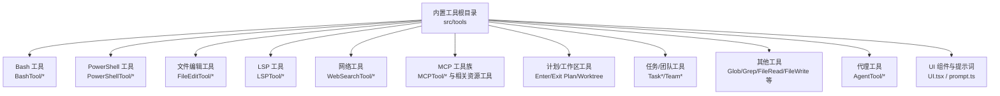
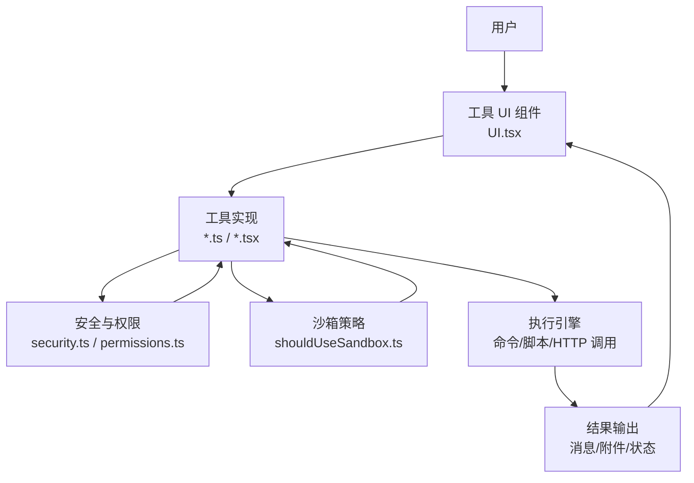
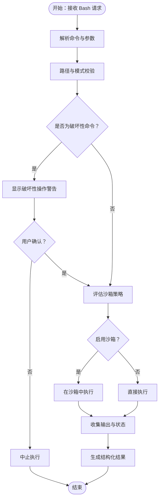
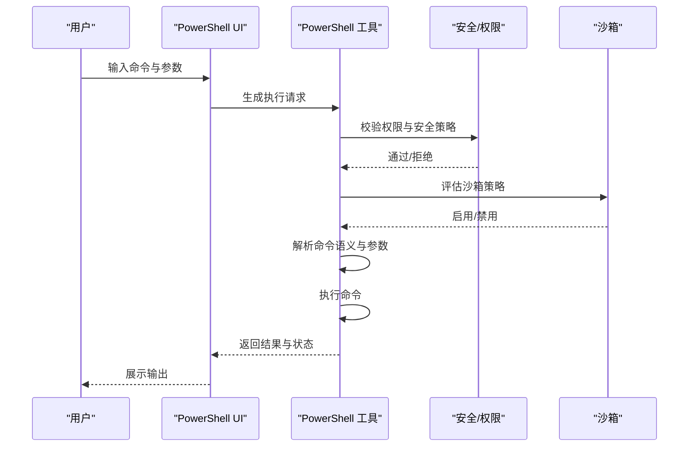
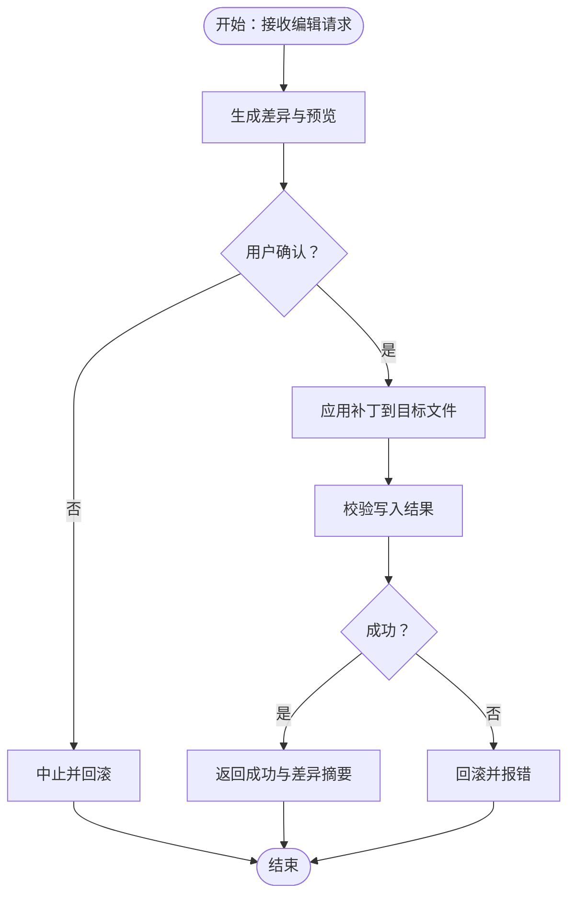
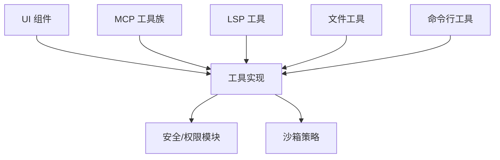

# 内置工具详解

<cite>
**本文档引用的文件**
- [src/tools/BashTool/BashTool.tsx](file://src/tools/BashTool/BashTool.tsx)
- [src/tools/BashTool/bashSecurity.ts](file://src/tools/BashTool/bashSecurity.ts)
- [src/tools/BashTool/bashPermissions.ts](file://src/tools/BashTool/bashPermissions.ts)
- [src/tools/BashTool/commandSemantics.ts](file://src/tools/BashTool/commandSemantics.ts)
- [src/tools/BashTool/sedValidation.ts](file://src/tools/BashTool/sedValidation.ts)
- [src/tools/BashTool/pathValidation.ts](file://src/tools/BashTool/pathValidation.ts)
- [src/tools/BashTool/readOnlyValidation.ts](file://src/tools/BashTool/readOnlyValidation.ts)
- [src/tools/BashTool/shouldUseSandbox.ts](file://src/tools/BashTool/shouldUseSandbox.ts)
- [src/tools/FileEditTool/FileEditTool.ts](file://src/tools/FileEditTool/FileEditTool.ts)
- [src/tools/FileEditTool/utils.ts](file://src/tools/FileEditTool/utils.ts)
- [src/tools/FileEditTool/constants.ts](file://src/tools/FileEditTool/constants.ts)
- [src/tools/LSPTool/LSPTool.ts](file://src/tools/LSPTool/LSPTool.ts)
- [src/tools/LSPTool/formatters.ts](file://src/tools/LSPTool/formatters.ts)
- [src/tools/LSPTool/schemas.ts](file://src/tools/LSPTool/schemas.ts)
- [src/tools/PowerShellTool/PowerShellTool.tsx](file://src/tools/PowerShellTool/PowerShellTool.tsx)
- [src/tools/PowerShellTool/powershellSecurity.ts](file://src/tools/PowerShellTool/powershellSecurity.ts)
- [src/tools/PowerShellTool/powershellPermissions.ts](file://src/tools/PowerShellTool/powershellPermissions.ts)
- [src/tools/PowerShellTool/commandSemantics.ts](file://src/tools/PowerShellTool/commandSemantics.ts)
- [src/tools/PowerShellTool/gitSafety.ts](file://src/tools/PowerShellTool/gitSafety.ts)
- [src/tools/WebSearchTool/WebSearchTool.ts](file://src/tools/WebSearchTool/WebSearchTool.ts)
- [src/tools/MCPTool/MCPTool.ts](file://src/tools/MCPTool/MCPTool.ts)
- [src/tools/ListMcpResourcesTool/ListMcpResourcesTool.ts](file://src/tools/ListMcpResourcesTool/ListMcpResourcesTool.ts)
- [src/tools/ReadMcpResourceTool/ReadMcpResourceTool.ts](file://src/tools/ReadMcpResourceTool/ReadMcpResourceTool.ts)
- [src/tools/McpAuthTool/McpAuthTool.ts](file://src/tools/McpAuthTool/McpAuthTool.ts)
- [src/tools/GlobTool/GlobTool.ts](file://src/tools/GlobTool/GlobTool.ts)
- [src/tools/GrepTool/GrepTool.ts](file://src/tools/GrepTool/GrepTool.ts)
- [src/tools/FileReadTool/FileReadTool.ts](file://src/tools/FileReadTool/FileReadTool.ts)
- [src/tools/FileReadTool/limits.ts](file://src/tools/FileReadTool/limits.ts)
- [src/tools/FileWriteTool/FileWriteTool.ts](file://src/tools/FileWriteTool/FileWriteTool.ts)
- [src/tools/ScheduleCronTool/CronCreateTool.ts](file://src/tools/ScheduleCronTool/CronCreateTool.ts)
- [src/tools/ScheduleCronTool/CronDeleteTool.ts](file://src/tools/ScheduleCronTool/CronDeleteTool.ts)
- [src/tools/ScheduleCronTool/CronListTool.ts](file://src/tools/ScheduleCronTool/CronListTool.ts)
- [src/tools/TaskCreateTool/TaskCreateTool.ts](file://src/tools/TaskCreateTool/TaskCreateTool.ts)
- [src/tools/TaskListTool/TaskListTool.ts](file://src/tools/TaskListTool/TaskListTool.ts)
- [src/tools/TaskGetTool/TaskGetTool.ts](file://src/tools/TaskGetTool/TaskGetTool.ts)
- [src/tools/TaskUpdateTool/TaskUpdateTool.ts](file://src/tools/TaskUpdateTool/TaskUpdateTool.ts)
- [src/tools/TaskStopTool/TaskStopTool.ts](file://src/tools/TaskStopTool/TaskStopTool.ts)
- [src/tools/TaskOutputTool/TaskOutputTool.ts](file://src/tools/TaskOutputTool/TaskOutputTool.ts)
- [src/tools/TeamCreateTool/TeamCreateTool.ts](file://src/tools/TeamCreateTool/TeamCreateTool.ts)
- [src/tools/TeamDeleteTool/TeamDeleteTool.ts](file://src/tools/TeamDeleteTool/TeamDeleteTool.ts)
- [src/tools/AskUserQuestionTool/AskUserQuestionTool.tsx](file://src/tools/AskUserQuestionTool/AskUserQuestionTool.tsx)
- [src/tools/SkillTool/SkillTool.ts](file://src/tools/SkillTool/SkillTool.ts)
- [src/tools/DiscoverSkillsTool/prompt.ts](file://src/tools/DiscoverSkillsTool/prompt.ts)
- [src/tools/AgentTool/AgentTool.tsx](file://src/tools/AgentTool/AgentTool.tsx)
- [src/tools/AgentTool/builtInAgents.ts](file://src/tools/AgentTool/builtInAgents.ts)
- [src/tools/AgentTool/runAgent.ts](file://src/tools/AgentTool/runAgent.ts)
- [src/tools/AgentTool/forkSubagent.ts](file://src/tools/AgentTool/forkSubagent.ts)
- [src/tools/AgentTool/resumeAgent.ts](file://src/tools/AgentTool/resumeAgent.ts)
- [src/tools/AgentTool/agentMemory.ts](file://src/tools/AgentTool/agentMemory.ts)
- [src/tools/AgentTool/agentMemorySnapshot.ts](file://src/tools/AgentTool/agentMemorySnapshot.ts)
- [src/tools/AgentTool/agentToolUtils.ts](file://src/tools/AgentTool/agentToolUtils.ts)
- [src/tools/AgentTool/constants.ts](file://src/tools/AgentTool/constants.ts)
- [src/tools/AgentTool/loadAgentsDir.ts](file://src/tools/AgentTool/loadAgentsDir.ts)
- [src/tools/AgentTool/prompt.ts](file://src/tools/AgentTool/prompt.ts)
- [src/tools/AgentTool/UI.tsx](file://src/tools/AgentTool/UI.tsx)
- [src/tools/AgentTool/agentDisplay.ts](file://src/tools/AgentTool/agentDisplay.ts)
- [src/tools/AgentTool/agentColorManager.ts](file://src/tools/AgentTool/agentColorManager.ts)
- [src/tools/REPLTool/primitiveTools.ts](file://src/tools/REPLTool/primitiveTools.ts)
- [src/tools/REPLTool/constants.ts](file://src/tools/REPLTool/constants.ts)
- [src/tools/BriefTool/BriefTool.ts](file://src/tools/BriefTool/BriefTool.ts)
- [src/tools/BriefTool/attachments.ts](file://src/tools/BriefTool/attachments.ts)
- [src/tools/BriefTool/upload.ts](file://src/tools/BriefTool/upload.ts)
- [src/tools/ConfigTool/ConfigTool.ts](file://src/tools/ConfigTool/ConfigTool.ts)
- [src/tools/ConfigTool/supportedSettings.ts](file://src/tools/ConfigTool/supportedSettings.ts)
- [src/tools/EnterPlanModeTool/EnterPlanModeTool.ts](file://src/tools/EnterPlanModeTool/EnterPlanModeTool.ts)
- [src/tools/ExitPlanModeTool/ExitPlanModeV2Tool.ts](file://src/tools/ExitPlanModeTool/ExitPlanModeV2Tool.ts)
- [src/tools/EnterWorktreeTool/EnterWorktreeTool.ts](file://src/tools/EnterWorktreeTool/EnterWorktreeTool.ts)
- [src/tools/ExitWorktreeTool/ExitWorktreeTool.ts](file://src/tools/ExitWorktreeTool/ExitWorktreeTool.ts)
- [src/tools/NotebookEditTool/NotebookEditTool.ts](file://src/tools/NotebookEditTool/NotebookEditTool.ts)
- [src/tools/SendMessageTool/SendMessageTool.ts](file://src/tools/SendMessageTool/SendMessageTool.ts)
- [src/tools/SendUserFileTool/prompt.ts](file://src/tools/SendUserFileTool/prompt.ts)
- [src/tools/ToolSearchTool/ToolSearchTool.ts](file://src/tools/ToolSearchTool/ToolSearchTool.ts)
- [src/tools/OverflowTestTool/OverflowTestTool.ts](file://src/tools/OverflowTestTool/OverflowTestTool.ts)
- [src/tools/TungstenTool/TungstenTool.ts](file://src/tools/TungstenTool/TungstenTool.ts)
- [src/tools/VerifyPlanExecutionTool/VerifyPlanExecutionTool.ts](file://src/tools/VerifyPlanExecutionTool/VerifyPlanExecutionTool.ts)
- [src/tools/WebBrowserTool/WebBrowserTool.ts](file://src/tools/WebBrowserTool/WebBrowserTool.ts)
- [src/tools/WebFetchTool/WebFetchTool.ts](file://src/tools/WebFetchTool/WebFetchTool.ts)
- [src/tools/WorkflowTool/WorkflowTool.ts](file://src/tools/WorkflowTool/WorkflowTool.ts)
- [src/tools/SyntheticOutputTool/SyntheticOutputTool.ts](file://src/tools/SyntheticOutputTool/SyntheticOutputTool.ts)
- [src/tools/TerminalCaptureTool/TerminalCaptureTool.ts](file://src/tools/TerminalCaptureTool/TerminalCaptureTool.ts)
- [src/tools/SnippetTool/SnippetTool.ts](file://src/tools/SnippetTool/SnippetTool.ts)
- [src/tools/SleepTool/SleepTool.ts](file://src/tools/SleepTool/SleepTool.ts)
- [src/tools/ReviewArtifactTool/ReviewArtifactTool.ts](file://src/tools/ReviewArtifactTool/ReviewArtifactTool.ts)
- [src/tools/RemoteTriggerTool/RemoteTriggerTool.ts](file://src/tools/RemoteTriggerTool/RemoteTriggerTool.ts)
- [src/tools/MonitorTool/MonitorTool.ts](file://src/tools/MonitorTool/MonitorTool.ts)
- [src/tools/McpAuthTool/McpAuthTool.ts](file://src/tools/McpAuthTool/McpAuthTool.ts)
- [src/tools/ListMcpResourcesTool/ListMcpResourcesTool.ts](file://src/tools/ListMcpResourcesTool/ListMcpResourcesTool.ts)
- [src/tools/ReadMcpResourceTool/ReadMcpResourceTool.ts](file://src/tools/ReadMcpResourceTool/ReadMcpResourceTool.ts)
- [src/tools/MCPTool/MCPTool.ts](file://src/tools/MCPTool/MCPTool.ts)
- [src/tools/BashTool/toolName.ts](file://src/tools/BashTool/toolName.ts)
- [src/tools/PowerShellTool/toolName.ts](file://src/tools/PowerShellTool/toolName.ts)
- [src/tools/BashTool/modeValidation.ts](file://src/tools/BashTool/modeValidation.ts)
- [src/tools/PowerShellTool/modeValidation.ts](file://src/tools/PowerShellTool/modeValidation.ts)
- [src/tools/BashTool/commentLabel.ts](file://src/tools/BashTool/commentLabel.ts)
- [src/tools/BashTool/destructiveCommandWarning.ts](file://src/tools/BashTool/destructiveCommandWarning.ts)
- [src/tools/PowerShellTool/destructiveCommandWarning.ts](file://src/tools/PowerShellTool/destructiveCommandWarning.ts)
- [src/tools/BashTool/sedEditParser.ts](file://src/tools/BashTool/sedEditParser.ts)
- [src/tools/BashTool/utils.ts](file://src/tools/BashTool/utils.ts)
- [src/tools/PowerShellTool/commonParameters.ts](file://src/tools/PowerShellTool/commonParameters.ts)
- [src/tools/PowerShellTool/clmTypes.ts](file://src/tools/PowerShellTool/clmTypes.ts)
- [src/tools/PowerShellTool/gitSafety.ts](file://src/tools/PowerShellTool/gitSafety.ts)
- [src/tools/PowerShellTool/prompt.ts](file://src/tools/PowerShellTool/prompt.ts)
- [src/tools/PowerShellTool/shouldUseSandbox.ts](file://src/tools/PowerShellTool/shouldUseSandbox.ts)
- [src/tools/PowerShellTool/readOnlyValidation.ts](file://src/tools/PowerShellTool/readOnlyValidation.ts)
- [src/tools/PowerShellTool/pathValidation.ts](file://src/tools/PowerShellTool/pathValidation.ts)
- [src/tools/PowerShellTool/commandSemantics.ts](file://src/tools/PowerShellTool/commandSemantics.ts)
- [src/tools/PowerShellTool/powershellSecurity.ts](file://src/tools/PowerShellTool/powershellSecurity.ts)
- [src/tools/PowerShellTool/powershellPermissions.ts](file://src/tools/PowerShellTool/powershellPermissions.ts)
- [src/tools/PowerShellTool/toolName.ts](file://src/tools/PowerShellTool/toolName.ts)
- [src/tools/PowerShellTool/modeValidation.ts](file://src/tools/PowerShellTool/modeValidation.ts)
- [src/tools/PowerShellTool/destructiveCommandWarning.ts](file://src/tools/PowerShellTool/destructiveCommandWarning.ts)
- [src/tools/PowerShellTool/shouldUseSandbox.ts](file://src/tools/PowerShellTool/shouldUseSandbox.ts)
- [src/tools/PowerShellTool/readOnlyValidation.ts](file://src/tools/PowerShellTool/readOnlyValidation.ts)
- [src/tools/PowerShellTool/pathValidation.ts](file://src/tools/PowerShellTool/pathValidation.ts)
- [src/tools/PowerShellTool/commandSemantics.ts](file://src/tools/PowerShellTool/commandSemantics.ts)
- [src/tools/PowerShellTool/gitSafety.ts](file://src/tools/PowerShellTool/gitSafety.ts)
- [src/tools/PowerShellTool/powershellSecurity.ts](file://src/tools/PowerShellTool/powershellSecurity.ts)
- [src/tools/PowerShellTool/powershellPermissions.ts](file://src/tools/PowerShellTool/powershellPermissions.ts)
- [src/tools/PowerShellTool/commonParameters.ts](file://src/tools/PowerShellTool/commonParameters.ts)
- [src/tools/PowerShellTool/clmTypes.ts](file://src/tools/PowerShellTool/clmTypes.ts)
- [src/tools/PowerShellTool/prompt.ts](file://src/tools/PowerShellTool/prompt.ts)
- [src/tools/PowerShellTool/toolName.ts](file://src/tools/PowerShellTool/toolName.ts)
- [src/tools/PowerShellTool/modeValidation.ts](file://src/tools/PowerShellTool/modeValidation.ts)
- [src/tools/PowerShellTool/destructiveCommandWarning.ts](file://src/tools/PowerShellTool/destructiveCommandWarning.ts)
- [src/tools/PowerShellTool/shouldUseSandbox.ts](file://src/tools/PowerShellTool/shouldUseSandbox.ts)
- [src/tools/PowerShellTool/readOnlyValidation.ts](file://src/tools/PowerShellTool/readOnlyValidation.ts)
- [src/tools/PowerShellTool/pathValidation.ts](file://src/tools/PowerShellTool/pathValidation.ts)
- [src/tools/PowerShellTool/commandSemantics.ts](file://src/tools/PowerShellTool/commandSemantics.ts)
- [src/tools/PowerShellTool/gitSafety.ts](file://src/tools/PowerShellTool/gitSafety.ts)
- [src/tools/PowerShellTool/powershellSecurity.ts](file://src/tools/PowerShellTool/powershellSecurity.ts)
- [src/tools/PowerShellTool/powershellPermissions.ts](file://src/tools/PowerShellTool/powershellPermissions.ts)
- [src/tools/PowerShellTool/commonParameters.ts](file://src/tools/PowerShellTool/commonParameters.ts)
- [src/tools/PowerShellTool/clmTypes.ts](file://src/tools/PowerShellTool/clmTypes.ts)
- [src/tools/PowerShellTool/prompt.ts](file://src/tools/PowerShellTool/prompt.ts)
- [src/tools/PowerShellTool/toolName.ts](file://src/tools/PowerShellTool/toolName.ts)
- [src/tools/PowerShellTool/modeValidation.ts](file://src/tools/PowerShellTool/modeValidation.ts)
- [src/tools/PowerShellTool/destructiveCommandWarning.ts](file://src/tools/PowerShellTool/destructiveCommandWarning.ts)
- [src/tools/PowerShellTool/shouldUseSandbox.ts](file://src/tools/PowerShellTool/shouldUseSandbox.ts)
- [src/tools/PowerShellTool/readOnlyValidation.ts](file://src/tools/PowerShellTool/readOnlyValidation.ts)
- [src/tools/PowerShellTool/pathValidation.ts](file://src/tools/PowerShellTool/pathValidation.ts)
- [src/tools/PowerShellTool/commandSemantics.ts](file://src/tools/PowerShellTool/commandSemantics.ts)
- [src/tools/PowerShellTool/gitSafety.ts](file://src/tools/PowerShellTool/gitSafety.ts)
- [src/tools/PowerShellTool/powershellSecurity.ts](file://src/tools/PowerShellTool/powershellSecurity.ts)
- [src/tools/PowerShellTool/powershellPermissions.ts](file://src/tools/PowerShellTool/powershellPermissions.ts)
- [src/tools/PowerShellTool/commonParameters.ts](file://src/tools/PowerShellTool/commonParameters.ts)
- [src/tools/PowerShellTool/clmTypes.ts](file://src/tools/PowerShellTool/clmTypes.ts)
- [src/tools/PowerShellTool/prompt.ts](file://src/tools/PowerShellTool/prompt.ts)
- [src/tools/PowerShellTool/toolName.ts](file://src/tools/PowerShellTool/toolName.ts)
- [src/tools/PowerShellTool/modeValidation.ts](file://src/tools/PowerShellTool/modeValidation.ts)
- [src/tools/PowerShellTool/destructiveCommandWarning.ts](file://src/tools/PowerShellTool/destructiveCommandWarning.ts)
- [src/tools/PowerShellTool/shouldUseSandbox.ts](file://src/tools/PowerShellTool/shouldUseSandbox.ts)
- [src/tools/PowerShellTool/readOnlyValidation.ts](file://src/tools/PowerShellTool/readOnlyValidation.ts)
- [src/tools/PowerShellTool/pathValidation.ts](file://src/tools/PowerShellTool/pathValidation.ts)
- [src/tools/PowerShellTool/commandSemantics.ts](file://src/tools/PowerShellTool/commandSemantics.ts)
- [src/tools/PowerShellTool/gitSafety.ts](file://src/tools/PowerShellTool/gitSafety.ts)
- [src/tools/PowerShellTool/powershellSecurity.ts](file://src/tools/PowerShellTool/powershellSecurity.ts)
- [src/tools/PowerShellTool/powershellPermissions.ts](file://src/tools/PowerShellTool/powershellPermissions.ts)
- [src/tools/PowerShellTool/commonParameters.ts](file://src/tools/PowerShellTool/commonParameters.ts)
- [src/tools/PowerShellTool/clmTypes.ts](file://src/tools/PowerShellTool/clmTypes.ts)
- [src/tools/PowerShellTool/prompt.ts](file://src/tools/PowerShellTool/prompt.ts)
- [src/tools/PowerShellTool/toolName.ts](file://src/tools/PowerShellTool/toolName.ts)
- [src/tools/PowerShellTool/modeValidation.ts](file://src/tools/PowerShellTool/modeValidation.ts)
- [src/tools/PowerShellTool/destructiveCommandWarning.ts](file://src/tools/PowerShellTool/destructiveCommandWarning.ts)
- [src/tools/PowerShellTool/shouldUseSandbox.ts](file://src/tools/PowerShellTool/shouldUseSandbox.ts)
- [src/tools/PowerShellTool/readOnlyValidation.ts](file://src/tools/PowerShellTool/readOnlyValidation.ts)
- [src/tools/PowerShellTool/pathValidation.ts](file://src/tools/PowerShellTool/pathValidation.ts)
- [src/tools/PowerShellTool/commandSemantics.ts](file://src/tools/PowerShellTool/commandSemantics.ts)
- [src/tools/PowerShellTool/gitSafety.ts](file://src/tools/PowerShellTool/gitSafety.ts)
- [src/tools/PowerShellTool/powershellSecurity.ts](file://src/tools/PowerShellTool/powershellSecurity.ts)
- [src/tools/PowerShellTool/powershellPermissions.ts](file://src/tools/PowerShellTool/powershellPermissions.ts)
- [src/tools/PowerShellTool/commonParameters.ts](file://src/tools/PowerShellTool/commonParameters.ts)
- [src/tools/PowerShellTool/clmTypes.ts](file://src/tools/PowerShellTool/clmTypes.ts)
- [src/tools/PowerShellTool/prompt.ts](file://src/tools/PowerShellTool/prompt.ts)
- [src/tools/PowerShellTool/toolName.ts](file://src/tools/PowerShellTool/toolName.ts)
- [src/tools/PowerShellTool/modeValidation.ts](file://src/tools/PowerShellTool/modeValidation.ts)
- [src/tools/PowerShellTool/destructiveCommandWarning.ts](file://src/tools/PowerShellTool/destructiveCommandWarning.ts)
- [src/tools/PowerShellTool/shouldUseSandbox.ts](file://src/tools/PowerShellTool/shouldUseSandbox.ts)
- [src/tools/PowerShellTool/readOnlyValidation.ts](file://src/tools/PowerShellTool/readOnlyValidation.ts)
- [src/tools/PowerShellTool/pathValidation.ts](file://src/tools/PowerShellTool/pathValidation.ts)
- [src/tools/PowerShellTool/commandSemantics.ts](file://src/tools/PowerShellTool/commandSemantics.ts)
- [src/tools/PowerShellTool/gitSafety.ts](file://src/tools/PowerShellTool/gitSafety.ts)
- [src/tools/PowerShellTool/powershellSecurity.ts](file://src/tools/PowerShellTool/powershellSecurity.ts)
- [src/tools/PowerShellTool/powershellPermissions.ts](file://src/tools/PowerShellTool/powershellPermissions.ts)
- [src/tools/PowerShellTool/commonParameters.ts](file://src/tools/PowerShellTool/commonParameters.ts)
- [src/tools/PowerShellTool/clmTypes.ts](file://src/tools/PowerShellTool/clmTypes.ts)
- [src/tools/PowerShellTool/prompt.ts](file://src/tools/PowerShellTool/prompt.ts)
- [src/tools/PowerShellTool/toolName.ts](file://src/tools/PowerShellTool/toolName.ts)
- [src/tools/PowerShellTool/modeValidation.ts](file://src/tools/PowerShellTool/modeValidation.ts)
- [src/tools/PowerShellTool......]
</cite>

## 目录
1. [简介](#简介)
2. [项目结构](#项目结构)
3. [核心组件](#核心组件)
4. [架构总览](#架构总览)
5. [详细组件分析](#详细组件分析)
6. [依赖关系分析](#依赖关系分析)
7. [性能考虑](#性能考虑)
8. [故障排除指南](#故障排除指南)
9. [结论](#结论)
10. [附录](#附录)

## 简介
本文件系统性梳理 Claude Code 的内置工具体系，覆盖命令行工具（Bash、PowerShell）、文件编辑与读写工具、语言服务器协议（LSP）工具、网络搜索与抓取工具、MCP 工具族、计划与工作区模式切换工具、任务与团队管理工具、以及代理（Agent）工具等。文档重点阐述各工具的功能特性、使用场景、安全机制、权限控制、资源限制、参数配置、输出格式与错误处理，并提供扩展与定制指导。

## 项目结构
内置工具主要位于 src/tools 目录下，按功能划分为多个子目录，每个子目录包含工具的核心实现、UI 组件、提示词与辅助模块。整体采用“功能域+职责分离”的组织方式，便于维护与扩展。

图表来源
- [src/tools/BashTool/BashTool.tsx](file://src/tools/BashTool/BashTool.tsx)
- [src/tools/PowerShellTool/PowerShellTool.tsx](file://src/tools/PowerShellTool/PowerShellTool.tsx)
- [src/tools/FileEditTool/FileEditTool.ts](file://src/tools/FileEditTool/FileEditTool.ts)
- [src/tools/LSPTool/LSPTool.ts](file://src/tools/LSPTool/LSPTool.ts)
- [src/tools/WebSearchTool/WebSearchTool.ts](file://src/tools/WebSearchTool/WebSearchTool.ts)
- [src/tools/MCPTool/MCPTool.ts](file://src/tools/MCPTool/MCPTool.ts)
- [src/tools/AgentTool/AgentTool.tsx](file://src/tools/AgentTool/AgentTool.tsx)

章节来源
- [src/tools/BashTool/BashTool.tsx](file://src/tools/BashTool/BashTool.tsx)
- [src/tools/PowerShellTool/PowerShellTool.tsx](file://src/tools/PowerShellTool/PowerShellTool.tsx)
- [src/tools/FileEditTool/FileEditTool.ts](file://src/tools/FileEditTool/FileEditTool.ts)
- [src/tools/LSPTool/LSPTool.ts](file://src/tools/LSPTool/LSPTool.ts)
- [src/tools/WebSearchTool/WebSearchTool.ts](file://src/tools/WebSearchTool/WebSearchTool.ts)
- [src/tools/MCPTool/MCPTool.ts](file://src/tools/MCPTool/MCPTool.ts)
- [src/tools/AgentTool/AgentTool.tsx](file://src/tools/AgentTool/AgentTool.tsx)

## 核心组件
- 命令行工具：BashTool、PowerShellTool，负责执行系统命令、路径与模式校验、破坏性操作警告、沙箱策略与权限控制。
- 文件工具：FileEditTool、FileReadTool、FileWriteTool，支持文件内容编辑、读取与写入，含大小限制与图像处理能力。
- LSP 工具：LSPTool，提供符号上下文、格式化、语言服务集成。
- 网络工具：WebSearchTool、WebFetchTool、WebBrowserTool，支持网页搜索、内容抓取与浏览器交互。
- MCP 工具族：MCPTool、ListMcpResourcesTool、ReadMcpResourceTool、McpAuthTool，用于 MCP 服务器发现、资源读取与授权。
- 计划/工作区工具：Enter/Exit PlanModeTool、Enter/Exit WorktreeTool，用于模式切换与工作树管理。
- 任务/团队工具：TaskCreateTool、TaskListTool、TaskGetTool、TaskUpdateTool、TaskStopTool、TaskOutputTool、TeamCreateTool、TeamDeleteTool。
- 其他工具：GlobTool、GrepTool、ScheduleCronTool、AskUserQuestionTool、SkillTool、AgentTool、REPLTool、BriefTool、ConfigTool 等。

章节来源
- [src/tools/BashTool/BashTool.tsx](file://src/tools/BashTool/BashTool.tsx)
- [src/tools/PowerShellTool/PowerShellTool.tsx](file://src/tools/PowerShellTool/PowerShellTool.tsx)
- [src/tools/FileEditTool/FileEditTool.ts](file://src/tools/FileEditTool/FileEditTool.ts)
- [src/tools/FileReadTool/FileReadTool.ts](file://src/tools/FileReadTool/FileReadTool.ts)
- [src/tools/FileWriteTool/FileWriteTool.ts](file://src/tools/FileWriteTool/FileWriteTool.ts)
- [src/tools/LSPTool/LSPTool.ts](file://src/tools/LSPTool/LSPTool.ts)
- [src/tools/WebSearchTool/WebSearchTool.ts](file://src/tools/WebSearchTool/WebSearchTool.ts)
- [src/tools/WebFetchTool/WebFetchTool.ts](file://src/tools/WebFetchTool/WebFetchTool.ts)
- [src/tools/WebBrowserTool/WebBrowserTool.ts](file://src/tools/WebBrowserTool/WebBrowserTool.ts)
- [src/tools/MCPTool/MCPTool.ts](file://src/tools/MCPTool/MCPTool.ts)
- [src/tools/ListMcpResourcesTool/ListMcpResourcesTool.ts](file://src/tools/ListMcpResourcesTool/ListMcpResourcesTool.ts)
- [src/tools/ReadMcpResourceTool/ReadMcpResourceTool.ts](file://src/tools/ReadMcpResourceTool/ReadMcpResourceTool.ts)
- [src/tools/McpAuthTool/McpAuthTool.ts](file://src/tools/McpAuthTool/McpAuthTool.ts)
- [src/tools/GlobTool/GlobTool.ts](file://src/tools/GlobTool/GlobTool.ts)
- [src/tools/GrepTool/GrepTool.ts](file://src/tools/GrepTool/GrepTool.ts)
- [src/tools/ScheduleCronTool/CronCreateTool.ts](file://src/tools/ScheduleCronTool/CronCreateTool.ts)
- [src/tools/ScheduleCronTool/CronDeleteTool.ts](file://src/tools/ScheduleCronTool/CronDeleteTool.ts)
- [src/tools/ScheduleCronTool/CronListTool.ts](file://src/tools/ScheduleCronTool/CronListTool.ts)
- [src/tools/TaskCreateTool/TaskCreateTool.ts](file://src/tools/TaskCreateTool/TaskCreateTool.ts)
- [src/tools/TaskListTool/TaskListTool.ts](file://src/tools/TaskListTool/TaskListTool.ts)
- [src/tools/TaskGetTool/TaskGetTool.ts](file://src/tools/TaskGetTool/TaskGetTool.ts)
- [src/tools/TaskUpdateTool/TaskUpdateTool.ts](file://src/tools/TaskUpdateTool/TaskUpdateTool.ts)
- [src/tools/TaskStopTool/TaskStopTool.ts](file://src/tools/TaskStopTool/TaskStopTool.ts)
- [src/tools/TaskOutputTool/TaskOutputTool.ts](file://src/tools/TaskOutputTool/TaskOutputTool.ts)
- [src/tools/TeamCreateTool/TeamCreateTool.ts](file://src/tools/TeamCreateTool/TeamCreateTool.ts)
- [src/tools/TeamDeleteTool/TeamDeleteTool.ts](file://src/tools/TeamDeleteTool/TeamDeleteTool.ts)
- [src/tools/AskUserQuestionTool/AskUserQuestionTool.tsx](file://src/tools/AskUserQuestionTool/AskUserQuestionTool.tsx)
- [src/tools/SkillTool/SkillTool.ts](file://src/tools/SkillTool/SkillTool.ts)
- [src/tools/AgentTool/AgentTool.tsx](file://src/tools/AgentTool/AgentTool.tsx)

## 架构总览
内置工具通过统一的工具接口与消息协议进行编排，结合 UI 组件与提示词生成器，形成“请求-校验-执行-反馈”的闭环。安全与权限控制贯穿命令解析、路径验证、破坏性操作提示与沙箱策略。

图表来源
- [src/tools/BashTool/BashTool.tsx](file://src/tools/BashTool/BashTool.tsx)
- [src/tools/BashTool/bashSecurity.ts](file://src/tools/BashTool/bashSecurity.ts)
- [src/tools/BashTool/bashPermissions.ts](file://src/tools/BashTool/bashPermissions.ts)
- [src/tools/BashTool/shouldUseSandbox.ts](file://src/tools/BashTool/shouldUseSandbox.ts)
- [src/tools/PowerShellTool/PowerShellTool.tsx](file://src/tools/PowerShellTool/PowerShellTool.tsx)
- [src/tools/PowerShellTool/powershellSecurity.ts](file://src/tools/PowerShellTool/powershellSecurity.ts)
- [src/tools/PowerShellTool/powershellPermissions.ts](file://src/tools/PowerShellTool/powershellPermissions.ts)
- [src/tools/PowerShellTool/shouldUseSandbox.ts](file://src/tools/PowerShellTool/shouldUseSandbox.ts)

## 详细组件分析

### Bash 工具
- 功能特性
  - 执行 Bash 命令，支持交互式与非交互式模式。
  - 路径与模式校验，防止越权访问与危险路径。
  - 破坏性命令警告，降低误操作风险。
  - 沙箱策略与只读模式控制，限制对系统关键区域的影响。
  - sed 编辑解析与验证，确保文本替换安全可控。
- 使用场景
  - 快速系统检查、构建脚本执行、日志分析、文件批量处理。
- 安全机制
  - 权限控制：基于路径白名单与只读模式开关。
  - 安全策略：命令语义解析、破坏性操作拦截、沙箱隔离。
  - 资源限制：超时、输出大小限制、并发控制。
- 配置选项
  - 工具名称、模式校验、路径规则、只读开关、沙箱开关、sed 解析器。
- 输出格式
  - 结构化输出包含命令、标准输出、标准错误、退出码与耗时统计。
- 错误处理
  - 参数校验失败、权限不足、命令执行异常、超时与中断处理。
- 示例与演示
  - 在项目根目录执行构建脚本并查看输出差异。
  - 对特定目录进行递归 grep 并生成报告。
- 扩展与定制
  - 新增命令别名与语义映射；扩展路径白名单；自定义破坏性命令规则。

图表来源
- [src/tools/BashTool/BashTool.tsx](file://src/tools/BashTool/BashTool.tsx)
- [src/tools/BashTool/bashSecurity.ts](file://src/tools/BashTool/bashSecurity.ts)
- [src/tools/BashTool/bashPermissions.ts](file://src/tools/BashTool/bashPermissions.ts)
- [src/tools/BashTool/commandSemantics.ts](file://src/tools/BashTool/commandSemantics.ts)
- [src/tools/BashTool/sedValidation.ts](file://src/tools/BashTool/sedValidation.ts)
- [src/tools/BashTool/pathValidation.ts](file://src/tools/BashTool/pathValidation.ts)
- [src/tools/BashTool/readOnlyValidation.ts](file://src/tools/BashTool/readOnlyValidation.ts)
- [src/tools/BashTool/shouldUseSandbox.ts](file://src/tools/BashTool/shouldUseSandbox.ts)
- [src/tools/BashTool/destructiveCommandWarning.ts](file://src/tools/BashTool/destructiveCommandWarning.ts)
- [src/tools/BashTool/commentLabel.ts](file://src/tools/BashTool/commentLabel.ts)

章节来源
- [src/tools/BashTool/BashTool.tsx](file://src/tools/BashTool/BashTool.tsx)
- [src/tools/BashTool/bashSecurity.ts](file://src/tools/BashTool/bashSecurity.ts)
- [src/tools/BashTool/bashPermissions.ts](file://src/tools/BashTool/bashPermissions.ts)
- [src/tools/BashTool/commandSemantics.ts](file://src/tools/BashTool/commandSemantics.ts)
- [src/tools/BashTool/sedValidation.ts](file://src/tools/BashTool/sedValidation.ts)
- [src/tools/BashTool/pathValidation.ts](file://src/tools/BashTool/pathValidation.ts)
- [src/tools/BashTool/readOnlyValidation.ts](file://src/tools/BashTool/readOnlyValidation.ts)
- [src/tools/BashTool/shouldUseSandbox.ts](file://src/tools/BashTool/shouldUseSandbox.ts)
- [src/tools/BashTool/modeValidation.ts](file://src/tools/BashTool/modeValidation.ts)
- [src/tools/BashTool/destructiveCommandWarning.ts](file://src/tools/BashTool/destructiveCommandWarning.ts)
- [src/tools/BashTool/commentLabel.ts](file://src/tools/BashTool/commentLabel.ts)
- [src/tools/BashTool/sedEditParser.ts](file://src/tools/BashTool/sedEditParser.ts)
- [src/tools/BashTool/utils.ts](file://src/tools/BashTool/utils.ts)
- [src/tools/BashTool/toolName.ts](file://src/tools/BashTool/toolName.ts)

### PowerShell 工具
- 功能特性
  - 执行 PowerShell 命令，支持常见参数与管道。
  - Git 安全策略，避免破坏性变更。
  - 路径与模式校验、只读模式与沙箱策略。
  - 命令语义解析与权限控制。
- 使用场景
  - Windows 环境下的自动化脚本、系统管理、CI/CD 辅助。
- 安全机制
  - 权限控制与安全策略同 Bash 工具一致。
  - Git 安全检查，防止意外提交或分支操作。
- 配置选项
  - 工具名称、模式校验、路径规则、只读开关、沙箱开关、通用参数集。
- 输出格式
  - 结构化输出包含命令、stdout/stderr、退出码与耗时。
- 错误处理
  - 参数校验、权限不足、命令执行异常、超时与中断。
- 示例与演示
  - 在 CI 中执行测试脚本并汇总结果。
  - 对特定文件夹进行 PowerShell 扫描与报告生成。
- 扩展与定制
  - 新增命令别名、扩展安全规则、自定义参数集。

图表来源
- [src/tools/PowerShellTool/PowerShellTool.tsx](file://src/tools/PowerShellTool/PowerShellTool.tsx)
- [src/tools/PowerShellTool/powershellSecurity.ts](file://src/tools/PowerShellTool/powershellSecurity.ts)
- [src/tools/PowerShellTool/powershellPermissions.ts](file://src/tools/PowerShellTool/powershellPermissions.ts)
- [src/tools/PowerShellTool/commandSemantics.ts](file://src/tools/PowerShellTool/commandSemantics.ts)
- [src/tools/PowerShellTool/gitSafety.ts](file://src/tools/PowerShellTool/gitSafety.ts)
- [src/tools/PowerShellTool/pathValidation.ts](file://src/tools/PowerShellTool/pathValidation.ts)
- [src/tools/PowerShellTool/readOnlyValidation.ts](file://src/tools/PowerShellTool/readOnlyValidation.ts)
- [src/tools/PowerShellTool/shouldUseSandbox.ts](file://src/tools/PowerShellTool/shouldUseSandbox.ts)
- [src/tools/PowerShellTool/commonParameters.ts](file://src/tools/PowerShellTool/commonParameters.ts)
- [src/tools/PowerShellTool/clmTypes.ts](file://src/tools/PowerShellTool/clmTypes.ts)
- [src/tools/PowerShellTool/prompt.ts](file://src/tools/PowerShellTool/prompt.ts)
- [src/tools/PowerShellTool/toolName.ts](file://src/tools/PowerShellTool/toolName.ts)
- [src/tools/PowerShellTool/modeValidation.ts](file://src/tools/PowerShellTool/modeValidation.ts)
- [src/tools/PowerShellTool/destructiveCommandWarning.ts](file://src/tools/PowerShellTool/destructiveCommandWarning.ts)

章节来源
- [src/tools/PowerShellTool/PowerShellTool.tsx](file://src/tools/PowerShellTool/PowerShellTool.tsx)
- [src/tools/PowerShellTool/powershellSecurity.ts](file://src/tools/PowerShellTool/powershellSecurity.ts)
- [src/tools/PowerShellTool/powershellPermissions.ts](file://src/tools/PowerShellTool/powershellPermissions.ts)
- [src/tools/PowerShellTool/commandSemantics.ts](file://src/tools/PowerShellTool/commandSemantics.ts)
- [src/tools/PowerShellTool/gitSafety.ts](file://src/tools/PowerShellTool/gitSafety.ts)
- [src/tools/PowerShellTool/pathValidation.ts](file://src/tools/PowerShellTool/pathValidation.ts)
- [src/tools/PowerShellTool/readOnlyValidation.ts](file://src/tools/PowerShellTool/readOnlyValidation.ts)
- [src/tools/PowerShellTool/shouldUseSandbox.ts](file://src/tools/PowerShellTool/shouldUseSandbox.ts)
- [src/tools/PowerShellTool/commonParameters.ts](file://src/tools/PowerShellTool/commonParameters.ts)
- [src/tools/PowerShellTool/clmTypes.ts](file://src/tools/PowerShellTool/clmTypes.ts)
- [src/tools/PowerShellTool/prompt.ts](file://src/tools/PowerShellTool/prompt.ts)
- [src/tools/PowerShellTool/toolName.ts](file://src/tools/PowerShellTool/toolName.ts)
- [src/tools/PowerShellTool/modeValidation.ts](file://src/tools/PowerShellTool/modeValidation.ts)
- [src/tools/PowerShellTool/destructiveCommandWarning.ts](file://src/tools/PowerShellTool/destructiveCommandWarning.ts)

### 文件编辑工具（FileEditTool）
- 功能特性
  - 基于补丁的文件编辑，支持多文件批量修改。
  - 编辑前预览与差异展示，编辑后确认与回滚。
  - 编辑策略与冲突检测，避免覆盖重要变更。
- 使用场景
  - 自动修复、批量重构、模板生成与更新。
- 安全机制
  - 文件路径白名单与只读保护，防止误改关键系统文件。
  - 编辑前后对比与确认流程。
- 配置选项
  - 编辑策略、最大文件大小、差异展示样式。
- 输出格式
  - 成功/失败状态、受影响文件列表、差异摘要。
- 错误处理
  - 路径非法、权限不足、冲突合并失败、磁盘空间不足。
- 示例与演示
  - 将一个函数签名从旧版本迁移到新版本。
  - 批量更新配置文件中的敏感字段。
- 扩展与定制
  - 新增编辑策略、自定义差异渲染、冲突解决算法。

图表来源
- [src/tools/FileEditTool/FileEditTool.ts](file://src/tools/FileEditTool/FileEditTool.ts)
- [src/tools/FileEditTool/utils.ts](file://src/tools/FileEditTool/utils.ts)
- [src/tools/FileEditTool/constants.ts](file://src/tools/FileEditTool/constants.ts)

章节来源
- [src/tools/FileEditTool/FileEditTool.ts](file://src/tools/FileEditTool/FileEditTool.ts)
- [src/tools/FileEditTool/utils.ts](file://src/tools/FileEditTool/utils.ts)
- [src/tools/FileEditTool/constants.ts](file://src/tools/FileEditTool/constants.ts)

### 文件读取工具（FileReadTool）
- 功能特性
  - 支持文本与二进制文件读取，含图像处理能力。
  - 文件大小限制与读取缓存，提升性能。
- 使用场景
  - 日志分析、配置读取、图像/文档内容提取。
- 安全机制
  - 文件大小限制与类型白名单，防止内存溢出。
- 配置选项
  - 最大读取字节数、缓存策略、图像处理参数。
- 输出格式
  - 文本内容、图像数据、元信息（路径、大小、时间戳）。
- 错误处理
  - 文件不存在、权限不足、超出大小限制、解码失败。
- 示例与演示
  - 读取最近一次构建日志并提取错误行。
  - 读取图片并生成描述性摘要。
- 扩展与定制
  - 新增文件类型处理器、自定义解码器、缓存策略。

章节来源
- [src/tools/FileReadTool/FileReadTool.ts](file://src/tools/FileReadTool/FileReadTool.ts)
- [src/tools/FileReadTool/limits.ts](file://src/tools/FileReadTool/limits.ts)

### 文件写入工具（FileWriteTool）
- 功能特性
  - 将内容写入指定文件，支持覆盖与追加模式。
  - 路径校验与只读保护。
- 使用场景
  - 自动生成配置文件、日志输出、临时文件写入。
- 安全机制
  - 路径白名单与只读保护。
- 配置选项
  - 覆盖/追加模式、权限设置、路径规则。
- 输出格式
  - 成功/失败状态、写入字节数、目标路径。
- 错误处理
  - 路径非法、权限不足、磁盘空间不足、写入失败。
- 示例与演示
  - 将测试报告写入指定目录。
  - 追加日志条目到现有日志文件。
- 扩展与定制
  - 新增写入模式、自定义权限与备份策略。

章节来源
- [src/tools/FileWriteTool/FileWriteTool.ts](file://src/tools/FileWriteTool/FileWriteTool.ts)

### LSP 工具（LSPTool）
- 功能特性
  - 符号查找与上下文定位，支持多语言。
  - 格式化与代码重构建议。
  - 语言服务集成与诊断信息展示。
- 使用场景
  - 代码导航、快速修复、重构辅助。
- 安全机制
  - 仅在受信任工作区内调用，避免跨项目污染。
- 配置选项
  - 语言服务器路径、格式化参数、符号查询范围。
- 输出格式
  - 符号列表、上下文片段、格式化结果、诊断信息。
- 错误处理
  - LSP 服务器未启动、超时、解析失败。
- 示例与演示
  - 查找某个类的所有引用并生成上下文报告。
  - 对选中代码块进行格式化并展示差异。
- 扩展与定制
  - 新增语言服务器、自定义格式化规则、符号过滤器。

章节来源
- [src/tools/LSPTool/LSPTool.ts](file://src/tools/LSPTool/LSPTool.ts)
- [src/tools/LSPTool/formatters.ts](file://src/tools/LSPTool/formatters.ts)
- [src/tools/LSPTool/schemas.ts](file://src/tools/LSPTool/schemas.ts)

### 网络搜索工具（WebSearchTool）
- 功能特性
  - 基于搜索引擎的网页检索，支持关键词与主题搜索。
  - 结果去重与排序，提高相关性。
- 使用场景
  - 技术问题检索、资料收集、竞品分析。
- 安全机制
  - 仅允许 HTTPS 请求，URL 白名单与深度限制。
- 配置选项
  - 搜索引擎、结果数量、过滤规则、超时设置。
- 输出格式
  - 搜索结果列表（标题、摘要、链接、来源）。
- 错误处理
  - 网络异常、解析失败、超时。
- 示例与演示
  - 搜索“React hooks 最佳实践”并生成摘要。
  - 按主题筛选相关技术文章。
- 扩展与定制
  - 新增搜索引擎、自定义过滤器、结果聚合策略。

章节来源
- [src/tools/WebSearchTool/WebSearchTool.ts](file://src/tools/WebSearchTool/WebSearchTool.ts)

### MCP 工具族
- 功能特性
  - MCPTool：统一接入 MCP 服务器，执行资源读取与指令分类。
  - ListMcpResourcesTool：枚举可用资源。
  - ReadMcpResourceTool：读取指定资源内容。
  - McpAuthTool：处理 MCP 授权与审批流程。
- 使用场景
  - 外部工具与资源桥接、远程能力调用、权限审批。
- 安全机制
  - 服务器白名单、授权审批、传输加密。
- 配置选项
  - MCP 服务器地址、认证方式、超时与重试。
- 输出格式
  - 资源清单、内容数据、授权状态。
- 错误处理
  - 服务器不可达、认证失败、资源不存在。
- 示例与演示
  - 列举可用的外部工具并选择执行。
  - 读取远程配置并注入到当前会话。
- 扩展与定制
  - 新增 MCP 服务器、自定义认证流程、资源路由策略。

章节来源
- [src/tools/MCPTool/MCPTool.ts](file://src/tools/MCPTool/MCPTool.ts)
- [src/tools/ListMcpResourcesTool/ListMcpResourcesTool.ts](file://src/tools/ListMcpResourcesTool/ListMcpResourcesTool.ts)
- [src/tools/ReadMcpResourceTool/ReadMcpResourceTool.ts](file://src/tools/ReadMcpResourceTool/ReadMcpResourceTool.ts)
- [src/tools/McpAuthTool/McpAuthTool.ts](file://src/tools/McpAuthTool/McpAuthTool.ts)

### 计划与工作区工具
- 功能特性
  - Enter/Exit PlanModeTool：进入/退出计划模式，切换到计划视图。
  - Enter/Exit WorktreeTool：进入/退出工作树模式，切换到工作树视图。
- 使用场景
  - 规划阶段与执行阶段的视图切换、多工作树并行管理。
- 安全机制
  - 会话状态一致性与权限校验。
- 配置选项
  - 视图切换行为、历史记录保留策略。
- 输出格式
  - 成功/失败状态、当前模式标识。
- 错误处理
  - 模式切换冲突、会话状态异常。
- 示例与演示
  - 从工作区切换到计划模式，生成任务清单。
  - 从计划模式回到工作区，恢复上下文。
- 扩展与定制
  - 新增模式类型、自定义视图行为、状态持久化策略。

章节来源
- [src/tools/EnterPlanModeTool/EnterPlanModeTool.ts](file://src/tools/EnterPlanModeTool/EnterPlanModeTool.ts)
- [src/tools/ExitPlanModeTool/ExitPlanModeV2Tool.ts](file://src/tools/ExitPlanModeTool/ExitPlanModeV2Tool.ts)
- [src/tools/EnterWorktreeTool/EnterWorktreeTool.ts](file://src/tools/EnterWorktreeTool/EnterWorktreeTool.ts)
- [src/tools/ExitWorktreeTool/ExitWorktreeTool.ts](file://src/tools/ExitWorktreeTool/ExitWorktreeTool.ts)

### 任务与团队工具
- 功能特性
  - TaskCreateTool、TaskListTool、TaskGetTool、TaskUpdateTool、TaskStopTool、TaskOutputTool：任务生命周期管理。
  - TeamCreateTool、TeamDeleteTool：团队创建与删除。
- 使用场景
  - 协作任务分配、进度跟踪、团队资源管理。
- 安全机制
  - 用户身份验证与权限继承。
- 配置选项
  - 任务模板、默认属性、通知策略。
- 输出格式
  - 任务对象、团队对象、状态变更记录。
- 错误处理
  - 权限不足、任务状态冲突、参数无效。
- 示例与演示
  - 创建一个任务并分配给团队成员。
  - 查询任务列表并更新完成状态。
- 扩展与定制
  - 新增任务类型、自定义字段、工作流钩子。

章节来源
- [src/tools/TaskCreateTool/TaskCreateTool.ts](file://src/tools/TaskCreateTool/TaskCreateTool.ts)
- [src/tools/TaskListTool/TaskListTool.ts](file://src/tools/TaskListTool/TaskListTool.ts)
- [src/tools/TaskGetTool/TaskGetTool.ts](file://src/tools/TaskGetTool/TaskGetTool.ts)
- [src/tools/TaskUpdateTool/TaskUpdateTool.ts](file://src/tools/TaskUpdateTool/TaskUpdateTool.ts)
- [src/tools/TaskStopTool/TaskStopTool.ts](file://src/tools/TaskStopTool/TaskStopTool.ts)
- [src/tools/TaskOutputTool/TaskOutputTool.ts](file://src/tools/TaskOutputTool/TaskOutputTool.ts)
- [src/tools/TeamCreateTool/TeamCreateTool.ts](file://src/tools/TeamCreateTool/TeamCreateTool.ts)
- [src/tools/TeamDeleteTool/TeamDeleteTool.ts](file://src/tools/TeamDeleteTool/TeamDeleteTool.ts)

### 其他常用工具
- GlobTool：通配符匹配与路径扫描。
- GrepTool：文本搜索与高亮。
- ScheduleCronTool：定时任务创建、删除与列出。
- AskUserQuestionTool：向用户提问以获取输入。
- SkillTool：技能选择与应用。
- AgentTool：代理运行、分叉、恢复与内存管理。
- REPLTool：原语工具集合与常量配置。
- BriefTool：简报生成与附件上传。
- ConfigTool：配置项读取与设置。
- NotebookEditTool：笔记本编辑。
- SendMessageTool：发送消息。
- SendUserFileTool：发送用户文件。
- ToolSearchTool：工具搜索。
- OverflowTestTool：溢出测试。
- TungstenTool：钨丝工具。
- VerifyPlanExecutionTool：验证计划执行。
- WebBrowserTool：浏览器工具。
- WebFetchTool：网页抓取。
- WorkflowTool：工作流工具。
- SyntheticOutputTool：合成输出。
- TerminalCaptureTool：终端捕获。
- SnippetTool：代码片段工具。
- SleepTool：休眠工具。
- ReviewArtifactTool：产物评审。
- RemoteTriggerTool：远程触发。
- MonitorTool：监控工具。

章节来源
- [src/tools/GlobTool/GlobTool.ts](file://src/tools/GlobTool/GlobTool.ts)
- [src/tools/GrepTool/GrepTool.ts](file://src/tools/GrepTool/GrepTool.ts)
- [src/tools/ScheduleCronTool/CronCreateTool.ts](file://src/tools/ScheduleCronTool/CronCreateTool.ts)
- [src/tools/ScheduleCronTool/CronDeleteTool.ts](file://src/tools/ScheduleCronTool/CronDeleteTool.ts)
- [src/tools/ScheduleCronTool/CronListTool.ts](file://src/tools/ScheduleCronTool/CronListTool.ts)
- [src/tools/AskUserQuestionTool/AskUserQuestionTool.tsx](file://src/tools/AskUserQuestionTool/AskUserQuestionTool.tsx)
- [src/tools/SkillTool/SkillTool.ts](file://src/tools/SkillTool/SkillTool.ts)
- [src/tools/AgentTool/AgentTool.tsx](file://src/tools/AgentTool/AgentTool.tsx)
- [src/tools/AgentTool/builtInAgents.ts](file://src/tools/AgentTool/builtInAgents.ts)
- [src/tools/AgentTool/runAgent.ts](file://src/tools/AgentTool/runAgent.ts)
- [src/tools/AgentTool/forkSubagent.ts](file://src/tools/AgentTool/forkSubagent.ts)
- [src/tools/AgentTool/resumeAgent.ts](file://src/tools/AgentTool/resumeAgent.ts)
- [src/tools/AgentTool/agentMemory.ts](file://src/tools/AgentTool/agentMemory.ts)
- [src/tools/AgentTool/agentMemorySnapshot.ts](file://src/tools/AgentTool/agentMemorySnapshot.ts)
- [src/tools/AgentTool/agentToolUtils.ts](file://src/tools/AgentTool/agentToolUtils.ts)
- [src/tools/AgentTool/constants.ts](file://src/tools/AgentTool/constants.ts)
- [src/tools/AgentTool/loadAgentsDir.ts](file://src/tools/AgentTool/loadAgentsDir.ts)
- [src/tools/AgentTool/prompt.ts](file://src/tools/AgentTool/prompt.ts)
- [src/tools/AgentTool/UI.tsx](file://src/tools/AgentTool/UI.tsx)
- [src/tools/AgentTool/agentDisplay.ts](file://src/tools/AgentTool/agentDisplay.ts)
- [src/tools/AgentTool/agentColorManager.ts](file://src/tools/AgentTool/agentColorManager.ts)
- [src/tools/REPLTool/primitiveTools.ts](file://src/tools/REPLTool/primitiveTools.ts)
- [src/tools/REPLTool/constants.ts](file://src/tools/REPLTool/constants.ts)
- [src/tools/BriefTool/BriefTool.ts](file://src/tools/BriefTool/BriefTool.ts)
- [src/tools/BriefTool/attachments.ts](file://src/tools/BriefTool/attachments.ts)
- [src/tools/BriefTool/upload.ts](file://src/tools/BriefTool/upload.ts)
- [src/tools/ConfigTool/ConfigTool.ts](file://src/tools/ConfigTool/ConfigTool.ts)
- [src/tools/ConfigTool/supportedSettings.ts](file://src/tools/ConfigTool/supportedSettings.ts)
- [src/tools/NotebookEditTool/NotebookEditTool.ts](file://src/tools/NotebookEditTool/NotebookEditTool.ts)
- [src/tools/SendMessageTool/SendMessageTool.ts](file://src/tools/SendMessageTool/SendMessageTool.ts)
- [src/tools/SendUserFileTool/prompt.ts](file://src/tools/SendUserFileTool/prompt.ts)
- [src/tools/ToolSearchTool/ToolSearchTool.ts](file://src/tools/ToolSearchTool/ToolSearchTool.ts)
- [src/tools/OverflowTestTool/OverflowTestTool.ts](file://src/tools/OverflowTestTool/OverflowTestTool.ts)
- [src/tools/TungstenTool/TungstenTool.ts](file://src/tools/TungstenTool/TungstenTool.ts)
- [src/tools/VerifyPlanExecutionTool/VerifyPlanExecutionTool.ts](file://src/tools/VerifyPlanExecutionTool/VerifyPlanExecutionTool.ts)
- [src/tools/WebBrowserTool/WebBrowserTool.ts](file://src/tools/WebBrowserTool/WebBrowserTool.ts)
- [src/tools/WebFetchTool/WebFetchTool.ts](file://src/tools/WebFetchTool/WebFetchTool.ts)
- [src/tools/WorkflowTool/WorkflowTool.ts](file://src/tools/WorkflowTool/WorkflowTool.ts)
- [src/tools/SyntheticOutputTool/SyntheticOutputTool.ts](file://src/tools/SyntheticOutputTool/SyntheticOutputTool.ts)
- [src/tools/TerminalCaptureTool/TerminalCaptureTool.ts](file://src/tools/TerminalCaptureTool/TerminalCaptureTool.ts)
- [src/tools/SnippetTool/SnippetTool.ts](file://src/tools/SnippetTool/SnippetTool.ts)
- [src/tools/SleepTool/SleepTool.ts](file://src/tools/SleepTool/SleepTool.ts)
- [src/tools/ReviewArtifactTool/ReviewArtifactTool.ts](file://src/tools/ReviewArtifactTool/ReviewArtifactTool.ts)
- [src/tools/RemoteTriggerTool/RemoteTriggerTool.ts](file://src/tools/RemoteTriggerTool/RemoteTriggerTool.ts)
- [src/tools/MonitorTool/MonitorTool.ts](file://src/tools/MonitorTool/MonitorTool.ts)

## 依赖关系分析
内置工具之间存在松耦合的依赖关系：UI 组件依赖工具实现；工具实现依赖安全与权限模块；部分工具共享公共工具库与提示词。MCP 工具族相互协作，共同完成资源发现与授权流程。

图表来源
- [src/tools/BashTool/BashTool.tsx](file://src/tools/BashTool/BashTool.tsx)
- [src/tools/PowerShellTool/PowerShellTool.tsx](file://src/tools/PowerShellTool/PowerShellTool.tsx)
- [src/tools/MCPTool/MCPTool.ts](file://src/tools/MCPTool/MCPTool.ts)
- [src/tools/LSPTool/LSPTool.ts](file://src/tools/LSPTool/LSPTool.ts)
- [src/tools/FileEditTool/FileEditTool.ts](file://src/tools/FileEditTool/FileEditTool.ts)

## 性能考虑
- I/O 优化：文件读取使用缓存与大小限制，避免内存峰值。
- 并发控制：命令执行与网络请求设置超时与并发上限。
- 资源隔离：沙箱策略减少对宿主系统的资源占用。
- 输出压缩：对大文本与二进制内容进行分片与增量输出。
- 缓存策略：重复请求命中缓存，减少重复计算与网络开销。

## 故障排除指南
- 权限不足
  - 检查路径白名单与只读模式设置，确认用户角色与会话权限。
- 命令执行失败
  - 查看标准错误输出与退出码，确认命令语法与环境变量。
- 超时与中断
  - 调整超时阈值与重试策略，必要时启用沙箱或降级模式。
- 网络异常
  - 检查代理设置与 SSL 证书，确认目标站点可达性。
- MCP 授权失败
  - 核对服务器白名单与授权流程，重新发起审批。

章节来源
- [src/tools/BashTool/BashTool.tsx](file://src/tools/BashTool/BashTool.tsx)
- [src/tools/PowerShellTool/PowerShellTool.tsx](file://src/tools/PowerShellTool/PowerShellTool.tsx)
- [src/tools/MCPTool/MCPTool.ts](file://src/tools/MCPTool/MCPTool.ts)
- [src/tools/WebSearchTool/WebSearchTool.ts](file://src/tools/WebSearchTool/WebSearchTool.ts)
- [src/tools/FileReadTool/FileReadTool.ts](file://src/tools/FileReadTool/FileReadTool.ts)

## 结论
Claude Code 的内置工具体系以安全与可扩展为核心设计原则，通过严格的权限控制、沙箱策略与资源限制保障系统稳定运行。工具间职责清晰、接口统一，既满足日常开发需求，又为高级用户提供了强大的扩展与定制能力。建议在生产环境中结合实际场景调整安全策略与资源配额，持续完善工具生态。

## 附录
- 工具扩展步骤
  - 新建工具目录与 UI 组件，定义参数与输出结构。
  - 实现安全与权限校验逻辑，接入沙箱策略。
  - 编写提示词与 UI 交互，提供清晰的错误反馈。
  - 添加单元测试与集成测试，确保稳定性与兼容性。
- 最佳实践
  - 优先使用只读模式与沙箱策略，降低风险。
  - 明确工具边界与职责，避免过度耦合。
  - 提供详尽的文档与示例，降低上手成本。
  - 定期审计权限与日志，及时发现潜在问题。