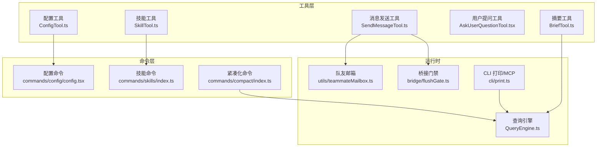
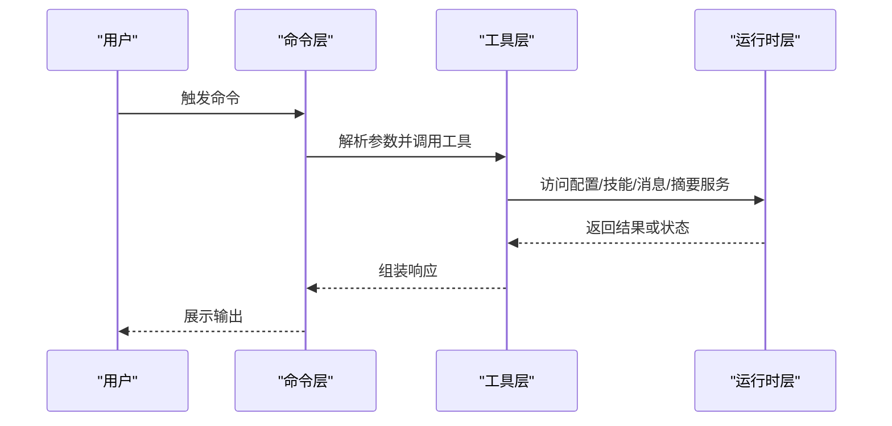
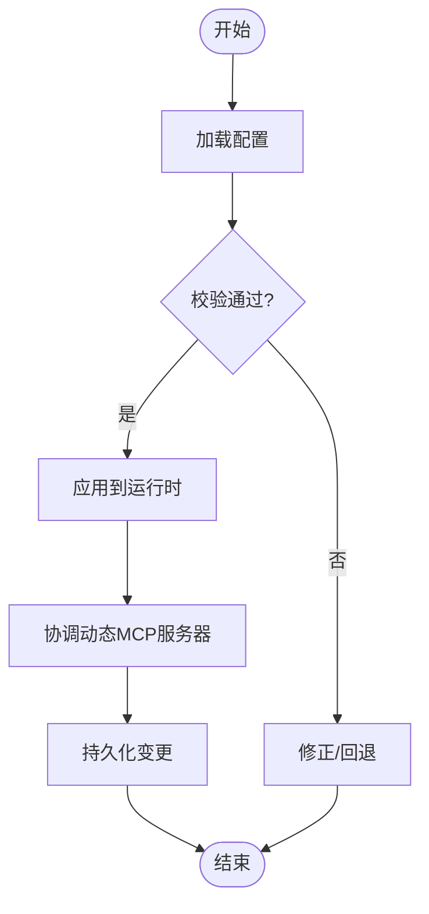
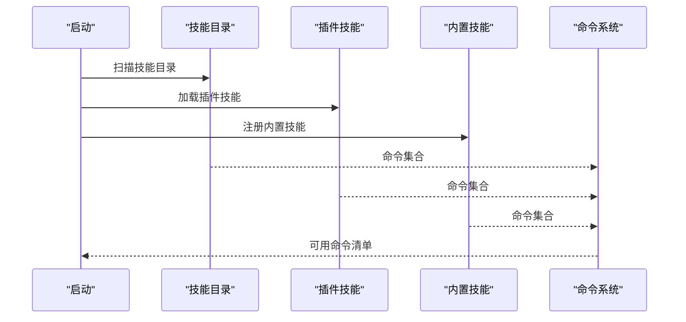
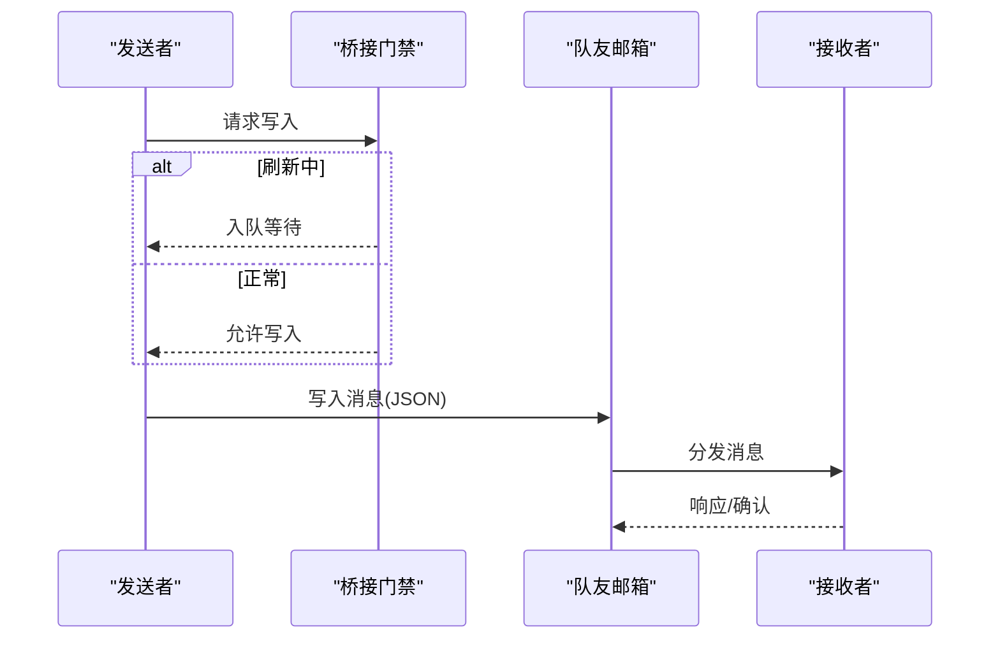
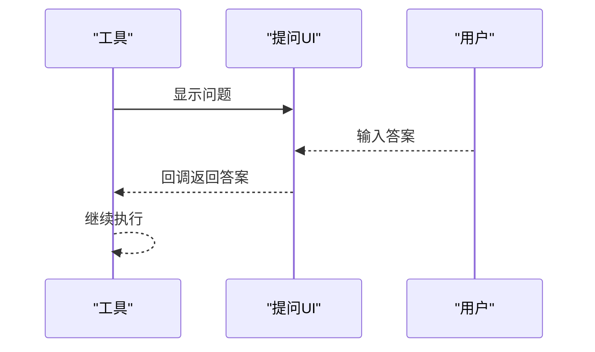
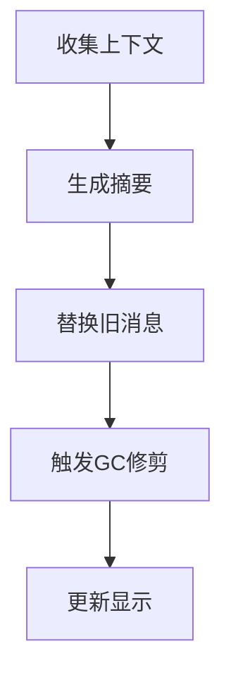
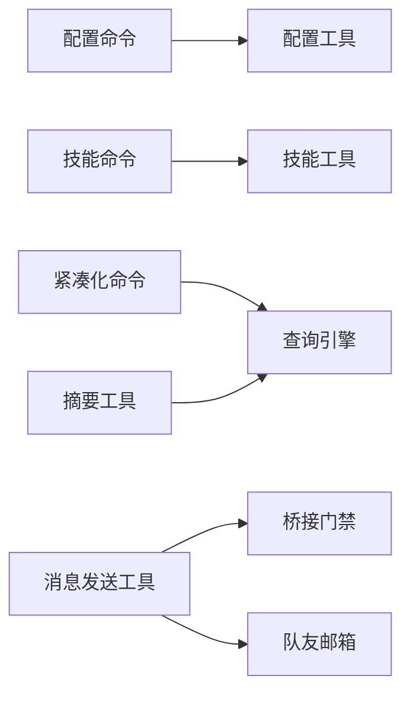

# 实用工具

<cite>
**本文引用的文件**
- [src/tools/ConfigTool/ConfigTool.ts](file://src/tools/ConfigTool/ConfigTool.ts)
- [src/tools/SkillTool/SkillTool.ts](file://src/tools/SkillTool/SkillTool.ts)
- [src/tools/SendMessageTool/SendMessageTool.ts](file://src/tools/SendMessageTool/SendMessageTool.ts)
- [src/tools/AskUserQuestionTool/AskUserQuestionTool.tsx](file://src/tools/AskUserQuestionTool/AskUserQuestionTool.tsx)
- [src/tools/BriefTool/BriefTool.ts](file://src/tools/BriefTool/BriefTool.ts)
- [src/commands/config/config.tsx](file://src/commands/config/config.tsx)
- [src/commands/skills/index.ts](file://src/commands/skills/index.ts)
- [src/commands.ts](file://src/commands.ts)
- [src/bridge/flushGate.ts](file://src/bridge/flushGate.ts)
- [src/utils/teammateMailbox.ts](file://src/utils/teammateMailbox.ts)
- [src/cli/print.ts](file://src/cli/print.ts)
- [src/QueryEngine.ts](file://src/QueryEngine.ts)
- [src/commands/compact/compact.ts](file://src/commands/compact/compact.ts)
- [src/commands/compact/index.ts](file://src/commands/compact/index.ts)
- [src/utils/tokenBudget.ts](file://src/utils/tokenBudget.ts)
</cite>

## 目录
1. [简介](#简介)
2. [项目结构](#项目结构)
3. [核心组件](#核心组件)
4. [架构总览](#架构总览)
5. [详细组件分析](#详细组件分析)
6. [依赖关系分析](#依赖关系分析)
7. [性能考量](#性能考量)
8. [故障排查指南](#故障排查指南)
9. [结论](#结论)
10. [附录](#附录)

## 简介
本文件系统性梳理并说明实用工具模块的设计与实现，覆盖以下五大工具：配置工具(ConfigTool)、技能工具(SkillTool)、消息发送工具(SendMessageTool)、用户提问工具(AskUserQuestionTool)与摘要工具(BriefTool)。文档重点阐述：
- 配置管理：如何加载、校验、持久化与动态更新配置；支持插件级与全局配置。
- 技能加载：技能目录扫描、插件技能聚合、内置技能注册与命令发现。
- 消息路由：桥接层消息写入门禁、跨组件消息解析与模式请求分发。
- 内容摘要：紧凑化摘要流程、边界标记与内存回收策略。
- 工具扩展接口：如何扩展新工具、如何接入 MCP 动态服务器与工具集。
- 自定义配置与性能优化：参数化预算、流式处理与资源清理。

## 项目结构
实用工具相关代码主要分布在如下位置：
- 工具实现：src/tools 下各工具目录（ConfigTool、SkillTool、SendMessageTool、AskUserQuestionTool、BriefTool）
- 命令入口：src/commands 下与配置、技能、紧凑化相关的命令定义与实现
- 桥接与消息：src/bridge 与 src/utils 下的消息门禁与邮箱工具
- 查询引擎：src/QueryEngine.ts 负责会话状态与消息生命周期管理
- CLI 打印与 MCP：src/cli/print.ts 提供动态 MCP 服务器协调与工具集更新
- 预算与摘要：src/utils/tokenBudget.ts 与 src/commands/compact/* 提供令牌预算与紧凑化摘要

图表来源
- [src/tools/ConfigTool/ConfigTool.ts](file://src/tools/ConfigTool/ConfigTool.ts)
- [src/tools/SkillTool/SkillTool.ts](file://src/tools/SkillTool/SkillTool.ts)
- [src/tools/SendMessageTool/SendMessageTool.ts](file://src/tools/SendMessageTool/SendMessageTool.ts)
- [src/tools/AskUserQuestionTool/AskUserQuestionTool.tsx](file://src/tools/AskUserQuestionTool/AskUserQuestionTool.tsx)
- [src/tools/BriefTool/BriefTool.ts](file://src/tools/BriefTool/BriefTool.ts)
- [src/commands/config/config.tsx](file://src/commands/config/config.tsx)
- [src/commands/skills/index.ts](file://src/commands/skills/index.ts)
- [src/commands/compact/index.ts](file://src/commands/compact/index.ts)
- [src/QueryEngine.ts](file://src/QueryEngine.ts)
- [src/bridge/flushGate.ts](file://src/bridge/flushGate.ts)
- [src/utils/teammateMailbox.ts](file://src/utils/teammateMailbox.ts)
- [src/cli/print.ts](file://src/cli/print.ts)

章节来源
- [src/tools/ConfigTool/ConfigTool.ts](file://src/tools/ConfigTool/ConfigTool.ts)
- [src/tools/SkillTool/SkillTool.ts](file://src/tools/SkillTool/SkillTool.ts)
- [src/tools/SendMessageTool/SendMessageTool.ts](file://src/tools/SendMessageTool/SendMessageTool.ts)
- [src/tools/AskUserQuestionTool/AskUserQuestionTool.tsx](file://src/tools/AskUserQuestionTool/AskUserQuestionTool.tsx)
- [src/tools/BriefTool/BriefTool.ts](file://src/tools/BriefTool/BriefTool.ts)
- [src/commands/config/config.tsx](file://src/commands/config/config.tsx)
- [src/commands/skills/index.ts](file://src/commands/skills/index.ts)
- [src/commands/compact/index.ts](file://src/commands/compact/index.ts)
- [src/QueryEngine.ts](file://src/QueryEngine.ts)
- [src/bridge/flushGate.ts](file://src/bridge/flushGate.ts)
- [src/utils/teammateMailbox.ts](file://src/utils/teammateMailbox.ts)
- [src/cli/print.ts](file://src/cli/print.ts)

## 核心组件
- 配置工具(ConfigTool)
  - 职责：封装配置读取、校验、保存与变更通知；支持插件级与全局配置项。
  - 关键点：与插件选项存储、MCPB 文件加载、动态 MCP 服务器协调配合。
- 技能工具(SkillTool)
  - 职责：提供技能发现、加载与命令聚合；支持从技能目录、插件与内置源加载。
  - 关键点：与命令系统集成，统一暴露为可执行命令集合。
- 消息发送工具(SendMessageTool)
  - 职责：负责消息序列化、路由与发送；通过桥接门禁保证历史消息与新消息顺序一致性。
  - 关键点：与队友邮箱协议、模式设置请求、关机请求等消息类型解析协作。
- 用户提问工具(AskUserQuestionTool)
  - 职责：以交互方式向用户发起问题，收集输入并回传给调用方。
  - 关键点：UI 组件化，便于在工具链中复用。
- 摘要工具(BriefTool)
  - 职责：生成简洁摘要，用于减少上下文占用或作为紧凑化流程的一部分。
  - 关键点：与查询引擎的边界标记与消息修剪协同工作。

章节来源
- [src/tools/ConfigTool/ConfigTool.ts](file://src/tools/ConfigTool/ConfigTool.ts)
- [src/tools/SkillTool/SkillTool.ts](file://src/tools/SkillTool/SkillTool.ts)
- [src/tools/SendMessageTool/SendMessageTool.ts](file://src/tools/SendMessageTool/SendMessageTool.ts)
- [src/tools/AskUserQuestionTool/AskUserQuestionTool.tsx](file://src/tools/AskUserQuestionTool/AskUserQuestionTool.tsx)
- [src/tools/BriefTool/BriefTool.ts](file://src/tools/BriefTool/BriefTool.ts)

## 架构总览
实用工具围绕“命令—工具—运行时”的三层结构组织：
- 命令层：提供用户可见的命令入口（如配置、技能、紧凑化），负责参数解析与上下文准备。
- 工具层：具体实现业务能力（配置、技能、消息、提问、摘要）。
- 运行时层：查询引擎、桥接门禁、消息邮箱与 CLI 打印，保障消息顺序、状态持久与性能。

图表来源
- [src/commands/config/config.tsx](file://src/commands/config/config.tsx)
- [src/commands/skills/index.ts](file://src/commands/skills/index.ts)
- [src/commands/compact/index.ts](file://src/commands/compact/index.ts)
- [src/QueryEngine.ts](file://src/QueryEngine.ts)
- [src/cli/print.ts](file://src/cli/print.ts)

## 详细组件分析

### 配置工具(ConfigTool)分析
- 设计要点
  - 配置持久化：支持插件级与全局配置项的读取、校验与保存。
  - 动态 MCP 协调：与 CLI 的动态 MCP 服务器协调函数配合，按需增删改配置。
  - 插件选项：与插件选项存储与 MCPB 加载器协作，确保安装后自动引导配置。
- 典型流程
  - 启动时加载配置 → 校验 schema → 应用默认值 → 注册到运行时状态。
  - 变更时触发重载与缓存清理，必要时提示用户重新加载插件以生效。

图表来源
- [src/tools/ConfigTool/ConfigTool.ts](file://src/tools/ConfigTool/ConfigTool.ts)
- [src/cli/print.ts](file://src/cli/print.ts)

章节来源
- [src/tools/ConfigTool/ConfigTool.ts](file://src/tools/ConfigTool/ConfigTool.ts)
- [src/cli/print.ts](file://src/cli/print.ts)

### 技能工具(SkillTool)分析
- 设计要点
  - 多源聚合：从技能目录、插件、内置源与内置插件技能统一加载。
  - 命令发现：与命令系统集成，将技能转换为可执行命令。
  - 容错加载：单源失败不影响其他源，记录日志并继续。
- 典型流程
  - 初始化阶段并行加载各源 → 合并去重 → 注册为命令 → 对外提供列表与搜索。

图表来源
- [src/commands.ts](file://src/commands.ts)
- [src/commands/skills/index.ts](file://src/commands/skills/index.ts)

章节来源
- [src/commands.ts](file://src/commands.ts)
- [src/commands/skills/index.ts](file://src/commands/skills/index.ts)

### 消息发送工具(SendMessageTool)分析
- 设计要点
  - 消息序列化与路由：将消息结构化并路由至目标通道。
  - 桥接门禁：在初始刷新期间阻止新消息写入，防止历史消息与新消息交错。
  - 模式与关机请求：识别并处理模式设置请求、关机请求与批准消息。
- 典型流程
  - 收到消息 → 门禁检查 → 序列化 → 发送 → 更新邮箱状态。

图表来源
- [src/bridge/flushGate.ts](file://src/bridge/flushGate.ts)
- [src/utils/teammateMailbox.ts](file://src/utils/teammateMailbox.ts)

章节来源
- [src/bridge/flushGate.ts](file://src/bridge/flushGate.ts)
- [src/utils/teammateMailbox.ts](file://src/utils/teammateMailbox.ts)

### 用户提问工具(AskUserQuestionTool)分析
- 设计要点
  - UI 组件化：提供可复用的提问对话框，支持多轮交互。
  - 回调驱动：通过回调返回用户输入，便于工具链集成。
- 典型流程
  - 调用工具 → 弹出提问界面 → 等待用户输入 → 回调返回 → 继续后续步骤。

图表来源
- [src/tools/AskUserQuestionTool/AskUserQuestionTool.tsx](file://src/tools/AskUserQuestionTool/AskUserQuestionTool.tsx)

章节来源
- [src/tools/AskUserQuestionTool/AskUserQuestionTool.tsx](file://src/tools/AskUserQuestionTool/AskUserQuestionTool.tsx)

### 摘要工具(BriefTool)分析
- 设计要点
  - 简洁摘要：生成可读性强的摘要文本，降低上下文长度。
  - 与查询引擎协作：利用边界标记与修剪策略，释放历史消息内存。
- 典型流程
  - 收集上下文 → 生成摘要 → 替换旧消息 → 通知 UI。

图表来源
- [src/tools/BriefTool/BriefTool.ts](file://src/tools/BriefTool/BriefTool.ts)
- [src/QueryEngine.ts](file://src/QueryEngine.ts)

章节来源
- [src/tools/BriefTool/BriefTool.ts](file://src/tools/BriefTool/BriefTool.ts)
- [src/QueryEngine.ts](file://src/QueryEngine.ts)

## 依赖关系分析
- 工具与命令
  - 配置工具与配置命令：命令入口负责打开设置 UI，工具负责配置持久化与动态 MCP 协调。
  - 技能工具与技能命令：命令负责列出可用技能，工具负责加载与聚合。
  - 紧凑化命令与查询引擎：命令触发紧凑化流程，引擎负责消息修剪与边界标记。
- 工具与运行时
  - 消息发送工具依赖桥接门禁与队友邮箱协议，确保消息顺序与可靠性。
  - 摘要工具与查询引擎协作，利用边界标记进行内存回收。

图表来源
- [src/commands/config/config.tsx](file://src/commands/config/config.tsx)
- [src/commands/skills/index.ts](file://src/commands/skills/index.ts)
- [src/commands/compact/index.ts](file://src/commands/compact/index.ts)
- [src/tools/ConfigTool/ConfigTool.ts](file://src/tools/ConfigTool/ConfigTool.ts)
- [src/tools/SkillTool/SkillTool.ts](file://src/tools/SkillTool/SkillTool.ts)
- [src/tools/SendMessageTool/SendMessageTool.ts](file://src/tools/SendMessageTool/SendMessageTool.ts)
- [src/tools/BriefTool/BriefTool.ts](file://src/tools/BriefTool/BriefTool.ts)
- [src/QueryEngine.ts](file://src/QueryEngine.ts)
- [src/bridge/flushGate.ts](file://src/bridge/flushGate.ts)
- [src/utils/teammateMailbox.ts](file://src/utils/teammateMailbox.ts)

章节来源
- [src/commands/config/config.tsx](file://src/commands/config/config.tsx)
- [src/commands/skills/index.ts](file://src/commands/skills/index.ts)
- [src/commands/compact/index.ts](file://src/commands/compact/index.ts)
- [src/tools/ConfigTool/ConfigTool.ts](file://src/tools/ConfigTool/ConfigTool.ts)
- [src/tools/SkillTool/SkillTool.ts](file://src/tools/SkillTool/SkillTool.ts)
- [src/tools/SendMessageTool/SendMessageTool.ts](file://src/tools/SendMessageTool/SendMessageTool.ts)
- [src/tools/BriefTool/BriefTool.ts](file://src/tools/BriefTool/BriefTool.ts)
- [src/QueryEngine.ts](file://src/QueryEngine.ts)
- [src/bridge/flushGate.ts](file://src/bridge/flushGate.ts)
- [src/utils/teammateMailbox.ts](file://src/utils/teammateMailbox.ts)

## 性能考量
- 令牌预算与节流
  - 使用令牌预算定位与提示，避免过早总结，保持对话连贯性。
- 流式处理与内存回收
  - 查询引擎在紧凑边界处主动修剪历史消息，释放内存，降低长会话开销。
- 动态 MCP 协调
  - 仅在配置变化时重建连接，减少不必要的网络与计算开销。
- 缓存与去重
  - 技能加载采用并行与去重策略，提升启动速度并降低错误影响面。

章节来源
- [src/utils/tokenBudget.ts](file://src/utils/tokenBudget.ts)
- [src/QueryEngine.ts](file://src/QueryEngine.ts)
- [src/cli/print.ts](file://src/cli/print.ts)
- [src/commands.ts](file://src/commands.ts)

## 故障排查指南
- 配置无法保存或生效
  - 检查配置 schema 是否正确；若涉及动态 MCP，确认已重新加载插件。
- 技能未出现
  - 确认技能目录存在 SKILL.md；检查插件是否启用且无异常；查看命令聚合日志。
- 消息乱序或丢失
  - 检查桥接门禁是否处于激活状态；确认刷新完成后已清空队列。
- 摘要不生效或内存未回收
  - 确认边界标记是否正确；检查修剪逻辑是否被调用。
- 令牌预算提示频繁
  - 调整预算阈值或缩短单次对话长度，避免过早中断。

章节来源
- [src/tools/ConfigTool/ConfigTool.ts](file://src/tools/ConfigTool/ConfigTool.ts)
- [src/commands.ts](file://src/commands.ts)
- [src/bridge/flushGate.ts](file://src/bridge/flushGate.ts)
- [src/QueryEngine.ts](file://src/QueryEngine.ts)
- [src/utils/tokenBudget.ts](file://src/utils/tokenBudget.ts)

## 结论
实用工具通过清晰的职责划分与稳健的运行时支撑，实现了配置管理、技能加载、消息路由与内容摘要的核心能力。其设计强调：
- 可靠性：桥接门禁与消息邮箱协议保障消息顺序与一致性。
- 可扩展性：工具与命令解耦，易于新增工具与命令。
- 可维护性：查询引擎与紧凑化机制降低长期会话的内存压力。
建议在生产环境中结合令牌预算与动态 MCP 协调策略，持续优化性能与稳定性。

## 附录
- 使用示例与代码路径
  - 配置命令入口：[配置命令](file://src/commands/config/config.tsx)
  - 技能命令入口：[技能命令](file://src/commands/skills/index.ts)
  - 紧凑化命令入口：[紧凑化命令](file://src/commands/compact/index.ts)
  - 动态 MCP 协调：[reconcileMcpServers:5450-5594](file://src/cli/print.ts#L5450-L5594)
  - 技能加载聚合：[getSkills:353-398](file://src/commands.ts#L353-L398)
  - 桥接门禁状态机：[FlushGate:16-50](file://src/bridge/flushGate.ts#L16-L50)
  - 队友邮箱消息解析：[isShutdownRequest/isPlanApprovalRequest/isModeSetRequest:868-1062](file://src/utils/teammateMailbox.ts#L868-L1062)
  - 紧凑化摘要流程：[buildDisplayText:230-248](file://src/commands/compact/compact.ts#L230-L248)
  - 令牌预算定位与提示：[findTokenBudgetPositions/getBudgetContinuationMessage:31-73](file://src/utils/tokenBudget.ts#L31-L73)