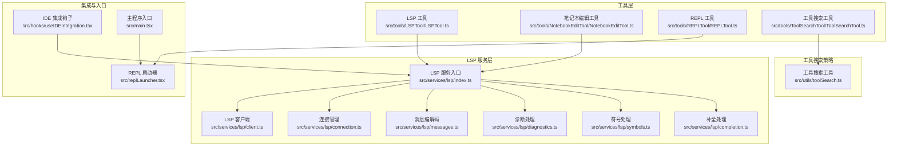
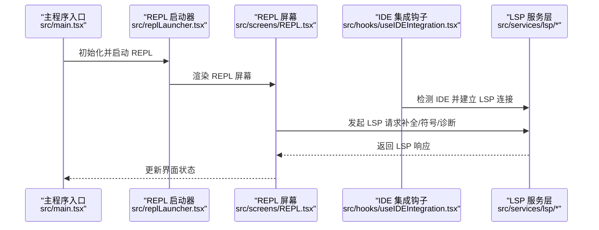
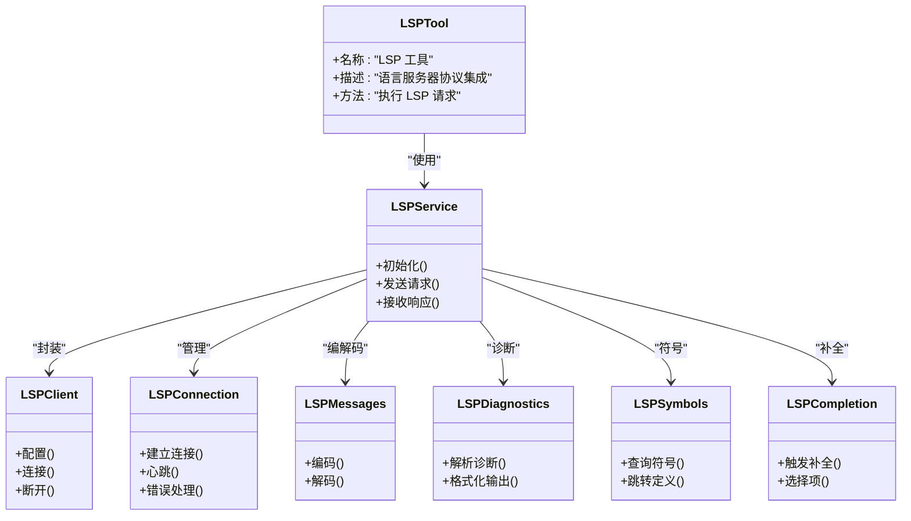
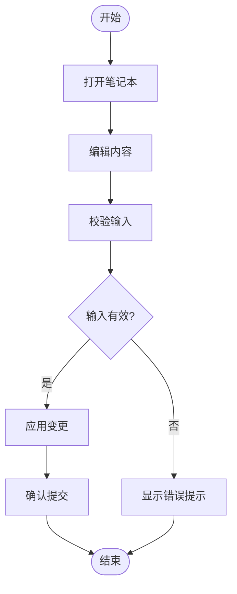
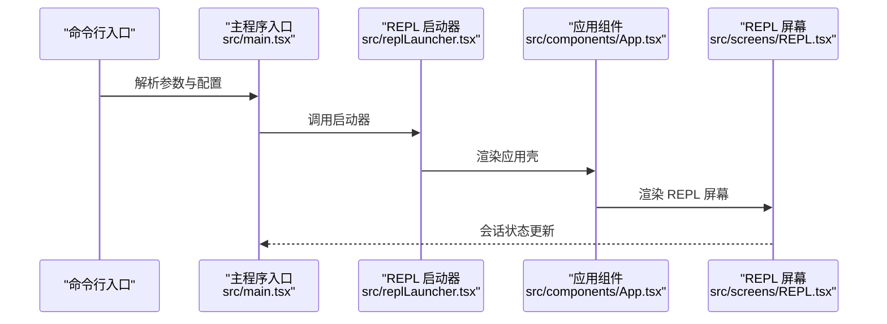
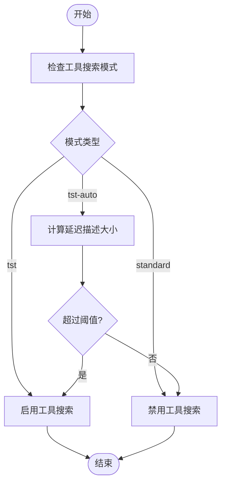
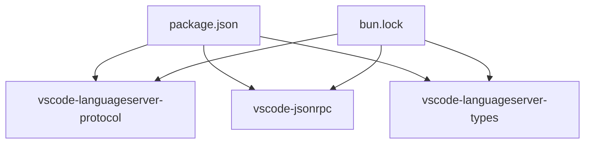

# 开发工具

<cite>
**本文引用的文件**
- [src/tools/LSPTool/LSPTool.ts](file://src/tools/LSPTool/LSPTool.ts)
- [src/tools/NotebookEditTool/NotebookEditTool.ts](file://src/tools/NotebookEditTool/NotebookEditTool.ts)
- [src/tools/REPLTool/REPLTool.ts](file://src/tools/REPLTool/REPLTool.ts)
- [src/tools/ToolSearchTool/ToolSearchTool.ts](file://src/tools/ToolSearchTool/ToolSearchTool.ts)
- [src/services/lsp/index.ts](file://src/services/lsp/index.ts)
- [src/services/lsp/types.ts](file://src/services/lsp/types.ts)
- [src/services/lsp/client.ts](file://src/services/lsp/client.ts)
- [src/services/lsp/connection.ts](file://src/services/lsp/connection.ts)
- [src/services/lsp/messages.ts](file://src/services/lsp/messages.ts)
- [src/services/lsp/diagnostics.ts](file://src/services/lsp/diagnostics.ts)
- [src/services/lsp/symbols.ts](file://src/services/lsp/symbols.ts)
- [src/services/lsp/completion.ts](file://src/services/lsp/completion.ts)
- [src/hooks/useIDEIntegration.tsx](file://src/hooks/useIDEIntegration.tsx)
- [src/hooks/useLspPluginRecommendation.tsx](file://src/hooks/useLspPluginRecommendation.tsx)
- [src/screens/REPL.tsx](file://src/screens/REPL.tsx)
- [src/replLauncher.tsx](file://src/replLauncher.tsx)
- [src/main.tsx](file://src/main.tsx)
- [src/utils/toolSearch.ts](file://src/utils/toolSearch.ts)
- [src/commands/plugin/PluginErrors.tsx](file://src/commands/plugin/PluginErrors.tsx)
- [package.json](file://package.json)
- [bun.lock](file://bun.lock)
</cite>

## 目录
1. [简介](#简介)
2. [项目结构](#项目结构)
3. [核心组件](#核心组件)
4. [架构总览](#架构总览)
5. [详细组件分析](#详细组件分析)
6. [依赖关系分析](#依赖关系分析)
7. [性能考虑](#性能考虑)
8. [故障排除指南](#故障排除指南)
9. [结论](#结论)
10. [附录](#附录)

## 简介
本文件系统性梳理开发工具中与 LSP 工具、笔记本编辑工具、REPL 工具以及工具搜索工具相关的功能与实现，重点覆盖以下方面：
- LSP 工具：语言服务器协议集成、代码补全、符号导航、错误诊断等能力
- 笔记本编辑工具：交互式笔记本工作流与编辑能力
- REPL 工具：命令行交互式环境与会话管理
- 工具搜索工具：基于阈值与模型能力的工具描述延迟加载与检索策略

同时，文档提供 LSP 客户端配置、连接管理、消息传递流程、性能优化建议，以及工具发现机制、版本兼容性与故障排除指南。

## 项目结构
围绕开发工具的核心模块，主要涉及以下目录与文件：
- 工具层：LSP 工具、笔记本编辑工具、REPL 工具、工具搜索工具
- LSP 服务层：客户端封装、连接管理、消息编解码、诊断与符号处理
- 集成与入口：IDE 集成钩子、REPL 启动器、主程序入口
- 工具搜索策略：自动阈值判断、模式切换、可用性检查

**图表来源**
- [src/tools/LSPTool/LSPTool.ts](file://src/tools/LSPTool/LSPTool.ts)
- [src/tools/NotebookEditTool/NotebookEditTool.ts](file://src/tools/NotebookEditTool/NotebookEditTool.ts)
- [src/tools/REPLTool/REPLTool.ts](file://src/tools/REPLTool/REPLTool.ts)
- [src/tools/ToolSearchTool/ToolSearchTool.ts](file://src/tools/ToolSearchTool/ToolSearchTool.ts)
- [src/services/lsp/index.ts](file://src/services/lsp/index.ts)
- [src/services/lsp/client.ts](file://src/services/lsp/client.ts)
- [src/services/lsp/connection.ts](file://src/services/lsp/connection.ts)
- [src/services/lsp/messages.ts](file://src/services/lsp/messages.ts)
- [src/services/lsp/diagnostics.ts](file://src/services/lsp/diagnostics.ts)
- [src/services/lsp/symbols.ts](file://src/services/lsp/symbols.ts)
- [src/services/lsp/completion.ts](file://src/services/lsp/completion.ts)
- [src/hooks/useIDEIntegration.tsx](file://src/hooks/useIDEIntegration.tsx)
- [src/replLauncher.tsx](file://src/replLauncher.tsx)
- [src/main.tsx](file://src/main.tsx)
- [src/utils/toolSearch.ts](file://src/utils/toolSearch.ts)

**章节来源**
- [src/tools/LSPTool/LSPTool.ts](file://src/tools/LSPTool/LSPTool.ts)
- [src/tools/NotebookEditTool/NotebookEditTool.ts](file://src/tools/NotebookEditTool/NotebookEditTool.ts)
- [src/tools/REPLTool/REPLTool.ts](file://src/tools/REPLTool/REPLTool.ts)
- [src/tools/ToolSearchTool/ToolSearchTool.ts](file://src/tools/ToolSearchTool/ToolSearchTool.ts)
- [src/services/lsp/index.ts](file://src/services/lsp/index.ts)
- [src/services/lsp/client.ts](file://src/services/lsp/client.ts)
- [src/services/lsp/connection.ts](file://src/services/lsp/connection.ts)
- [src/services/lsp/messages.ts](file://src/services/lsp/messages.ts)
- [src/services/lsp/diagnostics.ts](file://src/services/lsp/diagnostics.ts)
- [src/services/lsp/symbols.ts](file://src/services/lsp/symbols.ts)
- [src/services/lsp/completion.ts](file://src/services/lsp/completion.ts)
- [src/hooks/useIDEIntegration.tsx](file://src/hooks/useIDEIntegration.tsx)
- [src/replLauncher.tsx](file://src/replLauncher.tsx)
- [src/main.tsx](file://src/main.tsx)
- [src/utils/toolSearch.ts](file://src/utils/toolSearch.ts)

## 核心组件
- LSP 工具：封装语言服务器协议调用，提供补全、符号、诊断等能力，支持多语言服务器配置与错误处理
- 笔记本编辑工具：面向交互式笔记本场景的编辑与更新能力
- REPL 工具：提供命令行交互式会话，支持远程模式与命令过滤
- 工具搜索工具：根据阈值与模型能力动态启用工具描述延迟加载，减少上下文占用

**章节来源**
- [src/tools/LSPTool/LSPTool.ts](file://src/tools/LSPTool/LSPTool.ts)
- [src/tools/NotebookEditTool/NotebookEditTool.ts](file://src/tools/NotebookEditTool/NotebookEditTool.ts)
- [src/tools/REPLTool/REPLTool.ts](file://src/tools/REPLTool/REPLTool.ts)
- [src/tools/ToolSearchTool/ToolSearchTool.ts](file://src/tools/ToolSearchTool/ToolSearchTool.ts)

## 架构总览
下图展示了从主程序入口到 REPL 启动器、再到 LSP 服务层的整体调用链路，以及 IDE 集成钩子如何接入 LSP 能力。

**图表来源**
- [src/main.tsx](file://src/main.tsx)
- [src/replLauncher.tsx](file://src/replLauncher.tsx)
- [src/screens/REPL.tsx](file://src/screens/REPL.tsx)
- [src/hooks/useIDEIntegration.tsx](file://src/hooks/useIDEIntegration.tsx)
- [src/services/lsp/index.ts](file://src/services/lsp/index.ts)

## 详细组件分析

### LSP 工具分析
LSP 工具通过统一的服务层实现语言服务器协议能力，包括客户端封装、连接管理、消息编解码、诊断与符号处理、补全等功能。

**图表来源**
- [src/tools/LSPTool/LSPTool.ts](file://src/tools/LSPTool/LSPTool.ts)
- [src/services/lsp/index.ts](file://src/services/lsp/index.ts)
- [src/services/lsp/client.ts](file://src/services/lsp/client.ts)
- [src/services/lsp/connection.ts](file://src/services/lsp/connection.ts)
- [src/services/lsp/messages.ts](file://src/services/lsp/messages.ts)
- [src/services/lsp/diagnostics.ts](file://src/services/lsp/diagnostics.ts)
- [src/services/lsp/symbols.ts](file://src/services/lsp/symbols.ts)
- [src/services/lsp/completion.ts](file://src/services/lsp/completion.ts)

**章节来源**
- [src/tools/LSPTool/LSPTool.ts](file://src/tools/LSPTool/LSPTool.ts)
- [src/services/lsp/index.ts](file://src/services/lsp/index.ts)
- [src/services/lsp/client.ts](file://src/services/lsp/client.ts)
- [src/services/lsp/connection.ts](file://src/services/lsp/connection.ts)
- [src/services/lsp/messages.ts](file://src/services/lsp/messages.ts)
- [src/services/lsp/diagnostics.ts](file://src/services/lsp/diagnostics.ts)
- [src/services/lsp/symbols.ts](file://src/services/lsp/symbols.ts)
- [src/services/lsp/completion.ts](file://src/services/lsp/completion.ts)

### 笔记本编辑工具分析
笔记本编辑工具提供交互式笔记本场景下的编辑与更新能力，结合工具拒绝提示组件与权限请求组件，确保安全可控的编辑体验。

**图表来源**
- [src/tools/NotebookEditTool/NotebookEditTool.ts](file://src/tools/NotebookEditTool/NotebookEditTool.ts)
- [src/components/permissions/NotebookEditPermissionRequest/NotebookEditToolDiff.tsx](file://src/components/permissions/NotebookEditPermissionRequest/NotebookEditToolDiff.tsx)
- [src/components/NotebookEditToolUseRejectedMessage.tsx](file://src/components/NotebookEditToolUseRejectedMessage.tsx)

**章节来源**
- [src/tools/NotebookEditTool/NotebookEditTool.ts](file://src/tools/NotebookEditTool/NotebookEditTool.ts)
- [src/components/permissions/NotebookEditPermissionRequest/NotebookEditToolDiff.tsx](file://src/components/permissions/NotebookEditPermissionRequest/NotebookEditToolDiff.tsx)
- [src/components/NotebookEditToolUseRejectedMessage.tsx](file://src/components/NotebookEditToolUseRejectedMessage.tsx)

### REPL 工具分析
REPL 工具负责命令行交互式环境的启动与会话管理，支持远程模式、命令过滤与调试选项。

**图表来源**
- [src/main.tsx](file://src/main.tsx)
- [src/replLauncher.tsx](file://src/replLauncher.tsx)
- [src/screens/REPL.tsx](file://src/screens/REPL.tsx)

**章节来源**
- [src/main.tsx](file://src/main.tsx)
- [src/replLauncher.tsx](file://src/replLauncher.tsx)
- [src/screens/REPL.tsx](file://src/screens/REPL.tsx)

### 工具搜索工具分析
工具搜索工具根据阈值与模型能力动态启用工具描述延迟加载，减少上下文占用，提升对话效率。

**图表来源**
- [src/utils/toolSearch.ts](file://src/utils/toolSearch.ts)

**章节来源**
- [src/utils/toolSearch.ts](file://src/utils/toolSearch.ts)

## 依赖关系分析
项目对 LSP 协议相关依赖采用标准库形式，确保跨平台与版本稳定性；REPL 与工具搜索策略通过环境变量与运行时配置灵活控制。

**图表来源**
- [package.json](file://package.json)
- [bun.lock](file://bun.lock)

**章节来源**
- [package.json](file://package.json)
- [bun.lock](file://bun.lock)

## 性能考虑
- 工具搜索阈值：通过环境变量与运行时配置控制工具描述延迟加载，避免大模型上下文溢出
- LSP 连接复用：连接管理模块提供心跳与错误恢复，降低频繁重建成本
- REPL 远程模式：仅预过滤远程安全命令，减少不必要的本地资源消耗
- 诊断与符号缓存：在服务层对诊断与符号结果进行格式化与缓存，减少重复计算

[本节为通用指导，无需具体文件分析]

## 故障排除指南
- LSP 服务器配置无效：检查服务器名称与配置验证错误信息，修正配置后重试
- LSP 服务器启动失败：查看失败原因与超时信息，确认可执行路径与环境变量
- LSP 服务器崩溃：根据信号或退出码定位问题，必要时重启或更换服务器
- 插件缓存缺失：确认插件安装路径与缓存状态，重新安装或清理缓存
- 工具搜索不可用：确认 ToolSearchTool 是否在工具列表中，以及模型是否支持 tool_reference

**章节来源**
- [src/commands/plugin/PluginErrors.tsx](file://src/commands/plugin/PluginErrors.tsx)

## 结论
本开发工具以 LSP 服务层为核心，结合笔记本编辑工具、REPL 工具与工具搜索策略，构建了完整的 IDE 集成与交互式开发体验。通过连接管理、消息编解码与诊断/符号/补全等能力，实现了稳定高效的代码辅助功能；通过工具搜索策略与远程模式，兼顾性能与易用性。建议在实际部署中关注版本兼容性与错误处理，持续优化阈值与缓存策略以获得最佳体验。

[本节为总结性内容，无需具体文件分析]

## 附录
- 使用示例与代码演示路径（不直接展示代码内容）：
  - LSP 工具调用序列参考：[LSP 服务层](file://src/services/lsp/index.ts)
  - 笔记本编辑流程参考：[笔记本编辑工具](file://src/tools/NotebookEditTool/NotebookEditTool.ts)
  - REPL 启动流程参考：[REPL 启动器](file://src/replLauncher.tsx)
  - 工具搜索阈值逻辑参考：[工具搜索工具](file://src/utils/toolSearch.ts)
- 版本兼容性与依赖：
  - LSP 协议相关依赖版本与引擎要求参考：[package.json](file://package.json)，[bun.lock](file://bun.lock)