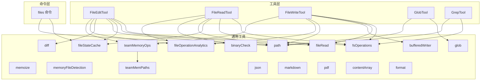
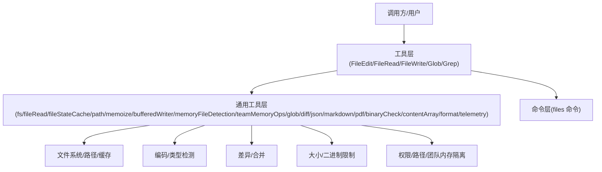
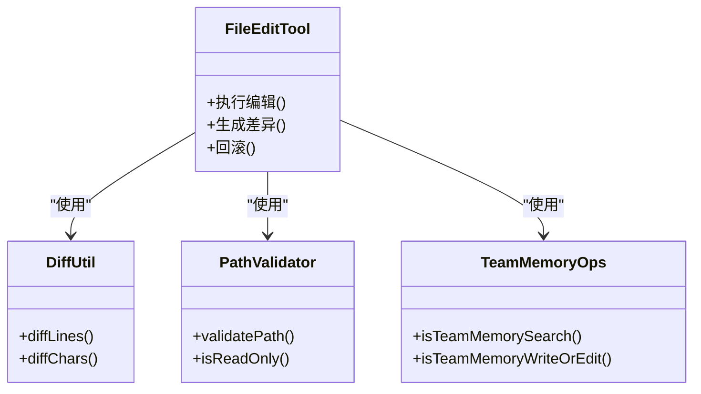
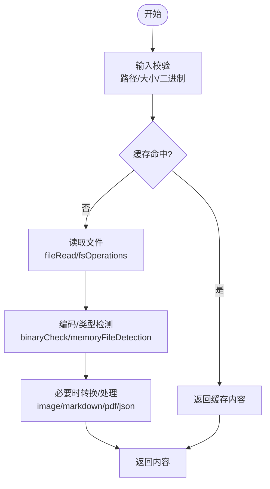
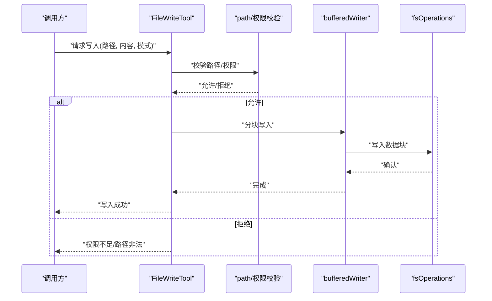
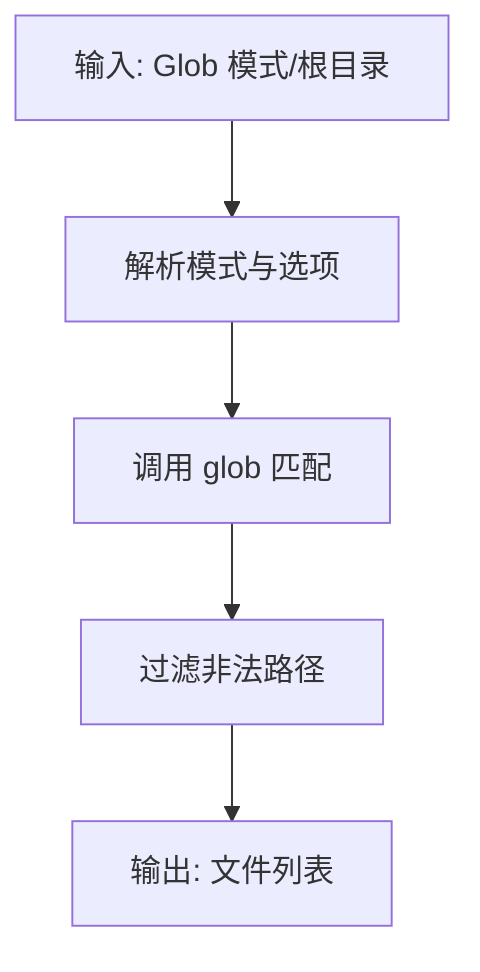
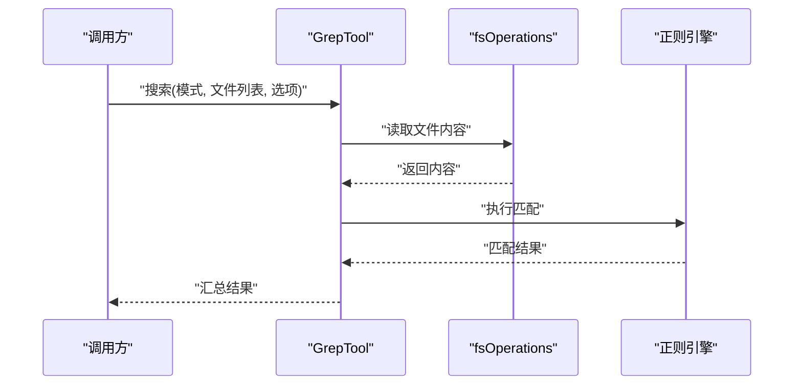
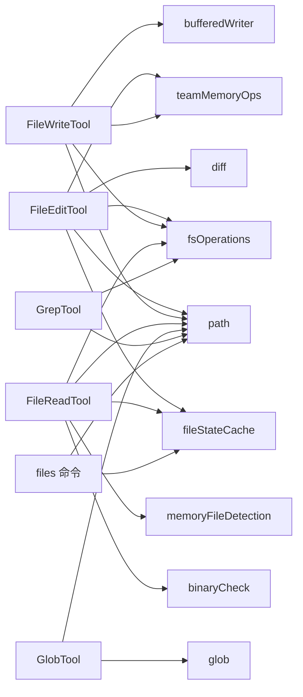

# 文件工具

<cite>
**本文引用的文件**
- [src/tools/FileEditTool/FileEditTool.ts](file://src/tools/FileEditTool/FileEditTool.ts)
- [src/tools/FileEditTool/constants.ts](file://src/tools/FileEditTool/constants.ts)
- [src/tools/FileEditTool/types.ts](file://src/tools/FileEditTool/types.ts)
- [src/tools/FileEditTool/utils.ts](file://src/tools/FileEditTool/utils.ts)
- [src/tools/FileReadTool/FileReadTool.ts](file://src/tools/FileReadTool/FileReadTool.ts)
- [src/tools/FileReadTool/limits.ts](file://src/tools/FileReadTool/limits.ts)
- [src/tools/FileWriteTool/FileWriteTool.ts](file://src/tools/FileWriteTool/FileWriteTool.ts)
- [src/tools/GlobTool/GlobTool.ts](file://src/tools/GlobTool/GlobTool.ts)
- [src/tools/GrepTool/GrepTool.ts](file://src/tools/GrepTool/GrepTool.ts)
- [src/utils/fileRead.ts](file://src/utils/fileRead.ts)
- [src/utils/fsOperations.ts](file://src/utils/fsOperations.ts)
- [src/utils/fileStateCache.ts](file://src/utils/fileStateCache.ts)
- [src/utils/path.ts](file://src/utils/path.ts)
- [src/utils/memoize.ts](file://src/utils/memoize.ts)
- [src/utils/bufferedWriter.ts](file://src/utils/bufferedWriter.ts)
- [src/utils/memoryFileDetection.ts](file://src/utils/memoryFileDetection.ts)
- [src/utils/teamMemoryOps.ts](file://src/utils/teamMemoryOps.ts)
- [src/memdir/teamMemPaths.ts](file://src/memdir/teamMemPaths.ts)
- [src/commands/files/files.ts](file://src/commands/files/files.ts)
- [src/utils/transcriptSearch.ts](file://src/utils/transcriptSearch.ts)
- [src/utils/file.ts](file://src/utils/file.ts)
- [src/utils/git.ts](file://src/utils/git.ts)
- [src/utils/glob.ts](file://src/utils/glob.ts)
- [src/utils/diff.ts](file://src/utils/diff.ts)
- [src/utils/json.ts](file://src/utils/json.ts)
- [src/utils/markdown.ts](file://src/utils/markdown.ts)
- [src/utils/pdf.ts](file://src/utils/pdf.ts)
- [src/utils/binaryCheck.ts](file://src/utils/binaryCheck.ts)
- [src/utils/contentArray.ts](file://src/utils/contentArray.ts)
- [src/utils/format.ts](file://src/utils/format.ts)
- [src/utils/telemetry/fileOperationAnalytics.ts](file://src/utils/telemetry/fileOperationAnalytics.ts)
</cite>

## 目录
1. [简介](#简介)
2. [项目结构](#项目结构)
3. [核心组件](#核心组件)
4. [架构总览](#架构总览)
5. [详细组件分析](#详细组件分析)
6. [依赖关系分析](#依赖关系分析)
7. [性能考量](#性能考量)
8. [故障排查指南](#故障排查指南)
9. [结论](#结论)
10. [附录](#附录)

## 简介
本文件工具文档系统性梳理了仓库中的文件编辑、文件读取、文件写入、文件查找与文本搜索能力，覆盖以下主题：
- 功能特性：文件编辑（替换/插入/删除）、文件读取（含大小限制与二进制保护）、文件写入（增量/覆盖）、文件查找（通配符/Glob）与文本搜索（grep/正则）。
- 安全机制：路径验证、只读/破坏性操作校验、二进制文件识别、团队内存文件隔离、权限与沙箱策略。
- 权限控制：工具级权限开关、路径白名单/黑名单、破坏性命令警告与确认流程。
- 路径验证：相对/绝对路径规范化、工作目录上下文、跨平台路径处理。
- 使用示例与场景：在不同开发场景中如何组合使用这些工具，以及最佳实践。
- 内容处理：编码/类型检测、大文件优化、缓冲写入、差异计算与合并。
- 错误处理：统一的错误分类与提示、回退策略与可观测性。

## 项目结构
文件工具相关代码主要分布在以下位置：
- 工具层：src/tools 下的 FileEditTool、FileReadTool、FileWriteTool、GlobTool、GrepTool。
- 工具通用能力：src/utils 下的 fileRead、fsOperations、fileStateCache、path、memoize、bufferedWriter、memoryFileDetection、teamMemoryOps、glob、diff、json、markdown、pdf、binaryCheck、contentArray、format、telemetry 等。
- 命令层：src/commands/files/files.ts 提供“列出上下文中文件”的命令接口。
- 团队内存路径：src/memdir/teamMemPaths.ts 用于识别团队内存文件路径。

图表来源
- [src/tools/FileEditTool/FileEditTool.ts](file://src/tools/FileEditTool/FileEditTool.ts)
- [src/tools/FileReadTool/FileReadTool.ts](file://src/tools/FileReadTool/FileReadTool.ts)
- [src/tools/FileWriteTool/FileWriteTool.ts](file://src/tools/FileWriteTool/FileWriteTool.ts)
- [src/tools/GlobTool/GlobTool.ts](file://src/tools/GlobTool/GlobTool.ts)
- [src/tools/GrepTool/GrepTool.ts](file://src/tools/GrepTool/GrepTool.ts)
- [src/utils/fsOperations.ts](file://src/utils/fsOperations.ts)
- [src/utils/fileRead.ts](file://src/utils/fileRead.ts)
- [src/utils/fileStateCache.ts](file://src/utils/fileStateCache.ts)
- [src/utils/path.ts](file://src/utils/path.ts)
- [src/utils/memoize.ts](file://src/utils/memoize.ts)
- [src/utils/bufferedWriter.ts](file://src/utils/bufferedWriter.ts)
- [src/utils/memoryFileDetection.ts](file://src/utils/memoryFileDetection.ts)
- [src/utils/teamMemoryOps.ts](file://src/utils/teamMemoryOps.ts)
- [src/memdir/teamMemPaths.ts](file://src/memdir/teamMemPaths.ts)
- [src/commands/files/files.ts](file://src/commands/files/files.ts)

章节来源
- [src/tools/FileEditTool/FileEditTool.ts](file://src/tools/FileEditTool/FileEditTool.ts)
- [src/tools/FileReadTool/FileReadTool.ts](file://src/tools/FileReadTool/FileReadTool.ts)
- [src/tools/FileWriteTool/FileWriteTool.ts](file://src/tools/FileWriteTool/FileWriteTool.ts)
- [src/tools/GlobTool/GlobTool.ts](file://src/tools/GlobTool/GlobTool.ts)
- [src/tools/GrepTool/GrepTool.ts](file://src/tools/GrepTool/GrepTool.ts)
- [src/utils/fsOperations.ts](file://src/utils/fsOperations.ts)
- [src/utils/fileRead.ts](file://src/utils/fileRead.ts)
- [src/utils/fileStateCache.ts](file://src/utils/fileStateCache.ts)
- [src/utils/path.ts](file://src/utils/path.ts)
- [src/utils/memoize.ts](file://src/utils/memoize.ts)
- [src/utils/bufferedWriter.ts](file://src/utils/bufferedWriter.ts)
- [src/utils/memoryFileDetection.ts](file://src/utils/memoryFileDetection.ts)
- [src/utils/teamMemoryOps.ts](file://src/utils/teamMemoryOps.ts)
- [src/memdir/teamMemPaths.ts](file://src/memdir/teamMemPaths.ts)
- [src/commands/files/files.ts](file://src/commands/files/files.ts)

## 核心组件
- 文件编辑工具（FileEditTool）
  - 支持基于行范围或模式的替换、插入、删除；支持差异计算与回滚；具备安全校验与权限控制。
  - 关键文件：[src/tools/FileEditTool/FileEditTool.ts](file://src/tools/FileEditTool/FileEditTool.ts)、[src/tools/FileEditTool/constants.ts](file://src/tools/FileEditTool/constants.ts)、[src/tools/FileEditTool/types.ts](file://src/tools/FileEditTool/types.ts)、[src/tools/FileEditTool/utils.ts](file://src/tools/FileEditTool/utils.ts)。
- 文件读取工具（FileReadTool）
  - 提供文件读取、大小限制、二进制文件识别与保护、图像/多媒体内容处理。
  - 关键文件：[src/tools/FileReadTool/FileReadTool.ts](file://src/tools/FileReadTool/FileReadTool.ts)、[src/tools/FileReadTool/limits.ts](file://src/tools/FileReadTool/limits.ts)。
- 文件写入工具（FileWriteTool）
  - 支持覆盖/追加写入、缓冲写入、路径校验与权限控制。
  - 关键文件：[src/tools/FileWriteTool/FileWriteTool.ts](file://src/tools/FileWriteTool/FileWriteTool.ts)。
- 文件查找工具（GlobTool）
  - 基于通配符/Glob 模式进行文件匹配与列举。
  - 关键文件：[src/tools/GlobTool/GlobTool.ts](file://src/tools/GlobTool/GlobTool.ts)。
- 文本搜索工具（GrepTool）
  - 支持正则表达式匹配、多文件搜索、结果聚合与高亮。
  - 关键文件：[src/tools/GrepTool/GrepTool.ts](file://src/tools/GrepTool/GrepTool.ts)。

章节来源
- [src/tools/FileEditTool/FileEditTool.ts](file://src/tools/FileEditTool/FileEditTool.ts)
- [src/tools/FileEditTool/constants.ts](file://src/tools/FileEditTool/constants.ts)
- [src/tools/FileEditTool/types.ts](file://src/tools/FileEditTool/types.ts)
- [src/tools/FileEditTool/utils.ts](file://src/tools/FileEditTool/utils.ts)
- [src/tools/FileReadTool/FileReadTool.ts](file://src/tools/FileReadTool/FileReadTool.ts)
- [src/tools/FileReadTool/limits.ts](file://src/tools/FileReadTool/limits.ts)
- [src/tools/FileWriteTool/FileWriteTool.ts](file://src/tools/FileWriteTool/FileWriteTool.ts)
- [src/tools/GlobTool/GlobTool.ts](file://src/tools/GlobTool/GlobTool.ts)
- [src/tools/GrepTool/GrepTool.ts](file://src/tools/GrepTool/GrepTool.ts)

## 架构总览
文件工具的整体架构围绕“工具层 + 通用工具层 + 命令层”展开，工具层负责具体功能，通用工具层提供底层能力（文件系统、路径、缓存、编码/类型检测、差异计算等），命令层提供 CLI 接口。

图表来源
- [src/tools/FileEditTool/FileEditTool.ts](file://src/tools/FileEditTool/FileEditTool.ts)
- [src/tools/FileReadTool/FileReadTool.ts](file://src/tools/FileReadTool/FileReadTool.ts)
- [src/tools/FileWriteTool/FileWriteTool.ts](file://src/tools/FileWriteTool/FileWriteTool.ts)
- [src/tools/GlobTool/GlobTool.ts](file://src/tools/GlobTool/GlobTool.ts)
- [src/tools/GrepTool/GrepTool.ts](file://src/tools/GrepTool/GrepTool.ts)
- [src/utils/fsOperations.ts](file://src/utils/fsOperations.ts)
- [src/utils/fileRead.ts](file://src/utils/fileRead.ts)
- [src/utils/fileStateCache.ts](file://src/utils/fileStateCache.ts)
- [src/utils/path.ts](file://src/utils/path.ts)
- [src/utils/memoize.ts](file://src/utils/memoize.ts)
- [src/utils/bufferedWriter.ts](file://src/utils/bufferedWriter.ts)
- [src/utils/memoryFileDetection.ts](file://src/utils/memoryFileDetection.ts)
- [src/utils/teamMemoryOps.ts](file://src/utils/teamMemoryOps.ts)
- [src/utils/glob.ts](file://src/utils/glob.ts)
- [src/utils/diff.ts](file://src/utils/diff.ts)
- [src/utils/json.ts](file://src/utils/json.ts)
- [src/utils/markdown.ts](file://src/utils/markdown.ts)
- [src/utils/pdf.ts](file://src/utils/pdf.ts)
- [src/utils/binaryCheck.ts](file://src/utils/binaryCheck.ts)
- [src/utils/contentArray.ts](file://src/utils/contentArray.ts)
- [src/utils/format.ts](file://src/utils/format.ts)
- [src/utils/telemetry/fileOperationAnalytics.ts](file://src/utils/telemetry/fileOperationAnalytics.ts)
- [src/commands/files/files.ts](file://src/commands/files/files.ts)

## 详细组件分析

### 文件编辑工具（FileEditTool）
- 功能要点
  - 行范围/模式替换：支持按行号区间或正则表达式进行替换，并生成差异以供预览与回滚。
  - 插入/删除：支持在指定位置插入或删除内容。
  - 安全校验：对目标路径进行白名单/黑名单校验，避免破坏性路径；对只读文件进行提示与阻止。
  - 团队内存隔离：若目标为团队内存文件，则触发特定的权限与审计流程。
  - 统计与可观测性：记录编辑次数、变更行数、耗时等指标。
- 数据流与处理逻辑
  - 输入解析：解析旧字符串/新字符串、行号范围、正则表达式等参数。
  - 路径与权限校验：调用路径工具与权限模块进行校验。
  - 内容处理：读取文件 -> 应用替换/插入/删除 -> 生成差异 -> 写回文件。
  - 团队内存判定：通过 teamMemoryOps 判断是否为团队内存文件，必要时走特殊流程。
- 类图（简化）

图表来源
- [src/tools/FileEditTool/FileEditTool.ts](file://src/tools/FileEditTool/FileEditTool.ts)
- [src/tools/FileEditTool/utils.ts](file://src/tools/FileEditTool/utils.ts)
- [src/utils/diff.ts](file://src/utils/diff.ts)
- [src/utils/path.ts](file://src/utils/path.ts)
- [src/utils/teamMemoryOps.ts](file://src/utils/teamMemoryOps.ts)
- [src/memdir/teamMemPaths.ts](file://src/memdir/teamMemPaths.ts)

章节来源
- [src/tools/FileEditTool/FileEditTool.ts](file://src/tools/FileEditTool/FileEditTool.ts)
- [src/tools/FileEditTool/constants.ts](file://src/tools/FileEditTool/constants.ts)
- [src/tools/FileEditTool/types.ts](file://src/tools/FileEditTool/types.ts)
- [src/tools/FileEditTool/utils.ts](file://src/tools/FileEditTool/utils.ts)
- [src/utils/diff.ts](file://src/utils/diff.ts)
- [src/utils/path.ts](file://src/utils/path.ts)
- [src/utils/teamMemoryOps.ts](file://src/utils/teamMemoryOps.ts)
- [src/memdir/teamMemPaths.ts](file://src/memdir/teamMemPaths.ts)

### 文件读取工具（FileReadTool）
- 功能要点
  - 读取文件内容，支持大小限制与二进制文件识别，避免读取大型二进制文件导致性能问题。
  - 对图像/多媒体内容进行特殊处理（如转码/缩略图），并返回可渲染格式。
  - 结合 fileStateCache 进行缓存，减少重复读取。
- 处理流程
  - 输入校验：路径合法性、大小限制、二进制检测。
  - 缓存命中：优先从 fileStateCache 获取。
  - 文件读取：调用 fileRead 与 fsOperations。
  - 编码/类型检测：根据内容与扩展名判断类型，必要时进行转换。
  - 输出：标准化内容结构，便于上层工具消费。

图表来源
- [src/tools/FileReadTool/FileReadTool.ts](file://src/tools/FileReadTool/FileReadTool.ts)
- [src/tools/FileReadTool/limits.ts](file://src/tools/FileReadTool/limits.ts)
- [src/utils/fileRead.ts](file://src/utils/fileRead.ts)
- [src/utils/fsOperations.ts](file://src/utils/fsOperations.ts)
- [src/utils/fileStateCache.ts](file://src/utils/fileStateCache.ts)
- [src/utils/binaryCheck.ts](file://src/utils/binaryCheck.ts)
- [src/utils/memoryFileDetection.ts](file://src/utils/memoryFileDetection.ts)
- [src/utils/markdown.ts](file://src/utils/markdown.ts)
- [src/utils/pdf.ts](file://src/utils/pdf.ts)
- [src/utils/json.ts](file://src/utils/json.ts)

章节来源
- [src/tools/FileReadTool/FileReadTool.ts](file://src/tools/FileReadTool/FileReadTool.ts)
- [src/tools/FileReadTool/limits.ts](file://src/tools/FileReadTool/limits.ts)
- [src/utils/fileRead.ts](file://src/utils/fileRead.ts)
- [src/utils/fsOperations.ts](file://src/utils/fsOperations.ts)
- [src/utils/fileStateCache.ts](file://src/utils/fileStateCache.ts)
- [src/utils/binaryCheck.ts](file://src/utils/binaryCheck.ts)
- [src/utils/memoryFileDetection.ts](file://src/utils/memoryFileDetection.ts)
- [src/utils/markdown.ts](file://src/utils/markdown.ts)
- [src/utils/pdf.ts](file://src/utils/pdf.ts)
- [src/utils/json.ts](file://src/utils/json.ts)

### 文件写入工具（FileWriteTool）
- 功能要点
  - 支持覆盖写入与追加写入，结合 bufferedWriter 实现高效写入。
  - 路径校验与权限控制，避免写入只读/危险路径。
  - 团队内存文件写入需要额外授权与审计。
- 写入流程
  - 参数解析：确定覆盖/追加模式、目标路径、内容。
  - 路径与权限校验：调用 path 与权限模块。
  - 缓冲写入：通过 bufferedWriter 将内容分块写入，降低 I/O 压力。
  - 成功/失败反馈：返回写入结果与统计信息。

图表来源
- [src/tools/FileWriteTool/FileWriteTool.ts](file://src/tools/FileWriteTool/FileWriteTool.ts)
- [src/utils/bufferedWriter.ts](file://src/utils/bufferedWriter.ts)
- [src/utils/fsOperations.ts](file://src/utils/fsOperations.ts)
- [src/utils/path.ts](file://src/utils/path.ts)
- [src/utils/teamMemoryOps.ts](file://src/utils/teamMemoryOps.ts)

章节来源
- [src/tools/FileWriteTool/FileWriteTool.ts](file://src/tools/FileWriteTool/FileWriteTool.ts)
- [src/utils/bufferedWriter.ts](file://src/utils/bufferedWriter.ts)
- [src/utils/fsOperations.ts](file://src/utils/fsOperations.ts)
- [src/utils/path.ts](file://src/utils/path.ts)
- [src/utils/teamMemoryOps.ts](file://src/utils/teamMemoryOps.ts)

### 文件查找工具（GlobTool）
- 功能要点
  - 基于通配符/Glob 模式匹配文件，支持递归与忽略规则。
  - 返回匹配到的文件列表，便于后续读取/处理。
- 流程
  - 解析 Glob 模式与根目录。
  - 调用 glob 工具进行匹配。
  - 过滤无效/不合法路径，输出最终列表。

图表来源
- [src/tools/GlobTool/GlobTool.ts](file://src/tools/GlobTool/GlobTool.ts)
- [src/utils/glob.ts](file://src/utils/glob.ts)
- [src/utils/path.ts](file://src/utils/path.ts)

章节来源
- [src/tools/GlobTool/GlobTool.ts](file://src/tools/GlobTool/GlobTool.ts)
- [src/utils/glob.ts](file://src/utils/glob.ts)
- [src/utils/path.ts](file://src/utils/path.ts)

### 文本搜索工具（GrepTool）
- 功能要点
  - 在多个文件中进行文本搜索，支持正则表达式与大小写敏感配置。
  - 聚合搜索结果，提供行号、上下文与高亮。
- 流程
  - 解析搜索参数（模式、文件列表、选项）。
  - 遍历文件，逐个执行匹配。
  - 合并结果并返回。

图表来源
- [src/tools/GrepTool/GrepTool.ts](file://src/tools/GrepTool/GrepTool.ts)
- [src/utils/fsOperations.ts](file://src/utils/fsOperations.ts)

章节来源
- [src/tools/GrepTool/GrepTool.ts](file://src/tools/GrepTool/GrepTool.ts)
- [src/utils/fsOperations.ts](file://src/utils/fsOperations.ts)

## 依赖关系分析
- 工具间耦合
  - FileEditTool 与 FileWriteTool 均依赖 fsOperations、path、teamMemoryOps、diff、bufferedWriter、fileStateCache 等通用模块。
  - FileReadTool 依赖 fileRead、fileStateCache、binaryCheck、memoryFileDetection、markdown/pdf/json 等。
  - GlobTool 与 GrepTool 依赖 path 与 glob。
- 外部依赖与集成点
  - 路径与缓存：path、fileStateCache。
  - 文件系统：fsOperations。
  - 编码/类型检测：binaryCheck、memoryFileDetection、json、markdown、pdf。
  - 差异计算：diff。
  - 缓冲写入：bufferedWriter。
  - 团队内存：teamMemoryOps、teamMemPaths。
  - 可观测性：fileOperationAnalytics。

图表来源
- [src/tools/FileEditTool/FileEditTool.ts](file://src/tools/FileEditTool/FileEditTool.ts)
- [src/tools/FileWriteTool/FileWriteTool.ts](file://src/tools/FileWriteTool/FileWriteTool.ts)
- [src/tools/FileReadTool/FileReadTool.ts](file://src/tools/FileReadTool/FileReadTool.ts)
- [src/tools/GlobTool/GlobTool.ts](file://src/tools/GlobTool/GlobTool.ts)
- [src/tools/GrepTool/GrepTool.ts](file://src/tools/GrepTool/GrepTool.ts)
- [src/utils/fsOperations.ts](file://src/utils/fsOperations.ts)
- [src/utils/path.ts](file://src/utils/path.ts)
- [src/utils/fileStateCache.ts](file://src/utils/fileStateCache.ts)
- [src/utils/bufferedWriter.ts](file://src/utils/bufferedWriter.ts)
- [src/utils/binaryCheck.ts](file://src/utils/binaryCheck.ts)
- [src/utils/memoryFileDetection.ts](file://src/utils/memoryFileDetection.ts)
- [src/utils/glob.ts](file://src/utils/glob.ts)
- [src/utils/diff.ts](file://src/utils/diff.ts)
- [src/utils/teamMemoryOps.ts](file://src/utils/teamMemoryOps.ts)
- [src/commands/files/files.ts](file://src/commands/files/files.ts)

章节来源
- [src/tools/FileEditTool/FileEditTool.ts](file://src/tools/FileEditTool/FileEditTool.ts)
- [src/tools/FileWriteTool/FileWriteTool.ts](file://src/tools/FileWriteTool/FileWriteTool.ts)
- [src/tools/FileReadTool/FileReadTool.ts](file://src/tools/FileReadTool/FileReadTool.ts)
- [src/tools/GlobTool/GlobTool.ts](file://src/tools/GlobTool/GlobTool.ts)
- [src/tools/GrepTool/GrepTool.ts](file://src/tools/GrepTool/GrepTool.ts)
- [src/utils/fsOperations.ts](file://src/utils/fsOperations.ts)
- [src/utils/path.ts](file://src/utils/path.ts)
- [src/utils/fileStateCache.ts](file://src/utils/fileStateCache.ts)
- [src/utils/bufferedWriter.ts](file://src/utils/bufferedWriter.ts)
- [src/utils/binaryCheck.ts](file://src/utils/binaryCheck.ts)
- [src/utils/memoryFileDetection.ts](file://src/utils/memoryFileDetection.ts)
- [src/utils/glob.ts](file://src/utils/glob.ts)
- [src/utils/diff.ts](file://src/utils/diff.ts)
- [src/utils/teamMemoryOps.ts](file://src/utils/teamMemoryOps.ts)
- [src/commands/files/files.ts](file://src/commands/files/files.ts)

## 性能考量
- 大文件优化
  - 读取限制：FileReadTool 的 limits 控制最大读取字节数，避免内存溢出。
  - 二进制保护：binaryCheck 识别二进制文件，避免读取大型二进制文件。
  - 分块写入：bufferedWriter 将大文件写入拆分为小块，降低内存峰值。
- 缓存与去重
  - fileStateCache 缓存文件状态与内容，减少重复 I/O。
  - memoize 用于函数级缓存，避免重复计算。
- 并发与批处理
  - GlobTool 与 GrepTool 支持批量文件处理，建议配合并发策略与进度反馈。
- 编码与类型检测
  - memoryFileDetection 与 json/markdown/pdf 等模块在必要时进行转换，避免重复解码带来的开销。

章节来源
- [src/tools/FileReadTool/limits.ts](file://src/tools/FileReadTool/limits.ts)
- [src/utils/binaryCheck.ts](file://src/utils/binaryCheck.ts)
- [src/utils/bufferedWriter.ts](file://src/utils/bufferedWriter.ts)
- [src/utils/fileStateCache.ts](file://src/utils/fileStateCache.ts)
- [src/utils/memoize.ts](file://src/utils/memoize.ts)
- [src/utils/memoryFileDetection.ts](file://src/utils/memoryFileDetection.ts)
- [src/utils/json.ts](file://src/utils/json.ts)
- [src/utils/markdown.ts](file://src/utils/markdown.ts)
- [src/utils/pdf.ts](file://src/utils/pdf.ts)

## 故障排查指南
- 常见错误与定位
  - 权限不足：检查路径是否在只读/受保护区域，确认 teamMemoryOps 是否拦截。
  - 路径非法：确认路径是否为绝对/相对路径，是否越界访问。
  - 文件过大：超出 limits 或被 binaryCheck 拦截，考虑分片处理或改用其他工具。
  - 正则错误：GrepTool 的正则语法错误，检查模式与转义。
- 错误处理机制
  - 统一的错误分类与提示，结合 telemetry 记录失败原因与频率。
  - 回退策略：当某文件失败时，跳过该文件继续处理其他文件。
- 可观测性
  - fileOperationAnalytics 记录操作次数、耗时、失败率等指标，便于监控与告警。

章节来源
- [src/utils/teamMemoryOps.ts](file://src/utils/teamMemoryOps.ts)
- [src/utils/path.ts](file://src/utils/path.ts)
- [src/utils/telemetry/fileOperationAnalytics.ts](file://src/utils/telemetry/fileOperationAnalytics.ts)

## 结论
本文件工具体系在功能、安全、性能与可观测性方面形成了完整的闭环：通过严格的路径与权限校验、二进制保护与大小限制，确保在复杂场景下的稳定性；通过缓存、分块写入与类型检测提升性能；通过差异计算与团队内存隔离增强可追溯性与安全性。建议在生产环境中结合权限策略与审计日志，持续优化性能与用户体验。

## 附录
- 使用示例与场景
  - 批量替换：使用 FileEditTool 在多个文件中按正则替换，先 diff 预览再执行。
  - 安全写入：使用 FileWriteTool 写入配置文件，启用缓冲写入与权限校验。
  - 大型日志分析：使用 GrepTool 搜索日志中的关键模式，结合 transcriptSearch 聚合结果。
  - 上下文文件清单：使用 files 命令列出当前上下文中的文件，辅助决策。
- 最佳实践
  - 优先使用缓存与增量更新，减少 I/O。
  - 对二进制与超大文件采用专门策略，避免阻塞。
  - 在团队内存文件上操作前，明确授权与审计要求。
  - 对正则表达式进行单元测试，确保匹配准确性。

章节来源
- [src/commands/files/files.ts](file://src/commands/files/files.ts)
- [src/utils/transcriptSearch.ts](file://src/utils/transcriptSearch.ts)