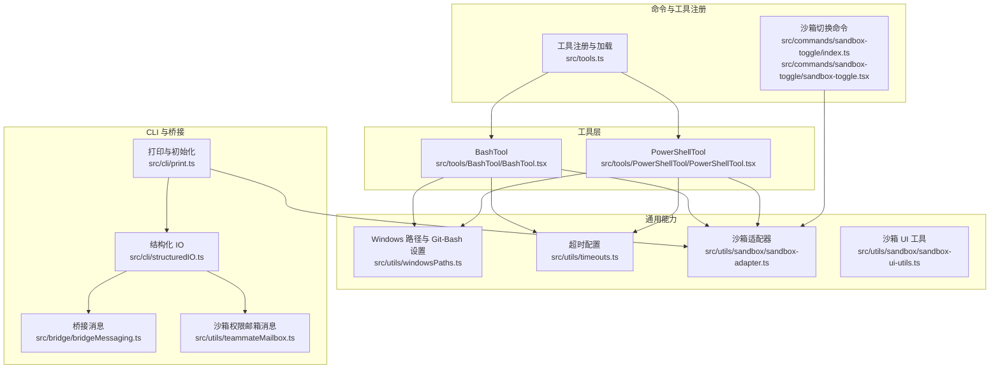
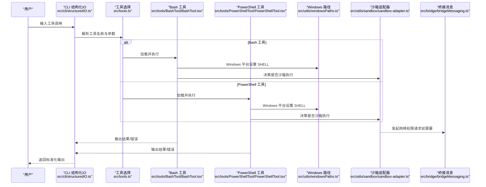
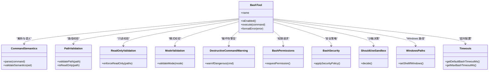
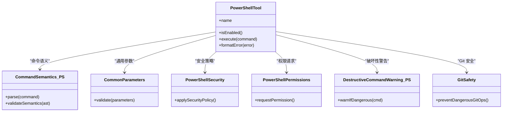
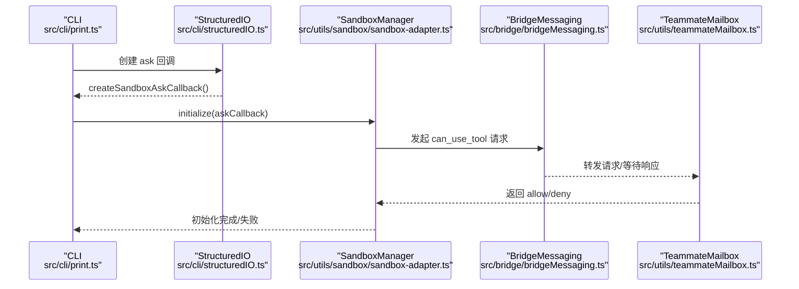
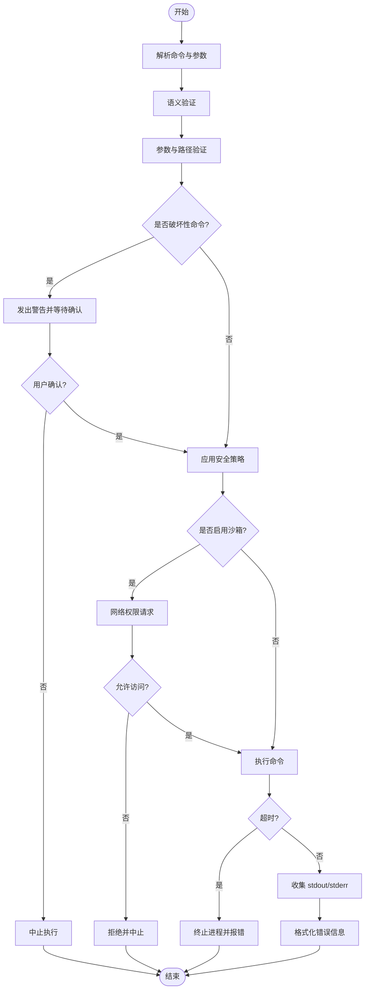
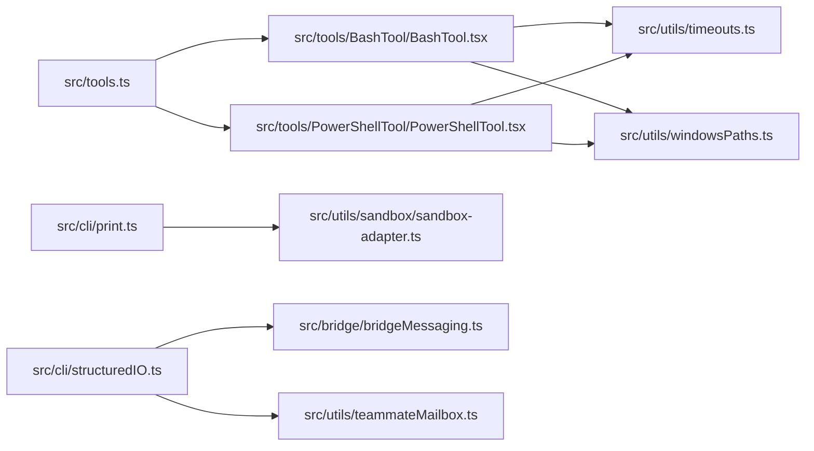

# 系统工具

<cite>
**本文引用的文件**
- [src/tools/BashTool/BashTool.tsx](file://src/tools/BashTool/BashTool.tsx)
- [src/tools/BashTool/bashCommandHelpers.ts](file://src/tools/BashTool/bashCommandHelpers.ts)
- [src/tools/BashTool/bashPermissions.ts](file://src/tools/BashTool/bashPermissions.ts)
- [src/tools/BashTool/bashSecurity.ts](file://src/tools/BashTool/bashSecurity.ts)
- [src/tools/BashTool/commandSemantics.ts](file://src/tools/BashTool/commandSemantics.ts)
- [src/tools/BashTool/destructiveCommandWarning.ts](file://src/tools/BashTool/destructiveCommandWarning.ts)
- [src/tools/BashTool/modeValidation.ts](file://src/tools/BashTool/modeValidation.ts)
- [src/tools/BashTool/pathValidation.ts](file://src/tools/BashTool/pathValidation.ts)
- [src/tools/BashTool/prompt.ts](file://src/tools/BashTool/prompt.ts)
- [src/tools/BashTool/readOnlyValidation.ts](file://src/tools/BashTool/readOnlyValidation.ts)
- [src/tools/BashTool/shouldUseSandbox.ts](file://src/tools/BashTool/shouldUseSandbox.ts)
- [src/tools/BashTool/toolName.ts](file://src/tools/BashTool/toolName.ts)
- [src/tools/PowerShellTool/PowerShellTool.tsx](file://src/tools/PowerShellTool/PowerShellTool.tsx)
- [src/tools/PowerShellTool/commandSemantics.ts](file://src/tools/PowerShellTool/commandSemantics.ts)
- [src/tools/PowerShellTool/commonParameters.ts](file://src/tools/PowerShellTool/commonParameters.ts)
- [src/tools/PowerShellTool/destructiveCommandWarning.ts](file://src/tools/PowerShellTool/destructiveCommandWarning.ts)
- [src/tools/PowerShellTool/gitSafety.ts](file://src/tools/PowerShellTool/gitSafety.ts)
- [src/tools/PowerShellTool/modeValidation.ts](file://src/tools/PowerShellTool/modeValidation.ts)
- [src/tools/PowerShellTool/pathValidation.ts](file://src/tools/PowerShellTool/pathValidation.ts)
- [src/tools/PowerShellTool/powershellPermissions.ts](file://src/tools/PowerShellTool/powershellPermissions.ts)
- [src/tools/PowerShellTool/powershellSecurity.ts](file://src/tools/PowerShellTool/powershellSecurity.ts)
- [src/tools/PowerShellTool/prompt.ts](file://src/tools/PowerShellTool/prompt.ts)
- [src/tools/PowerShellTool/readOnlyValidation.ts](file://src/tools/PowerShellTool/readOnlyValidation.ts)
- [src/tools/PowerShellTool/toolName.ts](file://src/tools/PowerShellTool/toolName.ts)
- [src/utils/timeouts.ts](file://src/utils/timeouts.ts)
- [src/utils/windowsPaths.ts](file://src/utils/windowsPaths.ts)
- [src/utils/sandbox/sandbox-adapter.ts](file://src/utils/sandbox/sandbox-adapter.ts)
- [src/utils/sandbox/sandbox-ui-utils.ts](file://src/utils/sandbox/sandbox-ui-utils.ts)
- [src/cli/structuredIO.ts](file://src/cli/structuredIO.ts)
- [src/cli/print.ts](file://src/cli/print.ts)
- [src/commands/sandbox-toggle/index.ts](file://src/commands/sandbox-toggle/index.ts)
- [src/commands/sandbox-toggle/sandbox-toggle.tsx](file://src/commands/sandbox-toggle/sandbox-toggle.tsx)
- [src/bridge/bridgeMessaging.ts](file://src/bridge/bridgeMessaging.ts)
- [src/utils/teammateMailbox.ts](file://src/utils/teammateMailbox.ts)
- [src/utils/toolErrors.ts](file://src/utils/toolErrors.ts)
- [src/tools.ts](file://src/tools.ts)
</cite>

## 目录
1. [简介](#简介)
2. [项目结构](#项目结构)
3. [核心组件](#核心组件)
4. [架构总览](#架构总览)
5. [详细组件分析](#详细组件分析)
6. [依赖关系分析](#依赖关系分析)
7. [性能考量](#性能考量)
8. [故障排查指南](#故障排查指南)
9. [结论](#结论)
10. [附录](#附录)

## 简介
本文件系统化梳理并文档化两类系统工具：Bash 工具与 PowerShell 工具。内容覆盖功能特性、使用场景、配置选项、命令执行机制、权限控制、安全防护、资源限制、跨平台适配（含 Windows Git-Bash）、破坏性命令警告、以及与沙箱隔离和网络权限请求协议的集成方式。文档同时提供流程图与类图帮助理解实现细节，并给出常见问题排查建议。

## 项目结构
- Bash 工具位于 src/tools/BashTool 下，包含命令解析、模式校验、路径与只读校验、破坏性命令警告、权限与安全策略、沙箱决策等模块化文件。
- PowerShell 工具位于 src/tools/PowerShellTool 下，提供与 Bash 工具类似的职责划分，但面向 Windows PowerShell 环境。
- 跨平台与运行时相关能力由 src/utils/windowsPaths.ts、src/utils/timeouts.ts、src/utils/sandbox/ 等模块提供。
- CLI 层通过 src/cli/structuredIO.ts 与 src/cli/print.ts 统一处理输入输出、错误格式化与沙箱初始化。
- 沙箱开关与策略由 src/commands/sandbox-toggle/* 提供交互式管理入口。
- 权限桥接与中断控制由 src/bridge/bridgeMessaging.ts 与 src/utils/teammateMailbox.ts 支持。

图表来源
- [src/tools/BashTool/BashTool.tsx](file://src/tools/BashTool/BashTool.tsx)
- [src/tools/PowerShellTool/PowerShellTool.tsx](file://src/tools/PowerShellTool/PowerShellTool.tsx)
- [src/utils/windowsPaths.ts](file://src/utils/windowsPaths.ts)
- [src/utils/timeouts.ts](file://src/utils/timeouts.ts)
- [src/utils/sandbox/sandbox-adapter.ts](file://src/utils/sandbox/sandbox-adapter.ts)
- [src/utils/sandbox/sandbox-ui-utils.ts](file://src/utils/sandbox/sandbox-ui-utils.ts)
- [src/cli/structuredIO.ts](file://src/cli/structuredIO.ts)
- [src/cli/print.ts](file://src/cli/print.ts)
- [src/bridge/bridgeMessaging.ts](file://src/bridge/bridgeMessaging.ts)
- [src/utils/teammateMailbox.ts](file://src/utils/teammateMailbox.ts)
- [src/tools.ts](file://src/tools.ts)
- [src/commands/sandbox-toggle/index.ts](file://src/commands/sandbox-toggle/index.ts)
- [src/commands/sandbox-toggle/sandbox-toggle.tsx](file://src/commands/sandbox-toggle/sandbox-toggle.tsx)

章节来源
- [src/tools/BashTool/BashTool.tsx](file://src/tools/BashTool/BashTool.tsx)
- [src/tools/PowerShellTool/PowerShellTool.tsx](file://src/tools/PowerShellTool/PowerShellTool.tsx)
- [src/utils/windowsPaths.ts](file://src/utils/windowsPaths.ts)
- [src/utils/timeouts.ts](file://src/utils/timeouts.ts)
- [src/utils/sandbox/sandbox-adapter.ts](file://src/utils/sandbox/sandbox-adapter.ts)
- [src/utils/sandbox/sandbox-ui-utils.ts](file://src/utils/sandbox/sandbox-ui-utils.ts)
- [src/cli/structuredIO.ts](file://src/cli/structuredIO.ts)
- [src/cli/print.ts](file://src/cli/print.ts)
- [src/bridge/bridgeMessaging.ts](file://src/bridge/bridgeMessaging.ts)
- [src/utils/teammateMailbox.ts](file://src/utils/teammateMailbox.ts)
- [src/tools.ts](file://src/tools.ts)
- [src/commands/sandbox-toggle/index.ts](file://src/commands/sandbox-toggle/index.ts)
- [src/commands/sandbox-toggle/sandbox-toggle.tsx](file://src/commands/sandbox-toggle/sandbox-toggle.tsx)

## 核心组件
- Bash 工具：负责解析 Bash 命令、执行、输出处理、错误格式化、破坏性命令警告、只读模式校验、路径合法性检查、权限与安全策略、沙箱决策与执行。
- PowerShell 工具：提供与 Bash 工具对等的能力，针对 Windows PowerShell 的命令语义、参数、安全策略与破坏性命令警告进行适配。
- 超时配置：统一管理 Bash 执行的默认与最大超时时间，支持环境变量覆盖。
- Windows 路径与 Git-Bash：在 Windows 上设置 SHELL 环境变量为 Git-Bash 路径，确保 Bash 工具与 Shell 抽象一致。
- 沙箱适配器：封装沙箱初始化、依赖检查、策略锁定、网络访问权限请求转发等。
- CLI 结构化 IO：统一处理用户输入、工具输出、控制消息、权限请求协议桥接。
- 桥接与邮箱消息：在多进程/多代理场景下传递沙箱权限请求与响应。

章节来源
- [src/tools/BashTool/BashTool.tsx](file://src/tools/BashTool/BashTool.tsx)
- [src/tools/PowerShellTool/PowerShellTool.tsx](file://src/tools/PowerShellTool/PowerShellTool.tsx)
- [src/utils/timeouts.ts](file://src/utils/timeouts.ts)
- [src/utils/windowsPaths.ts](file://src/utils/windowsPaths.ts)
- [src/utils/sandbox/sandbox-adapter.ts](file://src/utils/sandbox/sandbox-adapter.ts)
- [src/cli/structuredIO.ts](file://src/cli/structuredIO.ts)
- [src/bridge/bridgeMessaging.ts](file://src/bridge/bridgeMessaging.ts)
- [src/utils/teammateMailbox.ts](file://src/utils/teammateMailbox.ts)

## 架构总览
系统工具通过 CLI 进入，经由结构化 IO 解析用户意图与工具调用；根据工具类型选择 Bash 或 PowerShell 执行路径；在 Windows 平台自动注入 Git-Bash 环境；结合沙箱策略决定是否启用隔离与网络权限请求；最终将结果与错误以统一格式返回。

图表来源
- [src/cli/structuredIO.ts](file://src/cli/structuredIO.ts)
- [src/tools.ts](file://src/tools.ts)
- [src/tools/BashTool/BashTool.tsx](file://src/tools/BashTool/BashTool.tsx)
- [src/tools/PowerShellTool/PowerShellTool.tsx](file://src/tools/PowerShellTool/PowerShellTool.tsx)
- [src/utils/windowsPaths.ts](file://src/utils/windowsPaths.ts)
- [src/utils/sandbox/sandbox-adapter.ts](file://src/utils/sandbox/sandbox-adapter.ts)
- [src/bridge/bridgeMessaging.ts](file://src/bridge/bridgeMessaging.ts)

## 详细组件分析

### Bash 工具
- 功能特性
  - 命令解析与语义：基于 commandSemantics.ts 定义 Bash 命令的解析规则与语义约束。
  - 参数与路径校验：pathValidation.ts 与 readOnlyValidation.ts 对路径与只读模式进行严格校验。
  - 模式与安全：modeValidation.ts 与 bashSecurity.ts 控制执行模式与安全策略。
  - 破坏性命令警告：destructiveCommandWarning.ts 在潜在危险命令前发出警告。
  - 权限与提示：bashPermissions.ts 与 prompt.ts 提供权限提示与交互。
  - 沙箱决策：shouldUseSandbox.ts 基于策略与上下文决定是否启用沙箱。
  - 工具标识：toolName.ts 统一工具名。
- 执行机制
  - 通过 BashTool.tsx 聚合上述模块，完成命令拼装、执行、输出与错误处理。
  - Windows 平台通过 windowsPaths.ts 注入 Git-Bash 路径，保证 SHELL 环境一致性。
  - 超时控制由 timeouts.ts 提供，默认与最大超时可由环境变量覆盖。
- 安全与权限
  - 沙箱隔离：沙箱适配器负责初始化与策略执行；网络访问通过桥接消息与 CLI 协议转发到宿主确认。
  - 破坏性命令警告：在执行前弹出确认，避免误操作造成损失。
  - 只读模式：对写入操作进行拦截或降级处理。
- 错误处理
  - 使用工具错误格式化模块，将退出码、标准错误与标准输出组合为统一错误信息，必要时截断过长输出。

图表来源
- [src/tools/BashTool/BashTool.tsx](file://src/tools/BashTool/BashTool.tsx)
- [src/tools/BashTool/commandSemantics.ts](file://src/tools/BashTool/commandSemantics.ts)
- [src/tools/BashTool/pathValidation.ts](file://src/tools/BashTool/pathValidation.ts)
- [src/tools/BashTool/readOnlyValidation.ts](file://src/tools/BashTool/readOnlyValidation.ts)
- [src/tools/BashTool/modeValidation.ts](file://src/tools/BashTool/modeValidation.ts)
- [src/tools/BashTool/destructiveCommandWarning.ts](file://src/tools/BashTool/destructiveCommandWarning.ts)
- [src/tools/BashTool/bashPermissions.ts](file://src/tools/BashTool/bashPermissions.ts)
- [src/tools/BashTool/bashSecurity.ts](file://src/tools/BashTool/bashSecurity.ts)
- [src/tools/BashTool/shouldUseSandbox.ts](file://src/tools/BashTool/shouldUseSandbox.ts)
- [src/utils/windowsPaths.ts](file://src/utils/windowsPaths.ts)
- [src/utils/timeouts.ts](file://src/utils/timeouts.ts)

章节来源
- [src/tools/BashTool/BashTool.tsx](file://src/tools/BashTool/BashTool.tsx)
- [src/tools/BashTool/commandSemantics.ts](file://src/tools/BashTool/commandSemantics.ts)
- [src/tools/BashTool/pathValidation.ts](file://src/tools/BashTool/pathValidation.ts)
- [src/tools/BashTool/readOnlyValidation.ts](file://src/tools/BashTool/readOnlyValidation.ts)
- [src/tools/BashTool/modeValidation.ts](file://src/tools/BashTool/modeValidation.ts)
- [src/tools/BashTool/destructiveCommandWarning.ts](file://src/tools/BashTool/destructiveCommandWarning.ts)
- [src/tools/BashTool/bashPermissions.ts](file://src/tools/BashTool/bashPermissions.ts)
- [src/tools/BashTool/bashSecurity.ts](file://src/tools/BashTool/bashSecurity.ts)
- [src/tools/BashTool/shouldUseSandbox.ts](file://src/tools/BashTool/shouldUseSandbox.ts)
- [src/utils/windowsPaths.ts](file://src/utils/windowsPaths.ts)
- [src/utils/timeouts.ts](file://src/utils/timeouts.ts)
- [src/utils/toolErrors.ts](file://src/utils/toolErrors.ts)

### PowerShell 工具
- 功能特性
  - 命令语义与参数：commandSemantics.ts、commonParameters.ts 针对 PowerShell 的语义与通用参数进行约束。
  - 路径与只读：pathValidation.ts、readOnlyValidation.ts 同样适用于 PowerShell 场景。
  - 安全与权限：powershellSecurity.ts、powershellPermissions.ts 实施安全策略与权限请求。
  - 破坏性命令警告：destructiveCommandWarning.ts 在危险命令前进行警告。
  - Git 安全：gitSafety.ts 防止与 Git 相关的危险操作。
  - 工具标识：toolName.ts 统一工具名。
- 执行机制
  - 通过 PowerShellTool.tsx 聚合模块，完成命令拼装、执行、输出与错误处理。
  - Windows 平台同样通过 windowsPaths.ts 注入 Git-Bash 路径，保证 SHELL 环境一致性。
  - 超时控制由 timeouts.ts 提供。
- 安全与权限
  - 沙箱隔离与网络权限请求同 Bash 工具一致，通过桥接消息与 CLI 协议转发到宿主确认。
  - 破坏性命令警告与只读模式同样适用。

图表来源
- [src/tools/PowerShellTool/PowerShellTool.tsx](file://src/tools/PowerShellTool/PowerShellTool.tsx)
- [src/tools/PowerShellTool/commandSemantics.ts](file://src/tools/PowerShellTool/commandSemantics.ts)
- [src/tools/PowerShellTool/commonParameters.ts](file://src/tools/PowerShellTool/commonParameters.ts)
- [src/tools/PowerShellTool/powershellSecurity.ts](file://src/tools/PowerShellTool/powershellSecurity.ts)
- [src/tools/PowerShellTool/powershellPermissions.ts](file://src/tools/PowerShellTool/powershellPermissions.ts)
- [src/tools/PowerShellTool/destructiveCommandWarning.ts](file://src/tools/PowerShellTool/destructiveCommandWarning.ts)
- [src/tools/PowerShellTool/gitSafety.ts](file://src/tools/PowerShellTool/gitSafety.ts)

章节来源
- [src/tools/PowerShellTool/PowerShellTool.tsx](file://src/tools/PowerShellTool/PowerShellTool.tsx)
- [src/tools/PowerShellTool/commandSemantics.ts](file://src/tools/PowerShellTool/commandSemantics.ts)
- [src/tools/PowerShellTool/commonParameters.ts](file://src/tools/PowerShellTool/commonParameters.ts)
- [src/tools/PowerShellTool/powershellSecurity.ts](file://src/tools/PowerShellTool/powershellSecurity.ts)
- [src/tools/PowerShellTool/powershellPermissions.ts](file://src/tools/PowerShellTool/powershellPermissions.ts)
- [src/tools/PowerShellTool/destructiveCommandWarning.ts](file://src/tools/PowerShellTool/destructiveCommandWarning.ts)
- [src/tools/PowerShellTool/gitSafety.ts](file://src/tools/PowerShellTool/gitSafety.ts)
- [src/utils/windowsPaths.ts](file://src/utils/windowsPaths.ts)
- [src/utils/timeouts.ts](file://src/utils/timeouts.ts)
- [src/utils/toolErrors.ts](file://src/utils/toolErrors.ts)

### 沙箱与权限控制
- 沙箱初始化与依赖检查：在 CLI 初始化阶段，若沙箱可用则通过 createSandboxAskCallback 将网络权限请求转发至宿主 via can_use_tool 控制请求协议。
- 策略锁定与平台限制：沙箱设置可能被更高优先级策略锁定，且仅在允许的平台上启用。
- 沙箱切换命令：提供交互式菜单与子命令（如排除模式）用于管理沙箱策略。
- 多代理场景：通过沙箱权限请求/响应消息在工作进程与领导进程之间传递，确保网络访问得到授权。

图表来源
- [src/cli/print.ts](file://src/cli/print.ts)
- [src/cli/structuredIO.ts](file://src/cli/structuredIO.ts)
- [src/utils/sandbox/sandbox-adapter.ts](file://src/utils/sandbox/sandbox-adapter.ts)
- [src/bridge/bridgeMessaging.ts](file://src/bridge/bridgeMessaging.ts)
- [src/utils/teammateMailbox.ts](file://src/utils/teammateMailbox.ts)

章节来源
- [src/cli/print.ts](file://src/cli/print.ts)
- [src/cli/structuredIO.ts](file://src/cli/structuredIO.ts)
- [src/utils/sandbox/sandbox-adapter.ts](file://src/utils/sandbox/sandbox-adapter.ts)
- [src/bridge/bridgeMessaging.ts](file://src/bridge/bridgeMessaging.ts)
- [src/utils/teammateMailbox.ts](file://src/utils/teammateMailbox.ts)
- [src/commands/sandbox-toggle/index.ts](file://src/commands/sandbox-toggle/index.ts)
- [src/commands/sandbox-toggle/sandbox-toggle.tsx](file://src/commands/sandbox-toggle/sandbox-toggle.tsx)

### 命令解析、参数验证、输出与错误处理
- 命令解析：Bash 与 PowerShell 工具均通过各自 commandSemantics.ts 定义解析与验证逻辑。
- 参数验证：commonParameters.ts（PowerShell）与 path/readOnly 验证模块（两者均有）确保参数与路径合法。
- 输出处理：CLI 通过结构化 IO 输出标准化消息，支持流式输出与控制消息。
- 错误处理：工具错误格式化模块将退出码、标准错误与标准输出合并为统一错误字符串，必要时截断过长输出。

图表来源
- [src/tools/BashTool/commandSemantics.ts](file://src/tools/BashTool/commandSemantics.ts)
- [src/tools/PowerShellTool/commandSemantics.ts](file://src/tools/PowerShellTool/commandSemantics.ts)
- [src/tools/BashTool/pathValidation.ts](file://src/tools/BashTool/pathValidation.ts)
- [src/tools/PowerShellTool/pathValidation.ts](file://src/tools/PowerShellTool/pathValidation.ts)
- [src/tools/BashTool/readOnlyValidation.ts](file://src/tools/BashTool/readOnlyValidation.ts)
- [src/tools/PowerShellTool/readOnlyValidation.ts](file://src/tools/PowerShellTool/readOnlyValidation.ts)
- [src/tools/BashTool/destructiveCommandWarning.ts](file://src/tools/BashTool/destructiveCommandWarning.ts)
- [src/tools/PowerShellTool/destructiveCommandWarning.ts](file://src/tools/PowerShellTool/destructiveCommandWarning.ts)
- [src/utils/toolErrors.ts](file://src/utils/toolErrors.ts)

章节来源
- [src/tools/BashTool/commandSemantics.ts](file://src/tools/BashTool/commandSemantics.ts)
- [src/tools/PowerShellTool/commandSemantics.ts](file://src/tools/PowerShellTool/commandSemantics.ts)
- [src/tools/BashTool/pathValidation.ts](file://src/tools/BashTool/pathValidation.ts)
- [src/tools/PowerShellTool/pathValidation.ts](file://src/tools/PowerShellTool/pathValidation.ts)
- [src/tools/BashTool/readOnlyValidation.ts](file://src/tools/BashTool/readOnlyValidation.ts)
- [src/tools/PowerShellTool/readOnlyValidation.ts](file://src/tools/PowerShellTool/readOnlyValidation.ts)
- [src/tools/BashTool/destructiveCommandWarning.ts](file://src/tools/BashTool/destructiveCommandWarning.ts)
- [src/tools/PowerShellTool/destructiveCommandWarning.ts](file://src/tools/PowerShellTool/destructiveCommandWarning.ts)
- [src/utils/toolErrors.ts](file://src/utils/toolErrors.ts)

## 依赖关系分析
- 工具注册与加载：工具列表通过动态 require 方式按需加载，PowerShell 工具受 isPowerShellToolEnabled() 控制。
- 超时配置：Bash 工具与 PowerShell 工具共享超时常量与环境变量解析逻辑。
- Windows 兼容：Windows 路径模块在 Windows 平台设置 SHELL 为 Git-Bash，确保跨平台一致性。
- 沙箱策略：沙箱适配器集中管理策略、依赖检查与初始化回调；CLI 在启动时尝试初始化沙箱。

图表来源
- [src/tools.ts](file://src/tools.ts)
- [src/tools/BashTool/BashTool.tsx](file://src/tools/BashTool/BashTool.tsx)
- [src/tools/PowerShellTool/PowerShellTool.tsx](file://src/tools/PowerShellTool/PowerShellTool.tsx)
- [src/utils/timeouts.ts](file://src/utils/timeouts.ts)
- [src/utils/windowsPaths.ts](file://src/utils/windowsPaths.ts)
- [src/cli/print.ts](file://src/cli/print.ts)
- [src/utils/sandbox/sandbox-adapter.ts](file://src/utils/sandbox/sandbox-adapter.ts)
- [src/cli/structuredIO.ts](file://src/cli/structuredIO.ts)
- [src/bridge/bridgeMessaging.ts](file://src/bridge/bridgeMessaging.ts)
- [src/utils/teammateMailbox.ts](file://src/utils/teammateMailbox.ts)

章节来源
- [src/tools.ts](file://src/tools.ts)
- [src/utils/timeouts.ts](file://src/utils/timeouts.ts)
- [src/utils/windowsPaths.ts](file://src/utils/windowsPaths.ts)
- [src/cli/print.ts](file://src/cli/print.ts)
- [src/utils/sandbox/sandbox-adapter.ts](file://src/utils/sandbox/sandbox-adapter.ts)
- [src/cli/structuredIO.ts](file://src/cli/structuredIO.ts)
- [src/bridge/bridgeMessaging.ts](file://src/bridge/bridgeMessaging.ts)
- [src/utils/teammateMailbox.ts](file://src/utils/teammateMailbox.ts)

## 性能考量
- 超时控制：默认与最大超时可通过环境变量覆盖，避免长时间阻塞；建议在 CI 或受限环境中显式设置更严格的超时值。
- 输出截断：当错误输出过长时自动截断中间部分，减少传输与渲染开销。
- 沙箱初始化：仅在沙箱可用时进行初始化，避免不必要的开销；若沙箱不可用，CLI 会明确提示并继续执行（无隔离）。

章节来源
- [src/utils/timeouts.ts](file://src/utils/timeouts.ts)
- [src/utils/toolErrors.ts](file://src/utils/toolErrors.ts)
- [src/cli/print.ts](file://src/cli/print.ts)

## 故障排查指南
- 沙箱不可用
  - 现象：沙箱不可用原因被打印，且在 fail-if-unavailable 模式下直接退出。
  - 排查：检查沙箱依赖、平台支持与策略锁定状态；必要时通过沙箱切换命令调整策略。
- 网络权限被拒
  - 现象：沙箱运行时检测到未授权网络访问，触发权限请求；若宿主拒绝则中止连接。
  - 排查：确认 can_use_tool 协议是否正常工作；检查桥接消息与邮箱消息链路。
- 命令执行失败
  - 现象：工具错误格式化模块输出包含退出码、标准错误与标准输出。
  - 排查：查看命令语义与参数验证日志；确认路径与只读模式；检查破坏性命令警告是否被忽略。
- Windows 平台异常
  - 现象：SHELL 环境未正确指向 Git-Bash 导致命令行为异常。
  - 排查：确认 CLAUDE_CODE_GIT_BASH_PATH 是否存在；检查 Git 安装路径与查找逻辑。

章节来源
- [src/cli/print.ts](file://src/cli/print.ts)
- [src/utils/sandbox/sandbox-adapter.ts](file://src/utils/sandbox/sandbox-adapter.ts)
- [src/bridge/bridgeMessaging.ts](file://src/bridge/bridgeMessaging.ts)
- [src/utils/teammateMailbox.ts](file://src/utils/teammateMailbox.ts)
- [src/utils/toolErrors.ts](file://src/utils/toolErrors.ts)
- [src/utils/windowsPaths.ts](file://src/utils/windowsPaths.ts)

## 结论
该系统工具体系在 Bash 与 PowerShell 两大平台上提供了统一的命令解析、参数验证、安全策略、权限控制与沙箱隔离能力。通过 CLI 结构化 IO 与桥接协议，实现了跨进程/多代理场景下的网络权限请求与响应；借助超时控制与输出截断，兼顾了稳定性与可观测性。建议在生产环境中启用沙箱并合理配置超时与权限策略，以获得最佳的安全与性能平衡。

## 附录
- 使用示例与代码演示
  - Bash 工具：参考 [BashTool.tsx](file://src/tools/BashTool/BashTool.tsx) 中的 execute 流程与 [prompt.ts](file://src/tools/BashTool/prompt.ts) 的交互提示。
  - PowerShell 工具：参考 [PowerShellTool.tsx](file://src/tools/PowerShellTool/PowerShellTool.tsx) 中的 execute 流程与 [destructiveCommandWarning.ts](file://src/tools/PowerShellTool/destructiveCommandWarning.ts) 的警告逻辑。
  - 超时配置：参考 [timeouts.ts](file://src/utils/timeouts.ts) 的环境变量解析与默认值。
  - Windows 路径：参考 [windowsPaths.ts](file://src/utils/windowsPaths.ts) 的 Git-Bash 路径查找与 SHELL 设置。
  - 沙箱初始化：参考 [print.ts](file://src/cli/print.ts) 的初始化回调与 [sandbox-adapter.ts](file://src/utils/sandbox/sandbox-adapter.ts) 的策略管理。
  - 权限请求：参考 [structuredIO.ts](file://src/cli/structuredIO.ts) 的 createSandboxAskCallback 与 [bridgeMessaging.ts](file://src/bridge/bridgeMessaging.ts) 的 set_permission_mode 控制请求。
  - 沙箱切换命令：参考 [index.ts](file://src/commands/sandbox-toggle/index.ts) 与 [sandbox-toggle.tsx](file://src/commands/sandbox-toggle/sandbox-toggle.tsx) 的交互界面与子命令。