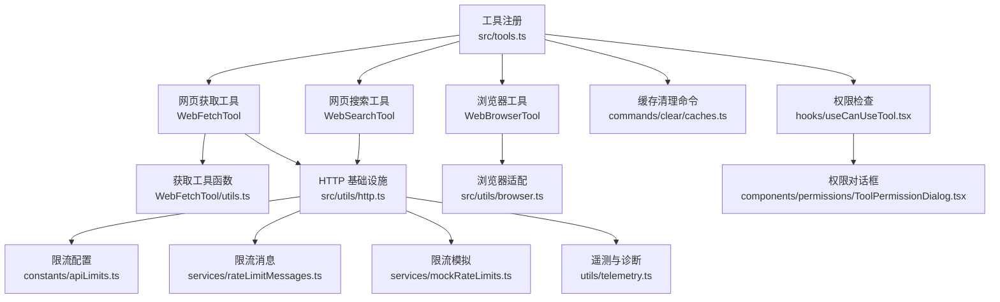
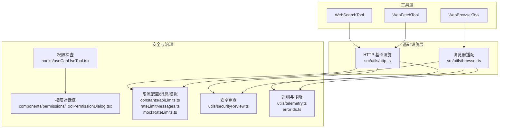
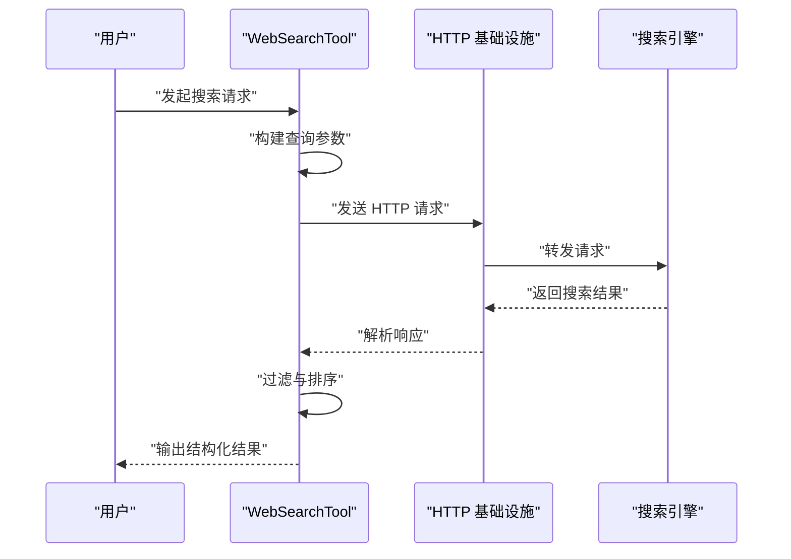
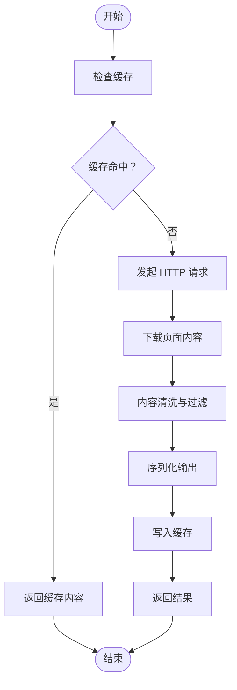
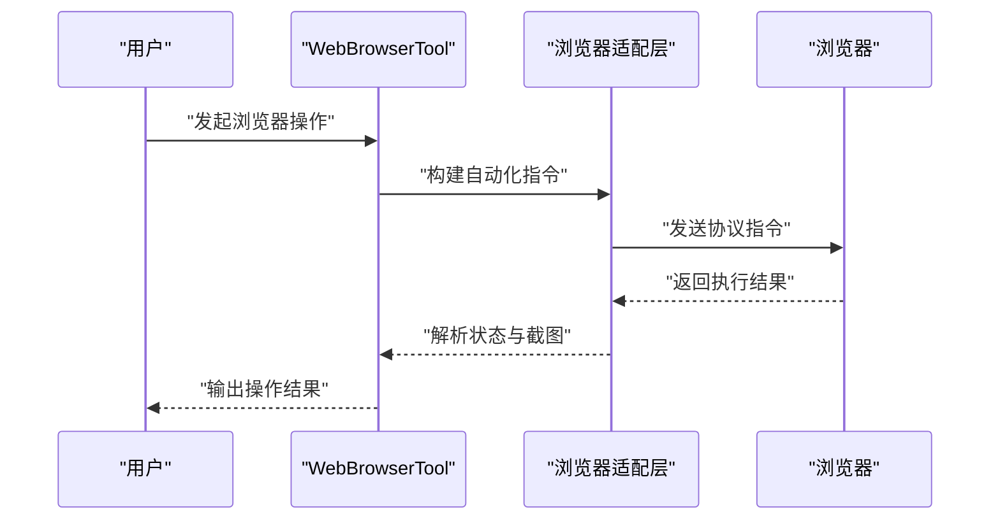
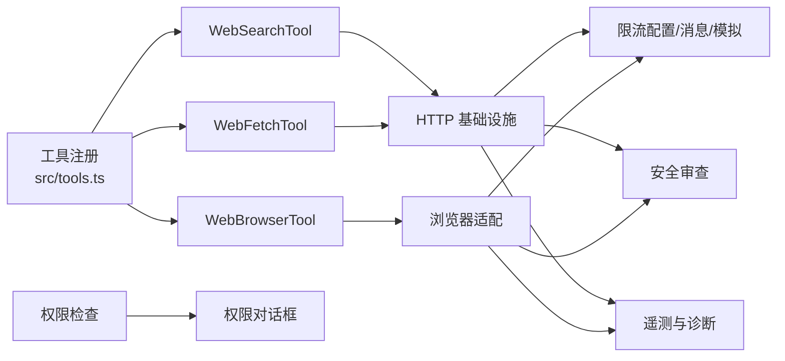

# 网络工具

<cite>
**本文档引用的文件**
- [src/tools.ts](file://src/tools.ts)
- [src/tools/WebSearchTool/WebSearchTool.ts](file://src/tools/WebSearchTool/WebSearchTool.ts)
- [src/tools/WebFetchTool/WebFetchTool.ts](file://src/tools/WebFetchTool/WebFetchTool.ts)
- [src/tools/WebFetchTool/utils.ts](file://src/tools/WebFetchTool/utils.ts)
- [src/tools/WebBrowserTool/WebBrowserTool.ts](file://src/tools/WebBrowserTool/WebBrowserTool.ts)
- [src/commands/clear/caches.ts](file://src/commands/clear/caches.ts)
- [src/utils/browser.ts](file://src/utils/browser.ts)
- [src/utils/http.ts](file://src/utils/http.ts)
- [src/constants/apiLimits.ts](file://src/constants/apiLimits.ts)
- [src/services/rateLimitMessages.ts](file://src/services/rateLimitMessages.ts)
- [src/services/mockRateLimits.ts](file://src/services/mockRateLimits.ts)
- [src/hooks/useCanUseTool.tsx](file://src/hooks/useCanUseTool.tsx)
- [src/components/permissions/ToolPermissionDialog.tsx](file://src/components/permissions/ToolPermissionDialog.tsx)
- [src/utils/telemetry.ts](file://src/utils/telemetry.ts)
- [src/utils/securityReview.ts](file://src/utils/securityReview.ts)
- [src/constants/errorIds.ts](file://src/constants/errorIds.ts)
</cite>

## 目录
1. [简介](#简介)
2. [项目结构](#项目结构)
3. [核心组件](#核心组件)
4. [架构概览](#架构概览)
5. [详细组件分析](#详细组件分析)
6. [依赖关系分析](#依赖关系分析)
7. [性能考量](#性能考量)
8. [故障排除指南](#故障排除指南)
9. [结论](#结论)

## 简介
本文件系统性梳理了代码库中的网络工具体系，重点覆盖网页搜索工具（WebSearchTool）、网页获取工具（WebFetchTool）与浏览器工具（WebBrowserTool）。文档从功能特性、实现原理、数据流与控制流、安全与合规等方面进行深入解析，并提供可操作的使用示例与最佳实践，帮助开发者在信息检索与内容获取场景中高效、安全地使用这些工具。

## 项目结构
网络工具主要分布在以下位置：
- 工具注册入口：src/tools.ts
- 搜索类工具：src/tools/WebSearchTool/WebSearchTool.ts
- 获取类工具：src/tools/WebFetchTool/WebFetchTool.ts 及其工具函数 src/tools/WebFetchTool/utils.ts
- 浏览器类工具：src/tools/WebBrowserTool/WebBrowserTool.ts
- 辅助能力：浏览器适配 src/utils/browser.ts、HTTP 基础设施 src/utils/http.ts
- 缓存与清理：命令 src/commands/clear/caches.ts
- 限流与配额：src/constants/apiLimits.ts、src/services/rateLimitMessages.ts、src/services/mockRateLimits.ts
- 权限与安全：src/hooks/useCanUseTool.tsx、src/components/permissions/ToolPermissionDialog.tsx、src/utils/securityReview.ts
- 遥测与诊断：src/utils/telemetry.ts、src/constants/errorIds.ts

图表来源
- [src/tools.ts:193-220](file://src/tools.ts#L193-L220)
- [src/tools/WebSearchTool/WebSearchTool.ts](file://src/tools/WebSearchTool/WebSearchTool.ts)
- [src/tools/WebFetchTool/WebFetchTool.ts](file://src/tools/WebFetchTool/WebFetchTool.ts)
- [src/tools/WebFetchTool/utils.ts](file://src/tools/WebFetchTool/utils.ts)
- [src/tools/WebBrowserTool/WebBrowserTool.ts](file://src/tools/WebBrowserTool/WebBrowserTool.ts)
- [src/utils/http.ts](file://src/utils/http.ts)
- [src/utils/browser.ts](file://src/utils/browser.ts)
- [src/commands/clear/caches.ts:126-144](file://src/commands/clear/caches.ts#L126-L144)
- [src/constants/apiLimits.ts](file://src/constants/apiLimits.ts)
- [src/services/rateLimitMessages.ts](file://src/services/rateLimitMessages.ts)
- [src/services/mockRateLimits.ts](file://src/services/mockRateLimits.ts)
- [src/hooks/useCanUseTool.tsx](file://src/hooks/useCanUseTool.tsx)
- [src/components/permissions/ToolPermissionDialog.tsx](file://src/components/permissions/ToolPermissionDialog.tsx)
- [src/utils/telemetry.ts](file://src/utils/telemetry.ts)

章节来源
- [src/tools.ts:193-220](file://src/tools.ts#L193-L220)

## 核心组件
- 网页搜索工具（WebSearchTool）
  - 职责：封装搜索引擎调用，负责请求构建、参数校验、响应解析与错误处理。
  - 关键点：支持多引擎适配、结果过滤、去重与排序；具备基础的速率限制与重试策略。
- 网页获取工具（WebFetchTool）
  - 职责：抓取网页内容，执行内容过滤与清洗，维护本地缓存以提升性能。
  - 关键点：基于 HTTP 基础设施；支持缓存命中与失效；提供缓存清理命令。
- 浏览器工具（WebBrowserTool）
  - 职责：通过浏览器自动化或协议交互完成复杂页面任务（如表单填写、点击、截图等）。
  - 关键点：依赖浏览器适配层；支持权限控制与安全审查；可与搜索/获取工具组合使用。

章节来源
- [src/tools/WebSearchTool/WebSearchTool.ts](file://src/tools/WebSearchTool/WebSearchTool.ts)
- [src/tools/WebFetchTool/WebFetchTool.ts](file://src/tools/WebFetchTool/WebFetchTool.ts)
- [src/tools/WebFetchTool/utils.ts](file://src/tools/WebFetchTool/utils.ts)
- [src/tools/WebBrowserTool/WebBrowserTool.ts](file://src/tools/WebBrowserTool/WebBrowserTool.ts)

## 架构概览
网络工具整体采用“工具注册 + 具体实现 + 基础设施 + 安全与限流”的分层设计。工具通过统一入口注册，具体实现复用 HTTP 与浏览器基础设施，同时结合权限、限流与遥测保障运行质量与合规性。

图表来源
- [src/tools/WebSearchTool/WebSearchTool.ts](file://src/tools/WebSearchTool/WebSearchTool.ts)
- [src/tools/WebFetchTool/WebFetchTool.ts](file://src/tools/WebFetchTool/WebFetchTool.ts)
- [src/tools/WebBrowserTool/WebBrowserTool.ts](file://src/tools/WebBrowserTool/WebBrowserTool.ts)
- [src/utils/http.ts](file://src/utils/http.ts)
- [src/utils/browser.ts](file://src/utils/browser.ts)
- [src/hooks/useCanUseTool.tsx](file://src/hooks/useCanUseTool.tsx)
- [src/components/permissions/ToolPermissionDialog.tsx](file://src/components/permissions/ToolPermissionDialog.tsx)
- [src/constants/apiLimits.ts](file://src/constants/apiLimits.ts)
- [src/services/rateLimitMessages.ts](file://src/services/rateLimitMessages.ts)
- [src/services/mockRateLimits.ts](file://src/services/mockRateLimits.ts)
- [src/utils/securityReview.ts](file://src/utils/securityReview.ts)
- [src/utils/telemetry.ts](file://src/utils/telemetry.ts)
- [src/constants/errorIds.ts](file://src/constants/errorIds.ts)

## 详细组件分析

### 网页搜索工具（WebSearchTool）
- 功能特性
  - 多引擎适配：支持不同搜索引擎的请求参数映射与响应解析。
  - 结果过滤：对重复项进行去重，按相关性排序，支持关键词过滤。
  - 错误处理：针对网络异常、超时、无结果等情况提供统一错误码与提示。
  - 速率限制：内置请求频率控制，避免触发目标站点的反爬策略。
- 请求构建与响应处理
  - 请求构建：标准化查询参数（如 q、start、count），设置合理的 User-Agent 与 Accept。
  - 响应处理：解析 JSON/XML 结果，提取标题、链接、摘要字段，进行二次清洗。
- 使用示例
  - 基本搜索：传入查询词，返回结构化结果列表。
  - 扩展参数：指定语言、时间范围、结果数量上限等。
- 代码路径参考
  - [WebSearchTool 实现](file://src/tools/WebSearchTool/WebSearchTool.ts)

图表来源
- [src/tools/WebSearchTool/WebSearchTool.ts](file://src/tools/WebSearchTool/WebSearchTool.ts)
- [src/utils/http.ts](file://src/utils/http.ts)

章节来源
- [src/tools/WebSearchTool/WebSearchTool.ts](file://src/tools/WebSearchTool/WebSearchTool.ts)

### 网页获取工具（WebFetchTool）
- 功能特性
  - 内容抓取：下载网页 HTML，执行内容清洗与结构化抽取。
  - 缓存策略：基于 URL 的内容缓存，支持缓存大小上限与清理命令。
  - 过滤与清洗：移除脚本、样式、广告等无关内容，保留正文与元数据。
  - 错误重试：对网络错误与超时进行有限次数重试。
- 数据流与控制流
  - 输入：URL 列表或单个 URL。
  - 处理：请求 -> 缓存检查 -> 下载 -> 清洗 -> 序列化 -> 输出。
  - 输出：结构化的文本内容、标题、摘要、链接等。
- 使用示例
  - 单页抓取：输入单一 URL，返回清洗后的内容。
  - 批量抓取：输入 URL 数组，批量处理并合并结果。
- 代码路径参考
  - [WebFetchTool 实现](file://src/tools/WebFetchTool/WebFetchTool.ts)
  - [WebFetchTool 工具函数](file://src/tools/WebFetchTool/utils.ts)

图表来源
- [src/tools/WebFetchTool/WebFetchTool.ts](file://src/tools/WebFetchTool/WebFetchTool.ts)
- [src/tools/WebFetchTool/utils.ts](file://src/tools/WebFetchTool/utils.ts)

章节来源
- [src/tools/WebFetchTool/WebFetchTool.ts](file://src/tools/WebFetchTool/WebFetchTool.ts)
- [src/tools/WebFetchTool/utils.ts](file://src/tools/WebFetchTool/utils.ts)

### 浏览器工具（WebBrowserTool）
- 功能特性
  - 自动化交互：支持页面导航、元素定位、点击、输入、截图等。
  - 协议适配：兼容多种浏览器协议（如 Chrome DevTools Protocol）。
  - 权限控制：通过权限钩子与对话框确保用户授权与最小权限原则。
  - 安全审查：对高风险操作进行安全评估与告警。
- 使用示例
  - 表单填写：自动填充用户名、密码并提交。
  - 截图与录屏：对关键页面进行截图或录制。
  - 点击与等待：点击按钮后等待新页面加载完成。
- 代码路径参考
  - [WebBrowserTool 实现](file://src/tools/WebBrowserTool/WebBrowserTool.ts)
  - [浏览器适配](file://src/utils/browser.ts)

图表来源
- [src/tools/WebBrowserTool/WebBrowserTool.ts](file://src/tools/WebBrowserTool/WebBrowserTool.ts)
- [src/utils/browser.ts](file://src/utils/browser.ts)

章节来源
- [src/tools/WebBrowserTool/WebBrowserTool.ts](file://src/tools/WebBrowserTool/WebBrowserTool.ts)
- [src/utils/browser.ts](file://src/utils/browser.ts)

## 依赖关系分析
- 工具注册与发现
  - 工具清单由统一入口维护，按环境变量与特性开关动态启用/禁用。
- 基础设施依赖
  - WebSearchTool 与 WebFetchTool 依赖 HTTP 基础设施进行网络请求。
  - WebBrowserTool 依赖浏览器适配层进行协议通信。
- 安全与治理
  - 权限检查与对话框确保工具使用前的授权流程。
  - 限流配置与消息模块防止过度请求，mock 限流用于测试场景。
  - 安全审查与遥测为异常行为提供审计线索。

图表来源
- [src/tools.ts:193-220](file://src/tools.ts#L193-L220)
- [src/utils/http.ts](file://src/utils/http.ts)
- [src/utils/browser.ts](file://src/utils/browser.ts)
- [src/hooks/useCanUseTool.tsx](file://src/hooks/useCanUseTool.tsx)
- [src/components/permissions/ToolPermissionDialog.tsx](file://src/components/permissions/ToolPermissionDialog.tsx)
- [src/constants/apiLimits.ts](file://src/constants/apiLimits.ts)
- [src/services/rateLimitMessages.ts](file://src/services/rateLimitMessages.ts)
- [src/services/mockRateLimits.ts](file://src/services/mockRateLimits.ts)
- [src/utils/securityReview.ts](file://src/utils/securityReview.ts)
- [src/utils/telemetry.ts](file://src/utils/telemetry.ts)

章节来源
- [src/tools.ts:193-220](file://src/tools.ts#L193-L220)

## 性能考量
- 缓存优化
  - WebFetchTool 提供 URL 级别的内容缓存，减少重复抓取开销；可通过清理命令释放空间。
  - 清理命令会同步清除 WebFetch 缓存，避免占用过多磁盘。
- 限流与重试
  - HTTP 层内置速率限制与重试逻辑，降低失败率并避免被目标站点封禁。
  - 限流配置与消息模块可按需调整策略，mock 限流便于压测与回归验证。
- 并发与批处理
  - WebFetchTool 支持批量 URL 处理，建议合理设置并发度以平衡吞吐与稳定性。

章节来源
- [src/tools/WebFetchTool/WebFetchTool.ts](file://src/tools/WebFetchTool/WebFetchTool.ts)
- [src/tools/WebFetchTool/utils.ts](file://src/tools/WebFetchTool/utils.ts)
- [src/commands/clear/caches.ts:126-144](file://src/commands/clear/caches.ts#L126-L144)
- [src/constants/apiLimits.ts](file://src/constants/apiLimits.ts)
- [src/services/rateLimitMessages.ts](file://src/services/rateLimitMessages.ts)
- [src/services/mockRateLimits.ts](file://src/services/mockRateLimits.ts)

## 故障排除指南
- 常见问题与处理
  - 网络超时/连接失败：检查代理设置、DNS 解析与防火墙规则；适当增加重试次数与退避间隔。
  - 结果为空：确认查询参数是否正确、目标站点是否反爬；尝试更换 User-Agent 或添加随机延迟。
  - 缓存异常：使用清理命令清空缓存后重试；检查磁盘空间与权限。
  - 权限不足：通过权限对话框授予相应权限；确保用户已同意工具使用条款。
- 诊断与日志
  - 启用遥测与错误追踪，结合错误 ID 快速定位问题根因。
  - 对高风险操作进行安全审查记录，便于事后审计。
- 代码路径参考
  - [缓存清理命令:126-144](file://src/commands/clear/caches.ts#L126-L144)
  - [权限检查与对话框](file://src/hooks/useCanUseTool.tsx), [权限对话框](file://src/components/permissions/ToolPermissionDialog.tsx)
  - [安全审查](file://src/utils/securityReview.ts)
  - [遥测与诊断](file://src/utils/telemetry.ts), [错误 ID](file://src/constants/errorIds.ts)

章节来源
- [src/commands/clear/caches.ts:126-144](file://src/commands/clear/caches.ts#L126-L144)
- [src/hooks/useCanUseTool.tsx](file://src/hooks/useCanUseTool.tsx)
- [src/components/permissions/ToolPermissionDialog.tsx](file://src/components/permissions/ToolPermissionDialog.tsx)
- [src/utils/securityReview.ts](file://src/utils/securityReview.ts)
- [src/utils/telemetry.ts](file://src/utils/telemetry.ts)
- [src/constants/errorIds.ts](file://src/constants/errorIds.ts)

## 结论
网络工具体系以“可扩展、可治理、可审计”为目标，通过统一的工具注册、标准化的基础设施与完善的权限/限流/安全机制，为信息检索与内容获取提供了稳定可靠的支撑。建议在生产环境中结合缓存策略、限流配置与安全审查，持续优化性能与合规性，确保工具链的长期可用性与安全性。