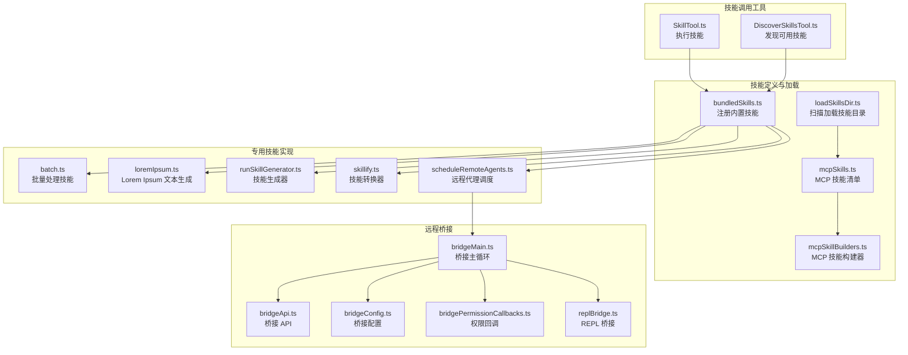
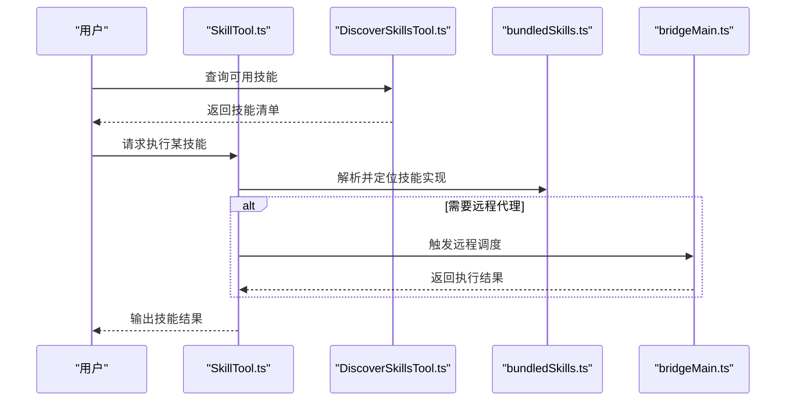
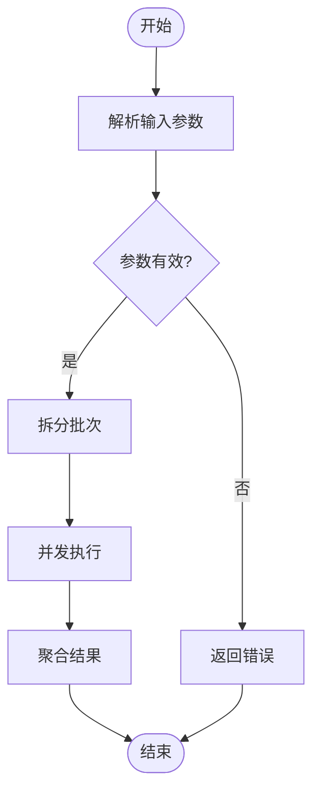
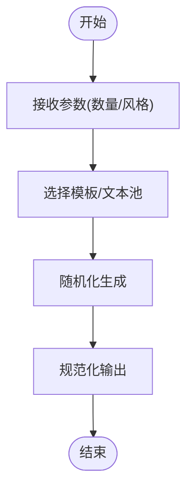
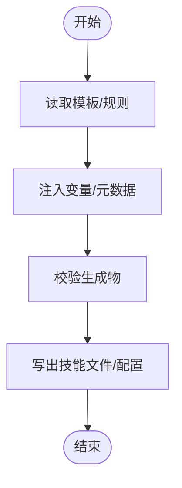
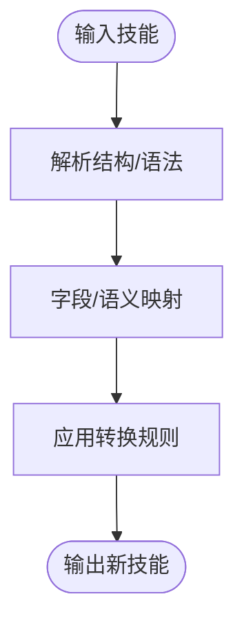
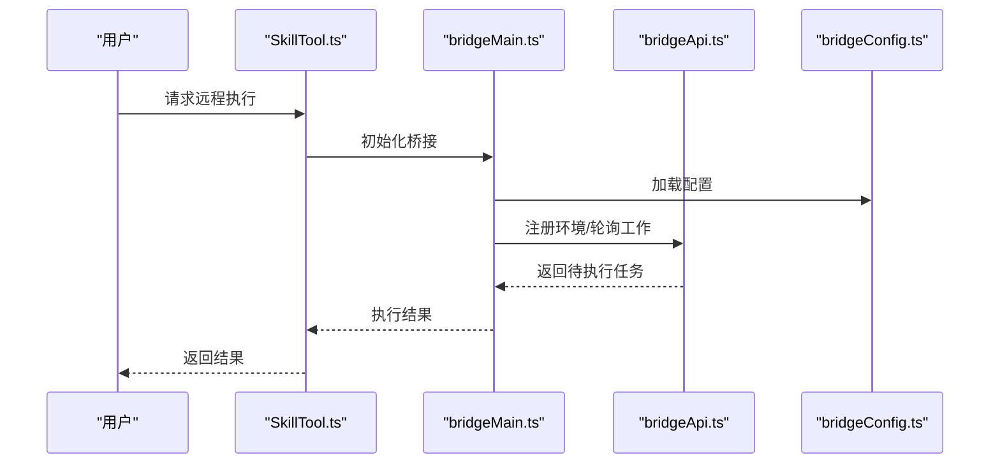
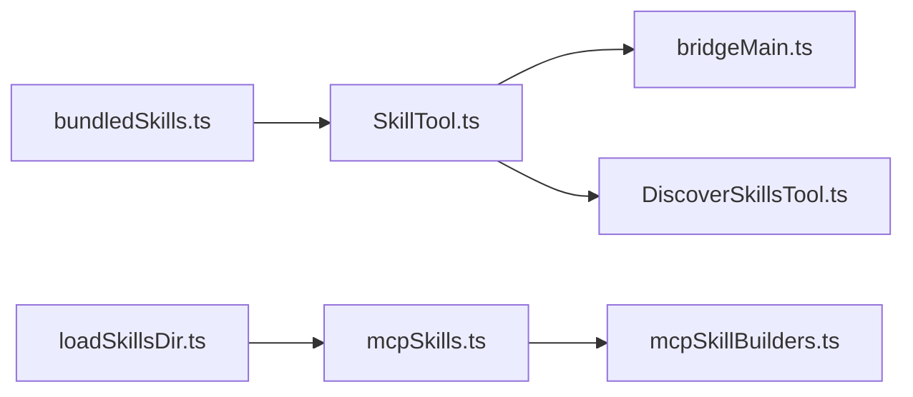

# 专用技能

<cite>
**本文引用的文件**
- [batch.ts](file://src/skills/bundled/batch.ts)
- [loremIpsum.ts](file://src/skills/bundled/loremIpsum.ts)
- [runSkillGenerator.ts](file://src/skills/bundled/runSkillGenerator.ts)
- [skillify.ts](file://src/skills/bundled/skillify.ts)
- [scheduleRemoteAgents.ts](file://src/skills/bundled/scheduleRemoteAgents.ts)
- [bundledSkills.ts](file://src/skills/bundledSkills.ts)
- [loadSkillsDir.ts](file://src/skills/loadSkillsDir.ts)
- [mcpSkillBuilders.ts](file://src/skills/mcpSkillBuilders.ts)
- [mcpSkills.ts](file://src/skills/mcpSkills.ts)
- [SkillTool.ts](file://src/tools/SkillTool/SkillTool.ts)
- [DiscoverSkillsTool.ts](file://src/tools/DiscoverSkillsTool/DiscoverSkillsTool.ts)
- [bridgeMain.ts](file://src/bridge/bridgeMain.ts)
- [bridgeApi.ts](file://src/bridge/bridgeApi.ts)
- [bridgeConfig.ts](file://src/bridge/bridgeConfig.ts)
- [bridgePermissionCallbacks.ts](file://src/bridge/bridgePermissionCallbacks.ts)
- [bridgeStatusUtil.ts](file://src/bridge/bridgeStatusUtil.ts)
- [replBridge.ts](file://src/bridge/replBridge.ts)
- [replBridgeHandle.ts](file://src/bridge/replBridgeHandle.ts)
- [replBridgeTransport.ts](file://src/bridge/replBridgeTransport.ts)
- [remoteBridgeCore.ts](file://src/bridge/remoteBridgeCore.ts)
- [envLessBridgeConfig.ts](file://src/bridge/envLessBridgeConfig.ts)
- [pollConfig.ts](file://src/bridge/pollConfig.ts)
- [pollConfigDefaults.ts](file://src/bridge/pollConfigDefaults.ts)
- [trustedDevice.ts](file://src/bridge/trustedDevice.ts)
- [webhookSanitizer.ts](file://src/bridge/webhookSanitizer.ts)
- [workSecret.ts](file://src/bridge/workSecret.ts)
- [createSession.ts](file://src/bridge/createSession.ts)
- [sessionIdCompat.ts](file://src/bridge/sessionIdCompat.ts)
- [sessionRunner.ts](file://src/bridge/sessionRunner.ts)
- [capacityWake.ts](file://src/bridge/capacityWake.ts)
- [flushGate.ts](file://src/bridge/flushGate.ts)
- [inboundAttachments.ts](file://src/bridge/inboundAttachments.ts)
- [inboundMessages.ts](file://src/bridge/inboundMessages.ts)
- [initReplBridge.ts](file://src/bridge/initReplBridge.ts)
- [jwtUtils.ts](file://src/bridge/jwtUtils.ts)
- [peerSessions.ts](file://src/bridge/peerSessions.ts)
- [codeSessionApi.ts](file://src/bridge/codeSessionApi.ts)
- [bridgeDebug.ts](file://src/bridge/bridgeDebug.ts)
- [bridgeEnabled.ts](file://src/bridge/bridgeEnabled.ts)
- [bridgePointer.ts](file://src/bridge/bridgePointer.ts)
- [bridgeUI.ts](file://src/bridge/bridgeUI.ts)
- [bridgeMessaging.ts](file://src/bridge/bridgeMessaging.ts)
- [bridgeStatusUtil.ts](file://src/bridge/bridgeStatusUtil.ts)
- [bridgeDebug.ts](file://src/bridge/bridgeDebug.ts)
- [bridgeEnabled.ts](file://src/bridge/bridgeEnabled.ts)
- [bridgePointer.ts](file://src/bridge/bridgePointer.ts)
- [bridgeUI.ts](file://src/bridge/bridgeUI.ts)
- [bridgeMessaging.ts](file://src/bridge/bridgeMessaging.ts)
- [bridgeStatusUtil.ts](file://src/bridge/bridgeStatusUtil.ts)
- [bridgeDebug.ts](file://src/bridge/bridgeDebug.ts)
- [bridgeEnabled.ts](file://src/bridge/bridgeEnabled.ts)
- [bridgePointer.ts](file://src/bridge/bridgePointer.ts)
- [bridgeUI.ts](file://src/bridge/bridgeUI.ts)
- [bridgeMessaging.ts](file://src/bridge/bridgeMessaging.ts)
- [bridgeStatusUtil.ts](file://src/bridge/bridgeStatusUtil.ts)
- [bridgeDebug.ts](file://src/bridge/bridgeDebug.ts)
- [bridgeEnabled.ts](file://src/bridge/bridgeEnabled.ts)
- [bridgePointer.ts](file://src/bridge/bridgePointer.ts)
- [bridgeUI.ts](file://src/bridge/bridgeUI.ts)
- [bridgeMessaging.ts](file://src/bridge/bridgeMessaging.ts)
- [bridgeStatusUtil.ts](file://src/bridge/bridgeStatusUtil.ts)
- [bridgeDebug.ts](file://src/bridge/bridgeDebug.ts)
- [bridgeEnabled.ts](file://src/bridge/bridgeEnabled.ts)
- [bridgePointer.ts](file://src/bridge/bridgePointer.ts)
- [bridgeUI.ts](file://src/bridge/bridgeUI.ts)
- [bridgeMessaging.ts](file://src/bridge/bridgeMessaging.ts)
- [bridgeStatusUtil.ts](file://src/bridge/bridgeStatusUtil.ts)
- [bridgeDebug.ts](file://src/bridge/bridgeDebug.ts)
- [bridgeEnabled.ts](file://src/bridge/bridgeEnabled.ts)
- [bridgePointer.ts](file://src/bridge/bridgePointer.ts)
- [bridgeUI.ts](file://src/bridge/bridgeUI.ts)
- [bridgeMessaging.ts](file://src/bridge/bridgeMessaging.ts)
- [bridgeStatusUtil.ts](file://src/bridge/bridgeStatusUtil.ts)
- [bridgeDebug.ts](file......)
</cite>

## 目录
1. [引言](#引言)
2. [项目结构](#项目结构)
3. [核心组件](#核心组件)
4. [架构总览](#架构总览)
5. [详细组件分析](#详细组件分析)
6. [依赖关系分析](#依赖关系分析)
7. [性能考量](#性能考量)
8. [故障排查指南](#故障排查指南)
9. [结论](#结论)
10. [附录](#附录)

## 引言
本文件聚焦 Claude Code 的“专用技能”体系，系统性梳理并解释以下五类专用技能：批量处理技能、Lorem Ipsum 文本生成技能、技能生成器、技能转换器、远程代理调度技能。文档从系统架构、组件关系、数据与处理流程、集成点、错误处理与性能优化等维度进行深入分析，并提供可直接映射到源码的图示与参考路径，帮助读者快速理解并高效使用这些技能。

## 项目结构
专用技能主要位于 src/skills/bundled 目录下，配套的加载与构建逻辑位于 src/skills 目录；同时，与“技能”直接交互的工具位于 src/tools/SkillTool 与 DiscoverSkillsTool；远程桥接与调度能力由 src/bridge 子系统支撑。

**图表来源**
- [bundledSkills.ts](file://src/skills/bundledSkills.ts)
- [loadSkillsDir.ts](file://src/skills/loadSkillsDir.ts)
- [mcpSkills.ts](file://src/skills/mcpSkills.ts)
- [mcpSkillBuilders.ts](file://src/skills/mcpSkillBuilders.ts)
- [batch.ts](file://src/skills/bundled/batch.ts)
- [loremIpsum.ts](file://src/skills/bundled/loremIpsum.ts)
- [runSkillGenerator.ts](file://src/skills/bundled/runSkillGenerator.ts)
- [skillify.ts](file://src/skills/bundled/skillify.ts)
- [scheduleRemoteAgents.ts](file://src/skills/bundled/scheduleRemoteAgents.ts)
- [SkillTool.ts](file://src/tools/SkillTool/SkillTool.ts)
- [DiscoverSkillsTool.ts](file://src/tools/DiscoverSkillsTool/DiscoverSkillsTool.ts)
- [bridgeMain.ts](file://src/bridge/bridgeMain.ts)
- [bridgeApi.ts](file://src/bridge/bridgeApi.ts)
- [bridgeConfig.ts](file://src/bridge/bridgeConfig.ts)
- [bridgePermissionCallbacks.ts](file://src/bridge/bridgePermissionCallbacks.ts)
- [replBridge.ts](file://src/bridge/replBridge.ts)

**章节来源**
- [bundledSkills.ts](file://src/skills/bundledSkills.ts)
- [loadSkillsDir.ts](file://src/skills/loadSkillsDir.ts)
- [mcpSkills.ts](file://src/skills/mcpSkills.ts)
- [mcpSkillBuilders.ts](file://src/skills/mcpSkillBuilders.ts)

## 核心组件
- 批量处理技能：面向多文件或多任务的批式执行，提供统一入口与并发控制。
- Lorem Ipsum 文本生成技能：用于生成占位文本，满足界面设计与内容填充需求。
- 技能生成器：将通用模板或规则转化为可执行技能，提升技能复用与标准化。
- 技能转换器：对现有技能进行格式化、规范化或迁移转换，便于跨平台或跨版本使用。
- 远程代理调度技能：通过桥接系统调度远端代理执行任务，实现资源扩展与能力外延。

**章节来源**
- [batch.ts](file://src/skills/bundled/batch.ts)
- [loremIpsum.ts](file://src/skills/bundled/loremIpsum.ts)
- [runSkillGenerator.ts](file://src/skills/bundled/runSkillGenerator.ts)
- [skillify.ts](file://src/skills/bundled/skillify.ts)
- [scheduleRemoteAgents.ts](file://src/skills/bundled/scheduleRemoteAgents.ts)

## 架构总览
专用技能的运行链路分为三层：
- 定义与注册层：bundledSkills.ts 负责集中注册；mcpSkills.ts/mcpSkillBuilders.ts 提供 MCP 扩展能力。
- 调用与发现层：SkillTool.ts 执行技能；DiscoverSkillsTool.ts 发现可用技能；loadSkillsDir.ts 支持动态加载。
- 远程调度层：bridgeMain.ts 等桥接模块负责远端会话创建、轮询与执行。

**图表来源**
- [SkillTool.ts](file://src/tools/SkillTool/SkillTool.ts)
- [DiscoverSkillsTool.ts](file://src/tools/DiscoverSkillsTool/DiscoverSkillsTool.ts)
- [bundledSkills.ts](file://src/skills/bundledSkills.ts)
- [bridgeMain.ts](file://src/bridge/bridgeMain.ts)

## 详细组件分析

### 批量处理技能
- 功能概述：以统一接口处理多个目标对象（如文件、任务），支持并发与节流策略，确保吞吐与稳定性。
- 典型场景：
  - 大规模文件格式化或改写
  - 多任务并行验证或清理
- 内部机制要点：
  - 输入归一化与校验
  - 并发队列与超时控制
  - 结果聚合与错误汇总
- 使用建议：
  - 对于大体量输入，优先分片处理
  - 合理设置并发度，避免资源争用
  - 记录中间状态以便重试与审计

**图表来源**
- [batch.ts](file://src/skills/bundled/batch.ts)

**章节来源**
- [batch.ts](file://src/skills/bundled/batch.ts)

### Lorem Ipsum 文本生成技能
- 功能概述：按需生成符合排版要求的占位文本，支持段落数、单词数、格式风格等参数。
- 典型场景：
  - UI 原型阶段的内容填充
  - 文档样章与测试数据准备
- 内部机制要点：
  - 文本池与风格模板管理
  - 参数驱动的随机化策略
  - 编码与换行符规范化
- 使用建议：
  - 在需要固定可重复性时，提供种子参数
  - 注意不同语言与字符集的兼容性

**图表来源**
- [loremIpsum.ts](file://src/skills/bundled/loremIpsum.ts)

**章节来源**
- [loremIpsum.ts](file://src/skills/bundled/loremIpsum.ts)

### 技能生成器
- 功能概述：根据模板或规则自动生成技能脚本或配置，降低手工编写成本，提升一致性。
- 典型场景：
  - 快速复制已有技能的变体
  - 将通用流程固化为可复用技能
- 内部机制要点：
  - 模板引擎与变量替换
  - 元数据注入与校验
  - 输出格式标准化
- 使用建议：
  - 明确输入约束与默认值
  - 保留可配置项以便二次定制

**图表来源**
- [runSkillGenerator.ts](file://src/skills/bundled/runSkillGenerator.ts)

**章节来源**
- [runSkillGenerator.ts](file://src/skills/bundled/runSkillGenerator.ts)

### 技能转换器
- 功能概述：对现有技能进行格式化、迁移或兼容性转换，便于跨版本或跨平台使用。
- 典型场景：
  - 旧版技能升级到新规范
  - 不同运行时之间的适配
- 内部机制要点：
  - AST/结构化解析与映射
  - 规则驱动的字段映射与补丁
  - 变更回滚与增量更新
- 使用建议：
  - 先备份再转换
  - 逐版本验证兼容性

**图表来源**
- [skillify.ts](file://src/skills/bundled/skillify.ts)

**章节来源**
- [skillify.ts](file://src/skills/bundled/skillify.ts)

### 远程代理调度技能
- 功能概述：通过桥接系统在远端环境中调度代理执行任务，实现资源扩展与能力外延。
- 典型场景：
  - 需要更高算力或专用环境的任务
  - 跨网络/跨设备的协同作业
- 内部机制要点：
  - 会话创建与凭据管理
  - 工作轮询与心跳维持
  - 权限控制与安全传输
- 使用建议：
  - 明确最小权限原则
  - 关注网络延迟与带宽

**图表来源**
- [bridgeMain.ts](file://src/bridge/bridgeMain.ts)
- [bridgeApi.ts](file://src/bridge/bridgeApi.ts)
- [bridgeConfig.ts](file://src/bridge/bridgeConfig.ts)
- [SkillTool.ts](file://src/tools/SkillTool/SkillTool.ts)

**章节来源**
- [scheduleRemoteAgents.ts](file://src/skills/bundled/scheduleRemoteAgents.ts)
- [bridgeMain.ts](file://src/bridge/bridgeMain.ts)
- [bridgeApi.ts](file://src/bridge/bridgeApi.ts)
- [bridgeConfig.ts](file://src/bridge/bridgeConfig.ts)

## 依赖关系分析
- 注册与发现：bundledSkills.ts 统一注册内置技能；DiscoverSkillsTool.ts 提供查询接口；loadSkillsDir.ts 支持外部目录加载。
- MCP 扩展：mcpSkills.ts/mcpSkillBuilders.ts 为 MCP 技能提供清单与构建器，增强生态扩展性。
- 调用链路：SkillTool.ts 作为统一入口，依赖注册中心与桥接模块完成本地与远程执行。

**图表来源**
- [bundledSkills.ts](file://src/skills/bundledSkills.ts)
- [loadSkillsDir.ts](file://src/skills/loadSkillsDir.ts)
- [mcpSkills.ts](file://src/skills/mcpSkills.ts)
- [mcpSkillBuilders.ts](file://src/skills/mcpSkillBuilders.ts)
- [SkillTool.ts](file://src/tools/SkillTool/SkillTool.ts)
- [DiscoverSkillsTool.ts](file://src/tools/DiscoverSkillsTool/DiscoverSkillsTool.ts)
- [bridgeMain.ts](file://src/bridge/bridgeMain.ts)

**章节来源**
- [bundledSkills.ts](file://src/skills/bundledSkills.ts)
- [loadSkillsDir.ts](file://src/skills/loadSkillsDir.ts)
- [mcpSkills.ts](file://src/skills/mcpSkills.ts)
- [mcpSkillBuilders.ts](file://src/skills/mcpSkillBuilders.ts)
- [SkillTool.ts](file://src/tools/SkillTool/SkillTool.ts)
- [DiscoverSkillsTool.ts](file://src/tools/DiscoverSkillsTool/DiscoverSkillsTool.ts)
- [bridgeMain.ts](file://src/bridge/bridgeMain.ts)

## 性能考量
- 批量处理：采用分片与并发控制，避免一次性提交过多任务导致资源抖动；对耗时操作启用进度反馈。
- 文本生成：缓存常用模板与文本池，减少重复初始化开销；限制单次输出大小以控制内存占用。
- 技能生成/转换：在生成器中引入增量计算与变更检测，仅对受影响部分重新生成；转换器采用流式处理以降低峰值内存。
- 远程调度：合理设置轮询间隔与心跳周期，避免频繁网络往返；对大结果进行压缩或分块传输。

## 故障排查指南
- 技能未发现：检查 bundledSkills.ts 是否正确注册；确认 DiscoverSkillsTool.ts 的查询范围；验证 loadSkillsDir.ts 的目录权限。
- 远程执行失败：核对 bridgeConfig.ts 的配置项；查看 bridgeMain.ts 的轮询日志；确认 bridgePermissionCallbacks.ts 的权限回调是否成功。
- 会话异常：检查 bridgeApi.ts 的响应状态；关注 workSecret.ts 的签名校验；验证 jwtUtils.ts 的令牌刷新流程。
- 调度卡顿：观察 capacityWake.ts 的唤醒策略；检查 flushGate.ts 的门控逻辑；评估 peerSessions.ts 的会话数量与负载。

**章节来源**
- [bundledSkills.ts](file://src/skills/bundledSkills.ts)
- [loadSkillsDir.ts](file://src/skills/loadSkillsDir.ts)
- [DiscoverSkillsTool.ts](file://src/tools/DiscoverSkillsTool/DiscoverSkillsTool.ts)
- [bridgeMain.ts](file://src/bridge/bridgeMain.ts)
- [bridgeConfig.ts](file://src/bridge/bridgeConfig.ts)
- [bridgePermissionCallbacks.ts](file://src/bridge/bridgePermissionCallbacks.ts)
- [bridgeApi.ts](file://src/bridge/bridgeApi.ts)
- [workSecret.ts](file://src/bridge/workSecret.ts)
- [jwtUtils.ts](file://src/bridge/jwtUtils.ts)
- [capacityWake.ts](file://src/bridge/capacityWake.ts)
- [flushGate.ts](file://src/bridge/flushGate.ts)
- [peerSessions.ts](file://src/bridge/peerSessions.ts)

## 结论
专用技能体系通过“定义—发现—执行—调度”的闭环，实现了从本地到远程的灵活扩展。批量处理、文本生成、生成器、转换器与远程调度五大能力相互补充，既保证了易用性，也兼顾了可维护性与可扩展性。建议在实际使用中结合业务场景选择合适的技能组合，并遵循性能与安全最佳实践。

## 附录
- 相关工具与入口：
  - 执行技能：[SkillTool.ts](file://src/tools/SkillTool/SkillTool.ts)
  - 发现技能：[DiscoverSkillsTool.ts](file://src/tools/DiscoverSkillsTool/DiscoverSkillsTool.ts)
- 桥接与远程：
  - 桥接主循环：[bridgeMain.ts](file://src/bridge/bridgeMain.ts)
  - 桥接 API：[bridgeApi.ts](file://src/bridge/bridgeApi.ts)
  - 桥接配置：[bridgeConfig.ts](file://src/bridge/bridgeConfig.ts)
  - 权限回调：[bridgePermissionCallbacks.ts](file://src/bridge/bridgePermissionCallbacks.ts)
  - REPL 桥接：[replBridge.ts](file://src/bridge/replBridge.ts)