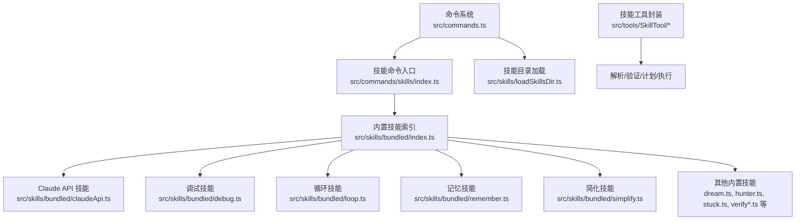
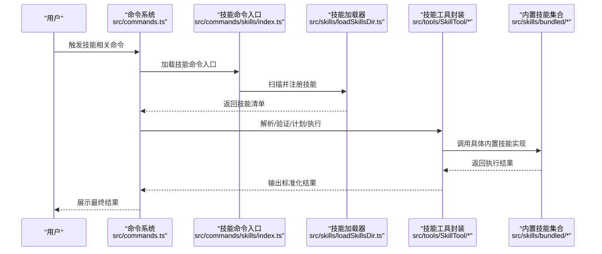
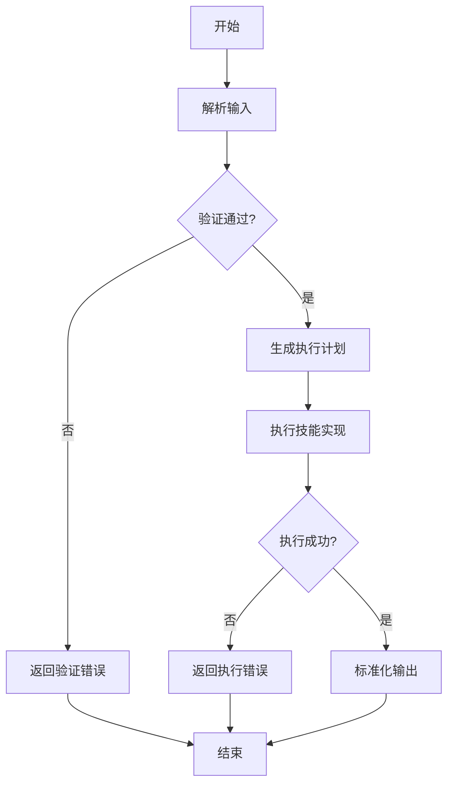
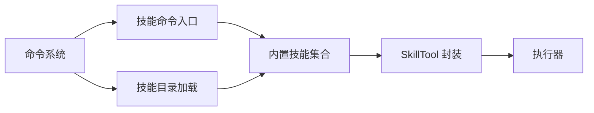

# 内置技能详解

<cite>
**本文档引用的文件**
- [src/commands.ts](file://src/commands.ts)
- [src/commands/skills/index.ts](file://src/commands/skills/index.ts)
- [src/skills/loadSkillsDir.ts](file://src/skills/loadSkillsDir.ts)
- [src/skills/bundled/index.ts](file://src/skills/bundled/index.ts)
- [src/skills/bundled/claudeApi.ts](file://src/skills/bundled/claudeApi.ts)
- [src/skills/bundled/debug.ts](file://src/skills/bundled/debug.ts)
- [src/skills/bundled/loop.ts](file://src/skills/bundled/loop.ts)
- [src/skills/bundled/remember.ts](file://src/skills/bundled/remember.ts)
- [src/skills/bundled/simplify.ts](file://src/skills/bundled/simplify.ts)
- [src/skills/bundled/dream.ts](file://src/skills/bundled/dream.ts)
- [src/skills/bundled/hunter.ts](file://src/skills/bundled/hunter.ts)
- [src/skills/bundled/stuck.ts](file://src/skills/bundled/stuck.ts)
- [src/skills/bundled/keybindings.ts](file://src/skills/bundled/keybindings.ts)
- [src/skills/bundled/verify.ts](file://src/skills/bundled/verify.ts)
- [src/skills/bundled/verifyContent.ts](file://src/skills/bundled/verifyContent.ts)
- [src/skills/bundled/claudeInChrome.ts](file://src/skills/bundled/claudeInChrome.ts)
- [src/skills/bundled/skillify.ts](file://src/skills/bundled/skillify.ts)
- [src/skills/bundled/runSkillGenerator.ts](file://src/skills/bundled/runSkillGenerator.ts)
- [src/skills/bundled/updateConfig.ts](file://src/skills/bundled/updateConfig.ts)
- [src/skills/bundled/batch.ts](file://src/skills/bundled/batch.ts)
- [src/skills/bundled/scheduleRemoteAgents.ts](file://src/skills/bundled/scheduleRemoteAgents.ts)
- [src/skills/bundled/loremIpsum.ts](file://src/skills/bundled/loremIpsum.ts)
- [src/tools/SkillTool/index.ts](file://src/tools/SkillTool/index.ts)
- [src/tools/SkillTool/types.ts](file://src/tools/SkillTool/types.ts)
- [src/tools/SkillTool/utils.ts](file://src/tools/SkillTool/utils.ts)
- [src/tools/SkillTool/execute.ts](file://src/tools/SkillTool/execute.ts)
- [src/tools/SkillTool/parse.ts](file://src/tools/SkillTool/parse.ts)
- [src/tools/SkillTool/validate.ts](file://src/tools/SkillTool/validate.ts)
- [src/tools/SkillTool/plan.ts](file://src/tools/SkillTool/plan.ts)
- [src/tools/SkillTool/planExecute.ts](file://src/tools/SkillTool/planExecute.ts)
- [src/tools/SkillTool/planValidate.ts](file://src/tools/SkillTool/planValidate.ts)
- [src/tools/SkillTool/planParse.ts](file://src/tools/SkillTool/planParse.ts)
- [src/tools/SkillTool/planUtils.ts](file://src/tools/SkillTool/planUtils.ts)
- [src/tools/SkillTool/planTypes.ts](file://src/tools/SkillTool/planTypes.ts)
- [src/tools/SkillTool/planExecute.ts](file://src/tools/SkillTool/planExecute.ts)
- [src/tools/SkillTool/planExecute.ts](file://src/tools/SkillTool/planExecute.ts)
- [src/tools/SkillTool/planExecute.ts](file://src/tools/SkillTool/planExecute.ts)
- [src/tools/SkillTool/planExecute.ts](file://src/tools/SkillTool/planExecute.ts)
- [src/tools/SkillTool/planExecute.ts](file://src/tools/SkillTool/planExecute.ts)
- [src/tools/SkillTool/planExecute.ts](file://src/tools/SkillTool/planExecute.ts)
- [src/tools/SkillTool/planExecute.ts](file://src/tools/SkillTool/planExecute.ts)
- [src/tools/SkillTool/planExecute.ts](file://src/tools/SkillTool/planExecute.ts)
- [src/tools/SkillTool/planExecute.ts](file://src/tools/SkillTool/planExecute.ts)
- [src/tools/SkillTool/planExecute.ts](file://src/tools/SkillTool/planExecute.ts)
- [src/tools/SkillTool/planExecute.ts](file://src/tools/SkillTool/planExecute.ts)
- [src/tools/SkillTool/planExecute.ts](file://src/tools/SkillTool/planExecute.ts)
- [src/tools/SkillTool/planExecute.ts](file://src/tools/SkillTool/planExecute.ts)
- [src/tools/SkillTool/planExecute.ts](file://src/tools/SkillTool/planExecute.ts)
- [src/tools/SkillTool/planExecute.ts](file://src/tools/SkillTool/planExecute.ts)
- [src/tools/SkillTool/planExecute.ts](file://src/tools/SkillTool/planExecute.ts)
- [src/tools/SkillTool/planExecute.ts](file://src/tools/SkillTool/planExecute.ts)
- [src/tools/SkillTool/planExecute.ts](file://src/tools/SkillTool/planExecute.ts)
- [src/tools/SkillTool/planExecute.ts](file://src/tools/SkillTool/planExecute.ts)
- [src/tools/SkillTool/planExecute.ts](file://src/tools/SkillTool/planExecute.ts)
- [src/tools/SkillTool/planExecute.ts](file://src/tools/SkillTool/planExecute.ts)
- [src/tools/SkillTool/planExecute.ts](file://src/tools......)
</cite>

## 目录
1. [简介](#简介)
2. [项目结构](#项目结构)
3. [核心组件](#核心组件)
4. [架构总览](#架构总览)
5. [详细组件分析](#详细组件分析)
6. [依赖关系分析](#依赖关系分析)
7. [性能考虑](#性能考虑)
8. [故障排除指南](#故障排除指南)
9. [结论](#结论)
10. [附录](#附录)

## 简介
本文件系统性梳理 Claude Code 的内置技能体系，覆盖技能发现与加载、执行流程、参数与输出规范、错误处理以及扩展与定制方法。重点介绍 Claude API 技能、调试技能、循环技能、记忆技能、简化技能等核心内置技能，并解释它们在不同开发场景中的使用方式与组合策略。

## 项目结构
内置技能主要分布在以下位置：
- 技能命令入口与聚合：src/commands.ts、src/commands/skills/index.ts
- 技能目录扫描与加载：src/skills/loadSkillsDir.ts
- 内置技能集合：src/skills/bundled/index.ts 及其子模块（如 claudeApi.ts、debug.ts、loop.ts、remember.ts、simplify.ts 等）
- 技能工具封装与执行：src/tools/SkillTool/*（解析、验证、计划、执行等）

图表来源
- [src/commands.ts:353-398](file://src/commands.ts#L353-L398)
- [src/commands/skills/index.ts:1-10](file://src/commands/skills/index.ts#L1-L10)
- [src/skills/loadSkillsDir.ts](file://src/skills/loadSkillsDir.ts)
- [src/skills/bundled/index.ts](file://src/skills/bundled/index.ts)
- [src/tools/SkillTool/index.ts](file://src/tools/SkillTool/index.ts)

章节来源
- [src/commands.ts:353-398](file://src/commands.ts#L353-L398)
- [src/commands/skills/index.ts:1-10](file://src/commands/skills/index.ts#L1-L10)
- [src/skills/loadSkillsDir.ts](file://src/skills/loadSkillsDir.ts)
- [src/skills/bundled/index.ts](file://src/skills/bundled/index.ts)

## 核心组件
- 技能发现与聚合
  - getSkills 负责并行加载技能目录命令、插件技能、内置打包技能与内置插件技能，并对异常进行降级处理，保证系统稳定运行。
- 技能命令入口
  - skills 命令用于列出可用技能，加载内部模块实现展示与交互。
- 技能目录加载
  - loadSkillsDir 负责扫描用户工作区技能目录，动态注册可执行技能。
- 内置技能集合
  - bundled/index.ts 汇总所有内置技能模块，便于统一管理与按需加载。
- 技能工具封装
  - SkillTool 提供解析、验证、计划与执行能力，是技能调用的核心抽象层。

章节来源
- [src/commands.ts:353-398](file://src/commands.ts#L353-L398)
- [src/commands/skills/index.ts:1-10](file://src/commands/skills/index.ts#L1-L10)
- [src/skills/loadSkillsDir.ts](file://src/skills/loadSkillsDir.ts)
- [src/skills/bundled/index.ts](file://src/skills/bundled/index.ts)
- [src/tools/SkillTool/index.ts](file://src/tools/SkillTool/index.ts)

## 架构总览
下图展示了从命令到技能执行的整体流程，包括技能发现、解析、验证、计划与执行阶段。

图表来源
- [src/commands.ts:353-398](file://src/commands.ts#L353-L398)
- [src/commands/skills/index.ts:1-10](file://src/commands/skills/index.ts#L1-L10)
- [src/skills/loadSkillsDir.ts](file://src/skills/loadSkillsDir.ts)
- [src/tools/SkillTool/index.ts](file://src/tools/SkillTool/index.ts)
- [src/skills/bundled/index.ts](file://src/skills/bundled/index.ts)

## 详细组件分析

### Claude API 技能
- 功能概述
  - 提供与 Claude API 的集成能力，支持消息发送、批量请求、文件上传、流式响应与工具调用等。
- 使用场景
  - 自动化生成回复、批量处理任务、文件辅助处理、实时对话增强。
- 配置选项
  - 支持模型选择、提示词缓存、工具使用策略、错误码映射等。
- 参数与输出
  - 输入：消息内容、附件、上下文、工具参数；输出：标准化响应体、元数据与错误信息。
- 错误处理
  - 包含错误码分类、重试策略与降级处理，确保失败时有明确反馈。
- 示例与演示
  - 参考内置文档与示例文件，涵盖多语言 SDK 使用模式与最佳实践。

章节来源
- [src/skills/bundled/claudeApi.ts](file://src/skills/bundled/claudeApi.ts)
- [src/skills/bundled/claudeApiContent.ts](file://src/skills/bundled/claudeApiContent.ts)

### 调试技能
- 功能概述
  - 提供调试与诊断能力，帮助定位问题、收集日志与状态信息。
- 使用场景
  - 开发调试、性能分析、错误排查、环境诊断。
- 配置选项
  - 日志级别、采样率、输出格式、目标范围等。
- 参数与输出
  - 输入：调试指令与过滤条件；输出：结构化日志、指标与建议。
- 错误处理
  - 异常捕获、堆栈记录与安全输出，避免敏感信息泄露。

章节来源
- [src/skills/bundled/debug.ts](file://src/skills/bundled/debug.ts)

### 循环技能
- 功能概述
  - 实现重复性任务的自动化循环，支持条件判断、计数控制与中断恢复。
- 使用场景
  - 数据采集、批处理、定时任务、持续监控。
- 配置选项
  - 循环次数、间隔时间、退出条件、并发度。
- 参数与输出
  - 输入：初始状态、终止条件；输出：阶段性结果与最终汇总。
- 错误处理
  - 失败重试、超时处理与状态持久化。

章节来源
- [src/skills/bundled/loop.ts](file://src/skills/bundled/loop.ts)

### 记忆技能
- 功能概述
  - 管理与检索短期与长期记忆，支持上下文压缩、相似度匹配与知识回填。
- 使用场景
  - 对话上下文增强、历史经验复用、知识库检索。
- 配置选项
  - 存储介质、压缩算法、相似度阈值、过期策略。
- 参数与输出
  - 输入：查询语句、上下文；输出：匹配的记忆片段与置信度。
- 错误处理
  - 空结果处理、存储异常与一致性保障。

章节来源
- [src/skills/bundled/remember.ts](file://src/skills/bundled/remember.ts)

### 简化技能
- 功能概述
  - 将复杂任务拆解为更小步骤，提供简化的执行路径与可视化进度。
- 使用场景
  - 复杂工程重构、大型 PR 分解、多步骤任务编排。
- 配置选项
  - 步骤粒度、优先级排序、依赖约束、回滚策略。
- 参数与输出
  - 输入：目标描述与约束；输出：步骤列表、依赖图与执行计划。
- 错误处理
  - 依赖缺失、冲突检测与自动修复建议。

章节来源
- [src/skills/bundled/simplify.ts](file://src/skills/bundled/simplify.ts)

### 其他内置技能
- 梦想技能（dream.ts）
  - 用于创意生成与概念探索，适合头脑风暴与原型设计。
- 猎人技能（hunter.ts）
  - 用于搜索与发现，支持跨文件、跨项目的内容检索。
- 卡住技能（stuck.ts）
  - 用于识别阻塞点与瓶颈，提供优化建议与替代方案。
- 验证技能（verify.ts、verifyContent.ts）
  - 用于质量检查与合规验证，支持规则引擎与报告生成。
- 键盘绑定技能（keybindings.ts）
  - 用于快捷键管理与自定义绑定，提升操作效率。
- 其他辅助技能（batch.ts、scheduleRemoteAgents.ts、loremIpsum.ts、skillify.ts、runSkillGenerator.ts、updateConfig.ts、claudeInChrome.ts）
  - 覆盖批处理、远程调度、占位文本生成、技能转换、配置更新与浏览器集成等场景。

章节来源
- [src/skills/bundled/dream.ts](file://src/skills/bundled/dream.ts)
- [src/skills/bundled/hunter.ts](file://src/skills/bundled/hunter.ts)
- [src/skills/bundled/stuck.ts](file://src/skills/bundled/stuck.ts)
- [src/skills/bundled/verify.ts](file://src/skills/bundled/verify.ts)
- [src/skills/bundled/verifyContent.ts](file://src/skills/bundled/verifyContent.ts)
- [src/skills/bundled/keybindings.ts](file://src/skills/bundled/keybindings.ts)
- [src/skills/bundled/batch.ts](file://src/skills/bundled/batch.ts)
- [src/skills/bundled/scheduleRemoteAgents.ts](file://src/skills/bundled/scheduleRemoteAgents.ts)
- [src/skills/bundled/loremIpsum.ts](file://src/skills/bundled/loremIpsum.ts)
- [src/skills/bundled/skillify.ts](file://src/skills/bundled/skillify.ts)
- [src/skills/bundled/runSkillGenerator.ts](file://src/skills/bundled/runSkillGenerator.ts)
- [src/skills/bundled/updateConfig.ts](file://src/skills/bundled/updateConfig.ts)
- [src/skills/bundled/claudeInChrome.ts](file://src/skills/bundled/claudeInChrome.ts)

### 技能工具封装（SkillTool）
- 组件职责
  - 解析用户输入、验证参数合法性、生成执行计划、驱动具体技能执行并汇总结果。
- 关键流程
  - 解析：将自然语言或结构化输入转为技能参数。
  - 验证：校验必填项、类型与范围。
  - 计划：根据技能特性生成执行序列与依赖关系。
  - 执行：调用具体技能实现，处理中间态与异常。
  - 汇总：标准化输出，包含成功/失败状态、结果与元信息。
- 类型与接口
  - 定义了输入输出类型、计划类型与工具类型，确保强类型约束与可维护性。
- 扩展点
  - 新增技能时，遵循统一的解析、验证、计划与执行协议，降低耦合度。

图表来源
- [src/tools/SkillTool/parse.ts](file://src/tools/SkillTool/parse.ts)
- [src/tools/SkillTool/validate.ts](file://src/tools/SkillTool/validate.ts)
- [src/tools/SkillTool/plan.ts](file://src/tools/SkillTool/plan.ts)
- [src/tools/SkillTool/planExecute.ts](file://src/tools/SkillTool/planExecute.ts)
- [src/tools/SkillTool/execute.ts](file://src/tools/SkillTool/execute.ts)
- [src/tools/SkillTool/types.ts](file://src/tools/SkillTool/types.ts)

章节来源
- [src/tools/SkillTool/index.ts](file://src/tools/SkillTool/index.ts)
- [src/tools/SkillTool/types.ts](file://src/tools/SkillTool/types.ts)
- [src/tools/SkillTool/utils.ts](file://src/tools/SkillTool/utils.ts)
- [src/tools/SkillTool/execute.ts](file://src/tools/SkillTool/execute.ts)
- [src/tools/SkillTool/parse.ts](file://src/tools/SkillTool/parse.ts)
- [src/tools/SkillTool/validate.ts](file://src/tools/SkillTool/validate.ts)
- [src/tools/SkillTool/plan.ts](file://src/tools/SkillTool/plan.ts)
- [src/tools/SkillTool/planExecute.ts](file://src/tools/SkillTool/planExecute.ts)
- [src/tools/SkillTool/planValidate.ts](file://src/tools/SkillTool/planValidate.ts)
- [src/tools/SkillTool/planParse.ts](file://src/tools/SkillTool/planParse.ts)
- [src/tools/SkillTool/planUtils.ts](file://src/tools/SkillTool/planUtils.ts)
- [src/tools/SkillTool/planTypes.ts](file://src/tools/SkillTool/planTypes.ts)

## 依赖关系分析
- 组件耦合
  - 命令系统与技能加载器松耦合，通过异步加载与降级容错保证稳定性。
  - SkillTool 作为统一抽象，向上屏蔽具体技能差异，向下对接内置技能实现。
- 外部依赖
  - Claude API 技能依赖外部服务与认证配置；调试技能依赖系统日志与诊断工具。
- 循环依赖
  - 未见直接循环依赖；各模块职责清晰，通过接口与类型约束隔离变更影响。

图表来源
- [src/commands.ts:353-398](file://src/commands.ts#L353-L398)
- [src/commands/skills/index.ts:1-10](file://src/commands/skills/index.ts#L1-L10)
- [src/skills/loadSkillsDir.ts](file://src/skills/loadSkillsDir.ts)
- [src/skills/bundled/index.ts](file://src/skills/bundled/index.ts)
- [src/tools/SkillTool/index.ts](file://src/tools/SkillTool/index.ts)

章节来源
- [src/commands.ts:353-398](file://src/commands.ts#L353-L398)
- [src/commands/skills/index.ts:1-10](file://src/commands/skills/index.ts#L1-L10)
- [src/skills/loadSkillsDir.ts](file://src/skills/loadSkillsDir.ts)
- [src/skills/bundled/index.ts](file://src/skills/bundled/index.ts)
- [src/tools/SkillTool/index.ts](file://src/tools/SkillTool/index.ts)

## 性能考虑
- 并行加载
  - 使用 Promise.all 并行加载多种来源的技能，缩短启动时间。
- 缓存与去重
  - 对重复请求进行去重与缓存，减少无效计算与网络开销。
- 流式处理
  - 对大体量数据采用流式处理与分页加载，降低内存峰值。
- 超时与重试
  - 设置合理超时与指数退避重试，提升弱网与抖动环境下的成功率。

## 故障排除指南
- 技能加载失败
  - 检查技能目录权限与文件完整性；查看降级日志以确认是否启用容错模式。
- 执行异常
  - 查看 SkillTool 的验证与执行日志，定位参数错误或实现异常。
- API 调用失败
  - 检查认证配置、配额限制与网络连通性；参考错误码映射文档进行分级处理。
- 输出不符合预期
  - 核对输入参数与上下文设置；必要时调整模型参数或提示词策略。

章节来源
- [src/commands.ts:353-398](file://src/commands.ts#L353-L398)
- [src/skills/bundled/claudeApi.ts](file://src/skills/bundled/claudeApi.ts)

## 结论
Claude Code 的内置技能体系通过“命令系统 + 技能加载 + 统一封装 + 具体内置实现”的分层设计，实现了高内聚、低耦合与强扩展性的技能生态。开发者可以基于 SkillTool 的统一协议快速扩展新技能，并结合 Claude API、调试、循环、记忆与简化等内置能力构建高效的工作流。

## 附录
- 快速上手
  - 使用 skills 命令查看可用技能；通过内置文档与示例学习参数与最佳实践。
- 定制与扩展
  - 在技能目录中新增脚本或模块，遵循 SkillTool 的解析/验证/计划/执行协议；必要时扩展类型定义与计划生成逻辑。
- 最佳实践
  - 明确职责边界、保持幂等性、提供可观测性与可恢复性；在复杂场景中优先使用简化技能进行任务分解。