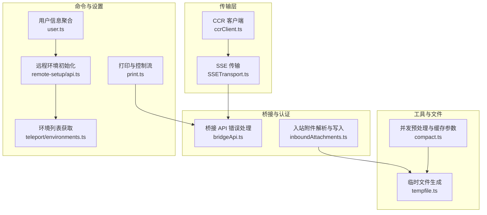
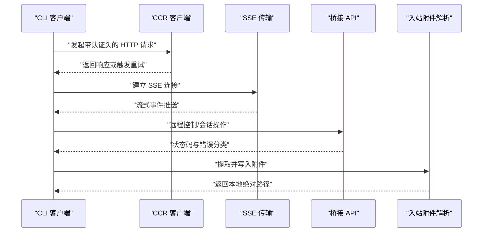
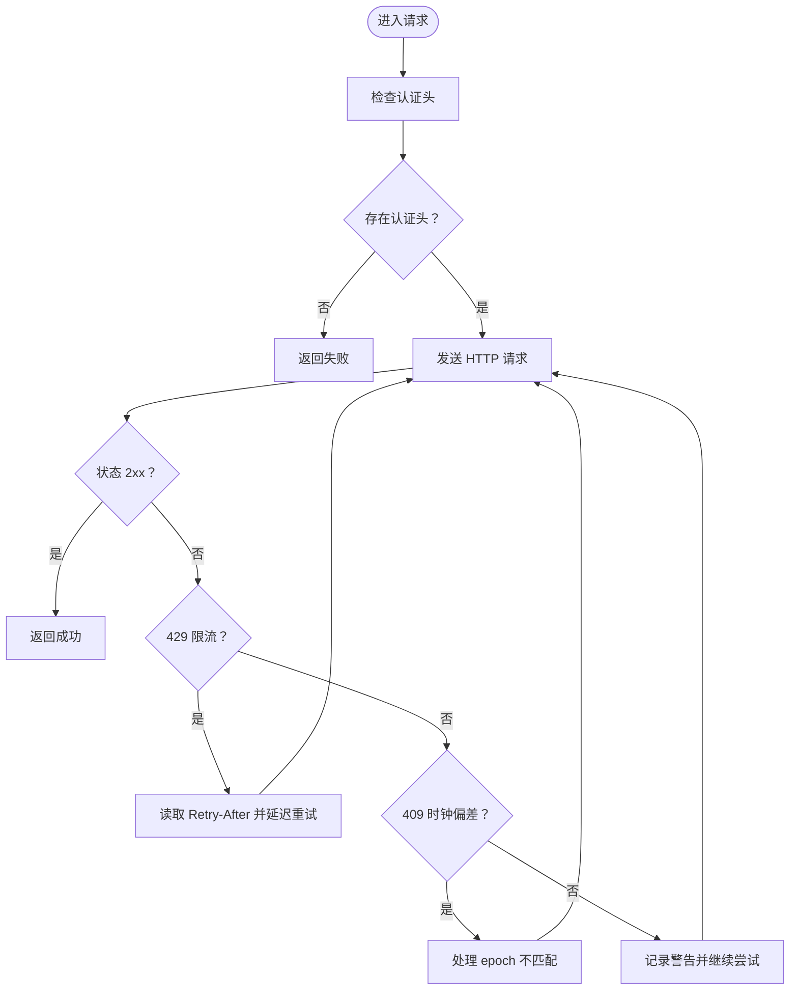
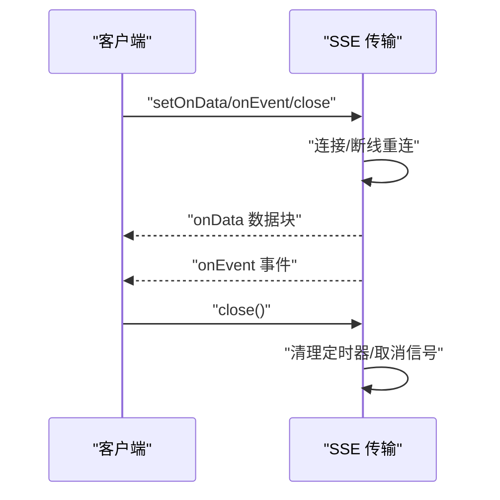
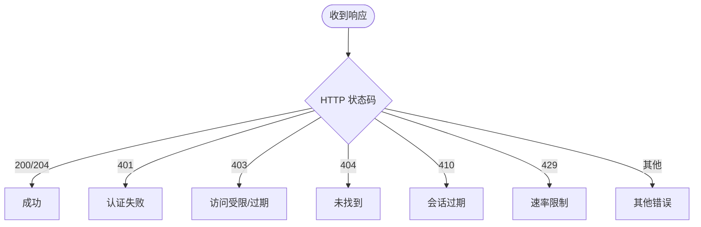
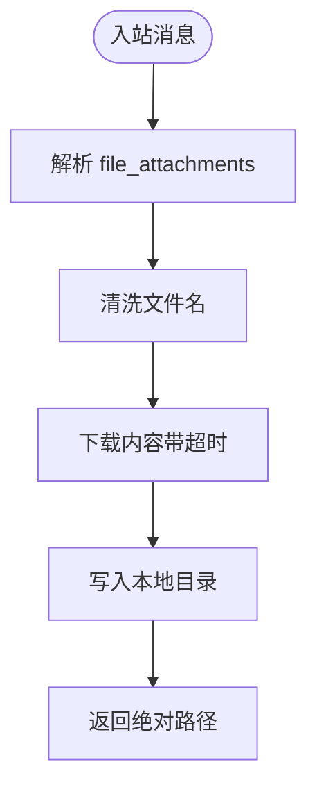
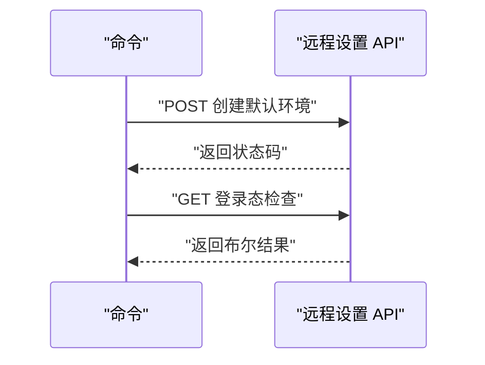
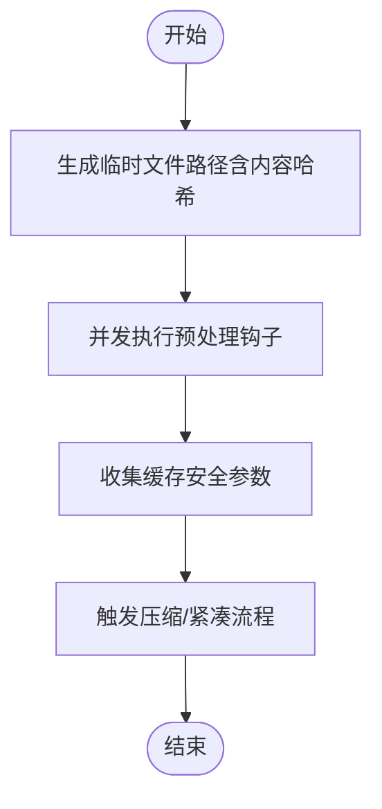
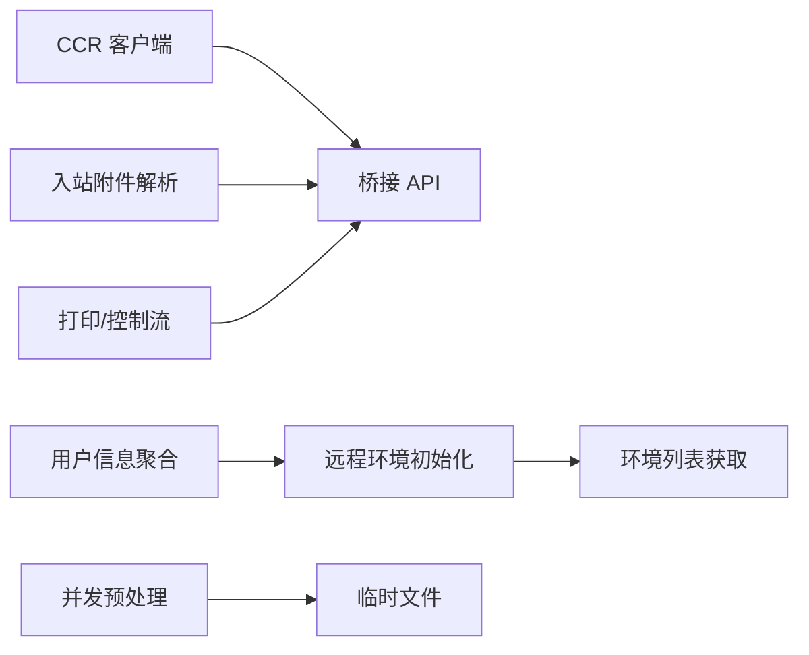

# .NET/C# API 技能

<cite>
**本文引用的文件**
- [src/cli/transports/ccrClient.ts](file://src/cli/transports/ccrClient.ts)
- [src/bridge/inboundAttachments.ts](file://src/bridge/inboundAttachments.ts)
- [src/bridge/bridgeApi.ts](file://src/bridge/bridgeApi.ts)
- [src/cli/transports/SSETransport.ts](file://src/cli/transports/SSETransport.ts)
- [src/utils/tempfile.ts](file://src/utils/tempfile.ts)
- [src/cli/print.ts](file://src/cli/print.ts)
- [src/commands/remote-setup/api.ts](file://src/commands/remote-setup/api.ts)
- [src/utils/udsClient.ts](file://src/utils/udsClient.ts)
- [src/utils/udsMessaging.ts](file://src/utils/udsMessaging.ts)
- [src/cli/structuredIO.ts](file://src/cli/structuredIO.ts)
- [src/utils/teleport/environments.ts](file://src/utils/teleport/environments.ts)
- [src/utils/user.ts](file://src/utils/user.ts)
- [src/commands/compact/compact.ts](file://src/commands/compact/compact.ts)
</cite>

## 目录
1. [简介](#简介)
2. [项目结构](#项目结构)
3. [核心组件](#核心组件)
4. [架构总览](#架构总览)
5. [详细组件分析](#详细组件分析)
6. [依赖关系分析](#依赖关系分析)
7. [性能考虑](#性能考虑)
8. [故障排查指南](#故障排查指南)
9. [结论](#结论)
10. [附录](#附录)

## 简介
本文件面向希望在 .NET/C# 项目中集成 Claude API 的开发者，系统性梳理与 Claude API 交互的关键能力：异步调用、批量处理、文件上传与附件解析、工具（技能）使用、认证与错误处理等。文档以仓库中的 TypeScript 实现为依据，提炼出可映射到 .NET/C# 的设计模式与最佳实践，帮助读者快速落地高性能、可维护的集成方案。

## 项目结构
该仓库主要由 CLI、桥接层、命令与工具集合、服务与传输层构成。与 .NET 集成相关的核心路径如下：
- 传输与客户端：CLI 传输层负责与后端建立连接、发送请求、处理 SSE 流与重试策略
- 桥接与认证：桥接层负责远程会话、权限校验、错误类型化与状态管理
- 工具与文件：工具执行、文件下载与本地落盘、临时文件生成
- 命令与设置：远程环境初始化、登录状态检查、用户信息聚合

**图表来源**
- [src/cli/transports/ccrClient.ts:550-944](file://src/cli/transports/ccrClient.ts#L550-L944)
- [src/cli/transports/SSETransport.ts:647-694](file://src/cli/transports/SSETransport.ts#L647-L694)
- [src/bridge/bridgeApi.ts:454-500](file://src/bridge/bridgeApi.ts#L454-L500)
- [src/bridge/inboundAttachments.ts:68-113](file://src/bridge/inboundAttachments.ts#L68-L113)
- [src/utils/tempfile.ts:1-31](file://src/utils/tempfile.ts#L1-L31)
- [src/commands/remote-setup/api.ts:140-182](file://src/commands/remote-setup/api.ts#L140-L182)
- [src/cli/print.ts:3575-3644](file://src/cli/print.ts#L3575-L3644)
- [src/utils/teleport/environments.ts:32-43](file://src/utils/teleport/environments.ts#L32-L43)
- [src/utils/user.ts:83-102](file://src/utils/user.ts#L83-L102)
- [src/commands/compact/compact.ts:155-179](file://src/commands/compact/compact.ts#L155-L179)

**章节来源**
- [src/cli/transports/ccrClient.ts:550-944](file://src/cli/transports/ccrClient.ts#L550-L944)
- [src/cli/transports/SSETransport.ts:647-694](file://src/cli/transports/SSETransport.ts#L647-L694)
- [src/bridge/bridgeApi.ts:454-500](file://src/bridge/bridgeApi.ts#L454-L500)
- [src/bridge/inboundAttachments.ts:68-113](file://src/bridge/inboundAttachments.ts#L68-L113)
- [src/utils/tempfile.ts:1-31](file://src/utils/tempfile.ts#L1-L31)
- [src/commands/remote-setup/api.ts:140-182](file://src/commands/remote-setup/api.ts#L140-L182)
- [src/cli/print.ts:3575-3644](file://src/cli/print.ts#L3575-L3644)
- [src/utils/teleport/environments.ts:32-43](file://src/utils/teleport/environments.ts#L32-L43)
- [src/utils/user.ts:83-102](file://src/utils/user.ts#L83-L102)
- [src/commands/compact/compact.ts:155-179](file://src/commands/compact/compact.ts#L155-L179)

## 核心组件
- 异步 HTTP 客户端与重试：封装认证头、超时、状态校验与指数退避重试，支持 429 回退提示与 409 时钟偏差处理
- SSE 传输：基于事件循环的流式传输，具备断线重连、心跳与关闭流程
- 桥接 API 错误处理：对常见状态码进行分类与抛错，区分认证失败、访问受限、过期与速率限制
- 入站附件解析与落盘：从网络消息中提取附件，安全清洗文件名，写入本地目录
- 远程环境初始化与登录态：通过 OAuth 凭据准备请求，检查登录状态并返回 Web 地址
- 临时文件与缓存参数：生成稳定临时路径，用于跨进程一致的提示缓存前缀；并发收集工具参数
- 用户信息聚合：按需附加订阅等级、配额等级与首次令牌时间等元数据

**章节来源**
- [src/cli/transports/ccrClient.ts:550-944](file://src/cli/transports/ccrClient.ts#L550-L944)
- [src/cli/transports/SSETransport.ts:647-694](file://src/cli/transports/SSETransport.ts#L647-L694)
- [src/bridge/bridgeApi.ts:454-500](file://src/bridge/bridgeApi.ts#L454-L500)
- [src/bridge/inboundAttachments.ts:68-113](file://src/bridge/inboundAttachments.ts#L68-L113)
- [src/commands/remote-setup/api.ts:140-182](file://src/commands/remote-setup/api.ts#L140-L182)
- [src/utils/tempfile.ts:1-31](file://src/utils/tempfile.ts#L1-L31)
- [src/commands/compact/compact.ts:155-179](file://src/commands/compact/compact.ts#L155-L179)
- [src/utils/user.ts:83-102](file://src/utils/user.ts#L83-L102)

## 架构总览
下图展示了从 CLI 到后端的典型调用链路，以及桥接层对错误的统一处理与文件附件的落盘流程。

**图表来源**
- [src/cli/transports/ccrClient.ts:550-944](file://src/cli/transports/ccrClient.ts#L550-L944)
- [src/cli/transports/SSETransport.ts:647-694](file://src/cli/transports/SSETransport.ts#L647-L694)
- [src/bridge/bridgeApi.ts:454-500](file://src/bridge/bridgeApi.ts#L454-L500)
- [src/bridge/inboundAttachments.ts:68-113](file://src/bridge/inboundAttachments.ts#L68-L113)

## 详细组件分析

### 组件一：异步 HTTP 客户端与重试策略
- 关键点
  - 认证头注入与状态校验
  - 指数退避与抖动，尊重 429 的回退提示
  - 409 时钟偏差处理与日志记录
  - 可配置超时与用户代理标识
- .NET 映射建议
  - 使用 HttpClient 发起请求，结合 Polly 或自定义策略实现指数退避
  - 通过 DelegatingHandler 注入认证头与通用头部
  - 对 429 的 Retry-After 响应头进行解析并延迟重试
  - 对 409 做 epoch 不匹配的幂等重试或刷新令牌

**图表来源**
- [src/cli/transports/ccrClient.ts:550-944](file://src/cli/transports/ccrClient.ts#L550-L944)

**章节来源**
- [src/cli/transports/ccrClient.ts:550-944](file://src/cli/transports/ccrClient.ts#L550-L944)

### 组件二：SSE 传输与流式处理
- 关键点
  - 断线重连与指数退避
  - 心跳与关闭流程，避免资源泄漏
  - 事件回调与数据回调分离
- .NET 映射建议
  - 使用 System.Net.WebSockets 或第三方库实现 SSE
  - 在取消信号下优雅关闭，释放定时器与订阅
  - 将事件与数据回调抽象为接口，便于测试与替换

**图表来源**
- [src/cli/transports/SSETransport.ts:647-694](file://src/cli/transports/SSETransport.ts#L647-L694)

**章节来源**
- [src/cli/transports/SSETransport.ts:647-694](file://src/cli/transports/SSETransport.ts#L647-L694)

### 组件三：桥接 API 错误处理与状态码分类
- 关键点
  - 401/403/404/410/429 等状态码的明确语义与错误类型
  - 访问受限时区分过期与权限不足
  - 统一错误抛出，便于上层捕获与降级
- .NET 映射建议
  - 定义强类型的异常类（如 AuthenticationFailedException、AccessDeniedException）
  - 在中间件或拦截器中根据状态码转换为对应异常
  - 对 429 提供重试建议与指数退避策略

**图表来源**
- [src/bridge/bridgeApi.ts:454-500](file://src/bridge/bridgeApi.ts#L454-L500)

**章节来源**
- [src/bridge/bridgeApi.ts:454-500](file://src/bridge/bridgeApi.ts#L454-L500)

### 组件四：入站附件解析与本地落盘
- 关键点
  - 从入站消息中提取附件数组
  - 清洗文件名，避免路径穿越与非法字符
  - 下载内容并写入本地目录，生成稳定前缀
- .NET 映射建议
  - 使用 HttpClient 下载二进制内容
  - 采用 Path.GetRandomFileName 与安全命名策略
  - 写入前确保目录存在，异常时回滚或记录失败

**图表来源**
- [src/bridge/inboundAttachments.ts:68-113](file://src/bridge/inboundAttachments.ts#L68-L113)

**章节来源**
- [src/bridge/inboundAttachments.ts:68-113](file://src/bridge/inboundAttachments.ts#L68-L113)

### 组件五：远程环境初始化与登录态检查
- 关键点
  - 通过 OAuth 凭据准备请求，构造默认环境配置
  - 登录态检查与 Web 地址生成
- .NET 映射建议
  - 使用 OAuth 授权码流程或 API Key 管理凭据
  - 将环境配置序列化为 JSON 并发送 POST 请求
  - 对异常进行分类处理，区分网络错误与业务错误

**图表来源**
- [src/commands/remote-setup/api.ts:140-182](file://src/commands/remote-setup/api.ts#L140-L182)

**章节来源**
- [src/commands/remote-setup/api.ts:140-182](file://src/commands/remote-setup/api.ts#L140-L182)

### 组件六：临时文件与缓存参数收集
- 关键点
  - 基于内容哈希生成稳定临时路径，避免随机 UUID 导致的缓存失效
  - 并发执行钩子与缓存参数构建，降低整体等待时间
- .NET 映射建议
  - 使用 SHA-256 派生稳定 ID，结合 Guid 作为兜底
  - 使用 Task.WhenAll 并发收集工具参数与预处理钩子

**图表来源**
- [src/utils/tempfile.ts:1-31](file://src/utils/tempfile.ts#L1-L31)
- [src/commands/compact/compact.ts:155-179](file://src/commands/compact/compact.ts#L155-L179)

**章节来源**
- [src/utils/tempfile.ts:1-31](file://src/utils/tempfile.ts#L1-L31)
- [src/commands/compact/compact.ts:155-179](file://src/commands/compact/compact.ts#L155-L179)

### 组件七：用户信息聚合与控制台交互
- 关键点
  - 按需附加订阅等级、配额等级与首次令牌时间
  - 控制台登录流程与 OAuth 回调处理
- .NET 映射建议
  - 在应用启动时加载用户元数据，按需刷新
  - 在控制台应用中模拟 stdin/stdout 交互，处理 OAuth 回调

**章节来源**
- [src/utils/user.ts:83-102](file://src/utils/user.ts#L83-L102)
- [src/cli/print.ts:3575-3644](file://src/cli/print.ts#L3575-L3644)

## 依赖关系分析
- 传输层依赖桥接层提供的错误处理与状态码语义
- 附件解析依赖桥接层的访问令牌与基础 URL
- 远程环境初始化依赖 OAuth 配置与组织 UUID
- 临时文件与缓存参数依赖工具集合与钩子执行

**图表来源**
- [src/cli/transports/ccrClient.ts:550-944](file://src/cli/transports/ccrClient.ts#L550-L944)
- [src/bridge/bridgeApi.ts:454-500](file://src/bridge/bridgeApi.ts#L454-L500)
- [src/bridge/inboundAttachments.ts:68-113](file://src/bridge/inboundAttachments.ts#L68-L113)
- [src/commands/remote-setup/api.ts:140-182](file://src/commands/remote-setup/api.ts#L140-L182)
- [src/utils/teleport/environments.ts:32-43](file://src/utils/teleport/environments.ts#L32-L43)
- [src/utils/user.ts:83-102](file://src/utils/user.ts#L83-L102)
- [src/commands/compact/compact.ts:155-179](file://src/commands/compact/compact.ts#L155-L179)
- [src/utils/tempfile.ts:1-31](file://src/utils/tempfile.ts#L1-L31)

**章节来源**
- [src/cli/transports/ccrClient.ts:550-944](file://src/cli/transports/ccrClient.ts#L550-L944)
- [src/bridge/bridgeApi.ts:454-500](file://src/bridge/bridgeApi.ts#L454-L500)
- [src/bridge/inboundAttachments.ts:68-113](file://src/bridge/inboundAttachments.ts#L68-L113)
- [src/commands/remote-setup/api.ts:140-182](file://src/commands/remote-setup/api.ts#L140-L182)
- [src/utils/teleport/environments.ts:32-43](file://src/utils/teleport/environments.ts#L32-L43)
- [src/utils/user.ts:83-102](file://src/utils/user.ts#L83-L102)
- [src/commands/compact/compact.ts:155-179](file://src/commands/compact/compact.ts#L155-L179)
- [src/utils/tempfile.ts:1-31](file://src/utils/tempfile.ts#L1-L31)

## 性能考虑
- 异步与并发
  - 使用 async/await 与 Task.WhenAll 并发执行独立任务（如钩子与缓存参数收集）
  - 合理拆分 I/O 密集型与 CPU 密集型工作，避免阻塞主线程
- 重试与退避
  - 指数退避 + 抖动，尊重 429 的回退提示，避免雪崩
  - 对 409 时钟偏差做幂等重试或刷新令牌
- 流式处理
  - SSE 传输中及时清理定时器与订阅，防止内存泄漏
- 文件与缓存
  - 基于内容哈希生成稳定临时路径，提升缓存命中率
  - 写入前确保目录存在，失败时记录并回滚

[本节为通用指导，不直接分析具体文件]

## 故障排查指南
- 认证失败（401）
  - 检查 OAuth 凭据是否有效，必要时重新登录
  - 参考桥接 API 的错误处理逻辑
- 访问受限（403）
  - 区分过期与权限不足，确认组织权限与会话有效期
- 未找到（404）
  - 确认资源是否存在或已迁移
- 会话过期（410）
  - 重新发起远程控制会话
- 速率限制（429）
  - 读取 Retry-After 并延迟重试，或降低并发
- 附件下载失败
  - 检查访问令牌与网络超时，确认目标文件存在且可读

**章节来源**
- [src/bridge/bridgeApi.ts:454-500](file://src/bridge/bridgeApi.ts#L454-L500)
- [src/bridge/inboundAttachments.ts:68-113](file://src/bridge/inboundAttachments.ts#L68-L113)

## 结论
通过将仓库中的异步 HTTP 客户端、SSE 传输、桥接错误处理、附件解析与远程环境初始化等能力映射到 .NET/C#，可以构建一套健壮、可扩展的 Claude API 集成方案。建议优先采用异步编程模型、合理的重试与退避策略、流式处理与稳定的缓存路径，配合完善的错误分类与日志记录，确保在复杂场景下的稳定性与可观测性。

[本节为总结，不直接分析具体文件]

## 附录
- UDS 客户端与消息
  - 当前实现为空占位，可用于后续扩展
- 结构化 IO
  - 支持挂起请求与 Schema 校验，便于与 Claude 的控制协议对接

**章节来源**
- [src/utils/udsClient.ts:1-3](file://src/utils/udsClient.ts#L1-L3)
- [src/utils/udsMessaging.ts:1-1](file://src/utils/udsMessaging.ts#L1-L1)
- [src/cli/structuredIO.ts:507-531](file://src/cli/structuredIO.ts#L507-L531)