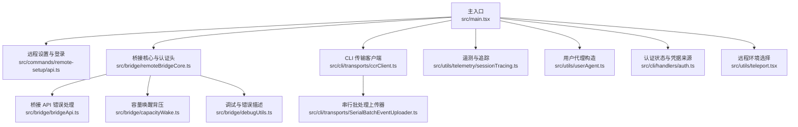
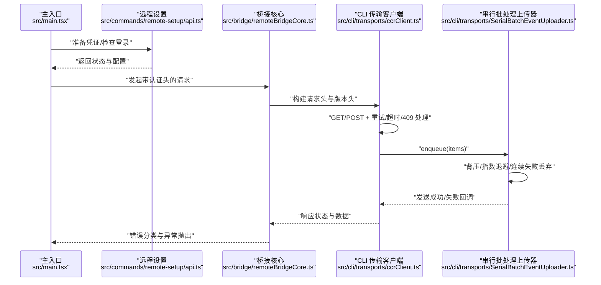
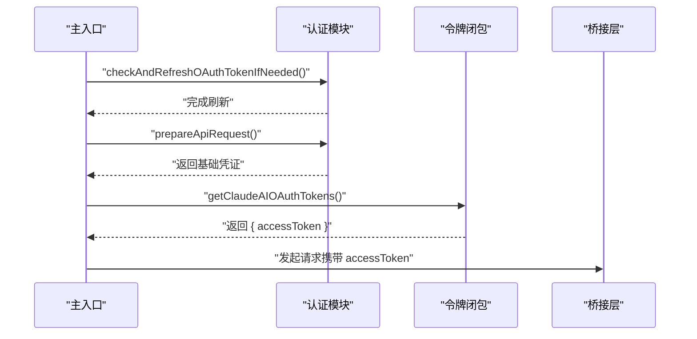
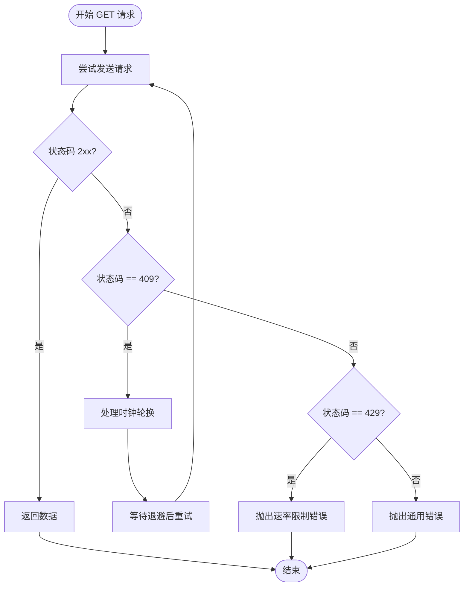
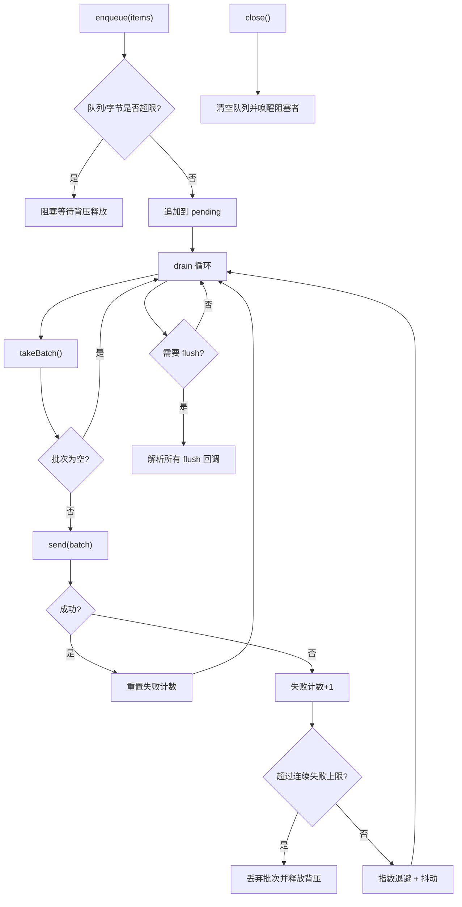
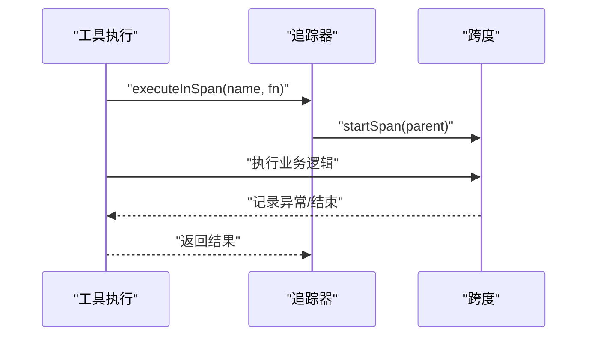
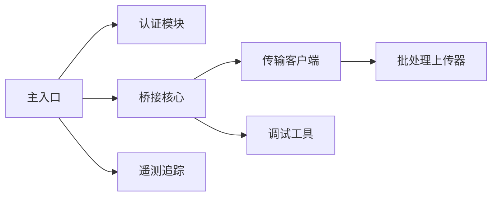

# Go API 技能

<cite>
**本文引用的文件**
- [src/main.tsx](file://src/main.tsx)
- [src/commands/remote-setup/api.ts](file://src/commands/remote-setup/api.ts)
- [src/bridge/remoteBridgeCore.ts](file://src/bridge/remoteBridgeCore.ts)
- [src/bridge/bridgeApi.ts](file://src/bridge/bridgeApi.ts)
- [src/cli/transports/ccrClient.ts](file://src/cli/transports/ccrClient.ts)
- [src/cli/transports/SerialBatchEventUploader.ts](file://src/cli/transports/SerialBatchEventUploader.ts)
- [src/utils/telemetry/sessionTracing.ts](file://src/utils/telemetry/sessionTracing.ts)
- [src/utils/userAgent.ts](file://src/utils/userAgent.ts)
- [src/bridge/capacityWake.ts](file://src/bridge/capacityWake.ts)
- [src/cli/handlers/auth.ts](file://src/cli/handlers/auth.ts)
- [src/utils/teleport.tsx](file://src/utils/teleport.tsx)
- [src/bridge/debugUtils.ts](file://src/bridge/debugUtils.ts)
</cite>

## 目录
1. [简介](#简介)
2. [项目结构](#项目结构)
3. [核心组件](#核心组件)
4. [架构总览](#架构总览)
5. [组件详解](#组件详解)
6. [依赖关系分析](#依赖关系分析)
7. [性能考量](#性能考量)
8. [故障排查指南](#故障排查指南)
9. [结论](#结论)
10. [附录](#附录)

## 简介
本文件面向希望在 Go 项目中集成 Claude API 的开发者，系统性梳理该仓库中与 Claude API 相关的认证、请求封装、重试与批处理、遥测与调试等能力，并给出在 Go 中进行并发安全调用、批量处理、文件上传与工具使用的实践建议。尽管仓库主体为 TypeScript/JavaScript，但其设计模式、并发控制策略、错误处理与重试机制均可直接映射到 Go 语言实现。

## 项目结构
围绕 Claude API 的相关模块主要分布在以下区域：
- 认证与入口：主进程入口负责准备 API 请求凭证与令牌刷新；远程设置与登录状态检查。
- 桥接与传输：桥接层负责 WebSocket 连接与请求头注入；CLI 传输层提供 HTTP 客户端与事件批处理器。
- 批量与重试：串行批处理上传器支持背压、指数退避与失败丢弃策略。
- 遥测与调试：OpenTelemetry 跨上下文追踪与调试日志裁剪。
- 工具与权限：远程环境选择、通道启用与权限处理。

图表来源
- [src/main.tsx:3315-3328](file://src/main.tsx#L3315-L3328)
- [src/commands/remote-setup/api.ts:140-182](file://src/commands/remote-setup/api.ts#L140-L182)
- [src/bridge/remoteBridgeCore.ts:74-87](file://src/bridge/remoteBridgeCore.ts#L74-L87)
- [src/bridge/bridgeApi.ts:454-500](file://src/bridge/bridgeApi.ts#L454-L500)
- [src/cli/transports/ccrClient.ts:556-944](file://src/cli/transports/ccrClient.ts#L556-L944)
- [src/cli/transports/SerialBatchEventUploader.ts:35-189](file://src/cli/transports/SerialBatchEventUploader.ts#L35-L189)
- [src/utils/telemetry/sessionTracing.ts:778-927](file://src/utils/telemetry/sessionTracing.ts#L778-L927)
- [src/utils/userAgent.ts:8-10](file://src/utils/userAgent.ts#L8-L10)
- [src/bridge/capacityWake.ts:28-56](file://src/bridge/capacityWake.ts#L28-L56)
- [src/cli/handlers/auth.ts:232-260](file://src/cli/handlers/auth.ts#L232-L260)
- [src/utils/teleport.tsx:1062-1080](file://src/utils/teleport.tsx#L1062-L1080)
- [src/bridge/debugUtils.ts:45-82](file://src/bridge/debugUtils.ts#L45-L82)

章节来源
- [src/main.tsx:3315-3328](file://src/main.tsx#L3315-L3328)
- [src/commands/remote-setup/api.ts:140-182](file://src/commands/remote-setup/api.ts#L140-L182)
- [src/bridge/remoteBridgeCore.ts:74-87](file://src/bridge/remoteBridgeCore.ts#L74-L87)
- [src/cli/transports/ccrClient.ts:556-944](file://src/cli/transports/ccrClient.ts#L556-L944)
- [src/cli/transports/SerialBatchEventUploader.ts:35-189](file://src/cli/transports/SerialBatchEventUploader.ts#L35-L189)
- [src/utils/telemetry/sessionTracing.ts:778-927](file://src/utils/telemetry/sessionTracing.ts#L778-L927)
- [src/utils/userAgent.ts:8-10](file://src/utils/userAgent.ts#L8-L10)
- [src/bridge/capacityWake.ts:28-56](file://src/bridge/capacityWake.ts#L28-L56)
- [src/cli/handlers/auth.ts:232-260](file://src/cli/handlers/auth.ts#L232-L260)
- [src/utils/teleport.tsx:1062-1080](file://src/utils/teleport.tsx#L1062-L1080)
- [src/bridge/debugUtils.ts:45-82](file://src/bridge/debugUtils.ts#L45-L82)

## 核心组件
- 认证与入口
  - 主入口准备 API 凭证并按需刷新 OAuth 令牌，随后生成可复用的访问令牌闭包以确保重连后获取新鲜令牌。
  - 远程设置接口用于创建默认环境配置并校验网络与语言支持。
- 桥接与传输
  - 桥接核心统一注入认证头与 API 版本头；桥接 API 对常见状态码进行致命错误与速率限制区分。
  - CLI 传输客户端封装 HTTP 请求，统一处理 409 时钟轮换、超时与重试逻辑。
- 批量与重试
  - 串行批处理上传器支持最大队列长度、批次大小与字节上限，具备指数退避、抖动与连续失败丢弃策略。
- 遥测与调试
  - 基于 OpenTelemetry 的跨上下文追踪，支持在工具执行与钩子阶段记录跨度与结果元数据。
  - 调试工具对敏感信息脱敏与消息截断，便于日志输出。
- 权限与环境
  - 认证状态检测与凭据来源识别；远程环境选择优先标准云环境，避免不可用 BYOC 环境导致静默失败。

章节来源
- [src/main.tsx:3315-3328](file://src/main.tsx#L3315-L3328)
- [src/commands/remote-setup/api.ts:140-182](file://src/commands/remote-setup/api.ts#L140-L182)
- [src/bridge/remoteBridgeCore.ts:74-87](file://src/bridge/remoteBridgeCore.ts#L74-L87)
- [src/bridge/bridgeApi.ts:454-500](file://src/bridge/bridgeApi.ts#L454-L500)
- [src/cli/transports/ccrClient.ts:556-944](file://src/cli/transports/ccrClient.ts#L556-L944)
- [src/cli/transports/SerialBatchEventUploader.ts:35-189](file://src/cli/transports/SerialBatchEventUploader.ts#L35-L189)
- [src/utils/telemetry/sessionTracing.ts:778-927](file://src/utils/telemetry/sessionTracing.ts#L778-L927)
- [src/bridge/debugUtils.ts:45-82](file://src/bridge/debugUtils.ts#L45-L82)
- [src/cli/handlers/auth.ts:232-260](file://src/cli/handlers/auth.ts#L232-L260)
- [src/utils/teleport.tsx:1062-1080](file://src/utils/teleport.tsx#L1062-L1080)

## 架构总览
下图展示了从主入口到桥接与传输的关键调用链路，以及批处理与重试的闭环。

图表来源
- [src/main.tsx:3315-3328](file://src/main.tsx#L3315-L3328)
- [src/commands/remote-setup/api.ts:140-182](file://src/commands/remote-setup/api.ts#L140-L182)
- [src/bridge/remoteBridgeCore.ts:74-87](file://src/bridge/remoteBridgeCore.ts#L74-L87)
- [src/cli/transports/ccrClient.ts:556-944](file://src/cli/transports/ccrClient.ts#L556-L944)
- [src/cli/transports/SerialBatchEventUploader.ts:156-189](file://src/cli/transports/SerialBatchEventUploader.ts#L156-L189)

## 组件详解

### 认证与入口（并发安全与令牌刷新）
- 并发安全要点
  - 在主入口处仅一次性准备组织 UUID 相关信息，后续通过闭包获取访问令牌，确保每次调用都能拿到最新令牌，避免过期。
  - 使用组合的取消信号（外层循环信号与容量唤醒控制器）合并中断条件，保证在关闭或容量释放时能及时退出等待。
- 最佳实践
  - 将“准备凭证”与“获取令牌闭包”拆分，避免重复 IO；在高并发场景下，多个 goroutine 可共享同一闭包实例。
  - 结合容量唤醒机制，避免在高负载时无谓阻塞。

图表来源
- [src/main.tsx:3315-3328](file://src/main.tsx#L3315-L3328)
- [src/bridge/capacityWake.ts:28-56](file://src/bridge/capacityWake.ts#L28-L56)

章节来源
- [src/main.tsx:3315-3328](file://src/main.tsx#L3315-L3328)
- [src/bridge/capacityWake.ts:28-56](file://src/bridge/capacityWake.ts#L28-L56)

### 桥接与传输（HTTP 请求与错误处理）
- 请求头与版本
  - 统一注入 Authorization、Content-Type 与 anthropic-version 头部，确保服务端正确识别与路由。
- 错误处理
  - 对 401/403/404/410/429 等状态进行明确分类，429 明确提示速率限制，其他状态抛出致命错误以便上层恢复。
- 超时与重试
  - CLI 传输客户端对 GET 请求采用最多 10 次重试，指数退避叠加随机抖动，遇到 409 时触发时钟轮换处理。

图表来源
- [src/cli/transports/ccrClient.ts:556-944](file://src/cli/transports/ccrClient.ts#L556-L944)
- [src/bridge/bridgeApi.ts:454-500](file://src/bridge/bridgeApi.ts#L454-L500)

章节来源
- [src/bridge/remoteBridgeCore.ts:74-87](file://src/bridge/remoteBridgeCore.ts#L74-L87)
- [src/cli/transports/ccrClient.ts:556-944](file://src/cli/transports/ccrClient.ts#L556-L944)
- [src/bridge/bridgeApi.ts:454-500](file://src/bridge/bridgeApi.ts#L454-L500)

### 串行批处理上传器（并发与背压）
- 并发模型
  - 单一“排水线程”（drain）串行发送批次，避免并发写入带来的竞争与乱序。
- 背压与队列
  - 当 pending 队列长度或累计字节超过阈值时阻塞 enqueue，直到 drain 释放空间。
- 重试与丢弃
  - 失败时指数退避并重试；达到连续失败上限后丢弃批次并继续处理后续项，防止雪崩。
- 关闭与刷新
  - 支持 close 清空队列并唤醒所有阻塞的调用方；flush 提供在回合边界或优雅退出前的全量刷写。

图表来源
- [src/cli/transports/SerialBatchEventUploader.ts:35-189](file://src/cli/transports/SerialBatchEventUploader.ts#L35-L189)

章节来源
- [src/cli/transports/SerialBatchEventUploader.ts:35-189](file://src/cli/transports/SerialBatchEventUploader.ts#L35-L189)

### 遥测与调试（跨上下文追踪与日志）
- 跨上下文追踪
  - 在工具执行与钩子阶段创建子跨度，自动继承父级上下文，记录持续时间与执行统计。
- 调试与脱敏
  - 对日志输出的消息进行长度截断与敏感信息脱敏，避免泄露隐私。

图表来源
- [src/utils/telemetry/sessionTracing.ts:788-833](file://src/utils/telemetry/sessionTracing.ts#L788-L833)

章节来源
- [src/utils/telemetry/sessionTracing.ts:778-927](file://src/utils/telemetry/sessionTracing.ts#L778-L927)
- [src/bridge/debugUtils.ts:45-82](file://src/bridge/debugUtils.ts#L45-L82)

### 权限与远程环境（工具使用与通道启用）
- 远程环境选择
  - 优先选择标准云环境（anthropic_cloud），若不存在则重试拉取，避免静默进入不可用 BYOC 环境。
- 认证状态与凭据来源
  - 识别第三方服务、OAuth 令牌、API Key 等多种来源，统一输出认证状态。
- 用户代理与版本
  - 统一注入 User-Agent 与 anthropic-version，确保服务端兼容性。

章节来源
- [src/utils/teleport.tsx:1062-1080](file://src/utils/teleport.tsx#L1062-L1080)
- [src/cli/handlers/auth.ts:232-260](file://src/cli/handlers/auth.ts#L232-L260)
- [src/utils/userAgent.ts:8-10](file://src/utils/userAgent.ts#L8-L10)

## 依赖关系分析
- 组件耦合
  - 主入口依赖认证模块与桥接核心；桥接核心依赖传输客户端；传输客户端依赖批处理上传器。
- 外部依赖
  - HTTP 客户端（axios/内置 HTTP 库）、OpenTelemetry（追踪）、AbortController（取消与背压）。
- 潜在循环
  - 未见明显循环依赖；各模块职责清晰，接口单向依赖。

图表来源
- [src/main.tsx:3315-3328](file://src/main.tsx#L3315-L3328)
- [src/bridge/remoteBridgeCore.ts:74-87](file://src/bridge/remoteBridgeCore.ts#L74-L87)
- [src/cli/transports/ccrClient.ts:556-944](file://src/cli/transports/ccrClient.ts#L556-L944)
- [src/cli/transports/SerialBatchEventUploader.ts:35-189](file://src/cli/transports/SerialBatchEventUploader.ts#L35-L189)
- [src/utils/telemetry/sessionTracing.ts:778-927](file://src/utils/telemetry/sessionTracing.ts#L778-L927)
- [src/bridge/debugUtils.ts:45-82](file://src/bridge/debugUtils.ts#L45-L82)

章节来源
- [src/main.tsx:3315-3328](file://src/main.tsx#L3315-L3328)
- [src/bridge/remoteBridgeCore.ts:74-87](file://src/bridge/remoteBridgeCore.ts#L74-L87)
- [src/cli/transports/ccrClient.ts:556-944](file://src/cli/transports/ccrClient.ts#L556-L944)
- [src/cli/transports/SerialBatchEventUploader.ts:35-189](file://src/cli/transports/SerialBatchEventUploader.ts#L35-L189)
- [src/utils/telemetry/sessionTracing.ts:778-927](file://src/utils/telemetry/sessionTracing.ts#L778-L927)
- [src/bridge/debugUtils.ts:45-82](file://src/bridge/debugUtils.ts#L45-L82)

## 性能考量
- 并发模式
  - 使用单一“排水线程”串行发送批次，降低锁竞争与乱序风险；通过背压阻塞生产者，平衡内存占用与吞吐。
- 指数退避与抖动
  - 退避上限与抖动范围可配置，避免雪崩效应；在 429 场景下尊重服务器 Retry-After 提示。
- 超时与重试
  - GET 请求采用固定次数重试与指数退避，结合 409 时钟轮换处理，提升稳定性。
- 遥测与可观测性
  - 跨上下文跨度记录执行统计与耗时，便于定位瓶颈与评估工具效果。

[本节为通用性能讨论，不直接分析具体文件]

## 故障排查指南
- 常见错误与处理
  - 401/403：认证失败或权限不足，需重新登录或检查组织权限。
  - 404/410：会话过期或资源不存在，需重启远程控制会话。
  - 429：速率限制，降低请求频率或增加退避时间。
- 调试技巧
  - 使用调试工具对响应体进行脱敏与截断，避免日志过大；结合遥测跨度查看关键路径耗时。
- 关闭与回滚
  - close 清空队列并唤醒阻塞调用；flush 在回合边界确保事件全部发送。

章节来源
- [src/bridge/bridgeApi.ts:454-500](file://src/bridge/bridgeApi.ts#L454-L500)
- [src/bridge/debugUtils.ts:45-82](file://src/bridge/debugUtils.ts#L45-L82)
- [src/cli/transports/SerialBatchEventUploader.ts:139-150](file://src/cli/transports/SerialBatchEventUploader.ts#L139-L150)

## 结论
该代码库提供了完善的 Claude API 调用基础设施：认证与令牌刷新、统一头部与版本管理、健壮的错误分类与重试、串行批处理与背压控制、跨上下文遥测与调试支持。这些设计模式可直接迁移到 Go 语言实现中，帮助你在高并发场景下安全、稳定地集成 Claude API，并通过批处理与指数退避获得更优的吞吐与可靠性。

[本节为总结性内容，不直接分析具体文件]

## 附录
- 在 Go 中集成建议
  - 使用 goroutine + channel 实现背压；使用 sync.Once 保证凭证初始化只执行一次。
  - 使用 context.WithTimeout 控制请求超时；使用 context.WithCancel 处理速率限制与关闭信号。
  - 使用 net/http 的 RoundTripper 或自定义 Transport 注入认证头与版本头。
  - 使用标准库的 time.Ticker 实现指数退避与抖动；在 409 时触发重试逻辑。
  - 使用 OpenTelemetry Go SDK 记录工具执行跨度与指标，便于观测与排障。

[本节为概念性内容，不直接分析具体文件]