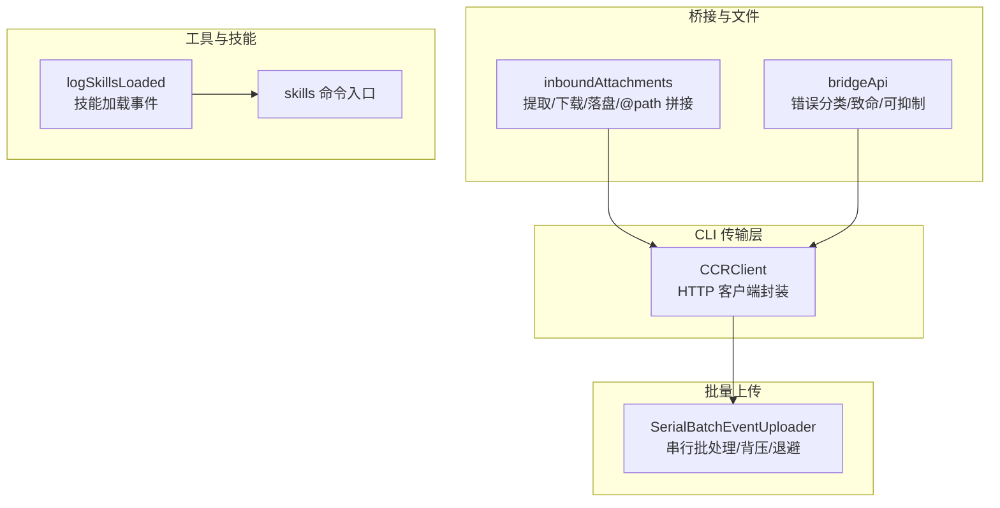
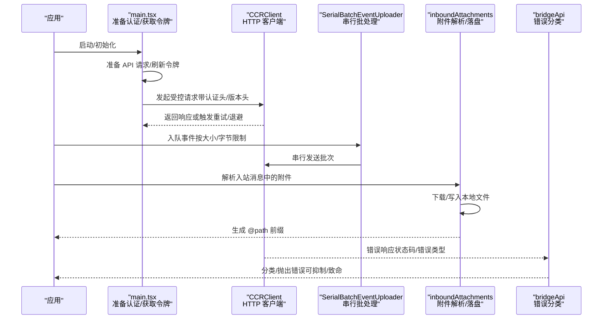
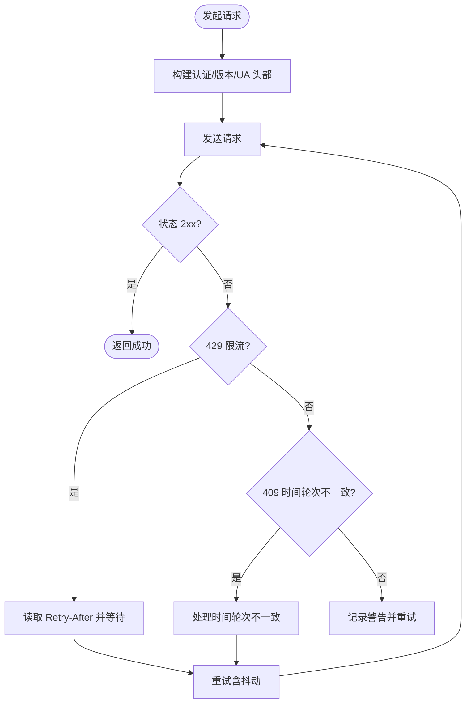
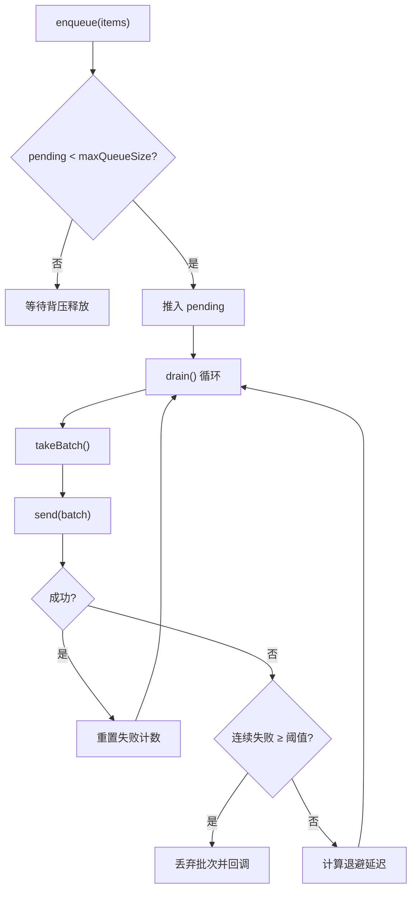
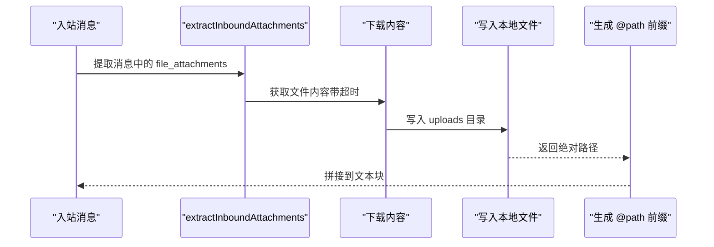
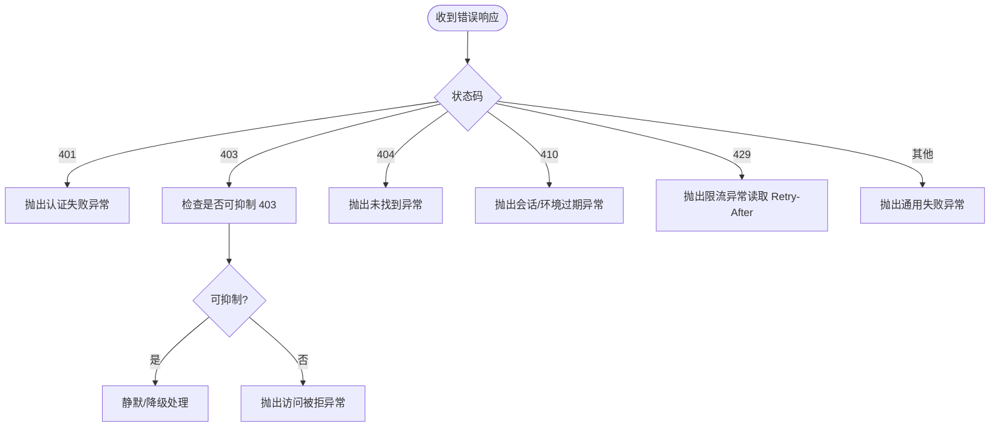
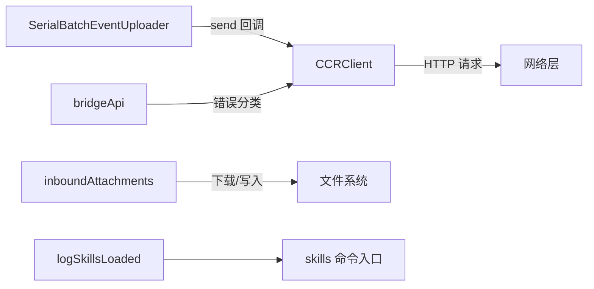

# Java API 技能

<cite>
**本文引用的文件**
- [src/main.tsx](file://src/main.tsx)
- [src/cli/transports/ccrClient.ts](file://src/cli/transports/ccrClient.ts)
- [src/cli/transports/SerialBatchEventUploader.ts](file://src/cli/transports/SerialBatchEventUploader.ts)
- [src/bridge/inboundAttachments.ts](file://src/bridge/inboundAttachments.ts)
- [src/bridge/bridgeApi.ts](file://src/bridge/bridgeApi.ts)
- [src/utils/toolErrors.ts](file://src/utils/toolErrors.ts)
- [src/utils/tempfile.ts](file://src/utils/tempfile.ts)
- [src/utils/telemetry/skillLoadedEvent.ts](file://src/utils/telemetry/skillLoadedEvent.ts)
- [src/commands/skills/index.ts](file://src/commands/skills/index.ts)
</cite>

## 目录
1. [简介](#简介)
2. [项目结构](#项目结构)
3. [核心组件](#核心组件)
4. [架构总览](#架构总览)
5. [详细组件分析](#详细组件分析)
6. [依赖关系分析](#依赖关系分析)
7. [性能考量](#性能考量)
8. [故障排查指南](#故障排查指南)
9. [结论](#结论)
10. [附录](#附录)

## 简介
本文件面向希望在 Java 项目中集成 Claude API 的开发者，系统性梳理仓库中的 API 客户端、批处理上传器、文件附件解析与预处理、桥接层错误处理、以及工具/技能加载等能力，并将其映射到 Java 并发与性能优化的最佳实践。尽管仓库以 TypeScript/JavaScript 为主，但本文通过“代码级映射”的方式，给出 Java 集成的实现路径、线程安全策略、批量处理与重试退避、文件 API 与工具使用建议，以及错误处理与异常管理要点。

## 项目结构
围绕 Claude API 的相关模块主要分布在以下子系统：
- CLI 传输层：HTTP 客户端封装、指数退避重试、请求上下文头注入
- 批量事件上传器：串行批处理、背压控制、失败预算与丢弃策略
- 桥接层与文件附件：入站消息附件提取、下载、落盘、@path 前缀拼接
- 错误处理与诊断：统一错误格式化、状态码分类、致命/可抑制错误判定
- 工具与技能：技能加载事件记录、命令入口定义

图表来源
- [src/cli/transports/ccrClient.ts:550-944](file://src/cli/transports/ccrClient.ts#L550-L944)
- [src/cli/transports/SerialBatchEventUploader.ts:64-189](file://src/cli/transports/SerialBatchEventUploader.ts#L64-L189)
- [src/bridge/inboundAttachments.ts:1-175](file://src/bridge/inboundAttachments.ts#L1-L175)
- [src/bridge/bridgeApi.ts:454-539](file://src/bridge/bridgeApi.ts#L454-L539)
- [src/utils/telemetry/skillLoadedEvent.ts:1-39](file://src/utils/telemetry/skillLoadedEvent.ts#L1-L39)
- [src/commands/skills/index.ts:1-10](file://src/commands/skills/index.ts#L1-L10)

章节来源
- [src/cli/transports/ccrClient.ts:550-944](file://src/cli/transports/ccrClient.ts#L550-L944)
- [src/cli/transports/SerialBatchEventUploader.ts:64-189](file://src/cli/transports/SerialBatchEventUploader.ts#L64-L189)
- [src/bridge/inboundAttachments.ts:1-175](file://src/bridge/inboundAttachments.ts#L1-L175)
- [src/bridge/bridgeApi.ts:454-539](file://src/bridge/bridgeApi.ts#L454-L539)
- [src/utils/telemetry/skillLoadedEvent.ts:1-39](file://src/utils/telemetry/skillLoadedEvent.ts#L1-L39)
- [src/commands/skills/index.ts:1-10](file://src/commands/skills/index.ts#L1-L10)

## 核心组件
- CCRClient（HTTP 客户端）
  - 统一注入认证头、Anthropic 版本头、User-Agent；支持 GET/POST/PUT；内置 10 次重试与指数退避，带随机抖动；对 429 返回读取 Retry-After；对 409 处理时间轮次不一致；日志记录每次尝试结果。
- SerialBatchEventUploader（串行批处理上传器）
  - 支持按条数与字节数上限的批大小控制；队列容量与背压；连续失败预算与丢弃回调；串行发送，失败后回滚至队首并按退避延迟重试。
- inboundAttachments（入站附件解析与落盘）
  - 提取 file_attachments；下载内容写入本地 ~/.claude/uploads/{sessionId}/；生成 @path 引用前缀；支持字符串与多内容块两种形式的文本拼接；失败时仅跳过该附件，不影响消息投递。
- bridgeApi（桥接层错误处理）
  - 对 401/403/404/410/429 等状态进行分类；区分可抑制 403；提取 error.type 判定会话/环境过期；抛出统一错误类型。
- 工具与技能
  - 记录技能加载事件，包含来源、种类、预算等元数据；skills 命令入口用于列出可用技能。

章节来源
- [src/cli/transports/ccrClient.ts:550-944](file://src/cli/transports/ccrClient.ts#L550-L944)
- [src/cli/transports/SerialBatchEventUploader.ts:64-189](file://src/cli/transports/SerialBatchEventUploader.ts#L64-L189)
- [src/bridge/inboundAttachments.ts:1-175](file://src/bridge/inboundAttachments.ts#L1-L175)
- [src/bridge/bridgeApi.ts:454-539](file://src/bridge/bridgeApi.ts#L454-L539)
- [src/utils/telemetry/skillLoadedEvent.ts:1-39](file://src/utils/telemetry/skillLoadedEvent.ts#L1-L39)
- [src/commands/skills/index.ts:1-10](file://src/commands/skills/index.ts#L1-L10)

## 架构总览
下图展示了从应用启动到 API 请求、批处理上传、文件附件解析与错误处理的整体流程。

图表来源
- [src/main.tsx:3315-3328](file://src/main.tsx#L3315-L3328)
- [src/cli/transports/ccrClient.ts:550-944](file://src/cli/transports/ccrClient.ts#L550-L944)
- [src/cli/transports/SerialBatchEventUploader.ts:64-189](file://src/cli/transports/SerialBatchEventUploader.ts#L64-L189)
- [src/bridge/inboundAttachments.ts:1-175](file://src/bridge/inboundAttachments.ts#L1-L175)
- [src/bridge/bridgeApi.ts:454-539](file://src/bridge/bridgeApi.ts#L454-L539)

## 详细组件分析

### CCRClient（线程安全的 API 调用）
- 线程安全要点
  - 单实例持有底层 HTTP 客户端与认证状态，避免跨线程共享可变配置；每个请求独立构造请求头，减少共享可变字段。
  - 重试逻辑在单次请求内完成，不暴露内部状态给调用方，降低竞态风险。
- 重试与退避
  - 最多重试 10 次；指数退避上限 30 秒；加入随机抖动；对 429 优先读取 Retry-After；对 409 触发时间轮次处理。
- 上下文头与版本
  - 固定注入 Anthropic 版本头与 User-Agent，确保服务端兼容性与可观测性。
- Java 映射建议
  - 使用线程安全的 HttpClient 实例（如 Apache HttpClient 或 OkHttp）；为每个请求构建不可变的头部对象；对幂等操作启用指数退避与抖动；对 429 读取 Retry-After 并遵守；对 409 触发重新鉴权流程。

图表来源
- [src/cli/transports/ccrClient.ts:550-944](file://src/cli/transports/ccrClient.ts#L550-L944)

章节来源
- [src/cli/transports/ccrClient.ts:550-944](file://src/cli/transports/ccrClient.ts#L550-L944)

### SerialBatchEventUploader（批量处理与背压）
- 批大小与字节限制
  - maxBatchSize 控制条目数量；maxBatchBytes 控制序列化后的字节上限；首个条目总是放入，后续条目按累计字节判断。
- 背压与队列
  - 当 pending 队列达到 maxQueueSize 时，enqueue() 将阻塞直到有空间；drain() 循环串行发送，避免并发竞争。
- 失败策略
  - 连续失败超过阈值则丢弃当前批次并移动到下一个批次；提供 onBatchDropped 回调用于监控与告警。
- Java 映射建议
  - 使用阻塞队列（如 ArrayBlockingQueue）作为 pending 缓冲；使用单线程执行器串行调度 send(batch)；在 send 失败时回滚批次至队首；基于失败次数计算退避延迟；对 maxConsecutiveFailures 设置合理阈值并记录 droppedBatchCount。

图表来源
- [src/cli/transports/SerialBatchEventUploader.ts:64-189](file://src/cli/transports/SerialBatchEventUploader.ts#L64-L189)

章节来源
- [src/cli/transports/SerialBatchEventUploader.ts:64-189](file://src/cli/transports/SerialBatchEventUploader.ts#L64-L189)

### inboundAttachments（文件 API 与工具使用）
- 功能概述
  - 从入站消息中提取 file_attachments；通过 OAuth 授权下载内容；写入本地目录 ~/.claude/uploads/{sessionId}/；生成 @path 引用前缀；支持字符串与多内容块两种形式的文本拼接。
- 安全与健壮性
  - 文件名清洗，避免路径穿越；失败时仅跳过该附件，不影响整体消息投递；下载超时控制。
- Java 映射建议
  - 在 Java 中使用安全的文件命名策略（如只保留字母数字点划线）；使用异步/非阻塞 IO 写入临时目录；对网络异常与磁盘异常分别处理；在消息体中插入 @path 引用时注意转义与空格处理。

图表来源
- [src/bridge/inboundAttachments.ts:1-175](file://src/bridge/inboundAttachments.ts#L1-L175)

章节来源
- [src/bridge/inboundAttachments.ts:1-175](file://src/bridge/inboundAttachments.ts#L1-L175)

### bridgeApi（错误处理与异常管理）
- 错误分类
  - 401：认证失败；403：访问被拒（可抑制）；404：未找到；410：会话/环境过期；429：限流；其他：通用失败。
- 可抑制 403 判定
  - 基于错误信息关键词判断是否为权限不足导致的功能降级，不应直接呈现给用户。
- Java 映射建议
  - 在 Java 中定义统一的异常层次（如 AuthenticationFailed、AccessDenied、RateLimited、ExpiredSession 等）；对可抑制错误进行静默或降级处理；对 429 严格遵守 Retry-After；对 409 重新鉴权。

图表来源
- [src/bridge/bridgeApi.ts:454-539](file://src/bridge/bridgeApi.ts#L454-L539)

章节来源
- [src/bridge/bridgeApi.ts:454-539](file://src/bridge/bridgeApi.ts#L454-L539)

### 工具与技能（加载与事件记录）
- 技能加载事件
  - 记录每个可用技能的名称、来源、加载位置、预算与种类，便于分析与审计。
- 命令入口
  - skills 命令用于列出可用技能，便于调试与运维。
- Java 映射建议
  - 在 Java 中维护技能清单与元数据；在会话启动时记录类似事件；提供查询接口列出已加载技能；对技能参数与预算进行校验与缓存。

章节来源
- [src/utils/telemetry/skillLoadedEvent.ts:1-39](file://src/utils/telemetry/skillLoadedEvent.ts#L1-L39)
- [src/commands/skills/index.ts:1-10](file://src/commands/skills/index.ts#L1-L10)

## 依赖关系分析
- 组件耦合
  - CCRClient 与 SerialBatchEventUploader 通过 send 回调解耦；inboundAttachments 与 bridgeApi 通过错误类型与状态码协作；工具/技能事件与命令入口相互独立。
- 外部依赖
  - HTTP 客户端（Axios）、文件系统（fs/promises）、路径工具（path）、Zod 校验、加密与随机（crypto）、日志与调试工具。
- Java 依赖映射
  - HttpClient/OkHttp 替代 Axios；NIO.2 替代 fs/promises；Path/Files 替代 path；JSON Schema/验证库替代 Zod；SecureRandom 替代 crypto；SLF4J/自定义日志替代 debug。

图表来源
- [src/cli/transports/ccrClient.ts:550-944](file://src/cli/transports/ccrClient.ts#L550-L944)
- [src/cli/transports/SerialBatchEventUploader.ts:64-189](file://src/cli/transports/SerialBatchEventUploader.ts#L64-L189)
- [src/bridge/inboundAttachments.ts:1-175](file://src/bridge/inboundAttachments.ts#L1-L175)
- [src/bridge/bridgeApi.ts:454-539](file://src/bridge/bridgeApi.ts#L454-L539)
- [src/utils/telemetry/skillLoadedEvent.ts:1-39](file://src/utils/telemetry/skillLoadedEvent.ts#L1-L39)
- [src/commands/skills/index.ts:1-10](file://src/commands/skills/index.ts#L1-L10)

## 性能考量
- 线程模型
  - CCRClient 采用单实例 + 每请求独立头部，避免锁争用；SerialBatchEventUploader 使用单线程串行发送，简化并发复杂度。
- 批量与背压
  - 通过 maxBatchSize 与 maxBatchBytes 控制吞吐；maxQueueSize 限制内存占用；drain() 循环串行避免竞争。
- 重试与抖动
  - 指数退避 + 随机抖动降低全局拥塞；对 429 严格遵守 Retry-After。
- 文件 I/O
  - 入站附件写入本地目录，避免大对象在网络层反复传输；失败时快速失败，不影响主消息链路。
- Java 优化建议
  - 使用连接池与长连接；对幂等请求启用指数退避；对 429 严格遵守 Retry-After；对磁盘写入使用异步通道；对日志与指标采样输出。

## 故障排查指南
- 认证与权限
  - 401：检查令牌有效性与刷新流程；403：区分可抑制与不可抑制，必要时提示用户检查组织权限。
- 会话/环境过期
  - 410 或错误类型包含 expired/lifetime：提示重启远程控制会话。
- 限流与退避
  - 429：读取 Retry-After 并等待；若未提供，则按最大退避上限等待。
- 网络与超时
  - 下载附件设置超时；HTTP 请求设置超时；对瞬时网络异常进行重试。
- 日志与诊断
  - 统一错误格式化，截断过长输出；记录关键上下文与状态码；对可抑制 403 进行静默或降级。

章节来源
- [src/bridge/bridgeApi.ts:454-539](file://src/bridge/bridgeApi.ts#L454-L539)
- [src/utils/toolErrors.ts:1-41](file://src/utils/toolErrors.ts#L1-L41)
- [src/bridge/inboundAttachments.ts:1-175](file://src/bridge/inboundAttachments.ts#L1-L175)

## 结论
通过将仓库中的客户端封装、批处理上传、文件附件处理与错误分类等能力映射到 Java 并发与性能优化实践中，可以构建稳定、可扩展且具备良好可观测性的 Claude API 集成方案。建议在生产环境中结合连接池、指数退避、背压控制与严格的错误分类策略，确保高并发下的可靠性与低延迟。

## 附录
- Java 集成步骤建议
  - 初始化线程安全的 HTTP 客户端，注入固定头部与认证信息；对幂等请求启用指数退避与抖动；使用单线程串行执行器处理批处理；对 429 严格遵守 Retry-After；对入站附件进行安全落盘与 @path 拼接；对错误进行分类与可抑制处理；记录技能加载事件以便审计与分析。