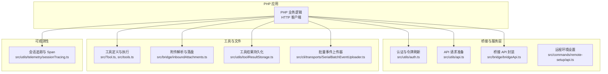
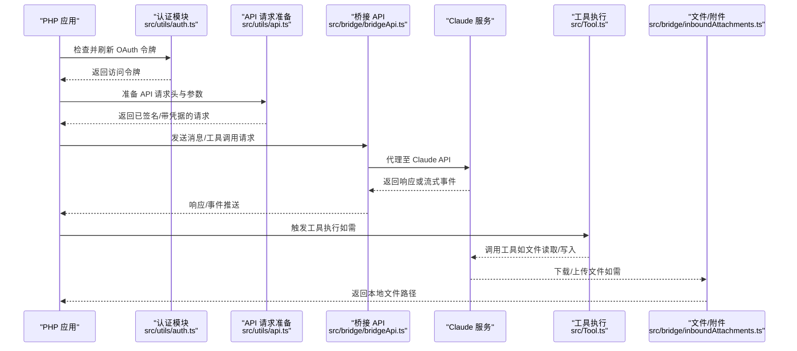
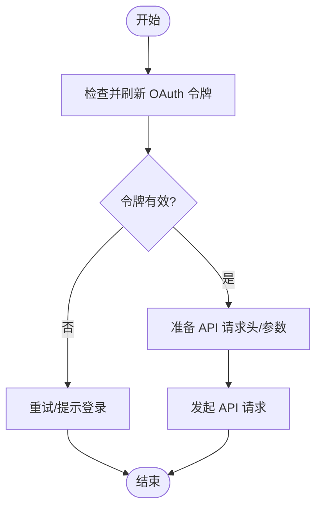
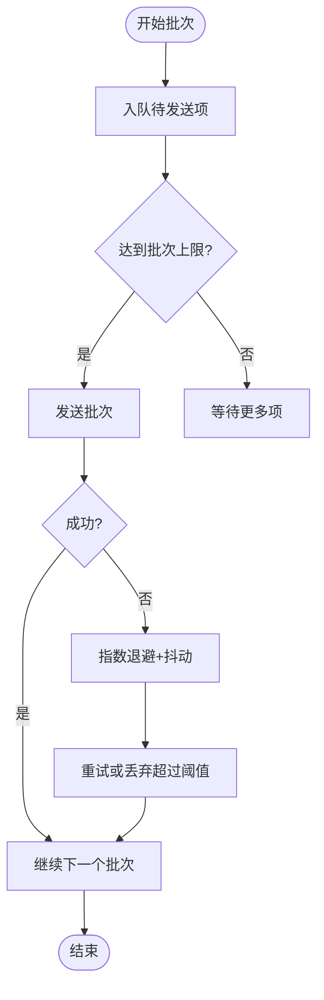
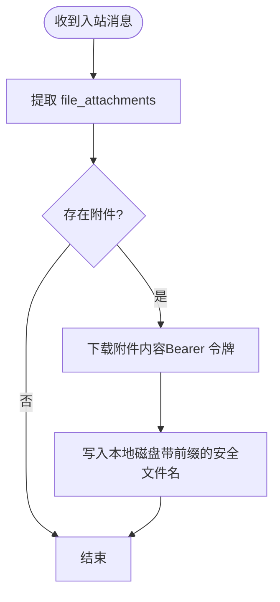
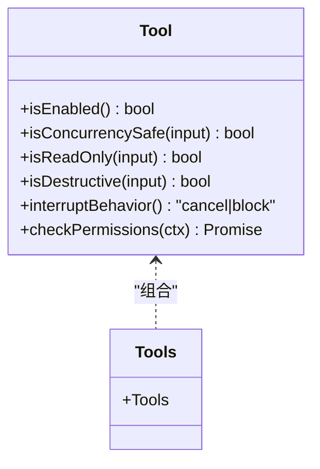
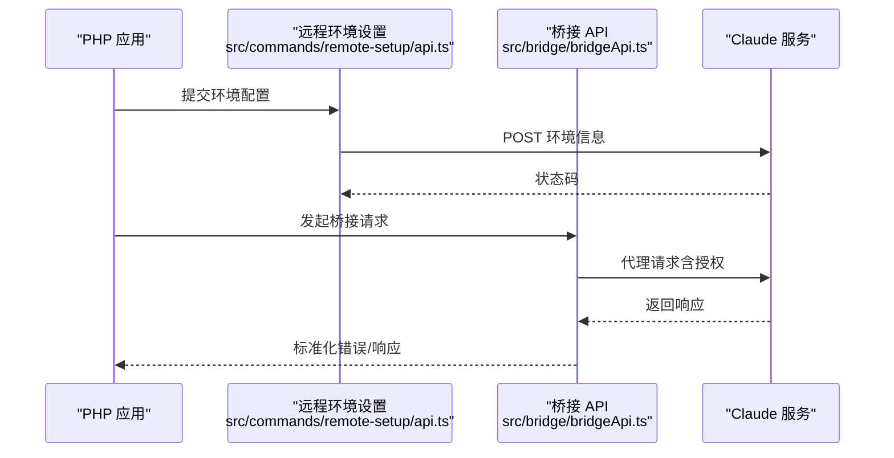
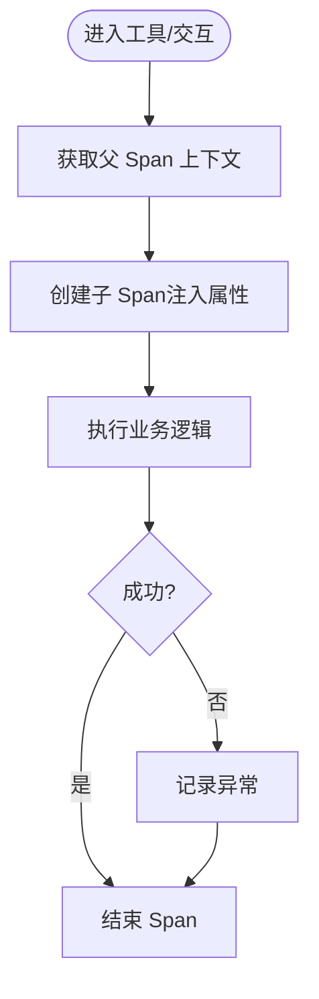
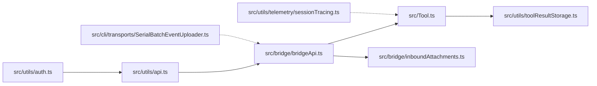

# PHP API 技能

<cite>
**本文引用的文件**   
- [src/main.tsx](file://src/main.tsx)
- [src/commands/remote-setup/api.ts](file://src/commands/remote-setup/api.ts)
- [src/bridge/inboundAttachments.ts](file://src/bridge/inboundAttachments.ts)
- [src/utils/toolResultStorage.ts](file://src/utils/toolResultStorage.ts)
- [src/cli/transports/SerialBatchEventUploader.ts](file://src/cli/transports/SerialBatchEventUploader.ts)
- [src/bridge/bridgeApi.ts](file://src/bridge/bridgeApi.ts)
- [src/utils/toolErrors.ts](file://src/utils/toolErrors.ts)
- [src/Tool.ts](file://src/Tool.ts)
- [src/tools.ts](file://src/tools.ts)
- [src/utils/telemetry/sessionTracing.ts](file://src/utils/telemetry/sessionTracing.ts)
- [src/utils/toolSearch.ts](file://src/utils/toolSearch.ts)
- [src/services/api/](file://src/services/api/)
- [src/services/tools/](file://src/services/tools/)
- [src/components/](file://src/components/)
- [src/hooks/](file://src/hooks/)
- [src/constants/tools.ts](file://src/constants/tools.ts)
- [src/types/generated/](file://src/types/generated/)
- [src/utils/api.ts](file://src/utils/api.ts)
- [src/utils/auth.ts](file://src/utils/auth.ts)
- [src/utils/errors.ts](file://src/utils/errors.ts)
- [src/utils/messages.ts](file://src/utils/messages.ts)
- [src/utils/processUserInput.ts](file://src/utils/processUserInput.ts)
- [src/utils/shell/](file://src/utils/shell/)
- [src/utils/telemetry/](file://src/utils/telemetry/)
- [src/utils/nativeInstaller/](file://src/utils/nativeInstaller/)
- [src/utils/settings/](file://src/utils/settings/)
- [src/utils/permissions/](file://src/utils/permissions/)
- [src/utils/plugins/](file://src/utils/plugins/)
- [src/utils/telemetry/sessionTracing.ts](file://src/utils/telemetry/sessionTracing.ts)
- [src/utils/telemetry/trace.ts](file://src/utils/telemetry/trace.ts)
- [src/utils/telemetry/span.ts](file://src/utils/telemetry/span.ts)
- [src/utils/telemetry/context.ts](file://src/utils/telemetry/context.ts)
- [src/utils/telemetry/attributes.ts](file://src/utils/telemetry/attributes.ts)
- [src/utils/telemetry/otel.ts](file://src/utils/telemetry/otel.ts)
- [src/utils/telemetry/tracer.ts](file://src/utils/telemetry/tracer.ts)
- [src/utils/telemetry/propagator.ts](file://src/utils/telemetry/propagator.ts)
- [src/utils/telemetry/tracestate.ts](file://src/utils/telemetry/tracestate.ts)
- [src/utils/telemetry/traceparent.ts](file://src/utils/telemetry/traceparent.ts)
- [src/utils/telemetry/traceflags.ts](file://src/utils/telemetry/traceflags.ts)
- [src/utils/telemetry/tracecontext.ts](file://src/utils/telemetry/tracecontext.ts)
- [src/utils/telemetry/tracestate.ts](file://src/utils/telemetry/tracestate.ts)
- [src/utils/telemetry/traceparent.ts](file://src/utils/telemetry/traceparent.ts)
- [src/utils/telemetry/traceflags.ts](file://src/utils/telemetry/traceflags.ts)
- [src/utils/telemetry/tracecontext.ts](file://src/utils/telemetry/tracecontext.ts)
- [src/utils/telemetry/tracestate.ts](file://src/utils/telemetry/tracestate.ts)
- [src/utils/telemetry/traceparent.ts](file://src/utils/telemetry/traceparent.ts)
- [src/utils/telemetry/traceflags.ts](file://src/utils/telemetry/traceflags.ts)
- [src/utils/telemetry/tracecontext.ts](file://src/utils/telemetry/tracecontext.ts)
- [src/utils/telemetry/tracestate.ts](file://src/utils/telemetry/tracestate.ts)
- [src/utils/telemetry/traceparent.ts](file://src/utils/telemetry/traceparent.ts)
- [src/utils/telemetry/traceflags.ts](file://src/utils/telemetry/traceflags.ts)
- [src/utils/telemetry/tracecontext.ts](file://src/utils/telemetry/tracecontext.ts)
- [src/utils/telemetry/tracestate.ts](file://src/utils/telemetry/tracestate.ts)
- [src/utils/telemetry/traceparent.ts](file://src/utils/telemetry/traceparent.ts)
- [src/utils/telemetry/traceflags.ts](file://src/utils/telemetry/traceflags.ts)
- [src/utils/telemetry/tracecontext.ts](file://src/utils/telemetry/tracecontext.ts)
- [src/utils/telemetry/tracestate.ts](file://src/utils/telemetry/tracestate.ts)
- [src/utils/telemetry/traceparent.ts](file://src/utils/telemetry/traceparent.ts)
- [src/utils/telemetry/traceflags.ts](file://src/utils/telemetry/traceflags.ts)
- [src/utils/telemetry/tracecontext.ts](file://src/utils/telemetry/tracecontext.ts)
- [src/utils/telemetry/tracestate.ts](file://src......)
</cite>

## 目录
1. [简介](#简介)
2. [项目结构](#项目结构)
3. [核心组件](#核心组件)
4. [架构总览](#架构总览)
5. [详细组件分析](#详细组件分析)
6. [依赖关系分析](#依赖关系分析)
7. [性能考量](#性能考量)
8. [故障排查指南](#故障排查指南)
9. [结论](#结论)
10. [附录](#附录)

## 简介
本文件面向希望在 PHP 项目中集成 Claude API 的开发者，系统性介绍如何在 PHP 中调用 Claude API（含异步流式响应）、进行批量消息处理、使用文件 API 以及工具（Tool）机制。文档基于仓库中的 TypeScript 实现，提炼出可移植到 PHP 的设计模式与最佳实践，并提供分层讲解、流程图与时序图帮助理解。

为便于 PHP 工程师快速落地，本文将：
- 解释 Claude API 的认证与请求准备流程
- 展示异步消息流与批量处理的实现思路
- 说明文件上传/下载与附件处理的要点
- 总结工具（Tool）的权限、并发与结果持久化策略
- 给出错误处理、异常管理与可观测性的建议

## 项目结构
该仓库以 TypeScript 构建，前端与后端服务通过桥接层与工具集协作。与 PHP 集成相关的关键路径包括：
- 认证与 API 请求准备：src/main.tsx、src/utils/auth.ts、src/utils/api.ts
- 远程环境与远程控制：src/commands/remote-setup/api.ts、src/bridge/bridgeApi.ts
- 文件与附件：src/bridge/inboundAttachments.ts、src/utils/toolResultStorage.ts
- 批量事件上传器：src/cli/transports/SerialBatchEventUploader.ts
- 工具体系：src/Tool.ts、src/tools.ts、src/utils/toolSearch.ts
- 错误与日志：src/utils/toolErrors.ts、src/utils/errors.ts
- 可观测性：src/utils/telemetry/sessionTracing.ts 及其相关模块

图表来源
- [src/main.tsx](file://src/main.tsx)
- [src/utils/auth.ts](file://src/utils/auth.ts)
- [src/utils/api.ts](file://src/utils/api.ts)
- [src/bridge/bridgeApi.ts](file://src/bridge/bridgeApi.ts)
- [src/commands/remote-setup/api.ts](file://src/commands/remote-setup/api.ts)
- [src/Tool.ts](file://src/Tool.ts)
- [src/tools.ts](file://src/tools.ts)
- [src/bridge/inboundAttachments.ts](file://src/bridge/inboundAttachments.ts)
- [src/utils/toolResultStorage.ts](file://src/utils/toolResultStorage.ts)
- [src/cli/transports/SerialBatchEventUploader.ts](file://src/cli/transports/SerialBatchEventUploader.ts)
- [src/utils/telemetry/sessionTracing.ts](file://src/utils/telemetry/sessionTracing.ts)

章节来源
- [src/main.tsx](file://src/main.tsx)
- [src/utils/auth.ts](file://src/utils/auth.ts)
- [src/utils/api.ts](file://src/utils/api.ts)
- [src/bridge/bridgeApi.ts](file://src/bridge/bridgeApi.ts)
- [src/commands/remote-setup/api.ts](file://src/commands/remote-setup/api.ts)
- [src/Tool.ts](file://src/Tool.ts)
- [src/tools.ts](file://src/tools.ts)
- [src/bridge/inboundAttachments.ts](file://src/bridge/inboundAttachments.ts)
- [src/utils/toolResultStorage.ts](file://src/utils/toolResultStorage.ts)
- [src/cli/transports/SerialBatchEventUploader.ts](file://src/cli/transports/SerialBatchEventUploader.ts)
- [src/utils/telemetry/sessionTracing.ts](file://src/utils/telemetry/sessionTracing.ts)

## 核心组件
- 认证与令牌刷新：在应用启动时检查并刷新 OAuth 令牌，随后生成 API 凭据；PHP 可参考此流程在每次请求前确保访问令牌有效。
- 桥接 API 封装：对远程控制与桥接接口进行统一封装，包含状态码处理、错误类型提取与可抑制 403 判断等。
- 工具体系：工具具备并发安全、只读/破坏性标记、中断行为、权限校验等能力；PHP 可据此设计工具注册与执行框架。
- 文件与附件：支持从入站消息中提取文件附件、下载内容并落盘，同时进行文件名清洗与路径组织。
- 批量上传器：串行批处理上传器支持最大批次大小、字节限制、队列长度、指数退避与抖动、连续失败阈值与丢弃回调。
- 可观测性：提供会话级 Span 创建、属性注入与异常记录，便于在 PHP 中建立统一的链路追踪。

章节来源
- [src/main.tsx](file://src/main.tsx)
- [src/bridge/bridgeApi.ts](file://src/bridge/bridgeApi.ts)
- [src/Tool.ts](file://src/Tool.ts)
- [src/bridge/inboundAttachments.ts](file://src/bridge/inboundAttachments.ts)
- [src/cli/transports/SerialBatchEventUploader.ts](file://src/cli/transports/SerialBatchEventUploader.ts)
- [src/utils/telemetry/sessionTracing.ts](file://src/utils/telemetry/sessionTracing.ts)

## 架构总览
下图展示了 PHP 应用与 Claude 后端服务之间的交互路径，涵盖认证、请求准备、桥接调用、工具执行与文件处理：

图表来源
- [src/main.tsx](file://src/main.tsx)
- [src/utils/auth.ts](file://src/utils/auth.ts)
- [src/utils/api.ts](file://src/utils/api.ts)
- [src/bridge/bridgeApi.ts](file://src/bridge/bridgeApi.ts)
- [src/Tool.ts](file://src/Tool.ts)
- [src/bridge/inboundAttachments.ts](file://src/bridge/inboundAttachments.ts)

## 详细组件分析

### 认证与 API 请求准备
- 在应用启动阶段，先检查并刷新 OAuth 令牌，再准备 API 请求（获取组织 UUID、生成访问令牌等），随后在每次请求中使用最新令牌。
- PHP 可在中间件或拦截器中实现相同逻辑：在请求前刷新令牌，构造 Authorization 头，必要时重试。

图表来源
- [src/main.tsx](file://src/main.tsx)
- [src/utils/auth.ts](file://src/utils/auth.ts)
- [src/utils/api.ts](file://src/utils/api.ts)

章节来源
- [src/main.tsx](file://src/main.tsx)
- [src/utils/auth.ts](file://src/utils/auth.ts)
- [src/utils/api.ts](file://src/utils/api.ts)

### 异步消息流与批量处理
- 异步消息流：通过流式事件逐步返回内容块（文本/工具使用/停止等），PHP 可使用长连接或 SSE 接收事件，按块拼接输出。
- 批量处理：串行批处理上传器支持最大批次大小、字节上限、队列长度、指数退避与抖动、连续失败阈值与丢弃回调。PHP 可借鉴该策略实现批量事件上报。

图表来源
- [src/cli/transports/SerialBatchEventUploader.ts](file://src/cli/transports/SerialBatchEventUploader.ts)

章节来源
- [src/cli/transports/SerialBatchEventUploader.ts](file://src/cli/transports/SerialBatchEventUploader.ts)

### 文件 API 与附件处理
- 入站附件解析：从消息中提取 file_attachments，清洗文件名，下载内容并写入本地目录，避免路径冲突。
- 工具结果持久化：仅支持纯文本内容块的持久化，非文本内容需转换或跳过；PHP 可在工具结果返回后进行类似处理。

图表来源
- [src/bridge/inboundAttachments.ts](file://src/bridge/inboundAttachments.ts)
- [src/utils/toolResultStorage.ts](file://src/utils/toolResultStorage.ts)

章节来源
- [src/bridge/inboundAttachments.ts](file://src/bridge/inboundAttachments.ts)
- [src/utils/toolResultStorage.ts](file://src/utils/toolResultStorage.ts)

### 工具使用与权限
- 工具定义：每个工具可声明是否并发安全、是否只读/破坏性、中断行为、权限校验与用户可见名称等。
- 工具搜索：根据模型兼容性、可用工具集合、权限上下文与阈值决定是否启用工具搜索（tool_reference）。
- PHP 实践：为每个工具提供并发安全保证与只读/破坏性标记；在调用前进行权限校验；支持中断行为以便用户取消。

图表来源
- [src/Tool.ts](file://src/Tool.ts)
- [src/tools.ts](file://src/tools.ts)
- [src/utils/toolSearch.ts](file://src/utils/toolSearch.ts)

章节来源
- [src/Tool.ts](file://src/Tool.ts)
- [src/tools.ts](file://src/tools.ts)
- [src/utils/toolSearch.ts](file://src/utils/toolSearch.ts)

### 远程环境与桥接 API
- 远程环境初始化：向远程控制端点提交环境配置（允许主机、默认主机、语言版本等），用于在受信任网络中运行。
- 桥接 API：统一封装 HTTP 调用，处理 401/403/404/410/429 等状态码，区分致命错误与瞬时错误，并提供可抑制的 403 判断。

图表来源
- [src/commands/remote-setup/api.ts](file://src/commands/remote-setup/api.ts)
- [src/bridge/bridgeApi.ts](file://src/bridge/bridgeApi.ts)

章节来源
- [src/commands/remote-setup/api.ts](file://src/commands/remote-setup/api.ts)
- [src/bridge/bridgeApi.ts](file://src/bridge/bridgeApi.ts)

### 可观测性与链路追踪
- 会话追踪：在工具执行或交互过程中创建 Span，注入属性，记录异常并结束 Span；PHP 可在工具执行前后建立 Span 并记录关键属性。
- 上下文传播：通过工具上下文或交互上下文获取父 Span，确保跨调用链路一致。

图表来源
- [src/utils/telemetry/sessionTracing.ts](file://src/utils/telemetry/sessionTracing.ts)

章节来源
- [src/utils/telemetry/sessionTracing.ts](file://src/utils/telemetry/sessionTracing.ts)

## 依赖关系分析
- 认证与 API 准备：依赖 auth 与 api 工具模块，确保每次请求携带最新令牌。
- 桥接 API：依赖远程控制端点与错误类型提取，提供统一的状态码处理。
- 工具与权限：依赖工具常量与权限模块，确保工具可用性与安全性。
- 文件与附件：依赖桥接 API 获取内容，落盘前进行文件名清洗与目录组织。
- 批量上传器：独立于业务逻辑，专注批处理与重试策略。
- 可观测性：贯穿工具与服务层，提供统一的追踪与属性注入。

图表来源
- [src/utils/auth.ts](file://src/utils/auth.ts)
- [src/utils/api.ts](file://src/utils/api.ts)
- [src/bridge/bridgeApi.ts](file://src/bridge/bridgeApi.ts)
- [src/Tool.ts](file://src/Tool.ts)
- [src/utils/toolResultStorage.ts](file://src/utils/toolResultStorage.ts)
- [src/bridge/inboundAttachments.ts](file://src/bridge/inboundAttachments.ts)
- [src/cli/transports/SerialBatchEventUploader.ts](file://src/cli/transports/SerialBatchEventUploader.ts)
- [src/utils/telemetry/sessionTracing.ts](file://src/utils/telemetry/sessionTracing.ts)

章节来源
- [src/utils/auth.ts](file://src/utils/auth.ts)
- [src/utils/api.ts](file://src/utils/api.ts)
- [src/bridge/bridgeApi.ts](file://src/bridge/bridgeApi.ts)
- [src/Tool.ts](file://src/Tool.ts)
- [src/utils/toolResultStorage.ts](file://src/utils/toolResultStorage.ts)
- [src/bridge/inboundAttachments.ts](file://src/bridge/inboundAttachments.ts)
- [src/cli/transports/SerialBatchEventUploader.ts](file://src/cli/transports/SerialBatchEventUploader.ts)
- [src/utils/telemetry/sessionTracing.ts](file://src/utils/telemetry/sessionTracing.ts)

## 性能考量
- 并发与批处理：优先使用串行批处理上传器的策略（最大批次、字节限制、队列长度、指数退避与抖动），避免频繁小包导致的网络开销。
- 工具并发安全：仅在工具声明并发安全时并行执行，减少锁竞争与资源争用。
- 流式响应：在 PHP 中采用流式读取（SSE 或长连接），边接收边输出，降低首字节延迟。
- 缓存与去重：对重复请求进行缓存（如工具输入等价性判断），减少不必要的调用。
- 资源清理：及时关闭文件句柄、释放内存与断开连接，避免资源泄漏。

## 故障排查指南
- 认证失败（401）：检查 OAuth 令牌是否过期或无效，触发刷新流程并重试。
- 权限不足（403）：确认组织权限与作用域，必要时提升角色或调整策略。
- 资源不存在（404）：检查远程控制端点与会话状态。
- 会话过期（410）：重新启动远程控制会话。
- 速率限制（429）：降低请求频率或增加退避时间。
- 工具执行错误：捕获并格式化错误信息，区分中断、Shell 错误与通用错误，限制输出长度防止日志膨胀。
- 附件下载失败：检查 Bearer 令牌、超时与网络状况，必要时重试或降级处理。

章节来源
- [src/bridge/bridgeApi.ts](file://src/bridge/bridgeApi.ts)
- [src/utils/toolErrors.ts](file://src/utils/toolErrors.ts)
- [src/utils/errors.ts](file://src/utils/errors.ts)

## 结论
通过借鉴本仓库中的认证流程、桥接封装、工具体系、文件处理与批处理策略，PHP 项目可以稳健地集成 Claude API。建议在生产环境中：
- 将认证与请求准备模块化，确保每次请求携带最新令牌
- 使用批处理与指数退避策略优化网络与服务端压力
- 对工具执行进行权限校验与并发安全评估
- 借助可观测性建立统一的链路追踪与错误记录
- 在文件与附件处理上做好清洗与落盘策略，保障稳定性与安全性

## 附录
- PHP 集成清单
  - 认证：在中间件中刷新 OAuth 令牌，构造 Authorization 头
  - 请求：封装 API 请求准备，支持重试与超时
  - 消息流：实现流式事件接收与拼接
  - 工具：定义工具接口，标注并发安全与只读/破坏性
  - 文件：解析附件、下载内容、清洗文件名、落盘
  - 批处理：实现串行批处理上传器策略
  - 可观测性：在关键节点创建 Span，记录属性与异常