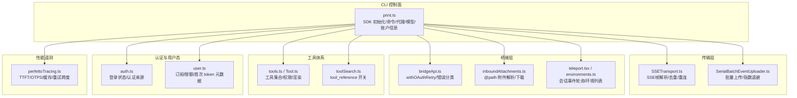
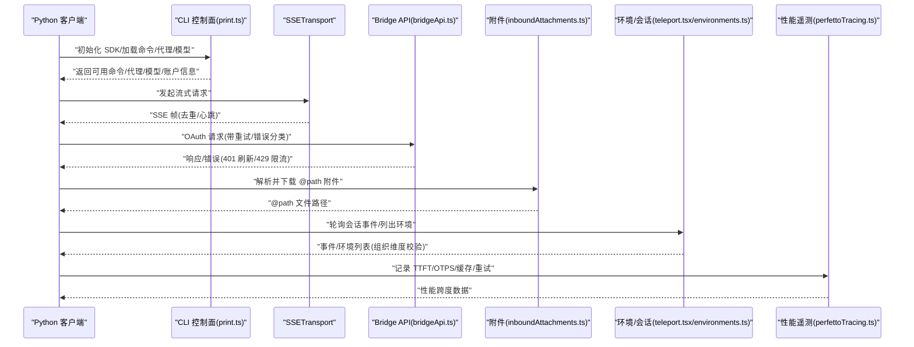
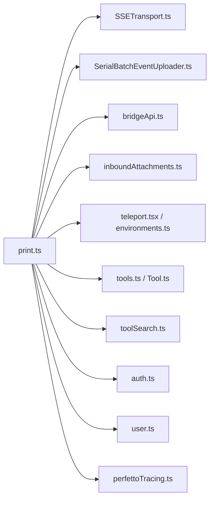

# Python API 技能

<cite>
**本文引用的文件**
- [src/main.tsx](file://src/main.tsx)
- [src/cli/print.ts](file://src/cli/print.ts)
- [src/cli/transports/SSETransport.ts](file://src/cli/transports/SSETransport.ts)
- [src/cli/transports/SerialBatchEventUploader.ts](file://src/cli/transports/SerialBatchEventUploader.ts)
- [src/bridge/bridgeApi.ts](file://src/bridge/bridgeApi.ts)
- [src/bridge/inboundAttachments.ts](file://src/bridge/inboundAttachments.ts)
- [src/utils/teleport.tsx](file://src/utils/teleport.tsx)
- [src/utils/teleport/environments.ts](file://src/utils/teleport/environments.ts)
- [src/utils/user.ts](file://src/utils/user.ts)
- [src/utils/telemetry/perfettoTracing.ts](file://src/utils/telemetry/perfettoTracing.ts)
- [src/tools.ts](file://src/tools.ts)
- [src/Tool.ts](file://src/Tool.ts)
- [src/utils/toolSearch.ts](file://src/utils/toolSearch.ts)
- [src/cli/handlers/auth.ts](file://src/cli/handlers/auth.ts)
- [src/commands/remote-setup/api.ts](file://src/commands/remote-setup/api.ts)
- [src/utils/userAgent.ts](file://src/utils/userAgent.ts)
</cite>

## 目录
1. [简介](#简介)
2. [项目结构](#项目结构)
3. [核心组件](#核心组件)
4. [架构总览](#架构总览)
5. [组件详解](#组件详解)
6. [依赖关系分析](#依赖关系分析)
7. [性能考量](#性能考量)
8. [故障排查指南](#故障排查指南)
9. [结论](#结论)
10. [附录](#附录)

## 简介
本文件面向希望在 Python 项目中集成 Claude API 的开发者，系统性介绍以下能力与最佳实践：
- 基础消息 API 调用流程与参数组织
- 批量事件上传与重试策略
- 文件附件上传与读取（含桥接下载）
- 流式响应（SSE）解析与去重
- 工具使用与工具搜索（tool_use 与 tool_reference）
- 认证与授权（OAuth 令牌刷新、组织维度校验）
- 性能观测与优化建议（TTFT/OTPS/缓存命中等）

为便于落地，文档提供可直接定位到源码的路径指引，并以图示方式呈现关键调用链路。

## 项目结构
围绕 Python Claude API 技能，本仓库的关键实现分布在如下模块：
- CLI 控制面：SDK 初始化、命令导出、钩子回调注册、输出样式与模型列表
- 传输层：SSE 解析、序列化批上传、指数退避与去重
- 桥接层：OAuth 请求封装、重试与错误分类、环境与会话事件轮询
- 工具体系：工具定义、权限检查、工具搜索开关
- 认证与用户态：OAuth 状态查询、订阅与限额元数据注入
- 性能遥测：LLM 请求跨度追踪、首 token 与采样阶段可视化

图表来源
- [src/cli/print.ts:4433-4471](file://src/cli/print.ts#L4433-L4471)
- [src/cli/transports/SSETransport.ts:29-694](file://src/cli/transports/SSETransport.ts#L29-L694)
- [src/cli/transports/SerialBatchEventUploader.ts:35-62](file://src/cli/transports/SerialBatchEventUploader.ts#L35-L62)
- [src/bridge/bridgeApi.ts:73-115](file://src/bridge/bridgeApi.ts#L73-L115)
- [src/bridge/inboundAttachments.ts:1-113](file://src/bridge/inboundAttachments.ts#L1-L113)
- [src/utils/teleport.tsx:618-655](file://src/utils/teleport.tsx#L618-L655)
- [src/utils/teleport/environments.ts:1-43](file://src/utils/teleport/environments.ts#L1-L43)
- [src/tools.ts:1-183](file://src/tools.ts#L1-L183)
- [src/Tool.ts:669-714](file://src/Tool.ts#L669-L714)
- [src/utils/toolSearch.ts:364-392](file://src/utils/toolSearch.ts#L364-L392)
- [src/cli/handlers/auth.ts:232-314](file://src/cli/handlers/auth.ts#L232-L314)
- [src/utils/user.ts:83-102](file://src/utils/user.ts#L83-L102)
- [src/utils/telemetry/perfettoTracing.ts:462-694](file://src/utils/telemetry/perfettoTracing.ts#L462-L694)

章节来源
- [src/cli/print.ts:4433-4471](file://src/cli/print.ts#L4433-L4471)
- [src/cli/transports/SSETransport.ts:29-694](file://src/cli/transports/SSETransport.ts#L29-L694)
- [src/cli/transports/SerialBatchEventUploader.ts:35-62](file://src/cli/transports/SerialBatchEventUploader.ts#L35-L62)
- [src/bridge/bridgeApi.ts:73-115](file://src/bridge/bridgeApi.ts#L73-L115)
- [src/bridge/inboundAttachments.ts:1-113](file://src/bridge/inboundAttachments.ts#L1-L113)
- [src/utils/teleport.tsx:618-655](file://src/utils/teleport.tsx#L618-L655)
- [src/utils/teleport/environments.ts:1-43](file://src/utils/teleport/environments.ts#L1-L43)
- [src/tools.ts:1-183](file://src/tools.ts#L1-L183)
- [src/Tool.ts:669-714](file://src/Tool.ts#L669-L714)
- [src/utils/toolSearch.ts:364-392](file://src/utils/toolSearch.ts#L364-L392)
- [src/cli/handlers/auth.ts:232-314](file://src/cli/handlers/auth.ts#L232-L314)
- [src/utils/user.ts:83-102](file://src/utils/user.ts#L83-L102)
- [src/utils/telemetry/perfettoTracing.ts:462-694](file://src/utils/telemetry/perfettoTracing.ts#L462-L694)

## 核心组件
- SDK 控制面初始化与能力暴露
  - 导出命令、代理、输出样式、可用模型、账户信息等，供 Python 侧通过 CLI/桥接通道消费。
  - 参考路径：[SDK 初始化响应字段:4453-4471](file://src/cli/print.ts#L4453-L4471)
- SSE 流式传输
  - 解析 SSE 帧、去重、心跳保活、指数退避重连。
  - 参考路径：[SSETransport 实现:29-694](file://src/cli/transports/SSETransport.ts#L29-L694)
- 批量事件上传
  - 支持按条数与字节上限的批处理，带指数退避与抖动、连续失败丢弃策略。
  - 参考路径：[SerialBatchEventUploader 配置:35-62](file://src/cli/transports/SerialBatchEventUploader.ts#L35-L62)
- 桥接 API 与认证
  - OAuth 请求封装、单次 401 自动重试、错误类型分类、设备信任头注入。
  - 参考路径：[withOAuthRetry/错误处理:106-115](file://src/bridge/bridgeApi.ts#L106-L115), [错误分类:454-539](file://src/bridge/bridgeApi.ts#L454-L539)
- 文件附件与 @path
  - 解析 inbound 附件、从 OAuth 文件接口下载、写入本地会话目录，生成 @path 引用。
  - 参考路径：[附件解析与下载:41-113](file://src/bridge/inboundAttachments.ts#L41-L113)
- 会话事件轮询与环境管理
  - 会话事件轮询（支持增量 afterId）、组织维度校验；环境列表获取需 OAuth 令牌。
  - 参考路径：[轮询事件:618-655](file://src/utils/teleport.tsx#L618-L655), [环境列表:32-43](file://src/utils/teleport/environments.ts#L32-L43)
- 工具体系与工具搜索
  - 工具集合、权限检查、并发安全标记、工具搜索（tool_reference）开关判定。
  - 参考路径：[工具集合与预设:1-183](file://src/tools.ts#L1-L183), [工具搜索开关:364-392](file://src/utils/toolSearch.ts#L364-L392)
- 认证状态与用户元数据
  - 登录状态查询、认证来源识别、订阅/限额/首次 token 元数据注入。
  - 参考路径：[认证状态:232-314](file://src/cli/handlers/auth.ts#L232-L314), [用户元数据:83-102](file://src/utils/user.ts#L83-L102)
- 性能遥测
  - LLM 请求跨度、TTFT/TTLT、ITPS/OTPS、缓存命中率、重试子跨度。
  - 参考路径：[性能跨度:462-694](file://src/utils/telemetry/perfettoTracing.ts#L462-L694)

章节来源
- [src/cli/print.ts:4453-4471](file://src/cli/print.ts#L4453-L4471)
- [src/cli/transports/SSETransport.ts:29-694](file://src/cli/transports/SSETransport.ts#L29-L694)
- [src/cli/transports/SerialBatchEventUploader.ts:35-62](file://src/cli/transports/SerialBatchEventUploader.ts#L35-L62)
- [src/bridge/bridgeApi.ts:106-115](file://src/bridge/bridgeApi.ts#L106-L115)
- [src/bridge/bridgeApi.ts:454-539](file://src/bridge/bridgeApi.ts#L454-L539)
- [src/bridge/inboundAttachments.ts:41-113](file://src/bridge/inboundAttachments.ts#L41-L113)
- [src/utils/teleport.tsx:618-655](file://src/utils/teleport.tsx#L618-L655)
- [src/utils/teleport/environments.ts:32-43](file://src/utils/teleport/environments.ts#L32-L43)
- [src/tools.ts:1-183](file://src/tools.ts#L1-L183)
- [src/utils/toolSearch.ts:364-392](file://src/utils/toolSearch.ts#L364-L392)
- [src/cli/handlers/auth.ts:232-314](file://src/cli/handlers/auth.ts#L232-L314)
- [src/utils/user.ts:83-102](file://src/utils/user.ts#L83-L102)
- [src/utils/telemetry/perfettoTracing.ts:462-694](file://src/utils/telemetry/perfettoTracing.ts#L462-L694)

## 架构总览
下图展示了 Python 侧通过 CLI/桥接通道与后端服务交互的整体路径，涵盖认证、流式响应、批量上传、工具使用与性能观测。

图表来源
- [src/cli/print.ts:4453-4471](file://src/cli/print.ts#L4453-L4471)
- [src/cli/transports/SSETransport.ts:29-694](file://src/cli/transports/SSETransport.ts#L29-L694)
- [src/bridge/bridgeApi.ts:106-115](file://src/bridge/bridgeApi.ts#L106-L115)
- [src/bridge/inboundAttachments.ts:41-113](file://src/bridge/inboundAttachments.ts#L41-L113)
- [src/utils/teleport.tsx:618-655](file://src/utils/teleport.tsx#L618-L655)
- [src/utils/teleport/environments.ts:32-43](file://src/utils/teleport/environments.ts#L32-L43)
- [src/utils/telemetry/perfettoTracing.ts:462-694](file://src/utils/telemetry/perfettoTracing.ts#L462-L694)

## 组件详解

### 基础消息 API 调用（含认证与组织维度）
- 认证流程要点
  - 在主入口处进行一次性准备与令牌刷新，随后通过闭包获取访问令牌，确保断线重连时获取新鲜令牌。
  - 参考路径：[主入口认证与令牌闭包:3315-3328](file://src/main.tsx#L3315-L3328)
  - 登录状态查询与认证来源识别，支持 claude.ai、第三方服务、API Key 等多种来源。
  - 参考路径：[认证状态:232-314](file://src/cli/handlers/auth.ts#L232-L314)
- 组织维度校验
  - 会话事件轮询与环境列表均需要组织 UUID，若缺失则抛错提示。
  - 参考路径：[轮询事件组织校验:636-643](file://src/utils/teleport.tsx#L636-L643), [环境列表组织校验:33-43](file://src/utils/teleport/environments.ts#L33-L43)
- 用户元数据注入
  - 订阅类型、限额等级、首次 token 时间等元数据可用于性能与计费分析。
  - 参考路径：[用户元数据:83-102](file://src/utils/user.ts#L83-L102)

章节来源
- [src/main.tsx:3315-3328](file://src/main.tsx#L3315-L3328)
- [src/cli/handlers/auth.ts:232-314](file://src/cli/handlers/auth.ts#L232-L314)
- [src/utils/teleport.tsx:636-643](file://src/utils/teleport.tsx#L636-L643)
- [src/utils/teleport/environments.ts:33-43](file://src/utils/teleport/environments.ts#L33-L43)
- [src/utils/user.ts:83-102](file://src/utils/user.ts#L83-L102)

### 批量处理与重试策略
- 批量上传器配置
  - 最大批量条数、最大字节数、队列长度、指数退避基线与抖动、连续失败丢弃阈值。
  - 参考路径：[批量上传器配置:35-62](file://src/cli/transports/SerialBatchEventUploader.ts#L35-L62)
- 传输层重连与去重
  - SSE 帧解析、心跳保活、重复序号检测与修剪、指数退避重连。
  - 参考路径：[SSETransport:29-694](file://src/cli/transports/SSETransport.ts#L29-L694)

章节来源
- [src/cli/transports/SerialBatchEventUploader.ts:35-62](file://src/cli/transports/SerialBatchEventUploader.ts#L35-L62)
- [src/cli/transports/SSETransport.ts:29-694](file://src/cli/transports/SSETransport.ts#L29-L694)

### 文件 API（附件上传与 @path）
- 入站附件解析
  - 从消息中提取 file_attachments，校验并清洗文件名，生成安全文件名。
  - 参考路径：[附件解析:41-58](file://src/bridge/inboundAttachments.ts#L41-L58)
- 下载与落盘
  - 通过 OAuth 文件接口下载内容，写入会话专属目录，返回绝对路径供后续工具使用。
  - 参考路径：[下载与写入:68-113](file://src/bridge/inboundAttachments.ts#L68-L113)

章节来源
- [src/bridge/inboundAttachments.ts:41-113](file://src/bridge/inboundAttachments.ts#L41-L113)

### 流式响应（SSE）
- 帧解析与去重
  - 按双换行符切分帧，合并多行 data 字段，维护已见序号集合并修剪过期序号。
  - 参考路径：[SSE 帧解析:58-116](file://src/cli/transports/SSETransport.ts#L58-L116)
- 心跳与保活
  - 任意帧（含注释）视为连接存活，重置存活定时器。
  - 参考路径：[保活逻辑:344-384](file://src/cli/transports/SSETransport.ts#L344-L384)
- 错误与重连
  - 失败时指数退避，上限控制，避免过载。
  - 参考路径：[重连延迟计算:647-653](file://src/cli/transports/SSETransport.ts#L647-L653)

章节来源
- [src/cli/transports/SSETransport.ts:58-116](file://src/cli/transports/SSETransport.ts#L58-L116)
- [src/cli/transports/SSETransport.ts:344-384](file://src/cli/transports/SSETransport.ts#L344-L384)
- [src/cli/transports/SSETransport.ts:647-653](file://src/cli/transports/SSETransport.ts#L647-L653)

### 工具使用与工具搜索（tool_use / tool_reference）
- 工具集合与预设
  - 工具集合、启用过滤、默认预设工具名称列表。
  - 参考路径：[工具集合与预设:1-183](file://src/tools.ts#L1-L183)
- 工具定义与渲染
  - 工具接口、并发安全、只读/破坏性标记、权限检查、分组渲染钩子。
  - 参考路径：[工具接口与渲染:669-714](file://src/Tool.ts#L669-L714)
- 工具搜索开关
  - 基于 MCP 模式、模型兼容性、工具可用性与阈值的综合判断。
  - 参考路径：[工具搜索开关:364-392](file://src/utils/toolSearch.ts#L364-L392)

章节来源
- [src/tools.ts:1-183](file://src/tools.ts#L1-L183)
- [src/Tool.ts:669-714](file://src/Tool.ts#L669-L714)
- [src/utils/toolSearch.ts:364-392](file://src/utils/toolSearch.ts#L364-L392)

### 远程会话与环境管理
- 会话事件轮询
  - 支持增量 afterId，可选择跳过元数据查询；组织维度校验。
  - 参考路径：[轮询函数签名与校验:618-655](file://src/utils/teleport.tsx#L618-L655)
- 环境列表
  - 需要 OAuth 令牌与组织 UUID，否则抛错提示登录或检查状态。
  - 参考路径：[环境列表获取:32-43](file://src/utils/teleport/environments.ts#L32-L43)

章节来源
- [src/utils/teleport.tsx:618-655](file://src/utils/teleport.tsx#L618-L655)
- [src/utils/teleport/environments.ts:32-43](file://src/utils/teleport/environments.ts#L32-L43)

### 认证配置与最佳实践
- 多源认证来源
  - 第三方服务、claude.ai、OAuth Token、API Key 等，状态查询统一输出。
  - 参考路径：[认证来源识别:232-314](file://src/cli/handlers/auth.ts#L232-L314)
- 主入口认证与令牌刷新
  - 一次性准备与令牌刷新，随后通过闭包获取最新令牌，避免过期。
  - 参考路径：[主入口认证:3315-3328](file://src/main.tsx#L3315-L3328)
- User-Agent 注入
  - 统一注入 claude-code 版本标识，便于后端统计与问题定位。
  - 参考路径：[User-Agent:8-10](file://src/utils/userAgent.ts#L8-L10)

章节来源
- [src/cli/handlers/auth.ts:232-314](file://src/cli/handlers/auth.ts#L232-L314)
- [src/main.tsx:3315-3328](file://src/main.tsx#L3315-L3328)
- [src/utils/userAgent.ts:8-10](file://src/utils/userAgent.ts#L8-L10)

### 性能观测与优化建议
- 关键指标
  - TTFT（首 token 时间）、TTLT（总时延）、ITPS（输入吞吐）、OTPS（输出吞吐）、缓存命中率。
  - 参考路径：[性能跨度与指标:462-694](file://src/utils/telemetry/perfettoTracing.ts#L462-L694)
- 优化建议
  - 合理设置批量大小与字节上限，降低网络往返；利用指数退避与抖动缓解瞬时拥塞。
  - 对高频轮询场景增加增量 afterId，减少无效数据传输。
  - 在工具搜索开启前评估工具数量与阈值，避免过度 defer 导致上下文膨胀。

章节来源
- [src/utils/telemetry/perfettoTracing.ts:462-694](file://src/utils/telemetry/perfettoTracing.ts#L462-L694)

## 依赖关系分析
- 组件耦合
  - CLI 控制面作为入口，聚合传输层、桥接层、工具体系与遥测模块。
  - 传输层与桥接层相互独立但共享认证与错误处理模式。
- 外部依赖
  - Axios 用于 HTTP 请求与 SSE 流读取。
  - Zod 用于入站消息附件的结构化校验。
- 循环依赖
  - 未发现直接循环；各模块通过函数/接口解耦。

图表来源
- [src/cli/print.ts:4453-4471](file://src/cli/print.ts#L4453-L4471)
- [src/cli/transports/SSETransport.ts:29-694](file://src/cli/transports/SSETransport.ts#L29-L694)
- [src/cli/transports/SerialBatchEventUploader.ts:35-62](file://src/cli/transports/SerialBatchEventUploader.ts#L35-L62)
- [src/bridge/bridgeApi.ts:73-115](file://src/bridge/bridgeApi.ts#L73-L115)
- [src/bridge/inboundAttachments.ts:1-113](file://src/bridge/inboundAttachments.ts#L1-L113)
- [src/utils/teleport.tsx:618-655](file://src/utils/teleport.tsx#L618-L655)
- [src/utils/teleport/environments.ts:1-43](file://src/utils/teleport/environments.ts#L1-L43)
- [src/tools.ts:1-183](file://src/tools.ts#L1-L183)
- [src/Tool.ts:669-714](file://src/Tool.ts#L669-L714)
- [src/utils/toolSearch.ts:364-392](file://src/utils/toolSearch.ts#L364-L392)
- [src/cli/handlers/auth.ts:232-314](file://src/cli/handlers/auth.ts#L232-L314)
- [src/utils/user.ts:83-102](file://src/utils/user.ts#L83-L102)
- [src/utils/telemetry/perfettoTracing.ts:462-694](file://src/utils/telemetry/perfettoTracing.ts#L462-L694)

## 性能考量
- 传输层
  - SSE 去重与心跳保活降低无效处理；指数退避避免雪崩。
- 批量上传
  - 限制批次大小与字节上限，结合抖动与连续失败丢弃策略提升稳定性。
- 工具搜索
  - 合理阈值与模型兼容性检查，避免过度 defer 导致上下文膨胀。
- 认证与组织维度
  - 提前准备令牌与组织信息，减少运行时异常与重试成本。

[本节为通用指导，不直接分析具体文件]

## 故障排查指南
- 401 未认证
  - 触发自动令牌刷新重试；若仍失败，提示重新登录。
  - 参考路径：[withOAuthRetry:106-115](file://src/bridge/bridgeApi.ts#L106-L115)
- 403 权限不足
  - 区分可抑制的 403（如外部轮询会话、环境管理权限），其他场景提示角色权限不足。
  - 参考路径：[错误分类:454-539](file://src/bridge/bridgeApi.ts#L454-L539)
- 404/410 资源不存在/会话过期
  - 410 明确提示重启远程控制会话；404 提示功能不可用或组织不支持。
  - 参考路径：[错误分类:454-539](file://src/bridge/bridgeApi.ts#L454-L539)
- 429 速率限制
  - 提示轮询过于频繁，建议增加间隔或使用增量 afterId。
  - 参考路径：[错误分类:454-539](file://src/bridge/bridgeApi.ts#L454-L539)
- SSE 重复帧
  - 检查序号集合修剪逻辑，避免内存增长。
  - 参考路径：[去重与修剪:368-384](file://src/cli/transports/SSETransport.ts#L368-L384)

章节来源
- [src/bridge/bridgeApi.ts:106-115](file://src/bridge/bridgeApi.ts#L106-L115)
- [src/bridge/bridgeApi.ts:454-539](file://src/bridge/bridgeApi.ts#L454-L539)
- [src/cli/transports/SSETransport.ts:368-384](file://src/cli/transports/SSETransport.ts#L368-L384)

## 结论
通过上述组件与流程，Python 项目可在本地或远程环境中稳定地集成 Claude API，覆盖基础消息、流式响应、批量上传、文件附件、工具使用与性能观测。建议在生产中结合增量轮询、合理批量与指数退避策略，配合认证与组织维度校验，获得更佳的可靠性与性能表现。

[本节为总结性内容，不直接分析具体文件]

## 附录
- SDK 初始化与能力导出参考路径：[SDK 初始化响应字段:4453-4471](file://src/cli/print.ts#L4453-L4471)
- 认证状态查询参考路径：[认证状态:232-314](file://src/cli/handlers/auth.ts#L232-L314)
- SSE 帧解析与去重参考路径：[SSETransport:58-116](file://src/cli/transports/SSETransport.ts#L58-L116)
- 批量上传器配置参考路径：[SerialBatchEventUploader:35-62](file://src/cli/transports/SerialBatchEventUploader.ts#L35-L62)
- 桥接 API 重试与错误分类参考路径：[bridgeApi:106-115](file://src/bridge/bridgeApi.ts#L106-L115), [错误分类:454-539](file://src/bridge/bridgeApi.ts#L454-L539)
- 附件解析与下载参考路径：[inboundAttachments:41-113](file://src/bridge/inboundAttachments.ts#L41-L113)
- 会话事件轮询与环境列表参考路径：[teleport:618-655](file://src/utils/teleport.tsx#L618-L655), [environments:32-43](file://src/utils/teleport/environments.ts#L32-L43)
- 工具集合与工具搜索参考路径：[tools:1-183](file://src/tools.ts#L1-L183), [toolSearch:364-392](file://src/utils/toolSearch.ts#L364-L392)
- 性能遥测参考路径：[perfettoTracing:462-694](file://src/utils/telemetry/perfettoTracing.ts#L462-L694)