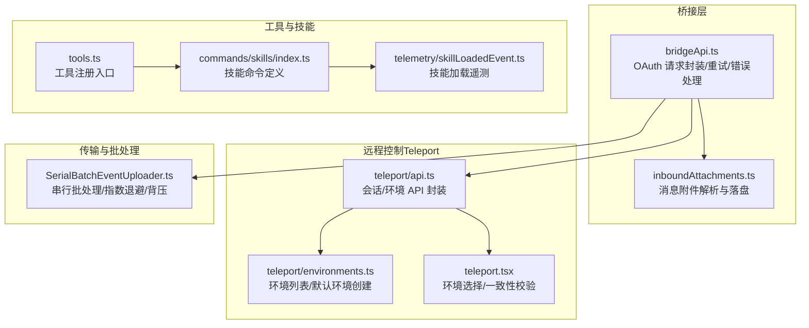
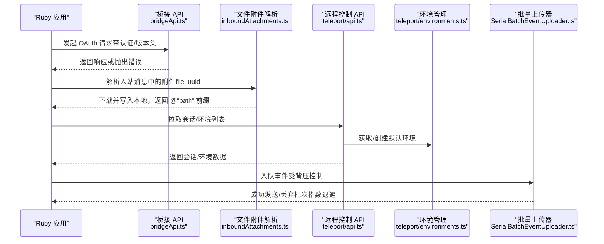
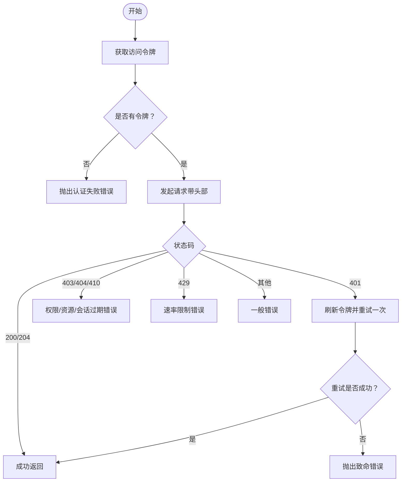
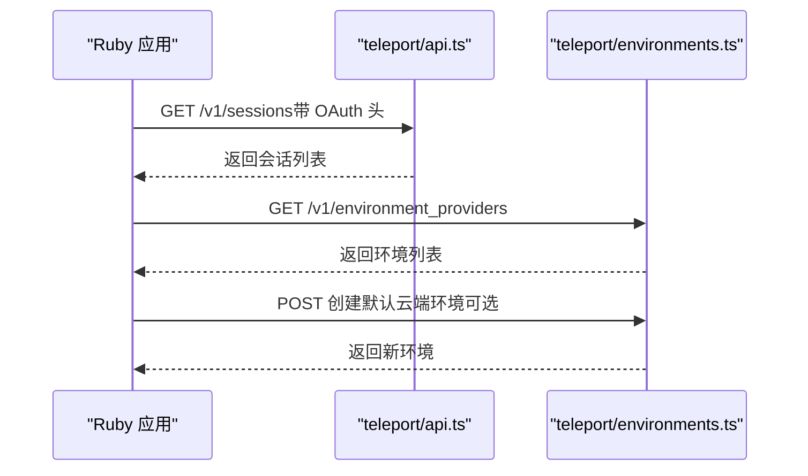
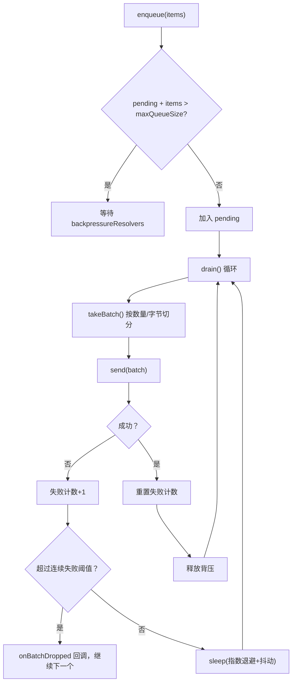
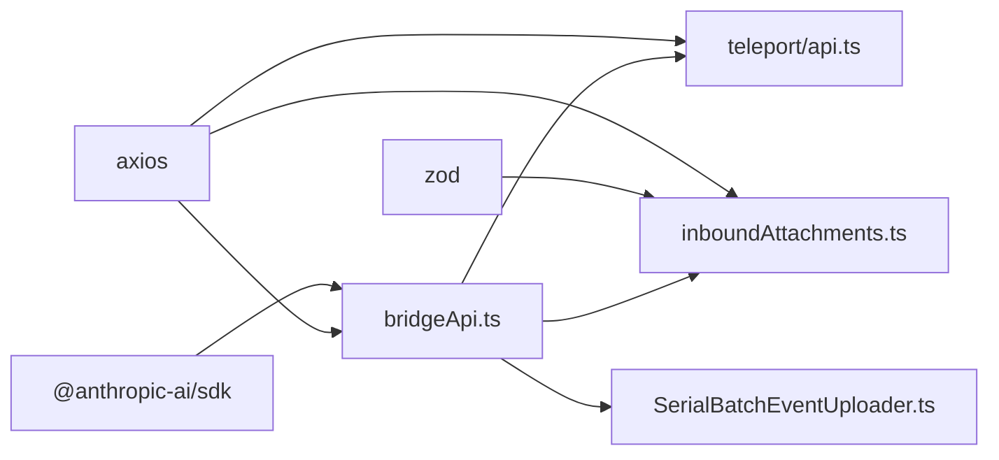

# Ruby API 技能

<cite>
**本文引用的文件**
- [README.md](file://README.md)
- [package.json](file://package.json)
- [src/bridge/bridgeApi.ts](file://src/bridge/bridgeApi.ts)
- [src/bridge/inboundAttachments.ts](file://src/bridge/inboundAttachments.ts)
- [src/cli/transports/SerialBatchEventUploader.ts](file://src/cli/transports/SerialBatchEventUploader.ts)
- [src/utils/teleport/api.ts](file://src/utils/teleport/api.ts)
- [src/utils/teleport/environments.ts](file://src/utils/teleport/environments.ts)
- [src/utils/teleport.tsx](file://src/utils/teleport.tsx)
- [src/utils/toolErrors.ts](file://src/utils/toolErrors.ts)
- [src/tools.ts](file://src/tools.ts)
- [src/commands/skills/index.ts](file://src/commands/skills/index.ts)
- [src/utils/telemetry/skillLoadedEvent.ts](file://src/utils/telemetry/skillLoadedEvent.ts)
- [src/commands/init.ts](file://src/commands/init.ts)
</cite>

## 目录
1. [简介](#简介)
2. [项目结构](#项目结构)
3. [核心组件](#核心组件)
4. [架构总览](#架构总览)
5. [组件详解](#组件详解)
6. [依赖关系分析](#依赖关系分析)
7. [性能考量](#性能考量)
8. [故障排查指南](#故障排查指南)
9. [结论](#结论)
10. [附录](#附录)

## 简介
本文件面向希望在 Ruby 项目中集成 Claude API 的开发者，系统性梳理该项目中与“Ruby Claude API 技能”相关的实现与能力边界，并结合现有代码库中的桥接层、远程控制、文件附件解析、批量上传器、遥测与工具体系等模块，给出可操作的集成思路、并发与批处理策略、文件 API 使用建议、工具调用与错误处理的最佳实践。需要特别说明的是：当前仓库为 TypeScript 源码还原版本，未包含 Ruby SDK 的直接实现；本文档以现有桥接与工具能力为依据，帮助读者在 Ruby 项目中以“桥接 + 工具 + 批量上传”的方式对接 Claude API。

## 项目结构
该仓库采用 TypeScript 编写，围绕“桥接层（Bridge）+ 工具集（Tools）+ 遥测与技能（Telemetry & Skills）+ 远程控制（Teleport）+ 批量传输（SerialBatchUploader）”构建。下图概览了与 Ruby API 技能相关的关键模块及其交互：



图表来源
- [src/bridge/bridgeApi.ts:73-115](file://src/bridge/bridgeApi.ts#L73-L115)
- [src/bridge/inboundAttachments.ts:1-175](file://src/bridge/inboundAttachments.ts#L1-L175)
- [src/utils/teleport/api.ts:204-282](file://src/utils/teleport/api.ts#L204-L282)
- [src/utils/teleport/environments.ts:40-86](file://src/utils/teleport/environments.ts#L40-L86)
- [src/utils/teleport.tsx:1062-1080](file://src/utils/teleport.tsx#L1062-L1080)
- [src/cli/transports/SerialBatchEventUploader.ts:64-233](file://src/cli/transports/SerialBatchEventUploader.ts#L64-L233)
- [src/tools.ts:1-27](file://src/tools.ts#L1-L27)
- [src/commands/skills/index.ts:1-10](file://src/commands/skills/index.ts#L1-L10)
- [src/utils/telemetry/skillLoadedEvent.ts:1-39](file://src/utils/telemetry/skillLoadedEvent.ts#L1-L39)

章节来源
- [README.md:1-200](file://README.md#L1-L200)
- [package.json:1-200](file://package.json#L1-L200)

## 核心组件
- 桥接 API（OAuth 请求、重试与错误处理）
  - 提供统一的请求头（含认证、版本号、Beta 头）、带一次性刷新的 401 重试、状态码到错误类型的映射与致命错误封装。
- 文件附件解析与落盘
  - 从入站消息提取 file_uuid 与文件名，下载内容并写入本地 ~/.claude/uploads/<sessionId>/，生成 @"path" 引用前缀，便于后续工具读取。
- 远程控制（Teleport）API
  - 会话列表拉取、环境列表获取与默认环境创建，支持按偏好选择云端环境并进行一致性校验。
- 批量事件上传器
  - 支持最大批次大小、字节上限、队列容量、指数退避与抖动、连续失败丢弃回调，保证高吞吐下的稳定性。
- 工具与技能
  - 工具注册入口集中管理各类工具；技能命令用于列出可用技能；技能加载事件用于遥测统计。

章节来源
- [src/bridge/bridgeApi.ts:73-115](file://src/bridge/bridgeApi.ts#L73-L115)
- [src/bridge/bridgeApi.ts:454-539](file://src/bridge/bridgeApi.ts#L454-L539)
- [src/bridge/inboundAttachments.ts:41-175](file://src/bridge/inboundAttachments.ts#L41-L175)
- [src/utils/teleport/api.ts:204-282](file://src/utils/teleport/api.ts#L204-L282)
- [src/utils/teleport/environments.ts:40-86](file://src/utils/teleport/environments.ts#L40-L86)
- [src/utils/teleport.tsx:1062-1080](file://src/utils/teleport.tsx#L1062-L1080)
- [src/cli/transports/SerialBatchEventUploader.ts:35-233](file://src/cli/transports/SerialBatchEventUploader.ts#L35-L233)
- [src/tools.ts:1-27](file://src/tools.ts#L1-L27)
- [src/commands/skills/index.ts:1-10](file://src/commands/skills/index.ts#L1-L10)
- [src/utils/telemetry/skillLoadedEvent.ts:1-39](file://src/utils/telemetry/skillLoadedEvent.ts#L1-L39)

## 架构总览
下图展示了 Ruby 项目集成 Claude API 的典型路径：通过桥接层发起 OAuth 请求，必要时解析并落盘文件附件，随后根据需要调用远程控制 API 获取会话/环境信息，最后通过批量上传器稳定地上报事件或数据。



图表来源
- [src/bridge/bridgeApi.ts:73-115](file://src/bridge/bridgeApi.ts#L73-L115)
- [src/bridge/inboundAttachments.ts:123-175](file://src/bridge/inboundAttachments.ts#L123-L175)
- [src/utils/teleport/api.ts:204-282](file://src/utils/teleport/api.ts#L204-L282)
- [src/utils/teleport/environments.ts:40-86](file://src/utils/teleport/environments.ts#L40-L86)
- [src/cli/transports/SerialBatchEventUploader.ts:64-233](file://src/cli/transports/SerialBatchEventUploader.ts#L64-L233)

## 组件详解

### 桥接 API（OAuth 请求、重试与错误处理）
- 请求头构造：统一设置 Authorization、Content-Type、anthropic-version 以及可选的 Beta 头与设备令牌。
- 认证与重试：若首次请求返回 401，则尝试刷新令牌并重试一次；其他状态码映射为致命错误或普通错误。
- 错误类型映射：根据响应体中的 error.type 判断过期、权限等问题，便于区分处理。
- 适用场景：Ruby 项目可通过 HTTP 客户端复用相同的头部与重试逻辑，确保与服务端一致的行为。



图表来源
- [src/bridge/bridgeApi.ts:73-115](file://src/bridge/bridgeApi.ts#L73-L115)
- [src/bridge/bridgeApi.ts:454-539](file://src/bridge/bridgeApi.ts#L454-L539)

章节来源
- [src/bridge/bridgeApi.ts:73-115](file://src/bridge/bridgeApi.ts#L73-L115)
- [src/bridge/bridgeApi.ts:454-539](file://src/bridge/bridgeApi.ts#L454-L539)

### 文件附件解析与落盘（Ruby 文件 API 使用建议）
- 输入：入站消息中的 file_attachments 数组（包含 file_uuid 与 file_name）。
- 处理流程：校验令牌 → 拼接 /api/oauth/files/{uuid}/content → 下载二进制内容 → 创建安全文件名 → 写入 ~/.claude/uploads/<sessionId>/。
- 输出：生成 @"path" 前缀字符串，用于后续工具读取。
- Ruby 集成要点：
  - 使用 HTTPS 客户端发起 GET 请求，携带 Authorization: Bearer <token>。
  - 以二进制形式接收响应，写入本地临时目录，命名规则参考安全文件名与前缀策略。
  - 将生成的路径拼接到文本内容前，确保 Claude 的 Read 工具可正确解析。

```mermaid
flowchart TD
A["提取 attachments"] --> B{"有附件？"}
B --> |否| C["返回原内容"]
B --> |是| D["获取 OAuth 令牌"]
D --> E{"令牌有效？"}
E --> |否| C
E --> |是| F["下载文件内容/content"]
F --> G{"状态码=200？"}
G --> |否| C
G --> |是| H["生成安全文件名与输出路径"]
H --> I["写入本地文件"]
I --> J["生成 @\"path\" 前缀"]
J --> K["拼接到内容前"]
```

图表来源
- [src/bridge/inboundAttachments.ts:41-175](file://src/bridge/inboundAttachments.ts#L41-L175)

章节来源
- [src/bridge/inboundAttachments.ts:41-175](file://src/bridge/inboundAttachments.ts#L41-L175)

### 远程控制 API（会话与环境）
- 会话列表：通过 /v1/sessions 拉取，转换为内部 CodeSession 结构，包含 id、title、repo、时间戳等字段。
- 环境管理：获取环境列表，优先选择 anthropic_cloud 类型环境；若无则可创建默认云端环境。
- 环境选择策略：优先使用用户默认环境，否则回退到第一个可用的 anthropic_cloud 环境；若无可用环境则快速失败并记录日志。



图表来源
- [src/utils/teleport/api.ts:204-282](file://src/utils/teleport/api.ts#L204-L282)
- [src/utils/teleport/environments.ts:40-86](file://src/utils/teleport/environments.ts#L40-L86)
- [src/utils/teleport.tsx:1062-1080](file://src/utils/teleport.tsx#L1062-L1080)

章节来源
- [src/utils/teleport/api.ts:204-282](file://src/utils/teleport/api.ts#L204-L282)
- [src/utils/teleport/environments.ts:40-86](file://src/utils/teleport/environments.ts#L40-L86)
- [src/utils/teleport.tsx:1062-1080](file://src/utils/teleport.tsx#L1062-L1080)

### 批量事件上传器（并发与批处理）
- 关键配置：最大批次大小、最大字节、队列容量、基础延迟、最大延迟、抖动、连续失败阈值、丢弃回调。
- 行为特征：
  - 串行发送批次，失败时指数退避并重试；
  - 达到连续失败阈值时丢弃当前批次并继续下一个；
  - 通过 backpressureResolvers 控制入队阻塞；
  - flush() 在关闭或回合边界等待所有待发送项完成。
- Ruby 集成要点：
  - 将事件序列化为 JSON 字符串，计算字节数以满足 maxBatchBytes；
  - 使用队列容量与背压避免内存峰值；
  - 对网络异常与 429 场景采用指数退避与抖动，提升稳定性。



图表来源
- [src/cli/transports/SerialBatchEventUploader.ts:64-233](file://src/cli/transports/SerialBatchEventUploader.ts#L64-L233)

章节来源
- [src/cli/transports/SerialBatchEventUploader.ts:35-233](file://src/cli/transports/SerialBatchEventUploader.ts#L35-L233)

### 工具与技能（Ruby 工具使用建议）
- 工具注册：通过集中入口导入各类工具（如 Bash、FileRead、FileEdit、WebFetch、Skill 等），在会话中按需启用。
- 技能命令：提供列出可用技能的能力；技能加载事件用于统计各技能的可用性与预算。
- Ruby 集成要点：
  - 在 Ruby 侧维护工具清单与权限矩阵，仅暴露允许使用的工具；
  - 通过技能命令动态发现可用技能，减少硬编码；
  - 对工具输出进行格式化与截断，避免超长输出导致 API 限流或性能问题。

章节来源
- [src/tools.ts:1-27](file://src/tools.ts#L1-L27)
- [src/commands/skills/index.ts:1-10](file://src/commands/skills/index.ts#L1-L10)
- [src/utils/telemetry/skillLoadedEvent.ts:1-39](file://src/utils/telemetry/skillLoadedEvent.ts#L1-L39)
- [src/commands/init.ts:156-224](file://src/commands/init.ts#L156-L224)

## 依赖关系分析
- 外部依赖
  - @anthropic-ai/sdk：用于与 Claude API 交互（在本仓库中通过桥接层封装）。
  - axios：HTTP 客户端，用于远程控制 API 与文件下载。
  - zod：输入校验（如附件数组、环境列表等）。
- 内部耦合
  - 桥接层与远程控制 API 存在强关联（均使用 OAuth 头与 anthropic-version）。
  - 文件附件解析依赖桥接层提供的访问令牌与基础地址。
  - 批量上传器作为通用传输组件，被多处事件上报路径复用。



图表来源
- [package.json:1-200](file://package.json#L1-L200)
- [src/bridge/bridgeApi.ts:73-115](file://src/bridge/bridgeApi.ts#L73-L115)
- [src/bridge/inboundAttachments.ts:13-39](file://src/bridge/inboundAttachments.ts#L13-L39)
- [src/utils/teleport/api.ts:204-282](file://src/utils/teleport/api.ts#L204-L282)

章节来源
- [package.json:1-200](file://package.json#L1-L200)

## 性能考量
- 并发模式
  - 使用串行批处理（SerialBatchEventUploader）避免过度并发导致的 429 与资源争用。
  - 对于文件下载，可采用并发但受控的 Promise.all，结合失败降级（best-effort）策略，确保消息仍可达 Claude。
- 批量策略
  - 同时控制“数量上限”和“字节上限”，防止单批次过大引发超时或限流。
  - 指数退避与抖动降低重试风暴概率，提高整体稳定性。
- 资源管理
  - 附件落盘目录按会话隔离，避免冲突；文件名安全化处理，规避路径注入风险。
  - 对工具输出进行截断与格式化，控制消息体积与往返时间。

[本节为通用性能建议，无需特定文件引用]

## 故障排查指南
- 认证与权限
  - 401：检查令牌有效性与刷新流程；确认组织权限与角色是否具备相应作用域。
  - 403：区分可抑制的权限错误与会话/环境过期错误；前者可静默处理，后者需提示用户重启。
  - 404/410：确认远程控制会话是否存在或已过期。
- 速率限制
  - 429：降低轮询频率或增大退避参数，避免触发限流。
- 网络与 IO
  - 文件下载失败：检查令牌、URL、网络连通性与磁盘写入权限；失败即降级为无 @path 的消息。
- 工具错误
  - 使用统一的错误格式化函数，将退出码、标准错误与标准输出整合为可读摘要；对超长输出进行截断。

章节来源
- [src/bridge/bridgeApi.ts:454-539](file://src/bridge/bridgeApi.ts#L454-L539)
- [src/bridge/inboundAttachments.ts:68-117](file://src/bridge/inboundAttachments.ts#L68-L117)
- [src/utils/toolErrors.ts:1-41](file://src/utils/toolErrors.ts#L1-L41)

## 结论
尽管当前仓库未直接提供 Ruby SDK，但其桥接层、远程控制、文件附件处理与批量上传器等模块为 Ruby 项目提供了清晰的集成范式：通过 HTTP 客户端复用桥接层的头部与重试策略，借助文件附件解析实现“本地文件 + Claude 工具”的组合能力，利用远程控制 API 获取会话与环境，再配合串行批处理上传器实现稳健的事件上报。遵循本文的并发与批处理策略、文件 API 使用建议与错误处理规范，可在 Ruby 项目中高效、稳定地集成 Claude API。

[本节为总结性内容，无需特定文件引用]

## 附录
- Ruby 项目集成步骤建议
  - 认证：使用 OAuth 令牌构造请求头，遵循 anthropic-version 与 Beta 头约定。
  - 文件 API：下载 /api/oauth/files/{uuid}/content，安全命名并写入本地，生成 @"path" 前缀。
  - 远程控制：拉取会话列表与环境列表，优先选择 anthropic_cloud 环境。
  - 批量上传：按数量与字节上限切分批次，指数退避与抖动，受背压控制。
  - 工具与技能：仅暴露授权工具，动态发现技能，格式化工具输出。
- 相关实现参考路径
  - 桥接 API：[src/bridge/bridgeApi.ts:73-115](file://src/bridge/bridgeApi.ts#L73-L115)
  - 文件附件：[src/bridge/inboundAttachments.ts:123-175](file://src/bridge/inboundAttachments.ts#L123-L175)
  - 远程控制：[src/utils/teleport/api.ts:204-282](file://src/utils/teleport/api.ts#L204-L282)、[src/utils/teleport/environments.ts:40-86](file://src/utils/teleport/environments.ts#L40-L86)
  - 批量上传：[src/cli/transports/SerialBatchEventUploader.ts:64-233](file://src/cli/transports/SerialBatchEventUploader.ts#L64-L233)
  - 工具与技能：[src/tools.ts:1-27](file://src/tools.ts#L1-L27)、[src/commands/skills/index.ts:1-10](file://src/commands/skills/index.ts#L1-L10)、[src/utils/telemetry/skillLoadedEvent.ts:1-39](file://src/utils/telemetry/skillLoadedEvent.ts#L1-L39)

[本节为补充说明，无需特定文件引用]