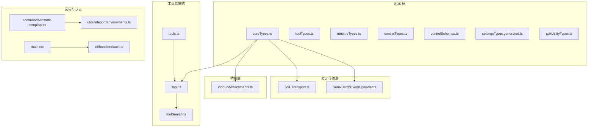
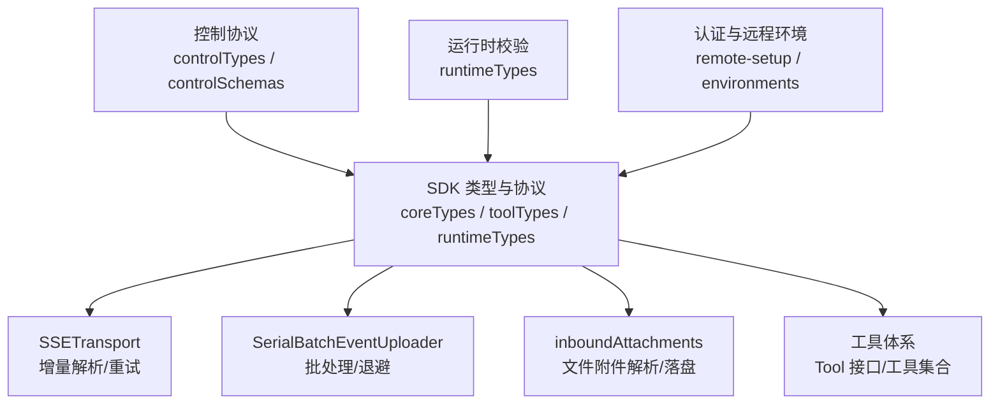
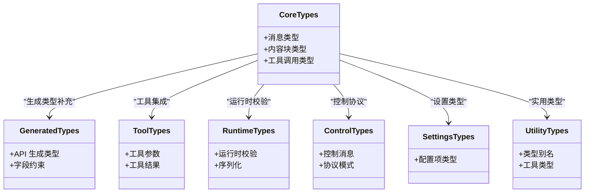
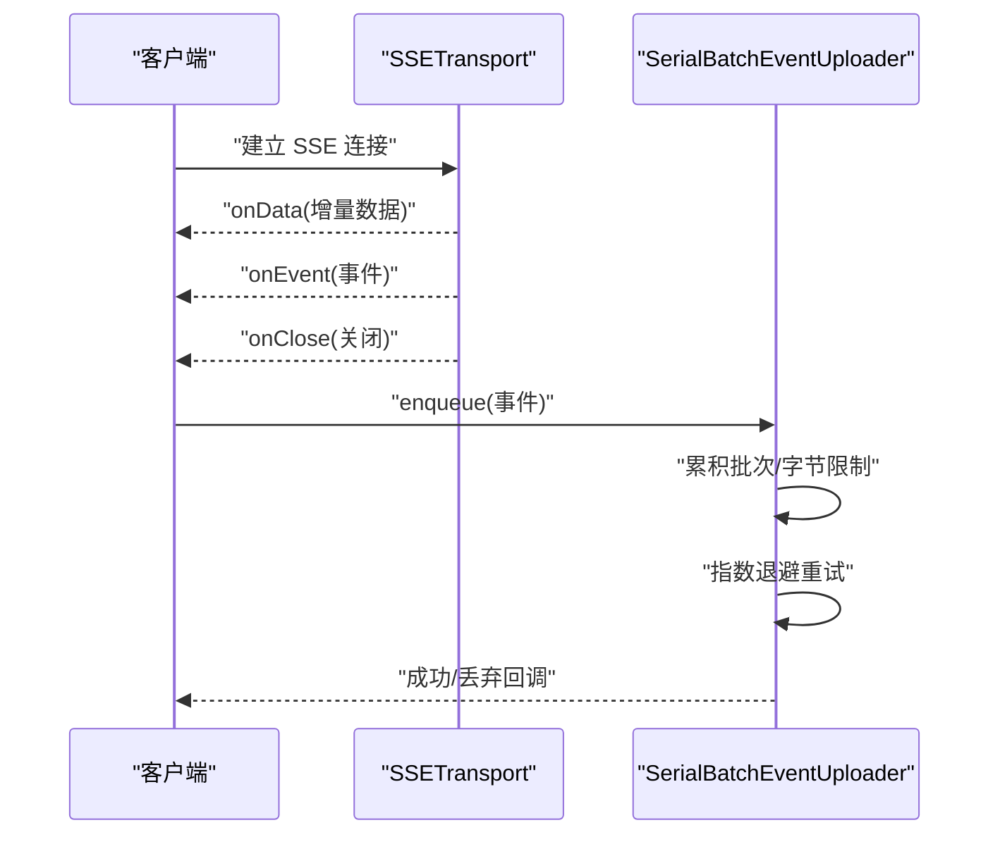
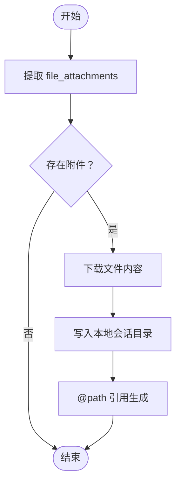
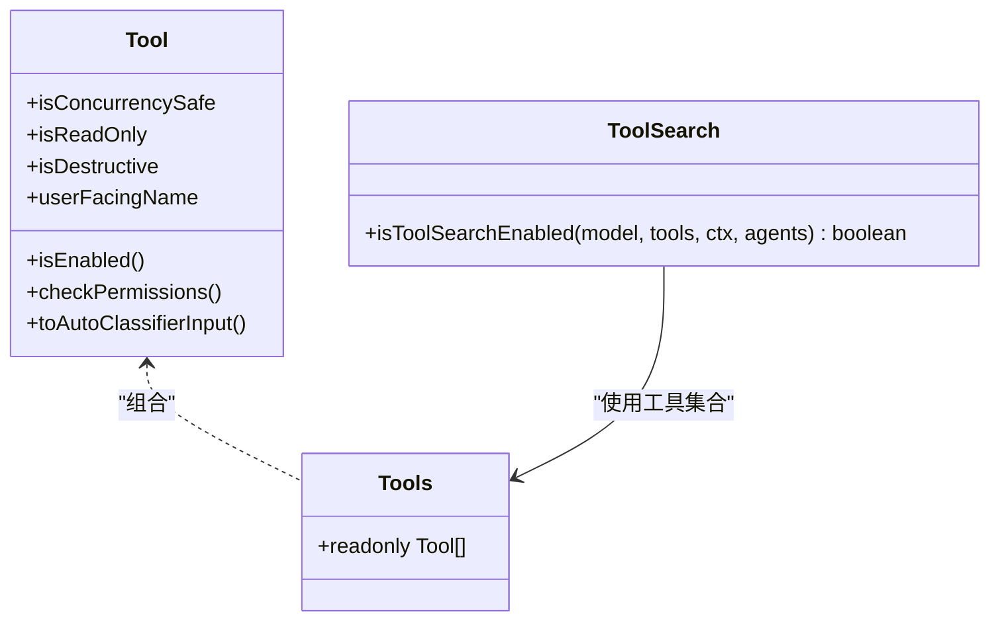
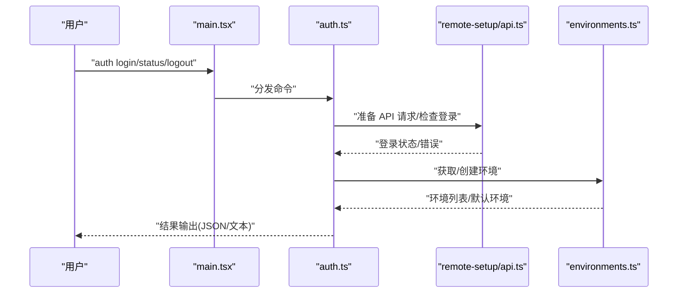
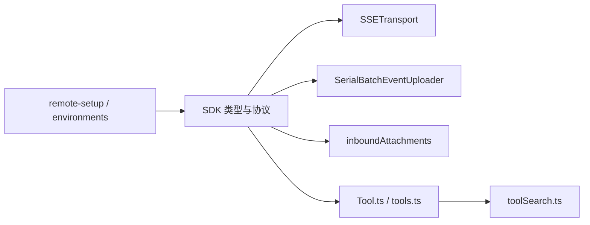

# TypeScript API 技能

<cite>
**本文引用的文件**
- [src/entrypoints/sdk/coreTypes.ts](file://src/entrypoints/sdk/coreTypes.ts)
- [src/entrypoints/sdk/coreTypes.generated.ts](file://src/entrypoints/sdk/coreTypes.generated.ts)
- [src/entrypoints/sdk/toolTypes.ts](file://src/entrypoints/sdk/toolTypes.ts)
- [src/entrypoints/sdk/runtimeTypes.ts](file://src/entrypoints/sdk/runtimeTypes.ts)
- [src/entrypoints/sdk/controlTypes.ts](file://src/entrypoints/sdk/controlTypes.ts)
- [src/entrypoints/sdk/controlSchemas.ts](file://src/entrypoints/sdk/controlSchemas.ts)
- [src/entrypoints/sdk/settingsTypes.generated.ts](file://src/entrypoints/sdk/settingsTypes.generated.ts)
- [src/entrypoints/sdk/sdkUtilityTypes.ts](file://src/entrypoints/sdk/sdkUtilityTypes.ts)
- [src/cli/transports/SSETransport.ts](file://src/cli/transports/SSETransport.ts)
- [src/cli/transports/SerialBatchEventUploader.ts](file://src/cli/transports/SerialBatchEventUploader.ts)
- [src/bridge/inboundAttachments.ts](file://src/bridge/inboundAttachments.ts)
- [src/utils/toolSearch.ts](file://src/utils/toolSearch.ts)
- [src/tools.ts](file://src/tools.ts)
- [src/Tool.ts](file://src/Tool.ts)
- [src/commands/remote-setup/api.ts](file://src/commands/remote-setup/api.ts)
- [src/utils/teleport/environments.ts](file://src/utils/teleport/environments.ts)
- [src/main.tsx](file://src/main.tsx)
- [src/cli/handlers/auth.ts](file://src/cli/handlers/auth.ts)
- [package.json](file://package.json)
- [tsconfig.json](file://tsconfig.json)
</cite>

## 目录
1. [简介](#简介)
2. [项目结构](#项目结构)
3. [核心组件](#核心组件)
4. [架构总览](#架构总览)
5. [组件详解](#组件详解)
6. [依赖关系分析](#依赖关系分析)
7. [性能考量](#性能考量)
8. [故障排查指南](#故障排查指南)
9. [结论](#结论)
10. [附录](#附录)

## 简介
本文件面向希望在 TypeScript 项目中集成 Claude API 的开发者，系统性介绍以下能力与最佳实践：
- 类型安全的 Claude API 调用：基于生成的类型定义与运行时校验，确保请求/响应参数与行为符合规范。
- 批量处理：通过串行批处理上传器实现事件或数据的批量发送与指数退避重试。
- 文件 API：桥接层对文件附件的解析、下载与本地落盘，支持消息中的文件引用。
- 流式响应：基于 SSE 的增量帧解析与事件回调，适配 Claude 流式输出。
- 工具使用：工具集合的组织、权限检查、工具搜索启用策略与工具组渲染。
- TypeScript Agent SDK：SDK 类型定义、控制协议、运行时类型与设置类型，帮助构建强类型的代理应用。

本指南同时提供可直接定位到源码的路径，便于在实际项目中快速对照实现。

## 项目结构
该仓库采用多模块分层组织方式：
- entrypoints/sdk：提供 TypeScript Agent SDK 的核心类型、工具类型、运行时类型与控制协议等。
- cli/transports：提供传输层抽象，如 SSETransport（SSE 增量解析）与 SerialBatchEventUploader（串行批处理上传器）。
- bridge：桥接层逻辑，负责入站消息的文件附件解析与本地落盘。
- utils：通用工具，如工具搜索启用判断、远程环境管理等。
- commands/remote-setup：远程环境初始化与认证状态检测。
- tools 与 Tool：工具集合与工具接口定义。
- 入口与 CLI：命令行入口与认证相关处理器。

图表来源
- [src/entrypoints/sdk/coreTypes.ts](file://src/entrypoints/sdk/coreTypes.ts)
- [src/cli/transports/SSETransport.ts](file://src/cli/transports/SSETransport.ts)
- [src/cli/transports/SerialBatchEventUploader.ts](file://src/cli/transports/SerialBatchEventUploader.ts)
- [src/bridge/inboundAttachments.ts](file://src/bridge/inboundAttachments.ts)
- [src/utils/toolSearch.ts](file://src/utils/toolSearch.ts)
- [src/tools.ts](file://src/tools.ts)
- [src/Tool.ts](file://src/Tool.ts)
- [src/commands/remote-setup/api.ts](file://src/commands/remote-setup/api.ts)
- [src/utils/teleport/environments.ts](file://src/utils/teleport/environments.ts)
- [src/main.tsx](file://src/main.tsx)
- [src/cli/handlers/auth.ts](file://src/cli/handlers/auth.ts)

章节来源
- [src/entrypoints/sdk/coreTypes.ts](file://src/entrypoints/sdk/coreTypes.ts)
- [src/cli/transports/SSETransport.ts](file://src/cli/transports/SSETransport.ts)
- [src/cli/transports/SerialBatchEventUploader.ts](file://src/cli/transports/SerialBatchEventUploader.ts)
- [src/bridge/inboundAttachments.ts](file://src/bridge/inboundAttachments.ts)
- [src/utils/toolSearch.ts](file://src/utils/toolSearch.ts)
- [src/tools.ts](file://src/tools.ts)
- [src/Tool.ts](file://src/Tool.ts)
- [src/commands/remote-setup/api.ts](file://src/commands/remote-setup/api.ts)
- [src/utils/teleport/environments.ts](file://src/utils/teleport/environments.ts)
- [src/main.tsx](file://src/main.tsx)
- [src/cli/handlers/auth.ts](file://src/cli/handlers/auth.ts)

## 核心组件
- SDK 类型与协议
  - coreTypes.ts：定义核心消息、内容块、模型参数等基础类型。
  - coreTypes.generated.ts：基于 OpenAPI/Swagger 生成的类型，覆盖 API 定义的完整字段与约束。
  - toolTypes.ts：工具调用参数与结果的类型定义。
  - runtimeTypes.ts：运行时校验与序列化类型，用于请求/响应的类型安全。
  - controlTypes.ts 与 controlSchemas.ts：控制协议与消息结构的类型与模式。
  - settingsTypes.generated.ts：配置项的类型定义。
  - sdkUtilityTypes.ts：SDK 内部使用的通用类型别名与工具类型。
- 传输层
  - SSETransport.ts：SSE 增量帧解析、连接状态管理、事件回调与指数退避重试。
  - SerialBatchEventUploader.ts：串行批处理上传器，支持最大批次大小、字节限制、队列长度与失败丢弃策略。
- 桥接层
  - inboundAttachments.ts：从入站消息中提取文件附件，下载到本地临时目录，生成可被工具读取的路径引用。
- 工具体系
  - Tool.ts 与 tools.ts：工具接口与工具集合导出；工具具备权限检查、并发安全标记、只读/破坏性标记等元信息。
  - toolSearch.ts：根据模型能力、工具集与阈值决定是否启用工具搜索（tool_reference）。
- 远程与认证
  - remote-setup/api.ts：远程环境初始化与登录状态检测。
  - environments.ts：远程环境列表获取与默认云环境创建。
  - main.tsx 与 cli/handlers/auth.ts：CLI 认证命令与状态查询。

章节来源
- [src/entrypoints/sdk/coreTypes.ts](file://src/entrypoints/sdk/coreTypes.ts)
- [src/entrypoints/sdk/coreTypes.generated.ts](file://src/entrypoints/sdk/coreTypes.generated.ts)
- [src/entrypoints/sdk/toolTypes.ts](file://src/entrypoints/sdk/toolTypes.ts)
- [src/entrypoints/sdk/runtimeTypes.ts](file://src/entrypoints/sdk/runtimeTypes.ts)
- [src/entrypoints/sdk/controlTypes.ts](file://src/entrypoints/sdk/controlTypes.ts)
- [src/entrypoints/sdk/controlSchemas.ts](file://src/entrypoints/sdk/controlSchemas.ts)
- [src/entrypoints/sdk/settingsTypes.generated.ts](file://src/entrypoints/sdk/settingsTypes.generated.ts)
- [src/entrypoints/sdk/sdkUtilityTypes.ts](file://src/entrypoints/sdk/sdkUtilityTypes.ts)
- [src/cli/transports/SSETransport.ts](file://src/cli/transports/SSETransport.ts)
- [src/cli/transports/SerialBatchEventUploader.ts](file://src/cli/transports/SerialBatchEventUploader.ts)
- [src/bridge/inboundAttachments.ts](file://src/bridge/inboundAttachments.ts)
- [src/utils/toolSearch.ts](file://src/utils/toolSearch.ts)
- [src/tools.ts](file://src/tools.ts)
- [src/Tool.ts](file://src/Tool.ts)
- [src/commands/remote-setup/api.ts](file://src/commands/remote-setup/api.ts)
- [src/utils/teleport/environments.ts](file://src/utils/teleport/environments.ts)
- [src/main.tsx](file://src/main.tsx)
- [src/cli/handlers/auth.ts](file://src/cli/handlers/auth.ts)

## 架构总览
下图展示了从 SDK 到传输层、桥接层与工具系统的整体交互：

图表来源
- [src/entrypoints/sdk/coreTypes.ts](file://src/entrypoints/sdk/coreTypes.ts)
- [src/entrypoints/sdk/toolTypes.ts](file://src/entrypoints/sdk/toolTypes.ts)
- [src/entrypoints/sdk/runtimeTypes.ts](file://src/entrypoints/sdk/runtimeTypes.ts)
- [src/entrypoints/sdk/controlTypes.ts](file://src/entrypoints/sdk/controlTypes.ts)
- [src/entrypoints/sdk/controlSchemas.ts](file://src/entrypoints/sdk/controlSchemas.ts)
- [src/cli/transports/SSETransport.ts](file://src/cli/transports/SSETransport.ts)
- [src/cli/transports/SerialBatchEventUploader.ts](file://src/cli/transports/SerialBatchEventUploader.ts)
- [src/bridge/inboundAttachments.ts](file://src/bridge/inboundAttachments.ts)
- [src/Tool.ts](file://src/Tool.ts)
- [src/tools.ts](file://src/tools.ts)
- [src/commands/remote-setup/api.ts](file://src/commands/remote-setup/api.ts)
- [src/utils/teleport/environments.ts](file://src/utils/teleport/environments.ts)

## 组件详解

### SDK 类型与协议
- 核心类型与生成类型
  - coreTypes.ts 提供消息、内容块、工具调用/结果等核心类型。
  - coreTypes.generated.ts 提供与 API 完全一致的生成类型，确保编译期校验。
- 工具类型
  - toolTypes.ts 定义工具参数与结果的结构，便于在 SDK 中进行类型安全的工具调用。
- 运行时类型
  - runtimeTypes.ts 提供运行时校验与序列化逻辑，降低运行时错误风险。
- 控制协议
  - controlTypes.ts 与 controlSchemas.ts 描述控制消息结构与验证模式，保证代理与外部系统之间的通信一致性。
- 设置类型
  - settingsTypes.generated.ts 提供配置项的类型定义，便于在 SDK 中进行类型安全的设置读写。
- SDK 实用类型
  - sdkUtilityTypes.ts 提供内部通用类型别名与工具类型，提升类型复用性。

图表来源
- [src/entrypoints/sdk/coreTypes.ts](file://src/entrypoints/sdk/coreTypes.ts)
- [src/entrypoints/sdk/coreTypes.generated.ts](file://src/entrypoints/sdk/coreTypes.generated.ts)
- [src/entrypoints/sdk/toolTypes.ts](file://src/entrypoints/sdk/toolTypes.ts)
- [src/entrypoints/sdk/runtimeTypes.ts](file://src/entrypoints/sdk/runtimeTypes.ts)
- [src/entrypoints/sdk/controlTypes.ts](file://src/entrypoints/sdk/controlTypes.ts)
- [src/entrypoints/sdk/controlSchemas.ts](file://src/entrypoints/sdk/controlSchemas.ts)
- [src/entrypoints/sdk/settingsTypes.generated.ts](file://src/entrypoints/sdk/settingsTypes.generated.ts)
- [src/entrypoints/sdk/sdkUtilityTypes.ts](file://src/entrypoints/sdk/sdkUtilityTypes.ts)

章节来源
- [src/entrypoints/sdk/coreTypes.ts](file://src/entrypoints/sdk/coreTypes.ts)
- [src/entrypoints/sdk/coreTypes.generated.ts](file://src/entrypoints/sdk/coreTypes.generated.ts)
- [src/entrypoints/sdk/toolTypes.ts](file://src/entrypoints/sdk/toolTypes.ts)
- [src/entrypoints/sdk/runtimeTypes.ts](file://src/entrypoints/sdk/runtimeTypes.ts)
- [src/entrypoints/sdk/controlTypes.ts](file://src/entrypoints/sdk/controlTypes.ts)
- [src/entrypoints/sdk/controlSchemas.ts](file://src/entrypoints/sdk/controlSchemas.ts)
- [src/entrypoints/sdk/settingsTypes.generated.ts](file://src/entrypoints/sdk/settingsTypes.generated.ts)
- [src/entrypoints/sdk/sdkUtilityTypes.ts](file://src/entrypoints/sdk/sdkUtilityTypes.ts)

### 传输层：SSE 与批处理
- SSETransport
  - 功能：解析 SSE 增量帧、维护连接状态、触发事件回调、实现指数退避重试与断线重连。
  - 关键点：文本解码选项复用以减少分配；URL 转换将 /stream 结尾转换为 POST 事件端点。
- SerialBatchEventUploader
  - 功能：串行批处理上传，支持最大批次大小、最大字节数、队列长度与连续失败丢弃策略。
  - 关键点：首项总是进入批次，后续项按累计字节限制加入；失败后指数退避并可配置抖动。

图表来源
- [src/cli/transports/SSETransport.ts](file://src/cli/transports/SSETransport.ts)
- [src/cli/transports/SerialBatchEventUploader.ts](file://src/cli/transports/SerialBatchEventUploader.ts)

章节来源
- [src/cli/transports/SSETransport.ts](file://src/cli/transports/SSETransport.ts)
- [src/cli/transports/SerialBatchEventUploader.ts](file://src/cli/transports/SerialBatchEventUploader.ts)

### 桥接层：文件附件处理
- 功能：从入站消息中提取 file_attachments，下载对应文件内容至本地会话目录，返回可被工具读取的 @path 引用。
- 关键点：使用 OAuth 令牌访问桥接文件服务；失败时记录调试日志并跳过该附件，保证消息仍可达 Claude。

图表来源
- [src/bridge/inboundAttachments.ts](file://src/bridge/inboundAttachments.ts)

章节来源
- [src/bridge/inboundAttachments.ts](file://src/bridge/inboundAttachments.ts)

### 工具系统：类型、权限与搜索
- 工具接口与集合
  - Tool.ts 定义工具接口与工具集合类型；每个工具可声明并发安全、只读/破坏性、权限检查等元信息。
  - tools.ts 导出工具集合，按需引入具体工具实现。
- 工具搜索启用策略
  - toolSearch.ts 提供 isToolSearchEnabled，综合考虑 MCP 模式、模型能力、工具可用性与阈值，决定是否启用 tool_reference。

图表来源
- [src/Tool.ts](file://src/Tool.ts)
- [src/tools.ts](file://src/tools.ts)
- [src/utils/toolSearch.ts](file://src/utils/toolSearch.ts)

章节来源
- [src/Tool.ts](file://src/Tool.ts)
- [src/tools.ts](file://src/tools.ts)
- [src/utils/toolSearch.ts](file://src/utils/toolSearch.ts)

### 远程与认证：环境与登录
- 远程环境管理
  - remote-setup/api.ts：远程环境初始化与登录状态检测。
  - environments.ts：获取远程环境列表、创建默认云环境，统一鉴权与组织 UUID。
- CLI 认证
  - main.tsx：注册 auth 子命令（login/status/logout）。
  - cli/handlers/auth.ts：实现登录、状态查询与清理流程，输出人类可读或 JSON 格式结果。

图表来源
- [src/main.tsx](file://src/main.tsx)
- [src/cli/handlers/auth.ts](file://src/cli/handlers/auth.ts)
- [src/commands/remote-setup/api.ts](file://src/commands/remote-setup/api.ts)
- [src/utils/teleport/environments.ts](file://src/utils/teleport/environments.ts)

章节来源
- [src/main.tsx](file://src/main.tsx)
- [src/cli/handlers/auth.ts](file://src/cli/handlers/auth.ts)
- [src/commands/remote-setup/api.ts](file://src/commands/remote-setup/api.ts)
- [src/utils/teleport/environments.ts](file://src/utils/teleport/environments.ts)

## 依赖关系分析
- SDK 与传输层
  - SDK 类型驱动传输层的请求/响应结构；SSETransport 与 SerialBatchEventUploader 作为底层基础设施，保障流式与批量场景的稳定性。
- SDK 与桥接层
  - 桥接层负责文件附件的解析与落盘，为 SDK 的消息与工具使用提供输入支持。
- SDK 与工具系统
  - 工具接口与工具集合为 SDK 的工具调用提供类型安全与权限控制；工具搜索策略影响是否启用 tool_reference。
- 远程与认证
  - 远程环境与认证状态直接影响 SDK 的可用性与网络访问策略。

图表来源
- [src/entrypoints/sdk/coreTypes.ts](file://src/entrypoints/sdk/coreTypes.ts)
- [src/cli/transports/SSETransport.ts](file://src/cli/transports/SSETransport.ts)
- [src/cli/transports/SerialBatchEventUploader.ts](file://src/cli/transports/SerialBatchEventUploader.ts)
- [src/bridge/inboundAttachments.ts](file://src/bridge/inboundAttachments.ts)
- [src/Tool.ts](file://src/Tool.ts)
- [src/tools.ts](file://src/tools.ts)
- [src/utils/toolSearch.ts](file://src/utils/toolSearch.ts)
- [src/commands/remote-setup/api.ts](file://src/commands/remote-setup/api.ts)
- [src/utils/teleport/environments.ts](file://src/utils/teleport/environments.ts)

章节来源
- [src/entrypoints/sdk/coreTypes.ts](file://src/entrypoints/sdk/coreTypes.ts)
- [src/cli/transports/SSETransport.ts](file://src/cli/transports/SSETransport.ts)
- [src/cli/transports/SerialBatchEventUploader.ts](file://src/cli/transports/SerialBatchEventUploader.ts)
- [src/bridge/inboundAttachments.ts](file://src/bridge/inboundAttachments.ts)
- [src/Tool.ts](file://src/Tool.ts)
- [src/tools.ts](file://src/tools.ts)
- [src/utils/toolSearch.ts](file://src/utils/toolSearch.ts)
- [src/commands/remote-setup/api.ts](file://src/commands/remote-setup/api.ts)
- [src/utils/teleport/environments.ts](file://src/utils/teleport/environments.ts)

## 性能考量
- SSE 增量解析
  - 复用 TextDecoder 选项与 validateStatus 回调，避免每帧重复分配，提升解析效率。
  - 断线重连采用指数退避与最大延迟上限，平衡恢复速度与资源占用。
- 批量上传
  - 串行批处理避免并发冲突；通过 maxBatchSize 与 maxBatchBytes 控制内存与带宽压力。
  - 连续失败丢弃策略防止积压导致的级联失败。
- 文件附件
  - 下载超时与失败降级（跳过附件）确保主流程不阻塞；本地落盘前进行文件名清洗，避免路径注入风险。

## 故障排查指南
- SSE 连接问题
  - 检查 URL 转换逻辑（移除 /stream 后缀），确认事件端点正确。
  - 观察 onEvent/onClose 回调，结合指数退避日志定位网络波动或服务端异常。
- 批量上传失败
  - 查看连续失败次数与丢弃回调，评估 maxConsecutiveFailures 配置是否合理。
  - 调整 baseDelayMs/maxDelayMs/jitterMs 以适配网络环境。
- 文件附件缺失
  - 确认入站消息包含 file_attachments，且桥接访问令牌有效。
  - 检查下载状态码与本地写入异常，关注超时与磁盘权限问题。
- 工具搜索未启用
  - 核对模型是否支持 tool_reference，工具集合是否包含 ToolSearchTool，以及阈值条件是否满足。
- 认证与远程环境
  - 使用 auth status 输出 JSON/文本格式核对当前认证状态与订阅类型。
  - 远程环境初始化失败时，检查组织 UUID 与网络配置。

章节来源
- [src/cli/transports/SSETransport.ts](file://src/cli/transports/SSETransport.ts)
- [src/cli/transports/SerialBatchEventUploader.ts](file://src/cli/transports/SerialBatchEventUploader.ts)
- [src/bridge/inboundAttachments.ts](file://src/bridge/inboundAttachments.ts)
- [src/utils/toolSearch.ts](file://src/utils/toolSearch.ts)
- [src/cli/handlers/auth.ts](file://src/cli/handlers/auth.ts)
- [src/commands/remote-setup/api.ts](file://src/commands/remote-setup/api.ts)
- [src/utils/teleport/environments.ts](file://src/utils/teleport/environments.ts)

## 结论
本仓库提供了 TypeScript 下使用 Claude API 的完整基础设施：类型安全的 SDK、稳健的传输层、灵活的工具系统与完善的认证/远程环境支持。通过遵循本文档的组件与最佳实践，可在 TypeScript 项目中高效、可靠地集成 Claude API，并扩展到流式响应、批量处理、文件 API 与工具使用等高级场景。

## 附录
- 项目与类型配置
  - package.json：项目依赖与脚本。
  - tsconfig.json：TypeScript 编译配置，建议开启严格模式以获得更强的类型安全保障。

章节来源
- [package.json](file://package.json)
- [tsconfig.json](file://tsconfig.json)