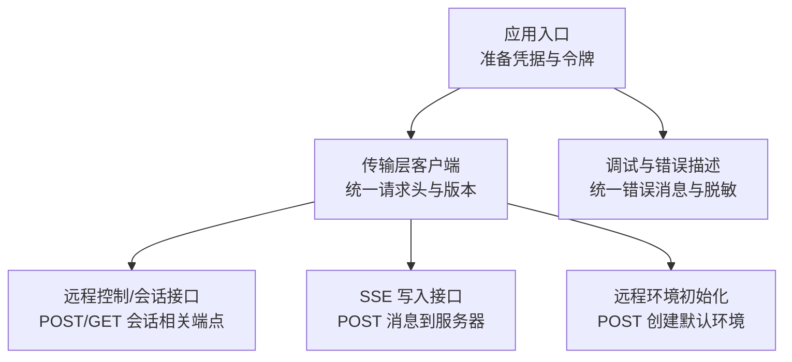
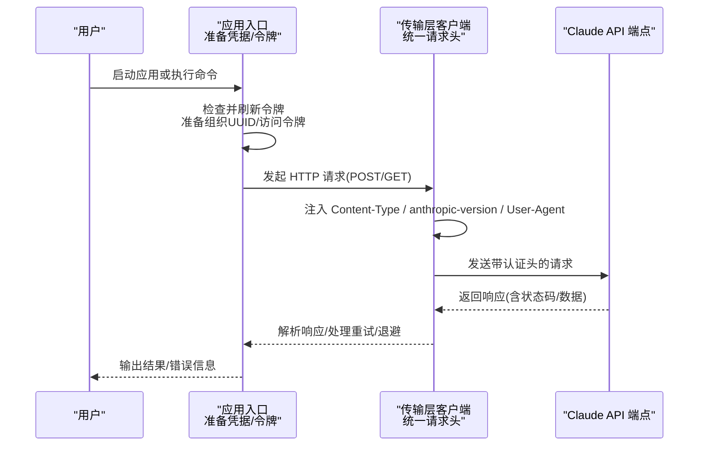
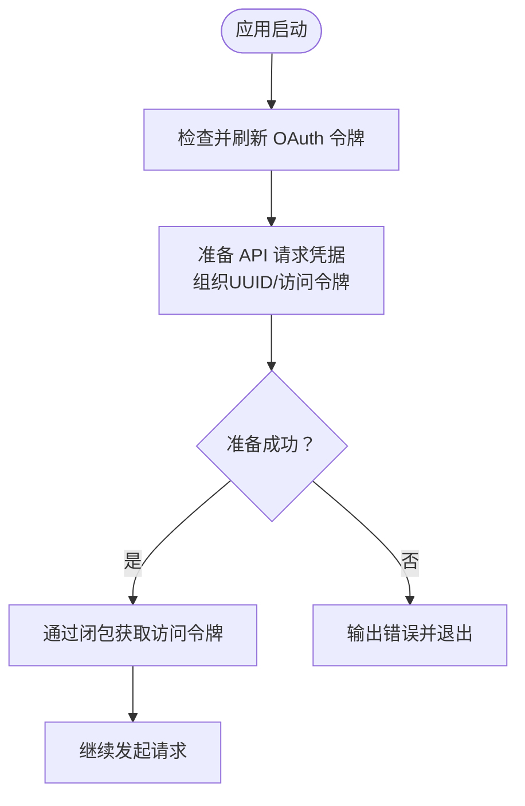
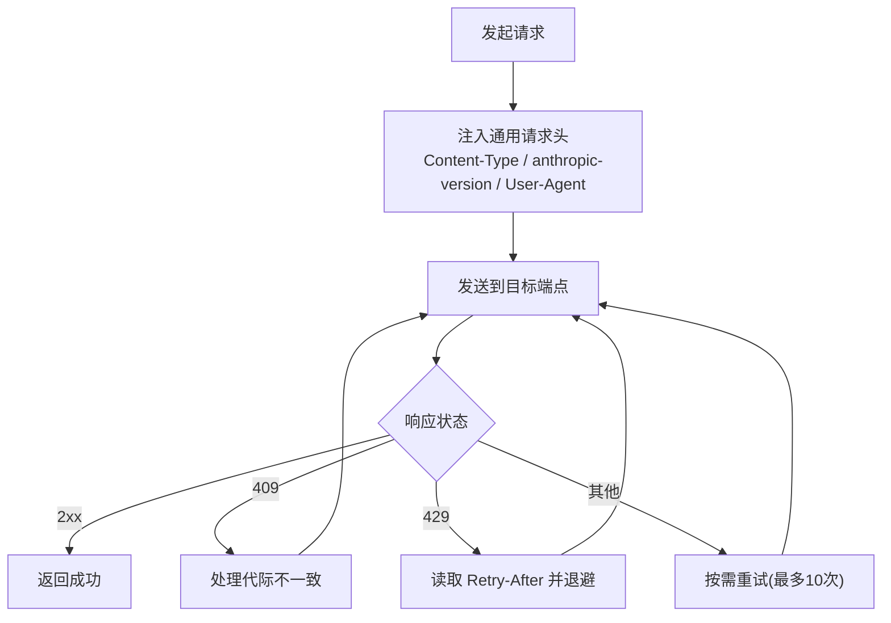
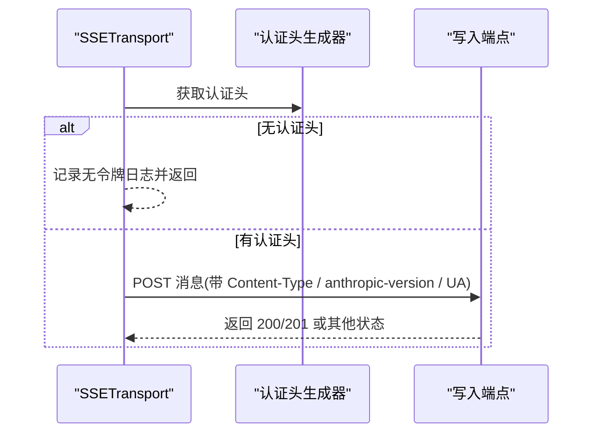
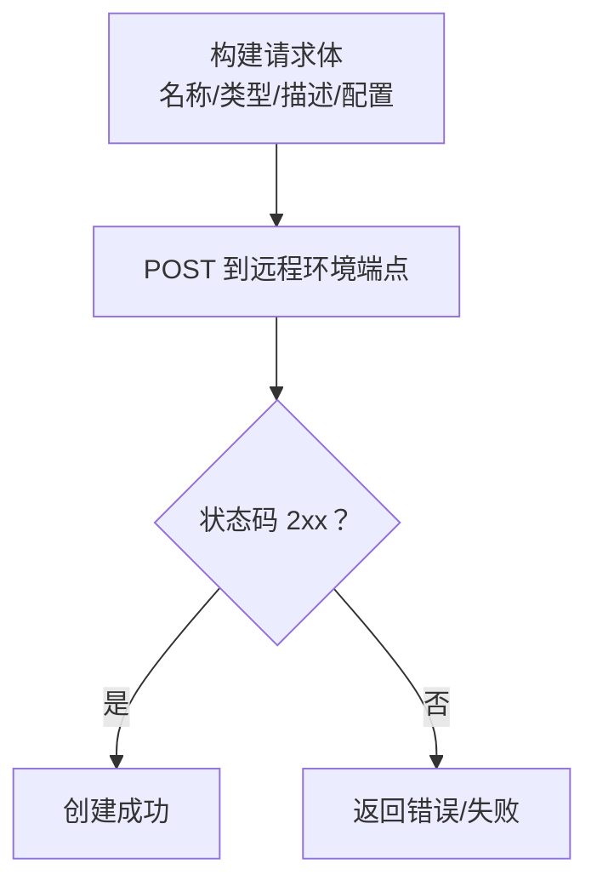
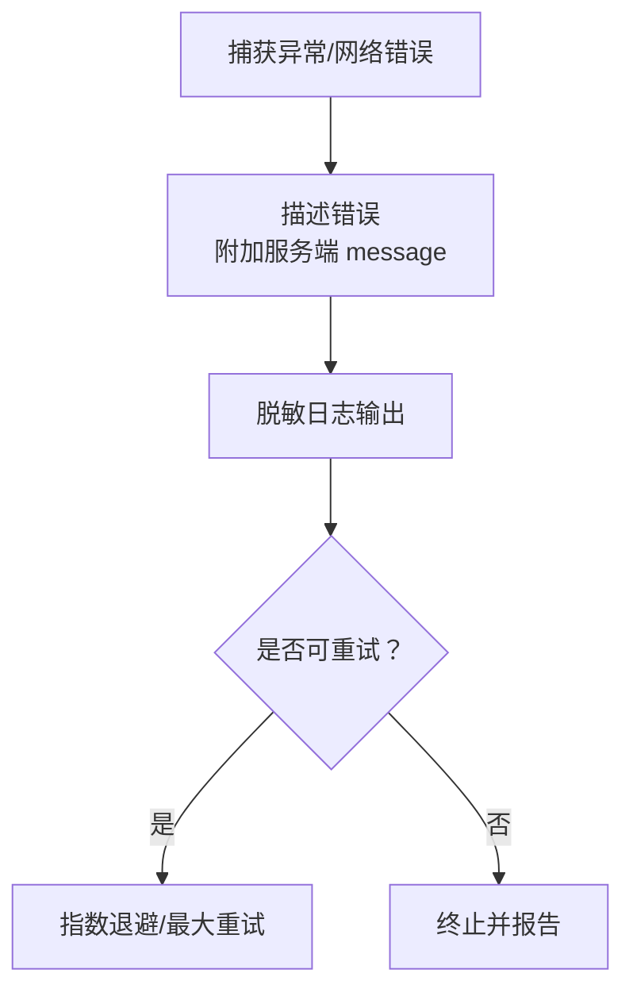
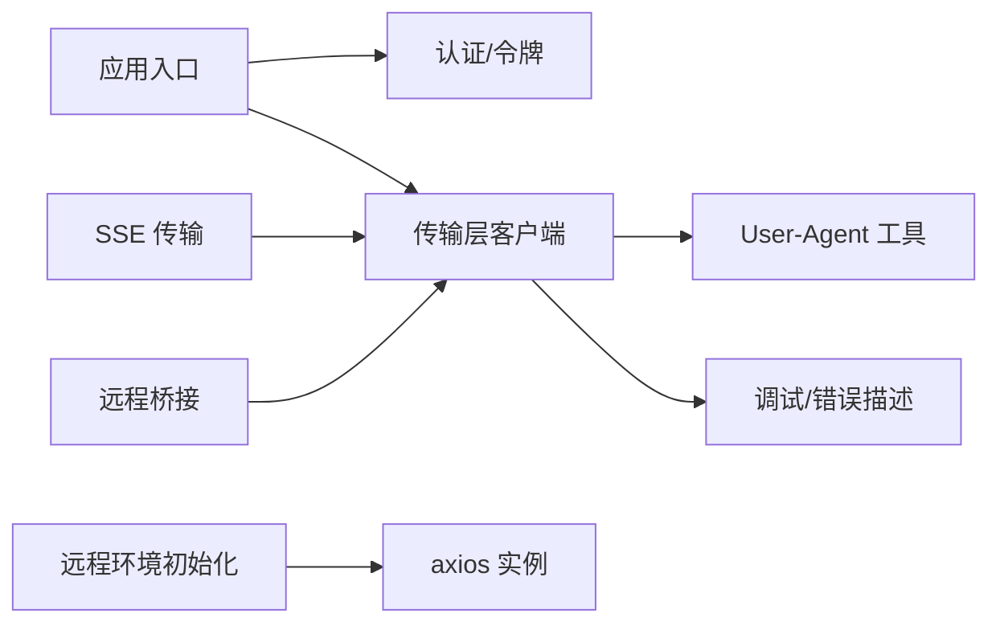

# cURL API 技能

<cite>
**本文引用的文件**
- [src/main.tsx](file://src/main.tsx)
- [src/cli/transports/ccrClient.ts](file://src/cli/transports/ccrClient.ts)
- [src/cli/transports/SSETransport.ts](file://src/cli/transports/SSETransport.ts)
- [src/bridge/remoteBridgeCore.ts](file://src/bridge/remoteBridgeCore.ts)
- [src/utils/userAgent.ts](file://src/utils/userAgent.ts)
- [src/bridge/debugUtils.ts](file://src/bridge/debugUtils.ts)
- [src/commands/remote-setup/api.ts](file://src/commands/remote-setup/api.ts)
- [src/cli/handlers/auth.ts](file://src/cli/handlers/auth.ts)
- [src/utils/teleport/api.ts](file://src/utils/teleport/api.ts)
</cite>

## 目录
1. [简介](#简介)
2. [项目结构](#项目结构)
3. [核心组件](#核心组件)
4. [架构总览](#架构总览)
5. [详细组件分析](#详细组件分析)
6. [依赖关系分析](#依赖关系分析)
7. [性能考量](#性能考量)
8. [故障排除指南](#故障排除指南)
9. [结论](#结论)
10. [附录](#附录)

## 简介
本文件面向希望使用 cURL 命令行直接调用 Claude API 的用户与工程师，系统性介绍 HTTP 请求构建、认证配置、请求头规范、响应处理以及常见端点的调用方式。文档同时结合仓库中已实现的客户端行为（如认证头、版本头、User-Agent、重试与退避策略等），帮助读者在命令行环境下复用这些最佳实践，确保请求稳定、可诊断且符合服务端要求。

## 项目结构
围绕 cURL 使用的关键实现主要分布在以下模块：
- 认证与令牌刷新：应用启动时准备 API 凭据，并通过闭包获取最新访问令牌
- 传输层与请求头：统一设置 Content-Type、anthropic-version、User-Agent 等
- 会话与桥接：远程控制与 SSE 传输对认证头有严格要求
- 远程环境初始化：示例化远程会话的 HTTP POST 请求
- 调试与错误描述：统一的错误消息提取与脱敏日志

**图表来源**
- [src/main.tsx:3315-3328](file://src/main.tsx#L3315-L3328)
- [src/cli/transports/ccrClient.ts:556-580](file://src/cli/transports/ccrClient.ts#L556-L580)
- [src/cli/transports/SSETransport.ts:572-601](file://src/cli/transports/SSETransport.ts#L572-L601)
- [src/commands/remote-setup/api.ts:140-167](file://src/commands/remote-setup/api.ts#L140-L167)
- [src/bridge/debugUtils.ts:55-82](file://src/bridge/debugUtils.ts#L55-L82)

**章节来源**
- [src/main.tsx:3315-3328](file://src/main.tsx#L3315-L3328)
- [src/cli/transports/ccrClient.ts:556-580](file://src/cli/transports/ccrClient.ts#L556-L580)
- [src/cli/transports/SSETransport.ts:572-601](file://src/cli/transports/SSETransport.ts#L572-L601)
- [src/commands/remote-setup/api.ts:140-167](file://src/commands/remote-setup/api.ts#L140-L167)
- [src/bridge/debugUtils.ts:55-82](file://src/bridge/debugUtils.ts#L55-L82)

## 核心组件
- 认证与令牌管理
  - 应用启动时执行令牌检查与刷新，随后准备 API 请求所需的组织 UUID 与访问令牌
  - 通过闭包获取访问令牌，保证断连后能获取新鲜令牌
- 统一请求头
  - 固定 Content-Type 为 application/json
  - 设置 anthropic-version 为 2023-06-01
  - 设置 User-Agent 为 claude-code/<版本>
- 传输层与重试
  - 传输层客户端封装了统一的请求方法，自动处理 409 代际不一致、429 退避提示等
  - GET 请求具备指数退避与最大重试次数
- 远程环境初始化
  - 提供一个示例化的 HTTP POST 请求，用于创建默认远程环境配置

**章节来源**
- [src/main.tsx:3315-3328](file://src/main.tsx#L3315-L3328)
- [src/cli/transports/ccrClient.ts:556-580](file://src/cli/transports/ccrClient.ts#L556-L580)
- [src/utils/userAgent.ts:8-10](file://src/utils/userAgent.ts#L8-L10)
- [src/cli/transports/ccrClient.ts:905-944](file://src/cli/transports/ccrClient.ts#L905-L944)
- [src/commands/remote-setup/api.ts:140-167](file://src/commands/remote-setup/api.ts#L140-L167)

## 架构总览
下图展示了从应用入口到具体 API 端点的调用路径，以及关键请求头与版本号的注入位置。

**图表来源**
- [src/main.tsx:3315-3328](file://src/main.tsx#L3315-L3328)
- [src/cli/transports/ccrClient.ts:556-580](file://src/cli/transports/ccrClient.ts#L556-L580)
- [src/utils/userAgent.ts:8-10](file://src/utils/userAgent.ts#L8-L10)

## 详细组件分析

### 认证与令牌流程
- 在应用启动阶段，先进行 OAuth 令牌检查与刷新，再准备 API 请求所需的凭据
- 通过闭包获取访问令牌，确保后续请求始终携带有效令牌
- 若准备凭据失败，应用会以错误退出并输出提示

**图表来源**
- [src/main.tsx:3315-3328](file://src/main.tsx#L3315-L3328)

**章节来源**
- [src/main.tsx:3315-3328](file://src/main.tsx#L3315-L3328)

### 传输层与请求头规范
- 所有请求统一注入以下头部：
  - Content-Type: application/json
  - anthropic-version: 2023-06-01
  - User-Agent: claude-code/<版本>
- 传输层客户端还负责：
  - 处理 409 代际不一致（更新本地 epoch）
  - 读取 429 的 Retry-After 并按建议退避
  - 对 GET 请求进行最多 10 次的指数退避重试

**图表来源**
- [src/cli/transports/ccrClient.ts:556-580](file://src/cli/transports/ccrClient.ts#L556-L580)
- [src/cli/transports/ccrClient.ts:905-944](file://src/cli/transports/ccrClient.ts#L905-L944)
- [src/utils/userAgent.ts:8-10](file://src/utils/userAgent.ts#L8-L10)

**章节来源**
- [src/cli/transports/ccrClient.ts:556-580](file://src/cli/transports/ccrClient.ts#L556-L580)
- [src/cli/transports/ccrClient.ts:905-944](file://src/cli/transports/ccrClient.ts#L905-L944)
- [src/utils/userAgent.ts:8-10](file://src/utils/userAgent.ts#L8-L10)

### SSE 写入与认证要求
- SSE 写入端点同样需要有效的会话令牌，否则会记录无令牌的日志并跳过发送
- 写入时同样注入 Content-Type、anthropic-version 与 User-Agent
- 支持最多若干次重试，若成功则返回 200/201

**图表来源**
- [src/cli/transports/SSETransport.ts:572-601](file://src/cli/transports/SSETransport.ts#L572-L601)

**章节来源**
- [src/cli/transports/SSETransport.ts:572-601](file://src/cli/transports/SSETransport.ts#L572-L601)

### 远程环境初始化（示例化 POST）
- 提供一个示例化的 HTTP POST 请求，用于创建默认远程环境配置
- 请求体包含名称、类型、描述及配置（如工作目录、语言版本、网络配置等）
- 该示例可作为 cURL POST 的模板参考

**图表来源**
- [src/commands/remote-setup/api.ts:140-167](file://src/commands/remote-setup/api.ts#L140-L167)

**章节来源**
- [src/commands/remote-setup/api.ts:140-167](file://src/commands/remote-setup/api.ts#L140-L167)

### 错误描述与调试
- 统一的错误描述函数会尝试从响应体中提取服务端提供的 message 或 error.message 字段
- 日志中会对敏感信息进行脱敏处理，避免泄露
- 传输层对网络错误与 5xx 错误进行可重试判定

**图表来源**
- [src/bridge/debugUtils.ts:55-82](file://src/bridge/debugUtils.ts#L55-L82)
- [src/utils/teleport/api.ts:21-41](file://src/utils/teleport/api.ts#L21-L41)

**章节来源**
- [src/bridge/debugUtils.ts:55-82](file://src/bridge/debugUtils.ts#L55-L82)
- [src/utils/teleport/api.ts:21-41](file://src/utils/teleport/api.ts#L21-L41)

## 依赖关系分析
- 应用入口依赖认证模块以准备凭据与令牌
- 传输层客户端依赖代理与超时配置，统一注入请求头
- SSE 传输与远程桥接也遵循相同的头部规范
- 远程环境初始化使用 axios 发送 POST 请求
- 调试模块贯穿于各层，提供统一的错误描述与日志脱敏

**图表来源**
- [src/main.tsx:3315-3328](file://src/main.tsx#L3315-L3328)
- [src/cli/transports/ccrClient.ts:556-580](file://src/cli/transports/ccrClient.ts#L556-L580)
- [src/utils/userAgent.ts:8-10](file://src/utils/userAgent.ts#L8-L10)
- [src/bridge/debugUtils.ts:55-82](file://src/bridge/debugUtils.ts#L55-L82)
- [src/cli/transports/SSETransport.ts:572-601](file://src/cli/transports/SSETransport.ts#L572-L601)
- [src/bridge/remoteBridgeCore.ts:81-87](file://src/bridge/remoteBridgeCore.ts#L81-L87)
- [src/commands/remote-setup/api.ts:140-167](file://src/commands/remote-setup/api.ts#L140-L167)

**章节来源**
- [src/main.tsx:3315-3328](file://src/main.tsx#L3315-L3328)
- [src/cli/transports/ccrClient.ts:556-580](file://src/cli/transports/ccrClient.ts#L556-L580)
- [src/utils/userAgent.ts:8-10](file://src/utils/userAgent.ts#L8-L10)
- [src/bridge/debugUtils.ts:55-82](file://src/bridge/debugUtils.ts#L55-L82)
- [src/cli/transports/SSETransport.ts:572-601](file://src/cli/transports/SSETransport.ts#L572-L601)
- [src/bridge/remoteBridgeCore.ts:81-87](file://src/bridge/remoteBridgeCore.ts#L81-L87)
- [src/commands/remote-setup/api.ts:140-167](file://src/commands/remote-setup/api.ts#L140-L167)

## 性能考量
- 指数退避与抖动：GET 请求采用指数退避与随机抖动，避免雪崩效应
- Retry-After：当服务端返回 429 时，优先尊重服务端的回退建议
- 超时与连接复用：传输层支持长连接与合理超时，降低握手开销
- 重试上限：限制最大重试次数，防止无限等待

**章节来源**
- [src/cli/transports/ccrClient.ts:905-944](file://src/cli/transports/ccrClient.ts#L905-L944)
- [src/utils/teleport/api.ts:15-17](file://src/utils/teleport/api.ts#L15-L17)

## 故障排除指南
- 无认证头
  - 现象：SSE 写入或远程桥接记录“无会话令牌”
  - 排查：确认已正确登录并获取访问令牌；检查令牌是否过期
- 409 代际不一致
  - 现象：收到 409 状态
  - 排查：传输层会自动处理代际不一致；若持续出现，检查本地 epoch 配置
- 429 速率限制
  - 现象：频繁遇到 429
  - 排查：读取 Retry-After 并按建议退避；减少并发请求
- 5xx 服务器错误
  - 现象：服务端返回 5xx
  - 排查：传输层会自动重试；若仍失败，检查网络与代理配置
- 网络错误
  - 现象：无响应或连接中断
  - 排查：检查网络连通性、代理与证书；必要时开启调试日志

**章节来源**
- [src/cli/transports/SSETransport.ts:572-601](file://src/cli/transports/SSETransport.ts#L572-L601)
- [src/cli/transports/ccrClient.ts:938-940](file://src/cli/transports/ccrClient.ts#L938-L940)
- [src/utils/teleport/api.ts:21-41](file://src/utils/teleport/api.ts#L21-L41)

## 结论
通过复用应用中的认证与请求头规范、重试与退避策略，以及统一的错误描述与日志脱敏机制，可以在命令行环境中稳定地调用 Claude API。建议在使用 cURL 时：
- 显式设置 Content-Type、anthropic-version 与 User-Agent
- 在 429 时尊重 Retry-After 并实施退避
- 对 5xx 与网络错误进行有限重试
- 使用调试输出定位问题，注意脱敏日志

## 附录
- 认证状态查询
  - 参考认证状态处理器，了解当前使用的认证方式（OAuth、API Key、第三方等）
- 版本头与 UA
  - anthropic-version 固定为 2023-06-01
  - User-Agent 来自工具函数，格式为 claude-code/<版本>

**章节来源**
- [src/cli/handlers/auth.ts:232-260](file://src/cli/handlers/auth.ts#L232-L260)
- [src/utils/userAgent.ts:8-10](file://src/utils/userAgent.ts#L8-L10)