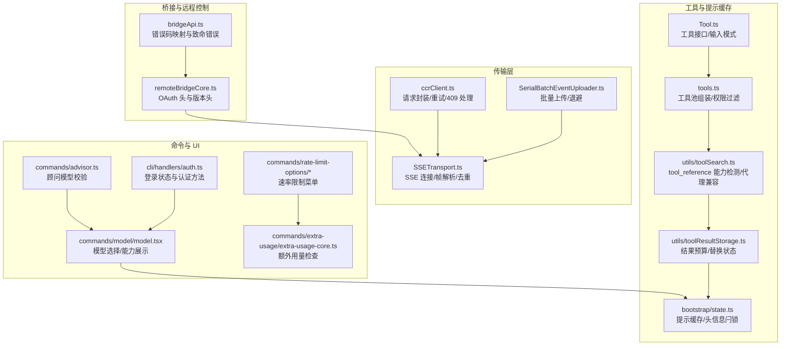
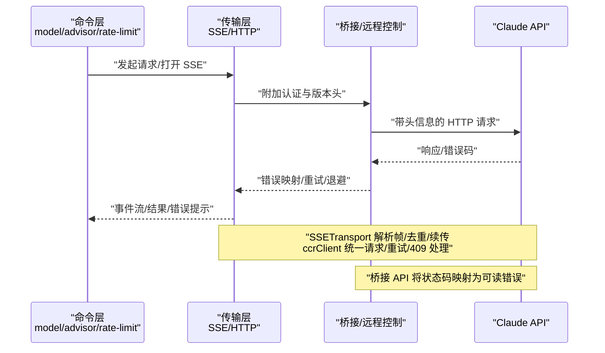
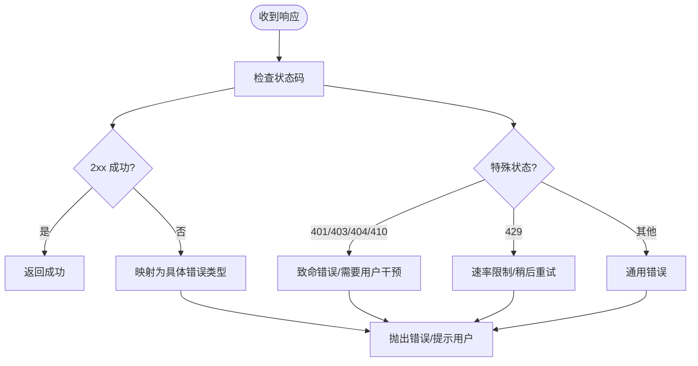
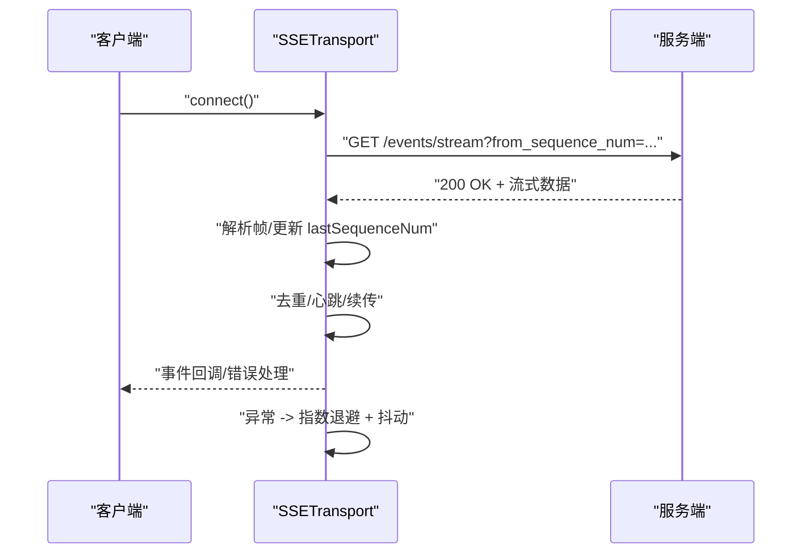
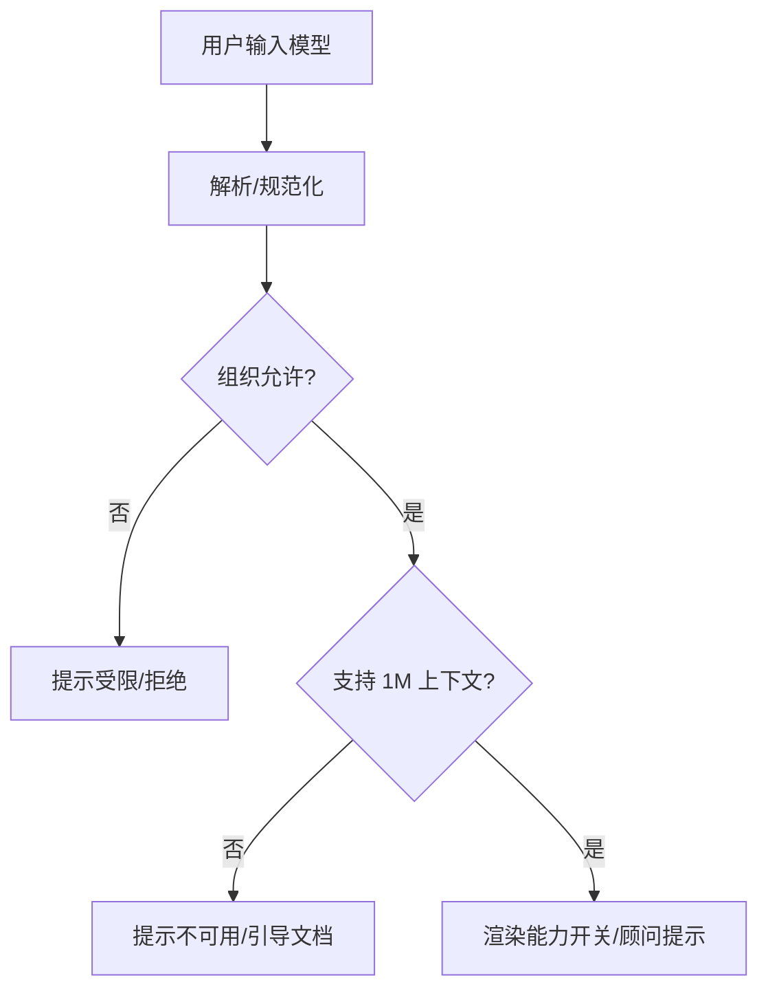
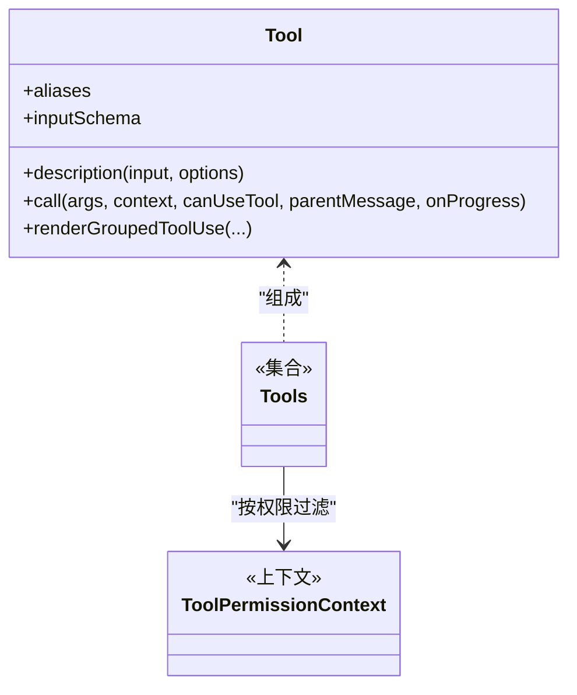
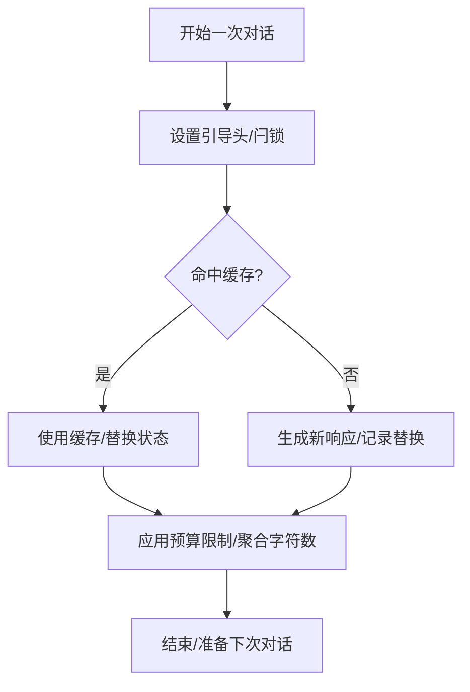
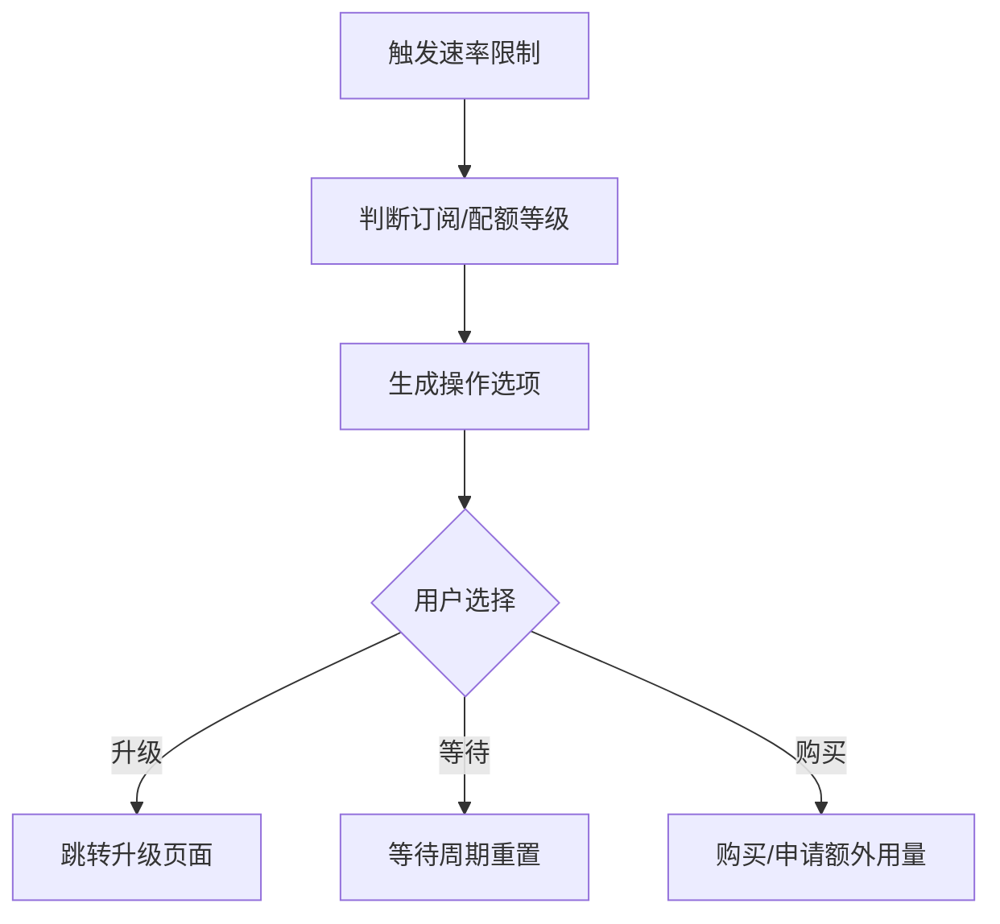
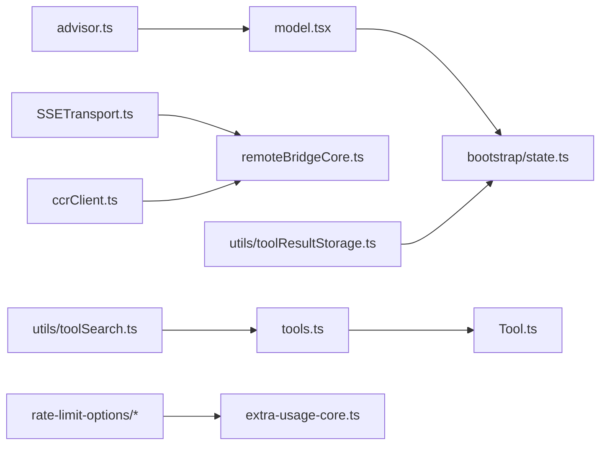

# 共享概念与最佳实践

<cite>
**本文引用的文件**   
- [src/bridge/bridgeApi.ts](file://src/bridge/bridgeApi.ts)
- [src/cli/transports/ccrClient.ts](file://src/cli/transports/ccrClient.ts)
- [src/cli/transports/SSETransport.ts](file://src/cli/transports/SSETransport.ts)
- [src/cli/transports/SerialBatchEventUploader.ts](file://src/cli/transports/SerialBatchEventUploader.ts)
- [src/commands/remote-setup/api.ts](file://src/commands/remote-setup/api.ts)
- [src/commands/model/model.tsx](file://src/commands/model/model.tsx)
- [src/cli/print.ts](file://src/cli/print.ts)
- [src/commands/advisor.ts](file://src/commands/advisor.ts)
- [src/utils/toolSearch.ts](file://src/utils/toolSearch.ts)
- [src/utils/toolResultStorage.ts](file://src/utils/toolResultStorage.ts)
- [src/bootstrap/state.ts](file://src/bootstrap/state.ts)
- [src/Tool.ts](file://src/Tool.ts)
- [src/tools.ts](file://src/tools.ts)
- [src/cli/print.ts](file://src/cli/print.ts)
- [src/commands/rate-limit-options/index.ts](file://src/commands/rate-limit-options/index.ts)
- [src/commands/rate-limit-options/rate-limit-options.tsx](file://src/commands/rate-limit-options/rate-limit-options.tsx)
- [src/commands/extra-usage/extra-usage-core.ts](file://src/commands/extra-usage/extra-usage-core.ts)
- [src/cli/handlers/auth.ts](file://src/cli/handlers/auth.ts)
- [src/bridge/remoteBridgeCore.ts](file://src/bridge/remoteBridgeCore.ts)
</cite>

## 目录
1. [引言](#引言)
2. [项目结构](#项目结构)
3. [核心组件](#核心组件)
4. [架构总览](#架构总览)
5. [详细组件分析](#详细组件分析)
6. [依赖关系分析](#依赖关系分析)
7. [性能考量](#性能考量)
8. [故障排查指南](#故障排查指南)
9. [结论](#结论)
10. [附录](#附录)

## 引言
本文件面向多语言开发者，系统化梳理 Claude API 在本仓库中的通用概念与最佳实践，覆盖错误码处理、实时流（SSE）交互、模型选择与能力开关、提示缓存与工具使用策略，并给出跨语言一致性指导与性能优化建议。内容以实际代码为依据，辅以图示帮助理解。

## 项目结构
围绕“通用概念”的实现，相关代码主要分布在以下模块：
- 桥接与远程控制：桥接 API 错误处理、远程控制会话头信息与认证
- 传输层：HTTP 客户端、SSE 流解析与重连、事件批量上传与退避
- 命令与 UI：模型选择、顾问模型设置、速率限制与额外用量
- 工具体系：工具定义、权限过滤、工具搜索与 tool_reference 支持
- 提示缓存：引导头信息与 1 小时提示缓存白名单/资格位

**图表来源**
- [src/bridge/bridgeApi.ts:454-500](file://src/bridge/bridgeApi.ts#L454-L500)
- [src/bridge/remoteBridgeCore.ts:74-87](file://src/bridge/remoteBridgeCore.ts#L74-L87)
- [src/cli/transports/ccrClient.ts:556-944](file://src/cli/transports/ccrClient.ts#L556-L944)
- [src/cli/transports/SSETransport.ts:84-384](file://src/cli/transports/SSETransport.ts#L84-L384)
- [src/cli/transports/SerialBatchEventUploader.ts:235-275](file://src/cli/transports/SerialBatchEventUploader.ts#L235-L275)
- [src/commands/model/model.tsx:95-286](file://src/commands/model/model.tsx#L95-L286)
- [src/commands/advisor.ts:43-88](file://src/commands/advisor.ts#L43-L88)
- [src/commands/rate-limit-options/index.ts:1-19](file://src/commands/rate-limit-options/index.ts#L1-L19)
- [src/commands/rate-limit-options/rate-limit-options.tsx:22-149](file://src/commands/rate-limit-options/rate-limit-options.tsx#L22-L149)
- [src/commands/extra-usage/extra-usage-core.ts:32-63](file://src/commands/extra-usage/extra-usage-core.ts#L32-L63)
- [src/cli/handlers/auth.ts:216-260](file://src/cli/handlers/auth.ts#L216-L260)
- [src/Tool.ts:342-714](file://src/Tool.ts#L342-L714)
- [src/tools.ts:253-352](file://src/tools.ts#L253-L352)
- [src/utils/toolSearch.ts:226-252](file://src/utils/toolSearch.ts#L226-L252)
- [src/utils/toolResultStorage.ts:395-434](file://src/utils/toolResultStorage.ts#L395-L434)
- [src/bootstrap/state.ts:1688-1757](file://src/bootstrap/state.ts#L1688-L1757)

**章节来源**
- [src/bridge/bridgeApi.ts:454-500](file://src/bridge/bridgeApi.ts#L454-L500)
- [src/cli/transports/ccrClient.ts:556-944](file://src/cli/transports/ccrClient.ts#L556-L944)
- [src/cli/transports/SSETransport.ts:84-384](file://src/cli/transports/SSETransport.ts#L84-L384)
- [src/cli/transports/SerialBatchEventUploader.ts:235-275](file://src/cli/transports/SerialBatchEventUploader.ts#L235-L275)
- [src/commands/remote-setup/api.ts:140-182](file://src/commands/remote-setup/api.ts#L140-L182)
- [src/commands/model/model.tsx:95-286](file://src/commands/model/model.tsx#L95-L286)
- [src/commands/advisor.ts:43-88](file://src/commands/advisor.ts#L43-L88)
- [src/utils/toolSearch.ts:226-252](file://src/utils/toolSearch.ts#L226-L252)
- [src/utils/toolResultStorage.ts:395-434](file://src/utils/toolResultStorage.ts#L395-L434)
- [src/bootstrap/state.ts:1688-1757](file://src/bootstrap/state.ts#L1688-L1757)
- [src/Tool.ts:342-714](file://src/Tool.ts#L342-L714)
- [src/tools.ts:253-352](file://src/tools.ts#L253-L352)
- [src/commands/rate-limit-options/index.ts:1-19](file://src/commands/rate-limit-options/index.ts#L1-L19)
- [src/commands/rate-limit-options/rate-limit-options.tsx:22-149](file://src/commands/rate-limit-options/rate-limit-options.tsx#L22-L149)
- [src/commands/extra-usage/extra-usage-core.ts:32-63](file://src/commands/extra-usage/extra-usage-core.ts#L32-L63)
- [src/cli/handlers/auth.ts:216-260](file://src/cli/handlers/auth.ts#L216-L260)
- [src/bridge/remoteBridgeCore.ts:74-87](file://src/bridge/remoteBridgeCore.ts#L74-L87)

## 核心组件
- 错误码与致命错误处理：桥接 API 对常见 HTTP 状态进行统一映射，区分可恢复与不可恢复错误，便于上层统一处理与用户提示。
- 实时源（SSE）：SSETransport 负责连接、帧解析、序列号去重、断线重连与健康心跳维护；支持从上次高水位续传。
- 模型与能力：模型命令负责解析用户指定模型、校验组织限制与上下文扩展可用性，并在 UI 中展示支持的能力（如 Effort、自适应思考、Fast Mode、Auto Mode）。
- 工具使用与搜索：工具定义抽象了输入模式与调用协议；工具池按权限规则过滤；工具搜索通过 tool_reference 能力在模型与工具间建立动态关联。
- 提示缓存：通过引导头信息与状态闩锁控制是否命中 1 小时提示缓存，结合替换状态与预算限制提升缓存命中率与稳定性。
- 速率限制与额外用量：提供速率限制选项菜单与额外用量检查流程，支持团队/企业场景下的配额管理与自助申请路径。

**章节来源**
- [src/bridge/bridgeApi.ts:454-500](file://src/bridge/bridgeApi.ts#L454-L500)
- [src/cli/transports/SSETransport.ts:84-384](file://src/cli/transports/SSETransport.ts#L84-L384)
- [src/commands/model/model.tsx:95-286](file://src/commands/model/model.tsx#L95-L286)
- [src/Tool.ts:342-714](file://src/Tool.ts#L342-L714)
- [src/tools.ts:253-352](file://src/tools.ts#L253-L352)
- [src/utils/toolSearch.ts:226-252](file://src/utils/toolSearch.ts#L226-L252)
- [src/utils/toolResultStorage.ts:395-434](file://src/utils/toolResultStorage.ts#L395-L434)
- [src/bootstrap/state.ts:1688-1757](file://src/bootstrap/state.ts#L1688-L1757)
- [src/commands/rate-limit-options/rate-limit-options.tsx:22-149](file://src/commands/rate-limit-options/rate-limit-options.tsx#L22-L149)
- [src/commands/extra-usage/extra-usage-core.ts:32-63](file://src/commands/extra-usage/extra-usage-core.ts#L32-L63)

## 架构总览
下图展示了从命令到传输层再到 API 的关键调用链路，以及错误处理与速率限制的贯穿路径。

**图表来源**
- [src/commands/model/model.tsx:95-286](file://src/commands/model/model.tsx#L95-L286)
- [src/commands/advisor.ts:43-88](file://src/commands/advisor.ts#L43-L88)
- [src/cli/transports/SSETransport.ts:84-384](file://src/cli/transports/SSETransport.ts#L84-L384)
- [src/cli/transports/ccrClient.ts:556-944](file://src/cli/transports/ccrClient.ts#L556-L944)
- [src/bridge/bridgeApi.ts:454-500](file://src/bridge/bridgeApi.ts#L454-L500)
- [src/bridge/remoteBridgeCore.ts:74-87](file://src/bridge/remoteBridgeCore.ts#L74-L87)

## 详细组件分析

### 错误码与致命错误处理
- 桥接层对常见状态码进行统一映射：401 认证失败、403 权限不足或会话过期、404 未找到、410 会话过期、429 速率限制等；非预期状态抛出通用错误。
- 配合远程控制会话生命周期，确保过期与权限问题能被清晰识别与提示。

**图表来源**
- [src/bridge/bridgeApi.ts:454-500](file://src/bridge/bridgeApi.ts#L454-L500)

**章节来源**
- [src/bridge/bridgeApi.ts:454-500](file://src/bridge/bridgeApi.ts#L454-L500)

### 实时源（SSE）与事件流
- 连接与续传：基于上次最高序列号续传，避免重复消息；连接成功后启动健康心跳计时器。
- 帧解析与去重：按 SSE 规范解析 event/id/data 字段；序列号去重并限制内存占用。
- 重连与退避：指数退避叠加抖动，尊重服务器 Retry-After 提示，避免“惊群效应”。

**图表来源**
- [src/cli/transports/SSETransport.ts:231-384](file://src/cli/transports/SSETransport.ts#L231-L384)
- [src/cli/transports/SerialBatchEventUploader.ts:235-275](file://src/cli/transports/SerialBatchEventUploader.ts#L235-L275)

**章节来源**
- [src/cli/transports/SSETransport.ts:84-384](file://src/cli/transports/SSETransport.ts#L84-L384)
- [src/cli/transports/SerialBatchEventUploader.ts:235-275](file://src/cli/transports/SerialBatchEventUploader.ts#L235-L275)

### 模型列表与能力开关
- 模型解析与校验：支持默认模型、别名与用户指定模型；校验组织限制与 1M 上下文访问。
- 能力展示：根据模型能力动态显示 Effort、自适应思考、Fast Mode、Auto Mode 等开关。
- 顾问模型：校验模型是否支持顾问功能，不支持时提示切换到受支持模型。

**图表来源**
- [src/commands/model/model.tsx:95-286](file://src/commands/model/model.tsx#L95-L286)
- [src/commands/advisor.ts:43-88](file://src/commands/advisor.ts#L43-L88)

**章节来源**
- [src/commands/model/model.tsx:95-286](file://src/commands/model/model.tsx#L95-L286)
- [src/commands/advisor.ts:43-88](file://src/commands/advisor.ts#L43-L88)

### 工具使用与工具搜索（tool_reference）
- 工具定义：统一的工具接口与输入模式，支持别名、描述、进度回调与分组渲染。
- 工具池组装：内置工具与 MCP 工具合并，内置优先去重；按权限规则过滤；REPL 模式下隐藏基础工具。
- 工具搜索：检测模型是否支持 tool_reference，考虑代理兼容性与阈值；在 MCP 模式下启用延迟加载。

**图表来源**
- [src/Tool.ts:342-714](file://src/Tool.ts#L342-L714)
- [src/tools.ts:253-352](file://src/tools.ts#L253-L352)

**章节来源**
- [src/Tool.ts:342-714](file://src/Tool.ts#L342-L714)
- [src/tools.ts:253-352](file://src/tools.ts#L253-L352)
- [src/utils/toolSearch.ts:226-252](file://src/utils/toolSearch.ts#L226-L252)
- [src/utils/toolSearch.ts:364-392](file://src/utils/toolSearch.ts#L364-L392)

### 提示缓存与工具结果预算
- 提示缓存：通过引导头与状态闩锁控制 1 小时提示缓存资格；支持允许白名单与资格位复位。
- 结果预算与替换状态：克隆替换状态以保证缓存共享分支的一致性；聚合预算限制支持特性开关覆盖。

**图表来源**
- [src/bootstrap/state.ts:1688-1757](file://src/bootstrap/state.ts#L1688-L1757)
- [src/utils/toolResultStorage.ts:395-434](file://src/utils/toolResultStorage.ts#L395-L434)

**章节来源**
- [src/bootstrap/state.ts:1688-1757](file://src/bootstrap/state.ts#L1688-L1757)
- [src/utils/toolResultStorage.ts:395-434](file://src/utils/toolResultStorage.ts#L395-L434)

### 速率限制与额外用量
- 速率限制菜单：根据订阅等级与配额状态提供升级、等待或购买等选项；支持“先买后用”策略。
- 额外用量：团队/企业场景下检查管理员权限与配额上限，必要时引导联系管理员或自助申请。

**图表来源**
- [src/commands/rate-limit-options/rate-limit-options.tsx:22-149](file://src/commands/rate-limit-options/rate-limit-options.tsx#L22-L149)
- [src/commands/extra-usage/extra-usage-core.ts:32-63](file://src/commands/extra-usage/extra-usage-core.ts#L32-L63)

**章节来源**
- [src/commands/rate-limit-options/index.ts:1-19](file://src/commands/rate-limit-options/index.ts#L1-L19)
- [src/commands/rate-limit-options/rate-limit-options.tsx:22-149](file://src/commands/rate-limit-options/rate-limit-options.tsx#L22-L149)
- [src/commands/extra-usage/extra-usage-core.ts:32-63](file://src/commands/extra-usage/extra-usage-core.ts#L32-L63)

## 依赖关系分析
- 组件耦合：传输层与桥接层强耦合于认证与版本头；模型与工具模块通过状态与上下文解耦。
- 外部依赖：SSETransport 依赖浏览器/Node 可读流；ccrClient 依赖 HTTP 客户端与重试逻辑；工具搜索依赖代理与模型能力检测。
- 循环依赖：工具池组装与权限过滤相互独立，避免循环；状态闩锁仅在引导阶段使用。

**图表来源**
- [src/commands/model/model.tsx:95-286](file://src/commands/model/model.tsx#L95-L286)
- [src/commands/advisor.ts:43-88](file://src/commands/advisor.ts#L43-L88)
- [src/cli/transports/SSETransport.ts:84-384](file://src/cli/transports/SSETransport.ts#L84-L384)
- [src/cli/transports/ccrClient.ts:556-944](file://src/cli/transports/ccrClient.ts#L556-L944)
- [src/bridge/remoteBridgeCore.ts:74-87](file://src/bridge/remoteBridgeCore.ts#L74-L87)
- [src/tools.ts:253-352](file://src/tools.ts#L253-L352)
- [src/Tool.ts:342-714](file://src/Tool.ts#L342-L714)
- [src/utils/toolSearch.ts:226-252](file://src/utils/toolSearch.ts#L226-L252)
- [src/utils/toolResultStorage.ts:395-434](file://src/utils/toolResultStorage.ts#L395-L434)
- [src/bootstrap/state.ts:1688-1757](file://src/bootstrap/state.ts#L1688-L1757)
- [src/commands/rate-limit-options/rate-limit-options.tsx:22-149](file://src/commands/rate-limit-options/rate-limit-options.tsx#L22-L149)
- [src/commands/extra-usage/extra-usage-core.ts:32-63](file://src/commands/extra-usage/extra-usage-core.ts#L32-L63)

**章节来源**
- 同上各文件对应段落

## 性能考量
- 指数退避与抖动：在重试与 SSE 重连中采用指数退避并叠加随机抖动，降低并发峰值与服务器压力。
- 批量上传与背压：事件上传器释放背压时批量处理，减少频繁唤醒开销。
- 缓存命中与预算：通过替换状态克隆与预算限制，提高提示缓存命中率并控制工具结果体积。
- 代理兼容与延迟加载：在代理不支持 tool_reference 时禁用工具搜索以避免无效往返；在 MCP 模式下启用延迟加载减少主上下文负担。

**章节来源**
- [src/cli/transports/SerialBatchEventUploader.ts:235-275](file://src/cli/transports/SerialBatchEventUploader.ts#L235-L275)
- [src/utils/toolResultStorage.ts:395-434](file://src/utils/toolResultStorage.ts#L395-L434)
- [src/utils/toolSearch.ts:282-311](file://src/utils/toolSearch.ts#L282-L311)
- [src/utils/toolSearch.ts:364-392](file://src/utils/toolSearch.ts#L364-L392)

## 故障排查指南
- 登录与认证
  - 使用登录状态命令查看当前认证方式（OAuth、API Key、第三方）；若失败，结合 SSL 错误提示定位网络/证书问题。
- 桥接与远程控制
  - 401/403/410：检查会话有效期与组织权限；按提示重新登录或 /remote-control。
  - 429：降低轮询频率或等待配额重置。
- SSE 连接
  - 断线重连：确认网络稳定与服务器可达；关注序列号去重日志，避免重复处理。
  - 帧解析：留意注释与多行 data 字段拼接；保持客户端心跳刷新。
- 工具搜索
  - tool_reference 不生效：检查代理是否转发 beta 头；必要时显式设置环境变量开启。
- 模型与顾问
  - 模型不可用：确认组织限制与 1M 上下文访问；切换到受支持模型。
  - 顾问不可用：提示切换到支持顾问的模型。

**章节来源**
- [src/cli/handlers/auth.ts:216-260](file://src/cli/handlers/auth.ts#L216-L260)
- [src/bridge/bridgeApi.ts:454-500](file://src/bridge/bridgeApi.ts#L454-L500)
- [src/cli/transports/SSETransport.ts:231-384](file://src/cli/transports/SSETransport.ts#L231-L384)
- [src/utils/toolSearch.ts:282-311](file://src/utils/toolSearch.ts#L282-L311)
- [src/commands/model/model.tsx:95-286](file://src/commands/model/model.tsx#L95-L286)
- [src/commands/advisor.ts:43-88](file://src/commands/advisor.ts#L43-L88)

## 结论
本仓库围绕 Claude API 的通用概念形成了从传输层到工具与模型的完整实现闭环：错误码映射确保一致的用户反馈；SSE 提供可靠的实时交互；模型与工具能力通过状态与上下文灵活组合；提示缓存与预算机制提升性能与稳定性；速率限制与额外用量流程满足团队与企业场景需求。遵循本文的最佳实践与跨语言一致性指导，可在多语言环境中获得一致且高性能的集成体验。

## 附录
- 跨语言一致性建议
  - 错误码映射：统一将 401/403/404/410/429 映射为可读错误，保留原始细节以便诊断。
  - 实时流：实现序列号去重、续传与健康心跳；尊重服务器 Retry-After 并采用抖动退避。
  - 模型与工具：在客户端维护模型能力清单与工具权限上下文，按需渲染与过滤。
  - 提示缓存：通过引导头与状态闩锁控制缓存资格；在多分支场景克隆替换状态以保证命中一致性。
  - 速率限制：提供用户可选的操作菜单（升级/等待/购买），并在 SDK 层暴露退避策略。
- 调试技巧
  - 开启详细日志：关注连接耗时、重复帧、重试次数与代理兼容性提示。
  - 分层验证：先验证认证与版本头，再检查 SSE 连接，最后核对工具搜索与模型能力。
  - 逐步降级：当代理不支持 tool_reference 时，回退至直接工具列表，避免阻塞主流程。