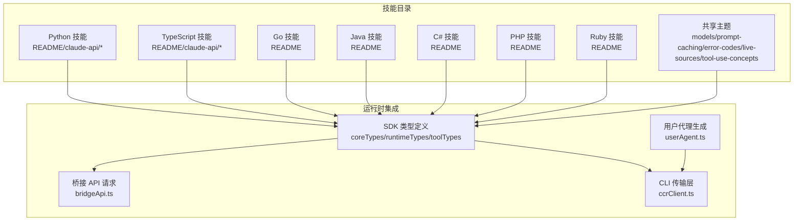
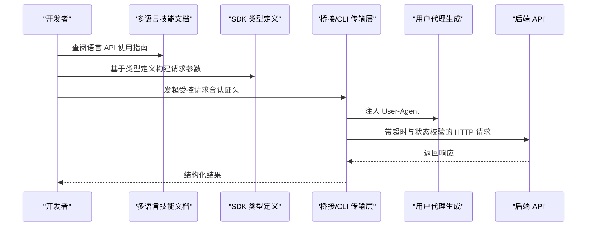
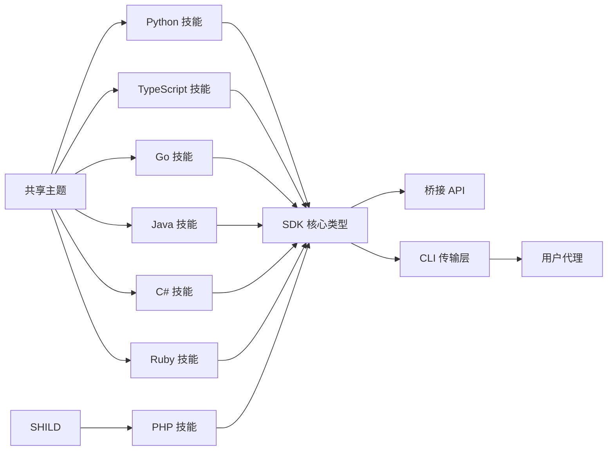

# 多语言 API 技能

<cite>
**本文引用的文件**
- [src/skills/bundled/claude-api/python/README.md](file://src/skills/bundled/claude-api/python/README.md)
- [src/skills/bundled/claude-api/python/claude-api/README.md](file://src/skills/bundled/claude-api/python/claude-api/README.md)
- [src/skills/bundled/claude-api/python/claude-api/streaming.md](file://src/skills/bundled/claude-api/python/claude-api/streaming.md)
- [src/skills/bundled/claude-api/python/claude-api/tool-use.md](file://src/skills/bundled/claude-api/python/claude-api/tool-use.md)
- [src/skills/bundled/claude-api/python/agent-sdk/README.md](file://src/skills/bundled/claude-api/python/agent-sdk/README.md)
- [src/skills/bundled/claude-api/typescript/README.md](file://src/skills/bundled/claude-api/typescript/README.md)
- [src/skills/bundled/claude-api/typescript/claude-api/README.md](file://src/skills/bundled/claude-api/typescript/claude-api/README.md)
- [src/skills/bundled/claude-api/typescript/claude-api/streaming.md](file://src/skills/bundled/claude-api/typescript/claude-api/streaming.md)
- [src/skills/bundled/claude-api/typescript/claude-api/tool-use.md](file://src/skills/bundled/claude-api/typescript/claude-api/tool-use.md)
- [src/skills/bundled/claude-api/typescript/agent-sdk/README.md](file://src/skills/bundled/claude-api/typescript/agent-sdk/README.md)
- [src/skills/bundled/claude-api/go/claude-api.md](file://src/skills/bundled/claude-api/go/claude-api.md)
- [src/skills/bundled/claude-api/java/claude-api.md](file://src/skills/bundled/claude-api/java/claude-api.md)
- [src/skills/bundled/claude-api/csharp/claude-api.md](file://src/skills/bundled/claude-api/csharp/claude-api.md)
- [src/skills/bundled/claude-api/php/claude-api.md](file://src/skills/bundled/claude-api/php/claude-api.md)
- [src/skills/bundled/claude-api/ruby/claude-api.md](file://src/skills/bundled/claude-api/ruby/claude-api.md)
- [src/skills/bundled/claude-api/shared/models.md](file://src/skills/bundled/claude-api/shared/models.md)
- [src/skills/bundled/claude-api/shared/prompt-caching.md](file://src/skills/bundled/claude-api/shared/prompt-caching.md)
- [src/skills/bundled/claude-api/shared/error-codes.md](file://src/skills/bundled/claude-api/shared/error-codes.md)
- [src/skills/bundled/claude-api/shared/live-sources.md](file://src/skills/bundled/claude-api/shared/live-sources.md)
- [src/skills/bundled/claude-api/shared/tool-use-concepts.md](file://src/skills/bundled/claude-api/shared/tool-use-concepts.md)
- [src/skills/bundled/claude-api/curl/examples.md](file://src/skills/bundled/claude-api/curl/examples.md)
- [src/skills/bundled/claude-api/README.md](file://src/skills/bundled/claude-api/README.md)
- [src/skills/bundled/index.ts](file://src/skills/bundled/index.ts)
- [src/entrypoints/sdk/coreTypes.ts](file://src/entrypoints/sdk/coreTypes.ts)
- [src/entrypoints/sdk/runtimeTypes.ts](file://src/entrypoints/sdk/runtimeTypes.ts)
- [src/entrypoints/sdk/toolTypes.ts](file://src/entrypoints/sdk/toolTypes.ts)
- [src/entrypoints/sdk/sdkUtilityTypes.ts](file://src/entrypoints/sdk/sdkUtilityTypes.ts)
- [src/entrypoints/sdk/settingsTypes.generated.ts](file://src/entrypoints/sdk/settingsTypes.generated.ts)
- [src/entrypoints/sdk/controlTypes.ts](file://src/entrypoints/sdk/controlTypes.ts)
- [src/entrypoints/sdk/controlSchemas.ts](file://src/entrypoints/sdk/controlSchemas.ts)
- [src/entrypoints/sdk/coreSchemas.ts](file://src/entrypoints/sdk/coreSchemas.ts)
- [src/entrypoints/sdk/coreTypes.generated.ts](file://src/entrypoints/sdk/coreTypes.generated.ts)
- [src/bridge/bridgeApi.ts](file://src/bridge/bridgeApi.ts)
- [src/cli/transports/ccrClient.ts](file://src/cli/transports/ccrClient.ts)
- [src/utils/userAgent.ts](file://src/utils/userAgent.ts)
- [src/commands/remote-setup/api.ts](file://src/commands/remote-setup/api.ts)
- [src/utils/teleport/environments.ts](file://src/utils/teleport/environments.ts)
- [src/cli/handlers/auth.ts](file://src/cli/handlers/auth.ts)
- [src/commands/insights.ts](file://src/commands/insights.ts)
</cite>

## 目录
1. [简介](#简介)
2. [项目结构](#项目结构)
3. [核心组件](#核心组件)
4. [架构总览](#架构总览)
5. [详细组件分析](#详细组件分析)
6. [依赖关系分析](#依赖关系分析)
7. [性能考量](#性能考量)
8. [故障排查指南](#故障排查指南)
9. [结论](#结论)
10. [附录](#附录)

## 简介
本文件面向希望在多语言环境中使用 Claude API 的开发者，系统性梳理 Claude Code 提供的多语言 API 技能与 SDK 能力，覆盖 Python、TypeScript、Go、Java、C#、PHP、Ruby 等主流语言，并补充共享主题（模型、提示缓存、错误码、实时流、工具调用概念等）。文档以仓库内“已打包技能”为依据，结合 CLI/桥接传输层与认证流程，给出认证配置、SDK 使用要点、最佳实践与常见问题排查建议。

## 项目结构
Claude Code 将多语言 API 使用指南组织为“已打包技能”，位于 src/skills/bundled/claude-api 下，按语言分目录，每个语言目录包含：
- 语言级 README：总体说明与导航
- claude-api 子目录：API 使用细节（如流式响应、工具调用、批量处理、文件 API）
- agent-sdk 子目录：面向代理开发者的 SDK 指南
- shared 子目录：跨语言通用主题（模型、提示缓存、错误码、实时源、工具调用概念）

此外，CLI 与桥接层负责认证、请求头注入与用户代理标识，确保对后端服务的合规访问。

图表来源
- [src/skills/bundled/claude-api/python/README.md](file://src/skills/bundled/claude-api/python/README.md)
- [src/skills/bundled/claude-api/typescript/README.md](file://src/skills/bundled/claude-api/typescript/README.md)
- [src/skills/bundled/claude-api/go/claude-api.md](file://src/skills/bundled/claude-api/go/claude-api.md)
- [src/skills/bundled/claude-api/java/claude-api.md](file://src/skills/bundled/claude-api/java/claude-api.md)
- [src/skills/bundled/claude-api/csharp/claude-api.md](file://src/skills/bundled/claude-api/csharp/claude-api.md)
- [src/skills/bundled/claude-api/php/claude-api.md](file://src/skills/bundled/claude-api/php/claude-api.md)
- [src/skills/bundled/claude-api/ruby/claude-api.md](file://src/skills/bundled/claude-api/ruby/claude-api.md)
- [src/skills/bundled/claude-api/shared/models.md](file://src/skills/bundled/claude-api/shared/models.md)
- [src/entrypoints/sdk/coreTypes.ts](file://src/entrypoints/sdk/coreTypes.ts)
- [src/entrypoints/sdk/runtimeTypes.ts](file://src/entrypoints/sdk/runtimeTypes.ts)
- [src/entrypoints/sdk/toolTypes.ts](file://src/entrypoints/sdk/toolTypes.ts)
- [src/bridge/bridgeApi.ts](file://src/bridge/bridgeApi.ts)
- [src/cli/transports/ccrClient.ts](file://src/cli/transports/ccrClient.ts)
- [src/utils/userAgent.ts](file://src/utils/userAgent.ts)

章节来源
- [src/skills/bundled/claude-api/README.md](file://src/skills/bundled/claude-api/README.md)
- [src/skills/bundled/index.ts](file://src/skills/bundled/index.ts)

## 核心组件
- 已打包技能（多语言）：提供各语言的 API 使用示例与 SDK 指南，是本指南的主要知识来源。
- SDK 类型定义：统一的类型与工具类型，支撑代理与工具开发。
- 桥接与 CLI 传输层：封装认证头、超时、状态校验与用户代理，保障请求一致性。
- 认证与环境管理：登录、状态查询、环境列表与默认云环境创建，确保访问权限与网络策略正确。

章节来源
- [src/entrypoints/sdk/coreTypes.ts](file://src/entrypoints/sdk/coreTypes.ts)
- [src/entrypoints/sdk/runtimeTypes.ts](file://src/entrypoints/sdk/runtimeTypes.ts)
- [src/entrypoints/sdk/toolTypes.ts](file://src/entrypoints/sdk/toolTypes.ts)
- [src/bridge/bridgeApi.ts](file://src/bridge/bridgeApi.ts)
- [src/cli/transports/ccrClient.ts](file://src/cli/transports/ccrClient.ts)
- [src/cli/handlers/auth.ts](file://src/cli/handlers/auth.ts)
- [src/utils/teleport/environments.ts](file://src/utils/teleport/environments.ts)

## 架构总览
下图展示了从“技能使用”到“后端 API”的整体链路：技能文档指导如何构造请求；SDK 类型定义约束参数与返回；桥接或 CLI 传输层负责注入认证头、设置超时与用户代理；最终通过后端接口完成交互。

图表来源
- [src/skills/bundled/claude-api/python/claude-api/README.md](file://src/skills/bundled/claude-api/python/claude-api/README.md)
- [src/entrypoints/sdk/coreTypes.ts](file://src/entrypoints/sdk/coreTypes.ts)
- [src/bridge/bridgeApi.ts](file://src/bridge/bridgeApi.ts)
- [src/cli/transports/ccrClient.ts](file://src/cli/transports/ccrClient.ts)
- [src/utils/userAgent.ts](file://src/utils/userAgent.ts)

## 详细组件分析

### Python 技能
- 总览与导航：README 提供语言级概览与子主题入口。
- Claude API 使用：包含流式响应、工具调用、批量处理、文件 API 等专题。
- Agent SDK：面向代理开发的 SDK 使用指南。
- 最佳实践：遵循共享主题中的模型选择、提示缓存与错误码处理建议。

章节来源
- [src/skills/bundled/claude-api/python/README.md](file://src/skills/bundled/claude-api/python/README.md)
- [src/skills/bundled/claude-api/python/claude-api/README.md](file://src/skills/bundled/claude-api/python/claude-api/README.md)
- [src/skills/bundled/claude-api/python/claude-api/streaming.md](file://src/skills/bundled/claude-api/python/claude-api/streaming.md)
- [src/skills/bundled/claude-api/python/claude-api/tool-use.md](file://src/skills/bundled/claude-api/python/claude-api/tool-use.md)
- [src/skills/bundled/claude-api/python/agent-sdk/README.md](file://src/skills/bundled/claude-api/python/agent-sdk/README.md)

### TypeScript 技能
- 总览与导航：README 提供语言级概览与子主题入口。
- Claude API 使用：包含流式响应、工具调用、批量处理、文件 API 等专题。
- Agent SDK：面向代理开发的 SDK 使用指南。
- 最佳实践：遵循共享主题中的模型选择、提示缓存与错误码处理建议。

章节来源
- [src/skills/bundled/claude-api/typescript/README.md](file://src/skills/bundled/claude-api/typescript/README.md)
- [src/skills/bundled/claude-api/typescript/claude-api/README.md](file://src/skills/bundled/claude-api/typescript/claude-api/README.md)
- [src/skills/bundled/claude-api/typescript/claude-api/streaming.md](file://src/skills/bundled/claude-api/typescript/claude-api/streaming.md)
- [src/skills/bundled/claude-api/typescript/claude-api/tool-use.md](file://src/skills/bundled/claude-api/typescript/claude-api/tool-use.md)
- [src/skills/bundled/claude-api/typescript/agent-sdk/README.md](file://src/skills/bundled/claude-api/typescript/agent-sdk/README.md)

### Go 技能
- Claude API 使用：提供语言级 API 使用说明与示例路径指引。

章节来源
- [src/skills/bundled/claude-api/go/claude-api.md](file://src/skills/bundled/claude-api/go/claude-api.md)

### Java 技能
- Claude API 使用：提供语言级 API 使用说明与示例路径指引。

章节来源
- [src/skills/bundled/claude-api/java/claude-api.md](file://src/skills/bundled/claude-api/java/claude-api.md)

### C# 技能
- Claude API 使用：提供语言级 API 使用说明与示例路径指引。

章节来源
- [src/skills/bundled/claude-api/csharp/claude-api.md](file://src/skills/bundled/claude-api/csharp/claude-api.md)

### PHP 技能
- Claude API 使用：提供语言级 API 使用说明与示例路径指引。

章节来源
- [src/skills/bundled/claude-api/php/claude-api.md](file://src/skills/bundled/claude-api/php/claude-api.md)

### Ruby 技能
- Claude API 使用：提供语言级 API 使用说明与示例路径指引。

章节来源
- [src/skills/bundled/claude-api/ruby/claude-api.md](file://src/skills/bundled/claude-api/ruby/claude-api.md)

### 共享主题
- 模型：列出可用模型与适用场景，便于按需选择。
- 提示缓存：介绍缓存机制与使用建议，降低重复计算成本。
- 错误码：列举常见错误码及含义，辅助快速定位问题。
- 实时源：说明实时数据接入方式与注意事项。
- 工具调用概念：阐述工具调用的通用模式与最佳实践。

章节来源
- [src/skills/bundled/claude-api/shared/models.md](file://src/skills/bundled/claude-api/shared/models.md)
- [src/skills/bundled/claude-api/shared/prompt-caching.md](file://src/skills/bundled/claude-api/shared/prompt-caching.md)
- [src/skills/bundled/claude-api/shared/error-codes.md](file://src/skills/bundled/claude-api/shared/error-codes.md)
- [src/skills/bundled/claude-api/shared/live-sources.md](file://src/skills/bundled/claude-api/shared/live-sources.md)
- [src/skills/bundled/claude-api/shared/tool-use-concepts.md](file://src/skills/bundled/claude-api/shared/tool-use-concepts.md)

### curl 示例
- 提供直接使用 curl 进行 API 调用的示例，便于快速验证与学习。

章节来源
- [src/skills/bundled/claude-api/curl/examples.md](file://src/skills/bundled/claude-api/curl/examples.md)

### SDK 类型定义
- 核心类型、运行时类型、工具类型、SDK 实用类型、设置类型、控制类型与模式等，统一约束代理与工具开发。

章节来源
- [src/entrypoints/sdk/coreTypes.ts](file://src/entrypoints/sdk/coreTypes.ts)
- [src/entrypoints/sdk/runtimeTypes.ts](file://src/entrypoints/sdk/runtimeTypes.ts)
- [src/entrypoints/sdk/toolTypes.ts](file://src/entrypoints/sdk/toolTypes.ts)
- [src/entrypoints/sdk/sdkUtilityTypes.ts](file://src/entrypoints/sdk/sdkUtilityTypes.ts)
- [src/entrypoints/sdk/settingsTypes.generated.ts](file://src/entrypoints/sdk/settingsTypes.generated.ts)
- [src/entrypoints/sdk/controlTypes.ts](file://src/entrypoints/sdk/controlTypes.ts)
- [src/entrypoints/sdk/controlSchemas.ts](file://src/entrypoints/sdk/controlSchemas.ts)
- [src/entrypoints/sdk/coreSchemas.ts](file://src/entrypoints/sdk/coreSchemas.ts)
- [src/entrypoints/sdk/coreTypes.generated.ts](file://src/entrypoints/sdk/coreTypes.generated.ts)

### 桥接与 CLI 传输层
- 桥接 API：封装注册、环境复用、超时与状态校验。
- CLI 传输层：统一注入认证头、User-Agent、超时与状态校验，处理 429 重试提示。

章节来源
- [src/bridge/bridgeApi.ts](file://src/bridge/bridgeApi.ts)
- [src/cli/transports/ccrClient.ts](file://src/cli/transports/ccrClient.ts)
- [src/utils/userAgent.ts](file://src/utils/userAgent.ts)

### 认证与环境管理
- 登录与状态：支持多种认证方式，输出当前登录状态与认证来源。
- 环境管理：拉取可用环境列表、创建默认云环境，确保组织维度访问与网络策略生效。

章节来源
- [src/cli/handlers/auth.ts](file://src/cli/handlers/auth.ts)
- [src/utils/teleport/environments.ts](file://src/utils/teleport/environments.ts)
- [src/commands/remote-setup/api.ts](file://src/commands/remote-setup/api.ts)

## 依赖关系分析
- 技能依赖 SDK 类型：技能文档中的参数与返回应与 SDK 类型保持一致，避免运行期不匹配。
- 传输层依赖认证与用户代理：桥接与 CLI 传输层统一注入认证头与 User-Agent，减少重复逻辑。
- 共享主题贯穿多语言：模型、提示缓存、错误码等主题在各语言技能中复用，保证一致性。

图表来源
- [src/skills/bundled/claude-api/python/README.md](file://src/skills/bundled/claude-api/python/README.md)
- [src/skills/bundled/claude-api/typescript/README.md](file://src/skills/bundled/claude-api/typescript/README.md)
- [src/skills/bundled/claude-api/go/claude-api.md](file://src/skills/bundled/claude-api/go/claude-api.md)
- [src/skills/bundled/claude-api/java/claude-api.md](file://src/skills/bundled/claude-api/java/claude-api.md)
- [src/skills/bundled/claude-api/csharp/claude-api.md](file://src/skills/bundled/claude-api/csharp/claude-api.md)
- [src/skills/bundled/claude-api/php/claude-api.md](file://src/skills/bundled/claude-api/php/claude-api.md)
- [src/skills/bundled/claude-api/ruby/claude-api.md](file://src/skills/bundled/claude-api/ruby/claude-api.md)
- [src/entrypoints/sdk/coreTypes.ts](file://src/entrypoints/sdk/coreTypes.ts)
- [src/bridge/bridgeApi.ts](file://src/bridge/bridgeApi.ts)
- [src/cli/transports/ccrClient.ts](file://src/cli/transports/ccrClient.ts)
- [src/utils/userAgent.ts](file://src/utils/userAgent.ts)
- [src/skills/bundled/claude-api/shared/models.md](file://src/skills/bundled/claude-api/shared/models.md)

## 性能考量
- 流式响应：优先采用流式接口以提升交互体验与首字节时间表现。
- 提示缓存：对重复输入启用缓存，减少 token 消耗与延迟。
- 超时与重试：根据 429 返回的重试提示进行指数退避，避免雪崩效应。
- 用户代理：统一注入 User-Agent，便于服务端限流与统计。
- 网络策略：通过环境管理确保仅访问允许主机，减少不必要的网络往返。

章节来源
- [src/skills/bundled/claude-api/shared/prompt-caching.md](file://src/skills/bundled/claude-api/shared/prompt-caching.md)
- [src/cli/transports/ccrClient.ts](file://src/cli/transports/ccrClient.ts)
- [src/utils/userAgent.ts](file://src/utils/userAgent.ts)
- [src/utils/teleport/environments.ts](file://src/utils/teleport/environments.ts)

## 故障排查指南
- 认证失败
  - 使用状态命令检查当前认证来源与登录状态。
  - 若为 Claude.ai OAuth 登录，确认令牌有效且具备所需作用域。
  - 若为 API Key，确认密钥来源与环境变量是否正确。
- 环境不可用
  - 拉取环境列表，确认组织维度访问与网络策略。
  - 如无可用环境，尝试创建默认云环境。
- 请求异常
  - 检查超时与状态校验配置，关注 429 重试提示。
  - 核对 User-Agent 与认证头是否正确注入。
- 错误码对照
  - 参考共享主题中的错误码说明，快速定位问题类别。

章节来源
- [src/cli/handlers/auth.ts](file://src/cli/handlers/auth.ts)
- [src/utils/teleport/environments.ts](file://src/utils/teleport/environments.ts)
- [src/commands/remote-setup/api.ts](file://src/commands/remote-setup/api.ts)
- [src/cli/transports/ccrClient.ts](file://src/cli/transports/ccrClient.ts)
- [src/skills/bundled/claude-api/shared/error-codes.md](file://src/skills/bundled/claude-api/shared/error-codes.md)

## 结论
Claude Code 的多语言 API 技能以“已打包技能 + SDK 类型 + 传输层 + 认证/环境管理”为核心，形成从文档到实现的一体化能力。开发者可基于各语言技能文档与 SDK 类型定义，快速构建稳定、高性能的 Claude API 集成方案；同时依托共享主题与统一传输层，确保行为一致性与可维护性。

## 附录
- 语言与扩展映射参考：用于识别文件扩展名对应的编程语言，辅助项目分析与分类。

章节来源
- [src/commands/insights.ts](file://src/commands/insights.ts)