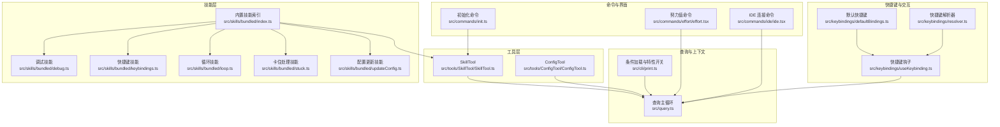
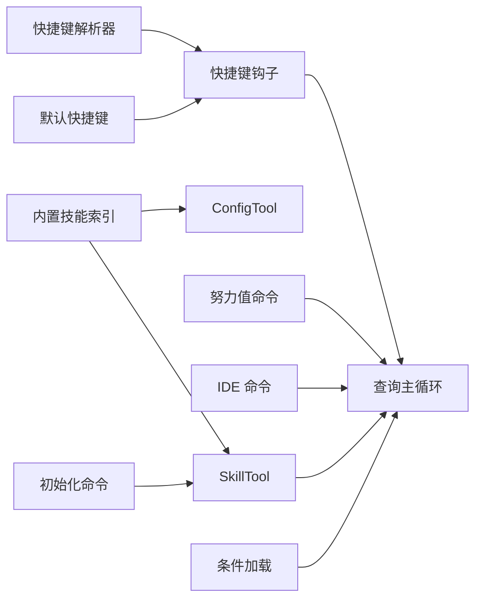

# 开发工具技能

<cite>
**本文引用的文件**
- [src/skills/bundled/index.ts](file://src/skills/bundled/index.ts)
- [src/skills/bundled/debug.ts](file://src/skills/bundled/debug.ts)
- [src/skills/bundled/keybindings.ts](file://src/skills/bundled/keybindings.ts)
- [src/skills/bundled/loop.ts](file://src/skills/bundled/loop.ts)
- [src/skills/bundled/stuck.ts](file://src/skills/bundled/stuck.ts)
- [src/skills/bundled/updateConfig.ts](file://src/skills/bundled/updateConfig.ts)
- [src/tools/SkillTool/SkillTool.ts](file://src/tools/SkillTool/SkillTool.ts)
- [src/tools/ConfigTool/ConfigTool.ts](file://src/tools/ConfigTool/ConfigTool.ts)
- [src/commands/init.ts](file://src/commands/init.ts)
- [src/query.ts](file://src/query.ts)
- [src/cli/print.ts](file://src/cli/print.ts)
- [src/commands/effort/effort.tsx](file://src/commands/effort/effort.tsx)
- [src/commands/ide/ide.tsx](file://src/commands/ide/ide.tsx)
- [src/keybindings/defaultBindings.ts](file://src/keybindings/defaultBindings.ts)
- [src/keybindings/resolver.ts](file://src/keybindings/resolver.ts)
- [src/keybindings/useKeybinding.ts](file://src/keybindings/useKeybinding.ts)
- [src/services/skillSearch/skillSearch.ts](file://src/services/skillSearch/skillSearch.ts)
- [src/utils/suggestions/skillUsageTracking.ts](file://src/utils/suggestions/skillUsageTracking.ts)
- [src/utils/telemetry/skillLoadedEvent.ts](file://src/utils/telemetry/skillLoadedEvent.ts)
</cite>

## 目录
1. [简介](#简介)
2. [项目结构](#项目结构)
3. [核心组件](#核心组件)
4. [架构总览](#架构总览)
5. [详细组件分析](#详细组件分析)
6. [依赖关系分析](#依赖关系分析)
7. [性能考量](#性能考量)
8. [故障排除指南](#故障排除指南)
9. [结论](#结论)
10. [附录](#附录)

## 简介
本文件系统化梳理 Claude Code 的“开发工具技能”，围绕以下五大能力展开：调试技能、快捷键技能、循环技能、卡住处理技能与配置更新技能。文档从架构、组件、数据流、处理逻辑、集成点、错误处理与性能优化等维度进行深入解析，并结合具体开发场景给出使用建议、配置项说明与排障要点，帮助开发者高效利用技能提升开发效率。

## 项目结构
技能体系由“技能注册与加载”“工具层调用”“命令与界面层”“快捷键与交互层”“查询与上下文管理”等模块协同构成。核心路径如下：
- 技能注册与加载：src/skills/bundled/index.ts 负责聚合内置技能清单
- 工具层：src/tools/SkillTool/ 作为统一入口调用技能；src/tools/ConfigTool/ 提供配置类工具
- 命令与界面：src/commands/init.ts、src/commands/effort/effort.tsx、src/commands/ide/ide.tsx 等
- 快捷键与交互：src/keybindings/defaultBindings.ts、resolver.ts、useKeybinding.ts
- 查询与上下文：src/query.ts、src/cli/print.ts



图表来源
- [src/skills/bundled/index.ts](file://src/skills/bundled/index.ts)
- [src/skills/bundled/debug.ts](file://src/skills/bundled/debug.ts)
- [src/skills/bundled/keybindings.ts](file://src/skills/bundled/keybindings.ts)
- [src/skills/bundled/loop.ts](file://src/skills/bundled/loop.ts)
- [src/skills/bundled/stuck.ts](file://src/skills/bundled/stuck.ts)
- [src/skills/bundled/updateConfig.ts](file://src/skills/bundled/updateConfig.ts)
- [src/tools/SkillTool/SkillTool.ts](file://src/tools/SkillTool/SkillTool.ts)
- [src/tools/ConfigTool/ConfigTool.ts](file://src/tools/ConfigTool/ConfigTool.ts)
- [src/commands/init.ts](file://src/commands/init.ts)
- [src/commands/effort/effort.tsx](file://src/commands/effort/effort.tsx)
- [src/commands/ide/ide.tsx](file://src/commands/ide/ide.tsx)
- [src/keybindings/defaultBindings.ts](file://src/keybindings/defaultBindings.ts)
- [src/keybindings/resolver.ts](file://src/keybindings/resolver.ts)
- [src/keybindings/useKeybinding.ts](file://src/keybindings/useKeybinding.ts)
- [src/query.ts](file://src/query.ts)
- [src/cli/print.ts](file://src/cli/print.ts)

章节来源
- [src/skills/bundled/index.ts](file://src/skills/bundled/index.ts)
- [src/tools/SkillTool/SkillTool.ts](file://src/tools/SkillTool/SkillTool.ts)
- [src/tools/ConfigTool/ConfigTool.ts](file://src/tools/ConfigTool/ConfigTool.ts)
- [src/commands/init.ts](file://src/commands/init.ts)
- [src/commands/effort/effort.tsx](file://src/commands/effort/effort.tsx)
- [src/commands/ide/ide.tsx](file://src/commands/ide/ide.tsx)
- [src/keybindings/defaultBindings.ts](file://src/keybindings/defaultBindings.ts)
- [src/keybindings/resolver.ts](file://src/keybindings/resolver.ts)
- [src/keybindings/useKeybinding.ts](file://src/keybindings/useKeybinding.ts)
- [src/query.ts](file://src/query.ts)
- [src/cli/print.ts](file://src/cli/print.ts)

## 核心组件
- 内置技能索引：负责聚合调试、快捷键、循环、卡住处理、配置更新等技能，形成可被 SkillTool 调用的技能集合。
- SkillTool：统一的技能调用入口，接收技能名与参数，驱动查询循环执行相应技能。
- ConfigTool：面向配置的工具集，支持读写与校验配置，为“配置更新技能”提供基础能力。
- 命令与界面：初始化命令用于引导技能与钩子构建流程；努力值命令用于动态调整模型与资源策略；IDE 命令用于 IDE 连接与状态反馈。
- 快捷键系统：提供默认快捷键、解析器与钩子，将用户按键映射到技能或命令。
- 查询与上下文：查询主循环负责消息、工具使用、附件注入与状态流转，支撑技能执行的上下文与结果回传。

章节来源
- [src/skills/bundled/index.ts](file://src/skills/bundled/index.ts)
- [src/tools/SkillTool/SkillTool.ts](file://src/tools/SkillTool/SkillTool.ts)
- [src/tools/ConfigTool/ConfigTool.ts](file://src/tools/ConfigTool/ConfigTool.ts)
- [src/commands/init.ts](file://src/commands/init.ts)
- [src/commands/effort/effort.tsx](file://src/commands/effort/effort.tsx)
- [src/commands/ide/ide.tsx](file://src/commands/ide/ide.tsx)
- [src/keybindings/defaultBindings.ts](file://src/keybindings/defaultBindings.ts)
- [src/keybindings/resolver.ts](file://src/keybindings/resolver.ts)
- [src/keybindings/useKeybinding.ts](file://src/keybindings/useKeybinding.ts)
- [src/query.ts](file://src/query.ts)

## 架构总览
技能在系统中的运行时路径如下：用户通过命令或快捷键触发，SkillTool 将技能请求注入查询循环，查询循环根据技能类型选择执行策略（如工具使用、上下文附件、状态变更），最终返回结果或继续迭代。

```mermaid
sequenceDiagram
participant User as "用户"
participant Cmd as "命令/界面层"
participant Tool as "SkillTool"
participant Loop as "查询主循环(query.ts)"
participant Skill as "技能实现"
participant Cfg as "ConfigTool"
User->>Cmd : 触发技能/命令
Cmd->>Tool : 调用技能(skillName, args)
Tool->>Loop : 注入技能请求
Loop->>Skill : 解析并执行技能逻辑
Skill->>Cfg : 读取/写入配置(如需要)
Skill-->>Loop : 返回结果/附件/状态
Loop-->>Tool : 流式输出/完成信号
Tool-->>Cmd : 呈现结果
Cmd-->>User : 反馈与下一步提示
```

图表来源
- [src/tools/SkillTool/SkillTool.ts](file://src/tools/SkillTool/SkillTool.ts)
- [src/query.ts](file://src/query.ts)
- [src/tools/ConfigTool/ConfigTool.ts](file://src/tools/ConfigTool/ConfigTool.ts)
- [src/skills/bundled/index.ts](file://src/skills/bundled/index.ts)

## 详细组件分析

### 调试技能（debug）
- 作用：辅助开发者在复杂任务中定位问题，提供断点、日志、上下文快照与诊断信息，减少试错成本。
- 使用方法：
  - 通过命令或快捷键触发调试技能，进入调试模式后逐步执行并观察中间态。
  - 结合查询循环的状态与工具使用记录，定位失败环节。
- 集成方式：作为内置技能注册于索引，由 SkillTool 统一调度。
- 场景示例：
  - 大规模文本编辑失败：启用调试技能，分段执行并比对差异，快速锁定问题文件与操作序列。
  - 多工具协作超时：开启调试以记录各工具耗时与返回，识别瓶颈工具。
- 故障排除：
  - 若调试无输出，检查是否正确注入到查询循环以及工具权限。
  - 若上下文缺失，确认是否在技能执行前已加载必要附件。

章节来源
- [src/skills/bundled/debug.ts](file://src/skills/bundled/debug.ts)
- [src/tools/SkillTool/SkillTool.ts](file://src/tools/SkillTool/SkillTool.ts)
- [src/query.ts](file://src/query.ts)

### 快捷键技能（keybindings）
- 作用：将常用动作映射为一键操作，减少重复步骤，提升交互效率。
- 使用方法：
  - 默认快捷键定义于默认绑定表，可通过解析器与钩子在界面层生效。
  - 支持自定义快捷键与显示格式，便于团队协作与个人习惯适配。
- 集成方式：快捷键系统与 SkillTool 解耦，既可直接触发技能，也可触发命令或工具。
- 场景示例：
  - 批量切换 IDE 连接：使用快捷键一键连接目标 IDE 并获取状态反馈。
  - 快速打开/关闭调试：通过快捷键快速切换调试模式，避免菜单导航。
- 故障排除：
  - 快捷键冲突：检查默认绑定与保留快捷键，避免覆盖系统或 IDE 快捷键。
  - 解析失败：确认快捷键格式与解析器规则一致。

章节来源
- [src/skills/bundled/keybindings.ts](file://src/skills/bundled/keybindings.ts)
- [src/keybindings/defaultBindings.ts](file://src/keybindings/defaultBindings.ts)
- [src/keybindings/resolver.ts](file://src/keybindings/resolver.ts)
- [src/keybindings/useKeybinding.ts](file://src/keybindings/useKeybinding.ts)
- [src/commands/ide/ide.tsx](file://src/commands/ide/ide.tsx)

### 循环技能（loop）
- 作用：在需要重复执行的任务中自动编排迭代，降低人工干预，提升吞吐。
- 使用方法：
  - 指定循环范围与终止条件，技能按批次推进并汇总结果。
  - 在查询循环中注入循环控制附件，确保每次迭代上下文连贯。
- 场景示例：
  - 批量文件格式化：设定文件列表与格式化规则，循环技能自动逐个处理并生成差异报告。
  - 数据清洗流水线：多步清洗规则按顺序执行，循环技能负责协调与合并结果。
- 故障排除：
  - 循环中断：检查终止条件与异常处理分支，确保异常不会导致循环提前退出。
  - 上下文丢失：确认每轮迭代都携带必要的上下文附件。

章节来源
- [src/skills/bundled/loop.ts](file://src/skills/bundled/loop.ts)
- [src/query.ts](file://src/query.ts)

### 卡住处理技能（stuck）
- 作用：当任务长时间无进展或出现阻塞时，自动触发恢复流程，避免死循环或资源浪费。
- 使用方法：
  - 设置卡住阈值与恢复策略（如重试、降级、切换方案）。
  - 在查询循环中监控任务状态，一旦检测到卡住即启动恢复流程。
- 场景示例：
  - 编辑任务卡顿：检测到长时间无响应后，自动回滚至上一稳定版本并提示用户。
  - 网络请求超时：在多次重试无效后，切换到离线缓存或降级策略。
- 故障排除：
  - 阈值设置不当：根据任务类型与环境特征调整阈值，避免误判或漏判。
  - 恢复策略失效：验证恢复流程的前置条件与幂等性。

章节来源
- [src/skills/bundled/stuck.ts](file://src/skills/bundled/stuck.ts)
- [src/query.ts](file://src/query.ts)

### 配置更新技能（updateConfig）
- 作用：安全地更新与验证配置，支持增量更新、回滚与一致性校验，保障系统稳定性。
- 使用方法：
  - 通过命令引导构建流程，先加载钩子与校验 schema，再执行写入与验证。
  - 支持“仅钩子”模式，仅更新钩子而不改动其他配置。
- 场景示例：
  - 新增钩子：按照初始化命令的指引，构造钩子、测试、校验并通过后写入目标文件。
  - 批量配置迁移：使用配置更新技能一次性应用多个变更，自动回滚失败项。
- 故障排除：
  - 校验失败：检查 schema 与输入值，确保类型与约束满足要求。
  - 权限不足：确认写入目标文件的权限，必要时以管理员身份执行。

章节来源
- [src/skills/bundled/updateConfig.ts](file://src/skills/bundled/updateConfig.ts)
- [src/commands/init.ts](file://src/commands/init.ts)
- [src/tools/ConfigTool/ConfigTool.ts](file://src/tools/ConfigTool/ConfigTool.ts)

## 依赖关系分析
- 技能与工具：内置技能索引依赖 SkillTool 进行统一调度；部分技能会调用 ConfigTool 完成配置读写。
- 命令与界面：初始化命令、努力值命令与 IDE 命令为技能使用提供入口与上下文。
- 快捷键与交互：快捷键系统与查询循环解耦，既可直接触发技能，也可触发命令或工具。
- 特性开关与条件加载：通过条件加载机制按需引入模块，避免不必要的开销。



图表来源
- [src/skills/bundled/index.ts](file://src/skills/bundled/index.ts)
- [src/tools/SkillTool/SkillTool.ts](file://src/tools/SkillTool/SkillTool.ts)
- [src/tools/ConfigTool/ConfigTool.ts](file://src/tools/ConfigTool/ConfigTool.ts)
- [src/commands/init.ts](file://src/commands/init.ts)
- [src/commands/effort/effort.tsx](file://src/commands/effort/effort.tsx)
- [src/commands/ide/ide.tsx](file://src/commands/ide/ide.tsx)
- [src/keybindings/defaultBindings.ts](file://src/keybindings/defaultBindings.ts)
- [src/keybindings/resolver.ts](file://src/keybindings/resolver.ts)
- [src/keybindings/useKeybinding.ts](file://src/keybindings/useKeybinding.ts)
- [src/query.ts](file://src/query.ts)
- [src/cli/print.ts](file://src/cli/print.ts)

章节来源
- [src/skills/bundled/index.ts](file://src/skills/bundled/index.ts)
- [src/tools/SkillTool/SkillTool.ts](file://src/tools/SkillTool/SkillTool.ts)
- [src/tools/ConfigTool/ConfigTool.ts](file://src/tools/ConfigTool/ConfigTool.ts)
- [src/commands/init.ts](file://src/commands/init.ts)
- [src/commands/effort/effort.tsx](file://src/commands/effort/effort.tsx)
- [src/commands/ide/ide.tsx](file://src/commands/ide/ide.tsx)
- [src/keybindings/defaultBindings.ts](file://src/keybindings/defaultBindings.ts)
- [src/keybindings/resolver.ts](file://src/keybindings/resolver.ts)
- [src/keybindings/useKeybinding.ts](file://src/keybindings/useKeybinding.ts)
- [src/query.ts](file://src/query.ts)
- [src/cli/print.ts](file://src/cli/print.ts)

## 性能考量
- 条件加载与特性开关：通过条件加载减少冷启动与内存占用，仅在启用相关功能时引入模块。
- 查询循环优化：合理设置最大轮次与令牌预算，避免长尾任务拖慢整体性能。
- 快捷键解析：保持解析规则简洁，避免复杂正则导致的解析延迟。
- 配置更新：批量更新时采用事务式写入与原子回滚，减少磁盘 IO 与锁竞争。
- 循环与卡住：为循环设置合理的批大小与超时阈值，防止资源耗尽。

## 故障排除指南
- 调试技能无输出
  - 检查是否成功注入到查询循环；确认工具权限与上下文附件齐全。
  - 参考：[src/query.ts](file://src/query.ts)
- 快捷键不生效
  - 检查默认绑定与保留快捷键；确认解析器规则与钩子绑定正确。
  - 参考：[src/keybindings/defaultBindings.ts](file://src/keybindings/defaultBindings.ts)，[src/keybindings/resolver.ts](file://src/keybindings/resolver.ts)，[src/keybindings/useKeybinding.ts](file://src/keybindings/useKeybinding.ts)
- 循环卡死
  - 调整终止条件与阈值；确保异常分支能及时中断并回滚。
  - 参考：[src/skills/bundled/loop.ts](file://src/skills/bundled/loop.ts)，[src/query.ts](file://src/query.ts)
- 配置更新失败
  - 校验 schema 与输入值；检查写入权限；必要时回滚到上一个稳定版本。
  - 参考：[src/skills/bundled/updateConfig.ts](file://src/skills/bundled/updateConfig.ts)，[src/tools/ConfigTool/ConfigTool.ts](file://src/tools/ConfigTool/ConfigTool.ts)
- IDE 连接失败
  - 检查连接超时与客户端状态；确认 MCP 服务器可用性与认证。
  - 参考：[src/commands/ide/ide.tsx](file://src/commands/ide/ide.tsx)

章节来源
- [src/query.ts](file://src/query.ts)
- [src/keybindings/defaultBindings.ts](file://src/keybindings/defaultBindings.ts)
- [src/keybindings/resolver.ts](file://src/keybindings/resolver.ts)
- [src/keybindings/useKeybinding.ts](file://src/keybindings/useKeybinding.ts)
- [src/skills/bundled/loop.ts](file://src/skills/bundled/loop.ts)
- [src/skills/bundled/updateConfig.ts](file://src/skills/bundled/updateConfig.ts)
- [src/tools/ConfigTool/ConfigTool.ts](file://src/tools/ConfigTool/ConfigTool.ts)
- [src/commands/ide/ide.tsx](file://src/commands/ide/ide.tsx)

## 结论
开发工具技能通过“调试—快捷键—循环—卡住—配置更新”的闭环设计，显著提升了开发效率与稳定性。借助 SkillTool 的统一调度、查询循环的上下文管理与快捷键系统的低摩擦交互，开发者可以更专注于业务逻辑本身。建议在团队内统一快捷键规范与配置更新流程，并结合特性开关按需启用高级能力，持续优化性能与可靠性。

## 附录
- 技能搜索与使用追踪：通过技能搜索服务与使用追踪，持续改进技能推荐与加载体验。
- 技能加载事件：记录技能加载事件，便于诊断与审计。

章节来源
- [src/services/skillSearch/skillSearch.ts](file://src/services/skillSearch/skillSearch.ts)
- [src/utils/suggestions/skillUsageTracking.ts](file://src/utils/suggestions/skillUsageTracking.ts)
- [src/utils/telemetry/skillLoadedEvent.ts](file://src/utils/telemetry/skillLoadedEvent.ts)