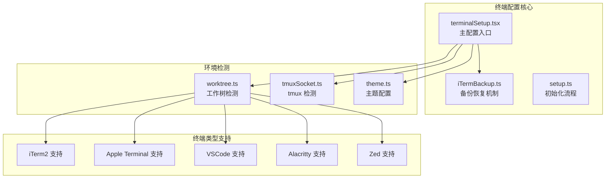
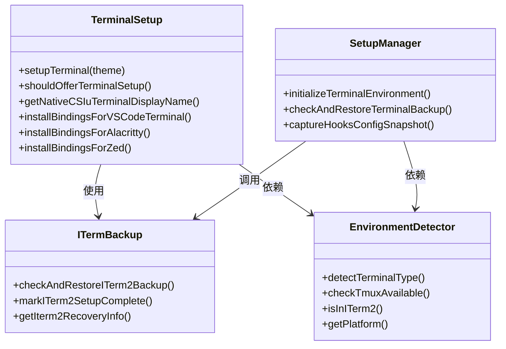
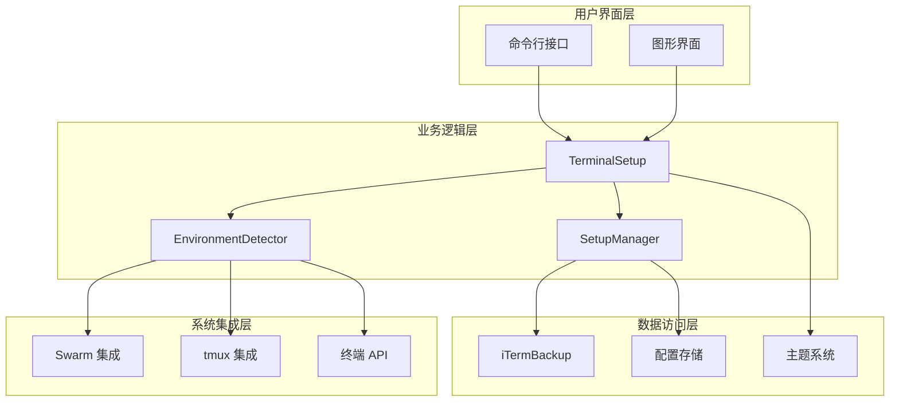
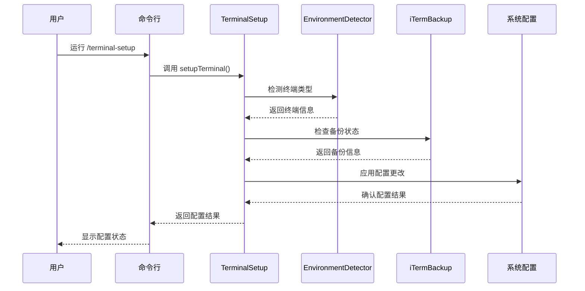
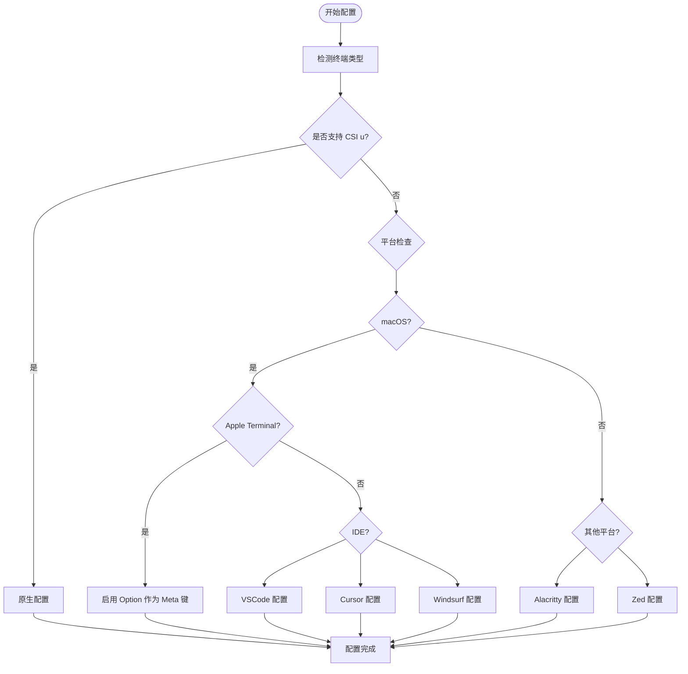
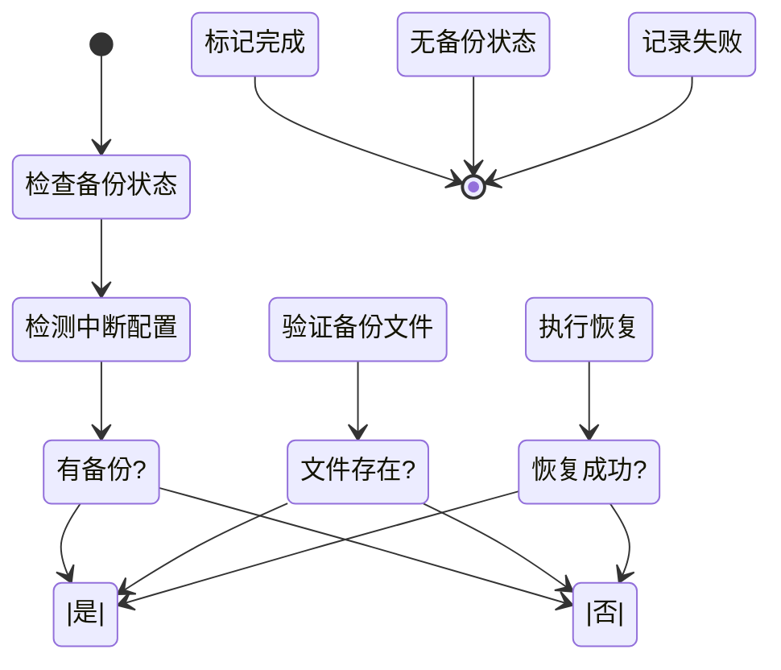
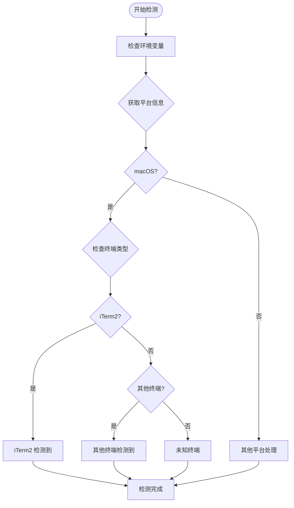
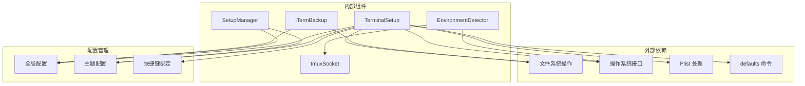

# It2 环境配置

<cite>
**本文档引用的文件**
- [src/commands/terminalSetup/terminalSetup.tsx](file://src/commands/terminalSetup/terminalSetup.tsx)
- [src/utils/iTermBackup.ts](file://src/utils/iTermBackup.ts)
- [src/setup.ts](file://src/setup.ts)
- [src/utils/worktree.ts](file://src/utils/worktree.ts)
- [src/utils/tmuxSocket.ts](file://src/utils/tmuxSocket.ts)
- [src/utils/theme.ts](file://src/utils/theme.ts)
</cite>

## 目录
1. [简介](#简介)
2. [项目结构](#项目结构)
3. [核心组件](#核心组件)
4. [架构概览](#架构概览)
5. [详细组件分析](#详细组件分析)
6. [依赖关系分析](#依赖关系分析)
7. [性能考虑](#性能考虑)
8. [故障排除指南](#故障排除指南)
9. [结论](#结论)

## 简介

It2 环境配置是 Claude Code 项目中用于优化 iTerm2 终端体验的核心功能模块。该系统提供了完整的终端环境检测、自动配置、备份恢复和集成管理能力，确保用户在使用 Claude Code 时获得最佳的交互体验。

本系统主要解决以下关键问题：
- iTerm2 终端的自动检测和配置
- 多种终端类型的兼容性支持
- 配置变更的备份和恢复机制
- 与 Swarm 功能的深度集成
- 跨平台的终端适配

## 项目结构

It2 环境配置功能主要分布在以下几个核心文件中：

**图表来源**
- [src/commands/terminalSetup/terminalSetup.tsx:1-531](file://src/commands/terminalSetup/terminalSetup.tsx#L1-L531)
- [src/utils/iTermBackup.ts:1-74](file://src/utils/iTermBackup.ts#L1-L74)
- [src/setup.ts:112-169](file://src/setup.ts#L112-L169)

**章节来源**
- [src/commands/terminalSetup/terminalSetup.tsx:1-531](file://src/commands/terminalSetup/terminalSetup.tsx#L1-L531)
- [src/utils/iTermBackup.ts:1-74](file://src/utils/iTermBackup.ts#L1-L74)
- [src/setup.ts:112-169](file://src/setup.ts#L112-L169)

## 核心组件

### 主要组件概述

It2 环境配置系统包含以下核心组件：

1. **终端检测器** - 自动识别当前运行的终端类型
2. **配置管理器** - 处理各种终端的配置设置
3. **备份恢复系统** - 确保配置变更的安全性
4. **集成协调器** - 管理与 Swarm 功能的集成
5. **主题管理系统** - 提供一致的颜色方案

### 组件关系图

**图表来源**
- [src/commands/terminalSetup/terminalSetup.tsx:79-126](file://src/commands/terminalSetup/terminalSetup.tsx#L79-L126)
- [src/utils/iTermBackup.ts:43-73](file://src/utils/iTermBackup.ts#L43-L73)
- [src/setup.ts:112-169](file://src/setup.ts#L112-L169)

**章节来源**
- [src/commands/terminalSetup/terminalSetup.tsx:79-126](file://src/commands/terminalSetup/terminalSetup.tsx#L79-L126)
- [src/utils/iTermBackup.ts:43-73](file://src/utils/iTermBackup.ts#L43-L73)
- [src/setup.ts:112-169](file://src/setup.ts#L112-L169)

## 架构概览

### 整体架构设计

It2 环境配置采用分层架构设计，确保功能模块的清晰分离和可维护性：

**图表来源**
- [src/commands/terminalSetup/terminalSetup.tsx:142-185](file://src/commands/terminalSetup/terminalSetup.tsx#L142-L185)
- [src/utils/iTermBackup.ts:14-23](file://src/utils/iTermBackup.ts#L14-L23)
- [src/setup.ts:112-169](file://src/setup.ts#L112-L169)

### 数据流架构

**图表来源**
- [src/commands/terminalSetup/terminalSetup.tsx:142-185](file://src/commands/terminalSetup/terminalSetup.tsx#L142-L185)
- [src/utils/iTermBackup.ts:43-73](file://src/utils/iTermBackup.ts#L43-L73)

**章节来源**
- [src/commands/terminalSetup/terminalSetup.tsx:142-185](file://src/commands/terminalSetup/terminalSetup.tsx#L142-L185)
- [src/utils/iTermBackup.ts:43-73](file://src/utils/iTermBackup.ts#L43-L73)

## 详细组件分析

### 终端配置管理器

#### 核心功能实现

TerminalSetup 类是整个 It2 配置系统的核心，负责处理各种终端类型的配置：

**图表来源**
- [src/commands/terminalSetup/terminalSetup.tsx:79-126](file://src/commands/terminalSetup/terminalSetup.tsx#L79-L126)
- [src/commands/terminalSetup/terminalSetup.tsx:194-269](file://src/commands/terminalSetup/terminalSetup.tsx#L194-L269)

#### 配置选项详解

系统支持以下终端类型的配置：

| 终端类型 | 支持特性 | 配置内容 |
|---------|----------|----------|
| iTerm2 | 原生 CSI u 支持 | 无额外配置需求 |
| Apple Terminal | Option 作为 Meta 键 | 启用 Option+Enter 新行输入 |
| VSCode | Shift+Enter 快捷键 | 安装 VSCode 终端快捷键绑定 |
| Cursor | Shift+Enter 快捷键 | 安装 Cursor 终端快捷键绑定 |
| Windsurf | Shift+Enter 快捷键 | 安装 Windsurf 终端快捷键绑定 |
| Alacritty | Shift+Enter 快捷键 | 修改 alacritty.toml 配置文件 |
| Zed | Shift+Enter 快捷键 | 添加 Zed 键盘映射 |

**章节来源**
- [src/commands/terminalSetup/terminalSetup.tsx:79-126](file://src/commands/terminalSetup/terminalSetup.tsx#L79-L126)
- [src/commands/terminalSetup/terminalSetup.tsx:194-269](file://src/commands/terminalSetup/terminalSetup.tsx#L194-L269)

### 备份恢复系统

#### 恢复机制设计

iTermBackup 模块提供了完整的配置备份和恢复功能：

**图表来源**
- [src/utils/iTermBackup.ts:43-73](file://src/utils/iTermBackup.ts#L43-L73)

#### 恢复流程详解

备份恢复系统的工作流程如下：

1. **状态检查** - 检查是否有正在进行的配置
2. **备份验证** - 验证备份文件的有效性
3. **文件恢复** - 将备份文件恢复到原始位置
4. **状态更新** - 更新配置状态标记

**章节来源**
- [src/utils/iTermBackup.ts:43-73](file://src/utils/iTermBackup.ts#L43-L73)

### 环境检测机制

#### 终端类型检测

EnvironmentDetector 负责准确识别当前运行的终端环境：

**图表来源**
- [src/utils/worktree.ts:1373-1393](file://src/utils/worktree.ts#L1373-L1393)

#### tmux 集成检测

系统还提供了 tmux 集成检测功能：

**章节来源**
- [src/utils/worktree.ts:1373-1393](file://src/utils/worktree.ts#L1373-L1393)
- [src/utils/tmuxSocket.ts:151-180](file://src/utils/tmuxSocket.ts#L151-L180)

### 主题管理系统

#### 颜色方案配置

Theme 系统提供了多种预定义的颜色方案：

| 主题类型 | 特点 | 适用场景 |
|---------|------|----------|
| Light Theme | 浅色背景，深色文字 | 白天工作环境 |
| Dark Theme | 深色背景，浅色文字 | 夜间工作环境 |
| Light Daltonized | 色盲友好设计 | 色觉障碍用户 |
| Dark Daltonized | 色盲友好深色主题 | 色觉障碍用户夜间使用 |

**章节来源**
- [src/utils/theme.ts:111-542](file://src/utils/theme.ts#L111-L542)

## 依赖关系分析

### 组件依赖图

**图表来源**
- [src/commands/terminalSetup/terminalSetup.tsx:13-23](file://src/commands/terminalSetup/terminalSetup.tsx#L13-L23)
- [src/utils/iTermBackup.ts:1-6](file://src/utils/iTermBackup.ts#L1-L6)
- [src/setup.ts:160-169](file://src/setup.ts#L160-L169)

### 关键依赖关系

系统的关键依赖关系包括：

1. **文件系统操作** - 用于配置文件的读写和备份
2. **操作系统接口** - 获取平台信息和执行系统命令
3. **Plist 处理** - iTerm2 配置文件的解析和修改
4. **全局配置管理** - 统一的配置存储和状态管理

**章节来源**
- [src/commands/terminalSetup/terminalSetup.tsx:13-23](file://src/commands/terminalSetup/terminalSetup.tsx#L13-L23)
- [src/utils/iTermBackup.ts:1-6](file://src/utils/iTermBackup.ts#L1-L6)
- [src/setup.ts:160-169](file://src/setup.ts#L160-L169)

## 性能考虑

### 性能优化策略

It2 环境配置系统采用了多项性能优化措施：

1. **异步操作** - 所有文件操作和系统调用都采用异步模式
2. **缓存机制** - 终端可用性检测结果会被缓存
3. **条件加载** - 只在需要时才加载相关模块
4. **错误隔离** - 单个组件的失败不会影响整体系统

### 内存使用优化

系统通过以下方式优化内存使用：
- 按需加载配置文件
- 及时释放临时资源
- 避免重复的文件读取操作

## 故障排除指南

### 常见问题及解决方案

#### 配置应用失败

**问题描述**：配置更改无法应用到目标终端

**可能原因**：
1. 权限不足
2. 终端未正确重启
3. 配置文件被其他程序锁定

**解决步骤**：
1. 确认具有足够的文件系统权限
2. 重新启动目标终端应用程序
3. 关闭可能锁定配置文件的其他程序

#### 备份恢复失败

**问题描述**：配置备份无法正确恢复

**诊断步骤**：
1. 检查备份文件是否存在且可访问
2. 验证备份文件的完整性
3. 确认目标路径的写入权限

**解决方法**：
1. 手动复制备份文件到目标位置
2. 使用系统提供的恢复命令
3. 检查磁盘空间和权限设置

#### 终端检测错误

**问题描述**：系统无法正确识别当前终端类型

**排查方法**：
1. 检查环境变量设置
2. 验证终端应用程序的安装状态
3. 确认系统路径配置正确

**章节来源**
- [src/utils/iTermBackup.ts:66-73](file://src/utils/iTermBackup.ts#L66-L73)
- [src/commands/terminalSetup/terminalSetup.tsx:358-371](file://src/commands/terminalSetup/terminalSetup.tsx#L358-L371)

### 调试工具和日志

系统提供了完善的调试和日志记录功能：

1. **错误日志** - 记录所有配置操作的错误信息
2. **调试输出** - 提供详细的执行过程信息
3. **状态报告** - 显示当前配置状态和版本信息

## 结论

It2 环境配置系统是一个功能完整、设计合理的终端配置管理解决方案。它通过以下特点确保了良好的用户体验：

1. **全面的终端支持** - 支持主流终端应用程序的配置
2. **安全的配置管理** - 提供完整的备份和恢复机制
3. **智能的环境检测** - 自动识别和适配不同的终端环境
4. **优雅的错误处理** - 提供清晰的错误信息和恢复指导
5. **跨平台兼容性** - 支持 macOS、Windows 和 Linux 平台

该系统为用户提供了无缝的终端配置体验，特别是在使用 Claude Code 的 Swarm 功能时，能够确保最佳的交互效果和工作流程效率。